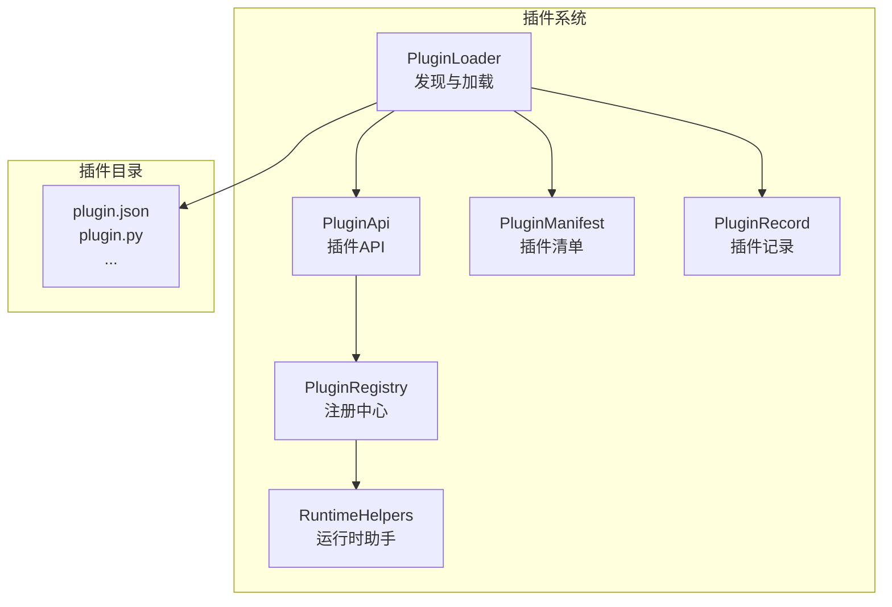
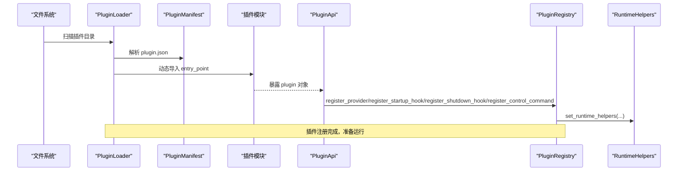
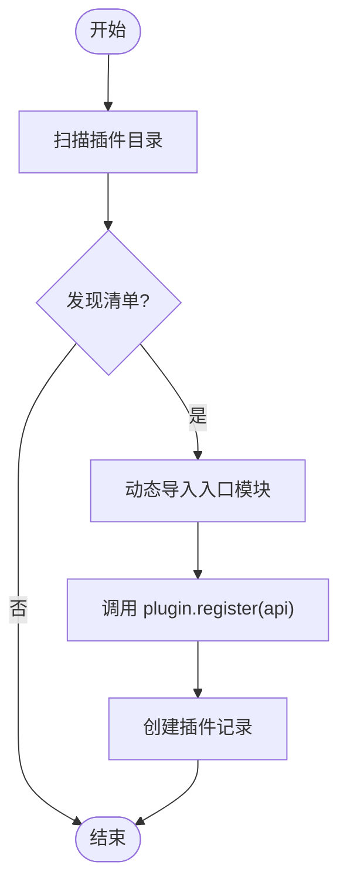
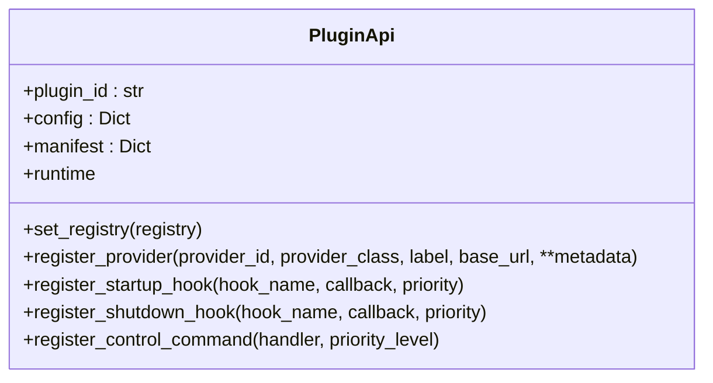
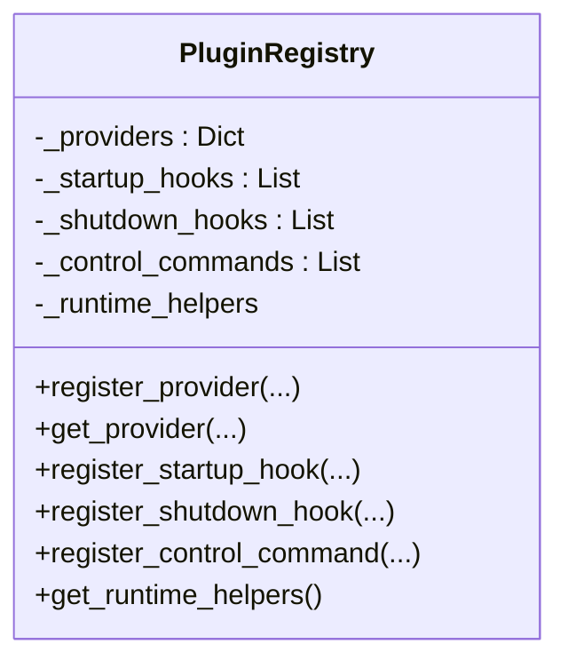
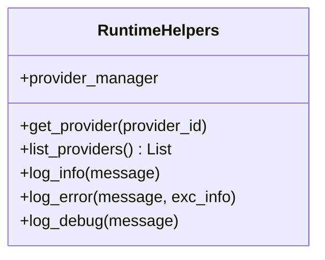
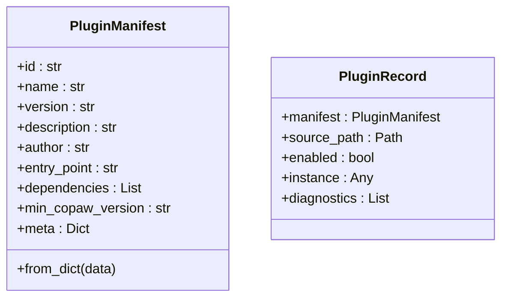
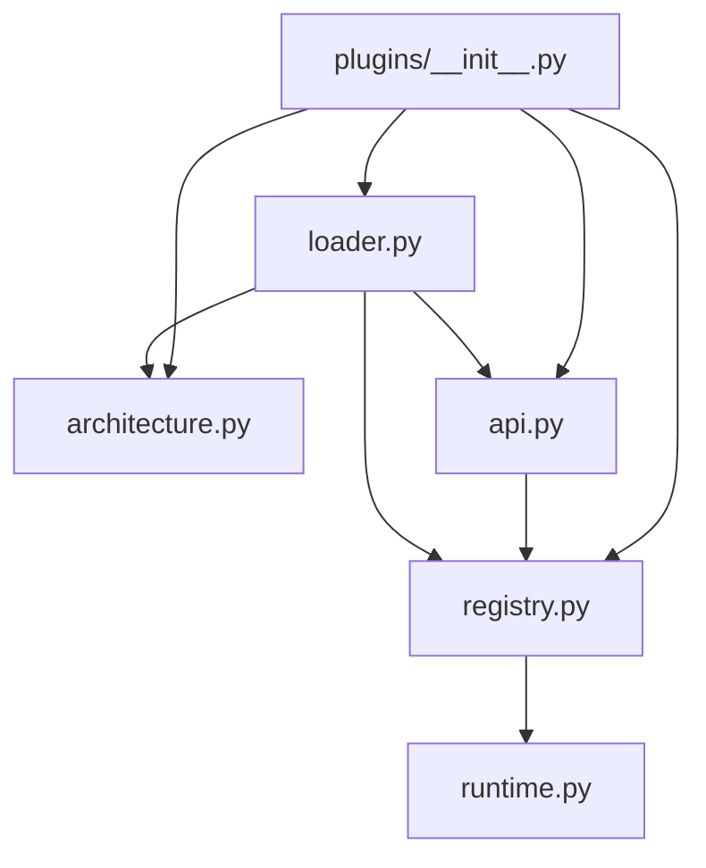

# 插件示例和模板

<cite>
**本文引用的文件**
- [src/copaw/plugins/__init__.py](file://src/copaw/plugins/__init__.py)
- [src/copaw/plugins/api.py](file://src/copaw/plugins/api.py)
- [src/copaw/plugins/architecture.py](file://src/copaw/plugins/architecture.py)
- [src/copaw/plugins/loader.py](file://src/copaw/plugins/loader.py)
- [src/copaw/plugins/registry.py](file://src/copaw/plugins/registry.py)
- [src/copaw/plugins/runtime.py](file://src/copaw/plugins/runtime.py)
- [working/skill_pool/skill.json](file://working/skill_pool/skill.json)
- [working/workspaces/default/skill.json](file://working/workspaces/default/skill.json)
- [working/workspaces/CoPaw_QA_Agent_0.1beta1/skill.json](file://working/workspaces/CoPaw_QA_Agent_0.1beta1/skill.json)
- [working/skill_pool/browser_cdp/README.md](file://working/skill_pool/browser_cdp/README.md)
- [working/skill_pool/dingtalk_channel/SKILL.md](file://working/skill_pool/dingtalk_channel/SKILL.md)
- [working/skill_pool/pdf/SKILL.md](file://working/skill_pool/pdf/SKILL.md)
- [working/skill_pool/docx/SKILL.md](file://working/skill_pool/docx/SKILL.md)
</cite>

## 目录
1. [引言](#引言)
2. [项目结构](#项目结构)
3. [核心组件](#核心组件)
4. [架构总览](#架构总览)
5. [详细组件分析](#详细组件分析)
6. [依赖分析](#依赖分析)
7. [性能考虑](#性能考虑)
8. [故障排查指南](#故障排查指南)
9. [结论](#结论)
10. [附录](#附录)

## 引言
本文件面向希望基于 CoPaw 开发插件的开发者，提供从入门到进阶的示例与模板资源，覆盖三类典型插件类型：
- 简单工具插件：最小化实现，聚焦单一能力注册（如注册一个自定义 LLM 提供商）
- 复杂技能扩展插件：围绕内置技能池扩展能力，提供更丰富的交互与自动化
- 渠道适配插件：对接第三方通讯渠道（如钉钉、飞书等），实现消息通道的自动化配置与交互

文档包含完整的项目结构、配置文件与实现思路说明，并提供可直接复用的模板骨架与最佳实践，帮助不同经验水平的开发者快速上手。

## 项目结构
CoPaw 插件系统的核心由以下模块组成：
- 插件加载与发现：扫描插件目录，解析 plugin.json，动态导入插件模块
- 插件注册中心：集中管理提供商、启动/关闭钩子、控制命令处理器
- 插件 API：为插件提供注册接口（提供商、钩子、控制命令）
- 插件清单与记录：描述插件元数据与加载状态
- 运行时助手：为插件提供日志、提供商查询、列表等辅助能力

图表来源
- [src/copaw/plugins/loader.py:19-241](file://src/copaw/plugins/loader.py#L19-L241)
- [src/copaw/plugins/registry.py:42-254](file://src/copaw/plugins/registry.py#L42-L254)
- [src/copaw/plugins/api.py:10-186](file://src/copaw/plugins/api.py#L10-L186)
- [src/copaw/plugins/architecture.py:9-55](file://src/copaw/plugins/architecture.py#L9-L55)
- [src/copaw/plugins/runtime.py:10-68](file://src/copaw/plugins/runtime.py#L10-L68)

章节来源
- [src/copaw/plugins/__init__.py:1-16](file://src/copaw/plugins/__init__.py#L1-L16)
- [src/copaw/plugins/loader.py:19-241](file://src/copaw/plugins/loader.py#L19-L241)
- [src/copaw/plugins/registry.py:42-254](file://src/copaw/plugins/registry.py#L42-L254)
- [src/copaw/plugins/api.py:10-186](file://src/copaw/plugins/api.py#L10-L186)
- [src/copaw/plugins/architecture.py:9-55](file://src/copaw/plugins/architecture.py#L9-L55)
- [src/copaw/plugins/runtime.py:10-68](file://src/copaw/plugins/runtime.py#L10-L68)

## 核心组件
- 插件清单（PluginManifest）：描述插件标识、名称、版本、入口文件、依赖与最小 CoPaw 版本等
- 插件记录（PluginRecord）：记录已加载插件的清单、源路径、启用状态、实例与诊断信息
- 插件 API（PluginApi）：插件注册入口，支持注册提供商、启动/关闭钩子、控制命令处理器
- 注册中心（PluginRegistry）：集中存储与排序钩子、命令处理器，提供运行时助手访问
- 加载器（PluginLoader）：扫描目录、解析清单、动态导入插件模块并调用其 register 方法
- 运行时助手（RuntimeHelpers）：提供日志、提供商查询与列表等能力

章节来源
- [src/copaw/plugins/architecture.py:9-55](file://src/copaw/plugins/architecture.py#L9-L55)
- [src/copaw/plugins/api.py:10-186](file://src/copaw/plugins/api.py#L10-L186)
- [src/copaw/plugins/registry.py:42-254](file://src/copaw/plugins/registry.py#L42-L254)
- [src/copaw/plugins/loader.py:19-241](file://src/copaw/plugins/loader.py#L19-L241)
- [src/copaw/plugins/runtime.py:10-68](file://src/copaw/plugins/runtime.py#L10-L68)

## 架构总览
下图展示了插件从发现到注册、再到运行时使用的整体流程：

图表来源
- [src/copaw/plugins/loader.py:84-191](file://src/copaw/plugins/loader.py#L84-L191)
- [src/copaw/plugins/api.py:43-175](file://src/copaw/plugins/api.py#L43-L175)
- [src/copaw/plugins/registry.py:73-253](file://src/copaw/plugins/registry.py#L73-L253)
- [src/copaw/plugins/runtime.py:13-68](file://src/copaw/plugins/runtime.py#L13-L68)

## 详细组件分析

### 组件 A：插件加载与发现（PluginLoader）
职责
- 扫描插件目录，查找包含 plugin.json 的插件包
- 解析清单，动态导入插件入口模块
- 调用插件的 register(api) 方法完成注册
- 记录已加载插件的状态与诊断信息

关键流程
- 发现阶段：遍历插件目录，定位 plugin.json 并解析为清单对象
- 导入阶段：使用唯一模块名与子路径搜索位置，启用相对导入
- 注册阶段：调用插件对象的 register 方法（同步或异步）

图表来源
- [src/copaw/plugins/loader.py:32-191](file://src/copaw/plugins/loader.py#L32-L191)

章节来源
- [src/copaw/plugins/loader.py:19-241](file://src/copaw/plugins/loader.py#L19-L241)

### 组件 B：插件 API（PluginApi）
职责
- 为插件提供统一的注册接口
- 支持注册提供商、启动/关闭钩子、控制命令处理器
- 提供运行时助手访问入口

使用要点
- 注册提供商时可合并插件清单中的 meta 信息
- 钩子支持优先级排序，数值越小越早执行
- 控制命令处理器需遵循统一的命令优先级

图表来源
- [src/copaw/plugins/api.py:10-186](file://src/copaw/plugins/api.py#L10-L186)

章节来源
- [src/copaw/plugins/api.py:10-186](file://src/copaw/plugins/api.py#L10-L186)

### 组件 C：注册中心（PluginRegistry）
职责
- 存储提供商、启动/关闭钩子、控制命令处理器
- 提供运行时助手的设置与访问
- 钩子按优先级排序，确保执行顺序可控

图表来源
- [src/copaw/plugins/registry.py:42-254](file://src/copaw/plugins/registry.py#L42-L254)

章节来源
- [src/copaw/plugins/registry.py:42-254](file://src/copaw/plugins/registry.py#L42-L254)

### 组件 D：运行时助手（RuntimeHelpers）
职责
- 提供日志记录、提供商查询与列表等运行时能力
- 作为插件访问系统能力的统一入口

图表来源
- [src/copaw/plugins/runtime.py:10-68](file://src/copaw/plugins/runtime.py#L10-L68)

章节来源
- [src/copaw/plugins/runtime.py:10-68](file://src/copaw/plugins/runtime.py#L10-L68)

### 组件 E：插件清单与记录（PluginManifest/PluginRecord）
职责
- 插件清单描述插件元数据与最小兼容版本
- 插件记录跟踪加载状态与诊断信息

图表来源
- [src/copaw/plugins/architecture.py:9-55](file://src/copaw/plugins/architecture.py#L9-L55)

章节来源
- [src/copaw/plugins/architecture.py:9-55](file://src/copaw/plugins/architecture.py#L9-L55)

## 依赖分析
插件系统内部模块之间的依赖关系如下：

图表来源
- [src/copaw/plugins/__init__.py:1-16](file://src/copaw/plugins/__init__.py#L1-L16)
- [src/copaw/plugins/loader.py:12-14](file://src/copaw/plugins/loader.py#L12-L14)
- [src/copaw/plugins/registry.py:42-71](file://src/copaw/plugins/registry.py#L42-L71)
- [src/copaw/plugins/api.py:4-6](file://src/copaw/plugins/api.py#L4-L6)
- [src/copaw/plugins/architecture.py:4-6](file://src/copaw/plugins/architecture.py#L4-L6)
- [src/copaw/plugins/runtime.py:4-6](file://src/copaw/plugins/runtime.py#L4-L6)

章节来源
- [src/copaw/plugins/__init__.py:1-16](file://src/copaw/plugins/__init__.py#L1-L16)

## 性能考虑
- 插件发现与加载
  - 插件目录扫描为 O(N) 操作，N 为目录项数量；建议合理组织插件目录层级，避免过多嵌套
  - 动态导入模块时启用子路径搜索位置，避免污染全局 sys.path，提升安全性
- 注册与排序
  - 钩子注册后按优先级排序，排序成本 O(M log M)，M 为钩子数量；建议合理设置优先级，减少不必要的排序
- 运行时访问
  - 运行时助手提供日志与提供商查询，避免插件直接访问底层系统组件，降低耦合度

## 故障排查指南
- 插件入口缺失
  - 现象：找不到 entry_point 文件或插件模块未导出 plugin 对象
  - 处理：检查 plugin.json 的 entry_point 字段与插件目录结构
- 注册失败
  - 现象：插件 register 方法抛出异常
  - 处理：检查插件实现是否正确调用 PluginApi 的注册方法，关注优先级与参数合法性
- 提供商冲突
  - 现象：重复注册同一提供商 ID
  - 处理：确保提供商 ID 唯一，或在注册时处理冲突逻辑
- 日志与诊断
  - 使用运行时助手的日志接口输出关键信息，结合插件记录中的诊断信息定位问题

章节来源
- [src/copaw/plugins/loader.py:104-197](file://src/copaw/plugins/loader.py#L104-L197)
- [src/copaw/plugins/registry.py:95-112](file://src/copaw/plugins/registry.py#L95-L112)
- [src/copaw/plugins/runtime.py:44-68](file://src/copaw/plugins/runtime.py#L44-L68)

## 结论
CoPaw 插件系统提供了清晰的加载、注册与运行时访问机制，开发者可通过统一的 API 实现各类插件能力。本文档给出了从简单到复杂的示例模板与最佳实践，帮助不同经验水平的开发者快速构建高质量插件。

## 附录

### 示例与模板清单
- 简单工具插件模板
  - 目标：注册一个自定义 LLM 提供商
  - 关键点：实现 register(api) 方法，调用 api.register_provider(...) 完成注册
  - 参考实现路径：[src/copaw/plugins/api.py:43-87](file://src/copaw/plugins/api.py#L43-L87)
- 复杂技能扩展插件模板
  - 目标：扩展内置技能池，提供更丰富的交互与自动化
  - 参考：技能池清单与工作区技能清单
  - 参考路径：
    - [working/skill_pool/skill.json:1-370](file://working/skill_pool/skill.json#L1-L370)
    - [working/workspaces/default/skill.json:1-5](file://working/workspaces/default/skill.json#L1-L5)
    - [working/workspaces/CoPaw_QA_Agent_0.1beta1/skill.json:1-60](file://working/workspaces/CoPaw_QA_Agent_0.1beta1/skill.json#L1-L60)
- 渠道适配插件模板
  - 目标：对接第三方通讯渠道（如钉钉），实现自动化配置与交互
  - 参考：钉钉频道技能文档
  - 参考路径：[working/skill_pool/dingtalk_channel/SKILL.md:1-193](file://working/skill_pool/dingtalk_channel/SKILL.md#L1-L193)

### 常见功能实现模式与代码片段路径
- 注册提供商
  - 代码片段路径：[src/copaw/plugins/api.py:43-87](file://src/copaw/plugins/api.py#L43-L87)
- 注册启动钩子
  - 代码片段路径：[src/copaw/plugins/api.py:89-119](file://src/copaw/plugins/api.py#L89-L119)
- 注册关闭钩子
  - 代码片段路径：[src/copaw/plugins/api.py:121-151](file://src/copaw/plugins/api.py#L121-L151)
- 注册控制命令处理器
  - 代码片段路径：[src/copaw/plugins/api.py:153-175](file://src/copaw/plugins/api.py#L153-L175)
- 获取运行时助手
  - 代码片段路径：[src/copaw/plugins/api.py:176-186](file://src/copaw/plugins/api.py#L176-L186)
- 运行时日志与提供商查询
  - 代码片段路径：[src/copaw/plugins/runtime.py:44-68](file://src/copaw/plugins/runtime.py#L44-L68)

### 技能扩展参考
- 浏览器 CDP 连接
  - 参考路径：[working/skill_pool/browser_cdp/README.md](file://working/skill_pool/browser_cdp/README.md)
- PDF 处理
  - 参考路径：[working/skill_pool/pdf/SKILL.md:1-330](file://working/skill_pool/pdf/SKILL.md#L1-L330)
- DOCX 文档处理
  - 参考路径：[working/skill_pool/docx/SKILL.md:1-488](file://working/skill_pool/docx/SKILL.md#L1-L488)