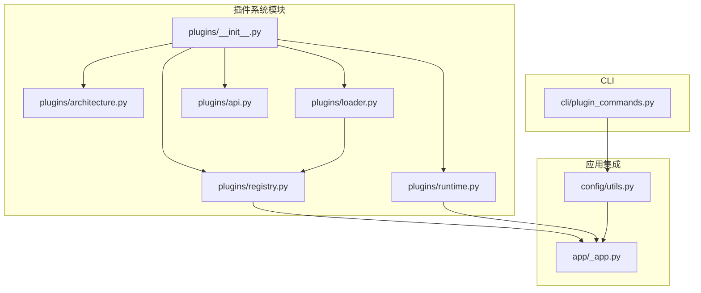
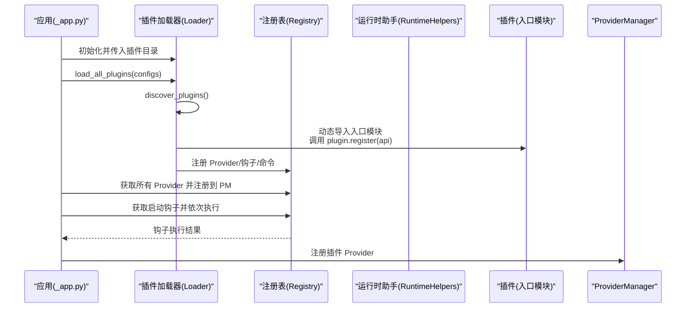
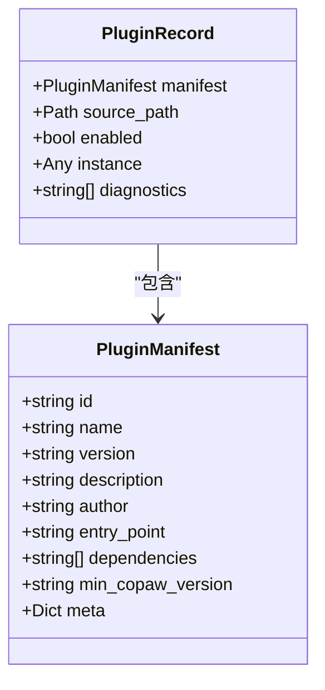
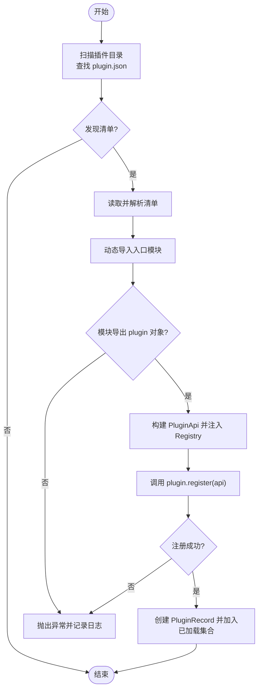
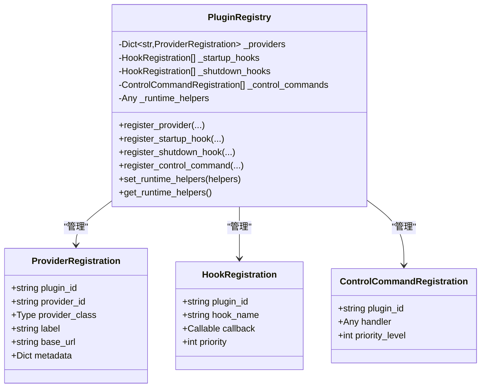
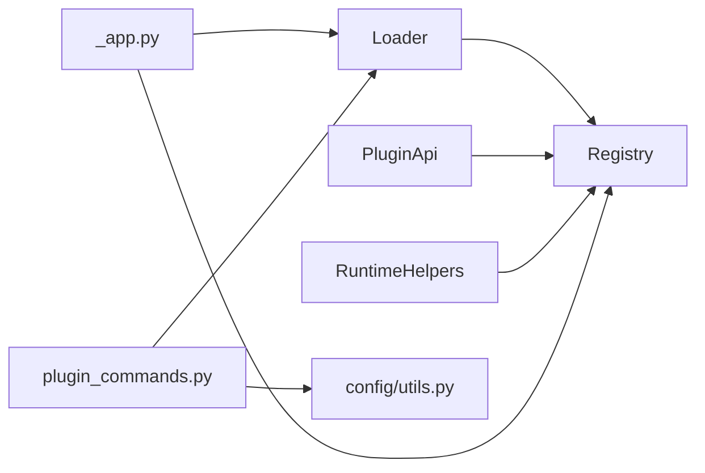

# 插件系统

<cite>
**本文引用的文件**
- [src/copaw/plugins/__init__.py](file://src/copaw/plugins/__init__.py)
- [src/copaw/plugins/architecture.py](file://src/copaw/plugins/architecture.py)
- [src/copaw/plugins/loader.py](file://src/copaw/plugins/loader.py)
- [src/copaw/plugins/registry.py](file://src/copaw/plugins/registry.py)
- [src/copaw/plugins/runtime.py](file://src/copaw/plugins/runtime.py)
- [src/copaw/plugins/api.py](file://src/copaw/plugins/api.py)
- [src/copaw/app/_app.py](file://src/copaw/app/_app.py)
- [src/copaw/cli/plugin_commands.py](file://src/copaw/cli/plugin_commands.py)
- [src/copaw/config/utils.py](file://src/copaw/config/utils.py)
- [website/public/docs/plugins.en.md](file://website/public/docs/plugins.en.md)
- [website/public/docs/plugins.zh.md](file://website/public/docs/plugins.zh.md)
</cite>

## 目录
1. [简介](#简介)
2. [项目结构](#项目结构)
3. [核心组件](#核心组件)
4. [架构总览](#架构总览)
5. [详细组件分析](#详细组件分析)
6. [依赖分析](#依赖分析)
7. [性能考虑](#性能考虑)
8. [故障排查指南](#故障排查指南)
9. [结论](#结论)
10. [附录](#附录)

## 简介
CoPaw 的插件系统为扩展核心能力提供了标准化、可组合的机制，支持三大扩展点：
- 自定义 Provider：新增 LLM 提供商与模型
- 生命周期钩子：应用启动/关闭阶段注入自定义逻辑
- 控制命令：注册魔法命令（如 /status）

插件以“清单 + 入口”的形式被发现与加载，通过 PluginApi 将能力注册到全局 Registry，并在应用启动时统一执行。

## 项目结构
插件系统相关代码集中在 src/copaw/plugins 下，配合 CLI、配置与应用启动流程协同工作。

图示来源
- [src/copaw/plugins/__init__.py:1-16](file://src/copaw/plugins/__init__.py#L1-L16)
- [src/copaw/plugins/loader.py:19-241](file://src/copaw/plugins/loader.py#L19-L241)
- [src/copaw/plugins/registry.py:42-254](file://src/copaw/plugins/registry.py#L42-L254)
- [src/copaw/plugins/runtime.py:10-68](file://src/copaw/plugins/runtime.py#L10-L68)
- [src/copaw/plugins/api.py:10-186](file://src/copaw/plugins/api.py#L10-L186)
- [src/copaw/app/_app.py:270-374](file://src/copaw/app/_app.py#L270-L374)
- [src/copaw/config/utils.py:634-638](file://src/copaw/config/utils.py#L634-L638)
- [src/copaw/cli/plugin_commands.py:104-411](file://src/copaw/cli/plugin_commands.py#L104-L411)

章节来源
- [src/copaw/plugins/__init__.py:1-16](file://src/copaw/plugins/__init__.py#L1-L16)
- [src/copaw/plugins/loader.py:19-241](file://src/copaw/plugins/loader.py#L19-L241)
- [src/copaw/plugins/registry.py:42-254](file://src/copaw/plugins/registry.py#L42-L254)
- [src/copaw/plugins/runtime.py:10-68](file://src/copaw/plugins/runtime.py#L10-L68)
- [src/copaw/plugins/api.py:10-186](file://src/copaw/plugins/api.py#L10-L186)
- [src/copaw/app/_app.py:270-374](file://src/copaw/app/_app.py#L270-L374)
- [src/copaw/config/utils.py:634-638](file://src/copaw/config/utils.py#L634-L638)
- [src/copaw/cli/plugin_commands.py:104-411](file://src/copaw/cli/plugin_commands.py#L104-L411)

## 核心组件
- 插件清单与记录：定义插件元数据与加载后的记录
- 加载器：扫描目录、解析清单、动态导入入口模块、调用 register 并建立 API
- 注册表：集中管理 Provider、启动/关闭钩子、控制命令
- 运行时助手：向插件暴露运行期能力（如 ProviderManager 访问）
- 插件 API：开发者通过它注册能力
- 应用集成：在启动时加载插件、设置运行时助手、注册 Provider、执行钩子
- CLI：提供安装/卸载/列出/校验插件等命令

章节来源
- [src/copaw/plugins/architecture.py:9-55](file://src/copaw/plugins/architecture.py#L9-L55)
- [src/copaw/plugins/loader.py:19-241](file://src/copaw/plugins/loader.py#L19-L241)
- [src/copaw/plugins/registry.py:42-254](file://src/copaw/plugins/registry.py#L42-L254)
- [src/copaw/plugins/runtime.py:10-68](file://src/copaw/plugins/runtime.py#L10-L68)
- [src/copaw/plugins/api.py:10-186](file://src/copaw/plugins/api.py#L10-L186)
- [src/copaw/app/_app.py:270-374](file://src/copaw/app/_app.py#L270-L374)
- [src/copaw/cli/plugin_commands.py:104-411](file://src/copaw/cli/plugin_commands.py#L104-L411)

## 架构总览
下图展示从应用启动到插件加载、注册与钩子执行的全链路。

图示来源
- [src/copaw/app/_app.py:270-374](file://src/copaw/app/_app.py#L270-L374)
- [src/copaw/plugins/loader.py:199-221](file://src/copaw/plugins/loader.py#L199-L221)
- [src/copaw/plugins/registry.py:42-254](file://src/copaw/plugins/registry.py#L42-L254)
- [src/copaw/plugins/runtime.py:10-68](file://src/copaw/plugins/runtime.py#L10-L68)

## 详细组件分析

### 插件清单与记录
- PluginManifest：描述插件标识、名称、版本、描述、作者、入口文件、依赖、最低 CoPaw 版本、元信息等
- PluginRecord：记录已加载插件的清单、源路径、启用状态、实例、诊断信息

图示来源
- [src/copaw/plugins/architecture.py:9-55](file://src/copaw/plugins/architecture.py#L9-L55)

章节来源
- [src/copaw/plugins/architecture.py:9-55](file://src/copaw/plugins/architecture.py#L9-L55)

### 插件加载器
职责：
- 扫描插件目录，发现 plugin.json
- 解析清单，定位入口文件
- 动态导入入口模块，校验导出对象与 register 方法
- 通过 PluginApi 注册 Provider、钩子、控制命令
- 记录加载结果并支持查询

关键流程（加载单个插件）：

图示来源
- [src/copaw/plugins/loader.py:32-198](file://src/copaw/plugins/loader.py#L32-L198)

章节来源
- [src/copaw/plugins/loader.py:19-241](file://src/copaw/plugins/loader.py#L19-L241)

### 插件注册表
职责：
- Provider 注册：唯一性校验、存储 Provider 元信息
- 生命周期钩子：按优先级排序，支持启动/关闭钩子
- 控制命令：注册命令处理器，支持优先级
- 运行时助手：提供运行期能力访问

图示来源
- [src/copaw/plugins/registry.py:42-254](file://src/copaw/plugins/registry.py#L42-L254)

章节来源
- [src/copaw/plugins/registry.py:42-254](file://src/copaw/plugins/registry.py#L42-L254)

### 插件 API
职责：
- 提供 register_provider、register_startup_hook、register_shutdown_hook、register_control_command 等注册方法
- 暴露 runtime 辅助访问运行期能力

章节来源
- [src/copaw/plugins/api.py:10-186](file://src/copaw/plugins/api.py#L10-L186)

### 运行时助手
职责：
- 提供 ProviderManager 访问、列出 Provider、日志输出等

章节来源
- [src/copaw/plugins/runtime.py:10-68](file://src/copaw/plugins/runtime.py#L10-L68)

### 应用启动集成
- 在应用启动时初始化 PluginLoader，扫描并加载插件
- 读取配置中的插件配置，传递给加载器
- 设置运行时助手到 Registry
- 将插件注册的 Provider 注册到 ProviderManager
- 执行启动钩子（支持同步/异步）
- 执行关闭钩子（支持同步/异步）

章节来源
- [src/copaw/app/_app.py:270-374](file://src/copaw/app/_app.py#L270-L374)

### CLI 插件管理
- install：支持本地路径与 URL（ZIP）安装，自动校验清单与依赖
- list：列出已安装插件
- info：显示插件详情（含依赖、入口点、元信息）
- uninstall：卸载插件（需应用离线）
- validate：校验插件清单与入口点

章节来源
- [src/copaw/cli/plugin_commands.py:104-411](file://src/copaw/cli/plugin_commands.py#L104-L411)

## 依赖分析
- 插件系统模块内聚：各模块职责清晰，Loader 依赖 Registry，API 依赖 Registry，Runtime 作为 Registry 的辅助
- 应用集成耦合：应用启动流程依赖 Loader 与 Registry，并与 ProviderManager 协作
- CLI 与配置：CLI 依赖配置工具获取插件目录，安装时进行安全解压与依赖安装

图示来源
- [src/copaw/plugins/loader.py:19-241](file://src/copaw/plugins/loader.py#L19-L241)
- [src/copaw/plugins/registry.py:42-254](file://src/copaw/plugins/registry.py#L42-L254)
- [src/copaw/plugins/runtime.py:10-68](file://src/copaw/plugins/runtime.py#L10-L68)
- [src/copaw/app/_app.py:270-374](file://src/copaw/app/_app.py#L270-L374)
- [src/copaw/cli/plugin_commands.py:104-411](file://src/copaw/cli/plugin_commands.py#L104-L411)
- [src/copaw/config/utils.py:634-638](file://src/copaw/config/utils.py#L634-L638)

章节来源
- [src/copaw/plugins/loader.py:19-241](file://src/copaw/plugins/loader.py#L19-L241)
- [src/copaw/plugins/registry.py:42-254](file://src/copaw/plugins/registry.py#L42-L254)
- [src/copaw/plugins/runtime.py:10-68](file://src/copaw/plugins/runtime.py#L10-L68)
- [src/copaw/app/_app.py:270-374](file://src/copaw/app/_app.py#L270-L374)
- [src/copaw/cli/plugin_commands.py:104-411](file://src/copaw/cli/plugin_commands.py#L104-L411)
- [src/copaw/config/utils.py:634-638](file://src/copaw/config/utils.py#L634-L638)

## 性能考虑
- 异步钩子：Loader 与应用侧均支持异步钩子回调，避免阻塞启动序列
- 优先级排序：启动/关闭钩子按优先级排序，降低不必要的等待
- 动态导入：使用 importlib.spec_from_file_location，避免污染 sys.path，提升安全性与隔离性
- 依赖安装：CLI 在安装时处理 requirements.txt，失败回滚并清理

## 故障排查指南
常见问题与定位建议：
- 插件未加载
  - 使用 copaw plugin list 检查是否安装
  - 查看应用日志中插件加载与注册信息
  - 使用 copaw plugin info 检查清单格式
- 依赖安装失败
  - 检查 requirements.txt 格式
  - 手动 pip 安装验证
  - 使用 --force 重新安装
- Provider 未显示
  - 确认插件已安装并重启应用
  - 检查 Provider 注册日志
- 命令无效
  - 确认插件已安装
  - 检查启动钩子是否成功执行
  - 查看补丁日志

章节来源
- [website/public/docs/plugins.en.md:651-692](file://website/public/docs/plugins.en.md#L651-L692)
- [src/copaw/cli/plugin_commands.py:367-411](file://src/copaw/cli/plugin_commands.py#L367-L411)

## 结论
CoPaw 插件系统通过标准化的清单、动态加载与集中注册机制，为扩展 Provider、注入生命周期逻辑与自定义命令提供了清晰路径。结合 CLI 的安装/卸载与应用启动时的统一调度，形成了从开发到部署的完整闭环。建议插件开发者遵循命名规范、错误处理与日志记录的最佳实践，确保插件稳定可靠。

## 附录

### 开发者指南（基于官方文档）
- 基本结构
  - plugin.json（清单）
  - plugin.py（入口，导出 plugin 实例）
  - README.md（可选）
- 清单字段
  - id、name、version、description、author、entry_point、dependencies、min_copaw_version、meta
- 入口模块
  - 导出 plugin 实例，实现 register(api) 方法
- Provider 注册
  - 使用 api.register_provider(...) 注册自定义 Provider
- 生命周期钩子
  - 使用 api.register_startup_hook(...) 与 api.register_shutdown_hook(...)
  - 支持同步/异步回调，支持优先级
- 控制命令
  - 使用 api.register_control_command(...) 注册命令处理器
- 运行时访问
  - 通过 api.runtime 访问运行时助手（如 ProviderManager）

章节来源
- [website/public/docs/plugins.en.md:133-196](file://website/public/docs/plugins.en.md#L133-L196)
- [website/public/docs/plugins.en.md:197-560](file://website/public/docs/plugins.en.md#L197-L560)
- [website/public/docs/plugins.en.md:700-791](file://website/public/docs/plugins.en.md#L700-L791)
- [website/public/docs/plugins.zh.md:133-196](file://website/public/docs/plugins.zh.md#L133-L196)
- [website/public/docs/plugins.zh.md:197-560](file://website/public/docs/plugins.zh.md#L197-L560)
- [website/public/docs/plugins.zh.md:792-809](file://website/public/docs/plugins.zh.md#L792-L809)

### 插件清单与入口约定
- 清单文件：plugin.json
- 入口文件：默认 plugin.py，可通过 entry_point 字段自定义
- 插件目录：由配置工具提供（PLUGINS_DIR）

章节来源
- [src/copaw/plugins/architecture.py:18-43](file://src/copaw/plugins/architecture.py#L18-L43)
- [src/copaw/config/utils.py:634-638](file://src/copaw/config/utils.py#L634-L638)