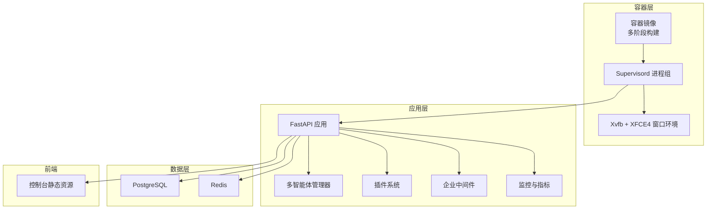
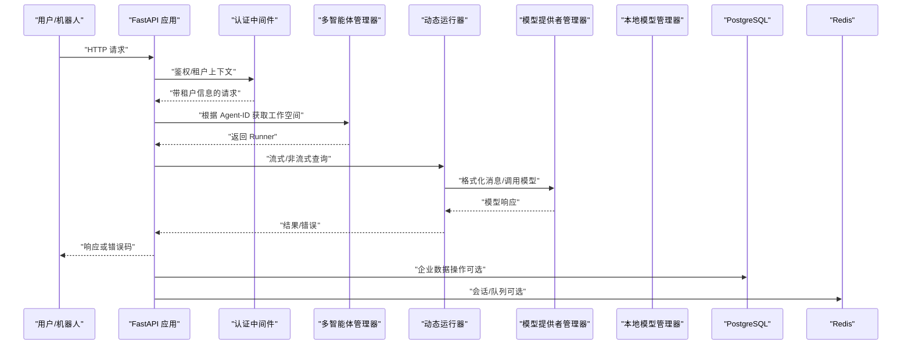
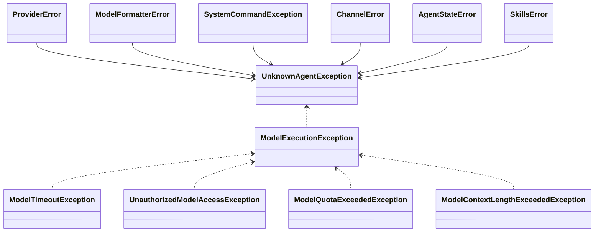
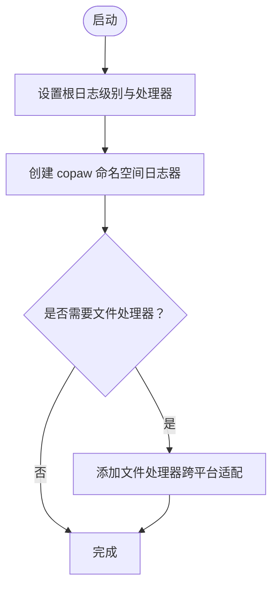
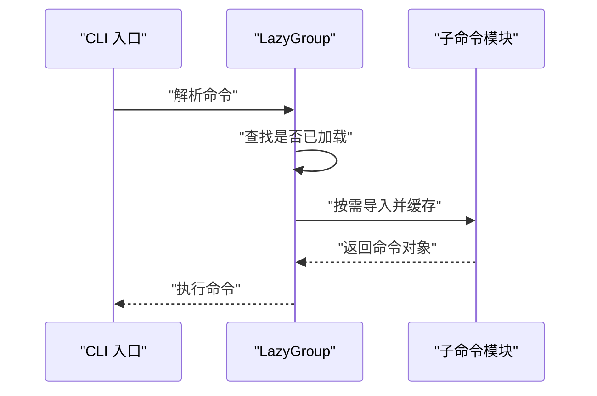
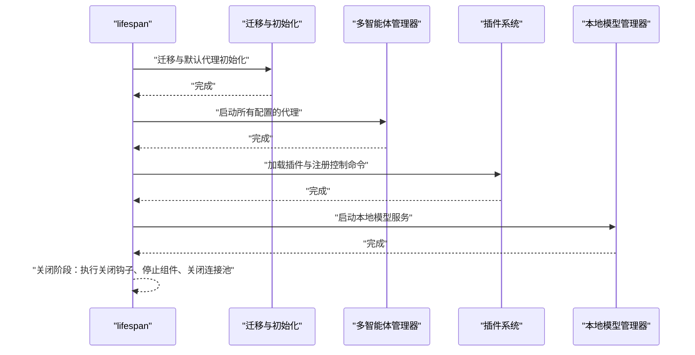
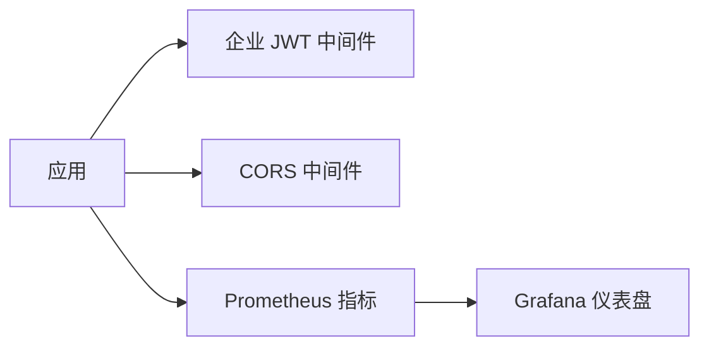
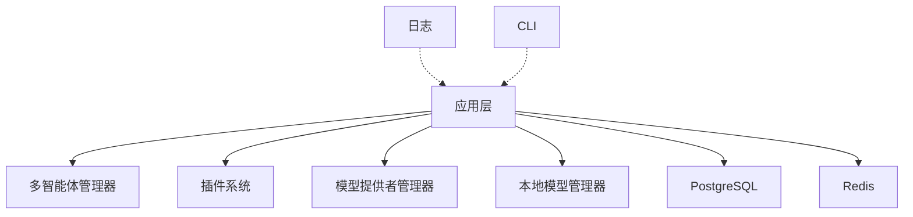

# 故障排除

<cite>
**本文引用的文件**
- [README.md](file://README.md)
- [CONTRIBUTING.md](file://CONTRIBUTING.md)
- [SECURITY.md](file://SECURITY.md)
- [src/copaw/exceptions.py](file://src/copaw/exceptions.py)
- [src/copaw/utils/logging.py](file://src/copaw/utils/logging.py)
- [src/copaw/cli/main.py](file://src/copaw/cli/main.py)
- [src/copaw/app/_app.py](file://src/copaw/app/_app.py)
- [deploy/Dockerfile](file://deploy/Dockerfile)
- [docker-compose.yml](file://docker-compose.yml)
- [deploy/config/supervisord.conf.template](file://deploy/config/supervisord.conf.template)
- [deploy/monitoring/grafana_dashboard.json](file://deploy/monitoring/grafana_dashboard.json)
- [logs/2026-04-12_00-25-10.log](file://logs/2026-04-12_00-25-10.log)
</cite>

## 目录
1. [简介](#简介)
2. [项目结构](#项目结构)
3. [核心组件](#核心组件)
4. [架构总览](#架构总览)
5. [详细组件分析](#详细组件分析)
6. [依赖关系分析](#依赖关系分析)
7. [性能考量](#性能考量)
8. [故障排除指南](#故障排除指南)
9. [结论](#结论)
10. [附录](#附录)

## 简介
本指南面向运维与开发者，聚焦 CoPaw 在安装、配置、性能与集成方面的常见问题定位与解决路径。内容覆盖：
- 安装与部署：本地安装、Docker 与 docker-compose、桌面应用、脚本安装
- 配置与认证：API 密钥、企业模式、通道过滤、CORS、静态资源
- 运行时与可观测性：日志、指标、告警、容器化与进程管理
- 核心功能链路：代理通信、渠道连接、技能执行、模型推理
- 健康检查与容量规划：数据库、缓存、并发与资源限制
- 社区支持与问题上报流程

## 项目结构
CoPaw 采用前后端分离与多模块架构：
- 后端服务：FastAPI 应用，负责路由、认证、多智能体管理、插件系统、企业中间件与监控
- 前端控制台：独立构建产物注入到后端包内，通过静态文件服务提供
- 企业能力：PostgreSQL、Redis、Prometheus 指标、Grafana 可视化
- 容器化：多阶段构建、Supervisord 管理、Playwright/Chromium 支持

图表来源
- [deploy/Dockerfile:1-103](file://deploy/Dockerfile#L1-L103)
- [deploy/config/supervisord.conf.template:1-40](file://deploy/config/supervisord.conf.template#L1-L40)
- [src/copaw/app/_app.py:475-685](file://src/copaw/app/_app.py#L475-L685)

章节来源
- [README.md:113-173](file://README.md#L113-L173)
- [docker-compose.yml:1-92](file://docker-compose.yml#L1-L92)
- [deploy/Dockerfile:1-103](file://deploy/Dockerfile#L1-L103)

## 核心组件
- 异常体系与模型异常转换：统一业务异常类型与模型相关异常映射，便于前端与控制台一致展示
- 日志系统：彩色终端输出、可选文件落盘、访问日志过滤
- CLI 分组懒加载：按需加载子命令，降低启动开销
- 应用生命周期：启动迁移、多智能体初始化、插件注册、关闭钩子
- 企业中间件与监控：JWT 认证、CORS、Prometheus 指标、自定义租户用量计数器

章节来源
- [src/copaw/exceptions.py:1-254](file://src/copaw/exceptions.py#L1-L254)
- [src/copaw/utils/logging.py:1-199](file://src/copaw/utils/logging.py#L1-L199)
- [src/copaw/cli/main.py:58-168](file://src/copaw/cli/main.py#L58-L168)
- [src/copaw/app/_app.py:162-473](file://src/copaw/app/_app.py#L162-L473)

## 架构总览
下图展示从客户端请求到后端处理、渠道适配与模型推理的关键路径，以及企业中间件与监控的集成。

图表来源
- [src/copaw/app/_app.py:59-159](file://src/copaw/app/_app.py#L59-L159)
- [src/copaw/app/_app.py:517-524](file://src/copaw/app/_app.py#L517-L524)
- [src/copaw/app/_app.py:482-511](file://src/copaw/app/_app.py#L482-L511)

## 详细组件分析

### 组件一：异常与错误码映射
- 业务异常：提供者错误、模型格式化错误、系统命令错误、渠道错误、代理状态错误、技能错误
- 模型异常转换：基于状态码与关键字自动映射为统一的模型异常类型，便于前端一致处理
- 调试增强：在详情中附加原始异常类型、消息、模型名、状态码等

图表来源
- [src/copaw/exceptions.py:21-254](file://src/copaw/exceptions.py#L21-L254)

章节来源
- [src/copaw/exceptions.py:104-254](file://src/copaw/exceptions.py#L104-L254)

### 组件二：日志与可观测性
- 日志级别与着色：仅输出包命名空间下的日志，终端启用 ANSI 彩色，文件处理器跨平台兼容
- 访问日志过滤：可抑制特定路径的 uvicorn 访问日志，降低噪音
- 文件落盘：按平台选择 FileHandler 或 RotatingFileHandler，避免锁冲突

图表来源
- [src/copaw/utils/logging.py:119-199](file://src/copaw/utils/logging.py#L119-L199)

章节来源
- [src/copaw/utils/logging.py:1-199](file://src/copaw/utils/logging.py#L1-L199)

### 组件三：CLI 懒加载与初始化
- LazyGroup：延迟加载子命令，减少冷启动时间
- 初始化计时：记录导入耗时，便于诊断启动慢问题
- 平台适配：Windows 下强制 UTF-8 标准流，确保中文显示

图表来源
- [src/copaw/cli/main.py:58-168](file://src/copaw/cli/main.py#L58-L168)

章节来源
- [src/copaw/cli/main.py:1-168](file://src/copaw/cli/main.py#L1-L168)

### 组件四：应用生命周期与多智能体路由
- 动态运行器：根据请求头中的 Agent-ID 动态路由到对应工作空间的 Runner
- 启动阶段：迁移旧配置、初始化多智能体、注册插件、启动本地模型服务
- 关闭阶段：执行插件关闭钩子、优雅停止本地模型与多智能体管理器、关闭数据库与 Redis 连接池

图表来源
- [src/copaw/app/_app.py:162-473](file://src/copaw/app/_app.py#L162-L473)

章节来源
- [src/copaw/app/_app.py:162-473](file://src/copaw/app/_app.py#L162-L473)

### 组件五：企业模式与监控
- 企业中间件：JWT 认证替换单用户认证；CORS 中间件按配置允许来源
- 指标采集：Prometheus 指标暴露，自定义租户用量计数器
- Grafana 仪表盘：提供多租户请求速率与技能使用分布面板

图表来源
- [src/copaw/app/_app.py:517-524](file://src/copaw/app/_app.py#L517-L524)
- [src/copaw/app/_app.py:482-511](file://src/copaw/app/_app.py#L482-L511)
- [deploy/monitoring/grafana_dashboard.json:1-146](file://deploy/monitoring/grafana_dashboard.json#L1-L146)

章节来源
- [src/copaw/app/_app.py:482-524](file://src/copaw/app/_app.py#L482-L524)
- [deploy/monitoring/grafana_dashboard.json:1-146](file://deploy/monitoring/grafana_dashboard.json#L1-L146)

## 依赖关系分析
- 外部依赖：FastAPI、Prometheus、Supervisord、PostgreSQL、Redis、Playwright/Chromium
- 内部耦合：应用层对多智能体管理器、插件系统、模型提供者与本地模型管理器存在强依赖；日志与 CLI 作为横切关注点被广泛使用
- 风险点：容器内 Chromium 无沙箱、Supervisord 进程组顺序、静态资源目录解析失败

图表来源
- [src/copaw/app/_app.py:236-318](file://src/copaw/app/_app.py#L236-L318)
- [src/copaw/utils/logging.py:119-154](file://src/copaw/utils/logging.py#L119-L154)
- [src/copaw/cli/main.py:58-168](file://src/copaw/cli/main.py#L58-L168)

章节来源
- [src/copaw/app/_app.py:236-318](file://src/copaw/app/_app.py#L236-L318)

## 性能考量
- 启动性能：启用 CLI 懒加载与日志初始化，避免不必要的导入与 IO
- 指标与告警：开启 Prometheus 暴露与自定义计数器，结合 Grafana 面板进行容量观察
- 资源隔离：容器内使用 Xvfb + XFCE4 提供图形环境，Chromium 使用系统浏览器避免重复下载
- 并发与限流：应用层设置流式任务超时与队列参数，数据库与 Redis 设置健康检查与内存上限

章节来源
- [src/copaw/cli/main.py:58-168](file://src/copaw/cli/main.py#L58-L168)
- [src/copaw/app/_app.py:482-511](file://src/copaw/app/_app.py#L482-L511)
- [deploy/Dockerfile:74-78](file://deploy/Dockerfile#L74-L78)
- [docker-compose.yml:30-58](file://docker-compose.yml#L30-L58)

## 故障排除指南

### 一、安装与部署问题
- 本地安装后无法启动
  - 现象：命令行提示找不到入口或启动失败
  - 排查要点：确认已执行初始化命令；检查 Python 版本与依赖；查看日志文件
  - 参考路径：[README.md:113-126](file://README.md#L113-L126)
- Docker 镜像拉起后控制台不可用
  - 现象：访问首页返回提示需构建前端
  - 排查要点：确认前端构建产物已注入到后端包内；检查静态资源目录解析逻辑
  - 参考路径：[src/copaw/app/_app.py:543-576](file://src/copaw/app/_app.py#L543-L576)
- docker-compose 启动失败
  - 现象：服务未健康或端口占用
  - 排查要点：检查数据库与 Redis 的健康检查；确认端口映射与密码配置；查看容器日志
  - 参考路径：[docker-compose.yml:30-58](file://docker-compose.yml#L30-L58)
- 容器内浏览器自动化异常
  - 现象：Chromium 报错或无沙箱
  - 排查要点：确认已设置无沙箱标志；检查 Playwright 可执行路径与环境变量
  - 参考路径：[deploy/Dockerfile:71-78](file://deploy/Dockerfile#L71-L78)

章节来源
- [README.md:113-173](file://README.md#L113-L173)
- [src/copaw/app/_app.py:543-576](file://src/copaw/app/_app.py#L543-L576)
- [docker-compose.yml:1-92](file://docker-compose.yml#L1-L92)
- [deploy/Dockerfile:71-78](file://deploy/Dockerfile#L71-L78)

### 二、配置与认证问题
- API 密钥未配置导致模型调用失败
  - 现象：模型异常转换为未授权或配额超限
  - 排查要点：检查密钥配置方式与环境变量；查看异常详情中的状态码与消息
  - 参考路径：[src/copaw/exceptions.py:165-254](file://src/copaw/exceptions.py#L165-L254)
- 企业模式未生效
  - 现象：缺少企业中间件或数据库连接失败
  - 排查要点：确认企业开关与环境变量；检查数据库与 Redis 连接参数
  - 参考路径：[src/copaw/app/_app.py:177-209](file://src/copaw/app/_app.py#L177-L209)
- CORS 跨域问题
  - 现象：前端请求被浏览器拦截
  - 排查要点：核对 CORS_ORIGINS 配置；确认中间件已启用
  - 参考路径：[src/copaw/app/_app.py:526-536](file://src/copaw/app/_app.py#L526-L536)
- 通道过滤不生效
  - 现象：某些通道仍被启用
  - 排查要点：检查 COPAW_ENABLED_CHANNELS 与 COPAW_DISABLED_CHANNELS 环境变量
  - 参考路径：[deploy/Dockerfile:20-25](file://deploy/Dockerfile#L20-L25)

章节来源
- [src/copaw/exceptions.py:165-254](file://src/copaw/exceptions.py#L165-L254)
- [src/copaw/app/_app.py:177-209](file://src/copaw/app/_app.py#L177-L209)
- [src/copaw/app/_app.py:526-536](file://src/copaw/app/_app.py#L526-L536)
- [deploy/Dockerfile:20-25](file://deploy/Dockerfile#L20-L25)

### 三、性能问题
- 启动缓慢
  - 现象：应用启动耗时长
  - 排查要点：查看 CLI 初始化计时日志；确认懒加载是否正常；检查插件数量与启动钩子
  - 参考路径：[src/copaw/cli/main.py:52-56](file://src/copaw/cli/main.py#L52-L56)
- 响应延迟高
  - 现象：接口响应慢或超时
  - 排查要点：检查 Prometheus 指标与 Grafana 面板；核对数据库与 Redis 健康状态；评估并发与队列配置
  - 参考路径：[src/copaw/app/_app.py:482-511](file://src/copaw/app/_app.py#L482-L511)
  - 参考路径：[deploy/monitoring/grafana_dashboard.json:111-127](file://deploy/monitoring/grafana_dashboard.json#L111-L127)

章节来源
- [src/copaw/cli/main.py:52-56](file://src/copaw/cli/main.py#L52-L56)
- [src/copaw/app/_app.py:482-511](file://src/copaw/app/_app.py#L482-L511)
- [deploy/monitoring/grafana_dashboard.json:111-127](file://deploy/monitoring/grafana_dashboard.json#L111-L127)

### 四、集成与通道问题
- 渠道连接失败
  - 现象：消息收发异常或鉴权失败
  - 排查要点：检查渠道配置与凭证；查看渠道错误异常详情中的渠道名；核对自定义渠道路由注册
  - 参考路径：[src/copaw/exceptions.py:54-74](file://src/copaw/exceptions.py#L54-L74)
  - 参考路径：[src/copaw/app/_app.py:617-618](file://src/copaw/app/_app.py#L617-L618)
- 渠道消息格式不匹配
  - 现象：content_parts 解析错误
  - 排查要点：核对渠道协议与 content_parts 结构；检查消息渲染器与发送路径
  - 参考路径：[CONTRIBUTING.md:118-123](file://CONTRIBUTING.md#L118-L123)

章节来源
- [src/copaw/exceptions.py:54-74](file://src/copaw/exceptions.py#L54-L74)
- [src/copaw/app/_app.py:617-618](file://src/copaw/app/_app.py#L617-L618)
- [CONTRIBUTING.md:118-123](file://CONTRIBUTING.md#L118-L123)

### 五、技能执行问题
- 技能未加载或执行失败
  - 现象：技能列表为空或执行报错
  - 排查要点：确认技能目录结构与 SKILL.md；检查技能池合并与激活逻辑；查看技能错误异常
  - 参考路径：[src/copaw/exceptions.py:93-102](file://src/copaw/exceptions.py#L93-L102)
- 技能触发关键词不生效
  - 现象：模型未正确识别技能意图
  - 排查要点：参考贡献文档的最佳实践，明确触发关键词与使用场景
  - 参考路径：[CONTRIBUTING.md:148-183](file://CONTRIBUTING.md#L148-L183)

章节来源
- [src/copaw/exceptions.py:93-102](file://src/copaw/exceptions.py#L93-L102)
- [CONTRIBUTING.md:148-183](file://CONTRIBUTING.md#L148-L183)

### 六、模型推理问题
- 模型调用异常
  - 现象：401/403、429、超时、上下文过长等
  - 排查要点：使用模型异常转换器定位原因；检查状态码与消息关键字；核对配额与密钥
  - 参考路径：[src/copaw/exceptions.py:165-254](file://src/copaw/exceptions.py#L165-L254)
- 本地模型无法启动
  - 现象：本地模型服务未就绪
  - 排查要点：确认本地模型管理器初始化与启动；检查端口占用与权限
  - 参考路径：[src/copaw/app/_app.py:245-270](file://src/copaw/app/_app.py#L245-L270)

章节来源
- [src/copaw/exceptions.py:165-254](file://src/copaw/exceptions.py#L165-L254)
- [src/copaw/app/_app.py:245-270](file://src/copaw/app/_app.py#L245-L270)

### 七、日志分析与调试工具
- 日志位置与级别
  - 默认输出到标准错误，可配置文件落盘；建议在排查问题时临时提升日志级别
  - 参考路径：[src/copaw/utils/logging.py:119-154](file://src/copaw/utils/logging.py#L119-L154)
- 关键日志片段示例
  - 包含 ReMe 应用启动、文件监听与配置更新等关键事件
  - 参考路径：[logs/2026-04-12_00-25-10.log:1-11](file://logs/2026-04-12_00-25-10.log#L1-L11)
- 调试建议
  - 使用 CLI 懒加载特性定位慢点；结合异常转换器快速定位模型相关错误；利用 Supervisord 日志定位进程问题
  - 参考路径：[src/copaw/cli/main.py:58-168](file://src/copaw/cli/main.py#L58-L168)
  - 参考路径：[deploy/config/supervisord.conf.template:14-21](file://deploy/config/supervisord.conf.template#L14-L21)

章节来源
- [src/copaw/utils/logging.py:119-154](file://src/copaw/utils/logging.py#L119-L154)
- [logs/2026-04-12_00-25-10.log:1-11](file://logs/2026-04-12_00-25-10.log#L1-L11)
- [src/copaw/cli/main.py:58-168](file://src/copaw/cli/main.py#L58-L168)
- [deploy/config/supervisord.conf.template:14-21](file://deploy/config/supervisord.conf.template#L14-L21)

### 八、系统健康检查与容量规划
- 数据库与缓存
  - 使用健康检查探测 PostgreSQL 与 Redis；合理设置内存上限与策略
  - 参考路径：[docker-compose.yml:30-58](file://docker-compose.yml#L30-L58)
- 指标与可视化
  - 开启 Prometheus 指标；在 Grafana 中查看多租户请求速率与技能使用分布
  - 参考路径：[src/copaw/app/_app.py:482-511](file://src/copaw/app/_app.py#L482-L511)
  - 参考路径：[deploy/monitoring/grafana_dashboard.json:111-127](file://deploy/monitoring/grafana_dashboard.json#L111-L127)

章节来源
- [docker-compose.yml:30-58](file://docker-compose.yml#L30-L58)
- [src/copaw/app/_app.py:482-511](file://src/copaw/app/_app.py#L482-L511)
- [deploy/monitoring/grafana_dashboard.json:111-127](file://deploy/monitoring/grafana_dashboard.json#L111-L127)

### 九、社区支持与问题报告流程
- 社区渠道
  - GitHub Discussions、Issues、Discord、钉钉群
  - 参考路径：[README.md:1-20](file://README.md#L1-L20)
  - 参考路径：[CONTRIBUTING.md:229-235](file://CONTRIBUTING.md#L229-L235)
- 安全问题上报
  - 私有披露至阿里巴巴安全响应中心；提供复现步骤、影响范围与修复建议
  - 参考路径：[SECURITY.md:7-35](file://SECURITY.md#L7-L35)

章节来源
- [README.md:1-20](file://README.md#L1-L20)
- [CONTRIBUTING.md:229-235](file://CONTRIBUTING.md#L229-L235)
- [SECURITY.md:7-35](file://SECURITY.md#L7-L35)

## 结论
通过异常统一化、日志与指标可观测性、容器化与进程管理，CoPaw 在个人与企业场景下均具备良好的可维护性与可扩展性。建议在生产环境中：
- 明确企业中间件与 CORS 配置
- 启用 Prometheus 指标与 Grafana 可视化
- 使用 Supervisord 管理进程并监控容器健康
- 严格区分渠道与技能信任边界，定期审查配置与日志

## 附录

### A. 错误代码对照表（节选）
- PROVIDER_ERROR：提供者错误
- MODEL_FORMATTER_ERROR：模型消息格式化错误
- SYSTEM_COMMAND_ERROR：系统命令执行错误
- CHANNEL_ERROR：渠道通信错误（详情包含渠道名）
- AGENT_STATE_ERROR：代理状态与会话错误（详情包含会话ID）
- SKILLS_ERROR：技能管理错误
- MODEL_EXECUTION_ERROR：模型执行异常
- MODEL_TIMEOUT_ERROR：模型调用超时
- UNAUTHORIZED_MODEL_ACCESS_ERROR：未授权/鉴权失败
- MODEL_QUOTA_EXCEEDED_ERROR：配额超限
- MODEL_CONTEXT_LENGTH_EXCEEDED_ERROR：上下文长度超限

章节来源
- [src/copaw/exceptions.py:21-102](file://src/copaw/exceptions.py#L21-L102)
- [src/copaw/exceptions.py:165-254](file://src/copaw/exceptions.py#L165-L254)