# 数据库架构现代化

<cite>
**本文档引用的文件**
- [src/copaw/db/__init__.py](file://src/copaw/db/__init__.py)
- [src/copaw/db/postgresql.py](file://src/copaw/db/postgresql.py)
- [src/copaw/db/redis_client.py](file://src/copaw/db/redis_client.py)
- [src/copaw/db/models/base.py](file://src/copaw/db/models/base.py)
- [alembic/env.py](file://alembic/env.py)
- [alembic.ini](file://alembic.ini)
- [alembic/versions/001_initial_schema.py](file://alembic/versions/001_initial_schema.py)
- [alembic/versions/009_permission_enhancement.py](file://alembic/versions/009_permission_enhancement.py)
</cite>

## 目录
1. [简介](#简介)
2. [项目结构](#项目结构)
3. [核心组件](#核心组件)
4. [架构概览](#架构概览)
5. [详细组件分析](#详细组件分析)
6. [依赖关系分析](#依赖关系分析)
7. [性能考虑](#性能考虑)
8. [故障排除指南](#故障排除指南)
9. [结论](#结论)

## 简介

CoPaw Enterprise 数据库架构现代化项目旨在构建一个高性能、可扩展的企业级数据库基础设施。该项目采用现代异步数据库连接管理技术，结合完整的迁移管理系统和多租户支持，为企业应用提供可靠的数据存储解决方案。

本项目的核心特点包括：
- 异步 PostgreSQL 连接管理
- Redis 缓存和消息队列支持
- 完整的数据库迁移系统
- 多租户数据隔离
- 统一的模型基类设计

## 项目结构

数据库相关代码主要分布在以下目录结构中：

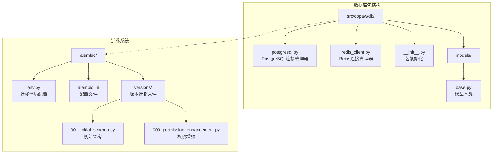

**图表来源**
- [src/copaw/db/__init__.py:1-14](file://src/copaw/db/__init__.py#L1-L14)
- [src/copaw/db/postgresql.py:1-187](file://src/copaw/db/postgresql.py#L1-L187)
- [src/copaw/db/redis_client.py:1-218](file://src/copaw/db/redis_client.py#L1-L218)

**章节来源**
- [src/copaw/db/__init__.py:1-14](file://src/copaw/db/__init__.py#L1-L14)
- [alembic/env.py:1-95](file://alembic/env.py#L1-L95)

## 核心组件

### PostgreSQL 连接管理器

PostgreSQL 连接管理器是整个数据库架构的核心组件，提供了异步连接管理和会话处理功能。

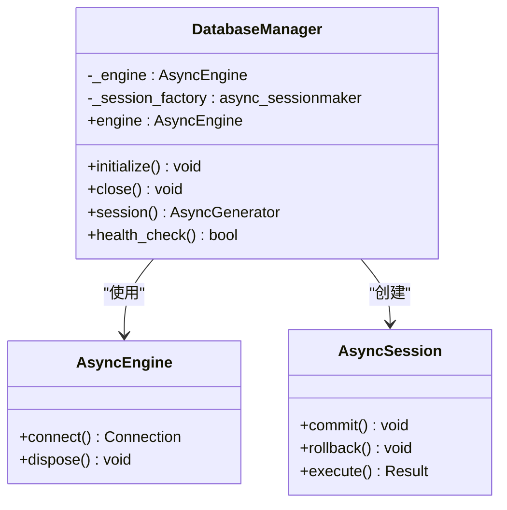

**图表来源**
- [src/copaw/db/postgresql.py:41-167](file://src/copaw/db/postgresql.py#L41-L167)

### Redis 连接管理器

Redis 连接管理器提供了高性能的缓存和消息队列功能，支持多种数据结构操作。

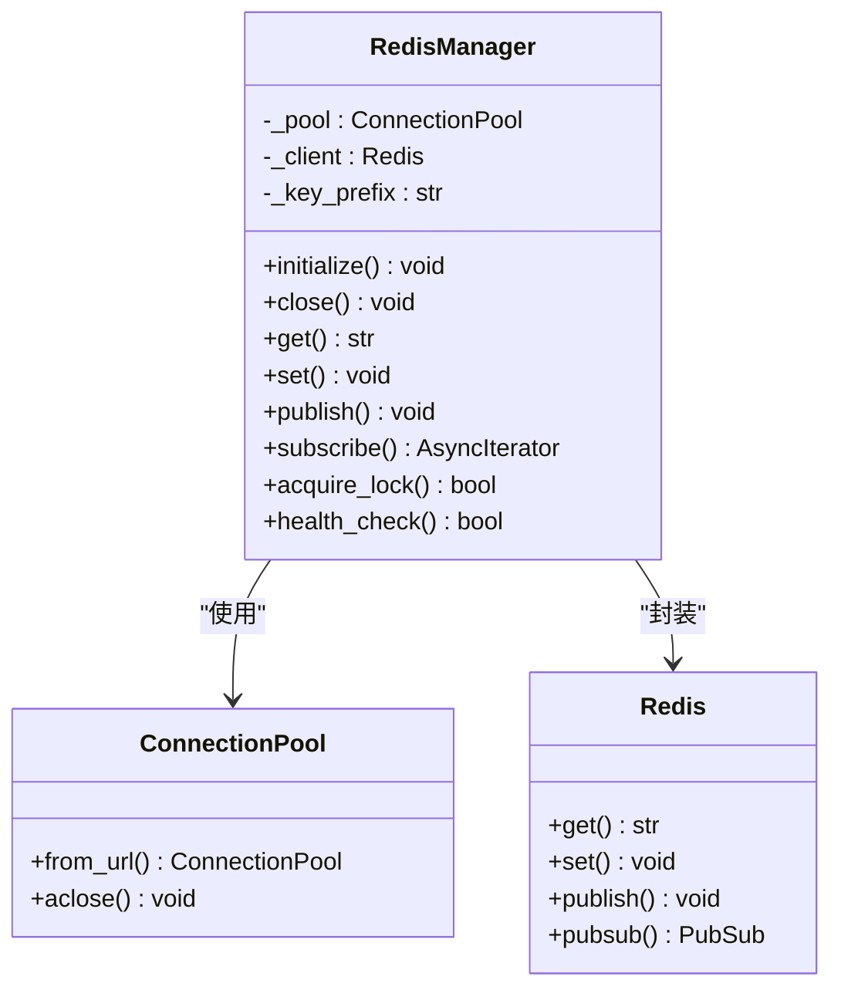

**图表来源**
- [src/copaw/db/redis_client.py:22-207](file://src/copaw/db/redis_client.py#L22-L207)

### 数据模型基类

统一的模型基类设计确保了所有数据库模型的一致性和可维护性。

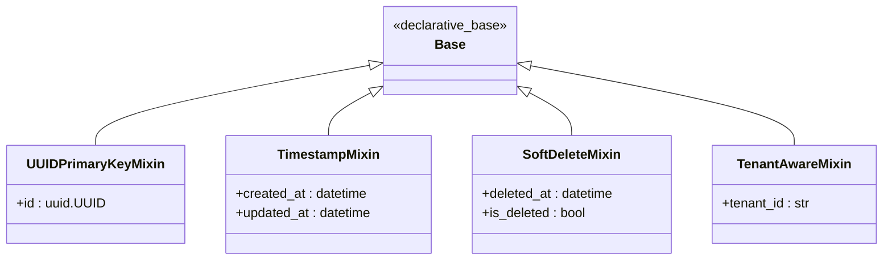

**图表来源**
- [src/copaw/db/models/base.py:19-75](file://src/copaw/db/models/base.py#L19-L75)

**章节来源**
- [src/copaw/db/postgresql.py:1-187](file://src/copaw/db/postgresql.py#L1-L187)
- [src/copaw/db/redis_client.py:1-218](file://src/copaw/db/redis_client.py#L1-L218)
- [src/copaw/db/models/base.py:1-76](file://src/copaw/db/models/base.py#L1-L76)

## 架构概览

CoPaw Enterprise 采用了现代化的企业级数据库架构，结合了多种技术优势：

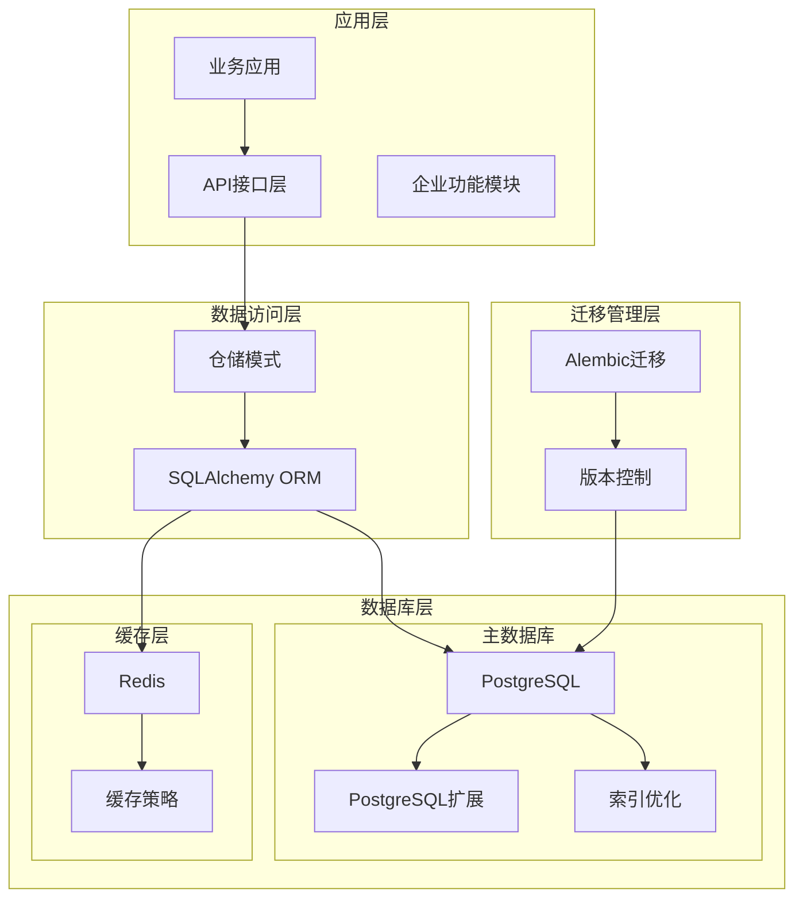

**图表来源**
- [alembic/env.py:33-41](file://alembic/env.py#L33-L41)
- [src/copaw/db/postgresql.py:96-109](file://src/copaw/db/postgresql.py#L96-L109)

## 详细组件分析

### 数据库迁移系统

CoPaw Enterprise 的数据库迁移系统基于 Alembic 构建，提供了完整的版本控制和演进管理能力。

#### 迁移流程

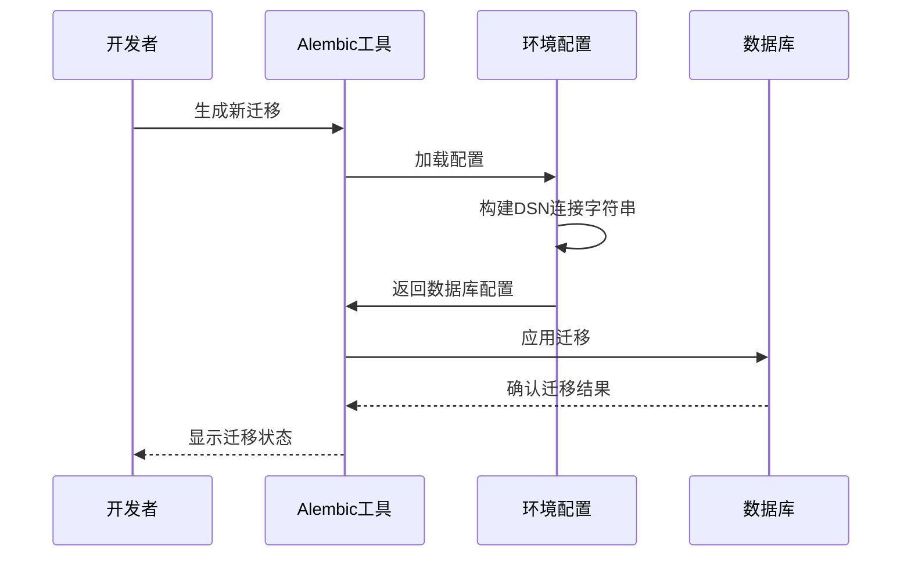

**图表来源**
- [alembic/env.py:44-53](file://alembic/env.py#L44-L53)
- [alembic/env.py:70-89](file://alembic/env.py#L70-L89)

#### 初始架构迁移

第一个迁移版本定义了企业级应用的核心数据结构：

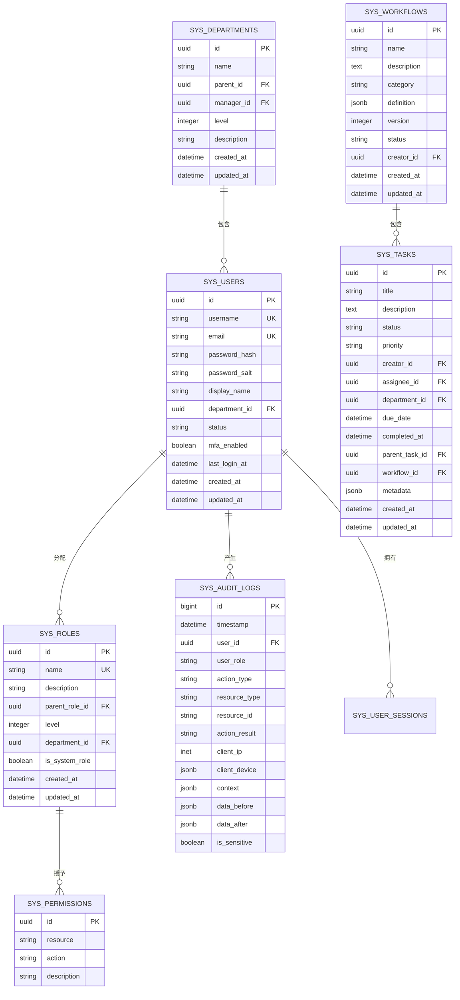

**图表来源**
- [alembic/versions/001_initial_schema.py:29-275](file://alembic/versions/001_initial_schema.py#L29-L275)

**章节来源**
- [alembic/env.py:1-95](file://alembic/env.py#L1-L95)
- [alembic/versions/001_initial_schema.py:1-295](file://alembic/versions/001_initial_schema.py#L1-L295)

### 权限系统增强迁移

最新的权限系统增强迁移引入了更精细的权限控制机制：

#### 权限增强特性

| 特性 | 描述 | 实现方式 |
|------|------|----------|
| 权限码 | 唯一标识符 `permission_code` | 新增字段 + 唯一索引 |
| 资源路径 | 前端路由映射 `resource_path` | 新增字段 |
| 权限类型 | 菜单/API/按钮/数据权限 | 新增字段 + 默认值 |
| 层次结构 | 权限树形结构 `parent_id` | 外键约束 |
| 排序顺序 | 菜单显示顺序 `sort_order` | 新增字段 |
| 图标标识 | 菜单图标 `icon` | 新增字段 |
| 可见性 | 菜单显示控制 `is_visible` | 新增字段 |
| 创建者 | 权限创建人 `created_by` | 外键约束 |

#### 审计日志表

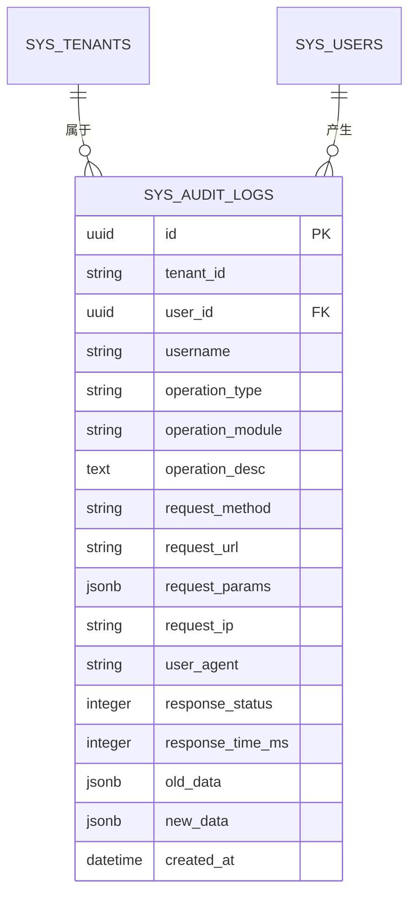

**图表来源**
- [alembic/versions/009_permission_enhancement.py:129-171](file://alembic/versions/009_permission_enhancement.py#L129-L171)

**章节来源**
- [alembic/versions/009_permission_enhancement.py:1-218](file://alembic/versions/009_permission_enhancement.py#L1-L218)

### 连接池管理

数据库连接池管理是确保系统性能和稳定性的关键组件：

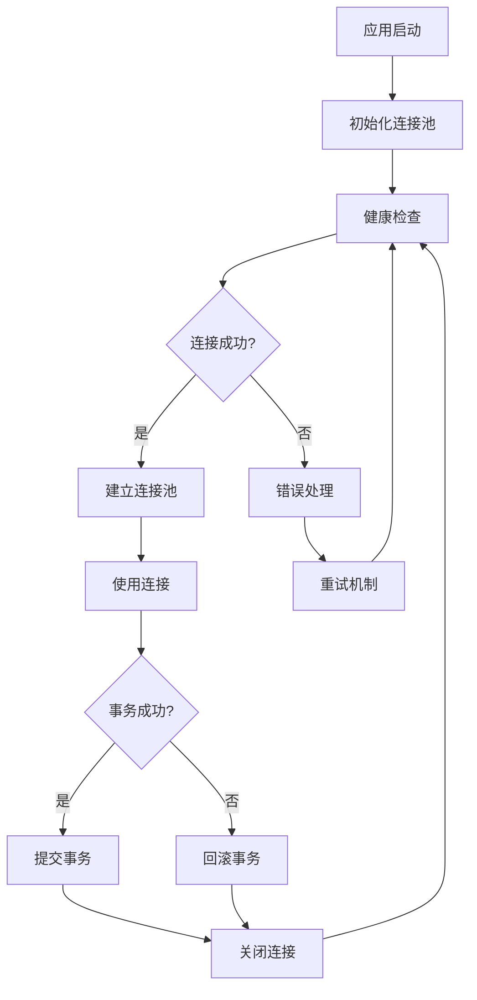

**图表来源**
- [src/copaw/db/postgresql.py:125-139](file://src/copaw/db/postgresql.py#L125-L139)

**章节来源**
- [src/copaw/db/postgresql.py:1-187](file://src/copaw/db/postgresql.py#L1-L187)

## 依赖关系分析

### 外部依赖

CoPaw Enterprise 数据库架构依赖于以下关键外部组件：

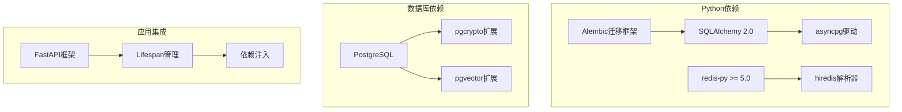

**图表来源**
- [src/copaw/db/postgresql.py:15-21](file://src/copaw/db/postgresql.py#L15-L21)
- [src/copaw/db/redis_client.py:15-17](file://src/copaw/db/redis_client.py#L15-L17)

### 内部模块依赖

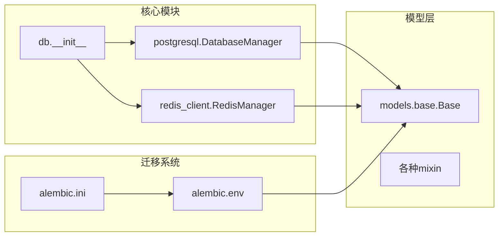

**图表来源**
- [src/copaw/db/__init__.py:6-12](file://src/copaw/db/__init__.py#L6-L12)
- [alembic/env.py:33-41](file://alembic/env.py#L33-L41)

**章节来源**
- [src/copaw/db/__init__.py:1-14](file://src/copaw/db/__init__.py#L1-L14)
- [alembic/env.py:1-95](file://alembic/env.py#L1-L95)

## 性能考虑

### 连接池优化

CoPaw Enterprise 采用了多种连接池优化策略：

1. **异步连接池**：使用 SQLAlchemy 2.0 的异步引擎
2. **连接预检测**：启用 `pool_pre_ping` 确保连接有效性
3. **动态池大小**：根据负载调整连接池大小
4. **自动回收**：智能连接回收机制

### 缓存策略

Redis 缓存层提供了多层次的缓存策略：

1. **键空间管理**：统一的命名空间前缀
2. **TTL管理**：智能过期时间控制
3. **分布式锁**：防止缓存击穿
4. **批量操作**：支持批量缓存操作

### 查询优化

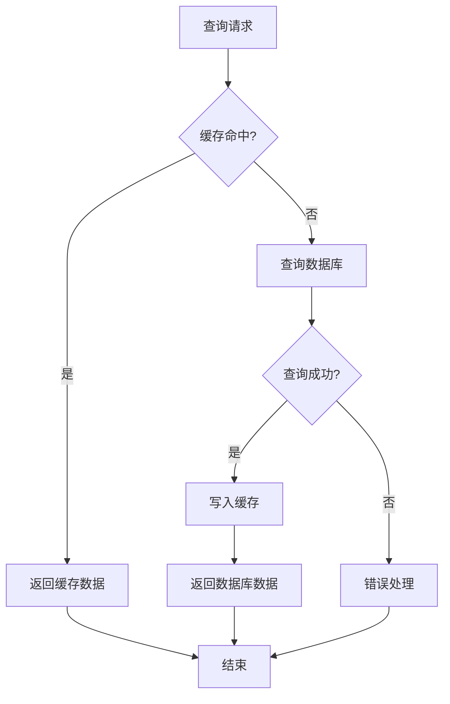

**图表来源**
- [src/copaw/db/redis_client.py:109-137](file://src/copaw/db/redis_client.py#L109-L137)

## 故障排除指南

### 常见问题诊断

#### 数据库连接问题

1. **连接超时**：检查网络连接和防火墙设置
2. **认证失败**：验证用户名密码和SSL配置
3. **连接池耗尽**：监控连接使用情况并调整池大小

#### 迁移问题

1. **迁移失败**：检查数据库权限和迁移脚本
2. **版本不匹配**：使用 `alembic current` 检查当前版本
3. **数据不一致**：运行 `alembic downgrade` 回滚到上一个版本

#### 缓存问题

1. **缓存失效**：检查Redis服务状态
2. **键冲突**：验证键命名规范
3. **内存不足**：监控Redis内存使用情况

**章节来源**
- [src/copaw/db/postgresql.py:144-156](file://src/copaw/db/postgresql.py#L144-L156)
- [src/copaw/db/redis_client.py:198-206](file://src/copaw/db/redis_client.py#L198-L206)

## 结论

CoPaw Enterprise 数据库架构现代化项目展现了现代企业级应用的最佳实践。通过采用异步数据库连接、完善的迁移管理、多租户支持和高性能缓存策略，该项目为企业应用提供了可靠、可扩展的数据基础设施。

### 主要成就

1. **现代化技术栈**：采用 SQLAlchemy 2.0 和异步编程模型
2. **完整生命周期管理**：从开发到生产的完整迁移管理
3. **企业级特性**：多租户支持、权限控制、审计日志
4. **高性能设计**：优化的连接池和缓存策略
5. **可维护性**：清晰的架构分层和统一的代码规范

### 未来发展方向

1. **监控和告警**：增强数据库性能监控
2. **备份策略**：完善数据备份和恢复机制
3. **扩展性优化**：支持更大的数据量和更高的并发
4. **安全性增强**：加强数据加密和访问控制
5. **云原生支持**：更好的容器化和微服务集成