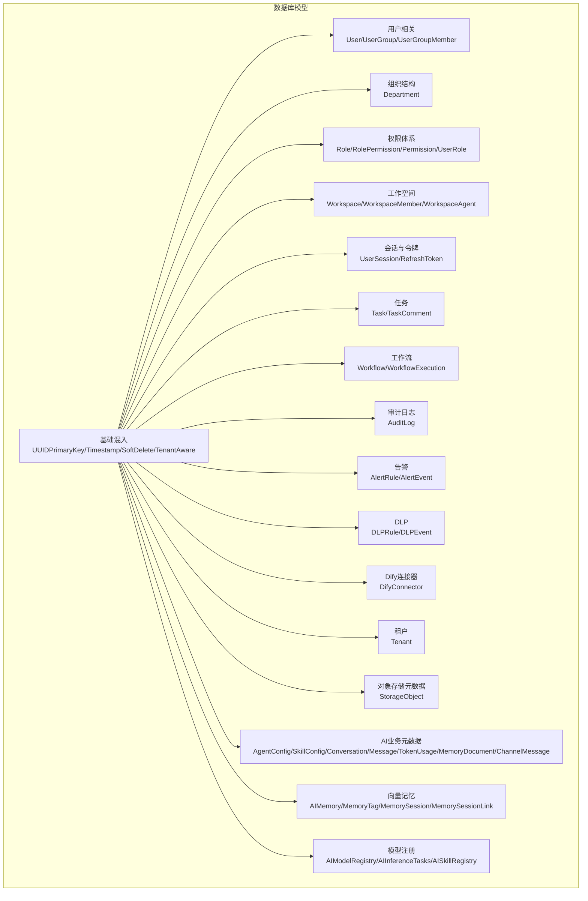
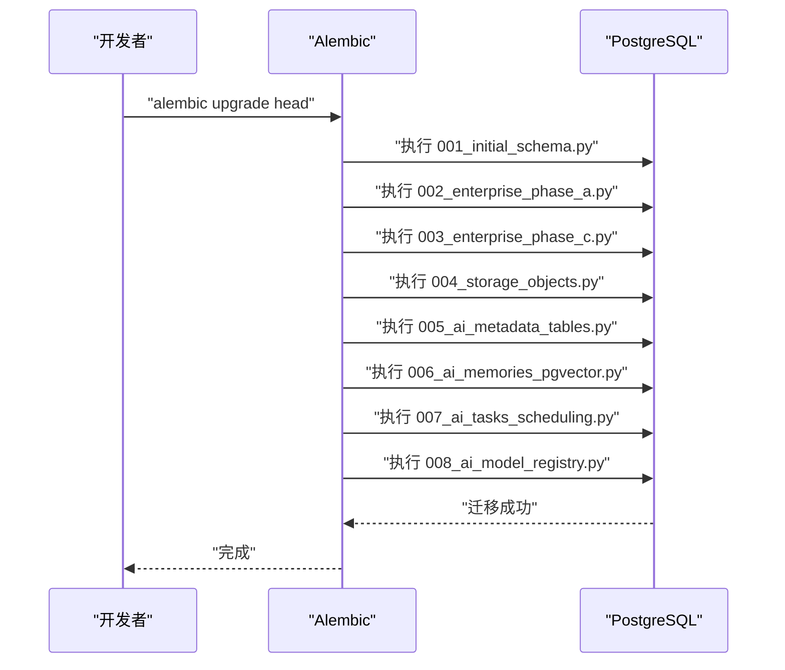

# 数据库设计

<cite>
**本文引用的文件**
- [src\copaw\db\models\base.py](file://src\copaw\db\models\base.py)
- [src\copaw\db\models\user.py](file://src\copaw\db\models\user.py)
- [src\copaw\db\models\organization.py](file://src\copaw\db\models\organization.py)
- [src\copaw\db\models\role.py](file://src\copaw\db\models\role.py)
- [src\copaw\db\models\permission.py](file://src\copaw\db\models\permission.py)
- [src\copaw\db\models\workspace.py](file://src\copaw\db\models\workspace.py)
- [src\copaw\db\models\session.py](file://src\copaw\db\models\session.py)
- [src\copaw\db\models\task.py](file://src\copaw\db\models\task.py)
- [src\copaw\db\models\audit_log.py](file://src\copaw\db\models\audit_log.py)
- [src\copaw\db\models\alert.py](file://src\copaw\db\models\alert.py)
- [src\copaw\db\models\dlp.py](file://src\copaw\db\models\dlp.py)
- [src\copaw\db\models\workflow.py](file://src\copaw\db\models\workflow.py)
- [src\copaw\db\models\dify.py](file://src\copaw\db\models\dify.py)
- [src\copaw\db\models\tenant.py](file://src\copaw\db\models\tenant.py)
- [src\copaw\db\models\storage_meta.py](file://src\copaw\db\models\storage_meta.py)
- [src\copaw\db\models\memory.py](file://src\copaw\db\models\memory.py)
- [alembic\versions\001_initial_schema.py](file://alembic\versions\001_initial_schema.py)
- [alembic\versions\002_enterprise_phase_a.py](file://alembic\versions\002_enterprise_phase_a.py)
- [alembic\versions\003_enterprise_phase_c.py](file://alembic\versions\003_enterprise_phase_c.py)
- [alembic\versions\004_storage_objects.py](file://alembic\versions\004_storage_objects.py)
- [alembic\versions\005_ai_metadata_tables.py](file://alembic\versions\005_ai_metadata_tables.py)
- [alembic\versions\006_ai_memories_pgvector.py](file://alembic\versions\006_ai_memories_pgvector.py)
- [alembic\versions\007_ai_tasks_scheduling.py](file://alembic\versions\007_ai_tasks_scheduling.py)
- [alembic\versions\008_ai_model_registry.py](file://alembic\versions\008_ai_model_registry.py)
</cite>

## 更新摘要
**所做更改**
- 新增存储对象表(storage_objects)的详细字段定义和索引策略
- 新增AI元数据表(ai_agent_configs、ai_skill_configs、ai_conversations、ai_conversation_messages、ai_token_usage_stats、ai_memory_documents、ai_channel_messages)的完整结构说明
- 新增向量内存表(ai_memories、ai_memory_tags、ai_memory_sessions、ai_memory_session_links)的详细设计
- 新增任务调度表(ai_tasks)的调度相关字段说明
- 新增模型注册表(ai_model_registry、ai_inference_tasks、ai_skill_registry)的架构设计
- 更新数据库迁移版本说明，涵盖从004到008的所有企业级数据库表结构变更

## 目录
1. [简介](#简介)
2. [项目结构](#项目结构)
3. [核心组件](#核心组件)
4. [架构总览](#架构总览)
5. [详细组件分析](#详细组件分析)
6. [依赖分析](#依赖分析)
7. [性能考量](#性能考量)
8. [故障排查指南](#故障排查指南)
9. [结论](#结论)
10. [附录](#附录)

## 简介
本文件面向 CoPaw 的数据库层，提供全面的数据模型文档，覆盖实体关系、字段定义与数据类型、主键/外键与索引约束、数据验证与业务规则、数据访问模式、缓存策略与性能考虑、数据生命周期与归档策略、迁移路径与版本管理策略，以及数据安全与隐私、访问控制机制。目标是帮助开发者与运维人员准确理解并高效维护数据库结构。

**更新** 本次更新反映了 CoPaw 数据库架构的重大重构，新增了多租户支持、企业功能表、向量存储、对象存储元数据等核心能力，包含从版本 004 到 008 的多个新迁移版本。

## 项目结构
CoPaw 使用 SQLAlchemy ORM 定义数据库模型，并通过 Alembic 管理迁移。数据库模型位于 src/copaw/db/models 下，迁移脚本位于 alembic/versions。核心特性包括：
- 统一的声明式基类与混入：UUID 主键、时间戳、软删除、多租户隔离
- 企业级用户与组织管理（部门、用户、用户组）
- RBAC 权限体系（角色、权限、用户角色）
- 工作空间与 Agent 可见性控制
- 任务与工作流管理
- 审计日志（ISO 27001 合规）
- 安全与合规扩展（DLP、告警、Dify 连接器）
- **新增** 对象存储元数据管理（storage_objects）
- **新增** AI 业务元数据（agent_configs、skill_configs、conversations、messages、token_usage、memory_documents、channel_messages）
- **新增** 向量记忆存储（pgvector）
- **新增** 模型注册表与推理任务管理



**图表来源**
- [src\copaw\db\models\base.py:19-75](file://src\copaw\db\models\base.py#L19-L75)
- [src\copaw\db\models\user.py:25-91](file://src\copaw\db\models\user.py#L25-L91)
- [src\copaw\db\models\organization.py:21-82](file://src\copaw\db\models\organization.py#L21-L82)
- [src\copaw\db\models\role.py:24-77](file://src\copaw\db\models\role.py#L24-L77)
- [src\copaw\db\models\permission.py:18-45](file://src\copaw\db\models\permission.py#L18-L45)
- [src\copaw\db\models\workspace.py:20-112](file://src\copaw\db\models\workspace.py#L20-L112)
- [src\copaw\db\models\session.py:21-71](file://src\copaw\db\models\session.py#L21-L71)
- [src\copaw\db\models\task.py:23-115](file://src\copaw\db\models\task.py#L23-L115)
- [src\copaw\db\models\workflow.py:19-82](file://src\copaw\db\models\workflow.py#L19-L82)
- [src\copaw\db\models\audit_log.py:18-105](file://src\copaw\db\models\audit_log.py#L18-L105)
- [src\copaw\db\models\alert.py:18-66](file://src\copaw\db\models\alert.py#L18-L66)
- [src\copaw\db\models\dlp.py:18-65](file://src\copaw\db\models\dlp.py#L18-L65)
- [src\copaw\db\models\dify.py:7-24](file://src\copaw\db\models\dify.py#L7-L24)
- [src\copaw\db\models\tenant.py:7-25](file://src\copaw\db\models\tenant.py#L7-L25)
- [src\copaw\db\models\storage_meta.py:45-144](file://src\copaw\db\models\storage_meta.py#L45-L144)
- [src\copaw\db\models\memory.py:39-132](file://src\copaw\db\models\memory.py#L39-L132)

**章节来源**
- [src\copaw\db\models\base.py:19-75](file://src\copaw\db\models\base.py#L19-L75)
- [alembic\versions\001_initial_schema.py:26-318](file://alembic\versions\001_initial_schema.py#L26-L318)

## 核心组件
- 基础混入
  - UUIDPrimaryKeyMixin：统一的 UUID 主键生成（服务端默认 gen_random_uuid）
  - TimestampMixin：自动 created_at/updated_at（含服务器默认与更新触发）
  - SoftDeleteMixin：逻辑删除标记 deleted_at
  - TenantAwareMixin：多租户隔离字段 tenant_id（默认值 default-tenant，带索引）
- 关键表概览
  - 用户与组织：sys_users、sys_user_groups、sys_user_group_members、sys_departments
  - 权限体系：sys_roles、sys_role_permissions、sys_permissions、sys_user_roles
  - 工作空间：sys_workspaces、sys_workspace_members、sys_workspace_agents
  - 会话与令牌：sys_user_sessions、sys_refresh_tokens
  - 任务与工作流：ai_tasks、ai_task_comments、ai_workflows、ai_workflow_executions
  - 审计日志：sys_audit_logs（ISO 27001 合规）
  - 安全与合规：sys_dlp_rules、sys_dlp_events、sys_alert_rules、sys_alert_events、ai_dify_connectors
  - 租户：sys_tenants
  - **新增** 对象存储元数据：storage_objects
  - **新增** AI 业务元数据：ai_agent_configs、ai_skill_configs、ai_conversations、ai_conversation_messages、ai_token_usage_stats、ai_memory_documents、ai_channel_messages
  - **新增** 向量记忆：ai_memories、ai_memory_tags、ai_memory_sessions、ai_memory_session_links
  - **新增** 模型注册：ai_model_registry、ai_inference_tasks、ai_skill_registry

**章节来源**
- [src\copaw\db\models\base.py:23-75](file://src\copaw\db\models\base.py#L23-L75)
- [src\copaw\db\models\user.py:25-91](file://src\copaw\db\models\user.py#L25-L91)
- [src\copaw\db\models\organization.py:21-82](file://src\copaw\db\models\organization.py#L21-L82)
- [src\copaw\db\models\role.py:24-77](file://src\copaw\db\models\role.py#L24-L77)
- [src\copaw\db\models\permission.py:18-45](file://src\copaw\db\models\permission.py#L18-L45)
- [src\copaw\db\models\workspace.py:20-112](file://src\copaw\db\models\workspace.py#L20-L112)
- [src\copaw\db\models\session.py:21-71](file://src\copaw\db\models\session.py#L21-L71)
- [src\copaw\db\models\task.py:23-115](file://src\copaw\db\models\task.py#L23-L115)
- [src\copaw\db\models\workflow.py:19-82](file://src\copaw\db\models\workflow.py#L19-L82)
- [src\copaw\db\models\audit_log.py:18-105](file://src\copaw\db\models\audit_log.py#L18-L105)
- [src\copaw\db\models\alert.py:18-66](file://src\copaw\db\models\alert.py#L18-L66)
- [src\copaw\db\models\dlp.py:18-65](file://src\copaw\db\models\dlp.py#L18-L65)
- [src\copaw\db\models\dify.py:7-24](file://src\copaw\db\models\dify.py#L7-L24)
- [src\copaw\db\models\tenant.py:7-25](file://src\copaw\db\models\tenant.py#L7-L25)
- [src\copaw\db\models\storage_meta.py:45-144](file://src\copaw\db\models\storage_meta.py#L45-L144)
- [src\copaw\db\models\memory.py:39-132](file://src\copaw\db\models\memory.py#L39-L132)

## 架构总览
CoPaw 数据库采用"多租户 + 企业级 RBAC + 任务/工作流 + 审计 + 对象存储元数据 + 向量记忆 + 模型注册"的整体设计。所有业务表均继承 TenantAwareMixin，确保跨组织隔离；用户、角色、权限构成细粒度访问控制；工作空间进一步细化资源可见性；审计日志遵循 ISO 27001 要求，记录关键操作上下文与敏感变更；新增的对象存储元数据支持统一的文件索引管理；向量记忆存储提供智能检索能力；模型注册表支撑 AI 推理任务管理。

```mermaid
erDiagram
SYS_TENANTS ||--o{ SYS_USERS : "多租户隔离"
SYS_DEPARTMENTS ||--o{ SYS_USERS : "部门归属"
SYS_USERS ||--o{ SYS_USER_GROUPS_MEMBERS : "成员关系"
SYS_USER_GROUPS ||--o{ SYS_USER_GROUPS_MEMBERS : "成员关系"
SYS_USERS ||--o{ SYS_USER_ROLES : "角色分配"
SYS_ROLES ||--o{ SYS_ROLE_PERMISSIONS : "权限授予"
SYS_PERMISSIONS ||--o{ SYS_ROLE_PERMISSIONS : "权限授予"
SYS_WORKSPACES ||--o{ SYS_WORKSPACE_MEMBERS : "成员关系"
SYS_WORKSPACES ||--o{ SYS_WORKSPACE_AGENTS : "Agent映射"
SYS_USERS ||--o{ AI_TASKS : "创建/指派"
AI_TASKS ||--o{ AI_TASK_COMMENTS : "评论"
AI_WORKFLOWS ||--o{ AI_WORKFLOW_EXECUTIONS : "执行实例"
SYS_USERS ||--o{ SYS_USER_SESSIONS : "会话"
SYS_USER_SESSIONS ||--o{ SYS_REFRESH_TOKENS : "刷新令牌"
SYS_USERS ||--o{ SYS_AUDIT_LOGS : "操作审计"
SYS_USERS ||--o{ SYS_DLP_EVENTS : "DLP事件"
SYS_ALERT_RULES ||--o{ SYS_ALERT_EVENTS : "告警事件"
AI_DIFY_CONNECTORS ||--o{ AI_WORKFLOWS : "工作流来源"
SYS_USERS ||--o{ AI_TASKS : "任务指派"
SYS_USER_GROUPS ||--o{ AI_TASKS : "任务指派"
SYS_DEPARTMENTS ||--o{ AI_TASKS : "任务指派"
AI_WORKFLOWS ||--o{ AI_TASKS : "关联"
SYS_USERS ||--o{ SYS_WORKSPACE_MEMBERS : "成员"
SYS_USERS ||--o{ SYS_USER_GROUPS : "创建/管理"
SYS_USERS ||--o{ SYS_ROLES : "创建/管理"
SYS_USERS ||--o{ SYS_DEPARTMENTS : "管理"
SYS_USERS ||--o{ SYS_WORKSPACES : "拥有者"
SYS_USERS ||--o{ SYS_ALERT_RULES : "创建/管理"
SYS_USERS ||--o{ SYS_DLP_RULES : "创建/管理"
SYS_USERS ||--o{ AI_DIFY_CONNECTORS : "管理"
SYS_USERS ||--o{ SYS_AUDIT_LOGS : "触发审计"
SYS_USERS ||--o{ SYS_USER_SESSIONS : "会话"
SYS_USERS ||--o{ SYS_REFRESH_TOKENS : "令牌"
SYS_USERS ||--o{ AI_TASKS : "评论"
SYS_USERS ||--o{ AI_WORKFLOW_EXECUTIONS : "触发执行"
SYS_USERS ||--o{ SYS_WORKSPACE_AGENTS : "可见性"
SYS_USERS ||--o{ SYS_WORKSPACE_MEMBERS : "成员"
SYS_USERS ||--o{ SYS_USER_GROUPS_MEMBERS : "成员"
SYS_USERS ||--o{ SYS_ROLE_PERMISSIONS : "审计"
SYS_USERS ||--o{ SYS_USER_ROLES : "审计"
SYS_USERS ||--o{ SYS_AUDIT_LOGS : "审计"
SYS_USERS ||--o{ SYS_DLP_EVENTS : "审计"
SYS_USERS ||--o{ SYS_ALERT_EVENTS : "审计"
SYS_USERS ||--o{ AI_TASKS : "审计"
SYS_USERS ||--o{ AI_WORKFLOW_EXECUTIONS : "审计"
SYS_USERS ||--o{ SYS_WORKSPACES : "审计"
SYS_USERS ||--o{ SYS_USER_GROUPS : "审计"
SYS_USERS ||--o{ SYS_DEPARTMENTS : "审计"
SYS_USERS ||--o{ SYS_ROLES : "审计"
SYS_USERS ||--o{ SYS_PERMISSIONS : "审计"
SYS_USERS ||--o{ SYS_ALERT_RULES : "审计"
SYS_USERS ||--o{ SYS_DLP_RULES : "审计"
SYS_USERS ||--o{ AI_DIFY_CONNECTORS : "审计"
SYS_USERS ||--o{ SYS_USER_SESSIONS : "审计"
SYS_USERS ||--o{ SYS_REFRESH_TOKENS : "审计"
SYS_USERS ||--o{ SYS_WORKSPACE_AGENTS : "审计"
SYS_USERS ||--o{ SYS_WORKSPACE_MEMBERS : "审计"
SYS_USERS ||--o{ SYS_USER_GROUPS_MEMBERS : "审计"
SYS_USERS ||--o{ SYS_USER_ROLES : "审计"
SYS_USERS ||--o{ SYS_ROLE_PERMISSIONS : "审计"
SYS_USERS ||--o{ SYS_AUDIT_LOGS : "审计"
SYS_USERS ||--o{ SYS_DLP_EVENTS : "审计"
SYS_USERS ||--o{ SYS_ALERT_EVENTS : "审计"
SYS_USERS ||--o{ AI_TASKS : "审计"
SYS_USERS ||--o{ AI_WORKFLOW_EXECUTIONS : "审计"
SYS_USERS ||--o{ SYS_WORKSPACES : "审计"
SYS_USERS ||--o{ SYS_USER_GROUPS : "审计"
SYS_USERS ||--o{ SYS_DEPARTMENTS : "审计"
SYS_USERS ||--o{ SYS_ROLES : "审计"
SYS_USERS ||--o{ SYS_PERMISSIONS : "审计"
SYS_USERS ||--o{ SYS_ALERT_RULES : "审计"
SYS_USERS ||--o{ SYS_DLP_RULES : "审计"
SYS_USERS ||--o{ AI_DIFY_CONNECTORS : "审计"
SYS_USERS ||--o{ SYS_USER_SESSIONS : "审计"
SYS_USERS ||--o{ SYS_REFRESH_TOKENS : "审计"
SYS_USERS ||--o{ SYS_WORKSPACE_AGENTS : "审计"
SYS_USERS ||--o{ SYS_WORKSPACE_MEMBERS : "审计"
SYS_USERS ||--o{ SYS_USER_GROUPS_MEMBERS : "审计"
SYS_USERS ||--o{ SYS_USER_ROLES : "审计"
SYS_USERS ||--o{ SYS_ROLE_PERMISSIONS : "审计"
SYS_USERS ||--o{ SYS_AUDIT_LOGS : "审计"
SYS_USERS ||--o{ SYS_DLP_EVENTS : "审计"
SYS_USERS ||--o{ SYS_ALERT_EVENTS : "审计"
SYS_USERS ||--o{ AI_TASKS : "审计"
SYS_USERS ||--o{ AI_WORKFLOW_EXECUTIONS : "审计"
SYS_USERS ||--o{ SYS_WORKSPACES : "审计"
SYS_USERS ||--o{ SYS_USER_GROUPS : "审计"
SYS_USERS ||--o{ SYS_DEPARTMENTS : "审计"
SYS_USERS ||--o{ SYS_ROLES : "审计"
SYS_USERS ||--o{ SYS_PERMISSIONS : "审计"
SYS_USERS ||--o{ SYS_ALERT_RULES : "审计"
SYS_USERS ||--o{ SYS_DLP_RULES : "审计"
SYS_USERS ||--o{ AI_DIFY_CONNECTORS : "审计"
SYS_USERS ||--o{ SYS_USER_SESSIONS : "审计"
SYS_USERS ||--o{ SYS_REFRESH_TOKENS : "审计"
SYS_USERS ||--o{ SYS_WORKSPACE_AGENTS : "审计"
SYS_USERS ||--o{ SYS_WORKSPACE_MEMBERS : "审计"
SYS_USERS ||--o{ SYS_USER_GROUPS_MEMBERS : "审计"
SYS_USERS ||--o{ SYS_USER_ROLES : "审计"
SYS_USERS ||--o{ SYS_ROLE_PERMISSIONS : "审计"
SYS_USERS ||--o{ SYS_AUDIT_LOGS : "审计"
SYS_USERS ||--o{ SYS_DLP_EVENTS : "审计"
SYS_USERS ||--o{ SYS_ALERT_EVENTS : "审计"
SYS_USERS ||--o{ AI_TASKS : "审计"
SYS_USERS ||--o{ AI_WORKFLOW_EXECUTIONS : "审计"
SYS_USERS ||--o{ SYS_WORKSPACES : "审计"
SYS_USERS ||--o{ SYS_USER_GROUPS : "审计"
SYS_USERS ||--o{ SYS_DEPARTMENTS : "审计"
SYS_USERS ||--o{ SYS_ROLES : "审计"
SYS_USERS ||--o{ SYS_PERMISSIONS : "审计"
SYS_USERS ||--o{ SYS_ALERT_RULES : "审计"
SYS_USERS ||--o{ SYS_DLP_RULES : "审计"
SYS_USERS ||--o{ AI_DIFY_CONNECTORS : "审计"
SYS_USERS ||--o{ SYS_USER_SESSIONS : "审计"
SYS_USERS ||--o{ SYS_REFRESH_TOKENS : "审计"
SYS_USERS ||--o{ SYS_WORKSPACE_AGENTS : "审计"
SYS_USERS ||--o{ SYS_WORKSPACE_MEMBERS : "审计"
SYS_USERS ||--o{ SYS_USER_GROUPS_MEMBERS : "审计"
SYS_USERS ||--o{ SYS_USER_ROLES : "审计"
SYS_USERS ||--o{ SYS_ROLE_PERMISSIONS : "审计"
SYS_USERS ||--o{ SYS_AUDIT_LOGS : "审计"
SYS_USERS ||--o{ SYS_DLP_EVENTS : "审计"
SYS_USERS ||--o{ SYS_ALERT_EVENTS : "审计"
SYS_USERS ||--o{ AI_TASKS : "审计"
SYS_USERS ||--o{ AI_WORKFLOW_EXECUTIONS : "审计"
SYS_USERS ||--o{ SYS_WORKSPACES : "审计"
SYS_USERS ||--o{ SYS_USER_GROUPS : "审计"
SYS_USERS ||--o{ SYS_DEPARTMENTS : "审计"
SYS_USERS ||--o{ SYS_ROLES : "审计"
SYS_USERS ||--o{ SYS_PERMISSIONS : "审计"
SYS_USERS ||--o{ SYS_ALERT_RULES : "审计"
SYS_USERS ||--o{ SYS_DLP_RULES : "审计"
SYS_USERS ||--o{ AI_DIFY_CONNECTORS : "审计"
SYS_USERS ||--o{ SYS_USER_SESSIONS : "审计"
SYS_USERS ||--o{ SYS_REFRESH_TOKENS : "审计"
SYS_USERS ||--o{ SYS_WORKSPACE_AGENTS : "审计"
SYS_USERS ||--o{ SYS_WORKSPACE_MEMBERS : "审计"
SYS_USERS ||--o{ SYS_USER_GROUPS_MEMBERS : "审计"
SYS_USERS ||--o{ SYS_USER_ROLES : "审计"
SYS_USERS ||--o{ SYS_ROLE_PERMISSIONS : "审计"
SYS_USERS ||--o{ SYS_AUDIT_LOGS : "审计"
SYS_USERS ||--o{ SYS_DLP_EVENTS : "审计"
SYS_USERS ||--o{ SYS_ALERT_EVENTS : "审计"
SYS_USERS ||--o{ AI_TASKS : "审计"
SYS_USERS ||--o{ AI_WORKFLOW_EXECUTIONS : "审计"
SYS_USERS ||--o{ SYS_WORKSPACES : "审计"
SYS_USERS ||--o{ SYS_USER_GROUPS : "审计"
SYS_USERS ||--o{ SYS_DEPARTMENTS : "审计"
SYS_USERS ||--o{ SYS_ROLES : "审计"
SYS_USERS ||--o{ SYS_PERMISSIONS : "审计"
SYS_USERS ||--o{ SYS_ALERT_RULES : "审计"
SYS_USERS ||--o{ SYS_DLP_RULES : "审计"
SYS_USERS ||--o{ AI_DIFY_CONNECTORS : "审计"
SYS_USERS ||--o{ SYS_USER_SESSIONS : "审计"
SYS_USERS ||--o{ SYS_REFRESH_TOKENS : "审计"
SYS_USERS ||--o{ SYS_WORKSPACE_AGENTS : "审计"
SYS_USERS ||--o{ SYS_WORKSPACE_MEMBERS : "审计"
SYS_USERS ||--o{ SYS_USER_GROUPS_MEMBERS : "审计"
SYS_USERS ||--o{ SYS_USER_ROLES : "审计"
SYS_USERS ||--o{ SYS_ROLE_PERMISSIONS : "审计"
SYS_USERS ||--o{ SYS_AUDIT_LOGS : "审计"
SYS_USERS ||--o{ SYS_DLP_EVENTS : "审计"
SYS_USERS ||--o{ SYS_ALERT_EVENTS : "审计"
SYS_USERS ||--o{ AI_TASKS : "审计"
SYS_USERS ||--o{ AI_WORKFLOW_EXECUTIONS : "审计"
SYS_USERS ||--o{ SYS_WORKSPACES : "审计"
SYS_USERS ||--o{ SYS_USER_GROUPS : "审计"
SYS_USERS ||--o{ SYS_DEPARTMENTS : "审计"
SYS_USERS ||--......
```

**图表来源**
- [src\copaw\db\models\user.py:25-91](file://src\copaw\db\models\user.py#L25-L91)
- [src\copaw\db\models\organization.py:21-82](file://src\copaw\db\models\organization.py#L21-L82)
- [src\copaw\db\models\role.py:24-77](file://src\copaw\db\models\role.py#L24-L77)
- [src\copaw\db\models\permission.py:18-45](file://src\copaw\db\models\permission.py#L18-L45)
- [src\copaw\db\models\workspace.py:20-112](file://src\copaw\db\models\workspace.py#L20-L112)
- [src\copaw\db\models\task.py:23-115](file://src\copaw\db\models\task.py#L23-L115)
- [src\copaw\db\models\workflow.py:19-82](file://src\copaw\db\models\workflow.py#L19-L82)
- [src\copaw\db\models\audit_log.py:18-105](file://src\copaw\db\models\audit_log.py#L18-L105)
- [src\copaw\db\models\alert.py:18-66](file://src\copaw\db\models\alert.py#L18-L66)
- [src\copaw\db\models\dlp.py:18-65](file://src\copaw\db\models\dlp.py#L18-L65)
- [src\copaw\db\models\dify.py:7-24](file://src\copaw\db\models\dify.py#L7-L24)
- [src\copaw\db\models\session.py:21-71](file://src\copaw\db\models\session.py#L21-L71)
- [src\copaw\db\models\tenant.py:7-25](file://src\copaw\db\models\tenant.py#L7-L25)
- [src\copaw\db\models\storage_meta.py:45-144](file://src\copaw\db\models\storage_meta.py#L45-L144)
- [src\copaw\db\models\memory.py:39-132](file://src\copaw\db\models\memory.py#L39-L132)

## 详细组件分析

### 基础模型与混入
- UUIDPrimaryKeyMixin：统一主键生成策略，避免序列回绕与分布式冲突
- TimestampMixin：自动维护创建与更新时间，支持服务端默认与 onupdate
- SoftDeleteMixin：逻辑删除，便于审计与恢复
- TenantAwareMixin：多租户隔离，统一字段与默认值，便于迁移与查询

**章节来源**
- [src\copaw\db\models\base.py:23-75](file://src\copaw\db\models\base.py#L23-L75)

### 用户与组织
- 用户表（sys_users）：用户名唯一、邮箱唯一、密码哈希与盐、显示名、部门外键、状态、MFA 开关与密钥（EncryptedString）、最后登录时间；与部门、角色、会话、用户组成员关系
- 用户组（sys_user_groups）：名称唯一、描述、部门外键；与成员关系
- 成员关系（sys_user_group_members）：多对多关联、加入时间
- 部门（sys_departments）：邻接表树形结构、父部门外键、负责人外键、层级、描述；自引用父子关系与成员集合

**章节来源**
- [src\copaw\db\models\user.py:25-91](file://src\copaw\db\models\user.py#L25-L91)
- [src\copaw\db\models\organization.py:21-82](file://src\copaw\db\models\organization.py#L21-L82)
- [src\copaw\db\models\workspace.py:57-87](file://src\copaw\db\models\workspace.py#L57-L87)

### 权限与角色
- 角色（sys_roles）：名称唯一、描述、父角色（支持最多5级继承）、部门外键、系统角色标志；与权限、用户角色、子角色关系
- 权限（sys_permissions）：资源+动作组合、描述；与角色权限关系
- 角色权限（sys_role_permissions）：角色-权限多对多、授权时间
- 用户角色（sys_user_roles）：用户-角色多对多、分配时间、分配者

**章节来源**
- [src\copaw\db\models\role.py:24-150](file://src\copaw\db\models\role.py#L24-L150)
- [src\copaw\db\models\permission.py:18-49](file://src\copaw\db\models\permission.py#L18-L49)

### 工作空间与 Agent 可见性
- 工作空间（sys_workspaces）：名称、描述、是否默认、所有者外键
- 成员（sys_workspace_members）：工作空间-用户多对多、角色（查看者/编辑者/管理员）、加入时间
- Agent 映射（sys_workspace_agents）：工作空间-Agent ID 映射、可见性（私有/工作空间/企业）

**章节来源**
- [src\copaw\db\models\workspace.py:20-112](file://src\copaw\db\models\workspace.py#L20-L112)

### 会话与令牌
- 用户会话（sys_user_sessions）：用户外键、访问令牌 JTI（唯一）、IP/UA、创建/过期/撤销时间、撤销标记；与刷新令牌关系
- 刷新令牌（sys_refresh_tokens）：会话外键、令牌哈希（唯一）、创建/过期/使用标记与时间

**章节来源**
- [src\copaw\db\models\session.py:21-116](file://src\copaw\db\models\session.py#L21-L116)

### 任务与工作流
- 任务（ai_tasks）：标题、描述、状态/优先级、创建/指派/部门/截止/完成/父任务/工作流/元数据；与评论、创建者/指派人/子任务关系
- 任务评论（ai_task_comments）：任务外键、作者外键、内容、创建时间
- 工作流（ai_workflows）：名称、描述、类别（dify/internal）、定义（JSONB）、版本、状态、创建者；与执行关系
- 执行（ai_workflow_executions）：工作流外键、触发者、状态、时间线、输入/输出/错误/元数据

**更新** 任务表新增调度相关字段：schedule_expr（Cron 表达式）、next_run_at（下次执行时间）、last_run_at（上次执行时间）、run_count（执行次数）、max_retries（最大重试次数）、timeout_seconds（超时时间）、command（执行命令）、args（命令参数）、source_storage_key（jobs.json 存储键）

**章节来源**
- [src\copaw\db\models\task.py:23-151](file://src\copaw\db\models\task.py#L23-L151)
- [src\copaw\db\models\workflow.py:19-149](file://src\copaw\db\models\workflow.py#L19-L149)
- [alembic\versions\007_ai_tasks_scheduling.py:18-31](file://alembic\versions\007_ai_tasks_scheduling.py#L18-L31)

### 审计日志（ISO 27001 合规）
- sys_audit_logs：时间戳、用户/角色、操作类型/资源类型/资源ID、结果、客户端IP/设备、上下文、敏感操作前后数据、敏感标记；复合索引覆盖常见查询维度

**章节来源**
- [src\copaw\db\models\audit_log.py:18-105](file://src\copaw\db\models\audit_log.py#L18-L105)

### 安全与合规扩展
- DLP 规则（sys_dlp_rules）：规则名唯一、正则模式、动作（脱敏/告警/阻断）、激活/内置、时间戳
- DLP 事件（sys_dlp_events）：规则名、动作、内容摘要、用户、上下文路径、触发时间
- 告警规则（sys_alert_rules）：规则类型唯一、阈值/窗口、通知渠道（JSON）、激活、创建时间
- 告警事件（sys_alert_events）：规则类型、触发时间、上下文、通知状态
- Dify 连接器（ai_dify_connectors）：名称/描述/API 地址/API 密钥、激活、时间戳

**章节来源**
- [src\copaw\db\models\dlp.py:18-107](file://src\copaw\db\models\dlp.py#L18-L107)
- [src\copaw\db\models\alert.py:18-102](file://src\copaw\db\models\alert.py#L18-L102)
- [src\copaw\db\models\dify.py:7-24](file://src\copaw\db\models\dify.py#L7-L24)

### 租户
- sys_tenants：租户 ID（字符串）、名称、域名唯一、激活状态、时间戳

**章节来源**
- [src\copaw\db\models\tenant.py:7-25](file://src\copaw\db\models\tenant.py#L7-L25)

### 对象存储元数据（新增）
- storage_objects：通用文件对象索引表，支持对象存储文件的统一索引，包含对象键、存储桶、文件名、扩展名、MIME 类型、文件大小、类别、版本 ID、ETag、工作空间/用户关联、全文搜索文本、标签、自定义元数据、存储类别、内容哈希、最新版本标记、软删除时间等字段
- ai_agent_configs：Agent 配置元数据表，从 agent.json 抽取的结构化信息
- ai_skill_configs：Skill 配置元数据表，从 skill.json 抽取的结构化信息
- ai_conversations：对话元数据表，从 chats.json 抽取
- ai_conversation_messages：对话消息表，从 chats.json.messages 逐条抽取
- ai_token_usage_stats：Token 使用统计表，从 token_usage.json 抽取，支持按日/月聚合
- ai_memory_documents：记忆文档元数据表，从 memory/*.md 和人格文件抽取
- ai_channel_messages：通道消息表，飞书/钉钉等通道消息入库，支持跨节点共享和审计

**章节来源**
- [src\copaw\db\models\storage_meta.py:45-725](file://src\copaw\db\models\storage_meta.py#L45-L725)
- [alembic\versions\004_storage_objects.py:19-83](file://alembic\versions\004_storage_objects.py#L19-L83)
- [alembic\versions\005_ai_metadata_tables.py:18-251](file://alembic\versions\005_ai_metadata_tables.py#L18-L251)

### 向量记忆存储（新增）
- ai_memories：AI 记忆条目表，企业版向量记忆存储，支持向量嵌入（pgvector 扩展）
- ai_memory_tags：记忆标签关联表
- ai_memory_sessions：记忆会话上下文表
- ai_memory_session_links：会话-记忆关联表

**更新** 向量存储使用 pgvector 扩展，支持 IVFFlat 索引和向量相似度搜索

**章节来源**
- [src\copaw\db\models\memory.py:39-248](file://src\copaw\db\models\memory.py#L39-L248)
- [alembic\versions\006_ai_memories_pgvector.py:18-130](file://alembic\versions\006_ai_memories_pgvector.py#L18-L130)

### 模型注册与推理任务（新增）
- ai_model_registry：AI 模型注册表，管理可用的 AI 模型及其参数
- ai_inference_tasks：AI 推理任务表，跟踪模型推理任务的状态和结果
- ai_skill_registry：AI 技能注册表，管理可用的 AI 技能

**章节来源**
- [alembic\versions\008_ai_model_registry.py:18-94](file://alembic\versions\008_ai_model_registry.py#L18-L94)

## 依赖分析
- 模型间依赖
  - 用户/部门/角色/权限/工作空间/会话/任务/工作流/审计/告警/DLP/Dify 均依赖 TenantAwareMixin
  - 多对多关系通过中间表实现（用户-组、用户-角色、角色-权限、工作空间-成员、工作空间-Agent）
  - 自引用关系用于部门树与任务父子链
  - **新增** 对象存储元数据与向量记忆依赖工作空间和用户关联
  - **新增** 模型注册表与推理任务建立外键关联
- 外键约束
  - 所有外键均设置合理 ondelete（SET NULL/CASCADE），保证数据一致性
  - **新增** pgvector 扩展依赖关系
- 索引策略
  - 唯一索引：用户名、邮箱、JTI、规则名、资源标识、对象键（部分条件）
  - 复合索引：审计日志按时间/用户/操作/资源维度；会话按用户/JTI/过期时间；任务按状态/指派人；工作流按名称/类别/状态；DLP/告警按规则/时间/用户
  - **新增** 对象存储元数据按 tenant/workspace/category/tags/created_at 建立索引
  - **新增** 向量记忆按 tenant/workspace/user/category/importance/created_at/tags/content_hash 建立索引，包含向量 IVFFlat 索引
  - **新增** 调度任务按 schedule_expr/next_run 建立索引

```mermaid
classDiagram
class Base {
<<declarative base>>
}
class UUIDPrimaryKeyMixin {
+id : UUID
}
class TimestampMixin {
+created_at : datetime
+updated_at : datetime
}
class SoftDeleteMixin {
+deleted_at : datetime?
+is_deleted : bool
}
class TenantAwareMixin {
+tenant_id : string
}
class User {
+username : string
+email : string?
+password_hash : string
+password_salt : string
+display_name : string?
+department_id : UUID?
+status : string
+mfa_enabled : bool
+mfa_secret : string?
+last_login_at : datetime?
}
class Department {
+name : string
+parent_id : UUID?
+manager_id : UUID?
+level : int
+description : string?
}
class Role {
+name : string
+description : string?
+parent_role_id : UUID?
+level : int
+department_id : UUID?
+is_system_role : bool
}
class Permission {
+resource : string
+action : string
+description : string?
}
class Workspace {
+name : string
+description : string?
+is_default : bool
+owner_id : UUID?
}
class Task {
+title : string
+description : string?
+status : string
+priority : string
+due_date : datetime?
+completed_at : datetime?
+metadata : JSONB?
}
class Workflow {
+name : string
+description : string?
+category : string?
+definition : JSONB
+version : int
+status : string
}
class StorageObject {
+object_key : string
+bucket : string
+file_name : string
+file_ext : string?
+content_type : string?
+file_size : bigint
+category : string
+version_id : string?
+etag : string?
+workspace_id : UUID?
+user_id : UUID?
+search_text : string?
+tags : string[]
+custom_metadata : JSONB?
+storage_class : string
+content_hash : string?
+is_latest : bool
+deleted_at : datetime?
}
class AIMemory {
+content : text
+content_hash : string?
+embedding : text
+embedding_model : string?
+category : string?
+importance : float
+metadata : JSONB?
+tags : string[]
+access_count : int
+last_accessed_at : datetime?
+archived_at : datetime?
}
Base <|-- User
Base <|-- Department
Base <|-- Role
Base <|-- Permission
Base <|-- Workspace
Base <|-- Task
Base <|-- Workflow
Base <|-- StorageObject
Base <|-- AIMemory
UUIDPrimaryKeyMixin <|-- User
UUIDPrimaryKeyMixin <|-- Department
UUIDPrimaryKeyMixin <|-- Role
UUIDPrimaryKeyMixin <|-- Permission
UUIDPrimaryKeyMixin <|-- Workspace
UUIDPrimaryKeyMixin <|-- Task
UUIDPrimaryKeyMixin <|-- Workflow
UUIDPrimaryKeyMixin <|-- StorageObject
UUIDPrimaryKeyMixin <|-- AIMemory
TimestampMixin <|-- User
TimestampMixin <|-- Department
TimestampMixin <|-- Role
TimestampMixin <|-- Permission
TimestampMixin <|-- Workspace
TimestampMixin <|-- Task
TimestampMixin <|-- Workflow
TimestampMixin <|-- StorageObject
TimestampMixin <|-- AIMemory
TenantAwareMixin <|-- User
TenantAwareMixin <|-- Department
TenantAwareMixin <|-- Role
TenantAwareMixin <|-- Permission
TenantAwareMixin <|-- Workspace
TenantAwareMixin <|-- Task
TenantAwareMixin <|-- Workflow
TenantAwareMixin <|-- StorageObject
TenantAwareMixin <|-- AIMemory
```



**图表来源**
- [src\copaw\db\models\base.py:19-75](file://src\copaw\db\models\base.py#L19-L75)
- [src\copaw\db\models\user.py:25-91](file://src\copaw\db\models\user.py#L25-L91)
- [src\copaw\db\models\organization.py:21-82](file://src\copaw\db\models\organization.py#L21-L82)
- [src\copaw\db\models\role.py:24-77](file://src\copaw\db\models\role.py#L24-L77)
- [src\copaw\db\models\permission.py:18-45](file://src\copaw\db\models\permission.py#L18-L45)
- [src\copaw\db\models\workspace.py:20-112](file://src\copaw\db\models\workspace.py#L20-L112)
- [src\copaw\db\models\task.py:23-151](file://src\copaw\db\models\task.py#L23-L151)
- [src\copaw\db\models\workflow.py:19-82](file://src\copaw\db\models\workflow.py#L19-L82)
- [src\copaw\db\models\storage_meta.py:45-144](file://src\copaw\db\models\storage_meta.py#L45-L144)
- [src\copaw\db\models\memory.py:39-132](file://src\copaw\db\models\memory.py#L39-L132)

**章节来源**
- [src\copaw\db\models\user.py:25-91](file://src\copaw\db\models\user.py#L25-L91)
- [src\copaw\db\models\organization.py:21-82](file://src\copaw\db\models\organization.py#L21-L82)
- [src\copaw\db\models\role.py:24-150](file://src\copaw\db\models\role.py#L24-L150)
- [src\copaw\db\models\permission.py:18-49](file://src\copaw\db\models\permission.py#L18-L49)
- [src\copaw\db\models\workspace.py:20-112](file://src\copaw\db\models\workspace.py#L20-L112)
- [src\copaw\db\models\task.py:23-151](file://src\copaw\db\models\task.py#L23-L151)
- [src\copaw\db\models\workflow.py:19-149](file://src\copaw\db\models\workflow.py#L19-L149)
- [src\copaw\db\models\storage_meta.py:45-725](file://src\copaw\db\models\storage_meta.py#L45-L725)
- [src\copaw\db\models\memory.py:39-248](file://src\copaw\db\models\memory.py#L39-L248)

## 性能考量
- 索引与查询
  - 审计日志建立多维索引，满足高频查询场景
  - 会话/令牌/任务/工作流/告警/DLP 等关键表均建立常用过滤字段索引
  - **新增** 对象存储元数据按 tenant/workspace/category/tags/created_at 建立索引，支持全文搜索
  - **新增** 向量记忆建立 IVFFlat 索引，支持向量相似度搜索
  - **新增** 调度任务按 schedule_expr/next_run 建立索引，优化定时任务查询
- 写入优化
  - 审计日志采用追加写入模式，减少更新开销
  - JSONB 字段仅存储必要上下文，避免冗余
  - **新增** 向量嵌入使用 pgvector 扩展，优化向量存储和查询性能
- 缓存策略
  - 会话与刷新令牌在 Redis 中镜像，数据库仅做审计与持久化
  - 建议对热点查询结果（如用户角色/权限树）在应用层缓存
  - **新增** 向量记忆查询结果可考虑应用层缓存
- 分区与归档
  - 审计日志、DLP/告警事件建议按时间分区或归档，降低热数据膨胀
  - **新增** 对象存储元数据可按时间或类别进行分区
- 并发与锁
  - 使用 UUID 主键降低热点冲突
  - 对高并发写入场景，建议分批提交与重试
  - **新增** 向量索引操作需考虑数据库扩展的性能影响

## 故障排查指南
- 常见问题定位
  - 会话失效：检查 sys_user_sessions.expired_at 与 revoked 标记
  - 权限不足：核对 sys_user_roles 与 sys_role_permissions 的授予链
  - 审计缺失：确认 sys_audit_logs 是否启用、索引是否正确
  - DLP/Dify 异常：检查规则有效性与连接器配置
  - **新增** 对象存储元数据异常：检查 storage_objects 索引和外键约束
  - **新增** 向量记忆查询失败：确认 pgvector 扩展是否正确安装和配置
  - **新增** 调度任务异常：检查 ai_tasks 的调度字段和索引
- 排查流程
  - 通过用户 ID/令牌 JTI 快速定位会话与令牌
  - 通过资源类型/ID 查询审计日志上下文
  - 通过规则类型/时间窗口查询告警事件
  - 通过任务状态/指派人筛选任务执行情况
  - **新增** 通过对象键/工作空间/类别查询对象存储元数据
  - **新增** 通过向量相似度查询验证向量索引配置

**章节来源**
- [src\copaw\db\models\session.py:21-116](file://src\copaw\db\models\session.py#L21-L116)
- [src\copaw\db\models\audit_log.py:18-105](file://src\copaw\db\models\audit_log.py#L18-L105)
- [src\copaw\db\models\alert.py:18-102](file://src\copaw\db\models\alert.py#L18-L102)
- [src\copaw\db\models\dlp.py:18-107](file://src\copaw\db\models\dlp.py#L18-L107)
- [src\copaw\db\models\task.py:23-151](file://src\copaw\db\models\task.py#L23-L151)
- [src\copaw\db\models\storage_meta.py:45-144](file://src\copaw\db\models\storage_meta.py#L45-L144)
- [src\copaw\db\models\memory.py:39-132](file://src\copaw\db\models\memory.py#L39-L132)

## 结论
CoPaw 的数据库设计以多租户隔离为核心，结合完善的 RBAC、工作空间可见性控制、任务与工作流管理、ISO 27001 合规审计，以及 DLP/告警/Dify 等安全扩展，形成了一个可演进、可审计、可治理的企业级数据架构。**本次重大重构新增了对象存储元数据管理、向量记忆存储、模型注册与推理任务等核心能力，显著提升了系统的智能化水平和数据管理能力。** 通过统一的模型混入与清晰的外键/索引策略，既保证了数据一致性，也为性能优化与运维监控提供了坚实基础。

## 附录

### 数据模型图（ER）

```mermaid
erDiagram
SYS_USERS ||--o{ SYS_USER_GROUPS_MEMBERS : "成员"
SYS_USER_GROUPS ||--o{ SYS_USER_GROUPS_MEMBERS : "成员"
SYS_USERS ||--o{ SYS_USER_ROLES : "角色"
SYS_ROLES ||--o{ SYS_ROLE_PERMISSIONS : "权限"
SYS_PERMISSIONS ||--o{ SYS_ROLE_PERMISSIONS : "权限"
SYS_USERS ||--o{ SYS_WORKSPACE_MEMBERS : "成员"
SYS_WORKSPACES ||--o{ SYS_WORKSPACE_MEMBERS : "成员"
SYS_WORKSPACES ||--o{ SYS_WORKSPACE_AGENTS : "Agent"
SYS_USERS ||--o{ AI_TASKS : "创建/指派"
AI_TASKS ||--o{ AI_TASK_COMMENTS : "评论"
AI_WORKFLOWS ||--o{ AI_WORKFLOW_EXECUTIONS : "执行"
SYS_USERS ||--o{ SYS_USER_SESSIONS : "会话"
SYS_USER_SESSIONS ||--o{ SYS_REFRESH_TOKENS : "令牌"
SYS_USERS ||--o{ SYS_AUDIT_LOGS : "审计"
SYS_USERS ||--o{ SYS_DLP_EVENTS : "DLP事件"
SYS_ALERT_RULES ||--o{ SYS_ALERT_EVENTS : "告警事件"
AI_DIFY_CONNECTORS ||--o{ AI_WORKFLOWS : "来源"
SYS_DEPARTMENTS ||--o{ SYS_USERS : "成员"
SYS_DEPARTMENTS ||--o{ SYS_DEPARTMENTS : "父子"
SYS_USERS ||--o{ SYS_ALERT_RULES : "创建"
SYS_USERS ||--o{ SYS_DLP_RULES : "创建"
SYS_USERS ||--o{ AI_DIFY_CONNECTORS : "管理"
STORAGE_OBJECTS ||--o{ SYS_WORKSPACES : "工作空间关联"
STORAGE_OBJECTS ||--o{ SYS_USERS : "用户关联"
AI_AGENT_CONFIGS ||--o{ SYS_WORKSPACES : "工作空间关联"
AI_AGENT_CONFIGS ||--o{ SYS_USERS : "用户关联"
AI_SKILL_CONFIGS ||--o{ SYS_WORKSPACES : "工作空间关联"
AI_SKILL_CONFIGS ||--o{ SYS_USERS : "用户关联"
AI_CONVERSATIONS ||--o{ SYS_WORKSPACES : "工作空间关联"
AI_CONVERSATIONS ||--o{ SYS_USERS : "用户关联"
AI_CONVERSATION_MESSAGES ||--o{ AI_CONVERSATIONS : "对话关联"
AI_TOKEN_USAGE_STATS ||--o{ SYS_WORKSPACES : "工作空间关联"
AI_TOKEN_USAGE_STATS ||--o{ SYS_USERS : "用户关联"
AI_MEMORY_DOCUMENTS ||--o{ SYS_WORKSPACES : "工作空间关联"
AI_MEMORY_DOCUMENTS ||--o{ SYS_USERS : "用户关联"
AI_CHANNEL_MESSAGES ||--o{ SYS_WORKSPACES : "工作空间关联"
AI_CHANNEL_MESSAGES ||--o{ SYS_USERS : "用户关联"
AI_MEMORIES ||--o{ SYS_WORKSPACES : "工作空间关联"
AI_MEMORIES ||--o{ SYS_USERS : "用户关联"
AI_MEMORY_TAGS ||--o{ AI_MEMORIES : "记忆关联"
AI_MEMORY_SESSIONS ||--o{ SYS_WORKSPACES : "工作空间关联"
AI_MEMORY_SESSIONS ||--o{ SYS_USERS : "用户关联"
AI_MEMORY_SESSION_LINKS ||--o{ AI_MEMORY_SESSIONS : "会话关联"
AI_MEMORY_SESSION_LINKS ||--o{ AI_MEMORIES : "记忆关联"
AI_MODEL_REGISTRY ||--o{ SYS_TENANTS : "租户关联"
AI_INFERENCE_TASKS ||--o{ AI_MODEL_REGISTRY : "模型关联"
AI_INFERENCE_TASKS ||--o{ SYS_USERS : "用户关联"
AI_INFERENCE_TASKS ||--o{ SYS_WORKSPACES : "工作空间关联"
AI_SKILL_REGISTRY ||--o{ SYS_TENANTS : "租户关联"
```


**图表来源**
- [src\copaw\db\models\user.py:25-91](file://src\copaw\db\models\user.py#L25-L91)
- [src\copaw\db\models\organization.py:21-82](file://src\copaw\db\models\organization.py#L21-L82)
- [src\copaw\db\models\role.py:24-150](file://src\copaw\db\models\role.py#L24-L150)
- [src\copaw\db\models\permission.py:18-49](file://src\copaw\db\models\permission.py#L18-L49)
- [src\copaw\db\models\workspace.py:20-112](file://src\copaw\db\models\workspace.py#L20-L112)
- [src\copaw\db\models\task.py:23-151](file://src\copaw\db\models\task.py#L23-L151)
- [src\copaw\db\models\workflow.py:19-149](file://src\copaw\db\models\workflow.py#L19-L149)
- [src\copaw\db\models\audit_log.py:18-105](file://src\copaw\db\models\audit_log.py#L18-L105)
- [src\copaw\db\models\alert.py:18-102](file://src\copaw\db\models\alert.py#L18-L102)
- [src\copaw\db\models\dlp.py:18-107](file://src\copaw\db\models\dlp.py#L18-L107)
- [src\copaw\db\models\dify.py:7-24](file://src\copaw\db\models\dify.py#L7-L24)
- [src\copaw\db\models\session.py:21-116](file://src\copaw\db\models\session.py#L21-L116)
- [src\copaw\db\models\storage_meta.py:45-725](file://src\copaw\db\models\storage_meta.py#L45-L725)
- [src\copaw\db\models\memory.py:39-248](file://src\copaw\db\models\memory.py#L39-L248)

### 示例数据结构（字段与类型）
- 用户（部分字段）
  - id: UUID（主键）
  - username: String(100)（唯一、索引）
  - email: String(255)（唯一、索引）
  - password_hash: String(255)
  - password_salt: String(64)
  - display_name: String(200)?
  - department_id: UUID?
  - status: String(20)（默认 active）
  - mfa_enabled: Boolean（默认 false）
  - mfa_secret: Text?
  - last_login_at: DateTime(timezone)?
  - created_at/updated_at: DateTime(timezone)
- 任务（部分字段）
  - id: UUID（主键）
  - title: String(500)
  - description: Text?
  - status: String(20)（索引）
  - priority: String(10)
  - due_date/completed_at: DateTime(timezone)?
  - metadata: JSONB?
  - created_at/updated_at: DateTime(timezone)
  - **新增** schedule_expr: String(100)?（调度表达式）
  - **新增** next_run_at: DateTime(timezone)?
  - **新增** run_count: Integer（默认 0）
- 审计日志（部分字段）
  - id: BigInteger（自增主键）
  - timestamp: DateTime(timezone)
  - user_id: UUID?
  - action_type/resource_type: String(100)
  - resource_id: String(200)?
  - action_result: String(20)?
  - client_ip: INET?
  - client_device/context/data_before/data_after: JSONB?
  - is_sensitive: Boolean（默认 false）
- 工作流（部分字段）
  - id: UUID（主键）
  - name: String(200)（索引）
  - category: String(100)（索引）
  - definition: JSONB（默认 {}）
  - version: Integer（默认 1）
  - status: String(20)（默认 draft）
  - created_at/updated_at: DateTime(timezone)
- **新增** 对象存储元数据（部分字段）
  - id: UUID（主键）
  - object_key: String(1024)（唯一索引，部分条件）
  - bucket: String(200)（默认 copaw-data）
  - file_name: String(500)
  - file_ext: String(50)?
  - content_type: String(200)?
  - file_size: BigInteger（默认 0）
  - category: String(50)
  - tags: String[]（默认 {}）
  - storage_class: String(50)（默认 STANDARD）
  - is_latest: Boolean（默认 true）
  - created_at/updated_at: DateTime(timezone)
- **新增** 向量记忆（部分字段）
  - id: UUID（主键）
  - content: Text
  - content_hash: String(64)?
  - embedding: Text（向量嵌入）
  - embedding_model: String(100)?
  - category: String(50)?
  - importance: Float（默认 0.5）
  - tags: String[]（默认 {}）
  - access_count: Integer（默认 0）
  - created_at/updated_at: DateTime(timezone)

**章节来源**
- [src\copaw\db\models\user.py:34-76](file://src\copaw\db\models\user.py#L34-L76)
- [src\copaw\db\models\task.py:32-95](file://src\copaw\db\models\task.py#L32-L95)
- [src\copaw\db\models\audit_log.py:42-99](file://src\copaw\db\models\audit_log.py#L42-L99)
- [src\copaw\db\models\workflow.py:34-61](file://src\copaw\db\models\workflow.py#L34-L61)
- [src\copaw\db\models\storage_meta.py:45-144](file://src\copaw\db\models\storage_meta.py#L45-L144)
- [src\copaw\db\models\memory.py:39-132](file://src\copaw\db\models\memory.py#L39-L132)

### 数据访问模式与缓存策略
- 读取
  - 用户/角色/权限：通过中间表链路构建权限树，缓存于应用层
  - 会话/令牌：先查 Redis，再回源数据库校验
  - 审计日志：按时间/用户/资源类型过滤，利用复合索引
  - **新增** 对象存储元数据：按工作空间/类别/标签过滤，利用多维索引
  - **新增** 向量记忆：使用 pgvector 扩展进行向量相似度搜索
- 写入
  - 审计日志追加写入，异步落盘
  - 任务/工作流执行状态变更使用幂等更新
  - **新增** 向量嵌入使用 pgvector 扩展进行批量向量插入
- 缓存
  - 会话与令牌：Redis 镜像，数据库仅审计
  - 权限树：定期刷新，热点键本地缓存
  - **新增** 向量查询结果：考虑应用层缓存以提升性能

### 数据生命周期、保留策略与归档规则
- 审计日志
  - 保留周期：建议按法规要求设定（如 5-10 年）
  - 归档：按月/季度分区，冷热分离
- 会话与令牌
  - 会话：过期即清理；令牌：使用后失效，定期清理未使用令牌
- 任务与工作流
  - 任务：完成/取消后可归档；工作流：版本化管理，旧版本归档
- DLP/告警
  - 事件：按规则与时间窗口归档，保留最小必要上下文
- **新增** 对象存储元数据
  - 保留周期：根据业务需求设定，支持版本管理
  - 归档：按时间或类别分区，支持冷存储
- **新增** 向量记忆
  - 清理策略：根据重要性评分和访问频率进行归档
  - 归档：历史向量可压缩存储，保持查询性能

### 迁移路径与版本管理策略
- 版本演进
  - 001：初始企业版 schema，创建核心表与索引
  - 002：引入 DLP、告警、Dify 连接器
  - 003：为所有核心表增加 tenant_id 并建立外键约束
  - **新增** 004：对象存储元数据表（storage_objects）
  - **新增** 005：AI 业务元数据表（agent_configs、skill_configs、conversations、messages、token_usage、memory_documents、channel_messages）
  - **新增** 006：向量记忆表（ai_memories、ai_memory_tags、ai_memory_sessions、ai_memory_session_links）及 pgvector 扩展
  - **新增** 007：任务表扩展调度字段
  - **新增** 008：模型注册表与推理任务（ai_model_registry、ai_inference_tasks、ai_skill_registry）
- 迁移最佳实践
  - 升级前备份；逐版本升级；验证索引与约束；回滚脚本同步更新
  - 新增列时提供默认值与非空约束，避免长事务锁表
  - **新增** 向量索引创建需考虑数据库性能影响，建议在维护窗口执行
  - **新增** pgvector 扩展安装需确保数据库版本兼容性



**图表来源**
- [alembic\versions\001_initial_schema.py:26-318](file://alembic\versions\001_initial_schema.py#L26-L318)
- [alembic\versions\002_enterprise_phase_a.py:21-119](file://alembic\versions\002_enterprise_phase_a.py#L21-L119)
- [alembic\versions\003_enterprise_phase_c.py:18-50](file://alembic\versions\003_enterprise_phase_c.py#L18-L50)
- [alembic\versions\004_storage_objects.py:19-83](file://alembic\versions\004_storage_objects.py#L19-L83)
- [alembic\versions\005_ai_metadata_tables.py:18-251](file://alembic\versions\005_ai_metadata_tables.py#L18-L251)
- [alembic\versions\006_ai_memories_pgvector.py:18-130](file://alembic\versions\006_ai_memories_pgvector.py#L18-L130)
- [alembic\versions\007_ai_tasks_scheduling.py:18-45](file://alembic\versions\007_ai_tasks_scheduling.py#L18-L45)
- [alembic\versions\008_ai_model_registry.py:18-94](file://alembic\versions\008_ai_model_registry.py#L18-L94)

**章节来源**
- [alembic\versions\001_initial_schema.py:26-318](file://alembic\versions\001_initial_schema.py#L26-L318)
- [alembic\versions\002_enterprise_phase_a.py:21-119](file://alembic\versions\002_enterprise_phase_a.py#L21-L119)
- [alembic\versions\003_enterprise_phase_c.py:18-50](file://alembic\versions\003_enterprise_phase_c.py#L18-L50)
- [alembic\versions\004_storage_objects.py:19-83](file://alembic\versions\004_storage_objects.py#L19-L83)
- [alembic\versions\005_ai_metadata_tables.py:18-251](file://alembic\versions\005_ai_metadata_tables.py#L18-L251)
- [alembic\versions\006_ai_memories_pgvector.py:18-130](file://alembic\versions\006_ai_memories_pgvector.py#L18-L130)
- [alembic\versions\007_ai_tasks_scheduling.py:18-45](file://alembic\versions\007_ai_tasks_scheduling.py#L18-L45)
- [alembic\versions\008_ai_model_registry.py:18-94](file://alembic\versions\008_ai_model_registry.py#L18-L94)

### 数据安全、隐私与访问控制
- 加密与脱敏
  - MFA 密钥使用 EncryptedString 存储
  - DLP 事件仅保存内容摘要，不存储完整敏感值
  - **新增** 向量嵌入数据遵循最小化原则，仅存储必要的检索特征
- 访问控制
  - 多租户隔离：tenant_id 默认值与外键约束
  - RBAC：基于资源与动作的权限矩阵
  - 工作空间可见性：Agent 可见性级别控制
  - **新增** 对象存储元数据：按工作空间和租户进行访问控制
  - **新增** 向量记忆：按工作空间和用户进行访问控制
- 审计与合规
  - 审计日志记录操作上下文与敏感变更前后数据
  - 支持 ISO 27001 合规查询与取证
  - **新增** 对象存储操作审计：记录文件访问、下载、删除等操作
  - **新增** 向量查询审计：记录相似度搜索和结果访问

**章节来源**
- [src\copaw\db\models\user.py:68-71](file://src\copaw\db\models\user.py#L68-L71)
- [src\copaw\db\models\dlp.py:86-90](file://src\copaw\db\models\dlp.py#L86-L90)
- [src\copaw\db\models\audit_log.py:18-31](file://src\copaw\db\models\audit_log.py#L18-L31)
- [src\copaw\db\models\workspace.py:108-111](file://src\copaw\db\models\workspace.py#L108-L111)
- [src\copaw\db\models\tenant.py:18-24](file://src\copaw\db\models\tenant.py#L18-L24)
- [src\copaw\db\models\storage_meta.py:45-144](file://src\copaw\db\models\storage_meta.py#L45-L144)
- [src\copaw\db\models\memory.py:39-132](file://src\copaw\db\models\memory.py#L39-L132)