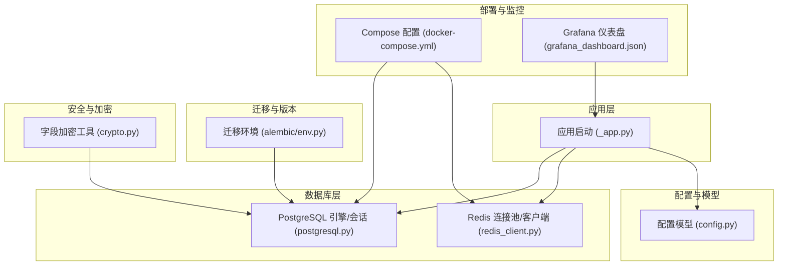
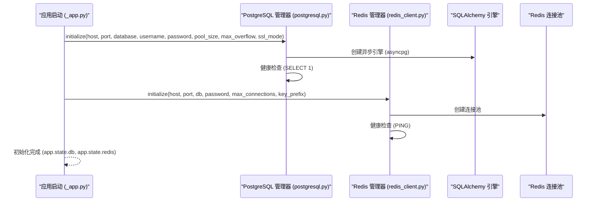
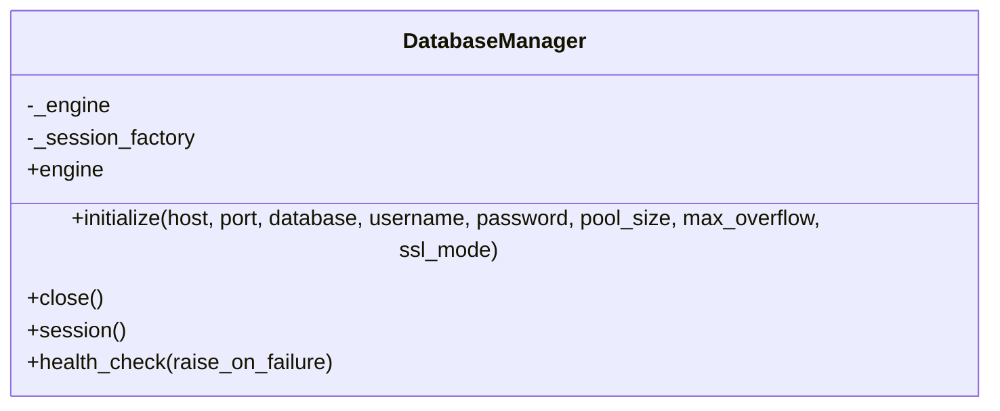
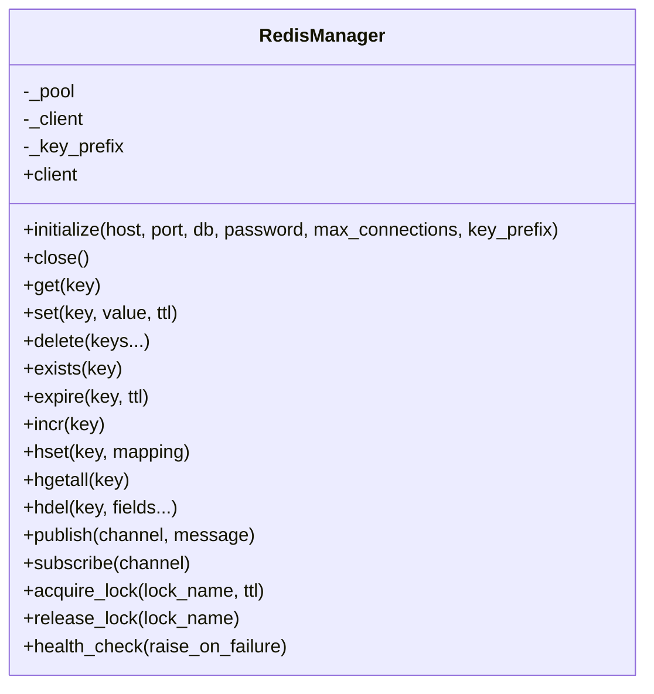
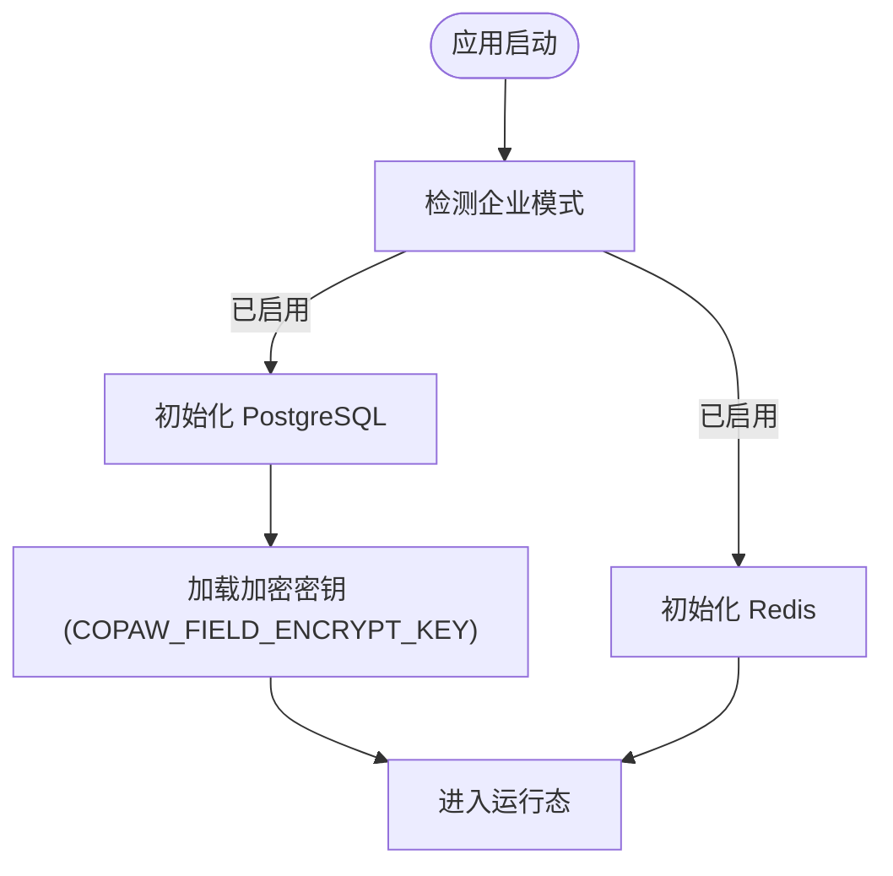
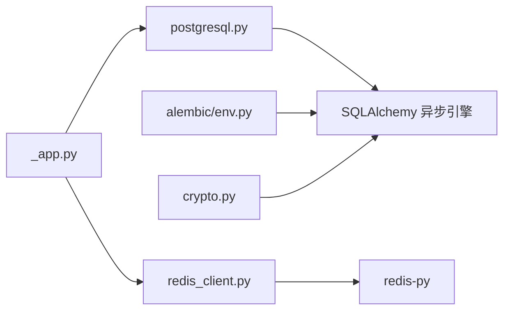
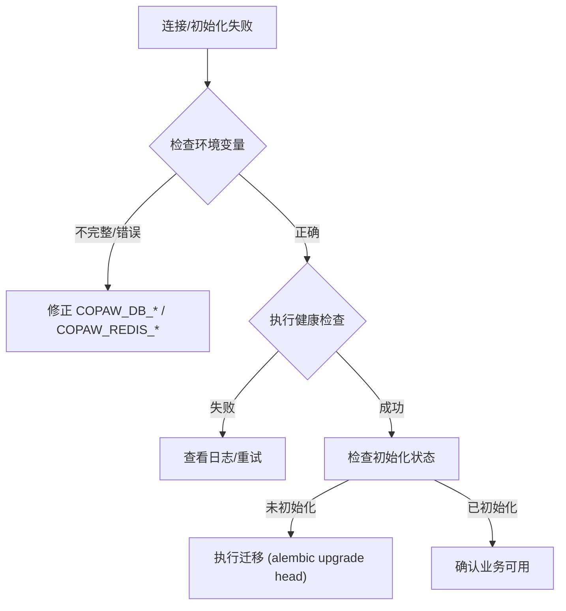

# 数据库配置

<cite>
**本文引用的文件**
- [postgresql.py](file://src/copaw/db/postgresql.py)
- [redis_client.py](file://src/copaw/db/redis_client.py)
- [config.py](file://src/copaw/config/config.py)
- [_app.py](file://src/copaw/app/_app.py)
- [docker-compose.yml](file://docker-compose.yml)
- [env.py](file://alembic/env.py)
- [crypto.py](file://src/copaw/enterprise/crypto.py)
- [grafana_dashboard.json](file://deploy/monitoring/grafana_dashboard.json)
- [start-enterprise.sh](file://scripts/start-enterprise.sh)
- [start-enterprise.ps1](file://scripts/start-enterprise.ps1)
</cite>

## 目录
1. [简介](#简介)
2. [项目结构](#项目结构)
3. [核心组件](#核心组件)
4. [架构总览](#架构总览)
5. [详细组件分析](#详细组件分析)
6. [依赖分析](#依赖分析)
7. [性能考虑](#性能考虑)
8. [故障排查指南](#故障排查指南)
9. [结论](#结论)
10. [附录](#附录)

## 简介
本文件面向 CoPaw 企业版的数据库配置，系统性说明 PostgreSQL 与 Redis 的连接配置、参数设置、连接池与健康检查、企业版安全与加密特性、性能调优与监控指标、不同环境下的配置模板与最佳实践、备份与高可用建议，以及配置验证与故障诊断流程。内容基于仓库中的实际实现与配置文件整理而成，确保可操作与可落地。

## 项目结构
围绕数据库配置的关键文件与职责如下：
- 数据库连接管理：PostgreSQL 使用异步引擎与会话工厂；Redis 使用异步连接池与客户端封装。
- 配置模型：Pydantic 模型定义了数据库与 Redis 的默认值与校验范围。
- 启动初始化：应用启动时根据企业模式加载并初始化数据库与 Redis。
- 迁移与版本：Alembic 通过环境变量构建 DSN，驱动迁移。
- 安全与加密：企业版提供字段级加密与密钥管理工具。
- 监控与可视化：Grafana 仪表盘展示租户用量与技能使用分布。
- 验证与脚本：Shell/PowerShell 脚本用于数据库初始化状态检查与连接测试。

**图表来源**
- [_app.py:174-205](file://src/copaw/app/_app.py#L174-L205)
- [postgresql.py:61-113](file://src/copaw/db/postgresql.py#L61-L113)
- [redis_client.py:43-77](file://src/copaw/db/redis_client.py#L43-L77)
- [config.py:32-81](file://src/copaw/config/config.py#L32-L81)
- [env.py:44-53](file://alembic/env.py#L44-L53)
- [crypto.py:26-48](file://src/copaw/enterprise/crypto.py#L26-L48)
- [docker-compose.yml:17-86](file://docker-compose.yml#L17-L86)
- [grafana_dashboard.json:111-127](file://deploy/monitoring/grafana_dashboard.json#L111-L127)

**章节来源**
- [postgresql.py:1-187](file://src/copaw/db/postgresql.py#L1-L187)
- [redis_client.py:1-218](file://src/copaw/db/redis_client.py#L1-L218)
- [config.py:32-81](file://src/copaw/config/config.py#L32-L81)
- [_app.py:174-205](file://src/copaw/app/_app.py#L174-L205)
- [docker-compose.yml:1-92](file://docker-compose.yml#L1-L92)
- [env.py:44-53](file://alembic/env.py#L44-L53)
- [crypto.py:1-140](file://src/copaw/enterprise/crypto.py#L1-L140)
- [grafana_dashboard.json:1-146](file://deploy/monitoring/grafana_dashboard.json#L1-L146)

## 核心组件
- PostgreSQL 异步连接管理器：负责构建 DSN、创建异步引擎与会话工厂、健康检查与关闭。
- Redis 异步连接管理器：负责创建连接池、客户端、命名空间前缀、常用缓存与发布订阅操作、分布式锁、健康检查。
- 配置模型：定义企业版数据库与 Redis 的默认值、取值范围与环境变量回退策略。
- 应用初始化：在企业模式下加载并初始化数据库与 Redis。
- Alembic 迁移：从环境变量构建 DSN，驱动迁移执行。
- 加密工具：提供字段级 AES-256-GCM 加密与密钥管理。
- 监控仪表盘：展示租户用量与技能使用分布。

**章节来源**
- [postgresql.py:41-187](file://src/copaw/db/postgresql.py#L41-L187)
- [redis_client.py:22-218](file://src/copaw/db/redis_client.py#L22-L218)
- [config.py:32-81](file://src/copaw/config/config.py#L32-L81)
- [_app.py:174-205](file://src/copaw/app/_app.py#L174-L205)
- [env.py:44-53](file://alembic/env.py#L44-L53)
- [crypto.py:26-140](file://src/copaw/enterprise/crypto.py#L26-L140)
- [grafana_dashboard.json:111-127](file://deploy/monitoring/grafana_dashboard.json#L111-L127)

## 架构总览
PostgreSQL 与 Redis 在企业模式下由应用启动阶段统一初始化，分别承担持久化与缓存/消息能力。PostgreSQL 使用 SQLAlchemy 2.0 异步引擎与 asyncpg 驱动；Redis 使用 redis-py 异步客户端与连接池。迁移通过 Alembic 读取环境变量构建 DSN 并执行。

**图表来源**
- [_app.py:190-202](file://src/copaw/app/_app.py#L190-L202)
- [postgresql.py:61-113](file://src/copaw/db/postgresql.py#L61-L113)
- [redis_client.py:43-77](file://src/copaw/db/redis_client.py#L43-L77)

## 详细组件分析

### PostgreSQL 连接与配置
- 连接参数
  - 主机、端口、数据库名、用户名、密码均支持环境变量回退。
  - SSL 模式默认“prefer”，可按需调整。
- 连接池
  - 默认池大小与最大溢出数可通过初始化参数传入，亦可由环境变量注入。
  - 引擎启用 pre_ping，提升连接存活检测。
- 健康检查
  - 通过执行简单查询验证连通性，失败时可选择抛出异常快速失败。
- 迁移与版本
  - Alembic 通过环境变量构建 DSN，支持离线生成 SQL 与在线迁移。

**图表来源**
- [postgresql.py:41-187](file://src/copaw/db/postgresql.py#L41-L187)
- [env.py:44-53](file://alembic/env.py#L44-L53)

**章节来源**
- [postgresql.py:61-113](file://src/copaw/db/postgresql.py#L61-L113)
- [env.py:44-53](file://alembic/env.py#L44-L53)

### Redis 连接与配置
- 连接参数
  - 主机、端口、数据库编号、密码支持环境变量回退。
  - 最大连接数与键前缀可配置。
- 连接池
  - 使用异步连接池，开启响应解码。
- 健康检查
  - 通过 PING 验证连通性。
- 常用操作
  - 字符串缓存：get/set/delete/exists/expire/incr。
  - 哈希：hset/hgetall/hdel（用于会话存储）。
  - 发布/订阅：publish/listen。
  - 分布式锁：基于 SET NX EX 的简单锁。

**图表来源**
- [redis_client.py:22-218](file://src/copaw/db/redis_client.py#L22-L218)

**章节来源**
- [redis_client.py:43-77](file://src/copaw/db/redis_client.py#L43-L77)
- [redis_client.py:109-136](file://src/copaw/db/redis_client.py#L109-L136)
- [redis_client.py:142-149](file://src/copaw/db/redis_client.py#L142-L149)
- [redis_client.py:155-168](file://src/copaw/db/redis_client.py#L155-L168)
- [redis_client.py:174-192](file://src/copaw/db/redis_client.py#L174-L192)

### 企业版数据库与安全配置
- 企业开关
  - 通过环境变量启用企业模式，应用启动时初始化数据库与 Redis。
- 字段级加密
  - 使用 AES-256-GCM 对敏感列进行透明加解密，密钥来自环境变量。
  - 支持密钥轮换辅助函数。
- 配置模型
  - DatabaseConfig/RedisConfig 定义默认值与取值范围，支持环境变量回退。

**图表来源**
- [_app.py:174-205](file://src/copaw/app/_app.py#L174-L205)
- [crypto.py:26-48](file://src/copaw/enterprise/crypto.py#L26-L48)
- [config.py:32-81](file://src/copaw/config/config.py#L32-L81)

**章节来源**
- [_app.py:174-205](file://src/copaw/app/_app.py#L174-L205)
- [crypto.py:26-140](file://src/copaw/enterprise/crypto.py#L26-L140)
- [config.py:32-81](file://src/copaw/config/config.py#L32-L81)

## 依赖分析
- 组件耦合
  - 应用启动依赖数据库与 Redis 管理器；数据库管理器依赖 SQLAlchemy 异步引擎；Redis 管理器依赖 redis-py。
- 外部依赖
  - PostgreSQL 驱动：asyncpg（异步）、psycopg2（Alembic 同步）。
  - Redis 客户端：redis-py >= 5.0。
- 环境变量
  - PostgreSQL：COPAW_DB_HOST/PORT/NAME/USER/PASSWORD。
  - Redis：COPAW_REDIS_HOST/PORT/DB/PASSWORD。
  - 企业加密：COPAW_FIELD_ENCRYPT_KEY。
  - JWT 密钥：COPAW_JWT_SECRET（生产环境务必覆盖）。

**图表来源**
- [_app.py:190-202](file://src/copaw/app/_app.py#L190-L202)
- [postgresql.py:15-21](file://src/copaw/db/postgresql.py#L15-L21)
- [redis_client.py:15-17](file://src/copaw/db/redis_client.py#L15-L17)
- [env.py:21-22](file://alembic/env.py#L21-L22)
- [crypto.py](file://src/copaw/enterprise/crypto.py#L20)

**章节来源**
- [_app.py:190-202](file://src/copaw/app/_app.py#L190-L202)
- [postgresql.py:15-21](file://src/copaw/db/postgresql.py#L15-L21)
- [redis_client.py:15-17](file://src/copaw/db/redis_client.py#L15-L17)
- [env.py:21-22](file://alembic/env.py#L21-L22)
- [crypto.py](file://src/copaw/enterprise/crypto.py#L20)

## 性能考虑
- 连接池参数
  - PostgreSQL：池大小与最大溢出数影响并发与资源占用，建议结合业务峰值与数据库承载能力调优。
  - Redis：最大连接数与键前缀影响缓存命中与键冲突，建议按租户/命名空间隔离。
- 健康检查与预检
  - 启动阶段执行健康检查，失败即刻暴露问题，避免运行期抖动。
- 缓存策略
  - 利用 Redis TTL、哈希与发布订阅优化会话存储与事件通知。
- 监控指标
  - Grafana 仪表盘提供租户请求速率与技能使用分布，便于容量规划与热点识别。

**章节来源**
- [postgresql.py:96-102](file://src/copaw/db/postgresql.py#L96-L102)
- [redis_client.py:67-73](file://src/copaw/db/redis_client.py#L67-L73)
- [grafana_dashboard.json:111-127](file://deploy/monitoring/grafana_dashboard.json#L111-L127)

## 故障排查指南
- 连接失败
  - 检查环境变量是否正确（主机、端口、凭据、数据库名）。
  - 使用脚本进行连接测试：Shell/PowerShell 脚本分别尝试 Python/redis-cli 进行 PING/SELECT 验证。
- 初始化状态检查
  - 通过脚本查询 alembic 版本表判断数据库是否已初始化。
- 健康检查
  - PostgreSQL：执行简单查询；Redis：PING。
- 日志定位
  - 关注启动日志中的连接与健康检查输出，定位具体失败环节。

**图表来源**
- [start-enterprise.sh:143-178](file://scripts/start-enterprise.sh#L143-L178)
- [start-enterprise.ps1:138-169](file://scripts/start-enterprise.ps1#L138-L169)
- [start-enterprise.ps1:209-245](file://scripts/start-enterprise.ps1#L209-L245)

**章节来源**
- [start-enterprise.sh:143-178](file://scripts/start-enterprise.sh#L143-L178)
- [start-enterprise.ps1:138-169](file://scripts/start-enterprise.ps1#L138-L169)
- [start-enterprise.ps1:209-245](file://scripts/start-enterprise.ps1#L209-L245)

## 结论
CoPaw 企业版的数据库配置以清晰的模块化设计实现：PostgreSQL 与 Redis 的连接、连接池、健康检查与初始化流程均在启动阶段集中处理；配置模型与环境变量回退确保多环境一致性；企业版加密与密钥管理提供字段级安全；监控仪表盘为性能与容量提供可视化支撑。遵循本文档的配置模板与最佳实践，可在开发、测试与生产环境中稳定运行。

## 附录

### 环境变量与默认值
- PostgreSQL
  - COPAW_DB_HOST/COPAW_DB_PORT/COPAW_DB_NAME/COPAW_DB_USER/COPAW_DB_PASSWORD
  - 默认池大小与最大溢出数可通过初始化参数传入
- Redis
  - COPAW_REDIS_HOST/COPAW_REDIS_PORT/COPAW_REDIS_DB/COPAW_REDIS_PASSWORD
  - 最大连接数与键前缀可配置
- 企业加密
  - COPAW_FIELD_ENCRYPT_KEY（32 字节十六进制字符串）
- JWT 密钥
  - COPAW_JWT_SECRET（生产环境务必覆盖）

**章节来源**
- [config.py:32-81](file://src/copaw/config/config.py#L32-L81)
- [postgresql.py:77-83](file://src/copaw/db/postgresql.py#L77-L83)
- [redis_client.py:53-56](file://src/copaw/db/redis_client.py#L53-L56)
- [crypto.py:26-48](file://src/copaw/enterprise/crypto.py#L26-L48)
- [docker-compose.yml:74-88](file://docker-compose.yml#L74-L88)

### 不同环境下的配置模板
- 开发（本地）
  - 使用默认 localhost 与默认端口；凭据可为空或本地默认值；Redis 可禁用密码。
- 容器（Docker Compose）
  - 通过环境变量注入数据库与 Redis 凭据；容器内服务名作为主机；暴露端口限制在本地回环。
- 生产
  - 强制使用非空凭据与安全密钥；启用 SSL；限制暴露端口；配置高可用与备份策略。

**章节来源**
- [docker-compose.yml:17-86](file://docker-compose.yml#L17-L86)

### 高可用与备份建议
- 高可用
  - PostgreSQL：主从复制、自动故障转移与只读副本；Redis：哨兵/集群模式（依据部署形态）。
- 备份
  - PostgreSQL：逻辑备份（如 pg_dump）与物理备份结合；Redis：RDB/AOF 持久化策略与定期快照。
- 监控
  - 结合 Grafana/Prometheus 展示关键指标（连接数、延迟、命中率、任务量）。

**章节来源**
- [docker-compose.yml:30-58](file://docker-compose.yml#L30-L58)
- [grafana_dashboard.json:111-127](file://deploy/monitoring/grafana_dashboard.json#L111-L127)

### 配置验证清单
- 网络连通性：Ping/Connectivity 测试
- 认证与授权：凭据正确、最小权限
- 初始化状态：检查 alembic 版本表
- 连接池健康：预热与健康检查
- 加密密钥：密钥格式正确、可轮换

**章节来源**
- [start-enterprise.sh:143-178](file://scripts/start-enterprise.sh#L143-L178)
- [start-enterprise.ps1:209-245](file://scripts/start-enterprise.ps1#L209-L245)
- [crypto.py:26-48](file://src/copaw/enterprise/crypto.py#L26-L48)