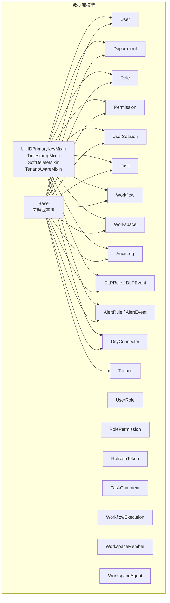
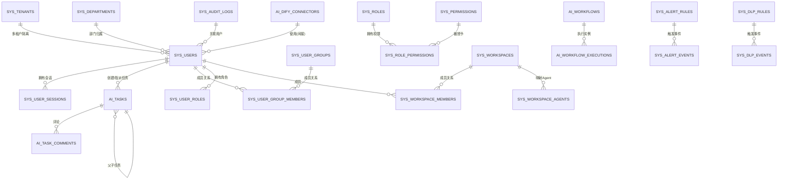
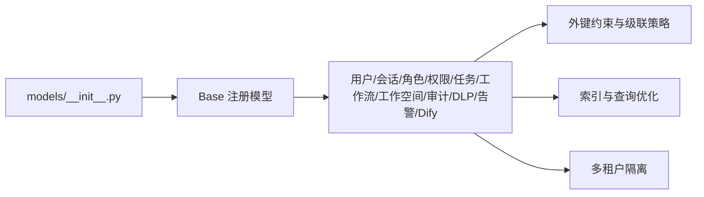

# 数据模型

<cite>
**本文引用的文件**
- [models/__init__.py](file://src/copaw/db/models/__init__.py)
- [models/base.py](file://src/copaw/db/models/base.py)
- [models/user.py](file://src/copaw/db/models/user.py)
- [models/role.py](file://src/copaw/db/models/role.py)
- [models/permission.py](file://src/copaw/db/models/permission.py)
- [models/organization.py](file://src/copaw/db/models/organization.py)
- [models/session.py](file://src/copaw/db/models/session.py)
- [models/task.py](file://src/copaw/db/models/task.py)
- [models/workflow.py](file://src/copaw/db/models/workflow.py)
- [models/workspace.py](file://src/copaw/db/models/workspace.py)
- [models/tenant.py](file://src/copaw/db/models/tenant.py)
- [models/audit_log.py](file://src/copaw/db/models/audit_log.py)
- [models/dlp.py](file://src/copaw/db/models/dlp.py)
- [models/alert.py](file://src/copaw/db/models/alert.py)
- [models/dify.py](file://src/copaw/db/models/dify.py)
</cite>

## 目录
1. [简介](#简介)
2. [项目结构](#项目结构)
3. [核心组件](#核心组件)
4. [架构总览](#架构总览)
5. [详细组件分析](#详细组件分析)
6. [依赖分析](#依赖分析)
7. [性能考量](#性能考量)
8. [故障排查指南](#故障排查指南)
9. [结论](#结论)
10. [附录](#附录)

## 简介
本文件面向 CoPaw 的数据模型，系统化梳理所有实体（表）的字段定义、数据类型、主键/外键、索引与约束，并解释验证与业务规则。文档同时给出实体关系图、字段说明、关联关系与级联行为、典型查询模式以及数据访问与性能优化建议，帮助开发者与运维人员准确理解与使用数据层。

## 项目结构
CoPaw 的 ORM 模型集中于 src/copaw/db/models 目录，采用 SQLAlchemy 声明式基类与通用混入（mixin）统一风格，所有模型均继承自统一的 Base 并复用 UUID 主键、时间戳与多租户隔离等能力。模型注册入口导出全部实体，供 Alembic 迁移与应用初始化使用。

图表来源
- [models/__init__.py:8-21](file://src/copaw/db/models/__init__.py#L8-L21)
- [models/base.py:19-75](file://src/copaw/db/models/base.py#L19-L75)

章节来源
- [models/__init__.py:1-49](file://src/copaw/db/models/__init__.py#L1-L49)
- [models/base.py:1-76](file://src/copaw/db/models/base.py#L1-L76)

## 核心组件
- 统一基类与混入
  - Base：所有模型的超类，确保一致的元数据与命名约定。
  - UUIDPrimaryKeyMixin：统一的 UUID 主键，服务端默认生成随机 UUID。
  - TimestampMixin：自动维护 created_at/updated_at，支持服务器默认值与更新回调。
  - SoftDeleteMixin：逻辑删除标记 deleted_at，便于审计与恢复。
  - TenantAwareMixin：多租户隔离字段 tenant_id，默认值为“default-tenant”，并建立索引以提升查询效率。
- 关键约束与默认值
  - 字段注释详尽，覆盖业务含义与取值范围。
  - 外键约束与级联策略明确，包括 SET NULL、CASCADE、RESTRICT 等。
  - 索引覆盖高频查询字段（如用户名、会话 JTI、状态、时间戳等）。

章节来源
- [models/base.py:19-75](file://src/copaw/db/models/base.py#L19-L75)

## 架构总览
下图展示 CoPaw 数据模型的核心实体与它们之间的关系，涵盖用户与组织、角色权限、会话与安全、任务与工作流、工作空间、审计与安全告警、Dify 连接器等模块。

图表来源
- [models/tenant.py:7-25](file://src/copaw/db/models/tenant.py#L7-L25)
- [models/organization.py:21-82](file://src/copaw/db/models/organization.py#L21-L82)
- [models/user.py:25-90](file://src/copaw/db/models/user.py#L25-L90)
- [models/role.py:24-74](file://src/copaw/db/models/role.py#L24-L74)
- [models/permission.py:18-45](file://src/copaw/db/models/permission.py#L18-L45)
- [models/session.py:21-70](file://src/copaw/db/models/session.py#L21-L70)
- [models/task.py:23-112](file://src/copaw/db/models/task.py#L23-L112)
- [models/workflow.py:19-76](file://src/copaw/db/models/workflow.py#L19-L76)
- [models/workspace.py:20-55](file://src/copaw/db/models/workspace.py#L20-L55)
- [models/audit_log.py:18-100](file://src/copaw/db/models/audit_log.py#L18-L100)
- [models/dlp.py:18-65](file://src/copaw/db/models/dlp.py#L18-L65)
- [models/alert.py:18-66](file://src/copaw/db/models/alert.py#L18-L66)
- [models/dify.py:7-24](file://src/copaw/db/models/dify.py#L7-L24)

## 详细组件分析

### 租户（Tenant）
- 表名：sys_tenants
- 主键：id（字符串，长度 36）
- 字段
  - id：租户唯一标识，主键
  - name：租户名称
  - domain：租户域名标识，唯一
  - is_active：是否激活
  - created_at/updated_at：时间戳
- 约束与索引
  - domain 唯一
  - created_at/updated_at 自动维护
- 业务规则
  - 所有业务实体均通过 tenant_id 隔离，避免跨租户数据泄露
- 典型查询
  - 按 domain 查询租户
  - 分页查询激活租户

章节来源
- [models/tenant.py:7-25](file://src/copaw/db/models/tenant.py#L7-L25)

### 用户（User）
- 表名：sys_users
- 主键：id（UUID）
- 字段
  - username：唯一、索引
  - email：唯一、索引
  - password_hash/password_salt：认证凭据
  - display_name：显示名称
  - department_id：外键到 sys_departments.ondelete=SET NULL
  - status：账户状态枚举
  - mfa_enabled/mfa_secret：MFA 开关与加密存储密钥
  - last_login_at：最后登录时间
  - created_at/updated_at：时间戳
  - tenant_id：多租户隔离
- 约束与索引
  - username/email 唯一且带索引
  - department_id 外键
- 关系
  - 一对多：department.members
  - 一对多：roles、sessions、group_memberships（级联删除）
- 典型查询
  - 按用户名/邮箱登录
  - 查询某部门成员
  - 查询某租户下用户

章节来源
- [models/user.py:25-90](file://src/copaw/db/models/user.py#L25-L90)

### 部门（Department）
- 表名：sys_departments
- 主键：id（UUID）
- 字段
  - name：索引
  - parent_id：自引用外键，ondelete=SET NULL
  - manager_id：外键到 sys_users.ondelete=SET NULL
  - level：层级深度
  - description：描述
  - created_at/updated_at：时间戳
  - tenant_id：多租户隔离
- 约束与索引
  - parent_id 自引用
  - manager_id 外键
- 关系
  - 自引用：parent/children
  - 一对多：members（User.department）
  - 一对一：manager（User）
- 典型查询
  - 递归查询部门树（CTE）
  - 查询某用户的直接/间接下属

章节来源
- [models/organization.py:21-82](file://src/copaw/db/models/organization.py#L21-L82)

### 角色（Role）、权限（Permission）、角色-权限（RolePermission）、用户-角色（UserRole）
- 表名：sys_roles、sys_permissions、sys_role_permissions、sys_user_roles
- 主键
  - Role：id（UUID）
  - Permission：id（UUID）
  - RolePermission：(role_id, permission_id) 复合主键
  - UserRole：(user_id, role_id) 复合主键
- 字段与关系
  - Role：name 唯一、索引；parent_role_id 自引用；level；department_id；is_system_role
  - Permission：resource/action 唯一组合索引
  - RolePermission：granted_at
  - UserRole：assigned_at、assigned_by（外键到 sys_users）
- 约束与索引
  - Role.parent_role_id 自引用
  - Permission.resource/action 唯一索引
  - RolePermission/UserRole 复合主键
- 业务规则
  - 支持最多 5 级角色继承
  - 系统角色不可删除
  - 授权与角色分配具备审计轨迹
- 典型查询
  - 用户有效权限计算（含继承）
  - 查询某角色被授予的权限
  - 查询某用户当前角色

章节来源
- [models/role.py:24-150](file://src/copaw/db/models/role.py#L24-L150)
- [models/permission.py:18-49](file://src/copaw/db/models/permission.py#L18-L49)

### 会话与刷新令牌（UserSession、RefreshToken）
- 表名：sys_user_sessions、sys_refresh_tokens
- 主键
  - UserSession：id（UUID）
  - RefreshToken：id（UUID）
- 字段与关系
  - UserSession：user_id 外键；access_token_jti 唯一、索引；ip_address/user_agent；expires_at 索引；revoked/revoked_at
  - RefreshToken：session_id 外键、索引；token_hash 唯一；expires_at；used/used_at
- 约束与索引
  - UserSession.user_id 外键
  - RefreshToken.session_id 外键
  - access_token_jti 唯一
- 业务规则
  - 会话与刷新令牌均支持撤销与过期控制
  - 刷新令牌一次性使用并哈希存储
- 典型查询
  - 按 JTI 查找活动会话
  - 查询过期/撤销的会话
  - 校验刷新令牌有效性

章节来源
- [models/session.py:21-116](file://src/copaw/db/models/session.py#L21-L116)

### 任务与评论（Task、TaskComment）
- 表名：ai_tasks、ai_task_comments
- 主键
  - Task：id（UUID）
  - TaskComment：id（UUID）
- 字段与关系
  - Task：title/description/status/priority；creator_id/assignee_id/assignee_group_id/department_id 外键；due_date/completed_at；parent_task_id 自引用；workflow_id 外键；metadata JSONB
  - TaskComment：task_id 外键、索引；author_id 外键；content；created_at
- 约束与索引
  - Task.status、parent_task_id 自引用
  - TaskComment.task_id 建有索引
- 业务规则
  - 支持父子任务（子任务继承部分属性）
  - 评论与任务生命周期解耦（级联删除）
- 典型查询
  - 查询某用户待办任务（按状态/截止时间）
  - 查询任务历史评论
  - 查询某工作流触发的任务

章节来源
- [models/task.py:23-151](file://src/copaw/db/models/task.py#L23-L151)

### 工作流与执行（Workflow、WorkflowExecution）
- 表名：ai_workflows、ai_workflow_executions
- 主键
  - Workflow：id（UUID）
  - WorkflowExecution：id（UUID）
- 字段与关系
  - Workflow：name（索引）、description、category（索引）、definition(JSONB)、version、status、creator_id 外键
  - WorkflowExecution：workflow_id 外键、索引；triggered_by 外键；status（索引）；started_at/completed_at；input_data/output_data/error_message/run_metadata JSONB
- 约束与索引
  - Workflow.name/category 带索引
  - WorkflowExecution.workflow_id/status 带索引
- 业务规则
  - 支持多种工作流类别（dify/chatflow/agent/internal）
  - 执行状态机驱动
- 典型查询
  - 查询某工作流最新执行
  - 查询某状态下的执行实例
  - 查询某工作流的执行历史

章节来源
- [models/workflow.py:19-149](file://src/copaw/db/models/workflow.py#L19-L149)

### 工作空间（Workspace）、成员（WorkspaceMember）、Agent 映射（WorkspaceAgent）
- 表名：sys_workspaces、sys_workspace_members、sys_workspace_agents
- 主键
  - Workspace：id（UUID）
  - WorkspaceMember：(workspace_id, user_id) 复合主键
  - WorkspaceAgent：(workspace_id, agent_id) 复合主键
- 字段与关系
  - Workspace：name/description/is_default；owner_id 外键
  - WorkspaceMember：role（viewer/editor/admin）；created_at
  - WorkspaceAgent：visibility（PRIVATE/WORKSPACE/ENTERPRISE）
- 约束与索引
  - WorkspaceMember 复合主键
  - WorkspaceAgent 复合主键
- 业务规则
  - Agent 与工作空间的可见性控制
  - 成员角色决定访问权限
- 典型查询
  - 查询用户可访问的工作空间
  - 查询某工作空间的成员与角色
  - 查询某工作空间下可见的 Agent

章节来源
- [models/workspace.py:20-112](file://src/copaw/db/models/workspace.py#L20-L112)

### 审计日志（AuditLog）
- 表名：sys_audit_logs
- 主键：id（自增整型）
- 字段
  - timestamp、user_id、user_role、action_type、resource_type、resource_id、action_result
  - client_ip、client_device(JSONB)、context(JSONB)
  - data_before/data_after（JSONB，敏感操作前后数据）
  - is_sensitive
- 索引
  - timestamp、user_id、action_type、resource_type
- 业务规则
  - ISO 27001 合规的只追加审计日志
  - 敏感操作记录前后快照
- 典型查询
  - 某用户/资源/时间段的操作审计
  - 某类操作（如登录、任务创建）的统计

章节来源
- [models/audit_log.py:18-106](file://src/copaw/db/models/audit_log.py#L18-L106)

### DLP（数据泄漏防护）
- 表名：sys_dlp_rules、sys_dlp_events
- 主键
  - DLPRule：id（UUID）
  - DLPEvent：id（UUID）
- 字段与关系
  - DLPRule：rule_name 唯一；pattern_regex；action（mask/alert/block）；is_active/is_builtin；created_at/updated_at
  - DLPEvent：rule_name；action_taken；content_summary；user_id；context_path；triggered_at
- 约束与索引
  - rule_name 唯一
  - DLPEvent.rule_name、triggered_at 带索引
- 业务规则
  - 内置规则不可删除
  - 不存储完整敏感值，仅摘要
- 典型查询
  - 查询某规则触发事件
  - 统计某时间段内触发次数

章节来源
- [models/dlp.py:18-107](file://src/copaw/db/models/dlp.py#L18-L107)

### 告警（Alert）
- 表名：sys_alert_rules、sys_alert_events
- 主键
  - AlertRule：id（UUID）
  - AlertEvent：id（UUID）
- 字段与关系
  - AlertRule：rule_type 唯一、索引；threshold、window_seconds；notify_channels(JSONB)；is_active；created_at
  - AlertEvent：rule_type；triggered_at；context(JSONB)；notify_status
- 约束与索引
  - AlertRule.rule_type 唯一且索引
  - AlertEvent.rule_type/triggered_at 带索引
- 业务规则
  - 基于滚动窗口与阈值的异常检测
  - 通知状态（sent/failed/suppressed）
- 典型查询
  - 查询最近告警事件
  - 统计某规则触发频率

章节来源
- [models/alert.py:18-102](file://src/copaw/db/models/alert.py#L18-L102)

### Dify 连接器（DifyConnector）
- 表名：ai_dify_connectors
- 主键：id（字符串）
- 字段
  - name/description/api_url/api_key/is_active；created_at/updated_at
- 业务规则
  - 作为外部平台连接配置，未来可扩展加密存储
- 典型查询
  - 查询激活的连接器
  - 按名称检索

章节来源
- [models/dify.py:7-24](file://src/copaw/db/models/dify.py#L7-L24)

## 依赖分析
- 模型注册
  - models/__init__.py 导出 Base 与全部模型，供 Alembic env.py 使用统一元数据目标。
- 外键与级联
  - 大多数删除场景采用 CASCADE 或 SET NULL，确保数据一致性与可清理性。
  - 用户与其会话、角色与其权限、任务与其评论、工作流与其执行等均采用级联删除或受限删除策略。
- 索引策略
  - 高频查询字段（用户名、JTI、状态、时间戳、租户隔离字段）普遍建立索引，提升查询性能。
- 多租户隔离
  - TenantAwareMixin 统一注入 tenant_id 并建立索引，确保跨租户数据隔离。

图表来源
- [models/__init__.py:8-21](file://src/copaw/db/models/__init__.py#L8-L21)
- [models/base.py:65-75](file://src/copaw/db/models/base.py#L65-L75)

章节来源
- [models/__init__.py:1-49](file://src/copaw/db/models/__init__.py#L1-L49)
- [models/base.py:1-76](file://src/copaw/db/models/base.py#L1-L76)

## 性能考量
- 索引与查询
  - 对 username、email、access_token_jti、status、tenant_id、triggered_at 等字段建立索引，满足高频过滤与排序需求。
  - 审计日志按 timestamp/user_id/action_type/resource_type 建立复合索引，支持范围查询与聚合。
- 时间字段
  - 使用带时区的 DateTime，配合 server_default/onupdate，减少应用侧时间处理开销。
- JSONB 字段
  - metadata、context、input_data/output_data 等采用 JSONB，适合灵活结构存储；注意避免过度嵌套与大对象频繁读写。
- 事务与批量
  - 批量插入/更新时合并事务，减少往返开销；对大对象（如审计日志）采用异步写入策略。
- 缓存与会话
  - 会话与刷新令牌在 Redis 中镜像，PG 仅做审计与持久化，降低高并发下的锁竞争。

## 故障排查指南
- 登录与会话问题
  - 检查 UserSession.access_token_jti 是否唯一且未过期；确认 revoked=false。
  - 校验 RefreshToken.token_hash 是否已使用（used=true）或过期。
- 权限与角色
  - 若用户无法访问资源，检查 UserRole 与 RolePermission 的授予时间与 assigned_by 审计轨迹。
  - 确认角色继承链不超过 5 级。
- 任务与工作流
  - 任务状态异常：核对 due_date/completed_at 与 parent_task_id 的一致性。
  - 工作流执行失败：查看 WorkflowExecution.error_message 与 run_metadata。
- 审计与安全
  - 审计日志缺失：确认写入流程与只追加策略；检查 is_sensitive 场景的数据前后快照。
  - DLP/告警误报：调整规则阈值与滚动窗口，或新增规则。
- 多租户隔离
  - 出现跨租户数据：检查 tenant_id 是否正确传递与查询条件是否包含 tenant_id。

## 结论
CoPaw 的数据模型以统一基类与混入为基础，结合严格的外键约束、索引与多租户隔离，形成清晰的企业级数据架构。通过角色权限、会话安全、任务工作流、审计告警与 DLP 等模块的协同，支撑从身份认证到智能工作流的全栈能力。建议在生产环境中持续关注索引维护、JSONB 查询优化与审计日志的容量规划。

## 附录
- 示例数据结构（字段与类型概览）
  - 用户：username（字符串，唯一）、email（字符串，唯一）、password_hash/salt（字符串）、display_name（字符串）、department_id（UUID）、status（枚举）、mfa_enabled（布尔）、last_login_at（时间）
  - 任务：title（字符串）、status（枚举）、priority（枚举）、assignee_id/assignee_group_id/department_id（UUID）、due_date（时间）、metadata（JSONB）
  - 工作流：name（字符串，索引）、category（字符串，索引）、definition（JSONB）、status（枚举）、version（整数）
  - 审计日志：action_type（字符串）、resource_type（字符串）、resource_id（字符串）、client_ip（INET）、context（JSONB）、is_sensitive（布尔）
  - DLP：rule_name（字符串，唯一）、pattern_regex（文本）、action（枚举）、is_active/is_builtin（布尔）
  - 告警：rule_type（字符串，唯一且索引）、threshold（整数）、window_seconds（整数）、notify_channels（JSONB）
- 典型查询模式
  - 用户登录：按 username/email 查找，校验密码哈希与状态
  - 权限计算：自顶向下遍历角色继承链，合并权限集合
  - 任务筛选：按 status/priority/assignee_id/department_id/due_date 组合过滤
  - 工作流执行：按 workflow_id/status 查询最新执行
  - 审计报表：按 action_type/resource_type/timestamp 聚合统计
  - DLP/告警：按规则类型与时间窗口统计触发次数