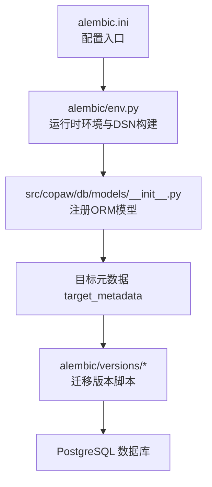
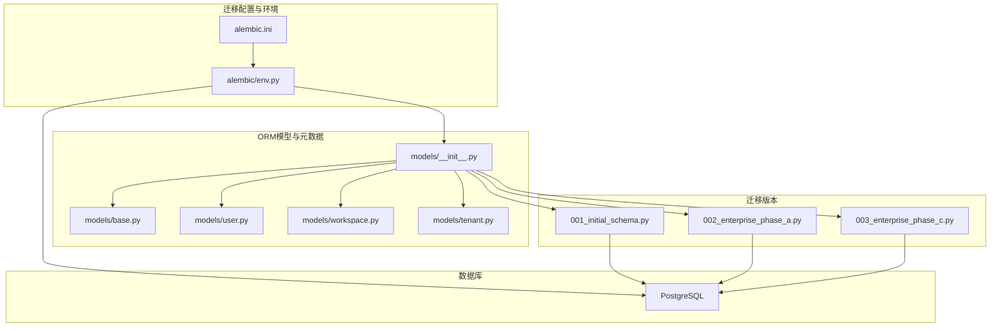
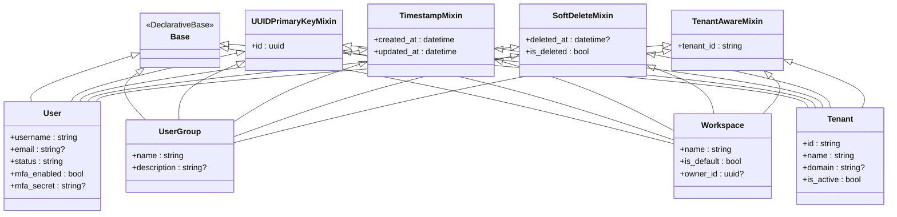
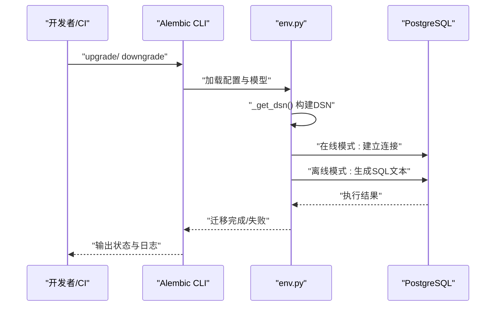
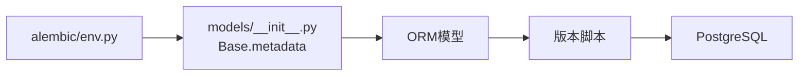

# 迁移管理

<cite>
**本文引用的文件**   
- [alembic.ini](file://alembic.ini)
- [env.py](file://alembic/env.py)
- [001_initial_schema.py](file://alembic/versions/001_initial_schema.py)
- [002_enterprise_phase_a.py](file://alembic/versions/002_enterprise_phase_a.py)
- [003_enterprise_phase_c.py](file://alembic/versions/003_enterprise_phase_c.py)
- [models/__init__.py](file://src/copaw/db/models/__init__.py)
- [models/base.py](file://src/copaw/db/models/base.py)
- [models/user.py](file://src/copaw/db/models/user.py)
- [models/workspace.py](file://src/copaw/db/models/workspace.py)
- [models/tenant.py](file://src/copaw/db/models/tenant.py)
- [migration.py](file://src/copaw/app/migration.py)
</cite>

## 目录
1. [简介](#简介)
2. [项目结构](#项目结构)
3. [核心组件](#核心组件)
4. [架构总览](#架构总览)
5. [详细组件分析](#详细组件分析)
6. [依赖分析](#依赖分析)
7. [性能考虑](#性能考虑)
8. [故障排除指南](#故障排除指南)
9. [结论](#结论)
10. [附录](#附录)

## 简介
本文件面向 CoPaw 的数据库迁移管理，系统化说明 Alembic 迁移框架的配置与使用、迁移历史与变更、编写规范与最佳实践、执行流程与回滚策略、版本控制机制、企业版功能迁移路径与兼容性处理，并提供生产环境安全策略与备份要求、故障排除与常见问题解决方案。

## 项目结构
CoPaw 的数据库迁移采用 Alembic 管理，核心位置如下：
- 配置与运行环境：alembic.ini、alembic/env.py
- 迁移版本：alembic/versions 下的版本脚本（初始、企业阶段 A、企业阶段 C）
- ORM 模型注册：src/copaw/db/models/__init__.py 导出 Base.metadata，供 Alembic 检测模型
- 应用层迁移工具：src/copaw/app/migration.py 提供应用级配置迁移能力（非数据库表结构）

图表来源
- [alembic.ini:1-44](file://alembic.ini#L1-L44)
- [env.py:1-95](file://alembic/env.py#L1-L95)
- [models/__init__.py:1-49](file://src/copaw/db/models/__init__.py#L1-L49)

章节来源
- [alembic.ini:1-44](file://alembic.ini#L1-L44)
- [env.py:1-95](file://alembic/env.py#L1-L95)
- [models/__init__.py:1-49](file://src/copaw/db/models/__init__.py#L1-L49)

## 核心组件
- Alembic 配置与运行环境
  - alembic.ini：定义脚手架位置、模板命名、日志级别等；通过环境变量动态构建 DSN。
  - alembic/env.py：在运行前将 src/ 加入 sys.path，导入 ORM 模型以注册元数据；根据 COPAW_DB_* 环境变量生成连接字符串；支持离线与在线两种迁移模式。
- 迁移版本脚本
  - 001_initial_schema.py：创建企业版初始核心表集合，启用 pgcrypto 扩展。
  - 002_enterprise_phase_a.py：新增 DLP 规则与事件、告警规则与事件、Dify 连接器等表。
  - 003_enterprise_phase_c.py：为现有核心表增加多租户字段 tenant_id 并建立外键约束。
- ORM 模型与元数据
  - models/__init__.py：集中导出 Base 与各模型，确保 Alembic 能扫描到所有表结构。
  - models/base.py：统一基类与通用混入（UUID 主键、时间戳、软删除、多租户）。
  - models/user.py、models/workspace.py、models/tenant.py：具体业务表模型，均继承多租户混入以满足隔离需求。
- 应用层迁移工具
  - src/copaw/app/migration.py：负责应用配置与工作区从旧结构迁移到新多智能体结构，非数据库表结构迁移，但与整体升级路径相关。

章节来源
- [alembic.ini:1-44](file://alembic.ini#L1-L44)
- [env.py:1-95](file://alembic/env.py#L1-L95)
- [001_initial_schema.py:1-318](file://alembic/versions/001_initial_schema.py#L1-L318)
- [002_enterprise_phase_a.py:1-119](file://alembic/versions/002_enterprise_phase_a.py#L1-L119)
- [003_enterprise_phase_c.py:1-50](file://alembic/versions/003_enterprise_phase_c.py#L1-L50)
- [models/__init__.py:1-49](file://src/copaw/db/models/__init__.py#L1-L49)
- [models/base.py:1-76](file://src/copaw/db/models/base.py#L1-L76)
- [models/user.py:1-158](file://src/copaw/db/models/user.py#L1-L158)
- [models/workspace.py:1-112](file://src/copaw/db/models/workspace.py#L1-L112)
- [models/tenant.py:1-25](file://src/copaw/db/models/tenant.py#L1-L25)
- [migration.py:1-815](file://src/copaw/app/migration.py#L1-L815)

## 架构总览
下图展示 Alembic 在 CoPaw 中的运行架构：配置加载、模型注册、DSN 构建、迁移执行（离线/在线）以及目标数据库。

图表来源
- [alembic.ini:1-44](file://alembic.ini#L1-L44)
- [env.py:1-95](file://alembic/env.py#L1-L95)
- [models/__init__.py:1-49](file://src/copaw/db/models/__init__.py#L1-L49)
- [models/base.py:1-76](file://src/copaw/db/models/base.py#L1-L76)
- [models/user.py:1-158](file://src/copaw/db/models/user.py#L1-L158)
- [models/workspace.py:1-112](file://src/copaw/db/models/workspace.py#L1-L112)
- [models/tenant.py:1-25](file://src/copaw/db/models/tenant.py#L1-L25)
- [001_initial_schema.py:1-318](file://alembic/versions/001_initial_schema.py#L1-L318)
- [002_enterprise_phase_a.py:1-119](file://alembic/versions/002_enterprise_phase_a.py#L1-L119)
- [003_enterprise_phase_c.py:1-50](file://alembic/versions/003_enterprise_phase_c.py#L1-L50)

## 详细组件分析

### Alembic 配置与运行环境
- 配置要点
  - script_location、file_template、prepend_sys_path、version_path_separator 等由 alembic.ini 统一设定。
  - 日志级别：root/sqlalchemy/alembic 分别设置，便于调试与生产输出控制。
- 运行环境
  - env.py 动态将 src/ 加入 sys.path，确保能导入 copaw.db.models。
  - 通过 COPAW_DB_* 环境变量构建 DSN，支持容器与本地开发一致行为。
  - 支持离线（生成 SQL 用于审阅）与在线（直接连接数据库执行）两种模式。

章节来源
- [alembic.ini:1-44](file://alembic.ini#L1-L44)
- [env.py:1-95](file://alembic/env.py#L1-L95)

### 迁移版本历史与变更
- 版本 001：初始企业版架构
  - 创建 sys_users、sys_user_groups、sys_user_group_members、sys_departments、sys_roles、sys_role_permissions、sys_user_roles、sys_permissions、sys_user_sessions、sys_refresh_tokens、sys_audit_logs、ai_tasks、ai_task_comments、ai_workflows、ai_workflow_executions、sys_workspaces、sys_workspace_members、sys_workspace_agents、sys_tenants 等核心表。
  - 启用 pgcrypto 扩展以支持 UUID 生成。
- 版本 002：企业功能阶段 A
  - 新增 sys_dlp_rules、sys_dlp_events（数据防泄漏规则与事件）。
  - 新增 sys_alert_rules、sys_alert_events（告警规则与事件）。
  - 新增 ai_dify_connectors（Dify 连接器）。
  - 修改 sys_users.mfa_secret 字段类型为 Text，支持 AES-256-GCM 加密。
- 版本 003：企业功能阶段 C
  - 为现有核心表批量增加 tenant_id 字段、索引与外键约束，实现多租户隔离。
  - 回滚时按相反顺序删除约束、索引与列。

章节来源
- [001_initial_schema.py:1-318](file://alembic/versions/001_initial_schema.py#L1-L318)
- [002_enterprise_phase_a.py:1-119](file://alembic/versions/002_enterprise_phase_a.py#L1-L119)
- [003_enterprise_phase_c.py:1-50](file://alembic/versions/003_enterprise_phase_c.py#L1-L50)

### ORM 模型与元数据注册
- models/__init__.py 将 Base 与各业务模型集中导出，保证 Alembic 能扫描到所有表结构。
- models/base.py 定义统一基类与混入：
  - UUIDPrimaryKeyMixin：UUID 主键与服务器默认值。
  - TimestampMixin：自动维护 created_at/updated_at。
  - SoftDeleteMixin：逻辑删除标记 deleted_at。
  - TenantAwareMixin：多租户字段 tenant_id，默认值 default-tenant。
- 典型业务模型（示例）
  - models/user.py：用户、用户组、成员关系，均继承多租户混入。
  - models/workspace.py：工作空间、成员、Agent 映射，均继承多租户混入。
  - models/tenant.py：租户根实体。

图表来源
- [models/base.py:1-76](file://src/copaw/db/models/base.py#L1-L76)
- [models/user.py:1-158](file://src/copaw/db/models/user.py#L1-L158)
- [models/workspace.py:1-112](file://src/copaw/db/models/workspace.py#L1-L112)
- [models/tenant.py:1-25](file://src/copaw/db/models/tenant.py#L1-L25)

章节来源
- [models/__init__.py:1-49](file://src/copaw/db/models/__init__.py#L1-L49)
- [models/base.py:1-76](file://src/copaw/db/models/base.py#L1-L76)
- [models/user.py:1-158](file://src/copaw/db/models/user.py#L1-L158)
- [models/workspace.py:1-112](file://src/copaw/db/models/workspace.py#L1-L112)
- [models/tenant.py:1-25](file://src/copaw/db/models/tenant.py#L1-L25)

### 迁移执行流程与回滚策略
- 执行流程（概览）
  - 离线模式：env.py 使用 _get_dsn() 构建 DSN，context.configure(...) 生成 SQL 文本，适合审阅与审计。
  - 在线模式：env.py 将 sqlalchemy.url 注入配置，engine_from_config 建立连接，context.configure(...) 设置连接，事务中执行迁移。
- 回滚策略
  - 每个版本脚本提供 downgrade()，按逆序删除索引、约束与表，或回退列类型。
  - 版本 003 的回滚会逐表删除 tenant_id 相关约束与索引，再 drop_column。
- 版本控制
  - revision/down_revision/branch_labels/depends_on 严格维护版本链路，确保可追溯与可回滚。

图表来源
- [env.py:56-94](file://alembic/env.py#L56-L94)
- [001_initial_schema.py:26-318](file://alembic/versions/001_initial_schema.py#L26-L318)
- [002_enterprise_phase_a.py:21-119](file://alembic/versions/002_enterprise_phase_a.py#L21-L119)
- [003_enterprise_phase_c.py:18-50](file://alembic/versions/003_enterprise_phase_c.py#L18-L50)

章节来源
- [env.py:56-94](file://alembic/env.py#L56-L94)
- [001_initial_schema.py:26-318](file://alembic/versions/001_initial_schema.py#L26-L318)
- [002_enterprise_phase_a.py:21-119](file://alembic/versions/002_enterprise_phase_a.py#L21-L119)
- [003_enterprise_phase_c.py:18-50](file://alembic/versions/003_enterprise_phase_c.py#L18-L50)

### 企业版功能迁移路径与兼容性
- 企业功能演进
  - 阶段 A：引入 DLP、告警、Dify 连接器，扩展安全与集成能力。
  - 阶段 C：统一多租户隔离，为所有核心表增加 tenant_id 并建立外键约束。
- 兼容性处理
  - 模型层面：所有业务表均继承 TenantAwareMixin，确保跨组织数据隔离。
  - 应用层：app/migration.py 提供从旧配置结构迁移到新多智能体结构的能力，保留旧字段以便降级兼容。

章节来源
- [002_enterprise_phase_a.py:1-119](file://alembic/versions/002_enterprise_phase_a.py#L1-L119)
- [003_enterprise_phase_c.py:1-50](file://alembic/versions/003_enterprise_phase_c.py#L1-L50)
- [models/base.py:65-75](file://src/copaw/db/models/base.py#L65-L75)
- [migration.py:1-815](file://src/copaw/app/migration.py#L1-L815)

### 迁移脚本编写规范与最佳实践
- 版本命名与依赖
  - 使用递增版本号，明确 down_revision 与 depends_on。
- 可逆性
  - 每个 upgrade() 必须有对应的 downgrade()，删除顺序与创建顺序相反。
- 列类型变更
  - 变更列类型时，先在 upgrade() 中提升类型，再在 downgrade() 中回落，避免数据丢失。
- 外键与索引
  - 添加外键前确保被引用表已存在；删除时先删约束与索引，再删列。
- 扩展与全局特性
  - 如需数据库扩展（如 pgcrypto），在初始版本中启用。
- 审阅与测试
  - 使用离线模式生成 SQL，进行代码审查与回归测试后再上线。

章节来源
- [001_initial_schema.py:26-318](file://alembic/versions/001_initial_schema.py#L26-L318)
- [002_enterprise_phase_a.py:21-119](file://alembic/versions/002_enterprise_phase_a.py#L21-L119)
- [003_enterprise_phase_c.py:18-50](file://alembic/versions/003_enterprise_phase_c.py#L18-L50)

## 依赖分析
- 组件耦合
  - env.py 依赖 models/__init__.py 提供的 Base.metadata，确保 Alembic 能检测到所有模型。
  - 各版本脚本仅依赖 SQLAlchemy DDL API，不直接依赖应用层业务逻辑。
- 外部依赖
  - PostgreSQL（含 pgcrypto 扩展）、psycopg2（同步迁移）。
- 潜在风险
  - 若 models/__init__.py 未正确导出模型，会导致 Alembic 无法识别新表结构。
  - 离线模式生成 SQL 与在线执行结果可能存在差异，需在预生产验证。

图表来源
- [env.py:34-41](file://alembic/env.py#L34-L41)
- [models/__init__.py:1-49](file://src/copaw/db/models/__init__.py#L1-L49)
- [001_initial_schema.py:15-23](file://alembic/versions/001_initial_schema.py#L15-L23)

章节来源
- [env.py:34-41](file://alembic/env.py#L34-L41)
- [models/__init__.py:1-49](file://src/copaw/db/models/__init__.py#L1-L49)
- [001_initial_schema.py:15-23](file://alembic/versions/001_initial_schema.py#L15-L23)

## 性能考虑
- 迁移执行期间建议：
  - 在低峰时段执行，避免长事务锁争用。
  - 对大表添加索引与外键时，优先评估影响范围与执行时间。
  - 使用离线模式先行生成 SQL，评估复杂度与潜在阻塞点。
- 模型设计层面：
  - 多租户字段统一加索引，但需权衡写入开销与查询性能。
  - 时间戳与软删除字段在高频写入场景下应关注索引维护成本。

## 故障排除指南
- 常见问题与解决
  - 无法连接数据库
    - 检查 COPAW_DB_* 环境变量是否正确，确认 DSN 构建逻辑。
    - 章节来源: [env.py:46-53](file://alembic/env.py#L46-L53)
  - 模型未被检测
    - 确认 env.py 已将 src/ 加入 sys.path，且 models/__init__.py 正确导出 Base 与模型。
    - 章节来源: [env.py:24-31](file://alembic/env.py#L24-L31), [models/__init__.py:6-48](file://src/copaw/db/models/__init__.py#L6-L48)
  - 列类型变更失败
    - 确保 downgrade() 中回落类型与现有数据兼容，必要时先清理或转换数据。
    - 章节来源: [002_enterprise_phase_a.py:22-26](file://alembic/versions/002_enterprise_phase_a.py#L22-L26)
  - 多租户字段冲突
    - 检查 sys_tenants 是否存在，tenant_id 默认值是否符合预期；回滚时注意删除顺序。
    - 章节来源: [003_enterprise_phase_c.py:29-47](file://alembic/versions/003_enterprise_phase_c.py#L29-L47), [models/tenant.py:18-24](file://src/copaw/db/models/tenant.py#L18-L24)
  - 离线与在线结果不一致
    - 使用离线模式生成 SQL，结合数据库 EXPLAIN 分析执行计划，修正 DDL 或拆分批次。
    - 章节来源: [env.py:56-67](file://alembic/env.py#L56-L67), [env.py:70-88](file://alembic/env.py#L70-L88)

## 结论
CoPaw 的数据库迁移体系以 Alembic 为核心，通过清晰的版本脚本与严格的可逆设计，支撑企业版功能的持续演进与多租户隔离。配合应用层迁移工具与完善的模型注册机制，可在保障兼容性的前提下平滑升级。建议在生产环境中遵循离线审阅、在线验证、回滚预案与备份策略，确保迁移安全可控。

## 附录
- 生产环境迁移安全策略与备份要求
  - 备份策略
    - 迁移前对目标数据库进行完整备份，保留可回滚的增量备份窗口。
    - 对关键表（如用户、工作空间、任务、审计日志）进行逻辑备份，确保可快速恢复。
  - 安全策略
    - 仅在维护窗口执行迁移，限制访问权限与并发连接数。
    - 使用只读副本进行离线审阅与压力测试，验证迁移脚本与业务影响。
    - 记录迁移日志与人工审批痕迹，确保可追溯。
  - 回滚准备
    - 确保 downgrade() 脚本完整可用，提前演练回滚路径。
    - 准备回滚所需的数据修复脚本与索引重建计划。
  - 验收标准
    - 迁移后执行关键业务用例与回归测试，核对数据完整性与一致性。
    - 监控数据库性能指标与慢查询日志，及时发现异常。