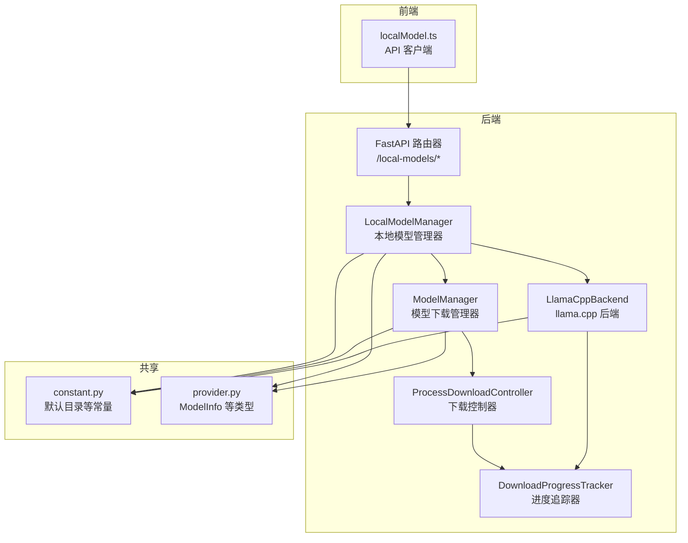
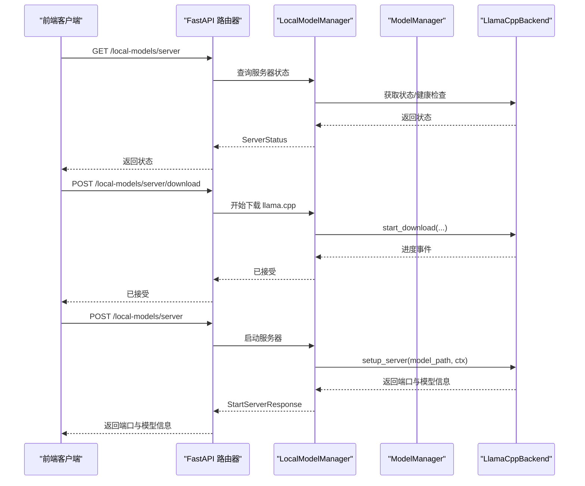
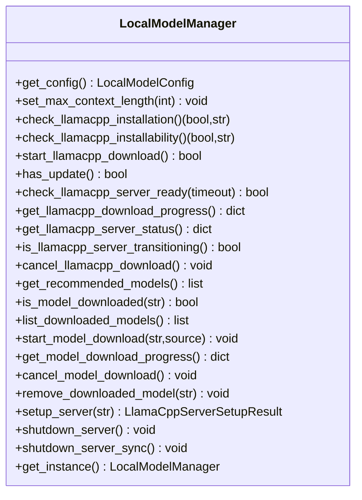
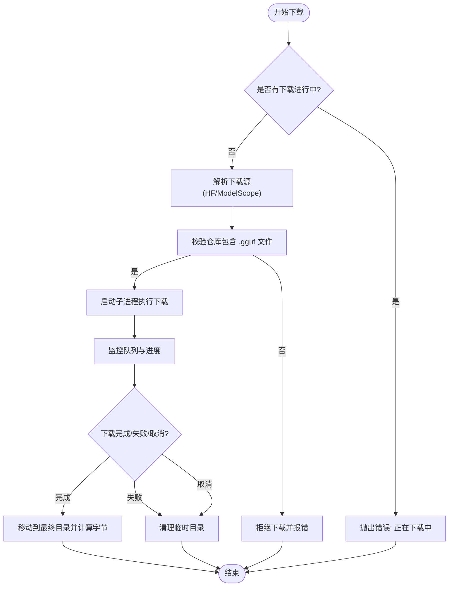
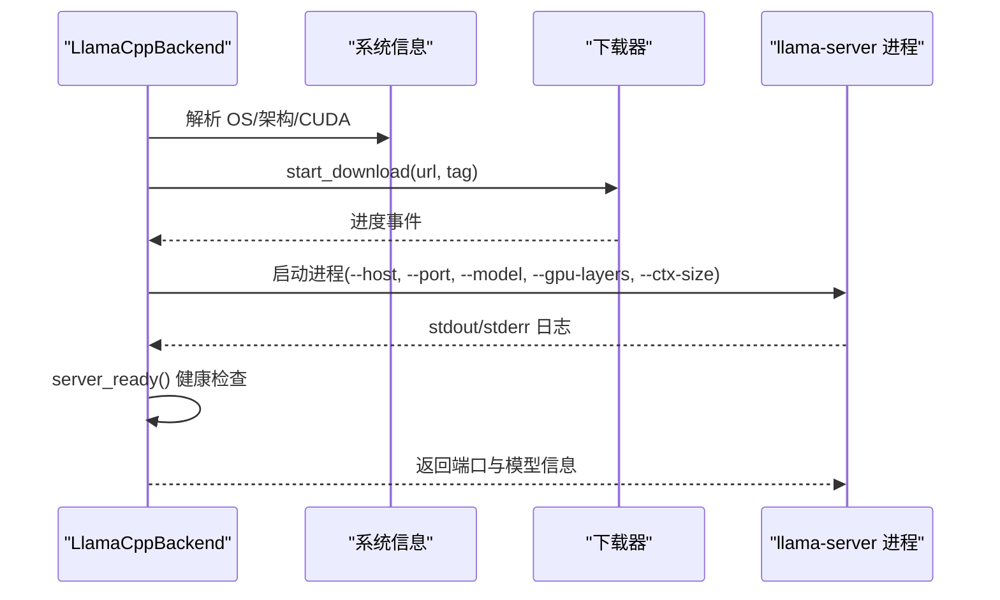
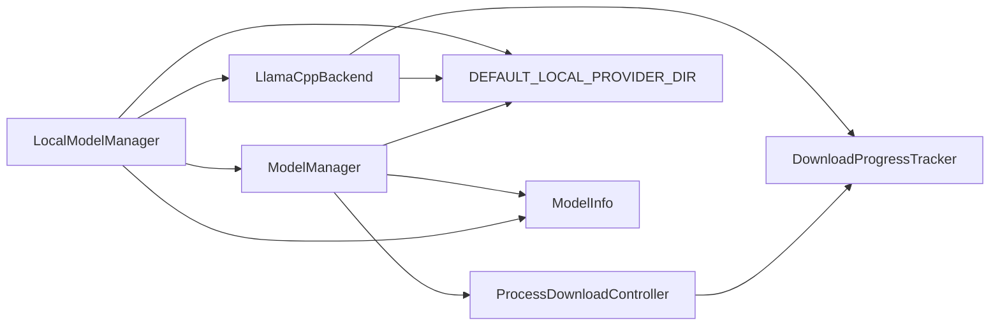

# 本地模型

<cite>
**本文引用的文件**
- [src/copaw/local_models/__init__.py](file://src/copaw/local_models/__init__.py)
- [src/copaw/local_models/manager.py](file://src/copaw/local_models/manager.py)
- [src/copaw/local_models/model_manager.py](file://src/copaw/local_models/model_manager.py)
- [src/copaw/local_models/download_manager.py](file://src/copaw/local_models/download_manager.py)
- [src/copaw/local_models/llamacpp.py](file://src/copaw/local_models/llamacpp.py)
- [src/copaw/app/routers/local_models.py](file://src/copaw/app/routers/local_models.py)
- [src/copaw/constant.py](file://src/copaw/constant.py)
- [src/copaw/providers/provider.py](file://src/copaw/providers/provider.py)
- [console/src/api/modules/localModel.ts](file://console/src/api/modules/localModel.ts)
- [tests/unit/local_models/test_llamacpp_backend.py](file://tests/unit/local_models/test_llamacpp_backend.py)
- [tests/unit/local_models/test_model_manager.py](file://tests/unit/local_models/test_model_manager.py)
- [tests/unit/local_models/test_local_model_manager.py](file://tests/unit/local_models/test_local_model_manager.py)
</cite>

## 目录
1. [简介](#简介)
2. [项目结构](#项目结构)
3. [核心组件](#核心组件)
4. [架构总览](#架构总览)
5. [详细组件分析](#详细组件分析)
6. [依赖分析](#依赖分析)
7. [性能考量](#性能考量)
8. [故障排除指南](#故障排除指南)
9. [结论](#结论)
10. [附录](#附录)

## 简介
本文件面向 CoPaw 的“本地模型”能力，系统性阐述本地模型管理器的设计理念、llama.cpp 集成实现、模型下载与缓存机制、运行时配置与生命周期控制，以及与云端推理后端（如 Ollama、LM Studio）的对比与权衡。文档同时提供部署指南、性能优化建议与常见问题排查方法，帮助开发者与运维人员在本地环境中稳定、高效地运行大模型推理服务。

## 项目结构
本地模型相关代码主要分布在以下模块：
- 后端 Python 层：本地模型管理器、模型下载器、llama.cpp 后端、下载进度追踪器、FastAPI 路由器
- 前端 TypeScript 层：本地模型 API 客户端封装
- 测试层：针对各组件的行为与边界条件进行验证

图表来源
- [src/copaw/local_models/manager.py:33-229](file://src/copaw/local_models/manager.py#L33-L229)
- [src/copaw/local_models/model_manager.py:61-638](file://src/copaw/local_models/model_manager.py#L61-L638)
- [src/copaw/local_models/download_manager.py:368-599](file://src/copaw/local_models/download_manager.py#L368-L599)
- [src/copaw/local_models/llamacpp.py:51-887](file://src/copaw/local_models/llamacpp.py#L51-L887)
- [src/copaw/app/routers/local_models.py:1-454](file://src/copaw/app/routers/local_models.py#L1-L454)
- [src/copaw/constant.py:91-92](file://src/copaw/constant.py#L91-L92)
- [src/copaw/providers/provider.py:17-46](file://src/copaw/providers/provider.py#L17-L46)
- [console/src/api/modules/localModel.ts:1-60](file://console/src/api/modules/localModel.ts#L1-L60)

章节来源
- [src/copaw/local_models/__init__.py:1-17](file://src/copaw/local_models/__init__.py#L1-L17)
- [src/copaw/local_models/manager.py:33-229](file://src/copaw/local_models/manager.py#L33-L229)
- [src/copaw/local_models/model_manager.py:61-638](file://src/copaw/local_models/model_manager.py#L61-L638)
- [src/copaw/local_models/download_manager.py:368-599](file://src/copaw/local_models/download_manager.py#L368-L599)
- [src/copaw/local_models/llamacpp.py:51-887](file://src/copaw/local_models/llamacpp.py#L51-L887)
- [src/copaw/app/routers/local_models.py:1-454](file://src/copaw/app/routers/local_models.py#L1-L454)
- [src/copaw/constant.py:91-92](file://src/copaw/constant.py#L91-L92)
- [src/copaw/providers/provider.py:17-46](file://src/copaw/providers/provider.py#L17-L46)
- [console/src/api/modules/localModel.ts:1-60](file://console/src/api/modules/localModel.ts#L1-L60)

## 核心组件
- 本地模型管理器（LocalModelManager）
  - 单例入口，负责 llama.cpp 下载、安装、服务器生命周期管理、模型下载与状态查询、运行时配置持久化
- 模型下载管理器（ModelManager）
  - 多进程模型下载控制器，支持 HuggingFace 与 ModelScope 双源自动探测与回退，进度追踪与取消
- 下载进度追踪器（DownloadProgressTracker）与控制器（ProcessDownloadController）
  - 统一的下载生命周期与速率统计，跨进程消息传递与结果归并
- llama.cpp 后端（LlamaCppBackend）
  - 平台检测与包名解析、下载与解压、服务器启动/停止、健康检查、设备枚举、版本查询
- FastAPI 路由器（/local-models/*）
  - 对外暴露本地模型与服务器的管理接口，集成 ProviderManager 动态注册本地推理后端
- 前端 API 客户端（localModel.ts）
  - 封装本地模型相关请求，供控制台界面使用

章节来源
- [src/copaw/local_models/manager.py:33-229](file://src/copaw/local_models/manager.py#L33-L229)
- [src/copaw/local_models/model_manager.py:61-638](file://src/copaw/local_models/model_manager.py#L61-L638)
- [src/copaw/local_models/download_manager.py:368-599](file://src/copaw/local_models/download_manager.py#L368-L599)
- [src/copaw/local_models/llamacpp.py:51-887](file://src/copaw/local_models/llamacpp.py#L51-L887)
- [src/copaw/app/routers/local_models.py:1-454](file://src/copaw/app/routers/local_models.py#L1-L454)
- [console/src/api/modules/localModel.ts:1-60](file://console/src/api/modules/localModel.ts#L1-L60)

## 架构总览
本地模型能力以“管理器 + 后端 + 路由器”的分层设计实现：
- LocalModelManager 作为门面，协调 ModelManager 与 LlamaCppBackend
- ModelManager 通过多进程子任务执行下载，使用 DownloadProgressTracker 统一进度
- LlamaCppBackend 负责二进制包下载、解压、服务器进程管理与健康检查
- 路由器将本地推理后端动态注入到 ProviderManager，使应用统一调度

图表来源
- [src/copaw/app/routers/local_models.py:145-318](file://src/copaw/app/routers/local_models.py#L145-L318)
- [src/copaw/local_models/manager.py:119-216](file://src/copaw/local_models/manager.py#L119-L216)
- [src/copaw/local_models/llamacpp.py:159-307](file://src/copaw/local_models/llamacpp.py#L159-L307)

## 详细组件分析

### 本地模型管理器（LocalModelManager）
- 设计要点
  - 单例模式，避免重复初始化
  - 通过锁保护服务器生命周期操作（启动/停止），防止竞态
  - 运行时配置持久化为 JSON，支持最大上下文长度等参数
  - 与 LlamaCppBackend、ModelManager 解耦，仅暴露高层 API
- 关键职责
  - llama.cpp 下载与更新检查
  - 服务器启动/停止与健康检查
  - 推荐模型列表与已下载模型列表
  - 模型下载进度查询与取消
  - 运行时配置读写

图表来源
- [src/copaw/local_models/manager.py:33-229](file://src/copaw/local_models/manager.py#L33-L229)

章节来源
- [src/copaw/local_models/manager.py:33-229](file://src/copaw/local_models/manager.py#L33-L229)

### 模型下载管理器（ModelManager）
- 设计要点
  - 使用多进程隔离阻塞下载逻辑，避免阻塞主线程
  - 支持 HuggingFace 与 ModelScope 双源，优先可达源，否则回退
  - 自动探测仓库是否包含 GGUF 文件，确保可被 llama.cpp 加载
  - 提供估算大小、进度探针、完成归并、清理临时目录等能力
- 关键职责
  - 推荐模型选择（按内存容量）
  - 下载任务启动、取消、进度查询
  - 已下载模型扫描、删除
  - 临时目录与最终目录的移动与清理

图表来源
- [src/copaw/local_models/model_manager.py:175-253](file://src/copaw/local_models/model_manager.py#L175-L253)
- [src/copaw/local_models/download_manager.py:368-599](file://src/copaw/local_models/download_manager.py#L368-L599)

章节来源
- [src/copaw/local_models/model_manager.py:61-638](file://src/copaw/local_models/model_manager.py#L61-L638)
- [src/copaw/local_models/download_manager.py:198-599](file://src/copaw/local_models/download_manager.py#L198-L599)

### 下载进度追踪与控制器（DownloadProgressTracker / ProcessDownloadController）
- 设计要点
  - 线程安全的状态机，记录状态、已下载字节、总字节、速度、错误等
  - 进程间通过队列传递进度与结果，支持取消与异常处理
  - 统一的生命周期：begin → downloading → completed/failed/cancelled
- 关键职责
  - 进度采样与速率计算
  - 结果归并与最终路径确定
  - 取消流程与资源释放

章节来源
- [src/copaw/local_models/download_manager.py:198-599](file://src/copaw/local_models/download_manager.py#L198-L599)

### llama.cpp 后端（LlamaCppBackend）
- 设计要点
  - 平台感知：自动识别 OS、架构、CUDA 版本，生成对应包名
  - 服务器管理：启动/停止、健康检查、日志流式输出、设备枚举、版本查询
  - 下载与解压：断点友好、错误映射、临时目录合并
- 关键职责
  - 二进制包下载与解压
  - 服务器进程生命周期管理
  - 模型文件解析（支持 mmproj 多模态）

图表来源
- [src/copaw/local_models/llamacpp.py:159-307](file://src/copaw/local_models/llamacpp.py#L159-L307)
- [src/copaw/local_models/llamacpp.py:656-691](file://src/copaw/local_models/llamacpp.py#L656-L691)

章节来源
- [src/copaw/local_models/llamacpp.py:51-887](file://src/copaw/local_models/llamacpp.py#L51-L887)

### FastAPI 路由器（/local-models/*）
- 设计要点
  - 提供服务器状态、下载、启动、停止、配置等完整 API
  - 启动服务器后，动态向 ProviderManager 注册本地推理后端，使其参与统一调度
- 关键职责
  - 服务器可用性检查与更新检测
  - 模型推荐与下载进度查询
  - 本地模型配置持久化与读取

章节来源
- [src/copaw/app/routers/local_models.py:1-454](file://src/copaw/app/routers/local_models.py#L1-L454)

### 前端 API 客户端（localModel.ts）
- 设计要点
  - 封装本地模型相关请求，包括服务器状态、下载进度、启动/停止、配置等
  - 与后端路由一一对应，便于控制台页面调用

章节来源
- [console/src/api/modules/localModel.ts:1-60](file://console/src/api/modules/localModel.ts#L1-L60)

## 依赖分析
- 组件耦合
  - LocalModelManager 依赖 LlamaCppBackend 与 ModelManager，承担编排职责
  - ModelManager 依赖 DownloadProgressTracker 与 ProcessDownloadController，负责下载执行
  - LlamaCppBackend 内部也依赖 DownloadProgressTracker 与控制器，形成复用
- 外部依赖
  - huggingface_hub、modelscope：用于从 HF 或 ModelScope 下载模型快照
  - httpx：网络下载与健康检查
  - agentscope 的 ChatModel：通过 ProviderManager 注入本地推理后端
- 目录与配置
  - 默认本地目录位于工作目录下的 local_models，包含 bin、models、tmp 等子目录

图表来源
- [src/copaw/local_models/manager.py:45-55](file://src/copaw/local_models/manager.py#L45-L55)
- [src/copaw/local_models/model_manager.py:64-74](file://src/copaw/local_models/model_manager.py#L64-L74)
- [src/copaw/local_models/llamacpp.py:59-76](file://src/copaw/local_models/llamacpp.py#L59-L76)
- [src/copaw/constant.py:91-92](file://src/copaw/constant.py#L91-L92)
- [src/copaw/providers/provider.py:17-46](file://src/copaw/providers/provider.py#L17-L46)

章节来源
- [src/copaw/local_models/manager.py:45-55](file://src/copaw/local_models/manager.py#L45-L55)
- [src/copaw/local_models/model_manager.py:64-74](file://src/copaw/local_models/model_manager.py#L64-L74)
- [src/copaw/local_models/llamacpp.py:59-76](file://src/copaw/local_models/llamacpp.py#L59-L76)
- [src/copaw/constant.py:91-92](file://src/copaw/constant.py#L91-L92)
- [src/copaw/providers/provider.py:17-46](file://src/copaw/providers/provider.py#L17-L46)

## 性能考量
- 上下文窗口与显存占用
  - 通过设置最大上下文长度影响内存占用；较长上下文会增加显存/内存压力
- 下载并发与带宽
  - 下载采用多进程与流式分块，建议在网络受限环境下适当降低并发或启用断点续传
- 服务器启动与热身
  - 首次加载模型需要时间，建议在空闲时段预热或提前启动
- 设备选择
  - Windows 启用 CUDA 后端可显著提升吞吐；macOS/Linux 默认 CPU 后端
- 进度与可观测性
  - 利用 DownloadProgressTracker 的速率统计与 server_ready 的健康检查，定位瓶颈

[本节为通用指导，无需特定文件引用]

## 故障排除指南
- 无法启动服务器
  - 检查服务器状态与健康检查接口返回
  - 查看服务器日志输出，确认端口占用与权限
- 下载失败
  - 检查网络连通性与代理设置
  - 根据错误映射判断是否为 HTTP 状态码或连接超时
  - 若为 404/403，确认版本与平台兼容性
- 模型不可用
  - 确认仓库包含 .gguf 文件
  - 检查模型目录布局与权限
- macOS 版本不支持
  - 确认系统版本满足最低要求
- Windows CUDA 不匹配
  - 确认 CUDA 主版本与打包版本一致

章节来源
- [src/copaw/local_models/llamacpp.py:614-647](file://src/copaw/local_models/llamacpp.py#L614-L647)
- [src/copaw/local_models/llamacpp.py:819-837](file://src/copaw/local_models/llamacpp.py#L819-L837)
- [src/copaw/local_models/model_manager.py:458-501](file://src/copaw/local_models/model_manager.py#L458-L501)
- [tests/unit/local_models/test_llamacpp_backend.py:669-707](file://tests/unit/local_models/test_llamacpp_backend.py#L669-L707)
- [tests/unit/local_models/test_model_manager.py:154-196](file://tests/unit/local_models/test_model_manager.py#L154-L196)

## 结论
CoPaw 的本地模型能力以清晰的分层与强健的进程隔离设计，实现了从模型下载、服务器启动到运行时配置的全链路管理。通过统一的 Provider 注入机制，本地推理无缝融入整体推理调度体系。结合合理的资源规划与监控策略，可在本地环境中获得稳定、可控且高性能的推理体验。

[本节为总结性内容，无需特定文件引用]

## 附录

### 本地推理与云端 API 的差异与权衡
- 数据隐私与合规
  - 本地推理完全在本地完成，适合对数据外泄敏感的场景
- 延迟与吞吐
  - 本地推理延迟取决于硬件与模型规模；云端通常具备更强的弹性与缓存能力
- 成本与维护
  - 本地推理需自备硬件与维护成本；云端按量付费，易于扩展
- 兼容性
  - 本地推理受平台与驱动限制；云端推理更易标准化

[本节为概念性内容，无需特定文件引用]

### 部署指南（基于现有实现）
- 准备工作
  - 确认操作系统与架构满足 llama.cpp 要求
  - 准备足够的磁盘空间（模型与临时目录）
- 下载与安装
  - 通过 /local-models/server/download 触发 llama.cpp 下载
  - 下载完成后，通过 /local-models/server 获取状态
- 选择与下载模型
  - 通过 /local-models/models 获取推荐模型列表
  - 通过 /local-models/models/download 开始下载
- 启动本地服务器
  - 通过 /local-models/server POST 启动服务器
  - 启动成功后，后端会动态注册到 ProviderManager，可直接使用
- 停止与清理
  - 通过 /local-models/server DELETE 停止服务器
  - 可通过 /local-models/models 删除已下载模型

章节来源
- [src/copaw/app/routers/local_models.py:145-337](file://src/copaw/app/routers/local_models.py#L145-L337)
- [src/copaw/local_models/manager.py:119-216](file://src/copaw/local_models/manager.py#L119-L216)
- [src/copaw/local_models/model_manager.py:175-253](file://src/copaw/local_models/model_manager.py#L175-L253)
- [src/copaw/local_models/llamacpp.py:159-307](file://src/copaw/local_models/llamacpp.py#L159-L307)

### 与 Ollama/LM Studio 的对比与适用场景
- Ollama
  - 优点：生态丰富、镜像管理便捷、多模型共存
  - 适用：需要快速切换多模型、容器化部署
- LM Studio
  - 优点：图形化界面友好、模型管理直观
  - 适用：桌面端本地体验、非自动化场景
- CoPaw 本地模型
  - 优点：与应用内 Provider 管理深度集成、统一配置与生命周期
  - 适用：需要与应用统一调度、对资源与安全有更高控制需求的场景

[本节为概念性内容，无需特定文件引用]