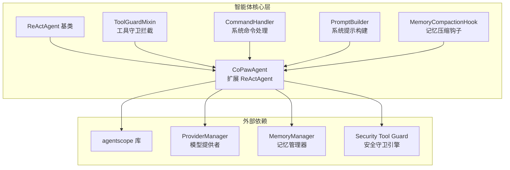
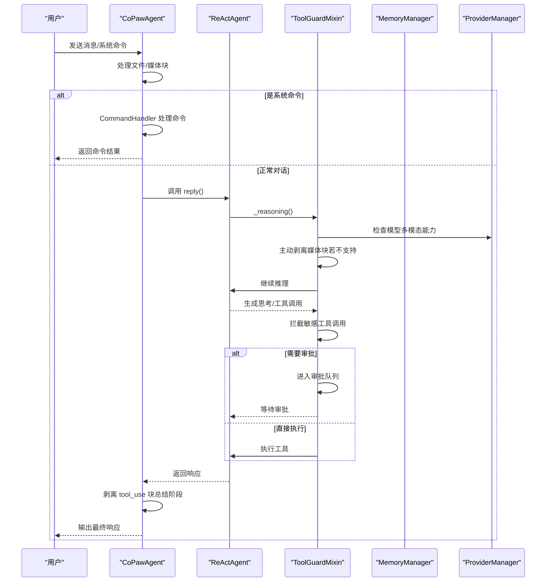
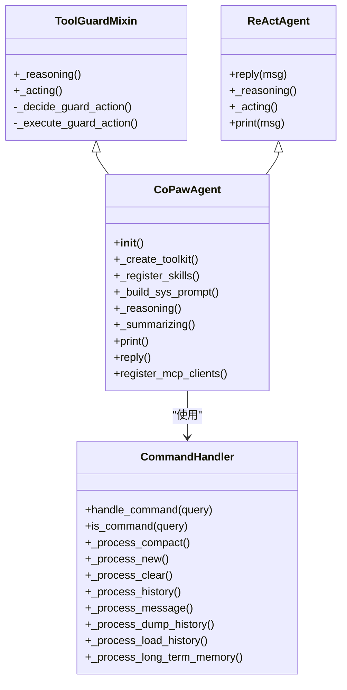
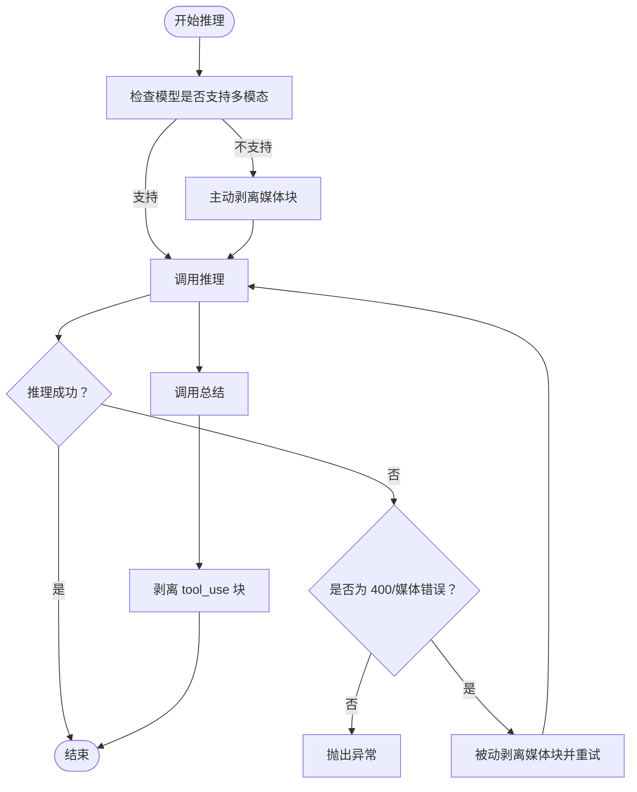
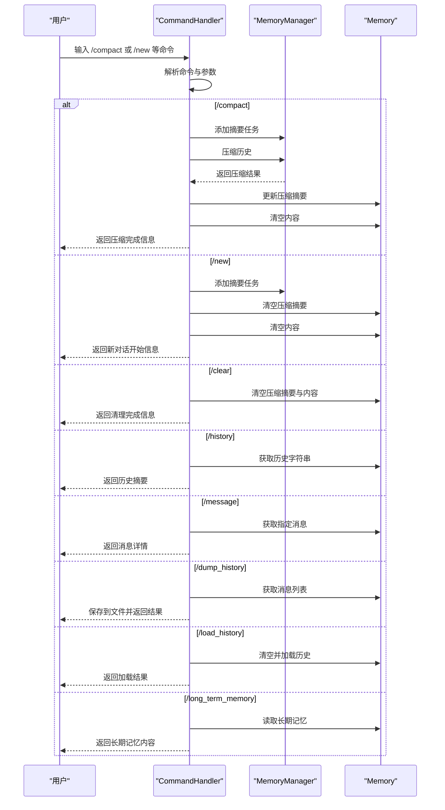
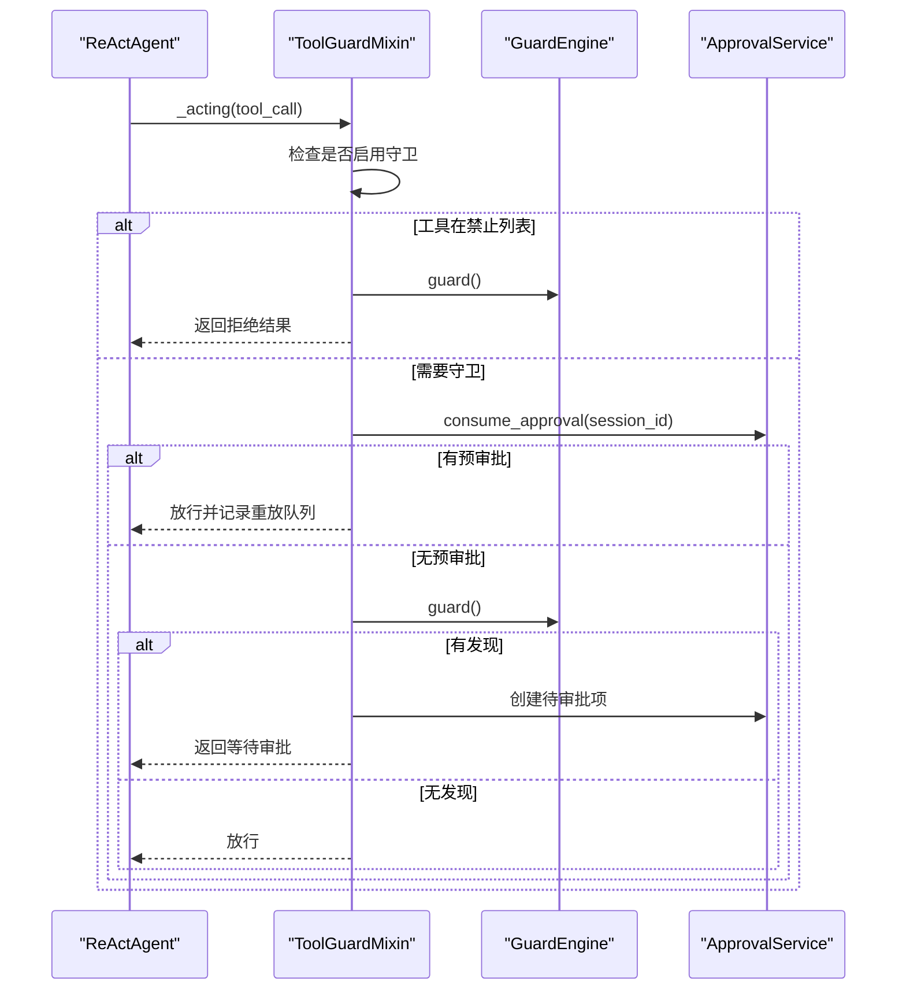
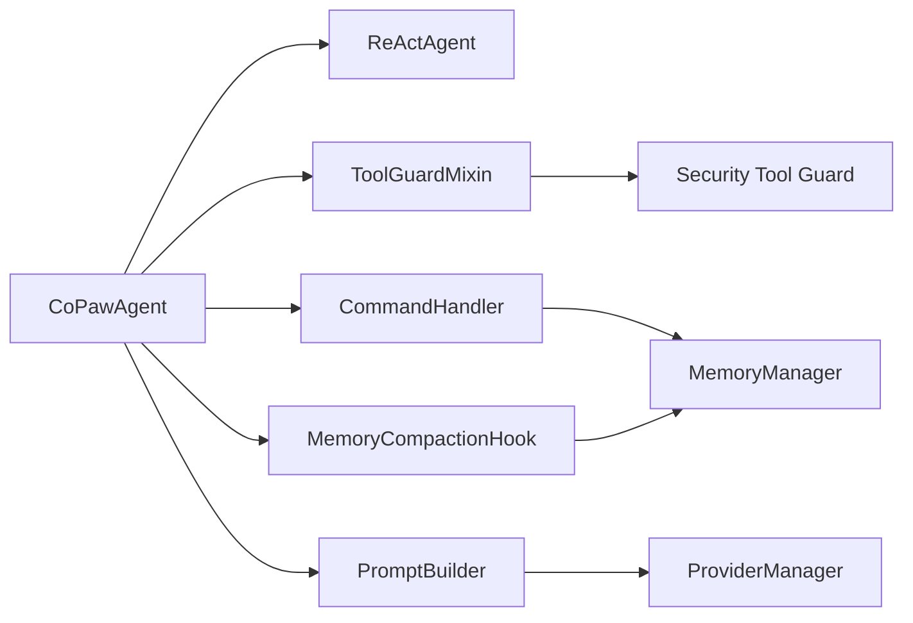

# ReAct 框架实现

<cite>
**本文档引用的文件**
- [react_agent.py](file://src/copaw/agents/react_agent.py)
- [command_handler.py](file://src/copaw/agents/command_handler.py)
- [tool_guard_mixin.py](file://src/copaw/agents/tool_guard_mixin.py)
- [prompt.py](file://src/copaw/agents/prompt.py)
- [memory_compaction.py](file://src/copaw/agents/hooks/memory_compaction.py)
</cite>

## 目录
1. [简介](#简介)
2. [项目结构](#项目结构)
3. [核心组件](#核心组件)
4. [架构总览](#架构总览)
5. [详细组件分析](#详细组件分析)
6. [依赖关系分析](#依赖关系分析)
7. [性能考虑](#性能考虑)
8. [故障排除指南](#故障排除指南)
9. [结论](#结论)

## 简介
本文件面向 ReAct 框架在 CoPaw 中的具体实现，重点解释：
- ReActAgent 基类的工作原理：推理阶段如何生成思考过程、行动阶段如何选择和执行工具
- CoPawAgent 如何扩展 ReAct 框架：工具注册、系统提示构建、媒体块处理等增强功能
- 命令处理器（CommandHandler）如何处理特殊指令如 /compact、/new 等
- 媒体块过滤机制的实现细节：如何处理多模态模型的媒体内容限制

## 项目结构
CoPaw 将 ReAct 框架与工具、技能、记忆管理、安全守卫、命令处理等能力集成，形成完整的智能体实现。关键模块如下：
- agents/react_agent.py：CoPawAgent 主实现，继承 ReActAgent 并扩展工具、技能、内存管理、命令处理、媒体块过滤、安全守卫等
- agents/command_handler.py：系统命令处理器，支持 /compact、/new、/clear、/history 等
- agents/tool_guard_mixin.py：工具守卫混入，提供敏感工具调用拦截与审批流程
- agents/prompt.py：系统提示构建工具，从工作目录的 Markdown 文件动态生成系统提示
- agents/hooks/memory_compaction.py：预推理钩子，自动进行记忆压缩以控制上下文长度

图表来源
- [react_agent.py:69-182](file://src/copaw/agents/react_agent.py#L69-L182)
- [tool_guard_mixin.py:45-51](file://src/copaw/agents/tool_guard_mixin.py#L45-L51)
- [prompt.py:41-181](file://src/copaw/agents/prompt.py#L41-L181)
- [memory_compaction.py:62-85](file://src/copaw/agents/hooks/memory_compaction.py#L62-L85)

章节来源
- [react_agent.py:69-182](file://src/copaw/agents/react_agent.py#L69-L182)
- [command_handler.py:62-115](file://src/copaw/agents/command_handler.py#L62-L115)
- [tool_guard_mixin.py:45-51](file://src/copaw/agents/tool_guard_mixin.py#L45-L51)
- [prompt.py:41-181](file://src/copaw/agents/prompt.py#L41-L181)
- [memory_compaction.py:62-85](file://src/copaw/agents/hooks/memory_compaction.py#L62-L85)

## 核心组件
- CoPawAgent：继承 ReActAgent 并通过 ToolGuardMixin 实现工具守卫拦截；负责工具注册、技能加载、系统提示构建、媒体块过滤、命令处理、记忆管理、MCP 客户端恢复等
- CommandHandler：解析并执行系统命令，如 /compact、/new、/clear、/history、/message、/dump_history、/load_history、/long_term_memory 等
- ToolGuardMixin：在推理和行动阶段拦截敏感工具调用，实现“自动拒绝、预审批、需要审批”的三段式流程
- PromptBuilder：从工作目录的 Markdown 文件（如 AGENTS.md、SOUL.md、PROFILE.md）构建系统提示，并注入多模态能力提示
- MemoryCompactionHook：在推理前检查上下文长度，必要时触发记忆压缩

章节来源
- [react_agent.py:69-182](file://src/copaw/agents/react_agent.py#L69-L182)
- [command_handler.py:62-115](file://src/copaw/agents/command_handler.py#L62-L115)
- [tool_guard_mixin.py:45-51](file://src/copaw/agents/tool_guard_mixin.py#L45-L51)
- [prompt.py:41-181](file://src/copaw/agents/prompt.py#L41-L181)
- [memory_compaction.py:62-85](file://src/copaw/agents/hooks/memory_compaction.py#L62-L85)

## 架构总览
ReAct 在 CoPaw 中的执行路径：
- 初始化：构建系统提示、创建工具包、注册技能、初始化内存管理器、设置命令处理器、注册钩子
- 接收消息：处理文件/媒体块、识别系统命令、进入 ReAct 循环
- 推理阶段：根据模型能力决定是否主动剥离媒体块，捕获媒体错误并被动剥离重试
- 行动阶段：工具守卫拦截敏感工具调用，按需进入审批流程
- 输出阶段：在总结阶段剥离 tool_use 块，避免前端渲染幻影工具调用

图表来源
- [react_agent.py:947-1029](file://src/copaw/agents/react_agent.py#L947-L1029)
- [tool_guard_mixin.py:261-314](file://src/copaw/agents/tool_guard_mixin.py#L261-L314)
- [prompt.py:363-368](file://src/copaw/agents/prompt.py#L363-L368)

章节来源
- [react_agent.py:947-1029](file://src/copaw/agents/react_agent.py#L947-L1029)
- [tool_guard_mixin.py:261-314](file://src/copaw/agents/tool_guard_mixin.py#L261-L314)
- [prompt.py:363-368](file://src/copaw/agents/prompt.py#L363-L368)

## 详细组件分析

### CoPawAgent：ReAct 框架扩展
CoPawAgent 在 ReActAgent 基础上做了以下增强：
- 工具注册：基于配置启用/禁用内置工具，支持异步工具的任务管理工具注册
- 技能加载：从工作目录动态加载技能并注册到工具包
- 系统提示构建：从 AGENTS.md、SOUL.md、PROFILE.md 等文件构建系统提示，并注入多模态能力提示
- 媒体块过滤：在推理/总结阶段主动剥离不支持多模态的媒体块，捕获媒体错误后被动剥离并重试
- 命令处理：初始化 CommandHandler，支持 /compact、/new、/clear、/history、/message、/dump_history、/load_history、/long_term_memory 等
- 内存管理：可选启用内存管理器，注册内存搜索工具，自动压缩长上下文
- MCP 客户端恢复：在会话中断时尝试重连或重建客户端并重新注册
- 安全守卫：通过 ToolGuardMixin 提供工具拦截与审批流程

图表来源
- [react_agent.py:69-182](file://src/copaw/agents/react_agent.py#L69-L182)
- [tool_guard_mixin.py:45-51](file://src/copaw/agents/tool_guard_mixin.py#L45-L51)

章节来源
- [react_agent.py:89-182](file://src/copaw/agents/react_agent.py#L89-L182)
- [react_agent.py:183-304](file://src/copaw/agents/react_agent.py#L183-L304)
- [react_agent.py:306-341](file://src/copaw/agents/react_agent.py#L306-L341)
- [react_agent.py:342-378](file://src/copaw/agents/react_agent.py#L342-L378)
- [react_agent.py:380-414](file://src/copaw/agents/react_agent.py#L380-L414)
- [react_agent.py:415-444](file://src/copaw/agents/react_agent.py#L415-L444)
- [react_agent.py:468-581](file://src/copaw/agents/react_agent.py#L468-L581)
- [react_agent.py:665-717](file://src/copaw/agents/react_agent.py#L665-L717)
- [react_agent.py:719-774](file://src/copaw/agents/react_agent.py#L719-L774)
- [react_agent.py:776-821](file://src/copaw/agents/react_agent.py#L776-L821)
- [react_agent.py:890-944](file://src/copaw/agents/react_agent.py#L890-L944)
- [react_agent.py:947-1029](file://src/copaw/agents/react_agent.py#L947-L1029)

### 推理循环与媒体块过滤机制
推理循环的关键流程：
- 主动剥离：当模型不支持多模态时，在推理前剥离媒体块
- 被动重试：当模型调用失败且为 400 或媒体相关错误时，剥离剩余媒体块并重试
- 总结阶段剥离：在总结阶段移除 tool_use 块，避免前端渲染幻影工具调用

图表来源
- [react_agent.py:665-717](file://src/copaw/agents/react_agent.py#L665-L717)
- [react_agent.py:719-774](file://src/copaw/agents/react_agent.py#L719-L774)
- [react_agent.py:863-884](file://src/copaw/agents/react_agent.py#L863-L884)
- [react_agent.py:890-944](file://src/copaw/agents/react_agent.py#L890-L944)
- [react_agent.py:830-860](file://src/copaw/agents/react_agent.py#L830-L860)

章节来源
- [react_agent.py:665-717](file://src/copaw/agents/react_agent.py#L665-L717)
- [react_agent.py:719-774](file://src/copaw/agents/react_agent.py#L719-L774)
- [react_agent.py:830-860](file://src/copaw/agents/react_agent.py#L830-L860)
- [react_agent.py:863-884](file://src/copaw/agents/react_agent.py#L863-L884)
- [react_agent.py:890-944](file://src/copaw/agents/react_agent.py#L890-L944)

### 命令处理器（CommandHandler）
CommandHandler 支持的系统命令：
- /compact：压缩历史消息，生成压缩摘要并清理内存
- /new：开启新对话，清空历史并启动后台摘要任务
- /clear：清空历史与压缩摘要
- /history：显示历史摘要，支持截断与索引查看
- /compact_str：显示当前压缩摘要
- /await_summary：等待所有摘要任务完成
- /message <index>：查看指定索引的消息内容
- /dump_history：将历史保存到 JSONL 文件
- /load_history：从 JSONL 文件加载历史
- /long_term_memory：显示长期记忆（若可用）

图表来源
- [command_handler.py:499-529](file://src/copaw/agents/command_handler.py#L499-L529)
- [command_handler.py:116-160](file://src/copaw/agents/command_handler.py#L116-L160)
- [command_handler.py:162-187](file://src/copaw/agents/command_handler.py#L162-L187)
- [command_handler.py:189-201](file://src/copaw/agents/command_handler.py#L189-L201)
- [command_handler.py:220-245](file://src/copaw/agents/command_handler.py#L220-L245)
- [command_handler.py:275-341](file://src/copaw/agents/command_handler.py#L275-L341)
- [command_handler.py:343-397](file://src/copaw/agents/command_handler.py#L343-L397)
- [command_handler.py:399-473](file://src/copaw/agents/command_handler.py#L399-L473)
- [command_handler.py:475-497](file://src/copaw/agents/command_handler.py#L475-L497)

章节来源
- [command_handler.py:499-529](file://src/copaw/agents/command_handler.py#L499-L529)
- [command_handler.py:116-160](file://src/copaw/agents/command_handler.py#L116-L160)
- [command_handler.py:162-187](file://src/copaw/agents/command_handler.py#L162-L187)
- [command_handler.py:189-201](file://src/copaw/agents/command_handler.py#L189-L201)
- [command_handler.py:220-245](file://src/copaw/agents/command_handler.py#L220-L245)
- [command_handler.py:275-341](file://src/copaw/agents/command_handler.py#L275-L341)
- [command_handler.py:343-397](file://src/copaw/agents/command_handler.py#L343-L397)
- [command_handler.py:399-473](file://src/copaw/agents/command_handler.py#L399-L473)
- [command_handler.py:475-497](file://src/copaw/agents/command_handler.py#L475-L497)

### 工具守卫（ToolGuardMixin）
工具守卫在推理和行动阶段拦截敏感工具调用，实现三段式流程：
- 自动拒绝：命中禁止列表的工具直接拒绝
- 预审批：若存在一次性预审批令牌则直接放行
- 需要审批：触发审批流程，等待人工确认

图表来源
- [tool_guard_mixin.py:261-314](file://src/copaw/agents/tool_guard_mixin.py#L261-L314)
- [tool_guard_mixin.py:316-370](file://src/copaw/agents/tool_guard_mixin.py#L316-L370)
- [tool_guard_mixin.py:372-396](file://src/copaw/agents/tool_guard_mixin.py#L372-L396)
- [tool_guard_mixin.py:398-421](file://src/copaw/agents/tool_guard_mixin.py#L398-L421)
- [tool_guard_mixin.py:447-496](file://src/copaw/agents/tool_guard_mixin.py#L447-L496)
- [tool_guard_mixin.py:497-615](file://src/copaw/agents/tool_guard_mixin.py#L497-L615)

章节来源
- [tool_guard_mixin.py:261-314](file://src/copaw/agents/tool_guard_mixin.py#L261-L314)
- [tool_guard_mixin.py:316-370](file://src/copaw/agents/tool_guard_mixin.py#L316-L370)
- [tool_guard_mixin.py:372-396](file://src/copaw/agents/tool_guard_mixin.py#L372-L396)
- [tool_guard_mixin.py:398-421](file://src/copaw/agents/tool_guard_mixin.py#L398-L421)
- [tool_guard_mixin.py:447-496](file://src/copaw/agents/tool_guard_mixin.py#L447-L496)
- [tool_guard_mixin.py:497-615](file://src/copaw/agents/tool_guard_mixin.py#L497-L615)

### 系统提示构建（PromptBuilder）
系统提示由多个 Markdown 文件组合而成，支持：
- AGENTS.md：工作流、规则与指导
- SOUL.md：核心身份与行为原则
- PROFILE.md：代理身份与用户画像
- 可选：HEARTBEAT 区域（受开关影响）
- 注入多模态能力提示，告知模型当前能力范围

章节来源
- [prompt.py:41-181](file://src/copaw/agents/prompt.py#L41-L181)
- [prompt.py:183-263](file://src/copaw/agents/prompt.py#L183-L263)
- [prompt.py:363-391](file://src/copaw/agents/prompt.py#L363-L391)

### 记忆压缩钩子（MemoryCompactionHook）
在推理前检查上下文长度，必要时触发压缩，保留系统提示与最近消息，压缩中间可压缩部分。

章节来源
- [memory_compaction.py:62-85](file://src/copaw/agents/hooks/memory_compaction.py#L62-L85)

## 依赖关系分析
- CoPawAgent 依赖 agentscope 的 ReActAgent、Toolkit、Msg 等基础设施
- ToolGuardMixin 依赖安全守卫引擎与审批服务，确保工具调用安全
- PromptBuilder 依赖 ProviderManager 获取当前活跃模型能力，动态注入多模态提示
- CommandHandler 依赖 MemoryManager 与 Memory，提供历史管理与摘要功能
- MemoryCompactionHook 依赖 MemoryManager 与 Token 计数估算，控制上下文长度

图表来源
- [react_agent.py:14-36](file://src/copaw/agents/react_agent.py#L14-L36)
- [tool_guard_mixin.py:57-65](file://src/copaw/agents/tool_guard_mixin.py#L57-L65)
- [prompt.py:327-358](file://src/copaw/agents/prompt.py#L327-L358)
- [command_handler.py:13-15](file://src/copaw/agents/command_handler.py#L13-L15)
- [memory_compaction.py:62-85](file://src/copaw/agents/hooks/memory_compaction.py#L62-L85)

章节来源
- [react_agent.py:14-36](file://src/copaw/agents/react_agent.py#L14-L36)
- [tool_guard_mixin.py:57-65](file://src/copaw/agents/tool_guard_mixin.py#L57-L65)
- [prompt.py:327-358](file://src/copaw/agents/prompt.py#L327-L358)
- [command_handler.py:13-15](file://src/copaw/agents/command_handler.py#L13-L15)
- [memory_compaction.py:62-85](file://src/copaw/agents/hooks/memory_compaction.py#L62-L85)

## 性能考虑
- 媒体块过滤：在推理前主动剥离不支持多模态的媒体块，减少无效请求与重试成本
- 记忆压缩：通过预推理钩子估算上下文长度并在阈值触发时压缩，避免超出模型上下文限制
- 异步工具：仅在启用异步工具时注册后台任务管理工具，避免不必要的开销
- 缓存与占位符：剥离媒体块后插入占位符，保证请求格式合法，减少后续失败重试

## 故障排除指南
- 媒体块导致的 400 错误：系统会在推理或总结阶段检测到媒体相关错误时，自动剥离媒体块并重试
- 工具被拒绝：若命中禁止列表，工具守卫会直接拒绝并输出拒绝原因；若需要审批，等待人工确认
- MCP 客户端中断：尝试重连或重建客户端并重新注册，若仍失败则记录警告并跳过
- 命令执行失败：命令处理器会返回明确的错误信息，便于定位问题（如文件不存在、索引越界等）

章节来源
- [react_agent.py:694-717](file://src/copaw/agents/react_agent.py#L694-L717)
- [react_agent.py:863-884](file://src/copaw/agents/react_agent.py#L863-L884)
- [react_agent.py:468-531](file://src/copaw/agents/react_agent.py#L468-L531)
- [command_handler.py:399-473](file://src/copaw/agents/command_handler.py#L399-L473)

## 结论
CoPaw 对 ReAct 框架进行了全面扩展，将工具、技能、记忆、安全、命令处理与媒体块过滤等能力整合到统一的智能体实现中。通过 ToolGuardMixin 提供的安全拦截、PromptBuilder 的动态系统提示、CommandHandler 的命令处理以及媒体块过滤机制，CoPawAgent 能够在复杂多变的多模态场景下稳定运行，并提供良好的用户体验与安全保障。