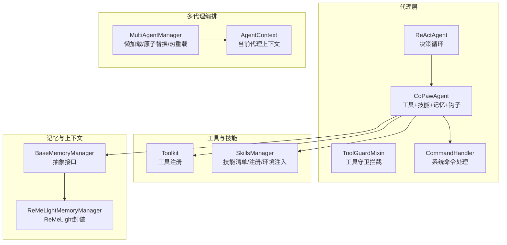
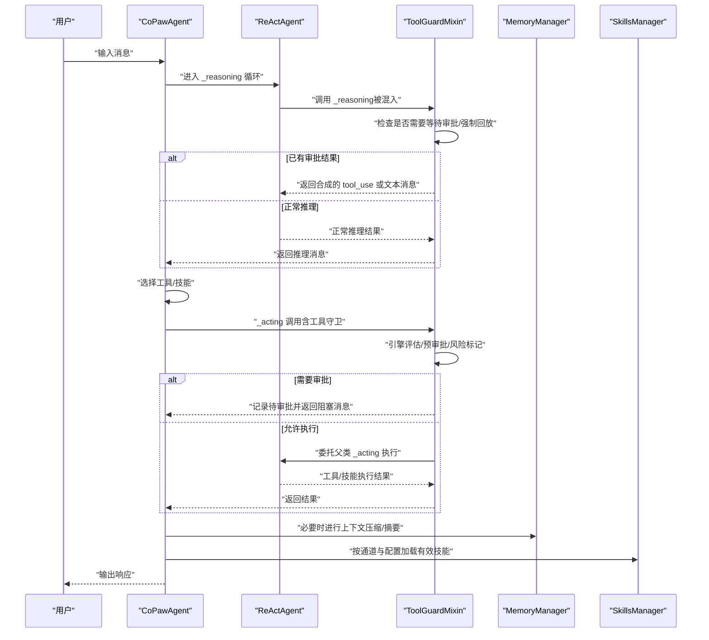
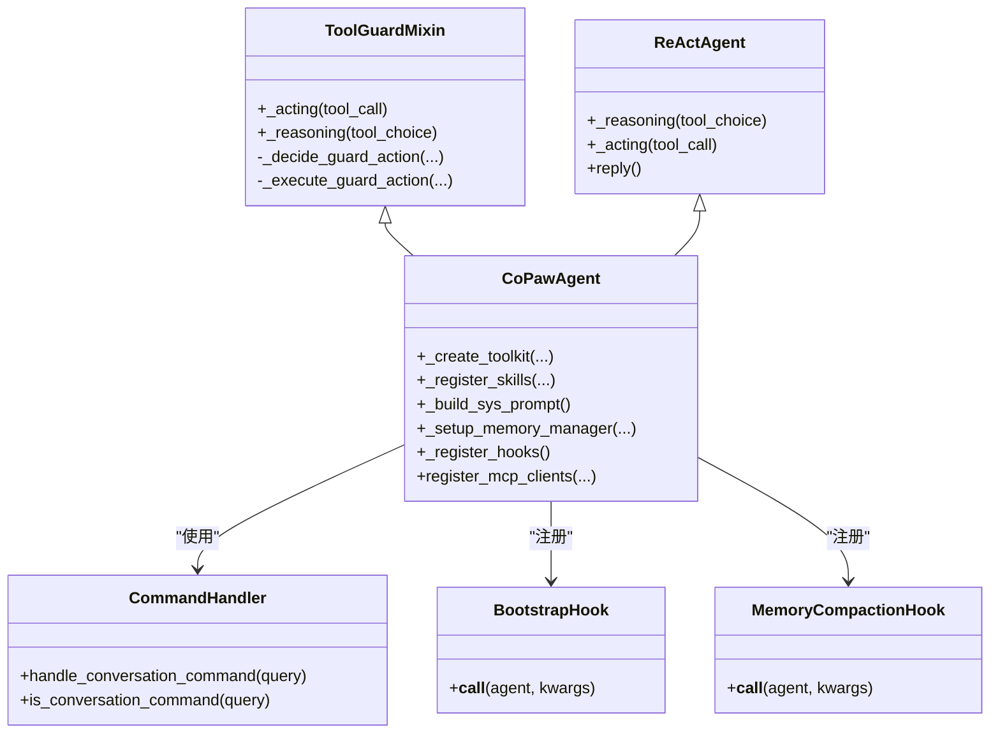
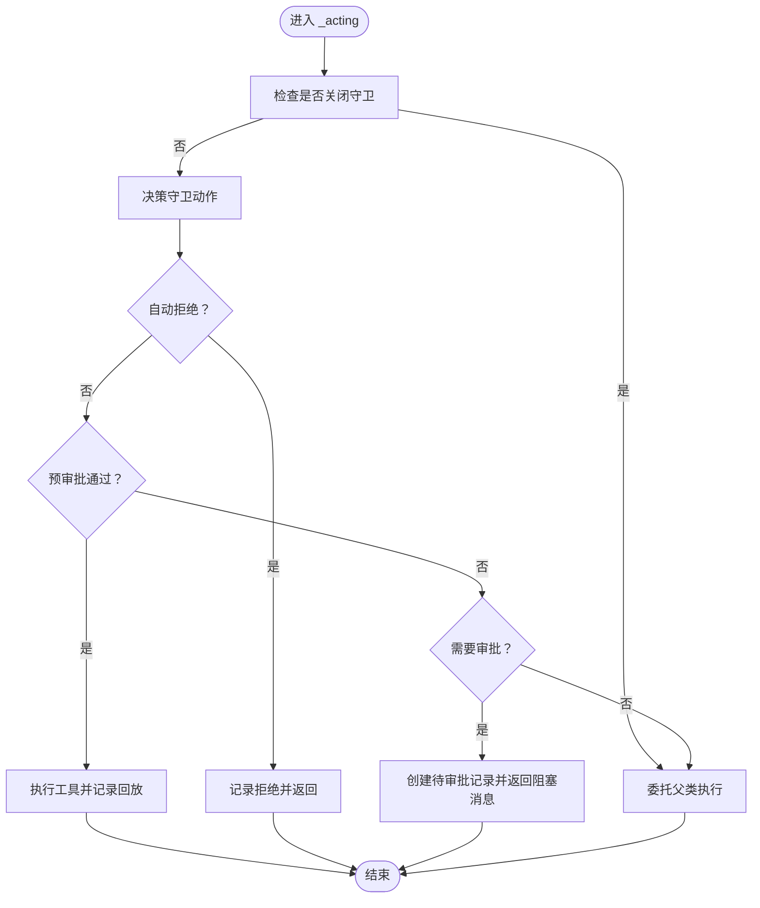
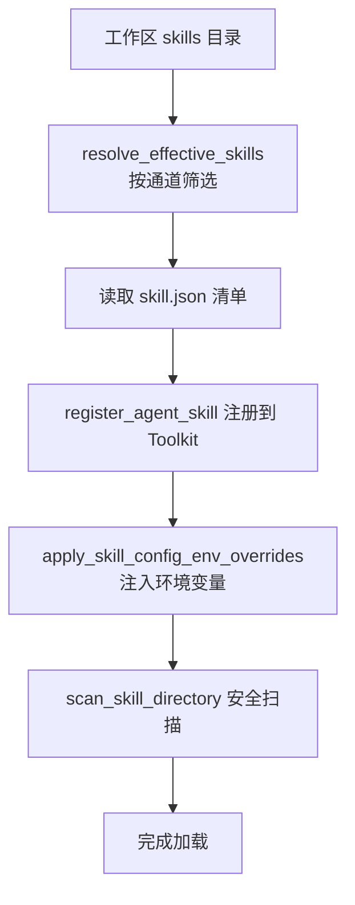
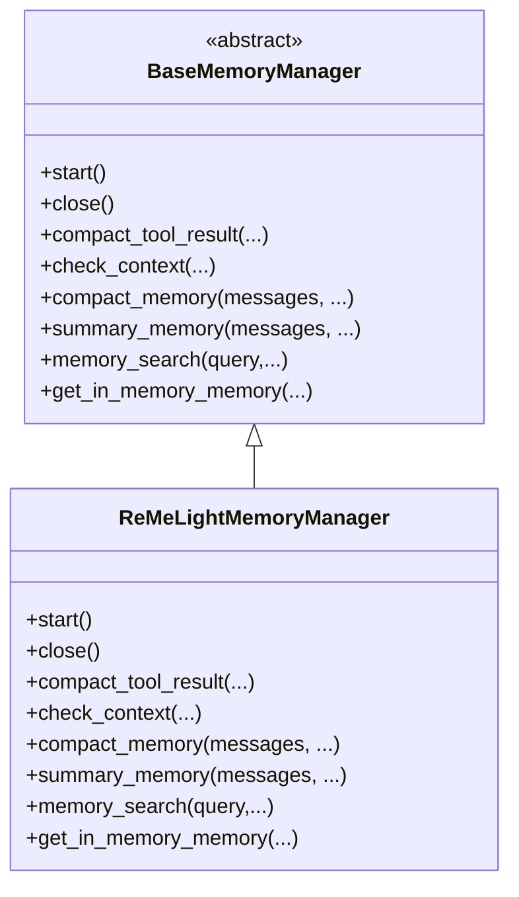
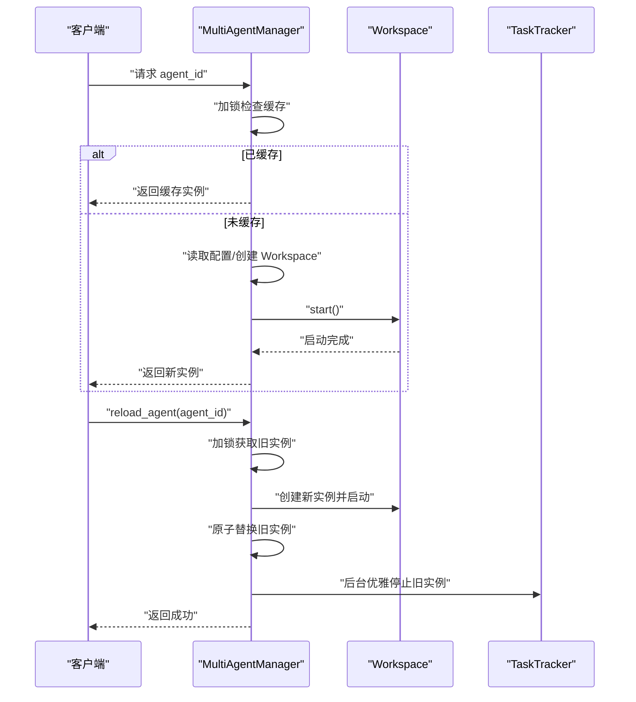
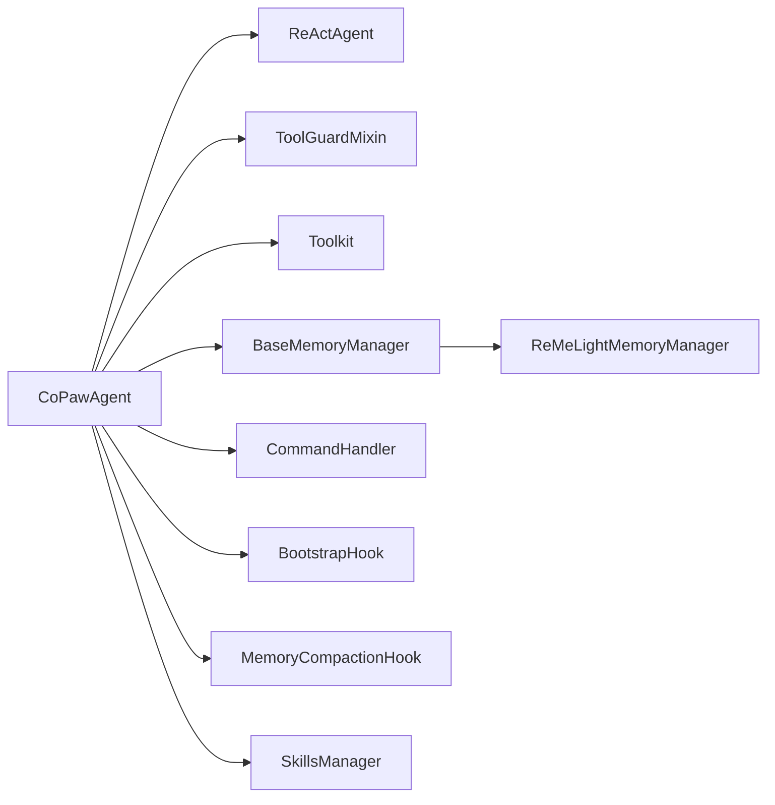

# 代理系统架构

<cite>
**本文引用的文件**
- [react_agent.py](file://src/copaw/agents/react_agent.py)
- [tool_guard_mixin.py](file://src/copaw/agents/tool_guard_mixin.py)
- [multi_agent_manager.py](file://src/copaw/app/multi_agent_manager.py)
- [skills_manager.py](file://src/copaw/agents/skills_manager.py)
- [bootstrap.py](file://src/copaw/agents/hooks/bootstrap.py)
- [memory_compaction.py](file://src/copaw/agents/hooks/memory_compaction.py)
- [base_memory_manager.py](file://src/copaw/agents/memory/base_memory_manager.py)
- [reme_light_memory_manager.py](file://src/copaw/agents/memory/reme_light_memory_manager.py)
- [tools/__init__.py](file://src/copaw/agents/tools/__init__.py)
- [prompt.py](file://src/copaw/agents/prompt.py)
- [command_handler.py](file://src/copaw/agents/command_handler.py)
- [agent_context.py](file://src/copaw/app/agent_context.py)
- [Project-Structure.md](file://docs/wiki/Project-Structure.md)
</cite>

## 目录
1. [引言](#引言)
2. [项目结构](#项目结构)
3. [核心组件](#核心组件)
4. [架构总览](#架构总览)
5. [详细组件分析](#详细组件分析)
6. [依赖分析](#依赖分析)
7. [性能考虑](#性能考虑)
8. [故障排查指南](#故障排查指南)
9. [结论](#结论)
10. [附录](#附录)

## 引言
本技术文档面向 CoPaw 代理系统的架构与实现，重点阐述 ReAct 框架在代理决策中的核心作用：推理（reasoning）与行动（acting）循环机制；CoPawAgent 类的设计模式与关键扩展点；工具守卫（ToolGuard）安全拦截体系；以及多代理协作（MultiAgentManager）的并发启动与零停机热重载策略。文档同时提供面向初学者的概念解释与面向高级开发者的扩展与定制建议，并通过图示与路径引用帮助读者快速定位源码位置。

## 项目结构
CoPaw 的代理系统围绕“ReAct 决策循环 + 工具调用 + 安全守卫 + 记忆管理 + 技能加载 + 多代理编排”展开。核心模块分布如下：
- 代理内核与决策循环：CoPawAgent（继承 ReActAgent），并混入 ToolGuardMixin 实现工具守卫拦截
- 工具与技能：内置工具集、动态技能注册、技能清单与环境注入
- 记忆与上下文：抽象记忆管理器接口与 ReMeLight 实现，支持压缩、摘要与检索
- 钩子系统：引导钩子（BootstrapHook）、内存压缩钩子（MemoryCompactionHook）
- 多代理管理：MultiAgentManager 提供懒加载、原子替换、零停机热重载
- 命令处理：系统命令（/compact、/new、/clear 等）由 CommandHandler 统一处理

图表来源
- [react_agent.py:69-182](file://src/copaw/agents/react_agent.py#L69-L182)
- [tool_guard_mixin.py:45-70](file://src/copaw/agents/tool_guard_mixin.py#L45-L70)
- [skills_manager.py:131-142](file://src/copaw/agents/skills_manager.py#L131-L142)
- [base_memory_manager.py:21-56](file://src/copaw/agents/memory/base_memory_manager.py#L21-L56)
- [reme_light_memory_manager.py:37-68](file://src/copaw/agents/memory/reme_light_memory_manager.py#L37-L68)
- [multi_agent_manager.py:21-36](file://src/copaw/app/multi_agent_manager.py#L21-L36)
- [agent_context.py:82-140](file://src/copaw/app/agent_context.py#L82-L140)

章节来源
- [Project-Structure.md:116-126](file://docs/wiki/Project-Structure.md#L116-L126)

## 核心组件
- CoPawAgent：在 ReActAgent 基础上集成工具、技能、记忆管理、钩子与命令处理，形成完整的智能体实例
- ToolGuardMixin：在 _acting/_reasoning 生命周期中插入安全拦截，支持预审批、风险标记与审批队列
- MultiAgentManager：集中管理多个工作空间（Workspace），支持懒加载、原子替换与零停机热重载
- SkillsManager：从工作区解析技能清单、注册有效技能、注入环境变量与依赖声明
- MemoryManager 抽象与 ReMeLight 实现：统一的上下文压缩、摘要生成与向量/全文检索能力
- 钩子系统：BootstrapHook（首次交互引导）、MemoryCompactionHook（上下文阈值压缩）

章节来源
- [react_agent.py:69-182](file://src/copaw/agents/react_agent.py#L69-L182)
- [tool_guard_mixin.py:45-70](file://src/copaw/agents/tool_guard_mixin.py#L45-L70)
- [multi_agent_manager.py:21-90](file://src/copaw/app/multi_agent_manager.py#L21-L90)
- [skills_manager.py:131-142](file://src/copaw/agents/skills_manager.py#L131-L142)
- [base_memory_manager.py:21-56](file://src/copaw/agents/memory/base_memory_manager.py#L21-L56)
- [reme_light_memory_manager.py:37-68](file://src/copaw/agents/memory/reme_light_memory_manager.py#L37-L68)
- [bootstrap.py:20-41](file://src/copaw/agents/hooks/bootstrap.py#L20-L41)
- [memory_compaction.py:27-42](file://src/copaw/agents/hooks/memory_compaction.py#L27-L42)

## 架构总览
下图展示了 ReAct 决策循环在 CoPaw 中的落地方式，以及工具守卫、记忆管理与技能加载的关键交互：

图表来源
- [react_agent.py:665-718](file://src/copaw/agents/react_agent.py#L665-L718)
- [tool_guard_mixin.py:261-314](file://src/copaw/agents/tool_guard_mixin.py#L261-L314)
- [memory_compaction.py:62-141](file://src/copaw/agents/hooks/memory_compaction.py#L62-L141)
- [skills_manager.py:317-341](file://src/copaw/agents/skills_manager.py#L317-L341)

## 详细组件分析

### ReAct 决策循环与 CoPawAgent 设计
- 决策循环：_reasoning 与 _acting 双通道协同，前者负责思考与计划，后者负责工具/技能执行
- CoPawAgent 扩展点：
  - 工具注册：_create_toolkit 支持按配置启用/禁用与异步任务管理工具
  - 技能加载：_register_skills 从工作区解析并注册有效技能
  - 系统提示构建：_build_sys_prompt 从 AGENTS.md/SOUL.md/PROFILE.md 等文件构建
  - 记忆管理：_setup_memory_manager 注册内存搜索工具并接入 ReMeLight
  - 钩子注册：_register_hooks 注册引导与内存压缩钩子
  - 媒体块过滤：_reasoning/_summarizing 层对多模态模型能力进行主动/被动过滤

图表来源
- [react_agent.py:69-182](file://src/copaw/agents/react_agent.py#L69-L182)
- [tool_guard_mixin.py:45-70](file://src/copaw/agents/tool_guard_mixin.py#L45-L70)
- [command_handler.py:62-95](file://src/copaw/agents/command_handler.py#L62-L95)
- [bootstrap.py:20-41](file://src/copaw/agents/hooks/bootstrap.py#L20-L41)
- [memory_compaction.py:27-42](file://src/copaw/agents/hooks/memory_compaction.py#L27-L42)

章节来源
- [react_agent.py:89-182](file://src/copaw/agents/react_agent.py#L89-L182)
- [react_agent.py:183-304](file://src/copaw/agents/react_agent.py#L183-L304)
- [react_agent.py:306-341](file://src/copaw/agents/react_agent.py#L306-L341)
- [react_agent.py:342-378](file://src/copaw/agents/react_agent.py#L342-L378)
- [react_agent.py:380-444](file://src/copaw/agents/react_agent.py#L380-L444)
- [react_agent.py:445-467](file://src/copaw/agents/react_agent.py#L445-L467)
- [react_agent.py:468-650](file://src/copaw/agents/react_agent.py#L468-L650)
- [react_agent.py:665-774](file://src/copaw/agents/react_agent.py#L665-L774)

### 工具守卫（ToolGuard）拦截流程
- 拦截入口：_acting/_reasoning 被混入覆盖，先进行守卫决策再执行
- 决策阶段：
  - 拒绝名单命中：直接拒绝并记录
  - 受保护范围：运行引擎评估，若有发现则进入审批流程
  - 预审批：若会话上下文存在预审批令牌，则直接放行
- 执行阶段：
  - 自动拒绝：构造系统消息并写入记忆
  - 审批中：记录待审批，等待人工确认
  - 已批准：执行工具调用并可记录回放队列
- 审批等待与回放：
  - _reasoning 在检测到拒绝标记时，返回“等待审批”消息
  - 审批完成后，可强制回放剩余工具序列

图表来源
- [tool_guard_mixin.py:261-314](file://src/copaw/agents/tool_guard_mixin.py#L261-L314)
- [tool_guard_mixin.py:316-370](file://src/copaw/agents/tool_guard_mixin.py#L316-L370)
- [tool_guard_mixin.py:372-396](file://src/copaw/agents/tool_guard_mixin.py#L372-L396)
- [tool_guard_mixin.py:447-496](file://src/copaw/agents/tool_guard_mixin.py#L447-L496)
- [tool_guard_mixin.py:497-615](file://src/copaw/agents/tool_guard_mixin.py#L497-L615)
- [tool_guard_mixin.py:621-648](file://src/copaw/agents/tool_guard_mixin.py#L621-L648)

章节来源
- [tool_guard_mixin.py:57-69](file://src/copaw/agents/tool_guard_mixin.py#L57-L69)
- [tool_guard_mixin.py:316-370](file://src/copaw/agents/tool_guard_mixin.py#L316-L370)
- [tool_guard_mixin.py:372-396](file://src/copaw/agents/tool_guard_mixin.py#L372-L396)
- [tool_guard_mixin.py:447-496](file://src/copaw/agents/tool_guard_mixin.py#L447-L496)
- [tool_guard_mixin.py:497-615](file://src/copaw/agents/tool_guard_mixin.py#L497-L615)
- [tool_guard_mixin.py:621-648](file://src/copaw/agents/tool_guard_mixin.py#L621-L648)

### 技能加载与环境注入
- 技能来源与目录结构：工作区 skills 目录与池化 skill_pool，支持内置/自定义/冲突处理
- 解析与注册：resolve_effective_skills 按通道筛选有效技能，逐个注册到 Toolkit
- 环境注入：apply_skill_config_env_overrides 将技能配置映射为环境变量，满足 metadata.requires.env 声明
- 安全扫描：scan_skill_directory 对技能进行安全扫描，避免高危内容

图表来源
- [skills_manager.py:317-341](file://src/copaw/agents/skills_manager.py#L317-L341)
- [skills_manager.py:667-710](file://src/copaw/agents/skills_manager.py#L667-L710)
- [skills_manager.py:713-742](file://src/copaw/agents/skills_manager.py#L713-L742)
- [skills_manager.py:131-142](file://src/copaw/agents/skills_manager.py#L131-L142)

章节来源
- [skills_manager.py:131-142](file://src/copaw/agents/skills_manager.py#L131-L142)
- [skills_manager.py:317-341](file://src/copaw/agents/skills_manager.py#L317-L341)
- [skills_manager.py:667-710](file://src/copaw/agents/skills_manager.py#L667-L710)
- [skills_manager.py:713-742](file://src/copaw/agents/skills_manager.py#L713-L742)

### 记忆管理与上下文压缩
- 接口设计：BaseMemoryManager 定义 compaction、summary、search、in-memory 获取等抽象
- ReMeLight 实现：封装 ReMeLight，提供向量化/全文检索、上下文压缩、摘要生成
- 钩子驱动：MemoryCompactionHook 在推理前检查上下文阈值，必要时触发压缩与摘要
- 工具集成：当启用内存管理器时，自动注册 memory_search 工具函数

图表来源
- [base_memory_manager.py:21-56](file://src/copaw/agents/memory/base_memory_manager.py#L21-L56)
- [reme_light_memory_manager.py:37-68](file://src/copaw/agents/memory/reme_light_memory_manager.py#L37-L68)
- [reme_light_memory_manager.py:219-246](file://src/copaw/agents/memory/reme_light_memory_manager.py#L219-L246)
- [reme_light_memory_manager.py:248-331](file://src/copaw/agents/memory/reme_light_memory_manager.py#L248-L331)
- [reme_light_memory_manager.py:333-357](file://src/copaw/agents/memory/reme_light_memory_manager.py#L333-L357)
- [reme_light_memory_manager.py:359-380](file://src/copaw/agents/memory/reme_light_memory_manager.py#L359-L380)
- [reme_light_memory_manager.py:382-390](file://src/copaw/agents/memory/reme_light_memory_manager.py#L382-L390)

章节来源
- [base_memory_manager.py:21-56](file://src/copaw/agents/memory/base_memory_manager.py#L21-L56)
- [reme_light_memory_manager.py:37-68](file://src/copaw/agents/memory/reme_light_memory_manager.py#L37-L68)
- [reme_light_memory_manager.py:219-390](file://src/copaw/agents/memory/reme_light_memory_manager.py#L219-L390)
- [react_agent.py:380-413](file://src/copaw/agents/react_agent.py#L380-L413)
- [memory_compaction.py:62-213](file://src/copaw/agents/hooks/memory_compaction.py#L62-L213)

### 多代理协作（MultiAgentManager）
- 懒加载：首次请求才创建并启动 Workspace
- 原子替换：reload_agent 使用最小锁时间完成新旧实例替换
- 零停机热重载：旧实例在后台清理，新实例立即接管
- 并发启动：start_all_configured_agents 并发启动所有启用代理

图表来源
- [multi_agent_manager.py:38-90](file://src/copaw/app/multi_agent_manager.py#L38-L90)
- [multi_agent_manager.py:208-318](file://src/copaw/app/multi_agent_manager.py#L208-L318)
- [multi_agent_manager.py:407-464](file://src/copaw/app/multi_agent_manager.py#L407-L464)

章节来源
- [multi_agent_manager.py:21-90](file://src/copaw/app/multi_agent_manager.py#L21-L90)
- [multi_agent_manager.py:208-318](file://src/copaw/app/multi_agent_manager.py#L208-L318)
- [multi_agent_manager.py:407-464](file://src/copaw/app/multi_agent_manager.py#L407-L464)
- [agent_context.py:82-140](file://src/copaw/app/agent_context.py#L82-L140)

### 钩子系统与引导
- BootstrapHook：首次用户交互时，从 BOOTSTRAP.md 生成引导内容并注入首条用户消息
- MemoryCompactionHook：在推理前检查上下文阈值，必要时触发压缩与摘要生成，并打印状态消息

章节来源
- [bootstrap.py:20-104](file://src/copaw/agents/hooks/bootstrap.py#L20-L104)
- [memory_compaction.py:27-214](file://src/copaw/agents/hooks/memory_compaction.py#L27-L214)

### 系统命令处理（/compact、/new、/clear 等）
- CommandHandler 提供统一的系统命令解析与执行，支持上下文压缩、新建对话、清空历史、查看历史、等待摘要任务等
- 与记忆管理器联动：压缩/摘要任务通过 memory_manager.async_summary_task 管理

章节来源
- [command_handler.py:62-530](file://src/copaw/agents/command_handler.py#L62-L530)

## 依赖分析
- 组件耦合与内聚：
  - CoPawAgent 与 ReActAgent 低耦合，通过 Mixin 注入 ToolGuard 行为
  - 记忆管理器通过抽象接口解耦具体实现（ReMeLight）
  - 技能管理器与工具注册相互独立，但共享工作区清单
- 外部依赖：
  - ReActAgent 来源于 agentscope
  - ReMeLight 作为向量/全文检索与压缩摘要的后端
  - 安全引擎与审批服务用于工具守卫

图表来源
- [react_agent.py:69-182](file://src/copaw/agents/react_agent.py#L69-L182)
- [tool_guard_mixin.py:45-70](file://src/copaw/agents/tool_guard_mixin.py#L45-L70)
- [base_memory_manager.py:21-56](file://src/copaw/agents/memory/base_memory_manager.py#L21-L56)
- [reme_light_memory_manager.py:37-68](file://src/copaw/agents/memory/reme_light_memory_manager.py#L37-L68)
- [command_handler.py:62-95](file://src/copaw/agents/command_handler.py#L62-L95)
- [bootstrap.py:20-41](file://src/copaw/agents/hooks/bootstrap.py#L20-L41)
- [memory_compaction.py:27-42](file://src/copaw/agents/hooks/memory_compaction.py#L27-L42)
- [skills_manager.py:131-142](file://src/copaw/agents/skills_manager.py#L131-L142)

## 性能考虑
- 并发与锁粒度：MultiAgentManager 在原子替换时仅持有极短锁，其余时间完全并行
- 记忆压缩与摘要：MemoryCompactionHook 与 ReMeLight 的摘要/压缩能力降低上下文长度，提升推理稳定性
- 工具异步执行：内置工具支持异步执行，配合任务管理工具（view/wait/cancel）提升长耗时任务体验
- 多模态适配：_reasoning/_summarizing 主动/被动媒体块过滤，避免模型不支持时的失败重试

## 故障排查指南
- 工具守卫误报/漏报
  - 检查 ToolGuardMixin 的决策逻辑与预审批令牌消费
  - 查看审批服务队列与风险标记（TOOL_GUARD_DENIED_MARK）
- 记忆压缩异常
  - 检查 MemoryCompactionHook 的阈值配置与消息有效性
  - 关注 ReMeLight 的 compact_memory 返回字典结构与错误日志
- 技能加载失败
  - 核对 skill.json 清单与工作区目录一致性
  - 检查 apply_skill_config_env_overrides 是否正确注入环境变量
- 多代理热重载失败
  - 关注旧实例的后台清理任务与 TaskTracker 的活动任务状态

章节来源
- [tool_guard_mixin.py:222-256](file://src/copaw/agents/tool_guard_mixin.py#L222-L256)
- [tool_guard_mixin.py:316-370](file://src/copaw/agents/tool_guard_mixin.py#L316-L370)
- [memory_compaction.py:104-163](file://src/copaw/agents/hooks/memory_compaction.py#L104-L163)
- [reme_light_memory_manager.py:300-331](file://src/copaw/agents/memory/reme_light_memory_manager.py#L300-L331)
- [skills_manager.py:667-710](file://src/copaw/agents/skills_manager.py#L667-L710)
- [multi_agent_manager.py:105-186](file://src/copaw/app/multi_agent_manager.py#L105-L186)

## 结论
CoPaw 代理系统以 ReAct 决策循环为核心，通过 ToolGuardMixin 强化工具安全，借助 SkillsManager 实现灵活的技能加载与环境注入，结合 MemoryManager 的上下文压缩与摘要能力，以及 MultiAgentManager 的并发与热重载特性，形成了稳定、可扩展且易于定制的智能体平台。对于初学者，建议从系统提示构建与内置工具开始；对于高级开发者，可在工具守卫策略、记忆后端与多代理编排方面进行深度定制。

## 附录
- 代理初始化流程（代码路径）
  - 初始化顺序参考：[react_agent.py:89-182](file://src/copaw/agents/react_agent.py#L89-L182)
  - 工具注册参考：[react_agent.py:183-304](file://src/copaw/agents/react_agent.py#L183-L304)、[tools/__init__.py:1-48](file://src/copaw/agents/tools/__init__.py#L1-L48)
  - 技能加载参考：[react_agent.py:306-341](file://src/copaw/agents/react_agent.py#L306-L341)、[skills_manager.py:317-341](file://src/copaw/agents/skills_manager.py#L317-L341)
  - 记忆管理注册参考：[react_agent.py:380-413](file://src/copaw/agents/react_agent.py#L380-L413)
  - 钩子注册参考：[react_agent.py:415-444](file://src/copaw/agents/react_agent.py#L415-L444)
  - 系统提示构建参考：[react_agent.py:342-378](file://src/copaw/agents/react_agent.py#L342-L378)、[prompt.py:183-263](file://src/copaw/agents/prompt.py#L183-L263)
  - 媒体块过滤参考：[react_agent.py:665-774](file://src/copaw/agents/react_agent.py#L665-L774)
  - 工具守卫拦截参考：[tool_guard_mixin.py:261-314](file://src/copaw/agents/tool_guard_mixin.py#L261-L314)
  - 多代理启动参考：[multi_agent_manager.py:407-464](file://src/copaw/app/multi_agent_manager.py#L407-L464)
  - 当前代理上下文参考：[agent_context.py:82-140](file://src/copaw/app/agent_context.py#L82-L140)