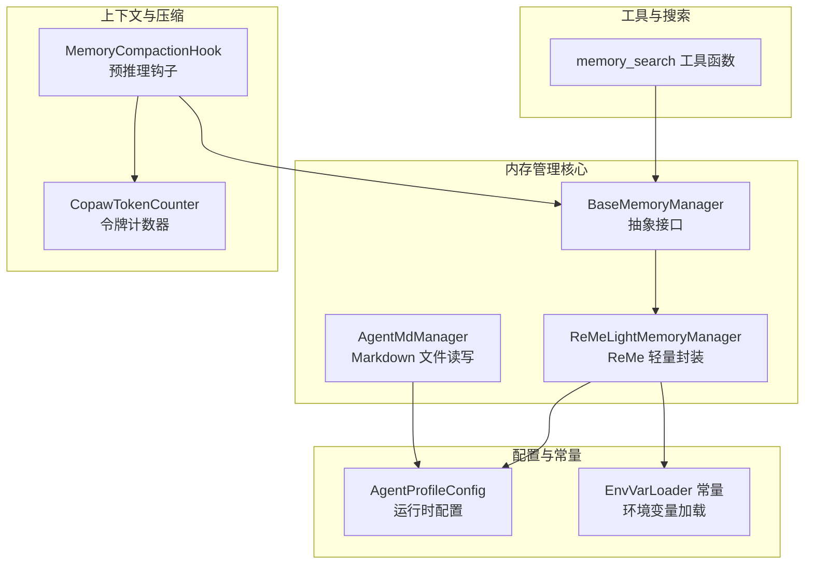
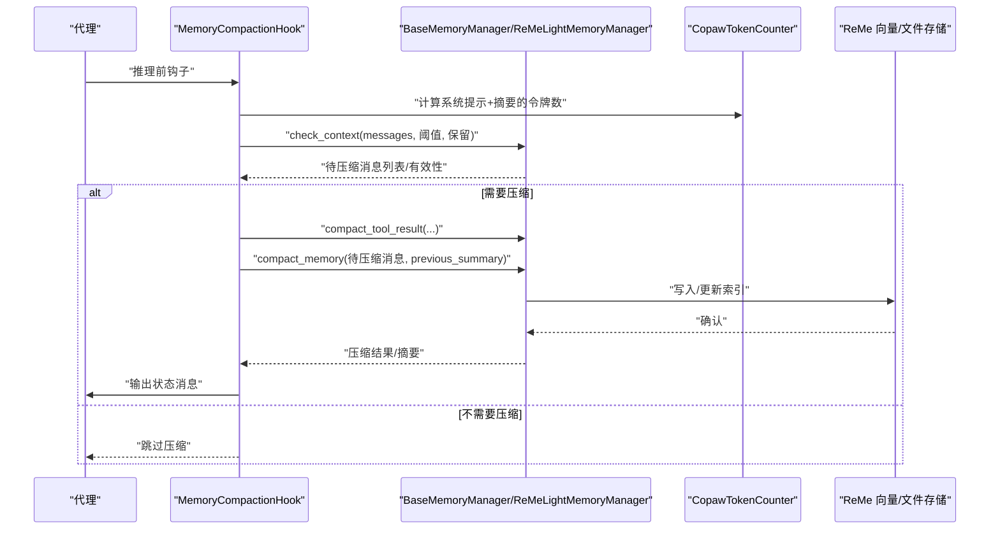
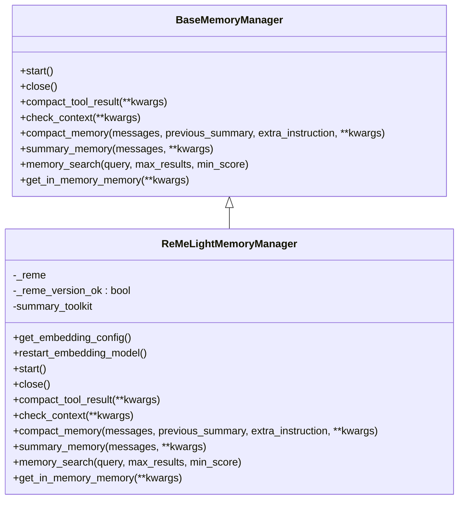
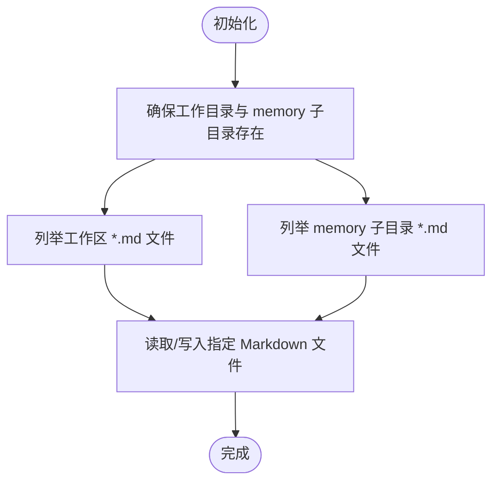
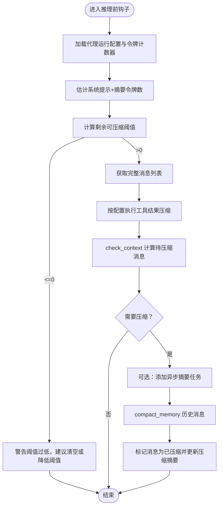
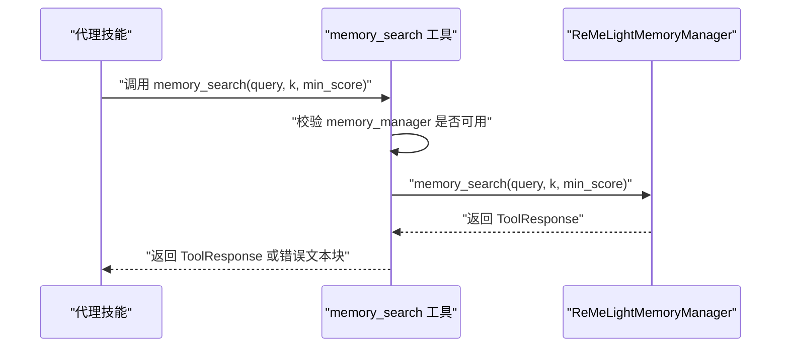
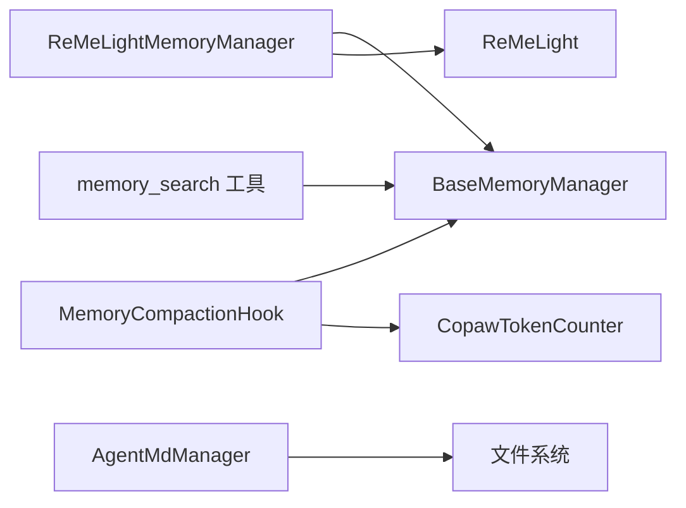

# 内存管理集成

<cite>
**本文引用的文件**
- [base_memory_manager.py](file://src/copaw/agents/memory/base_memory_manager.py)
- [reme_light_memory_manager.py](file://src/copaw/agents/memory/reme_light_memory_manager.py)
- [agent_md_manager.py](file://src/copaw/agents/memory/agent_md_manager.py)
- [memory_compaction.py](file://src/copaw/agents/hooks/memory_compaction.py)
- [memory_search.py](file://src/copaw/agents/tools/memory_search.py)
- [constant.py](file://src/copaw/constant.py)
- [copaw_token_counter.py](file://src/copaw/agents/utils/copaw_token_counter.py)
- [config.py](file://src/copaw/config/config.py)
- [MEMORY.md（英文）](file://src/copaw/agents/md_files/en/MEMORY.md)
- [MEMORY.md（工作区示例）](file://working/workspaces/CoPaw_QA_Agent_0.1beta1/MEMORY.md)
</cite>

## 目录
1. [简介](#简介)
2. [项目结构](#项目结构)
3. [核心组件](#核心组件)
4. [架构总览](#架构总览)
5. [详细组件分析](#详细组件分析)
6. [依赖分析](#依赖分析)
7. [性能考虑](#性能考虑)
8. [故障排查指南](#故障排查指南)
9. [结论](#结论)
10. [附录](#附录)

## 简介
本文件面向 CoPaw 的“内存管理集成”主题，系统性阐述代理系统的长期记忆与短期记忆协同机制，重点覆盖以下方面：
- 内存搜索工具的注册与调用流程
- 内存压缩机制（工具结果压缩、上下文压缩、摘要生成）
- 上下文窗口管理策略与触发条件
- RemeLightMemoryManager 与 AgentMdManager 的设计模式与实现要点
- 内存清理与缓存保留策略
- 内存性能监控、内存泄漏防护与最佳实践

目标是帮助开发者与运维人员在不深入源码的前提下，理解并正确配置与使用 CoPaw 的内存子系统。

## 项目结构
围绕内存管理的相关模块主要位于 agents/memory 与 agents/hooks、agents/tools、agents/utils、config、constant 等目录中。下图给出与内存管理直接相关的文件与职责概览：

图表来源
- [base_memory_manager.py:21-226](file://src/copaw/agents/memory/base_memory_manager.py#L21-L226)
- [reme_light_memory_manager.py:37-391](file://src/copaw/agents/memory/reme_light_memory_manager.py#L37-L391)
- [agent_md_manager.py:10-126](file://src/copaw/agents/memory/agent_md_manager.py#L10-L126)
- [memory_compaction.py:27-214](file://src/copaw/agents/hooks/memory_compaction.py#L27-L214)
- [memory_search.py:7-70](file://src/copaw/agents/tools/memory_search.py#L7-L70)
- [copaw_token_counter.py:20-301](file://src/copaw/agents/utils/copaw_token_counter.py#L20-L301)
- [config.py:366-414](file://src/copaw/config/config.py#L366-L414)
- [constant.py:12-274](file://src/copaw/constant.py#L12-L274)

章节来源
- [base_memory_manager.py:21-226](file://src/copaw/agents/memory/base_memory_manager.py#L21-L226)
- [reme_light_memory_manager.py:37-391](file://src/copaw/agents/memory/reme_light_memory_manager.py#L37-L391)
- [agent_md_manager.py:10-126](file://src/copaw/agents/memory/agent_md_manager.py#L10-L126)
- [memory_compaction.py:27-214](file://src/copaw/agents/hooks/memory_compaction.py#L27-L214)
- [memory_search.py:7-70](file://src/copaw/agents/tools/memory_search.py#L7-L70)
- [copaw_token_counter.py:20-301](file://src/copaw/agents/utils/copaw_token_counter.py#L20-L301)
- [config.py:366-414](file://src/copaw/config/config.py#L366-L414)
- [constant.py:12-274](file://src/copaw/constant.py#L12-L274)

## 核心组件
- 抽象基类 BaseMemoryManager：定义统一的内存生命周期、压缩、摘要、搜索与 in-memory 对象获取接口，确保不同后端可替换。
- ReMeLightMemoryManager：以组合方式封装 ReMeLight，负责启动/关闭、工具结果压缩、上下文检查与压缩、摘要生成、向量/全文检索、嵌入模型重启等。
- AgentMdManager：在工作目录与 memory 子目录中进行 Markdown 文件的读写与元数据列举，支撑工具结果与经验沉淀。
- MemoryCompactionHook：在推理前根据阈值自动触发压缩，保留系统提示与近期消息，压缩历史。
- memory_search 工具：将外部调用委托给内存管理器，返回结构化搜索结果。
- CopawTokenCounter：基于 HuggingFace 的可配置令牌计数器，支持镜像加速与字符估算降级。
- 配置与常量：运行时配置（最大输入长度、压缩比例、保留比例、工具结果压缩阈值与保留天数）、环境变量加载与默认值。

章节来源
- [base_memory_manager.py:21-226](file://src/copaw/agents/memory/base_memory_manager.py#L21-L226)
- [reme_light_memory_manager.py:37-391](file://src/copaw/agents/memory/reme_light_memory_manager.py#L37-L391)
- [agent_md_manager.py:10-126](file://src/copaw/agents/memory/agent_md_manager.py#L10-L126)
- [memory_compaction.py:27-214](file://src/copaw/agents/hooks/memory_compaction.py#L27-L214)
- [memory_search.py:7-70](file://src/copaw/agents/tools/memory_search.py#L7-L70)
- [copaw_token_counter.py:20-301](file://src/copaw/agents/utils/copaw_token_counter.py#L20-L301)
- [config.py:366-414](file://src/copaw/config/config.py#L366-L414)
- [constant.py:12-274](file://src/copaw/constant.py#L12-L274)

## 架构总览
下图展示从代理推理到内存管理的整体交互路径，包括上下文检查、压缩、摘要与搜索的关键节点。

图表来源
- [memory_compaction.py:62-214](file://src/copaw/agents/hooks/memory_compaction.py#L62-L214)
- [reme_light_memory_manager.py:248-332](file://src/copaw/agents/memory/reme_light_memory_manager.py#L248-L332)
- [copaw_token_counter.py:99-137](file://src/copaw/agents/utils/copaw_token_counter.py#L99-L137)

## 详细组件分析

### ReMeLightMemoryManager 设计与实现
- 角色定位：通过组合 ReMeLight 实现“轻量内存后端”，对外暴露统一接口，内部桥接嵌入、向量/全文检索、文件工具与摘要能力。
- 关键特性
  - 启动/关闭生命周期：延迟初始化嵌入模型与文件存储后端，按平台选择本地或 Chroma 后端，兼容 SQLite 版本问题。
  - 工具结果压缩：对长工具输出按“近期 N 条 + 旧条目”双阈值策略进行截断与缓存清理。
  - 上下文检查与压缩：结合令牌计数器与配置阈值，决定是否压缩以及保留最近若干消息。
  - 摘要生成：在工作空间内启用文件工具，对消息进行总结，支持时区、语言、思考块等增强。
  - 搜索能力：提供语义搜索与全文检索，返回带路径与行号的结果。
  - in-memory 对象：返回带令牌计数支持的内存对象，便于统计与监控。
- 配置优先级：嵌入配置优先取自代理配置，其次环境变量；向量/全文开关由环境变量控制；启动时可按代理配置选择重建索引。

图表来源
- [base_memory_manager.py:21-226](file://src/copaw/agents/memory/base_memory_manager.py#L21-L226)
- [reme_light_memory_manager.py:37-391](file://src/copaw/agents/memory/reme_light_memory_manager.py#L37-L391)

章节来源
- [reme_light_memory_manager.py:37-391](file://src/copaw/agents/memory/reme_light_memory_manager.py#L37-L391)
- [base_memory_manager.py:21-226](file://src/copaw/agents/memory/base_memory_manager.py#L21-L226)

### AgentMdManager 设计与实现
- 角色定位：在工作目录与 memory 子目录中管理 Markdown 文件，用于记录工具设置、经验教训与临时摘要。
- 能力范围
  - 列举工作区与内存目录中的 Markdown 文件及其元信息（大小、创建/修改时间）。
  - 读写工作区与内存目录中的 Markdown 文件，自动补全扩展名。
- 使用场景：配合工具结果压缩与摘要生成，将重要片段落盘以便后续检索与审计。

图表来源
- [agent_md_manager.py:14-126](file://src/copaw/agents/memory/agent_md_manager.py#L14-L126)

章节来源
- [agent_md_manager.py:10-126](file://src/copaw/agents/memory/agent_md_manager.py#L10-L126)

### 上下文窗口与压缩触发逻辑
- 触发条件
  - 系统提示与已压缩摘要的令牌数 + 待压缩消息的估计令牌数超过阈值。
  - 阈值由“最大输入长度 × 压缩比例”计算，保留部分由“最大输入长度 × 保留比例”决定。
- 压缩策略
  - 工具结果压缩：近期 N 条使用“近期最大字节”阈值，其余使用“旧最大字节”阈值，超时文件按保留天数清理。
  - 上下文压缩：对可压缩的历史消息进行压缩，保留系统提示与最近若干消息，更新压缩摘要。
- 钩子行为：在推理前执行，打印状态消息，异步汇总任务可选开启，完成后标记压缩状态并更新压缩摘要。

图表来源
- [memory_compaction.py:62-214](file://src/copaw/agents/hooks/memory_compaction.py#L62-L214)
- [reme_light_memory_manager.py:248-332](file://src/copaw/agents/memory/reme_light_memory_manager.py#L248-L332)
- [copaw_token_counter.py:99-137](file://src/copaw/agents/utils/copaw_token_counter.py#L99-L137)

章节来源
- [memory_compaction.py:27-214](file://src/copaw/agents/hooks/memory_compaction.py#L27-L214)
- [reme_light_memory_manager.py:248-332](file://src/copaw/agents/memory/reme_light_memory_manager.py#L248-L332)
- [copaw_token_counter.py:99-137](file://src/copaw/agents/utils/copaw_token_counter.py#L99-L137)

### 内存搜索工具注册与调用
- 注册方式：通过工厂函数创建绑定内存管理器的工具函数，供代理技能调用。
- 调用流程：工具接收查询词、最大结果数与最小分数，委托给内存管理器执行语义/全文检索，异常时返回错误文本块。
- 结果格式：返回结构化 ToolResponse，包含路径、行号与片段内容，便于代理在回答前引用。

图表来源
- [memory_search.py:7-70](file://src/copaw/agents/tools/memory_search.py#L7-L70)
- [reme_light_memory_manager.py:359-381](file://src/copaw/agents/memory/reme_light_memory_manager.py#L359-L381)

章节来源
- [memory_search.py:7-70](file://src/copaw/agents/tools/memory_search.py#L7-L70)
- [reme_light_memory_manager.py:359-381](file://src/copaw/agents/memory/reme_light_memory_manager.py#L359-L381)

### 摘要生成与后台任务
- 摘要生成：在上下文压缩前，可选添加异步摘要任务，避免阻塞主推理流程。
- 任务清理：在 await_summary_tasks 中回收已完成/失败/取消的任务，收集日志并清空队列。
- in-memory 对象：返回带令牌计数支持的内存对象，便于统计当前上下文占用。

章节来源
- [base_memory_manager.py:116-196](file://src/copaw/agents/memory/base_memory_manager.py#L116-L196)
- [reme_light_memory_manager.py:382-391](file://src/copaw/agents/memory/reme_light_memory_manager.py#L382-L391)

## 依赖分析
- 组件耦合
  - ReMeLightMemoryManager 依赖 BaseMemoryManager 接口，通过组合持有 ReMeLight 实例，耦合度低，便于替换后端。
  - MemoryCompactionHook 仅依赖 BaseMemoryManager 与 CopawTokenCounter，职责单一，便于测试与演进。
  - AgentMdManager 与配置解耦，仅依赖工作目录与文件系统。
- 外部依赖
  - ReMeLight：向量/全文检索、文件存储与压缩摘要的核心实现。
  - HuggingFace Tokenizer：提供精确令牌计数，支持镜像加速与降级估算。
  - 环境变量：嵌入配置、后端选择、全文检索开关、压缩保留参数等。

图表来源
- [reme_light_memory_manager.py:37-391](file://src/copaw/agents/memory/reme_light_memory_manager.py#L37-L391)
- [memory_compaction.py:27-214](file://src/copaw/agents/hooks/memory_compaction.py#L27-L214)
- [memory_search.py:7-70](file://src/copaw/agents/tools/memory_search.py#L7-L70)
- [agent_md_manager.py:10-126](file://src/copaw/agents/memory/agent_md_manager.py#L10-L126)

章节来源
- [reme_light_memory_manager.py:37-391](file://src/copaw/agents/memory/reme_light_memory_manager.py#L37-L391)
- [memory_compaction.py:27-214](file://src/copaw/agents/hooks/memory_compaction.py#L27-L214)
- [memory_search.py:7-70](file://src/copaw/agents/tools/memory_search.py#L7-L70)
- [agent_md_manager.py:10-126](file://src/copaw/agents/memory/agent_md_manager.py#L10-L126)

## 性能考虑
- 令牌计数
  - 默认使用字符估算计数器，开销低；如需更高精度可在配置中切换为 HuggingFace 计数器。
  - 估算除数可通过配置调整，平衡准确度与性能。
- 压缩策略
  - 工具结果压缩采用双阈值与保留天数，减少磁盘与内存占用。
  - 上下文压缩比例与保留比例影响吞吐与连贯性，应结合模型最大输入长度与业务需求权衡。
- 搜索性能
  - 向量检索与全文检索可同时开启，但会增加索引维护成本；在资源受限环境下可关闭其一。
  - 搜索结果数量与最小分数可调，避免返回冗余片段。
- 异步摘要
  - 将摘要生成放入后台任务，避免阻塞推理；在应用退出前等待任务完成，确保一致性。

章节来源
- [copaw_token_counter.py:245-301](file://src/copaw/agents/utils/copaw_token_counter.py#L245-L301)
- [reme_light_memory_manager.py:183-214](file://src/copaw/agents/memory/reme_light_memory_manager.py#L183-L214)
- [memory_compaction.py:167-170](file://src/copaw/agents/hooks/memory_compaction.py#L167-L170)

## 故障排查指南
- 版本不匹配
  - 当安装的 ReMe 版本与期望版本不一致时，会记录警告并建议对齐版本，避免返回格式异常。
- ReMe 未启动
  - 若内存管理器未启动，搜索工具会返回明确错误提示，需检查启动流程与后端可用性。
- 压缩结果无效
  - 当压缩返回非预期格式时，会保存诊断文件并记录日志，便于定位问题。
- 阈值配置不当
  - 若系统提示与压缩摘要之和已超过阈值，钩子会发出警告，建议调整阈值或先清空上下文。
- 令牌计数异常
  - 当 HuggingFace 分词器初始化失败时，自动降级为字符估算计数器，保证功能可用。

章节来源
- [reme_light_memory_manager.py:144-169](file://src/copaw/agents/memory/reme_light_memory_manager.py#L144-L169)
- [reme_light_memory_manager.py:366-381](file://src/copaw/agents/memory/reme_light_memory_manager.py#L366-L381)
- [reme_light_memory_manager.py:300-331](file://src/copaw/agents/memory/reme_light_memory_manager.py#L300-L331)
- [memory_compaction.py:104-113](file://src/copaw/agents/hooks/memory_compaction.py#L104-L113)
- [copaw_token_counter.py:95-98](file://src/copaw/agents/utils/copaw_token_counter.py#L95-L98)

## 结论
CoPaw 的内存管理通过“抽象接口 + 轻量封装 + 钩子驱动”的方式，实现了对上下文窗口的动态治理、对工具结果的智能压缩、对长期知识的语义检索与摘要生成。ReMeLightMemoryManager 作为核心适配层，既保持了与底层 ReMe 的紧密集成，又提供了清晰的扩展点。配合 MemoryCompactionHook、memory_search 工具与 AgentMdManager，形成了从“感知—压缩—检索—沉淀”的闭环。合理配置阈值与保留比例、选择合适的令牌计数器与后端，是获得稳定性能与良好体验的关键。

## 附录

### 内存配置要点（摘要）
- 最大输入长度与压缩/保留比例：决定上下文阈值与保留量。
- 工具结果压缩：近期条数、旧阈值、近期阈值、保留天数。
- 嵌入配置：后端、API Key、基础 URL、模型名、维度、缓存与批处理参数。
- 向量/全文检索：后端类型、是否启用向量与全文检索。
- 令牌计数器：模型标识、镜像开关、估算除数。

章节来源
- [config.py:366-414](file://src/copaw/config/config.py#L366-L414)
- [reme_light_memory_manager.py:183-214](file://src/copaw/agents/memory/reme_light_memory_manager.py#L183-L214)
- [constant.py:163-176](file://src/copaw/constant.py#L163-L176)

### 内存使用与最佳实践
- 在高并发场景下优先使用字符估算计数器，必要时再切换到 HuggingFace 计数器。
- 合理设置压缩比例与保留比例，避免频繁压缩导致上下文碎片化。
- 对工具结果采用双阈值策略，兼顾近期与历史的可读性与性能。
- 定期清理过期工具结果文件，控制磁盘占用。
- 在生产环境禁用不必要的全文检索，或在资源充足时启用向量检索以提升召回质量。
- 使用 AgentMdManager 将关键经验与设置落盘，便于复盘与审计。

章节来源
- [copaw_token_counter.py:245-301](file://src/copaw/agents/utils/copaw_token_counter.py#L245-L301)
- [reme_light_memory_manager.py:183-214](file://src/copaw/agents/memory/reme_light_memory_manager.py#L183-L214)
- [agent_md_manager.py:10-126](file://src/copaw/agents/memory/agent_md_manager.py#L10-L126)

### 示例参考文件
- 英文 MEMORY.md：说明工具设置与经验教训的记录位置与用途。
- 工作区示例 MEMORY.md：演示在具体工作区中的模板与示例。

章节来源
- [MEMORY.md（英文）:1-27](file://src/copaw/agents/md_files/en/MEMORY.md#L1-L27)
- [MEMORY.md（工作区示例）:1-27](file://working/workspaces/CoPaw_QA_Agent_0.1beta1/MEMORY.md#L1-L27)