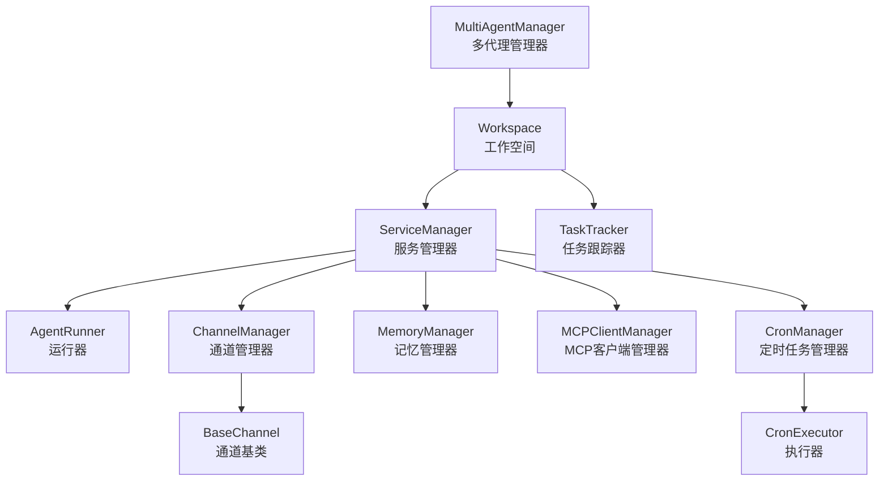
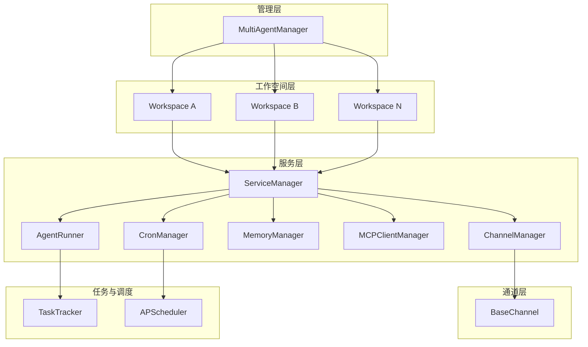
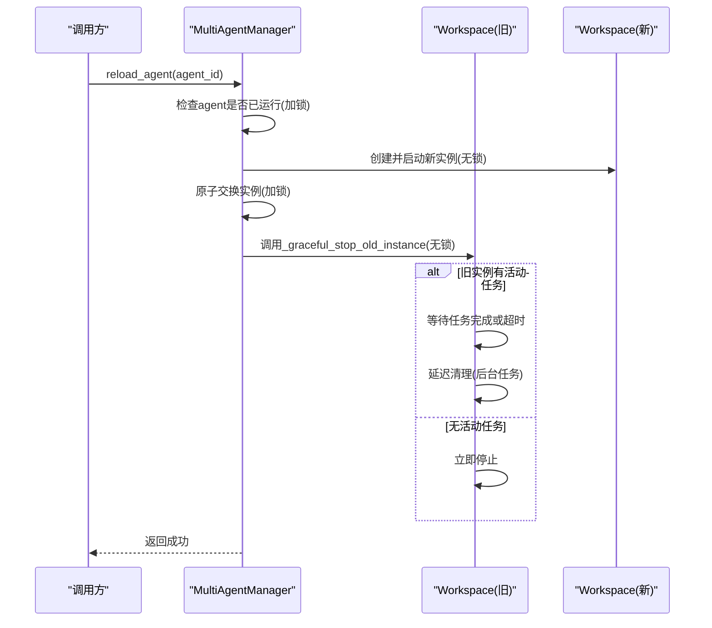
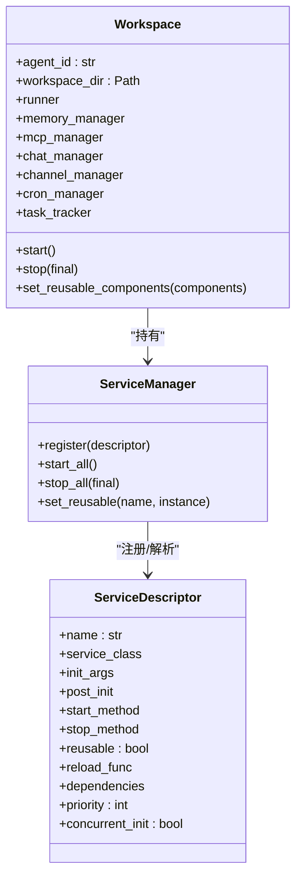
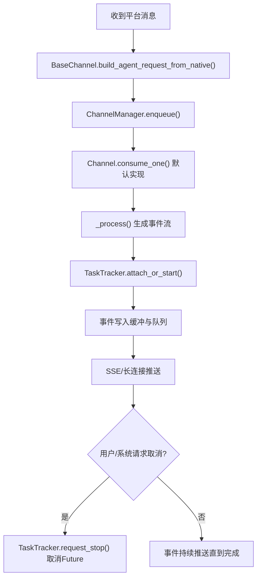
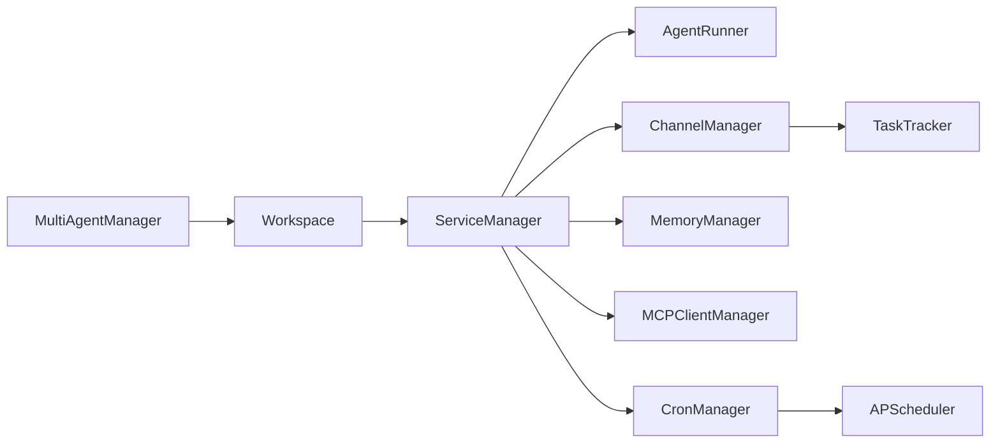

# 多代理协作机制

<cite>
**本文引用的文件**
- [multi_agent_manager.py](file://src/copaw/app/multi_agent_manager.py)
- [workspace.py](file://src/copaw/app/workspace/workspace.py)
- [service_manager.py](file://src/copaw/app/workspace/service_manager.py)
- [task_tracker.py](file://src/copaw/app/runner/task_tracker.py)
- [base.py](file://src/copaw/app/channels/base.py)
- [manager.py](file://src/copaw/app/crons/manager.py)
- [multi-agent.en.md](file://website/public/docs/multi-agent.en.md)
- [config.py](file://src/copaw/config/config.py)
- [config.en.md](file://website/public/docs/config.en.md)
</cite>

## 目录
1. [引言](#引言)
2. [项目结构](#项目结构)
3. [核心组件](#核心组件)
4. [架构总览](#架构总览)
5. [详细组件分析](#详细组件分析)
6. [依赖分析](#依赖分析)
7. [性能考量](#性能考量)
8. [故障排查指南](#故障排查指南)
9. [结论](#结论)
10. [附录](#附录)

## 引言
本文件系统性阐述 CoPaw 的多代理协作机制，重点围绕 MultiAgentManager 如何统一管理多个独立代理的工作空间（Workspace），涵盖代理的生命周期（创建、启动、停止、热重载）、状态同步与共享、并发与资源限制、以及运行器（Runner）如何协调代理执行。同时给出代理间通信与协作流程、资源共享策略、任务分配与冲突解决机制的说明，并提供可操作的最佳实践与性能优化建议，帮助在生产环境中稳定高效地管理多个代理实例。

## 项目结构
CoPaw 将“单代理”能力复用到“多代理”场景，通过 Workspace 封装每个代理的完整运行时环境（Runner、ChannelManager、MemoryManager、MCPClientManager、CronManager 等），由 MultiAgentManager 负责集中管理这些 Workspace 的生命周期与热重载。通道层负责消息编解码与队列分发，任务跟踪器支持流式输出与取消，定时任务管理器提供周期性任务调度。

图表来源
- [multi_agent_manager.py:21-470](file://src/copaw/app/multi_agent_manager.py#L21-L470)
- [workspace.py:50-392](file://src/copaw/app/workspace/workspace.py#L50-L392)
- [service_manager.py:74-117](file://src/copaw/app/workspace/service_manager.py#L74-L117)
- [base.py:361-474](file://src/copaw/app/channels/base.py#L361-L474)
- [task_tracker.py:30-231](file://src/copaw/app/runner/task_tracker.py#L30-L231)
- [manager.py:38-50](file://src/copaw/app/crons/manager.py#L38-L50)

章节来源
- [multi_agent_manager.py:21-470](file://src/copaw/app/multi_agent_manager.py#L21-L470)
- [workspace.py:50-392](file://src/copaw/app/workspace/workspace.py#L50-L392)
- [service_manager.py:74-117](file://src/copaw/app/workspace/service_manager.py#L74-L117)
- [base.py:361-474](file://src/copaw/app/channels/base.py#L361-L474)
- [task_tracker.py:30-231](file://src/copaw/app/runner/task_tracker.py#L30-L231)
- [manager.py:38-50](file://src/copaw/app/crons/manager.py#L38-L50)

## 核心组件
- MultiAgentManager：集中管理多个 Workspace，提供懒加载、并发启动、零停机热重载、优雅停止与清理任务管理。
- Workspace：单个代理的完整运行时封装，包含 Runner、ChannelManager、MemoryManager、MCPClientManager、CronManager 等，并通过 ServiceManager 统一注册与生命周期管理。
- ServiceManager/ServiceDescriptor：声明式服务注册与依赖解析，支持并发初始化、可复用组件与重启回调。
- TaskTracker：按会话维度跟踪运行中的任务，支持事件缓冲、SSE 流式广播、取消与清理。
- BaseChannel：通道抽象，负责将平台原生消息转换为 AgentRequest 并发送响应，配合队列与 TaskTracker 支持取消与重连。
- CronManager：基于 APScheduler 的异步调度器，支持并发信号量控制与心跳任务。

章节来源
- [multi_agent_manager.py:21-470](file://src/copaw/app/multi_agent_manager.py#L21-L470)
- [workspace.py:50-392](file://src/copaw/app/workspace/workspace.py#L50-L392)
- [service_manager.py:30-117](file://src/copaw/app/workspace/service_manager.py#L30-L117)
- [task_tracker.py:30-231](file://src/copaw/app/runner/task_tracker.py#L30-L231)
- [base.py:361-474](file://src/copaw/app/channels/base.py#L361-L474)
- [manager.py:38-50](file://src/copaw/app/crons/manager.py#L38-L50)

## 架构总览
下图展示了多代理协作的整体架构：MultiAgentManager 作为中枢，管理多个 Workspace；每个 Workspace 内部通过 ServiceManager 注册并启动一组服务；通道层负责消息入队与处理；任务跟踪器支撑流式与可取消的任务；定时任务管理器提供周期性任务调度。

图表来源
- [multi_agent_manager.py:21-470](file://src/copaw/app/multi_agent_manager.py#L21-L470)
- [workspace.py:50-392](file://src/copaw/app/workspace/workspace.py#L50-L392)
- [service_manager.py:74-117](file://src/copaw/app/workspace/service_manager.py#L74-L117)
- [base.py:361-474](file://src/copaw/app/channels/base.py#L361-L474)
- [task_tracker.py:30-231](file://src/copaw/app/runner/task_tracker.py#L30-L231)
- [manager.py:38-50](file://src/copaw/app/crons/manager.py#L38-L50)

## 详细组件分析

### MultiAgentManager：多代理生命周期与热重载
- 懒加载与线程安全：首次请求某 agent_id 时才创建并启动对应 Workspace，使用异步锁保证并发安全。
- 启动所有已启用代理：并发启动配置中 enabled=True 的代理，失败不影响其他代理启动。
- 停止与停止全部：支持按 agent_id 停止，或在应用关闭时取消延迟清理任务并逐个停止。
- 零停机热重载：先在无锁状态下创建并启动新 Workspace，再以最小锁时间原子替换旧实例，最后在无锁环境下优雅停止旧实例（若存在活动任务则延后清理）。
- 可复用组件：在热重载前从旧实例提取可复用组件（如 MemoryManager、ChatManager），在新实例启动前注入，减少重启开销。

图表来源
- [multi_agent_manager.py:208-319](file://src/copaw/app/multi_agent_manager.py#L208-L319)
- [workspace.py:363-382](file://src/copaw/app/workspace/workspace.py#L363-L382)

章节来源
- [multi_agent_manager.py:21-470](file://src/copaw/app/multi_agent_manager.py#L21-L470)

### Workspace：独立代理运行时封装
- 服务注册：通过 ServiceDescriptor 声明式注册 Runner、MemoryManager、MCPClientManager、ChatManager、ChannelManager、CronManager 等服务，定义启动顺序、并发初始化与可复用性。
- 可复用组件注入：在 start() 前通过 set_reusable_components 注入旧实例的可复用组件，避免重复初始化。
- 生命周期：start() 完成配置加载与服务启动；stop(final) 控制是否停止可复用组件，支持热重载场景。

图表来源
- [workspace.py:50-392](file://src/copaw/app/workspace/workspace.py#L50-L392)
- [service_manager.py:30-117](file://src/copaw/app/workspace/service_manager.py#L30-L117)

章节来源
- [workspace.py:50-392](file://src/copaw/app/workspace/workspace.py#L50-L392)
- [service_manager.py:30-117](file://src/copaw/app/workspace/service_manager.py#L30-L117)

### 通道与消息传递：BaseChannel 与 TaskTracker
- 消息编解码：BaseChannel 将平台原生消息转换为 AgentRequest，并在处理完成后将响应转换回平台消息格式。
- 队列与重连：通道消费循环基于队列，支持按 (channel, session, priority) 排序；TaskTracker 提供事件缓冲与重连回放。
- 取消与跟踪：TaskTracker 在 attach_or_start 中为每次运行创建 Future 与队列，支持 request_stop 取消运行，attach/detach 订阅者。

图表来源
- [base.py:361-474](file://src/copaw/app/channels/base.py#L361-L474)
- [task_tracker.py:142-208](file://src/copaw/app/runner/task_tracker.py#L142-L208)

章节来源
- [base.py:361-474](file://src/copaw/app/channels/base.py#L361-L474)
- [task_tracker.py:30-231](file://src/copaw/app/runner/task_tracker.py#L30-L231)

### 任务跟踪与取消：TaskTracker
- 运行键：以会话标识为运行键，每个运行维护一个 Future、队列列表与事件缓冲。
- 广播与重连：attach() 返回预填充缓冲的队列，便于断线重连回放。
- 取消与清理：request_stop() 取消运行；运行结束后自动清理运行记录。
- 全局等待：wait_all_done() 支持等待所有活动任务完成或超时。

章节来源
- [task_tracker.py:30-231](file://src/copaw/app/runner/task_tracker.py#L30-L231)

### 定时任务与并发控制：CronManager
- 调度器：基于 APScheduler 的异步调度器，支持 Cron 与间隔触发。
- 并发信号量：通过内部 Runtime.sem 控制并发执行，避免资源争用。
- 心跳任务：内置心跳作业 ID，用于健康检查与监控。

章节来源
- [manager.py:38-50](file://src/copaw/app/crons/manager.py#L38-L50)

### 代理协作与冲突解决
- 协作触发：当用户显式请求或代理主动判断需要其他代理的专业能力时，触发跨代理协作。
- 代理识别：协作前查询可用代理列表，依据名称、ID、描述与自动生成的 PROFILE.md 信息进行匹配。
- 冲突解决：在技能池升级或命名冲突时，提供重命名弹窗与确认流程，确保唯一性与一致性。

章节来源
- [multi-agent.en.md:256-417](file://website/public/docs/multi-agent.en.md#L256-L417)

## 依赖分析
- 组件耦合与内聚：MultiAgentManager 与 Workspace 之间通过 agent_id 解耦；Workspace 内部通过 ServiceManager 实现服务内聚与低耦合。
- 直接与间接依赖：MultiAgentManager 直接依赖 Workspace；Workspace 间接依赖 Runner、ChannelManager、MemoryManager、MCPClientManager、CronManager；通道层依赖 TaskTracker；定时任务依赖 Runner 与 ChannelManager。
- 外部依赖：APScheduler 用于定时任务；异步锁与队列用于并发与流式处理。

图表来源
- [multi_agent_manager.py:21-470](file://src/copaw/app/multi_agent_manager.py#L21-L470)
- [workspace.py:50-392](file://src/copaw/app/workspace/workspace.py#L50-L392)
- [service_manager.py:74-117](file://src/copaw/app/workspace/service_manager.py#L74-L117)
- [task_tracker.py:30-231](file://src/copaw/app/runner/task_tracker.py#L30-L231)
- [manager.py:38-50](file://src/copaw/app/crons/manager.py#L38-L50)

章节来源
- [multi_agent_manager.py:21-470](file://src/copaw/app/multi_agent_manager.py#L21-L470)
- [workspace.py:50-392](file://src/copaw/app/workspace/workspace.py#L50-L392)
- [service_manager.py:74-117](file://src/copaw/app/workspace/service_manager.py#L74-L117)
- [task_tracker.py:30-231](file://src/copaw/app/runner/task_tracker.py#L30-L231)
- [manager.py:38-50](file://src/copaw/app/crons/manager.py#L38-L50)

## 性能考量
- 并发启动：MultiAgentManager 并发启动已启用代理，缩短整体启动时间。
- 零停机热重载：最小化锁持有时间，新实例立即接管请求，旧实例后台优雅停止，降低中断风险。
- 可复用组件：热重载前复用 MemoryManager、ChatManager 等组件，减少初始化成本。
- 速率限制与退避：全局 LLM 速率限制与重试策略，避免瞬时拥塞导致的 429。
- 并发信号量：CronManager 使用信号量控制并发，防止资源争用。
- 事件缓冲与取消：TaskTracker 的缓冲与取消机制，提升用户体验并减少无效计算。

章节来源
- [multi_agent_manager.py:407-464](file://src/copaw/app/multi_agent_manager.py#L407-L464)
- [workspace.py:293-324](file://src/copaw/app/workspace/workspace.py#L293-L324)
- [config.py:546-586](file://src/copaw/config/config.py#L546-L586)
- [config.en.md:356-368](file://website/public/docs/config.en.md#L356-L368)
- [manager.py:38-50](file://src/copaw/app/crons/manager.py#L38-L50)
- [task_tracker.py:79-98](file://src/copaw/app/runner/task_tracker.py#L79-L98)

## 故障排查指南
- 启动失败：检查配置是否存在、依赖服务是否可启动；MultiAgentManager 的并发启动会记录失败但不阻塞其他代理。
- 热重载失败：新实例启动失败会回滚并保留旧实例；检查日志中的异常堆栈与清理尝试。
- 停止卡顿：若存在活动任务，旧实例会进入延迟清理流程；可通过 wait_all_done() 设置超时并观察日志。
- 通道消息丢失：确认 BaseChannel 的 enqueue/consume_one 是否正确实现，以及 TaskTracker 的 attach/detach 是否被调用。
- 定时任务堆积：检查 CronManager 的并发信号量与任务执行耗时，必要时调整并发上限或拆分任务。

章节来源
- [multi_agent_manager.py:321-344](file://src/copaw/app/multi_agent_manager.py#L321-L344)
- [base.py:361-474](file://src/copaw/app/channels/base.py#L361-L474)
- [task_tracker.py:79-98](file://src/copaw/app/runner/task_tracker.py#L79-L98)
- [manager.py:38-50](file://src/copaw/app/crons/manager.py#L38-L50)

## 结论
CoPaw 的多代理协作机制通过 MultiAgentManager 与 Workspace 的清晰分层，实现了高内聚、低耦合的代理生命周期管理与热重载能力；通道层与任务跟踪器保障了消息编解码、流式输出与取消；定时任务与并发控制提供了稳定的调度与资源保护。结合速率限制、可复用组件与冲突解决流程，可在生产环境中可靠地扩展与维护多代理系统。

## 附录
- 多代理协作使用场景与触发方式详见文档。
- 生产部署建议：合理设置并发与速率限制参数，定期进行热重载演练，监控 TaskTracker 与 CronManager 的运行状态。

章节来源
- [multi-agent.en.md:256-417](file://website/public/docs/multi-agent.en.md#L256-L417)