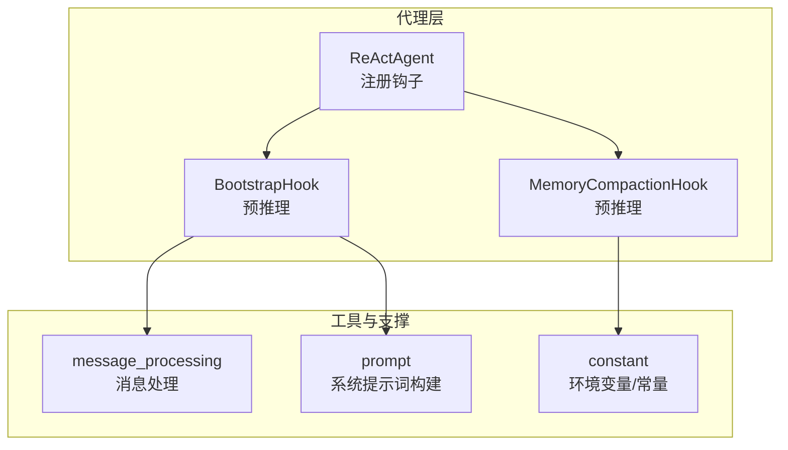
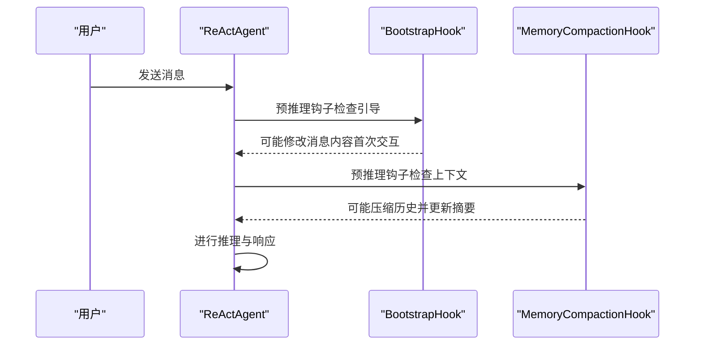
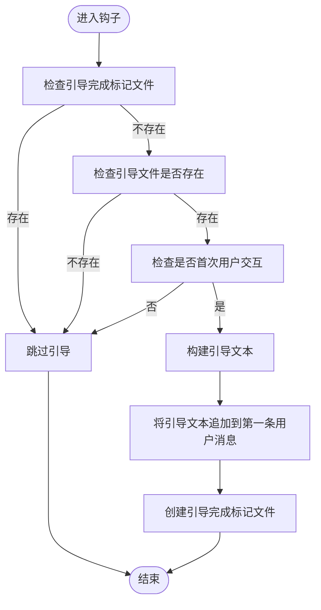
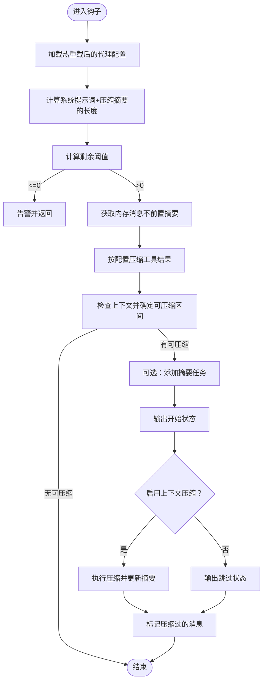
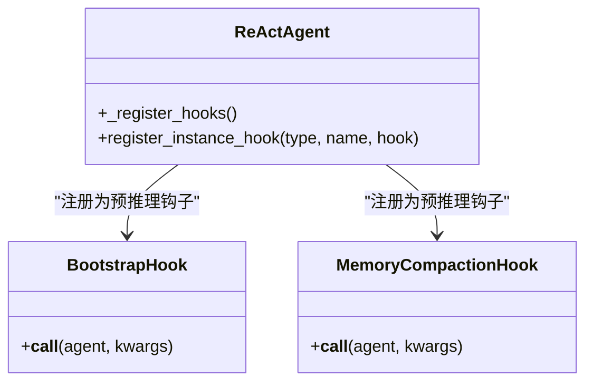
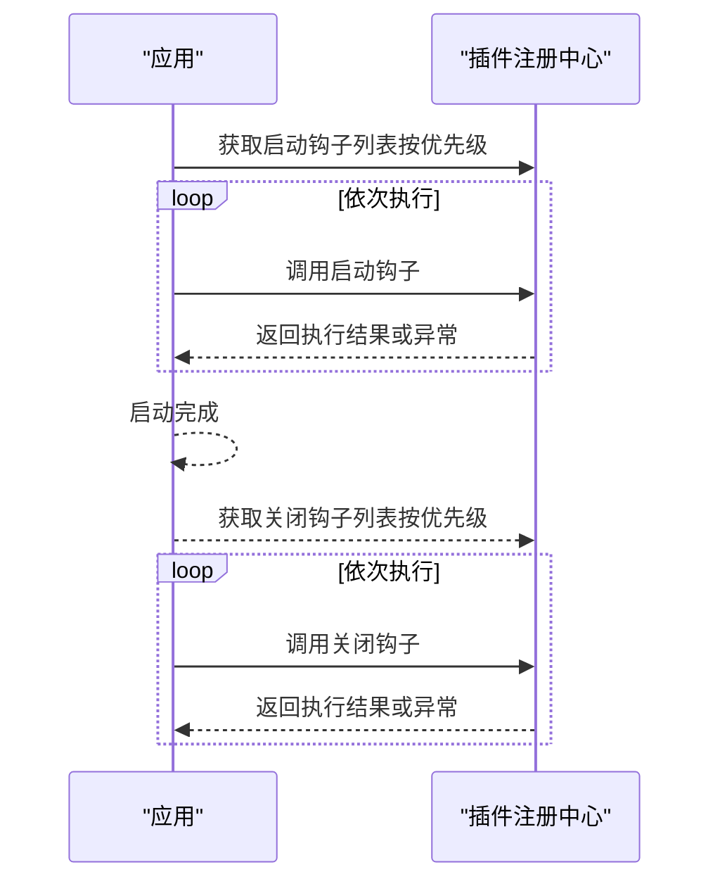
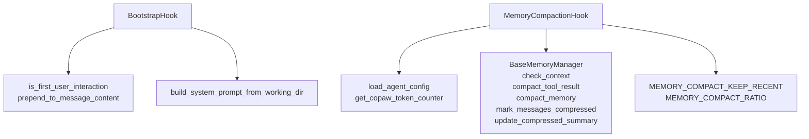

# 钩子系统设计

<cite>
**本文引用的文件**
- [src/copaw/agents/hooks/__init__.py](file://src/copaw/agents/hooks/__init__.py)
- [src/copaw/agents/hooks/bootstrap.py](file://src/copaw/agents/hooks/bootstrap.py)
- [src/copaw/agents/hooks/memory_compaction.py](file://src/copaw/agents/hooks/memory_compaction.py)
- [src/copaw/agents/react_agent.py](file://src/copaw/agents/react_agent.py)
- [src/copaw/agents/utils/message_processing.py](file://src/copaw/agents/utils/message_processing.py)
- [src/copaw/constant.py](file://src/copaw/constant.py)
- [src/copaw/agents/prompt.py](file://src/copaw/agents/prompt.py)
- [src/copaw/app/_app.py](file://src/copaw/app/_app.py)
- [src/copaw/plugins/registry.py](file://src/copaw/plugins/registry.py)
</cite>

## 目录
1. [简介](#简介)
2. [项目结构](#项目结构)
3. [核心组件](#核心组件)
4. [架构总览](#架构总览)
5. [详细组件分析](#详细组件分析)
6. [依赖分析](#依赖分析)
7. [性能考虑](#性能考虑)
8. [故障排查指南](#故障排查指南)
9. [结论](#结论)
10. [附录](#附录)

## 简介
本文件系统性阐述 CoPaw 代理（Agent）的钩子（Hook）机制设计与实现，重点覆盖以下方面：
- 预推理（pre-reasoning）与预行动（pre-acting）钩子的注册与执行时机
- 首次交互引导（BootstrapHook）的工作流程与触发条件
- 内存压缩（MemoryCompactionHook）的上下文窗口管理策略
- 钩子的异常处理与日志记录
- 自定义钩子的开发步骤、参数传递与钩子间通信建议
- 最佳实践与调试技巧

## 项目结构
钩子系统位于代理模块中，围绕 ReActAgent 的生命周期进行扩展：
- 钩子包：提供 BootstrapHook 与 MemoryCompactionHook
- 代理注册：在 ReActAgent 构造或初始化阶段注册钩子
- 工具与提示词：消息处理工具、系统提示词构建等支撑能力

图表来源
- [src/copaw/agents/react_agent.py:415-443](file://src/copaw/agents/react_agent.py#L415-L443)
- [src/copaw/agents/hooks/bootstrap.py:20-104](file://src/copaw/agents/hooks/bootstrap.py#L20-L104)
- [src/copaw/agents/hooks/memory_compaction.py:27-214](file://src/copaw/agents/hooks/memory_compaction.py#L27-L214)
- [src/copaw/agents/utils/message_processing.py:433-476](file://src/copaw/agents/utils/message_processing.py#L433-L476)
- [src/copaw/agents/prompt.py:183-200](file://src/copaw/agents/prompt.py#L183-L200)
- [src/copaw/constant.py:163-176](file://src/copaw/constant.py#L163-L176)

章节来源
- [src/copaw/agents/hooks/__init__.py:1-19](file://src/copaw/agents/hooks/__init__.py#L1-L19)
- [src/copaw/agents/react_agent.py:415-443](file://src/copaw/agents/react_agent.py#L415-L443)

## 核心组件
- BootstrapHook：在首次用户交互时检查工作目录中的引导文件，向第一条用户消息前追加引导内容，仅触发一次。
- MemoryCompactionHook：在推理前检查上下文长度，必要时对历史消息进行压缩与摘要更新，并输出状态反馈。

章节来源
- [src/copaw/agents/hooks/bootstrap.py:20-104](file://src/copaw/agents/hooks/bootstrap.py#L20-L104)
- [src/copaw/agents/hooks/memory_compaction.py:27-214](file://src/copaw/agents/hooks/memory_compaction.py#L27-L214)

## 架构总览
钩子在代理生命周期中的位置如下：
- 注册阶段：ReActAgent 在构造完成后注册预推理钩子
- 执行阶段：在推理前调用钩子；当前实现未暴露“预行动”钩子的显式调用点
- 异常处理：钩子内部使用 try/except 记录错误并继续执行

图表来源
- [src/copaw/agents/react_agent.py:415-443](file://src/copaw/agents/react_agent.py#L415-L443)
- [src/copaw/agents/hooks/bootstrap.py:42-104](file://src/copaw/agents/hooks/bootstrap.py#L42-L104)
- [src/copaw/agents/hooks/memory_compaction.py:62-214](file://src/copaw/agents/hooks/memory_compaction.py#L62-L214)

## 详细组件分析

### BootstrapHook 组件分析
- 触发条件
  - 存在工作目录下的引导文件
  - 首次用户交互（无助手回复）
  - 未触发过引导（通过完成标记文件避免重复）
- 行为
  - 读取系统提示词构建器生成的引导文本
  - 将引导文本追加到第一条用户消息内容前
  - 创建完成标记文件，防止后续重复触发
- 参数与配置
  - 工作目录路径
  - 语言代码（用于选择不同语言的引导内容）
- 异常处理
  - 捕获异常并记录错误日志，不影响后续流程

图表来源
- [src/copaw/agents/hooks/bootstrap.py:56-95](file://src/copaw/agents/hooks/bootstrap.py#L56-L95)
- [src/copaw/agents/utils/message_processing.py:456-476](file://src/copaw/agents/utils/message_processing.py#L456-L476)
- [src/copaw/agents/prompt.py:183-200](file://src/copaw/agents/prompt.py#L183-L200)

章节来源
- [src/copaw/agents/hooks/bootstrap.py:20-104](file://src/copaw/agents/hooks/bootstrap.py#L20-L104)
- [src/copaw/agents/utils/message_processing.py:433-476](file://src/copaw/agents/utils/message_processing.py#L433-L476)
- [src/copaw/agents/prompt.py:183-200](file://src/copaw/agents/prompt.py#L183-L200)

### MemoryCompactionHook 组件分析
- 触发时机：推理前（pre-reasoning）
- 监控指标：系统提示词与已压缩摘要的字符串长度，结合配置阈值判断是否需要压缩
- 压缩策略
  - 工具结果压缩：按配置对旧/近期工具结果进行裁剪与清理
  - 上下文检查：计算可压缩区间，保留最近若干条消息
  - 摘要任务：可选开启摘要生成异步任务
  - 内容压缩：可选开启上下文压缩，失败时输出警告信息
  - 标记与更新：标记压缩过的消息并更新压缩摘要
- 输出反馈：通过代理输出状态消息，告知压缩开始/完成/跳过
- 异常处理：捕获异常并记录详细日志，避免中断推理流程

图表来源
- [src/copaw/agents/hooks/memory_compaction.py:84-214](file://src/copaw/agents/hooks/memory_compaction.py#L84-L214)
- [src/copaw/constant.py:163-176](file://src/copaw/constant.py#L163-L176)

章节来源
- [src/copaw/agents/hooks/memory_compaction.py:27-214](file://src/copaw/agents/hooks/memory_compaction.py#L27-L214)
- [src/copaw/constant.py:163-176](file://src/copaw/constant.py#L163-L176)

### 钩子注册与执行顺序
- 注册位置：ReActAgent 的钩子注册方法中，分别创建并注册 BootstrapHook 与 MemoryCompactionHook，均为“预推理”类型
- 执行顺序：当前实现未显式排序，遵循注册顺序；如需严格顺序，可在上层统一管理或通过插件注册中心进行优先级控制

图表来源
- [src/copaw/agents/react_agent.py:415-443](file://src/copaw/agents/react_agent.py#L415-L443)
- [src/copaw/agents/hooks/bootstrap.py:42-104](file://src/copaw/agents/hooks/bootstrap.py#L42-L104)
- [src/copaw/agents/hooks/memory_compaction.py:62-214](file://src/copaw/agents/hooks/memory_compaction.py#L62-L214)

章节来源
- [src/copaw/agents/react_agent.py:415-443](file://src/copaw/agents/react_agent.py#L415-L443)

### 插件钩子（Startup/Shutdown）与应用集成
- 应用启动时会遍历插件注册中心的启动钩子并按优先级执行，失败时记录错误日志
- 应用关闭时会遍历插件注册中心的关闭钩子并按优先级执行
- 该机制与代理钩子互补，用于应用级扩展

图表来源
- [src/copaw/app/_app.py:372-407](file://src/copaw/app/_app.py#L372-L407)
- [src/copaw/plugins/registry.py:149-221](file://src/copaw/plugins/registry.py#L149-L221)

章节来源
- [src/copaw/app/_app.py:372-407](file://src/copaw/app/_app.py#L372-L407)
- [src/copaw/plugins/registry.py:149-221](file://src/copaw/plugins/registry.py#L149-L221)

## 依赖分析
- BootstrapHook 依赖
  - 工作目录下的引导文件与完成标记文件
  - 首次交互检测工具
  - 系统提示词构建器
  - 消息内容追加工具
- MemoryCompactionHook 依赖
  - 热重载后的代理配置
  - 令牌计数器
  - 内存管理器（上下文检查、工具结果压缩、摘要更新、标记压缩）
  - 环境变量常量（最近保留条数等）

图表来源
- [src/copaw/agents/hooks/bootstrap.py:12-15](file://src/copaw/agents/hooks/bootstrap.py#L12-L15)
- [src/copaw/agents/utils/message_processing.py:433-476](file://src/copaw/agents/utils/message_processing.py#L433-L476)
- [src/copaw/agents/prompt.py:183-200](file://src/copaw/agents/prompt.py#L183-L200)
- [src/copaw/agents/hooks/memory_compaction.py:15-20](file://src/copaw/agents/hooks/memory_compaction.py#L15-L20)
- [src/copaw/constant.py:163-176](file://src/copaw/constant.py#L163-L176)

章节来源
- [src/copaw/agents/hooks/bootstrap.py:12-15](file://src/copaw/agents/hooks/bootstrap.py#L12-L15)
- [src/copaw/agents/hooks/memory_compaction.py:15-20](file://src/copaw/agents/hooks/memory_compaction.py#L15-L20)
- [src/copaw/constant.py:163-176](file://src/copaw/constant.py#L163-L176)

## 性能考虑
- 令牌计数与上下文检查：在推理前进行，应尽量减少不必要的全量扫描；可通过合理的阈值与保留策略降低开销
- 工具结果压缩：针对旧/近期结果设置合理的字节上限与保留天数，避免频繁 I/O
- 摘要任务：异步摘要可提升吞吐，但需注意与压缩任务的并发协调
- 日志级别：生产环境建议调整日志级别，避免高频状态消息影响性能

## 故障排查指南
- 引导未生效
  - 检查工作目录是否存在引导文件与完成标记文件
  - 确认是否为首次用户交互
  - 查看日志中关于引导处理的记录
- 上下文压缩未触发
  - 检查配置阈值是否合理
  - 确认内存管理器可用且上下文检查返回可压缩区间
  - 关注无效消息警告并核对消息结构
- 压缩失败
  - 查看失败状态消息与异常日志
  - 确认摘要生成与压缩接口可用
- 插件钩子异常
  - 应用启动/关闭钩子失败会被记录并继续执行其他钩子，建议逐个排查插件注册与回调实现

章节来源
- [src/copaw/agents/hooks/bootstrap.py:96-102](file://src/copaw/agents/hooks/bootstrap.py#L96-L102)
- [src/copaw/agents/hooks/memory_compaction.py:144-150](file://src/copaw/agents/hooks/memory_compaction.py#L144-L150)
- [src/copaw/app/_app.py:372-407](file://src/copaw/app/_app.py#L372-L407)

## 结论
CoPaw 的钩子系统通过简洁的可调用接口在代理生命周期的关键节点注入自定义逻辑。BootstrapHook 与 MemoryCompactionHook 分别负责“首次交互引导”和“上下文窗口管理”，二者配合可显著提升用户体验与稳定性。建议在实际使用中：
- 明确钩子职责边界，避免过度耦合
- 使用配置化参数与环境变量控制行为
- 重视异常处理与日志输出，便于问题定位
- 对关键钩子进行性能评估与优化

## 附录

### 自定义钩子开发步骤
- 设计职责：明确钩子在“预推理/预行动”阶段的具体职责
- 实现接口：实现可调用对象（支持异步），接收 agent 与 kwargs 并返回 None 或修改后的 kwargs
- 注册方式：在代理构造或初始化阶段注册为实例钩子
- 参数传递：通过钩子构造函数传入所需依赖（如工作目录、配置、内存管理器等）
- 钩子间通信：通过共享对象（如全局配置、内存管理器实例）或消息内容传递

章节来源
- [src/copaw/agents/react_agent.py:415-443](file://src/copaw/agents/react_agent.py#L415-L443)
- [src/copaw/agents/hooks/bootstrap.py:28-46](file://src/copaw/agents/hooks/bootstrap.py#L28-L46)
- [src/copaw/agents/hooks/memory_compaction.py:35-66](file://src/copaw/agents/hooks/memory_compaction.py#L35-L66)

### 钩子最佳实践
- 保持幂等：确保钩子多次执行不会产生副作用
- 谨慎变更消息内容：变更前先备份或只在必要时修改
- 控制阻塞：避免在钩子中执行耗时操作，必要时使用异步与后台任务
- 清晰命名与文档：为钩子提供清晰的名称、用途说明与配置项
- 测试与灰度：先在小范围测试，逐步扩大应用

### 调试技巧
- 开启详细日志：观察钩子执行前后消息内容变化与状态输出
- 使用最小化场景：仅启用目标钩子，排除干扰因素
- 核对配置：确认阈值、保留条数、语言等配置符合预期
- 复现首次交互：通过删除引导完成标记文件验证引导流程