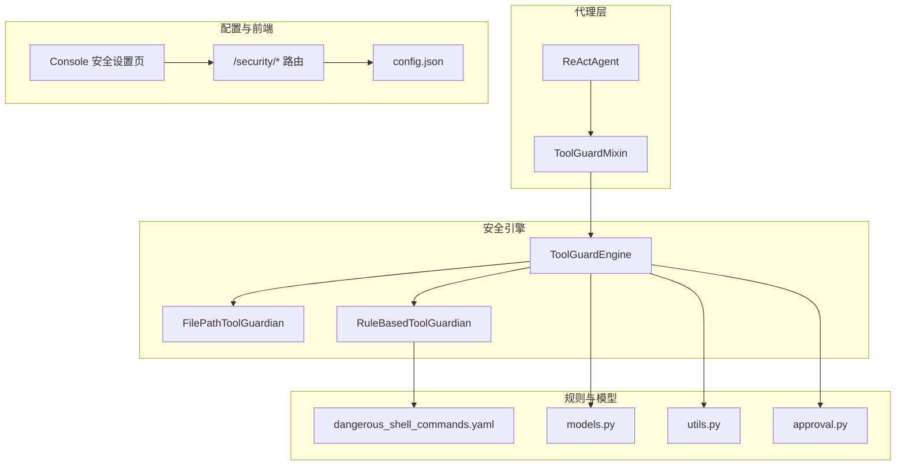
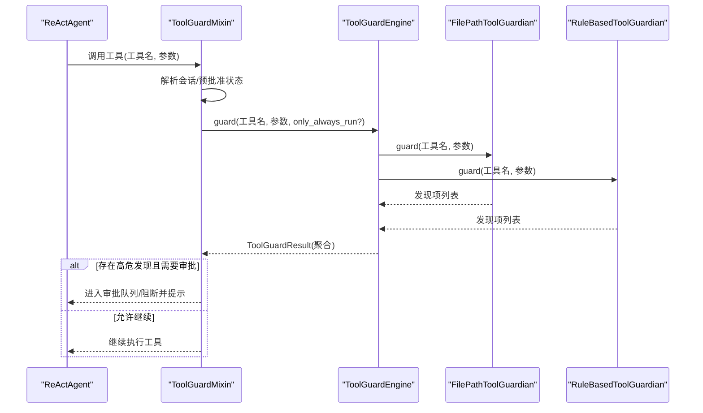
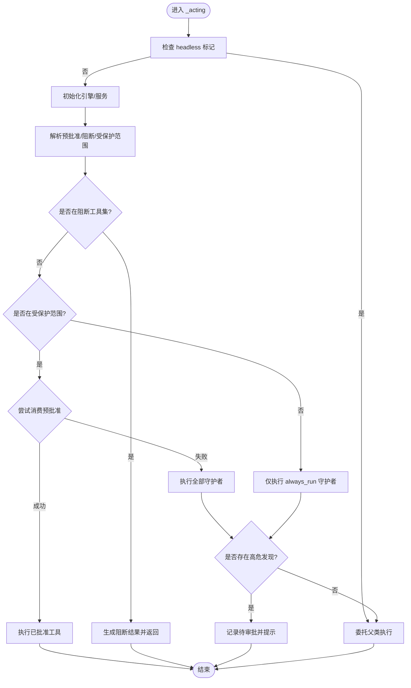
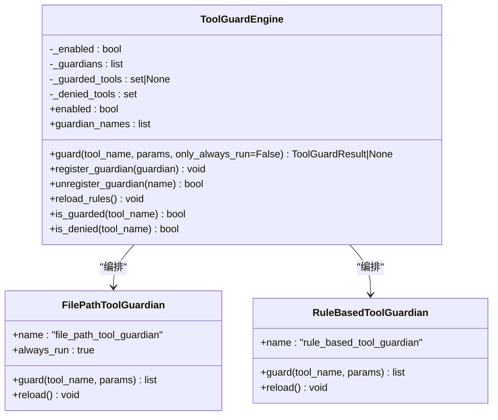
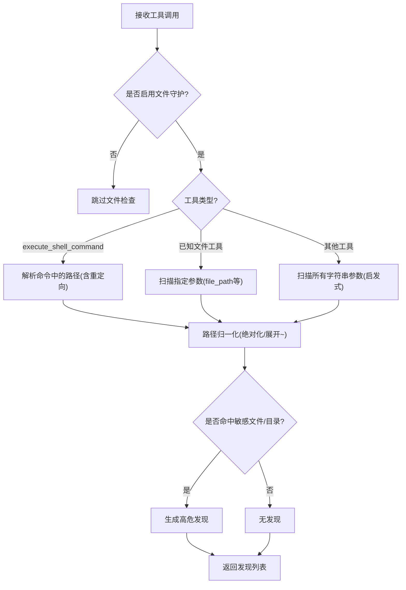
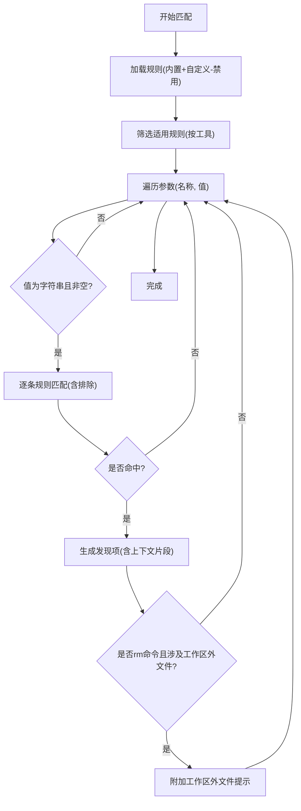
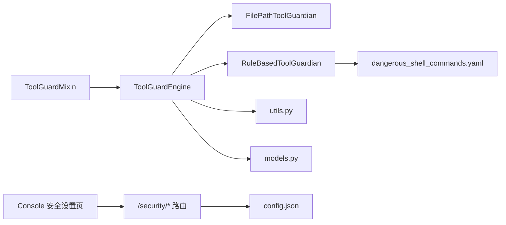

# 工具安全机制

<cite>
**本文引用的文件**
- [tool_guard_mixin.py](file://src/copaw/agents/tool_guard_mixin.py)
- [engine.py](file://src/copaw/security/tool_guard/engine.py)
- [file_guardian.py](file://src/copaw/security/tool_guard/guardians/file_guardian.py)
- [rule_guardian.py](file://src/copaw/security/tool_guard/guardians/rule_guardian.py)
- [models.py](file://src/copaw/security/tool_guard/models.py)
- [utils.py](file://src/copaw/security/tool_guard/utils.py)
- [dangerous_shell_commands.yaml](file://src/copaw/security/tool_guard/rules/dangerous_shell_commands.yaml)
- [approval.py](file://src/copaw/security/tool_guard/approval.py)
- [config.py](file://src/copaw/app/routers/config.py)
- [security.en.md](file://website/public/docs/security.en.md)
- [useToolGuard.ts](file://console/src/pages/Settings/Security/useToolGuard.ts)
- [RuleModal.tsx](file://console/src/pages/Settings/Security/components/RuleModal.tsx)
- [index.tsx](file://console/src/pages/Settings/Security/index.tsx)
</cite>

## 目录
1. [简介](#简介)
2. [项目结构](#项目结构)
3. [核心组件](#核心组件)
4. [架构总览](#架构总览)
5. [详细组件分析](#详细组件分析)
6. [依赖分析](#依赖分析)
7. [性能考量](#性能考量)
8. [故障排查指南](#故障排查指南)
9. [结论](#结论)
10. [附录](#附录)

## 简介
本文件系统化阐述 CoPaw 的工具安全机制，重点围绕 ToolGuardMixin 的安全设计理念与实现，包括工具调用拦截、危险操作检测、访问控制、规则匹配与威胁评估、决策逻辑、文件守护与规则守护的具体实现，以及安全配置与最佳实践。目标是帮助开发者与运维人员理解并正确使用工具护栏（Tool Guard）、文件护栏（File Guard）与规则护栏（Rule-based Guard），以在保障安全的前提下提升自动化工具的可控性与可审计性。

## 项目结构
工具安全机制主要分布在以下模块：
- 安全引擎与守护者：security/tool_guard
  - 引擎：engine.py
  - 守护者：file_guardian.py、rule_guardian.py
  - 数据模型与工具：models.py、utils.py、approval.py
  - 规则：rules/dangerous_shell_commands.yaml
- 代理拦截混入：agents/tool_guard_mixin.py
- 配置与控制台：app/routers/config.py、console 页面

图表来源
- [engine.py:53-102](file://src/copaw/security/tool_guard/engine.py#L53-L102)
- [file_guardian.py:161-177](file://src/copaw/security/tool_guard/guardians/file_guardian.py#L161-L177)
- [rule_guardian.py:559-581](file://src/copaw/security/tool_guard/guardians/rule_guardian.py#L559-L581)
- [dangerous_shell_commands.yaml:1-187](file://src/copaw/security/tool_guard/rules/dangerous_shell_commands.yaml#L1-L187)
- [models.py:60-116](file://src/copaw/security/tool_guard/models.py#L60-L116)
- [utils.py:63-126](file://src/copaw/security/tool_guard/utils.py#L63-L126)
- [approval.py:20-42](file://src/copaw/security/tool_guard/approval.py#L20-L42)
- [config.py:402-430](file://src/copaw/app/routers/config.py#L402-L430)
- [index.tsx:239-273](file://console/src/pages/Settings/Security/index.tsx#L239-L273)

章节来源
- [engine.py:53-102](file://src/copaw/security/tool_guard/engine.py#L53-L102)
- [file_guardian.py:161-177](file://src/copaw/security/tool_guard/guardians/file_guardian.py#L161-L177)
- [rule_guardian.py:559-581](file://src/copaw/security/tool_guard/guardians/rule_guardian.py#L559-L581)
- [dangerous_shell_commands.yaml:1-187](file://src/copaw/security/tool_guard/rules/dangerous_shell_commands.yaml#L1-L187)
- [models.py:60-116](file://src/copaw/security/tool_guard/models.py#L60-L116)
- [utils.py:63-126](file://src/copaw/security/tool_guard/utils.py#L63-L126)
- [approval.py:20-42](file://src/copaw/security/tool_guard/approval.py#L20-L42)
- [config.py:402-430](file://src/copaw/app/routers/config.py#L402-L430)
- [index.tsx:239-273](file://console/src/pages/Settings/Security/index.tsx#L239-L273)

## 核心组件
- ToolGuardMixin：在代理执行工具前进行拦截与审批，负责预审、预批准、阻断与审批流编排。
- ToolGuardEngine：统一编排守护者，聚合结果，提供开关、范围与阻断工具集解析。
- FilePathToolGuardian：基于敏感文件/目录白名单的路径级访问控制，支持 shell 命令路径提取。
- RuleBasedToolGuardian：基于 YAML 规则的正则匹配，覆盖命令注入、路径遍历、权限滥用、特权提升等威胁类别。
- 数据模型与工具：定义威胁等级、类别、发现项、结果聚合、日志格式化、配置解析与审批摘要。

章节来源
- [tool_guard_mixin.py:45-110](file://src/copaw/agents/tool_guard_mixin.py#L45-L110)
- [engine.py:53-164](file://src/copaw/security/tool_guard/engine.py#L53-L164)
- [file_guardian.py:161-342](file://src/copaw/security/tool_guard/guardians/file_guardian.py#L161-L342)
- [rule_guardian.py:559-758](file://src/copaw/security/tool_guard/guardians/rule_guardian.py#L559-L758)
- [models.py:25-185](file://src/copaw/security/tool_guard/models.py#L25-L185)
- [utils.py:63-163](file://src/copaw/security/tool_guard/utils.py#L63-L163)
- [approval.py:12-42](file://src/copaw/security/tool_guard/approval.py#L12-L42)

## 架构总览
工具安全机制采用“拦截前置 + 多守护协同”的设计。代理在执行工具前通过 ToolGuardMixin 进行决策；ToolGuardEngine 统一调度 FilePathToolGuardian 与 RuleBasedToolGuardian，并根据配置决定是否进入审批流程。规则守护器从 YAML 加载内置规则，结合用户自定义规则与禁用规则集进行匹配；文件守护器独立运行，对所有工具调用扫描路径参数，确保敏感文件/目录不被访问。

图表来源
- [tool_guard_mixin.py:316-370](file://src/copaw/agents/tool_guard_mixin.py#L316-L370)
- [engine.py:169-226](file://src/copaw/security/tool_guard/engine.py#L169-L226)
- [file_guardian.py:290-342](file://src/copaw/security/tool_guard/guardians/file_guardian.py#L290-L342)
- [rule_guardian.py:608-758](file://src/copaw/security/tool_guard/guardians/rule_guardian.py#L608-L758)

## 详细组件分析

### ToolGuardMixin 安全拦截与审批流
- 预审与预批准：在工具执行前尝试消费一次性预批准令牌，若命中则直接放行。
- 阻断判定：若工具在“阻断工具集”内，立即生成阻断结果并返回。
- 守护者执行：根据工具是否在“受保护范围”，选择仅执行 always_run 守护者（如文件路径检查）或全部守护者。
- 审批流程：当存在高危发现且具备会话上下文时，记录待审批条目，向用户提示并等待批准；否则直接放行。
- 记忆清理：阻断后清理历史阻断消息，避免对话历史污染。

图表来源
- [tool_guard_mixin.py:261-314](file://src/copaw/agents/tool_guard_mixin.py#L261-L314)
- [tool_guard_mixin.py:316-370](file://src/copaw/agents/tool_guard_mixin.py#L316-L370)
- [tool_guard_mixin.py:372-396](file://src/copaw/agents/tool_guard_mixin.py#L372-L396)
- [tool_guard_mixin.py:447-615](file://src/copaw/agents/tool_guard_mixin.py#L447-L615)

章节来源
- [tool_guard_mixin.py:261-314](file://src/copaw/agents/tool_guard_mixin.py#L261-L314)
- [tool_guard_mixin.py:316-370](file://src/copaw/agents/tool_guard_mixin.py#L316-L370)
- [tool_guard_mixin.py:372-396](file://src/copaw/agents/tool_guard_mixin.py#L372-L396)
- [tool_guard_mixin.py:447-615](file://src/copaw/agents/tool_guard_mixin.py#L447-L615)

### ToolGuardEngine：守护者编排与规则加载
- 默认守护者：自动注册文件路径守护者与规则守护者。
- 工具集合解析：从环境变量、配置文件与默认集合解析受保护工具集与阻断工具集。
- 规则重载：支持运行时重新加载规则与工具集合。
- 结果聚合：按守护者维度收集发现项，记录耗时与失败守护者。

图表来源
- [engine.py:53-164](file://src/copaw/security/tool_guard/engine.py#L53-L164)
- [engine.py:169-226](file://src/copaw/security/tool_guard/engine.py#L169-L226)
- [file_guardian.py:161-177](file://src/copaw/security/tool_guard/guardians/file_guardian.py#L161-L177)
- [rule_guardian.py:559-581](file://src/copaw/security/tool_guard/guardians/rule_guardian.py#L559-L581)

章节来源
- [engine.py:53-164](file://src/copaw/security/tool_guard/engine.py#L53-L164)
- [engine.py:169-226](file://src/copaw/security/tool_guard/engine.py#L169-L226)

### 文件守护（FileGuardian）：敏感文件/目录访问控制
- 启用策略：独立于主开关，可通过配置启用/禁用。
- 路径提取：
  - 已知文件工具：仅扫描特定参数（如 file_path）。
  - Shell 命令：解析命令字符串中的重定向与路径参数。
  - 其他工具：对所有字符串参数进行启发式判断，提取疑似路径。
- 路径归一化：支持 ~、相对路径与工作区根目录解析，避免绕过。
- 匹配策略：对绝对路径进行集合匹配，支持目录递归阻断（以斜杠结尾）。
- 威胁等级：命中敏感文件/目录即生成高危发现。

图表来源
- [file_guardian.py:111-158](file://src/copaw/security/tool_guard/guardians/file_guardian.py#L111-L158)
- [file_guardian.py:290-342](file://src/copaw/security/tool_guard/guardians/file_guardian.py#L290-L342)

章节来源
- [file_guardian.py:111-158](file://src/copaw/security/tool_guard/guardians/file_guardian.py#L111-L158)
- [file_guardian.py:290-342](file://src/copaw/security/tool_guard/guardians/file_guardian.py#L290-L342)

### 规则守护（RuleBasedToolGuardian）：规则匹配与威胁评估
- 规则来源：内置 YAML 规则与用户自定义规则，支持禁用规则 ID。
- 规则对象：GuardRule 支持工具/参数作用域、正则模式与排除模式、严重性与类别。
- 匹配流程：对参数值进行字符串化，按适用规则逐一匹配，生成带上下文片段的发现项。
- 特殊增强：针对 rm 命令，额外检查目标是否位于工作区外，生成结构化提示信息。
- 严重性与类别：覆盖命令注入、路径遍历、敏感文件访问、网络滥用、凭证暴露、资源滥用、提示词注入、代码执行、特权提升等。

图表来源
- [rule_guardian.py:583-593](file://src/copaw/security/tool_guard/guardians/rule_guardian.py#L583-L593)
- [rule_guardian.py:608-758](file://src/copaw/security/tool_guard/guardians/rule_guardian.py#L608-L758)
- [dangerous_shell_commands.yaml:12-187](file://src/copaw/security/tool_guard/rules/dangerous_shell_commands.yaml#L12-L187)

章节来源
- [rule_guardian.py:583-593](file://src/copaw/security/tool_guard/guardians/rule_guardian.py#L583-L593)
- [rule_guardian.py:608-758](file://src/copaw/security/tool_guard/guardians/rule_guardian.py#L608-L758)
- [dangerous_shell_commands.yaml:12-187](file://src/copaw/security/tool_guard/rules/dangerous_shell_commands.yaml#L12-L187)

### 数据模型与工具：发现、结果与日志
- GuardFinding：单次发现的结构化载体，包含规则 ID、类别、严重性、标题、描述、参数名、匹配值、片段、修复建议、守护者与元数据。
- ToolGuardResult：一次工具调用的聚合结果，包含最高严重性、发现计数、守护者使用情况与失败列表、耗时与时间戳。
- 日志格式化：按严重性输出结构化日志，便于审计与告警。
- 配置解析：解析受保护工具集、阻断工具集与规则禁用集，支持环境变量与配置文件优先级。

章节来源
- [models.py:60-185](file://src/copaw/security/tool_guard/models.py#L60-L185)
- [utils.py:63-163](file://src/copaw/security/tool_guard/utils.py#L63-L163)
- [approval.py:20-42](file://src/copaw/security/tool_guard/approval.py#L20-L42)

## 依赖分析
- 组件耦合
  - ToolGuardMixin 依赖 ToolGuardEngine 与审批服务，串行决策在锁内完成，实际执行在锁外并行，保证状态一致与性能。
  - ToolGuardEngine 依赖两类守护者，守护者之间低耦合，通过统一接口返回发现项。
  - RuleBasedToolGuardian 依赖 YAML 规则与配置，支持热重载。
  - FileGuardian 依赖配置中的敏感文件列表与工作区根目录，独立于主开关。
- 外部集成点
  - 控制台路由提供获取/更新工具护栏与文件护栏配置的能力。
  - 前端页面支持批量加载内置规则、合并自定义规则、禁用规则与保存配置。

图表来源
- [tool_guard_mixin.py:57-69](file://src/copaw/agents/tool_guard_mixin.py#L57-L69)
- [engine.py:84-102](file://src/copaw/security/tool_guard/engine.py#L84-L102)
- [rule_guardian.py:467-510](file://src/copaw/security/tool_guard/guardians/rule_guardian.py#L467-L510)
- [config.py:402-430](file://src/copaw/app/routers/config.py#L402-L430)
- [index.tsx:239-273](file://console/src/pages/Settings/Security/index.tsx#L239-L273)

章节来源
- [tool_guard_mixin.py:57-69](file://src/copaw/agents/tool_guard_mixin.py#L57-L69)
- [engine.py:84-102](file://src/copaw/security/tool_guard/engine.py#L84-L102)
- [rule_guardian.py:467-510](file://src/copaw/security/tool_guard/guardians/rule_guardian.py#L467-L510)
- [config.py:402-430](file://src/copaw/app/routers/config.py#L402-L430)
- [index.tsx:239-273](file://console/src/pages/Settings/Security/index.tsx#L239-L273)

## 性能考量
- 正则预编译：规则守护器在加载时预编译正则表达式，降低运行时匹配开销。
- 最大化并行：决策阶段串行，执行阶段并行，避免锁竞争影响吞吐。
- 路径归一化缓存：路径标准化在文件守护器内部完成，减少重复计算。
- 规则分层：always_run 守护者（文件路径）在非受保护工具调用时仍执行，确保最小成本的路径检查。
- 日志降噪：仅对高危发现输出警告级别日志，降低噪声。

## 故障排查指南
- 工具未被拦截
  - 检查受保护工具集解析优先级：构造参数 > 环境变量 > 配置文件 > 默认集合。
  - 确认 ToolGuardEngine.enabled 与守护者注册状态。
- 规则未生效
  - 检查自定义规则是否被禁用（disabled_rules）。
  - 确认规则文件路径与格式正确，错误规则会被跳过并记录警告。
- 文件路径绕过
  - 检查敏感文件列表是否包含工作区外路径的绝对化结果。
  - 确认路径归一化逻辑（~、相对路径、工作区根目录）是否符合预期。
- 审批流程异常
  - 检查会话上下文是否存在，审批服务是否可用。
  - 查看内存中标记为阻断的消息是否被清理导致无法识别。

章节来源
- [utils.py:63-126](file://src/copaw/security/tool_guard/utils.py#L63-L126)
- [engine.py:148-153](file://src/copaw/security/tool_guard/engine.py#L148-L153)
- [rule_guardian.py:518-551](file://src/copaw/security/tool_guard/guardians/rule_guardian.py#L518-L551)
- [file_guardian.py:177-224](file://src/copaw/security/tool_guard/guardians/file_guardian.py#L177-L224)
- [tool_guard_mixin.py:222-255](file://src/copaw/agents/tool_guard_mixin.py#L222-L255)

## 结论
CoPaw 的工具安全机制通过 ToolGuardMixin 的拦截与审批、ToolGuardEngine 的多守护协同、FilePathToolGuardian 的路径级访问控制与 RuleBasedToolGuardian 的规则匹配，构建了面向自动化工具调用的纵深防御体系。其设计强调可配置、可观测与可扩展，既能在交互场景下提供强约束的审批流，也能在非交互场景下通过阻断工具集与高危规则实现硬限制。配合控制台与 API 的配置能力，团队可以灵活地平衡安全与可用性。

## 附录

### 安全配置指南
- 工具护栏（Tool Guard）
  - 开关与范围：通过环境变量或配置文件设置 enabled、guarded_tools、denied_tools。
  - 自定义规则：在配置中添加 custom_rules，并通过 disabled_rules 禁用不需要的内置规则。
  - 实时生效：更新配置后，路由会调用引擎 reload_rules，立即生效。
- 文件护栏（File Guard）
  - 启用/禁用与敏感路径：通过路由更新 security.file_guard.enabled 与 sensitive_files。
  - 默认保护：若未配置敏感路径，默认保护密钥目录。
- 控制台管理
  - 在 Console 的“安全设置-工具护栏/文件护栏”页面，可查看内置规则、编辑自定义规则、禁用规则并保存。

章节来源
- [config.py:402-430](file://src/copaw/app/routers/config.py#L402-L430)
- [config.py:491-517](file://src/copaw/app/routers/config.py#L491-L517)
- [useToolGuard.ts:13-39](file://console/src/pages/Settings/Security/useToolGuard.ts#L13-L39)
- [RuleModal.tsx:1-56](file://console/src/pages/Settings/Security/components/RuleModal.tsx#L1-L56)
- [index.tsx:239-273](file://console/src/pages/Settings/Security/index.tsx#L239-L273)
- [security.en.md:52-147](file://website/public/docs/security.en.md#L52-L147)

### 威胁防护最佳实践
- 优先启用文件护栏：对密钥目录与敏感路径进行默认保护。
- 精准划定受保护工具集：仅对高风险工具启用严格拦截，避免过度阻断。
- 使用自定义规则细化威胁面：针对业务场景补充规则，同时利用 exclude_patterns 进行白名单化。
- 分层审批：对 CRITICAL/HIGH 发现强制审批，对 MEDIUM 可结合业务策略放宽。
- 定期审计：关注日志中的高危发现与失败守护者，持续优化规则与阈值。

章节来源
- [security.en.md:38-68](file://website/public/docs/security.en.md#L38-L68)
- [security.en.md:145-231](file://website/public/docs/security.en.md#L145-L231)
- [utils.py:128-163](file://src/copaw/security/tool_guard/utils.py#L128-L163)