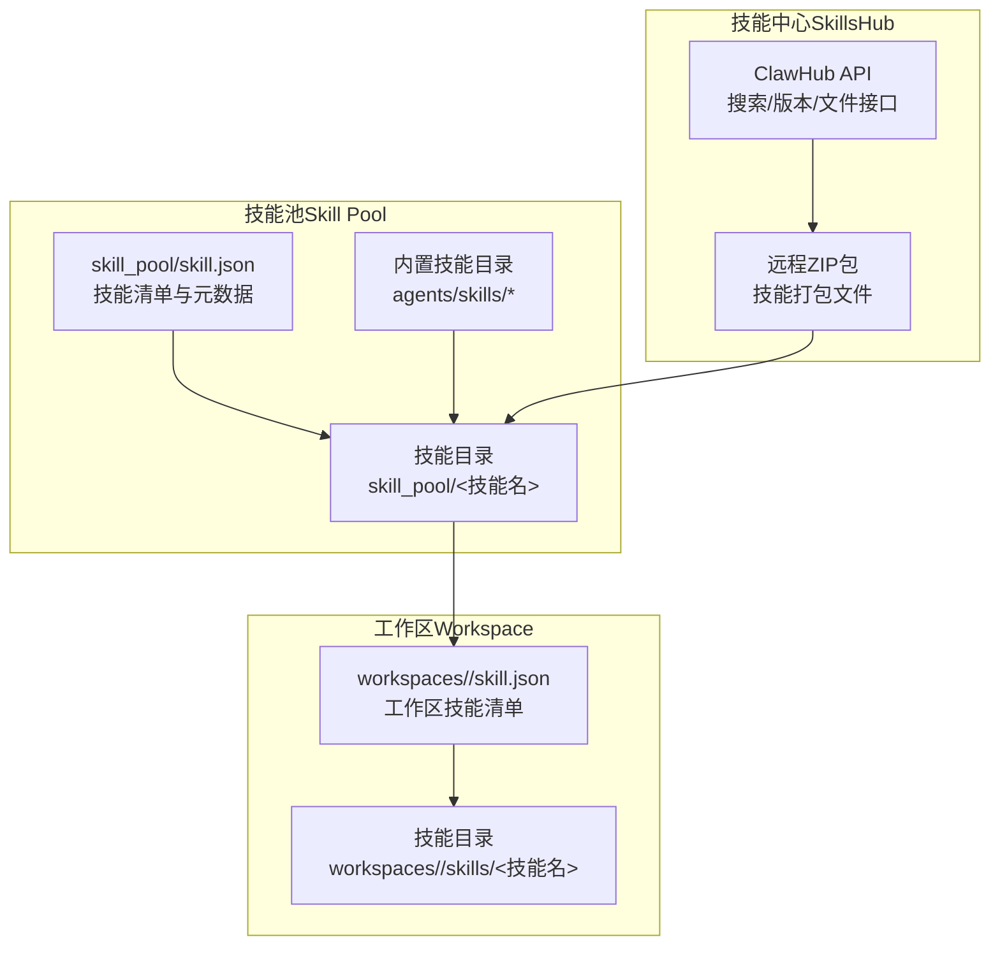
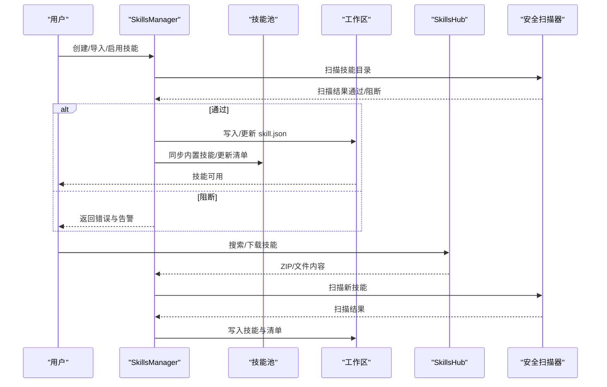
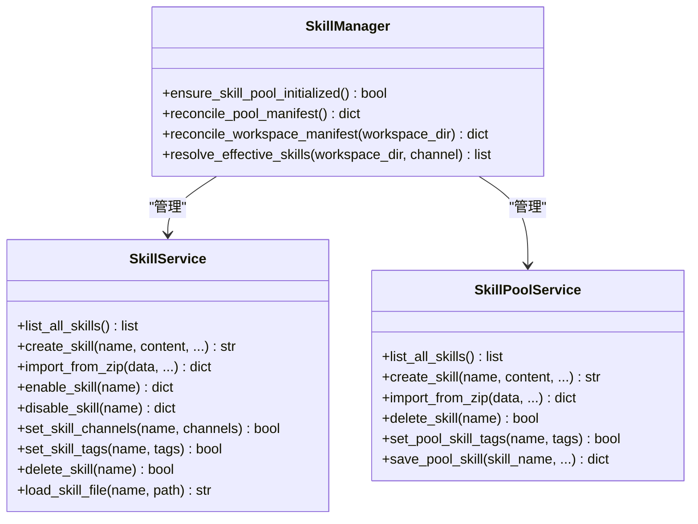
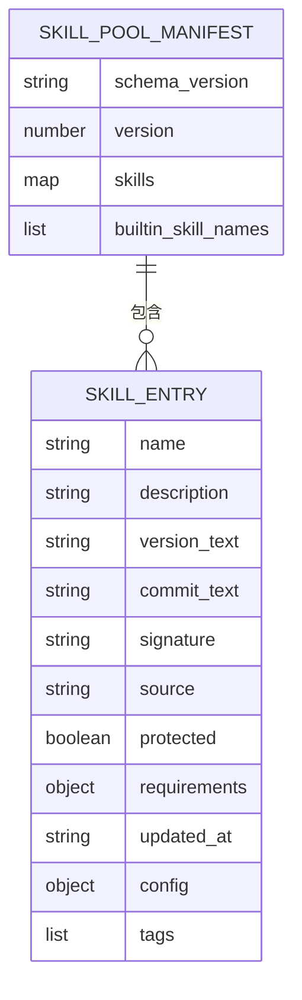
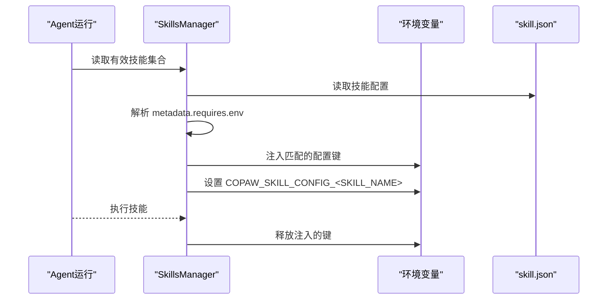
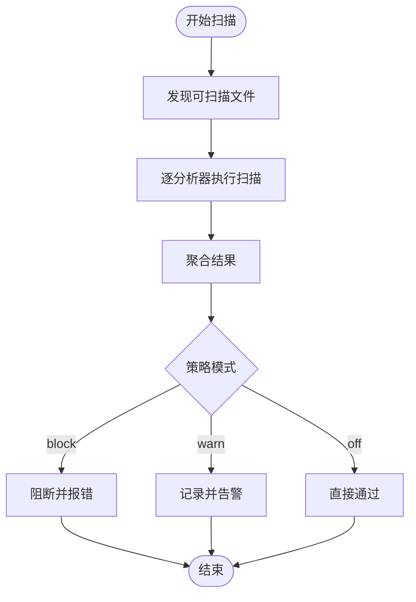
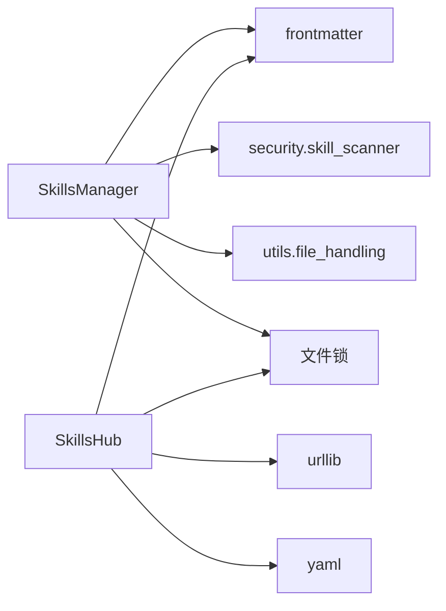

# 技能管理机制

<cite>
**本文档引用的文件**
- [skills_manager.py](file://src/copaw/agents/skills_manager.py)
- [skills_hub.py](file://src/copaw/agents/skills_hub.py)
- [skill.json](file://working/skill_pool/skill.json)
- [browser_cdp/SKILL.md](file://working/skill_pool/browser_cdp/SKILL.md)
- [browser_visible/SKILL.md](file://working/skill_pool/browser_visible/SKILL.md)
- [skill.json](file://working/workspaces/default/skill.json)
- [scanner.py](file://src/copaw/security/skill_scanner/scanner.py)
- [__init__.py](file://src/copaw/security/skill_scanner/__init__.py)
</cite>

## 目录
1. [简介](#简介)
2. [项目结构](#项目结构)
3. [核心组件](#核心组件)
4. [架构总览](#架构总览)
5. [详细组件分析](#详细组件分析)
6. [依赖关系分析](#依赖关系分析)
7. [性能考量](#性能考量)
8. [故障排除指南](#故障排除指南)
9. [结论](#结论)
10. [附录](#附录)

## 简介
本文件系统性阐述 CoPaw 的技能管理机制，重点覆盖以下方面：
- SkillsManager 如何扫描、加载、注册工作空间中的技能，包括技能发现算法、依赖解析、冲突处理
- SkillsHub 的技能存储结构，包括技能元数据、版本管理、渠道适配等
- 技能配置覆盖机制、环境变量注入、动态配置更新
- 技能注册流程、配置解析、执行上下文构建的具体示例
- 最佳实践与故障排除指南

## 项目结构
CoPaw 的技能管理围绕三个核心层次展开：
- 技能池（Skill Pool）：共享的技能仓库，存放内置与自定义技能，支持版本管理与冲突检测
- 工作区（Workspace）：每个 Agent 的独立工作空间，维护自身技能副本与运行时状态
- 技能中心（SkillsHub）：外部技能市场，提供技能检索、版本下载与安装能力



图表来源
- [skills_manager.py:124-169](file://src/copaw/agents/skills_manager.py#L124-L169)
- [skills_hub.py:190-220](file://src/copaw/agents/skills_hub.py#L190-L220)
- [skill.json:1-370](file://working/skill_pool/skill.json#L1-L370)

章节来源
- [skills_manager.py:124-169](file://src/copaw/agents/skills_manager.py#L124-L169)
- [skills_hub.py:190-220](file://src/copaw/agents/skills_hub.py#L190-L220)
- [skill.json:1-370](file://working/skill_pool/skill.json#L1-L370)

## 核心组件
- SkillsManager：负责技能的创建、导入、启用/禁用、重命名、删除、扫描与清单同步
- SkillsHub：负责从技能中心检索、下载与安装技能，支持 ZIP 解压、内容校验与冲突处理
- 安全扫描器：在技能导入/启用前进行安全扫描，支持阻断、告警与白名单策略
- 技能清单（skill.json）：技能元数据、版本、签名、来源、配置与标签等信息的持久化载体

章节来源
- [skills_manager.py:1447-1568](file://src/copaw/agents/skills_manager.py#L1447-L1568)
- [skills_hub.py:287-431](file://src/copaw/agents/skills_hub.py#L287-L431)
- [scanner.py:148-200](file://src/copaw/security/skill_scanner/scanner.py#L148-L200)

## 架构总览
技能管理的总体流程如下：
- 初始化：确保技能池与工作区清单存在，内置技能同步到技能池
- 发现与加载：扫描技能目录，解析 SKILL.md 前言元数据，构建技能信息对象
- 安全扫描：对导入/启用的技能执行安全扫描，根据策略决定阻断或放行
- 注册与注册：将技能写入工作区清单，建立启用状态与渠道路由
- 运行时注入：按需将技能配置注入环境变量，构建执行上下文



图表来源
- [skills_manager.py:1728-1818](file://src/copaw/agents/skills_manager.py#L1728-L1818)
- [skills_hub.py:287-431](file://src/copaw/agents/skills_hub.py#L287-L431)
- [scanner.py:148-200](file://src/copaw/security/skill_scanner/scanner.py#L148-L200)

## 详细组件分析

### SkillsManager：技能生命周期与清单管理
SkillsManager 提供两类服务：
- SkillService：工作区作用域的技能生命周期管理（创建、导入、启用/禁用、重命名、删除、文件读取）
- SkillPoolService：共享技能池的生命周期管理（创建、导入、删除、标签管理、池内编辑）

关键能力与流程：
- 技能发现与元数据构建：遍历技能目录，解析 SKILL.md 前言，提取名称、描述、版本、emoji、依赖等
- 冲突检测与重命名：基于签名与名称冲突生成建议名，避免覆盖
- 清单同步：原子写入 JSON，维护版本号与时间戳，支持工作区与技能池双向同步
- 安全扫描：在导入/启用前调用扫描器，阻断高危技能
- 渠道路由：按通道过滤启用的技能集合



图表来源
- [skills_manager.py:1447-1568](file://src/copaw/agents/skills_manager.py#L1447-L1568)
- [skills_manager.py:2003-2240](file://src/copaw/agents/skills_manager.py#L2003-L2240)
- [skills_manager.py:1020-1105](file://src/copaw/agents/skills_manager.py#L1020-L1105)

章节来源
- [skills_manager.py:1447-1568](file://src/copaw/agents/skills_manager.py#L1447-L1568)
- [skills_manager.py:2003-2240](file://src/copaw/agents/skills_manager.py#L2003-L2240)
- [skills_manager.py:1020-1105](file://src/copaw/agents/skills_manager.py#L1020-L1105)

### SkillsHub：技能中心集成与安装
SkillsHub 提供以下能力：
- 环境变量配置：支持超时、重试、退避、缓存 TTL、基础 URL 等参数
- 搜索与详情：支持多种 Hub API 路径，兼容 ClawHub 与 Skills.sh
- ZIP 下载与解压：限制最大条目数与字节数，校验路径安全性，提取文件树
- 内容归一化：将 Hub 返回的元数据与文件内容归一化为统一的技能包结构
- 错误处理：区分 Hub 错误与网络错误，提供可读的错误消息

```mermaid
flowchart TD
Start(["开始"]) --> BuildReq["构建请求<br/>URL + 头部 + 凭据"]
BuildReq --> Fetch["HTTP 请求<br/>GET/POST/JSON"]
Fetch --> Resp{"响应状态"}
Resp --> |成功| ReadBody["读取响应体<br/>字节流限制"]
Resp --> |429/5xx| Retry["指数退避重试"]
Retry --> Fetch
Resp --> |403(GitHub)| RateLimit["速率限制错误"]
ReadBody --> Parse["解析/归一化<br/>内容/文件树"]
Parse --> Install["写入技能池/工作区"]
Install --> End(["结束"])
```

图表来源
- [skills_hub.py:287-431](file://src/copaw/agents/skills_hub.py#L287-L431)
- [skills_hub.py:454-496](file://src/copaw/agents/skills_hub.py#L454-L496)
- [skills_hub.py:553-636](file://src/copaw/agents/skills_hub.py#L553-L636)

章节来源
- [skills_hub.py:287-431](file://src/copaw/agents/skills_hub.py#L287-L431)
- [skills_hub.py:454-496](file://src/copaw/agents/skills_hub.py#L454-L496)
- [skills_hub.py:553-636](file://src/copaw/agents/skills_hub.py#L553-L636)

### 技能清单与元数据模型
技能清单采用 JSON 结构，包含：
- schema_version：清单版本标识
- version：清单版本号（递增）
- skills：技能条目列表
- builtin_skill_names：内置技能名称集合（技能池）

每个技能条目包含：
- name：稳定运行时标识（目录名）
- description：技能描述
- version_text：版本文本
- commit_text：提交信息（可选）
- signature：内容签名（SHA256）
- source：来源（builtin/customized）
- protected：是否受保护
- requirements：依赖（bins/env）
- updated_at：最后更新时间
- config：运行时配置（可选）
- tags：用户标签（可选）



图表来源
- [skill.json:1-370](file://working/skill_pool/skill.json#L1-L370)

章节来源
- [skill.json:1-370](file://working/skill_pool/skill.json#L1-L370)
- [skills_manager.py:64-81](file://src/copaw/agents/skills_manager.py#L64-L81)

### 技能配置覆盖与环境变量注入
配置注入机制：
- 配置来源优先级：宿主环境变量（不可覆盖）> 工作区配置 > 池配置
- 注入规则：与 SKILL.md 中 metadata.requires.env 匹配的键注入为环境变量，未匹配的仅通过 COPAW_SKILL_CONFIG_<SKILL_NAME> JSON 变量提供
- 生命周期：在一次 Agent 运行期间注入，结束后释放



图表来源
- [skills_manager.py:666-711](file://src/copaw/agents/skills_manager.py#L666-L711)
- [skills_manager.py:583-624](file://src/copaw/agents/skills_manager.py#L583-L624)

章节来源
- [skills_manager.py:666-711](file://src/copaw/agents/skills_manager.py#L666-L711)
- [skills_manager.py:583-624](file://src/copaw/agents/skills_manager.py#L583-L624)

### 技能扫描与安全策略
扫描器能力：
- 文件发现与过滤：跳过二进制与归档文件，限制文件数量与大小
- 分析器组合：默认使用 PatternAnalyzer，支持自定义扩展
- 缓存与超时：基于 mtime 的智能缓存，可配置超时
- 模式控制：block/warn/off 三种模式，支持环境变量覆盖



图表来源
- [scanner.py:148-200](file://src/copaw/security/skill_scanner/scanner.py#L148-L200)
- [__init__.py:85-93](file://src/copaw/security/skill_scanner/__init__.py#L85-L93)

章节来源
- [scanner.py:148-200](file://src/copaw/security/skill_scanner/scanner.py#L148-L200)
- [__init__.py:85-93](file://src/copaw/security/skill_scanner/__init__.py#L85-L93)

## 依赖关系分析
- SkillsManager 依赖：
  - frontmatter：解析 SKILL.md 前言
  - security.skill_scanner：技能安全扫描
  - utils.file_handling：文件编码回退读取
- SkillsHub 依赖：
  - urllib：HTTP 请求与响应读取
  - frontmatter/yaml：Hub 元数据解析
  - contextlib/contextvars：取消检查与上下文管理
- 清单与锁：
  - 文件写入加锁（fcntl/msvcrt）保证并发安全
  - 原子写入（临时文件替换）避免损坏



图表来源
- [skills_manager.py:23-28](file://src/copaw/agents/skills_manager.py#L23-L28)
- [skills_hub.py:22-24](file://src/copaw/agents/skills_hub.py#L22-L24)

章节来源
- [skills_manager.py:23-28](file://src/copaw/agents/skills_manager.py#L23-L28)
- [skills_hub.py:22-24](file://src/copaw/agents/skills_hub.py#L22-L24)

## 性能考量
- 清单写入：使用临时文件+原子替换，避免部分写入导致的损坏
- 并发安全：文件锁保障多进程/多线程写入一致性
- 缓存：技能扫描结果按 mtime 缓存，避免重复扫描
- I/O 限制：ZIP 解压与 HTTP 响应体大小限制，防止资源滥用
- 签名计算：仅对必要文件计算哈希，忽略系统无关文件（缓存、隐藏文件等）

## 故障排除指南
常见问题与处理：
- 技能导入冲突
  - 现象：目标名称已存在或与内置同名
  - 处理：使用建议的新名称重试，或开启覆盖模式
  - 参考：[冲突建议函数:748-769](file://src/copaw/agents/skills_manager.py#L748-L769)
- ZIP 安全性错误
  - 现象：包含危险路径或符号链接
  - 处理：检查 ZIP 结构，确保路径相对且无符号链接
  - 参考：[ZIP 校验:452-473](file://src/copaw/agents/skills_manager.py#L452-L473)
- 环境变量注入失败
  - 现象：同名键已被宿主占用或注入冲突
  - 处理：修改宿主环境或调整技能配置键名
  - 参考：[注入与释放:627-711](file://src/copaw/agents/skills_manager.py#L627-L711)
- Hub 请求失败
  - 现象：429/5xx 或 GitHub 速率限制
  - 处理：设置 GITHUB_TOKEN，增加重试次数与超时
  - 参考：[HTTP 重试与错误处理:312-399](file://src/copaw/agents/skills_hub.py#L312-L399)
- 清单损坏
  - 现象：JSON 解析失败
  - 处理：备份后重置为默认模板
  - 参考：[JSON 读取与重置:337-350](file://src/copaw/agents/skills_manager.py#L337-L350)

章节来源
- [skills_manager.py:748-769](file://src/copaw/agents/skills_manager.py#L748-L769)
- [skills_manager.py:452-473](file://src/copaw/agents/skills_manager.py#L452-L473)
- [skills_manager.py:627-711](file://src/copaw/agents/skills_manager.py#L627-L711)
- [skills_hub.py:312-399](file://src/copaw/agents/skills_hub.py#L312-L399)
- [skills_manager.py:337-350](file://src/copaw/agents/skills_manager.py#L337-L350)

## 结论
CoPaw 的技能管理机制通过“技能池 + 工作区 + 技能中心”的分层设计，实现了：
- 可复用、可追踪的技能版本与签名管理
- 安全可控的技能导入与启用流程
- 灵活的配置注入与运行时上下文构建
- 高可靠性的清单与文件写入机制

建议在生产环境中：
- 启用安全扫描并合理配置策略
- 使用池与工作区分离，避免直接修改池内内置技能
- 通过环境变量与配置注入实现最小权限与可追溯性
- 定期同步内置技能，保持版本一致性

## 附录

### 技能示例与元数据
- browser_cdp：内置技能，强调 CDP 模式的隐私风险与单实例限制
- browser_visible：内置技能，强调可见浏览器与演示场景

章节来源
- [browser_cdp/SKILL.md:1-182](file://working/skill_pool/browser_cdp/SKILL.md#L1-L182)
- [browser_visible/SKILL.md:1-49](file://working/skill_pool/browser_visible/SKILL.md#L1-L49)

### 工作区与技能池示例
- 技能池清单：包含大量内置技能条目与版本信息
- 工作区清单：空清单（默认工作区），待技能导入后填充

章节来源
- [skill.json:1-370](file://working/skill_pool/skill.json#L1-L370)
- [skill.json:1-5](file://working/workspaces/default/skill.json#L1-L5)