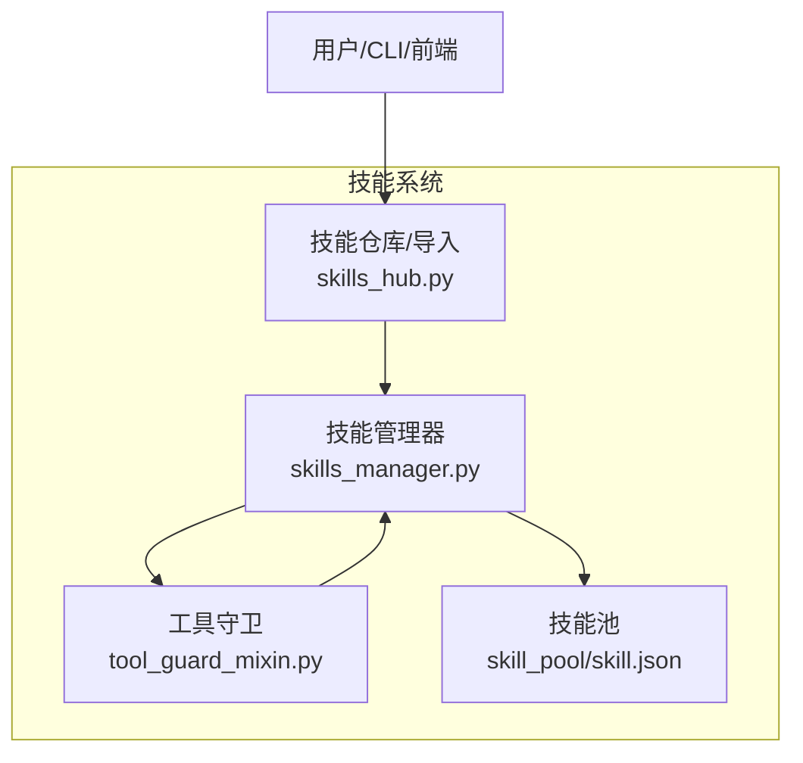
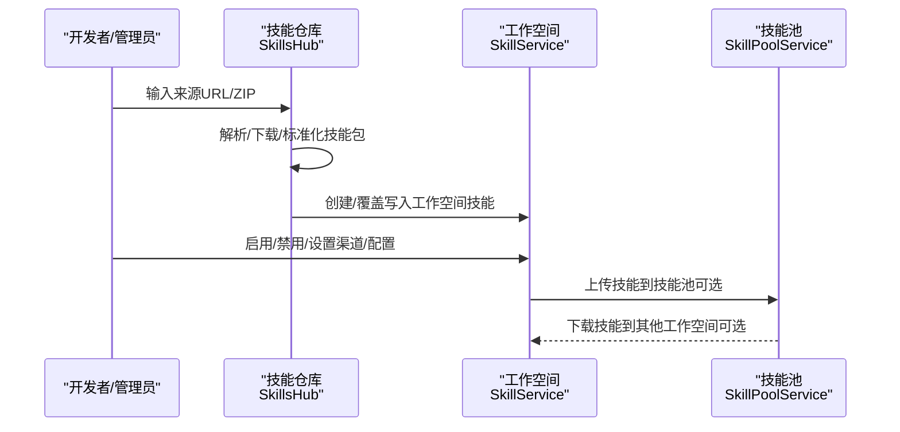
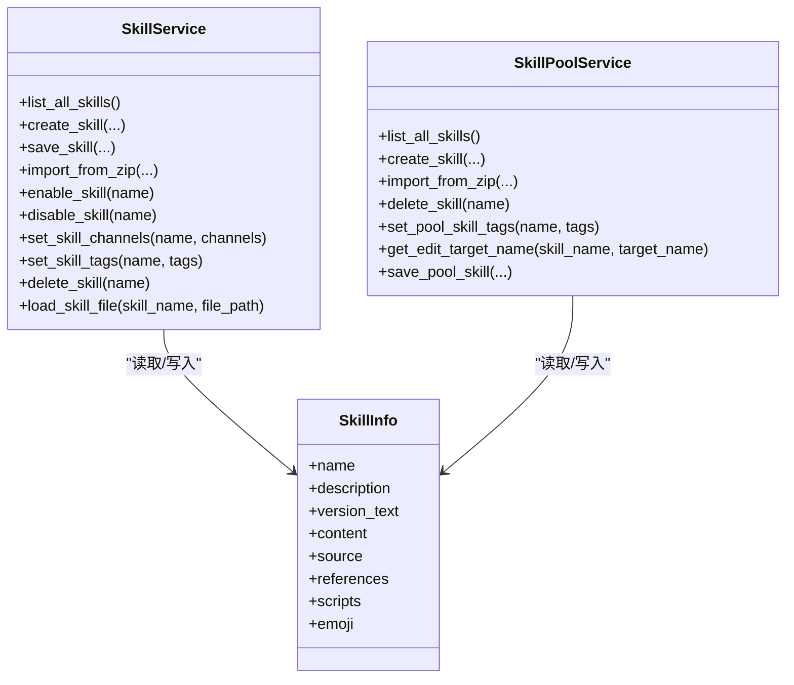
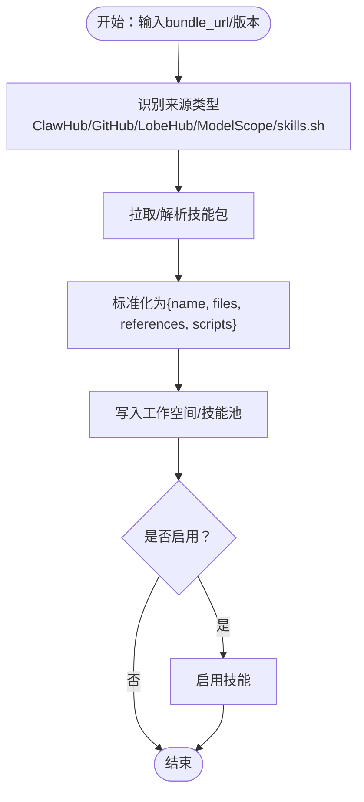
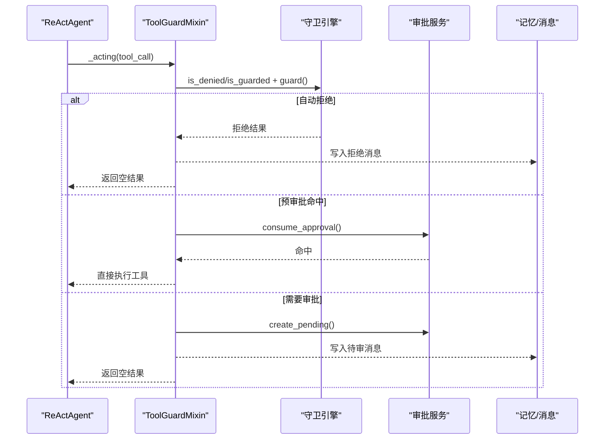
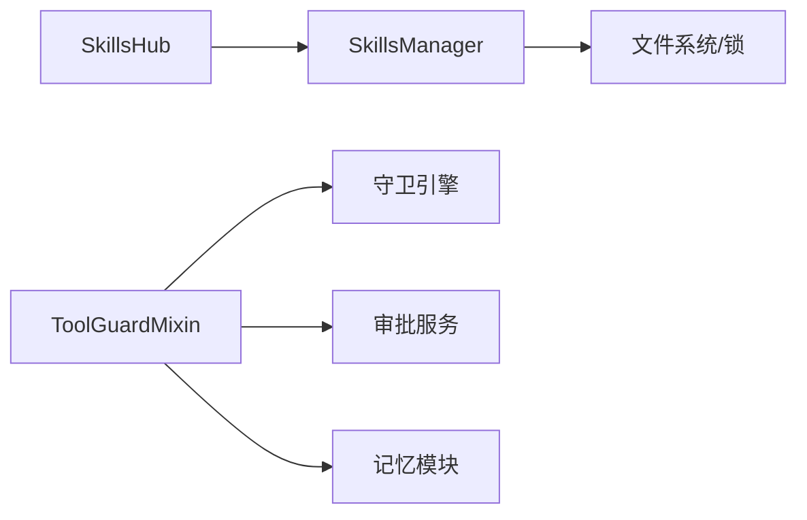

# 技能系统设计

<cite>
**本文引用的文件**
- [skills_manager.py](file://src/copaw/agents/skills_manager.py)
- [skills_hub.py](file://src/copaw/agents/skills_hub.py)
- [tool_guard_mixin.py](file://src/copaw/agents/tool_guard_mixin.py)
- [skill.json](file://working/skill_pool/skill.json)
</cite>

## 目录
1. [简介](#简介)
2. [项目结构](#项目结构)
3. [核心组件](#核心组件)
4. [架构总览](#架构总览)
5. [详细组件分析](#详细组件分析)
6. [依赖分析](#依赖分析)
7. [性能考虑](#性能考虑)
8. [故障排查指南](#故障排查指南)
9. [结论](#结论)
10. [附录](#附录)

## 简介
本文件面向 CoPaw 技能系统的设计与实现，重点阐述以下内容：
- 技能管理器（SkillsManager）如何动态加载与管理技能，涵盖技能发现、注册、启用/禁用、渠道路由、配置注入、版本与签名校验等核心流程。
- 技能池（SkillsHub）的组织结构与来源分类：内置技能、用户自定义技能、第三方来源（ClawHub、GitHub、LobeHub、ModelScope、skills.sh 等）的统一导入与同步策略。
- 工具守卫（ToolGuardMixin）的安全机制：危险工具拦截、预审批、守护规则评估、审计与拒绝记录、复盘重放等闭环流程。
- 提供技能开发者指南：技能模板、最佳实践、测试方法与安全扫描要点。

## 项目结构
技能系统由三部分协同构成：
- 技能管理与生命周期：位于 agents/skills_manager.py，负责工作空间与技能池的技能创建、导入、启用、禁用、渠道与配置管理、签名与版本一致性校验。
- 技能仓库与导入：位于 agents/skills_hub.py，负责从多种外部来源解析与下载技能包，标准化为内部技能结构并写入工作空间或技能池。
- 工具安全守卫：位于 agents/tool_guard_mixin.py，拦截敏感工具调用，执行规则评估与预审批，记录审计并支持复盘重放。

图表来源
- [skills_manager.py](file://src/copaw/agents/skills_manager.py)
- [skills_hub.py](file://src/copaw/agents/skills_hub.py)
- [tool_guard_mixin.py](file://src/copaw/agents/tool_guard_mixin.py)
- [skill.json](file://working/skill_pool/skill.json)

章节来源
- [skills_manager.py](file://src/copaw/agents/skills_manager.py)
- [skills_hub.py](file://src/copaw/agents/skills_hub.py)
- [tool_guard_mixin.py](file://src/copaw/agents/tool_guard_mixin.py)
- [skill.json](file://working/skill_pool/skill.json)

## 核心组件
- 技能服务（SkillService）
  - 负责工作空间内的技能生命周期：创建、编辑、导入 ZIP、启用/禁用、渠道设置、标签设置、删除、文件读取等。
  - 通过工作空间目录下的 skill.json 维护运行态状态（enabled、channels、config、requirements 等），并通过 SKILL.md 与目录树构建元数据。
- 技能池服务（SkillPoolService）
  - 负责共享技能池的技能创建、导入 ZIP、与内置技能同步、上传/下载至工作空间、标签维护等。
  - 通过技能池 skill.json 记录技能来源（builtin/customized）、签名、更新时间等。
- 技能仓库（SkillsHub）
  - 支持从 ClawHub、GitHub、LobeHub、ModelScope、skills.sh 等来源解析技能包，标准化为内部结构并写入目标位置。
  - 内置重试、超时、速率限制处理、取消检查、大小与条目限制等鲁棒性保障。
- 工具守卫（ToolGuardMixin）
  - 在 ReActAgent 的 _acting/_reasoning 生命周期中插入拦截点，对敏感工具进行规则评估与预审批。
  - 支持“自动拒绝”、“预审批”、“进入审批队列”三种处置路径，并提供复盘重放能力。

章节来源
- [skills_manager.py](file://src/copaw/agents/skills_manager.py)
- [skills_hub.py](file://src/copaw/agents/skills_hub.py)
- [tool_guard_mixin.py](file://src/copaw/agents/tool_guard_mixin.py)

## 架构总览
技能系统采用“工作空间 + 共享技能池”的双层结构：
- 工作空间：用户可编辑的技能集合，受渠道与配置约束，运行时生效。
- 技能池：内置技能与用户共享技能的中转站，用于冲突检测、版本同步与跨工作空间分发。

图表来源
- [skills_hub.py](file://src/copaw/agents/skills_hub.py)
- [skills_manager.py](file://src/copaw/agents/skills_manager.py)

## 详细组件分析

### 技能管理器（SkillsManager）与服务
- 角色与职责
  - SkillService：工作空间级技能管理，维护 enabled/channels/config/tags 等运行态状态。
  - SkillPoolService：技能池级管理，负责内置技能同步、导入导出、跨工作空间分发。
  - 共同依赖：签名计算（基于目录树与文件内容）、frontmatter 解析、安全扫描、manifest 原子写入与并发锁。
- 关键流程
  - 技能创建/编辑：校验 SKILL.md 前言字段，写入目录树，扫描安全，原子更新 manifest。
  - 导入 ZIP：解压校验（大小、条目数、路径合法性、符号链接禁止），批量冲突检测，按需重命名。
  - 启用/禁用/渠道设置：通过原子变更确保并发安全。
  - 版本与签名：内置技能签名缓存，用于“是否需要更新”的判断；自定义技能不强制签名。
- 数据模型
  - 技能元数据：name、description、version_text、commit_text、signature、source、protected、requirements、updated_at。
  - 运行态：enabled、channels、config、requirements、tags、metadata。

图表来源
- [skills_manager.py](file://src/copaw/agents/skills_manager.py)

章节来源
- [skills_manager.py](file://src/copaw/agents/skills_manager.py)

### 技能池（SkillsHub）与多来源导入
- 多来源解析
  - ClawHub：slug 解析、版本选择、文件拉取、标准化为内部包。
  - GitHub：支持仓库/分支/路径提示，自动发现 SKILL.md 根，批量收集文件。
  - LobeHub：下载 zip 并过滤非文本文件，提取 SKILL.md 与参考/脚本树。
  - ModelScope：解析技能详情，回溯原始来源（GitHub/ClawHub）或回退 README。
  - skills.sh：解析 slug，定位 owner/repo/skill，回退到 GitHub。
- 标准化与写入
  - 将不同来源的“包”统一为 name、files、references、scripts 结构，再写入工作空间或技能池。
  - 支持目标名称规范化与冲突建议，支持覆盖策略与启用策略。
- 配置与环境
  - 支持 COPAW_GITHUB_CACHE_TTL、COPAW_SKILLS_HUB_HTTP_TIMEOUT、COPAW_SKILLS_HUB_HTTP_RETRIES、COPAW_SKILLS_HUB_HTTP_BACKOFF_BASE/CAP 等环境变量控制网络行为。

图表来源
- [skills_hub.py](file://src/copaw/agents/skills_hub.py)

章节来源
- [skills_hub.py](file://src/copaw/agents/skills_hub.py)

### 工具守卫（ToolGuardMixin）安全机制
- 拦截点
  - 在 _acting 中对工具调用进行前置拦截：deny 列表直接拒绝、guarded 范围内先尝试预审批，再运行守护规则；非 guarded 工具仅运行 always-run 守护。
- 审批与记录
  - 若存在审批需求，记录 pending 并向用户提示 /approve 或任意消息拒绝；支持保留思考块与后续重放。
- 复盘与重放
  - 审批完成后清理拒绝消息，按队列顺序重放剩余工具调用，保持对话历史整洁。
- 线程安全
  - 决策过程在互斥锁内串行，实际执行在锁外并行，避免 race 条件同时保证吞吐。

图表来源
- [tool_guard_mixin.py](file://src/copaw/agents/tool_guard_mixin.py)

章节来源
- [tool_guard_mixin.py](file://src/copaw/agents/tool_guard_mixin.py)

## 依赖分析
- 组件耦合
  - SkillsHub 依赖 SkillsManager 的 SkillService/SkillPoolService 进行最终落盘与状态更新。
  - ToolGuardMixin 依赖守卫引擎与审批服务，与 Agent 的记忆模块交互。
- 外部依赖
  - GitHub API（速率限制、默认分支、树遍历）、ClawHub/LobeHub/ModelScope 等外部接口。
  - 文件系统与并发锁（fcntl/msvcrt）用于 manifest 原子写入。
- 循环依赖
  - 未见循环依赖迹象；各模块职责清晰，通过服务类解耦。

图表来源
- [skills_hub.py](file://src/copaw/agents/skills_hub.py)
- [skills_manager.py](file://src/copaw/agents/skills_manager.py)
- [tool_guard_mixin.py](file://src/copaw/agents/tool_guard_mixin.py)

章节来源
- [skills_hub.py](file://src/copaw/agents/skills_hub.py)
- [skills_manager.py](file://src/copaw/agents/skills_manager.py)
- [tool_guard_mixin.py](file://src/copaw/agents/tool_guard_mixin.py)

## 性能考虑
- I/O 与并发
  - manifest 原子写入通过临时文件与替换实现，避免部分写入；文件锁在高并发下可能成为瓶颈，建议合理批处理变更。
  - ZIP 解压与文件树扫描采用分块读取与白名单过滤，避免大包内存压力。
- 网络与重试
  - SkillsHub 对 HTTP 错误码进行指数退避重试，结合超时与 TTL 缓存降低外部依赖抖动。
- 安全扫描
  - 导入前后均执行安全扫描，失败即中止，避免潜在风险进入运行态。

## 故障排查指南
- 技能导入冲突
  - 现象：返回冲突详情与建议重命名。
  - 处理：根据建议重命名或开启覆盖导入。
  - 参考路径：[冲突建议与返回结构](file://src/copaw/agents/skills_manager.py)
- ZIP 包异常
  - 现象：大小超限、条目过多、路径越界、包含符号链接。
  - 处理：修正压缩包结构或拆分技能。
  - 参考路径：[ZIP 校验与解压](file://src/copaw/agents/skills_manager.py)
- GitHub 速率限制
  - 现象：403 rate limit。
  - 处理：设置 GITHUB_TOKEN 提升配额。
  - 参考路径：[HTTP 错误处理与提示](file://src/copaw/agents/skills_hub.py)
- 工具被拦截
  - 现象：出现“工具已拦截/风险已检测”消息。
  - 处理：查看守护规则与严重级别，必要时走审批流程或调整规则。
  - 参考路径：[拦截与审批流程](file://src/copaw/agents/tool_guard_mixin.py)

章节来源
- [skills_manager.py](file://src/copaw/agents/skills_manager.py)
- [skills_hub.py](file://src/copaw/agents/skills_hub.py)
- [tool_guard_mixin.py](file://src/copaw/agents/tool_guard_mixin.py)

## 结论
CoPaw 技能系统通过“工作空间 + 技能池”的双层结构实现了技能的可发现、可导入、可管理与可复用；借助 SkillsHub 的多来源统一导入与 SkillsManager 的强一致 manifest 管理，确保了技能在不同环境间的一致性与安全性。工具守卫在关键执行点提供了可控的风险拦截与审批闭环，既保护了系统安全，又维持了灵活性。整体设计兼顾易用性、可扩展性与安全性。

## 附录

### 技能开发者指南
- 技能模板与规范
  - 必备文件：SKILL.md（包含 name、description 等前言字段）。
  - 可选目录：references/scripts，用于存放引用资源与辅助脚本。
  - 参考路径：[技能内容校验与写入](file://src/copaw/agents/skills_manager.py)
- 最佳实践
  - 使用 frontmatter 统一声明 name/description/version/metadata（如 copaw.emoji、requires）。
  - 保持 references/scripts 目录结构清晰，避免隐藏文件与缓存目录污染。
  - 导入前先扫描，确保符合企业安全策略。
  - 参考路径：[安全扫描调用](file://src/copaw/agents/skills_manager.py)
- 测试方法
  - 单元测试：验证导入、启用、禁用、渠道设置、配置注入、签名一致性等。
  - 集成测试：模拟多工作空间、跨工作空间同步、冲突处理、网络异常与速率限制。
  - 安全测试：构造恶意 ZIP、越界路径、符号链接等边界条件。
  - 参考路径：[安全扫描与校验](file://src/copaw/agents/skills_manager.py)

### 技能池组织结构说明
- 内置技能（builtin）
  - 来源于打包的内置技能目录，通过签名比对决定“已同步/需更新”。
  - 参考路径：[内置技能签名与同步状态](file://working/skill_pool/skill.json)
- 用户自定义技能（customized）
  - 用户在工作空间或技能池中创建/导入的技能，不受内置签名约束。
- 第三方技能
  - 通过 SkillsHub 从外部来源导入，统一写入后归类为 customized。

章节来源
- [skills_manager.py](file://src/copaw/agents/skills_manager.py)
- [skill.json](file://working/skill_pool/skill.json)