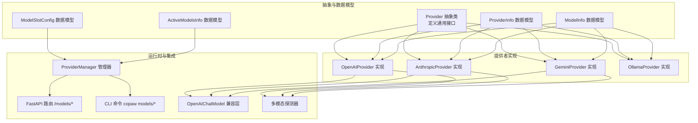
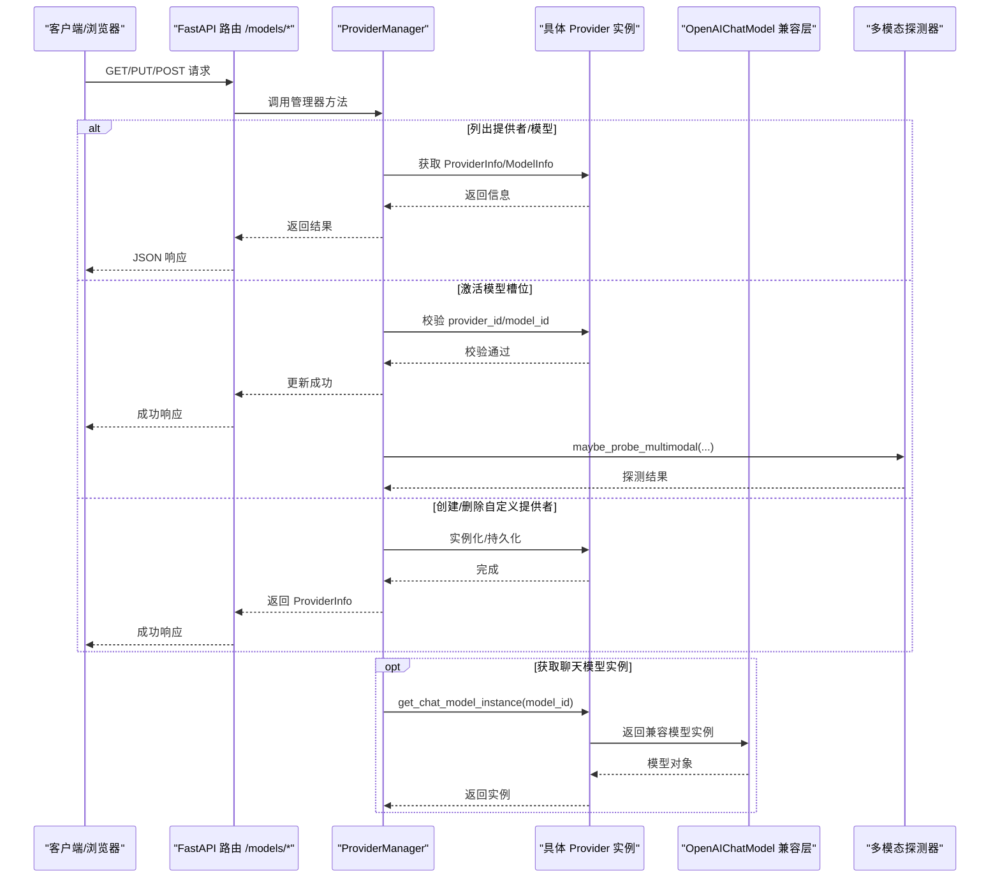
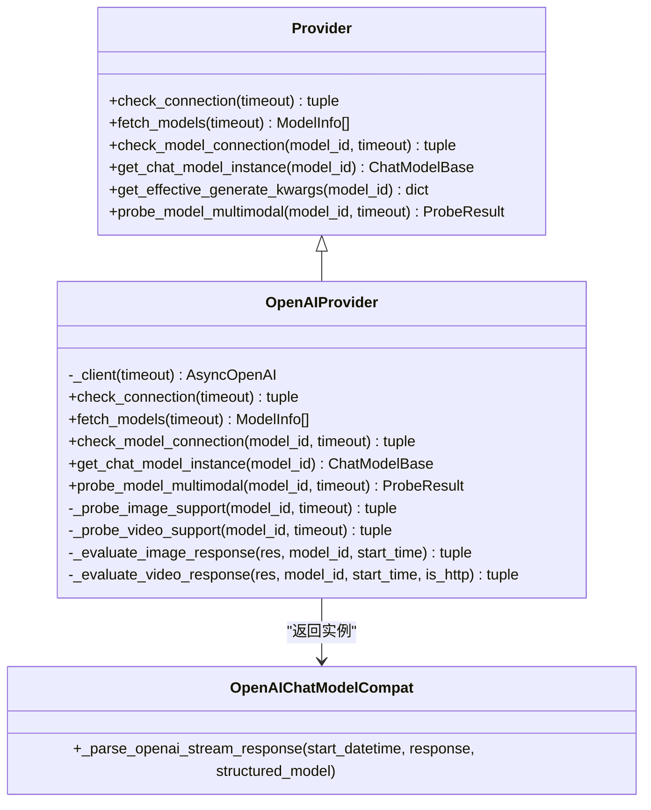
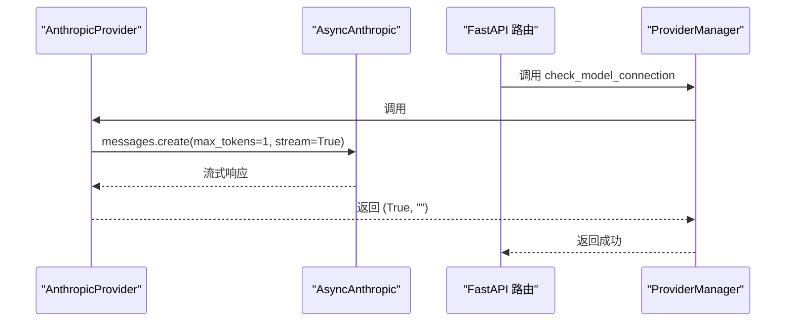
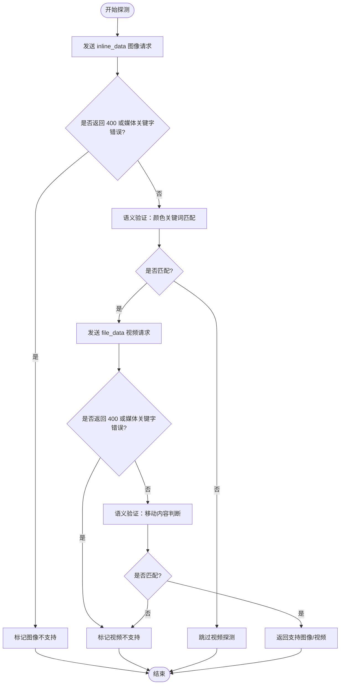
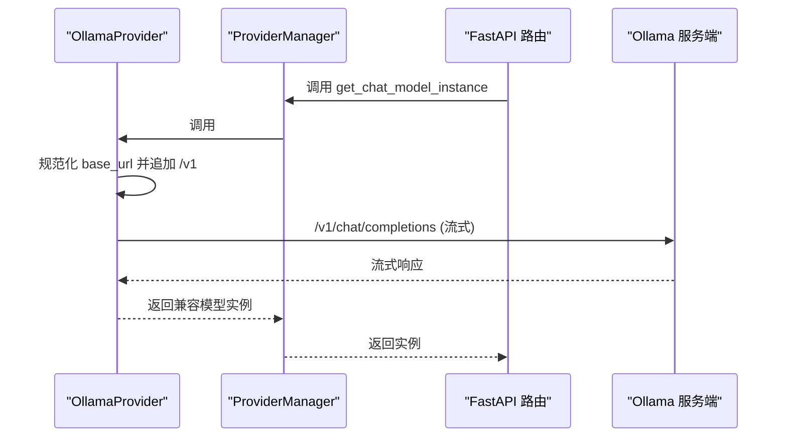
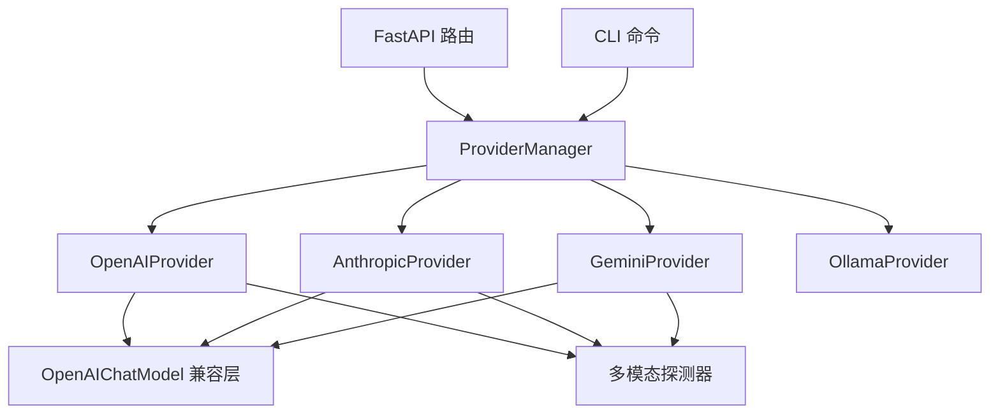

# 提供者实现详解

<cite>
**本文档引用的文件**
- [provider.py](file://src/copaw/providers/provider.py)
- [models.py](file://src/copaw/providers/models.py)
- [provider_manager.py](file://src/copaw/providers/provider_manager.py)
- [openai_provider.py](file://src/copaw/providers/openai_provider.py)
- [anthropic_provider.py](file://src/copaw/providers/anthropic_provider.py)
- [gemini_provider.py](file://src/copaw/providers/gemini_provider.py)
- [ollama_provider.py](file://src/copaw/providers/ollama_provider.py)
- [multimodal_prober.py](file://src/copaw/providers/multimodal_prober.py)
- [openai_chat_model_compat.py](file://src/copaw/providers/openai_chat_model_compat.py)
- [providers.py](file://src/copaw/app/routers/providers.py)
- [providers_cmd.py](file://src/copaw/cli/providers_cmd.py)
- [test_openai_provider.py](file://tests/unit/providers/test_openai_provider.py)
- [test_anthropic_provider.py](file://tests/unit/providers/test_anthropic_provider.py)
- [test_gemini_provider.py](file://tests/unit/providers/test_gemini_provider.py)
- [test_ollama_provider.py](file://tests/unit/providers/test_ollama_provider.py)
</cite>

## 目录
1. [简介](#简介)
2. [项目结构](#项目结构)
3. [核心组件](#核心组件)
4. [架构总览](#架构总览)
5. [详细组件分析](#详细组件分析)
6. [依赖关系分析](#依赖关系分析)
7. [性能考虑](#性能考虑)
8. [故障排除指南](#故障排除指南)
9. [结论](#结论)

## 简介
本文件面向 CoPaw 的 AI 模型提供者实现，系统性阐述 OpenAI、Anthropic、Gemini、Ollama 等提供者的具体实现细节与最佳实践。内容涵盖 API 集成方式、认证机制、请求格式、响应解析、流式响应处理、多模态支持、参数优化、配置管理、API 限制与成本控制策略，并深入解析 ModelSlotConfig 与 ModelInfo 数据结构的设计与使用。

## 项目结构
CoPaw 的提供者体系由统一抽象基类、具体提供者实现、管理器、以及与应用层（FastAPI 路由）和命令行工具的集成组成。核心文件组织如下：
- 抽象与数据模型：provider.py、models.py
- 提供者实现：openai_provider.py、anthropic_provider.py、gemini_provider.py、ollama_provider.py
- 多模态探测：multimodal_prober.py
- 流式兼容层：openai_chat_model_compat.py
- 应用集成：app/routers/providers.py
- 命令行：cli/providers_cmd.py
- 单元测试：tests/unit/providers/*.py

图表来源
- [provider.py:111-314](file://src/copaw/providers/provider.py#L111-L314)
- [models.py:9-16](file://src/copaw/providers/models.py#L9-L16)
- [openai_provider.py:25-550](file://src/copaw/providers/openai_provider.py#L25-L550)
- [anthropic_provider.py:27-256](file://src/copaw/providers/anthropic_provider.py#L27-L256)
- [gemini_provider.py:27-332](file://src/copaw/providers/gemini_provider.py#L27-L332)
- [ollama_provider.py:16-86](file://src/copaw/providers/ollama_provider.py#L16-L86)
- [provider_manager.py:670-800](file://src/copaw/providers/provider_manager.py#L670-L800)
- [openai_chat_model_compat.py:191-313](file://src/copaw/providers/openai_chat_model_compat.py#L191-L313)
- [multimodal_prober.py:75-102](file://src/copaw/providers/multimodal_prober.py#L75-L102)
- [providers.py:35-632](file://src/copaw/app/routers/providers.py#L35-L632)
- [providers_cmd.py:78-812](file://src/copaw/cli/providers_cmd.py#L78-L812)

章节来源
- [provider.py:17-314](file://src/copaw/providers/provider.py#L17-L314)
- [models.py:9-16](file://src/copaw/providers/models.py#L9-L16)
- [provider_manager.py:666-800](file://src/copaw/providers/provider_manager.py#L666-L800)

## 核心组件
本节聚焦提供者抽象、数据模型与管理器的关键职责与交互。

- Provider 抽象类
  - 定义统一接口：检查连接、拉取模型列表、检查单个模型连通性、添加/删除模型、更新配置、获取聊天模型实例、多模态探测、合并生成参数等。
  - 提供深度合并逻辑以支持 provider 级别与 model 级别的生成参数叠加。
- ProviderInfo/ModelInfo
  - ProviderInfo 描述提供者基本信息、URL、密钥、聊天模型类型、支持能力开关、额外元数据等。
  - ModelInfo 描述模型标识、名称、多模态支持状态、探测来源、每模型生成参数覆盖等。
- ModelSlotConfig/ActiveModelsInfo
  - ModelSlotConfig 表示“当前激活的模型槽位”，包含 provider_id 与 model 字段。
  - ActiveModelsInfo 封装全局或代理特定的激活模型配置。
- ProviderManager
  - 统一管理内置与自定义提供者，持久化存储，加载迁移，动态发现模型，激活模型槽位，执行多模态探测等。

章节来源
- [provider.py:17-314](file://src/copaw/providers/provider.py#L17-L314)
- [models.py:9-16](file://src/copaw/providers/models.py#L9-L16)
- [provider_manager.py:666-800](file://src/copaw/providers/provider_manager.py#L666-L800)

## 架构总览
下图展示从应用路由到提供者实现的完整调用链路，以及与多模态探测、流式兼容层的协作关系。

图表来源
- [providers.py:148-632](file://src/copaw/app/routers/providers.py#L148-L632)
- [provider_manager.py:666-800](file://src/copaw/providers/provider_manager.py#L666-L800)
- [openai_chat_model_compat.py:191-313](file://src/copaw/providers/openai_chat_model_compat.py#L191-L313)
- [multimodal_prober.py:75-102](file://src/copaw/providers/multimodal_prober.py#L75-L102)

## 详细组件分析

### OpenAI 提供者实现
OpenAI 提供者通过 OpenAI 官方 SDK 进行集成，支持标准的 models.list 与 chat.completions 接口；同时针对 DashScope 兼容端点进行特殊头部注入。

- 认证与连接
  - 使用 base_url 与 api_key 初始化异步客户端，支持超时控制。
  - check_connection 通过 models.list 验证连通性；check_model_connection 发送最小文本请求并消费流以验证可用性。
- 模型发现与规范化
  - fetch_models 调用 models.list 并规范化返回数据，去重与清洗无效条目。
- 多模态探测
  - probe_model_multimodal 分别探测图像与视频支持，采用两阶段验证：拒绝错误判定 + 语义验证（颜色关键词匹配）。
  - 图像探测使用 32x32 PNG，视频探测支持 base64 内联与 HTTP URL 两种格式。
- 流式响应与工具调用解析
  - get_chat_model_instance 返回 OpenAIChatModelCompat，内部对流式分块进行工具调用清理与修复，确保多模态思考模型的 extra_content 正确传递。
- 参数合并
  - get_effective_generate_kwargs 对 provider 级与 model 级 generate_kwargs 进行深度合并，保证覆盖优先级。

图表来源
- [openai_provider.py:25-550](file://src/copaw/providers/openai_provider.py#L25-L550)
- [openai_chat_model_compat.py:191-313](file://src/copaw/providers/openai_chat_model_compat.py#L191-L313)

章节来源
- [openai_provider.py:25-550](file://src/copaw/providers/openai_provider.py#L25-L550)
- [openai_chat_model_compat.py:191-313](file://src/copaw/providers/openai_chat_model_compat.py#L191-L313)
- [test_openai_provider.py:21-269](file://tests/unit/providers/test_openai_provider.py#L21-L269)

### Anthropic 提供者实现
Anthropic 提供者基于官方 AsyncAnthropic SDK，支持 models.list 与 messages.create 接口；由于 Anthropic 不支持视频输入，探测逻辑仅针对图像。

- 认证与连接
  - check_connection 通过 models.list；check_model_connection 使用 messages.create 并消费流验证。
- 模型发现与规范化
  - fetch_models 支持字典与对象两种 payload 形态，统一提取 id 与 display_name。
- 多模态探测
  - probe_model_multimodal 仅探测图像，使用 base64 PNG 与消息 API；视频始终标记为不支持。
- 流式响应
  - get_chat_model_instance 返回 AnthropicChatModel，保持与 OpenAI 兼容层类似的流式处理思路。

图表来源
- [anthropic_provider.py:27-256](file://src/copaw/providers/anthropic_provider.py#L27-L256)
- [providers.py:343-369](file://src/copaw/app/routers/providers.py#L343-L369)

章节来源
- [anthropic_provider.py:27-256](file://src/copaw/providers/anthropic_provider.py#L27-L256)
- [test_anthropic_provider.py:10-189](file://tests/unit/providers/test_anthropic_provider.py#L10-L189)

### Gemini 提供者实现
Gemini 提供者使用 Google GenAI SDK，支持异步 models.list 与 generate_content_stream 接口；支持 inline_data 与 file_data 两种多模态输入方式。

- 认证与连接
  - check_connection 使用异步 models.list；check_model_connection 使用 generate_content_stream 验证。
- 模型发现与规范化
  - fetch_models 异步遍历 models.list，剥离 "models/" 前缀并去重。
- 多模态探测
  - probe_model_multimodal 同时探测图像与视频：图像使用 inline_data PNG，视频使用 file_data MP4 URL；对回答进行关键词匹配判断。
- 流式响应
  - get_chat_model_instance 返回 GeminiChatModel，直接透传生成参数。

图表来源
- [gemini_provider.py:142-332](file://src/copaw/providers/gemini_provider.py#L142-L332)
- [multimodal_prober.py:75-102](file://src/copaw/providers/multimodal_prober.py#L75-L102)

章节来源
- [gemini_provider.py:27-332](file://src/copaw/providers/gemini_provider.py#L27-L332)
- [test_gemini_provider.py:12-341](file://tests/unit/providers/test_gemini_provider.py#L12-L341)

### Ollama 提供者实现
Ollama 提供者通过 OpenAI 兼容端点对接本地 LLM，自动规范化 base_url 并强制追加 /v1 后缀。

- 认证与连接
  - 作为本地提供者，通常无需 API 密钥；连接检查通过 /v1/models 列表验证。
- 模型发现与管理
  - 不支持手动添加/删除模型，需通过 Ollama CLI 管理；fetch_models 由 Ollama 服务端提供。
- 多模态探测
  - 继承 OpenAIProvider 的探测逻辑，但 Ollama 服务器端决定实际支持情况。
- 流式响应
  - get_chat_model_instance 返回 OpenAIChatModelCompat，使用 /v1 兼容端点。

图表来源
- [ollama_provider.py:16-86](file://src/copaw/providers/ollama_provider.py#L16-L86)
- [openai_provider.py:25-550](file://src/copaw/providers/openai_provider.py#L25-L550)

章节来源
- [ollama_provider.py:16-86](file://src/copaw/providers/ollama_provider.py#L16-L86)
- [test_ollama_provider.py:9-141](file://tests/unit/providers/test_ollama_provider.py#L9-L141)

### 多模态探测器
多模态探测器提供统一的探测常量与结果结构，支持不同提供者共享探测逻辑。

- 探测常量
  - 固定的 32x32 红色 PNG（避免小尺寸被拒绝）、64x64 蓝色 MP4（用于视频探测）、HTTP 视频 URL。
- 结果结构
  - ProbeResult 包含 supports_image/supports_video/supports_multimodal 及详细消息字段。
- 关键函数
  - _is_media_keyword_error：根据异常消息关键词判断是否为媒体相关错误。

章节来源
- [multimodal_prober.py:13-102](file://src/copaw/providers/multimodal_prober.py#L13-L102)

### 流式兼容层（OpenAIChatModel 兼容）
该层对 OpenAI 流式响应进行健壮性增强，解决工具调用解析与多模态思考模型的 extra_content 传递问题。

- 工具调用清理
  - 对流式分块中的 tool_calls 进行标准化与过滤，避免因格式不规范导致解析失败。
- extra_content 传递
  - 从工具调用中提取 extra_content（如 Gemini 思考模型的 thought_signature），并附加到对应的 tool_use 块。
- 文本/思考块合并
  - 对包含工具标签的 thinking/text 块进行解析与裁剪，避免重复与噪声。

章节来源
- [openai_chat_model_compat.py:191-313](file://src/copaw/providers/openai_chat_model_compat.py#L191-L313)

### 应用集成与命令行
- FastAPI 路由
  - 提供列出/配置提供者、测试连接、发现模型、测试模型、增删模型、探测多模态、设置/获取激活模型等接口。
  - 支持作用域读取（effective/global/agent）与写入（global/agent）。
- CLI 命令
  - copaw models list/config/config-key/set-llm/add-provider/remove-provider/add-model/remove-model/download/local/remove-local 等命令。
  - 交互式配置与模型槽位选择，支持默认值与确认提示。

章节来源
- [providers.py:148-632](file://src/copaw/app/routers/providers.py#L148-L632)
- [providers_cmd.py:469-812](file://src/copaw/cli/providers_cmd.py#L469-L812)

## 依赖关系分析
- ProviderManager 依赖各具体 Provider 类型与其工厂/注册表，负责实例化、持久化与迁移。
- 具体 Provider 依赖对应 SDK（OpenAI、Anthropic、Google GenAI）与 Agentscope ChatModel。
- 流式兼容层依赖 Agentscope 的 ChatResponse 解析与工具调用解析器。
- 多模态探测器为 Provider 层共享组件，减少重复实现。

图表来源
- [provider_manager.py:666-800](file://src/copaw/providers/provider_manager.py#L666-L800)
- [openai_provider.py:25-550](file://src/copaw/providers/openai_provider.py#L25-L550)
- [anthropic_provider.py:27-256](file://src/copaw/providers/anthropic_provider.py#L27-L256)
- [gemini_provider.py:27-332](file://src/copaw/providers/gemini_provider.py#L27-L332)
- [ollama_provider.py:16-86](file://src/copaw/providers/ollama_provider.py#L16-L86)
- [openai_chat_model_compat.py:191-313](file://src/copaw/providers/openai_chat_model_compat.py#L191-L313)
- [multimodal_prober.py:75-102](file://src/copaw/providers/multimodal_prober.py#L75-L102)
- [providers.py:35-632](file://src/copaw/app/routers/providers.py#L35-L632)
- [providers_cmd.py:78-812](file://src/copaw/cli/providers_cmd.py#L78-L812)

## 性能考虑
- 超时控制
  - 所有网络请求均支持 timeout 参数，默认值在各 Provider 中已合理设置，建议根据网络环境调整。
- 流式响应
  - 开启 stream=true 可显著降低首字节延迟；兼容层对流式分块进行轻量解析，避免阻塞。
- 多模态探测
  - 探测采用最小化负载（固定尺寸图片/短视频），避免对生产流量造成影响；探测失败可降级为文档标注。
- 生成参数合并
  - 深度合并策略避免重复构造大字典，提升性能；建议按需设置 generate_kwargs，减少不必要的覆盖。

## 故障排除指南
- 连接失败
  - 检查 base_url 与 api_key 是否正确；对于自定义/冻结 URL 的提供者，确认是否允许修改。
  - 使用 /models/{provider_id}/test 接口快速验证连接。
- 模型不可用
  - 使用 /models/{provider_id}/models/test 接口验证指定模型连通性。
  - 对于 OpenAI 兼容端点，若出现 400 或媒体关键字错误，可能是模型不支持多模态或端点不支持该媒体类型。
- 多模态探测异常
  - 若探测结果为“不确定”，可尝试更换探测格式（如 OpenAI 的 base64 与 HTTP URL）或稍后重试。
- CLI 配置问题
  - 使用 copaw models config-key 设置 API Key；对于 Azure OpenAI 等需要用户提供端点的提供者，务必正确填写 base_url。
  - 对于 Ollama，模型必须通过 ollama pull 下载，不能通过 Web/CLI 手动添加。

章节来源
- [providers.py:275-369](file://src/copaw/app/routers/providers.py#L275-L369)
- [providers_cmd.py:157-239](file://src/copaw/cli/providers_cmd.py#L157-L239)
- [test_openai_provider.py:21-269](file://tests/unit/providers/test_openai_provider.py#L21-L269)
- [test_anthropic_provider.py:21-189](file://tests/unit/providers/test_anthropic_provider.py#L21-L189)
- [test_gemini_provider.py:41-341](file://tests/unit/providers/test_gemini_provider.py#L41-L341)
- [test_ollama_provider.py:19-141](file://tests/unit/providers/test_ollama_provider.py#L19-L141)

## 结论
CoPaw 的提供者实现以统一抽象为核心，结合具体 SDK 与 Agentscope 模型层，提供了稳定、可扩展且高性能的多提供者接入方案。通过完善的连接测试、模型发现、多模态探测与流式兼容层，开发者可以便捷地集成 OpenAI、Anthropic、Gemini、Ollama 等多种模型源，并通过路由与 CLI 实现可视化与自动化配置。建议在生产环境中合理设置超时、生成参数与探测策略，以获得更佳的稳定性与成本控制效果。