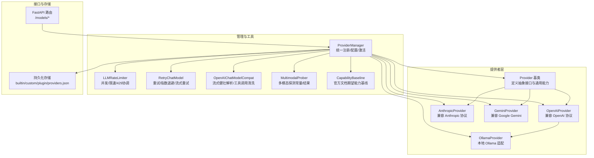
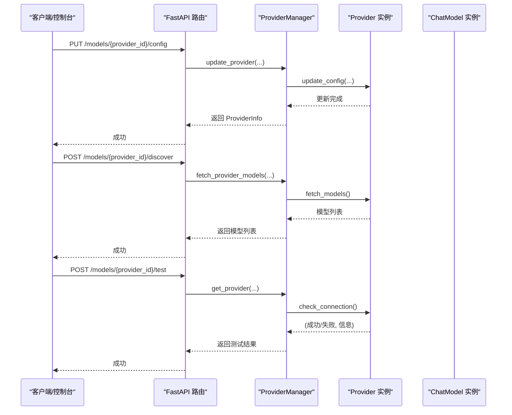
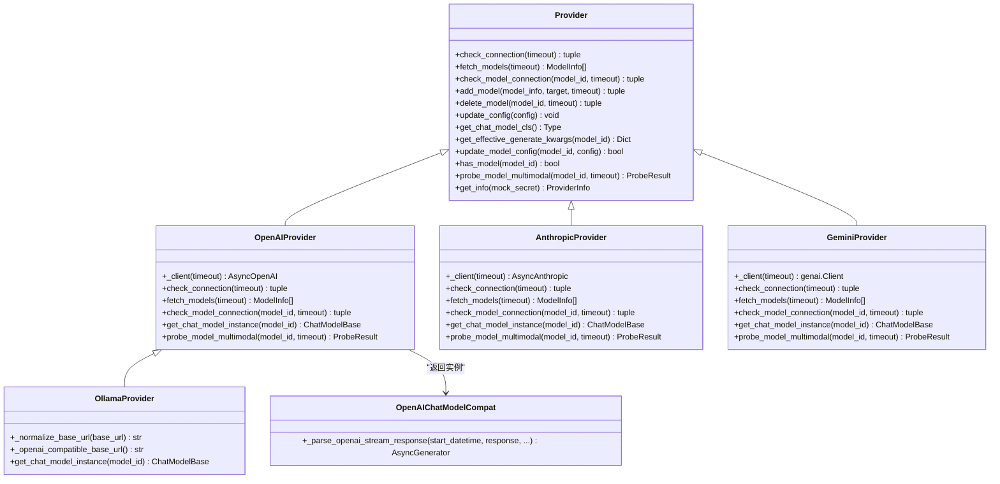
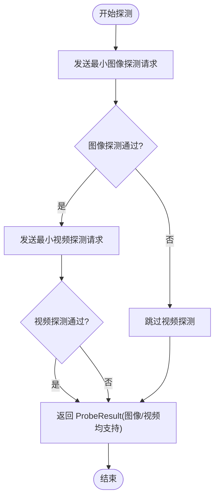
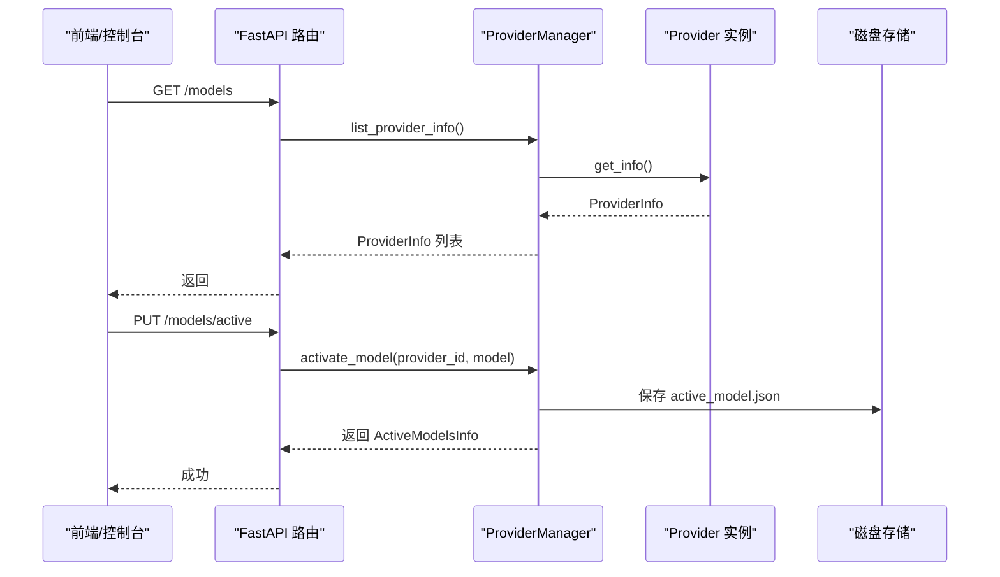
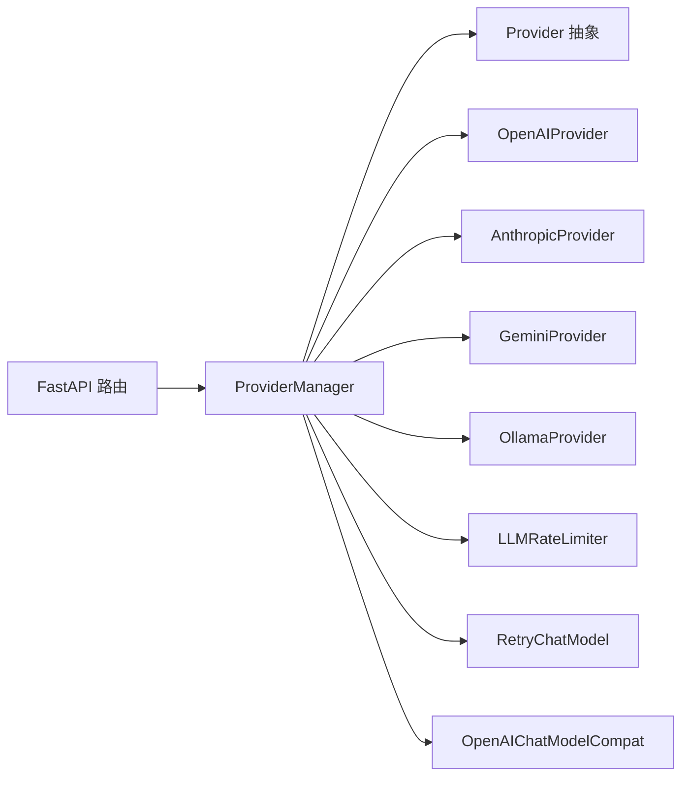

# 提供者管理模式

<cite>
**本文引用的文件**
- [provider_manager.py](file://src/copaw/providers/provider_manager.py)
- [provider.py](file://src/copaw/providers/provider.py)
- [openai_provider.py](file://src/copaw/providers/openai_provider.py)
- [anthropic_provider.py](file://src/copaw/providers/anthropic_provider.py)
- [gemini_provider.py](file://src/copaw/providers/gemini_provider.py)
- [ollama_provider.py](file://src/copaw/providers/ollama_provider.py)
- [models.py](file://src/copaw/providers/models.py)
- [multimodal_prober.py](file://src/copaw/providers/multimodal_prober.py)
- [rate_limiter.py](file://src/copaw/providers/rate_limiter.py)
- [retry_chat_model.py](file://src/copaw/providers/retry_chat_model.py)
- [openai_chat_model_compat.py](file://src/copaw/providers/openai_chat_model_compat.py)
- [providers.py（路由）](file://src/copaw/app/routers/providers.py)
- [capability_baseline.py](file://src/copaw/providers/capability_baseline.py)
- [__init__.py（providers 包）](file://src/copaw/providers/__init__.py)
- [test_provider_manager.py（测试）](file://tests/unit/providers/test_provider_manager.py)
</cite>

## 目录
1. [简介](#简介)
2. [项目结构](#项目结构)
3. [核心组件](#核心组件)
4. [架构总览](#架构总览)
5. [详细组件分析](#详细组件分析)
6. [依赖分析](#依赖分析)
7. [性能考虑](#性能考虑)
8. [故障排查指南](#故障排查指南)
9. [结论](#结论)
10. [附录：开发者扩展指南](#附录开发者扩展指南)

## 简介
本文件系统性阐述 CoPaw 的“提供者管理模式”，聚焦 ProviderManager 如何统一管理多种 AI 模型提供者（如 OpenAI、Anthropic、Gemini、Ollama 等），并深入解析 Provider 基类的设计模式与适配器实现机制。内容涵盖：
- Provider 基类的职责边界与抽象接口设计
- 多模态能力探测与断言基线
- 请求格式转换、响应解析与参数映射
- 提供者注册流程、模型调用接口与性能监控
- 面向提供者的扩展开发指南与最佳实践

## 项目结构
CoPaw 的提供者管理位于 src/copaw/providers 目录，围绕 Provider 抽象、具体提供者实现、管理器、以及与 FastAPI 路由的集成展开。

图表来源
- [provider.py:111-314](file://src/copaw/providers/provider.py#L111-L314)
- [openai_provider.py:25-550](file://src/copaw/providers/openai_provider.py#L25-L550)
- [anthropic_provider.py:27-256](file://src/copaw/providers/anthropic_provider.py#L27-L256)
- [gemini_provider.py:27-332](file://src/copaw/providers/gemini_provider.py#L27-L332)
- [ollama_provider.py:16-86](file://src/copaw/providers/ollama_provider.py#L16-L86)
- [provider_manager.py:670-800](file://src/copaw/providers/provider_manager.py#L670-L800)
- [rate_limiter.py:30-279](file://src/copaw/providers/rate_limiter.py#L30-L279)
- [retry_chat_model.py:204-477](file://src/copaw/providers/retry_chat_model.py#L204-L477)
- [openai_chat_model_compat.py:191-313](file://src/copaw/providers/openai_chat_model_compat.py#L191-L313)
- [multimodal_prober.py:75-102](file://src/copaw/providers/multimodal_prober.py#L75-L102)
- [capability_baseline.py:55-679](file://src/copaw/providers/capability_baseline.py#L55-L679)
- [providers.py（路由）:50-632](file://src/copaw/app/routers/providers.py#L50-L632)

章节来源
- [provider_manager.py:670-800](file://src/copaw/providers/provider_manager.py#L670-L800)
- [provider.py:111-314](file://src/copaw/providers/provider.py#L111-L314)
- [openai_provider.py:25-550](file://src/copaw/providers/openai_provider.py#L25-L550)
- [anthropic_provider.py:27-256](file://src/copaw/providers/anthropic_provider.py#L27-L256)
- [gemini_provider.py:27-332](file://src/copaw/providers/gemini_provider.py#L27-L332)
- [ollama_provider.py:16-86](file://src/copaw/providers/ollama_provider.py#L16-L86)
- [providers.py（路由）:50-632](file://src/copaw/app/routers/providers.py#L50-L632)

## 核心组件
- Provider 基类：定义统一的连接检查、模型发现、模型连通性检查、模型增删、配置更新、聊天模型实例化、多模态探测等抽象方法，并提供生成参数合并、模型存在性判断等通用能力。
- 具体提供者实现：针对不同平台（OpenAI、Anthropic、Gemini、Ollama）实现各自的客户端封装、模型列表拉取、连通性验证、多模态探测与健壮解析。
- ProviderManager：负责内置/自定义/插件提供者的注册、持久化、加载迁移、活动模型激活与保存、多模态探测触发与报告。
- 性能与可靠性：LLMRateLimiter 提供全局并发与 QPM 限制、429 全局暂停与抖动；RetryChatModel 提供透明重试、指数退避、流式重试与超时控制；OpenAIChatModelCompat 提供流式响应健壮解析与工具调用清洗。
- 接口与存储：FastAPI 路由提供统一的提供者配置、模型发现、连通性测试、模型探测、活动模型设置等 API；ProviderManager 将配置持久化到磁盘目录。

章节来源
- [provider.py:111-314](file://src/copaw/providers/provider.py#L111-L314)
- [provider_manager.py:670-800](file://src/copaw/providers/provider_manager.py#L670-L800)
- [rate_limiter.py:30-279](file://src/copaw/providers/rate_limiter.py#L30-L279)
- [retry_chat_model.py:204-477](file://src/copaw/providers/retry_chat_model.py#L204-L477)
- [openai_chat_model_compat.py:191-313](file://src/copaw/providers/openai_chat_model_compat.py#L191-L313)
- [providers.py（路由）:50-632](file://src/copaw/app/routers/providers.py#L50-L632)

## 架构总览
ProviderManager 作为中枢，聚合所有提供者实例，统一对外暴露配置、发现、连通性测试、模型探测与活动模型管理能力。具体提供者通过各自适配器对接上游 API，并在需要时借助 MultimodalProber 执行探测，最终由 ChatModel 实例承载实际推理调用。

图表来源
- [providers.py（路由）:159-341](file://src/copaw/app/routers/providers.py#L159-L341)
- [provider_manager.py:784-800](file://src/copaw/providers/provider_manager.py#L784-L800)
- [provider.py:118-128](file://src/copaw/providers/provider.py#L118-L128)

## 详细组件分析

### Provider 基类设计模式
- 抽象接口：check_connection、fetch_models、check_model_connection、add_model/delete_model、update_config、get_chat_model_cls、probe_model_multimodal、get_info 等。
- 参数合并策略：get_effective_generate_kwargs 支持 provider 级与 model 级 generate_kwargs 深度合并，确保调用时的参数一致性。
- 安全与健壮：has_model、update_model_config、update_config 对输入进行严格校验与类型转换，避免状态污染。
- 反射与动态绑定：get_chat_model_cls 动态从 agentscope.model 获取对应 ChatModel 类，支持多协议适配。

图表来源
- [provider.py:111-314](file://src/copaw/providers/provider.py#L111-L314)
- [openai_provider.py:25-550](file://src/copaw/providers/openai_provider.py#L25-L550)
- [anthropic_provider.py:27-256](file://src/copaw/providers/anthropic_provider.py#L27-L256)
- [gemini_provider.py:27-332](file://src/copaw/providers/gemini_provider.py#L27-L332)
- [ollama_provider.py:16-86](file://src/copaw/providers/ollama_provider.py#L16-L86)
- [openai_chat_model_compat.py:191-313](file://src/copaw/providers/openai_chat_model_compat.py#L191-L313)

章节来源
- [provider.py:111-314](file://src/copaw/providers/provider.py#L111-L314)

### 多模态探测与能力基线
- 探测机制：各 Provider 在自身实现中执行图像/视频探测，使用统一的 ProbeResult 结果对象，记录 supports_image/supports_video 与消息说明。
- 基线对比：capability_baseline 提供“官方文档期望能力”与“实际探测结果”的对比，输出差异日志与汇总统计，便于质量评估与回归检测。
- 探测常量：multimodal_prober 定义了探测用的最小图像/视频样本与关键词判断逻辑，保证跨提供者的一致性。

图表来源
- [openai_provider.py:165-198](file://src/copaw/providers/openai_provider.py#L165-L198)
- [anthropic_provider.py:166-187](file://src/copaw/providers/anthropic_provider.py#L166-L187)
- [gemini_provider.py:142-159](file://src/copaw/providers/gemini_provider.py#L142-L159)
- [multimodal_prober.py:75-102](file://src/copaw/providers/multimodal_prober.py#L75-L102)
- [capability_baseline.py:604-679](file://src/copaw/providers/capability_baseline.py#L604-L679)

章节来源
- [multimodal_prober.py:75-102](file://src/copaw/providers/multimodal_prober.py#L75-L102)
- [capability_baseline.py:55-679](file://src/copaw/providers/capability_baseline.py#L55-L679)

### 请求格式转换与响应解析
- OpenAI 兼容适配：OpenAIChatModelCompat 在流式解析阶段对工具调用块进行清洗与补全，同时透传 Gemini 思维模型的 extra_content 到工具调用块，提升跨模型一致性。
- 流式健壮性：对缺失字段、非法 JSON、异常结构进行降级处理，避免中断流式传输。
- 工具调用提取：支持从思维块与文本块中提取工具调用标签，避免重复与空内容。

章节来源
- [openai_chat_model_compat.py:191-313](file://src/copaw/providers/openai_chat_model_compat.py#L191-L313)

### ProviderManager 统一管理
- 注册与持久化：内置提供者在初始化时注册，支持自定义提供者写入 custom 目录，插件提供者直接以 ProviderInfo 形式注入。
- 迁移与回放：支持从旧版 providers.json 迁移到新结构，并恢复活动模型。
- 活动模型：维护当前生效的 ModelSlotConfig，支持全局与按代理覆盖两种读取策略。
- 并发与限速：通过 LLMRateLimiter 控制并发与 QPM，结合 RetryChatModel 实现透明重试与流式重试。

图表来源
- [providers.py（路由）:496-632](file://src/copaw/app/routers/providers.py#L496-L632)
- [provider_manager.py:780-800](file://src/copaw/providers/provider_manager.py#L780-L800)
- [models.py:9-16](file://src/copaw/providers/models.py#L9-L16)

章节来源
- [provider_manager.py:670-800](file://src/copaw/providers/provider_manager.py#L670-L800)
- [providers.py（路由）:50-632](file://src/copaw/app/routers/providers.py#L50-L632)
- [models.py:9-16](file://src/copaw/providers/models.py#L9-L16)

### 具体提供者实现要点
- OpenAIProvider：统一的 OpenAI 兼容客户端封装，支持 DashScope、阿里云 CodingPlan 等兼容端点；多模态探测采用两阶段验证（拒绝判定 + 语义验证）。
- AnthropicProvider：基于 Anthropic Messages API，图像探测采用 base64 图像源格式，视频不支持。
- GeminiProvider：基于 Google GenAI SDK，支持 inline_data 与 file_data 两种探测路径，具备更强的多模态能力。
- OllamaProvider：继承 OpenAIProvider，自动将 base_url 规范化为 /v1 兼容端点，禁用模型增删以避免与本地环境冲突。

章节来源
- [openai_provider.py:25-550](file://src/copaw/providers/openai_provider.py#L25-L550)
- [anthropic_provider.py:27-256](file://src/copaw/providers/anthropic_provider.py#L27-L256)
- [gemini_provider.py:27-332](file://src/copaw/providers/gemini_provider.py#L27-L332)
- [ollama_provider.py:16-86](file://src/copaw/providers/ollama_provider.py#L16-L86)

### API 路由与调用接口
- 提供者配置：PUT /models/{provider_id}/config，支持更新 api_key/base_url/chat_model/generate_kwargs。
- 自定义提供者：POST /models/custom-providers 创建，DELETE /models/custom-providers/{provider_id} 删除。
- 连通性测试：POST /models/{provider_id}/test 与 POST /models/{provider_id}/models/{model_id}/test。
- 模型发现：POST /models/{provider_id}/discover。
- 多模态探测：POST /models/{provider_id}/models/{model_id}/probe-multimodal。
- 活动模型：GET/PUT /models/active，支持 global/agent/effective 三种作用域。

章节来源
- [providers.py（路由）:148-632](file://src/copaw/app/routers/providers.py#L148-L632)

## 依赖分析
- ProviderManager 依赖 Provider 抽象与具体实现，以及 LLMRateLimiter、RetryChatModel、OpenAIChatModelCompat 等运行时组件。
- 具体 Provider 依赖各自 SDK（openai、anthropic、google.genai）与 agentscope ChatModel。
- 路由层通过依赖注入获取 ProviderManager 实例，实现对提供者生命周期的统一管理。

图表来源
- [provider_manager.py:670-800](file://src/copaw/providers/provider_manager.py#L670-L800)
- [providers.py（路由）:50-632](file://src/copaw/app/routers/providers.py#L50-L632)

章节来源
- [provider_manager.py:670-800](file://src/copaw/providers/provider_manager.py#L670-L800)
- [providers.py（路由）:50-632](file://src/copaw/app/routers/providers.py#L50-L632)

## 性能考虑
- 并发与 QPM：LLMRateLimiter 使用滑动窗口与信号量控制并发与每分钟请求数，避免上游 429。
- 429 协调：当收到 429 时设置全局暂停时间，配合抖动避免“惊群”重试。
- 重试策略：RetryChatModel 对可重试错误（含 429）进行指数退避重试，流式场景会整流重试。
- 流式优化：在首次收到数据块后释放执行槽位，减少长尾阻塞。
- 参数合并：生成参数在调用前合并，避免每次调用都做深拷贝，降低开销。

章节来源
- [rate_limiter.py:30-279](file://src/copaw/providers/rate_limiter.py#L30-L279)
- [retry_chat_model.py:204-477](file://src/copaw/providers/retry_chat_model.py#L204-L477)
- [provider.py:230-262](file://src/copaw/providers/provider.py#L230-L262)

## 故障排查指南
- 连接失败：优先检查 base_url 与 api_key 是否正确；使用 POST /models/{provider_id}/test 快速验证。
- 模型不可用：使用 POST /models/{provider_id}/models/{model_id}/test 检查模型连通性。
- 多模态误判：查看探测结果与官方文档期望的差异，必要时调整探测阈值或人工核验。
- 重试过多：检查 RetryChatModel 的 backoff 配置与 LLMRateLimiter 的 acquire 超时，避免长时间等待。
- 存储损坏：ProviderManager 支持从旧版 providers.json 迁移，若文件损坏可删除后重新导入。

章节来源
- [providers.py（路由）:275-450](file://src/copaw/app/routers/providers.py#L275-L450)
- [test_provider_manager.py（测试）:301-339](file://tests/unit/providers/test_provider_manager.py#L301-L339)

## 结论
CoPaw 的提供者管理模式通过 Provider 抽象与适配器实现，实现了对多家提供者的统一接入与治理。ProviderManager 提供了完善的注册、配置、发现、探测与活动模型管理能力，并结合 LLMRateLimiter 与 RetryChatModel 构建了高可靠、高性能的推理执行链路。配合 CapabilityBaseline 与 MultimodalProber，系统能够持续验证与优化多模态能力的准确性与一致性。

## 附录：开发者扩展指南
- 新提供者接入步骤
  1) 继承 Provider，实现以下方法：
     - check_connection(timeout)：验证 base_url 与凭据
     - fetch_models(timeout)：拉取可用模型列表
     - check_model_connection(model_id, timeout)：验证单个模型可用性
     - get_chat_model_instance(model_id)：返回对应 ChatModel 实例
     - probe_model_multimodal(model_id, timeout)：可选，实现多模态探测
  2) 在 ProviderManager 初始化中注册该提供者（或通过自定义提供者入口添加）。
  3) 若上游协议与 OpenAI/Gemini/Anthropic 不同，需在 get_chat_model_instance 中选择合适的 ChatModel 或自行封装。
  4) 如需本地/兼容端点，参考 OpenAIProvider/OllamaProvider 的 base_url 规范化与 client_kwargs 设置。
  5) 通过 FastAPI 路由提供的 /models/custom-providers 接口进行注册与配置。

- 最佳实践
  - 明确区分“文档标注能力”与“实际探测能力”，使用 CapabilityBaseline 进行比对与审计。
  - 对于流式响应，务必使用 OpenAIChatModelCompat 或等效健壮解析器，确保工具调用与 extra_content 正确传递。
  - 合理设置 generate_kwargs 与 per-model 覆盖，避免在调用时反复构造参数。
  - 使用 LLMRateLimiter 与 RetryChatModel 保障稳定性，避免突发流量导致上游限流。
  - 对于本地/私有部署，建议启用模型发现与多模态探测，减少配置误差。

章节来源
- [provider.py:111-314](file://src/copaw/providers/provider.py#L111-L314)
- [openai_provider.py:25-550](file://src/copaw/providers/openai_provider.py#L25-L550)
- [ollama_provider.py:16-86](file://src/copaw/providers/ollama_provider.py#L16-L86)
- [openai_chat_model_compat.py:191-313](file://src/copaw/providers/openai_chat_model_compat.py#L191-L313)
- [providers.py（路由）:193-218](file://src/copaw/app/routers/providers.py#L193-L218)