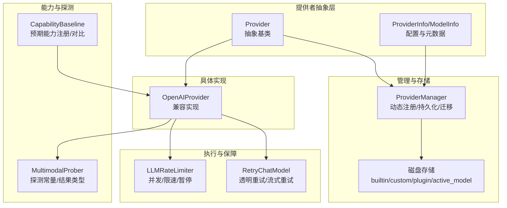
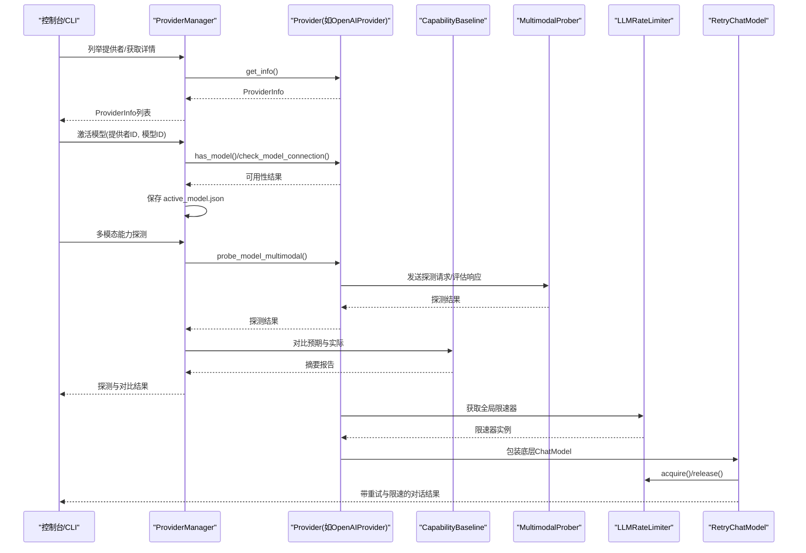
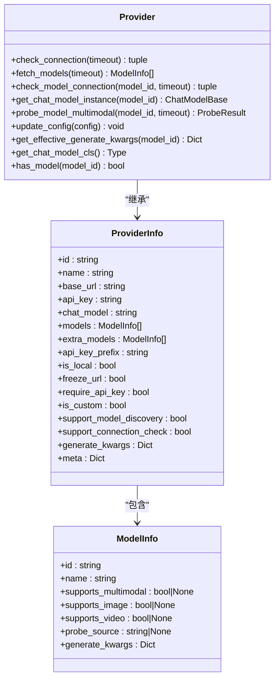
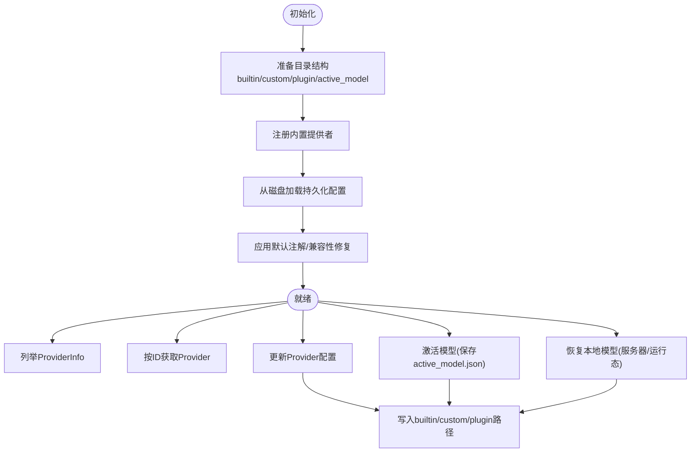
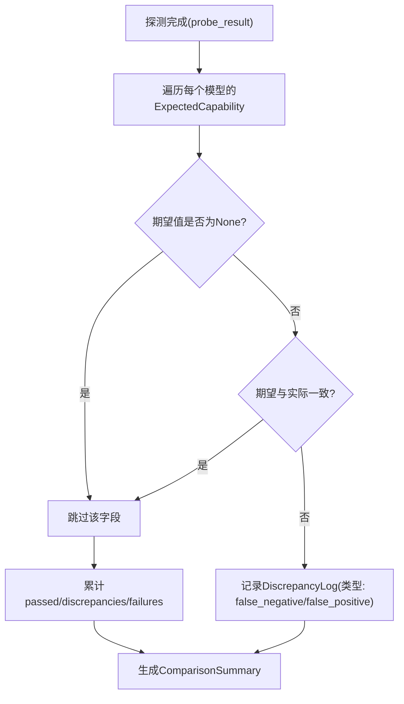
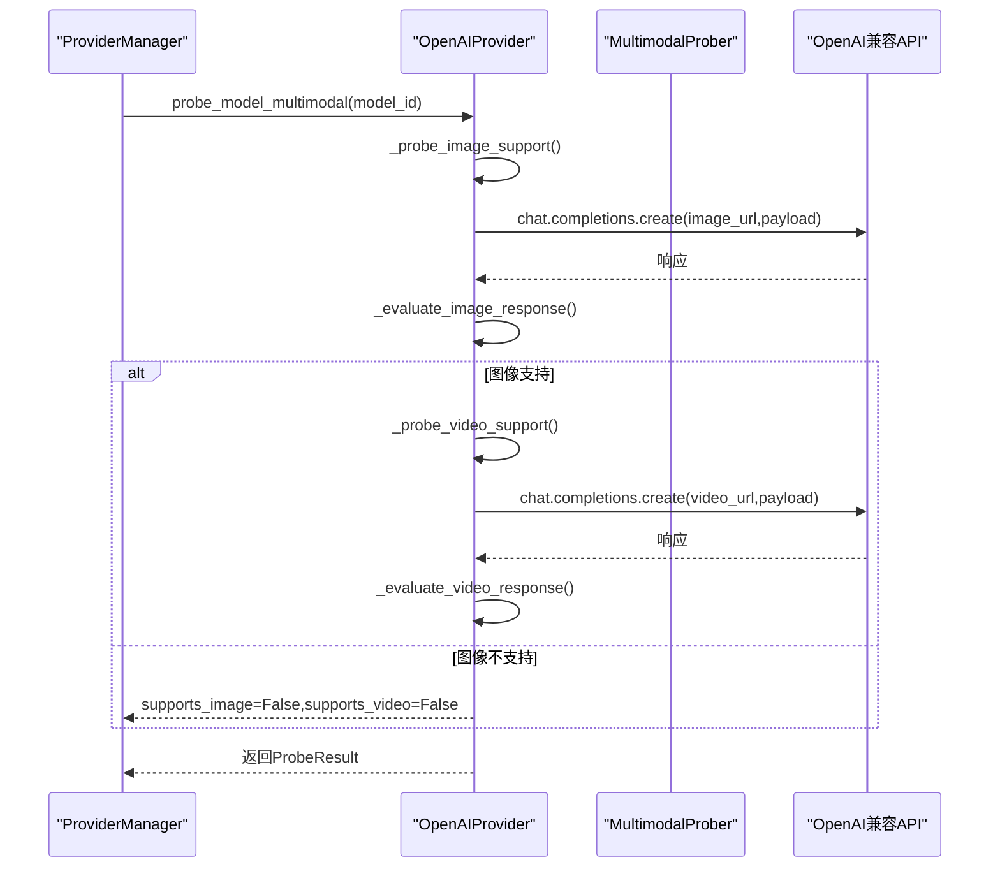
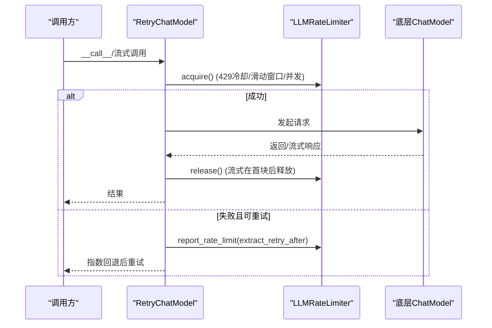
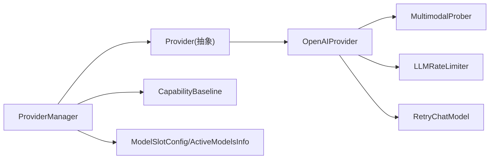

# 提供者适配器设计

<cite>
**本文引用的文件**
- [provider.py](file://src/copaw/providers/provider.py)
- [provider_manager.py](file://src/copaw/providers/provider_manager.py)
- [capability_baseline.py](file://src/copaw/providers/capability_baseline.py)
- [models.py](file://src/copaw/providers/models.py)
- [openai_provider.py](file://src/copaw/providers/openai_provider.py)
- [multimodal_prober.py](file://src/copaw/providers/multimodal_prober.py)
- [rate_limiter.py](file://src/copaw/providers/rate_limiter.py)
- [retry_chat_model.py](file://src/copaw/providers/retry_chat_model.py)
- [test_provider_manager.py](file://tests/unit/providers/test_provider_manager.py)
- [test_openai_provider.py](file://tests/unit/providers/test_openai_provider.py)
- [__init__.py](file://src/copaw/providers/__init__.py)
</cite>

## 目录
1. [简介](#简介)
2. [项目结构](#项目结构)
3. [核心组件](#核心组件)
4. [架构总览](#架构总览)
5. [详细组件分析](#详细组件分析)
6. [依赖分析](#依赖分析)
7. [性能考虑](#性能考虑)
8. [故障排查指南](#故障排查指南)
9. [结论](#结论)
10. [附录](#附录)

## 简介
本文件系统化阐述 CoPaw 提供者适配器的设计与实现，重点覆盖以下主题：
- Provider 基类的抽象设计：统一接口规范、能力声明、配置管理
- ProviderManager 动态发现与管理：注册、持久化、迁移、激活模型
- 能力基线 CapabilityBaseline：标准化多模态能力差异，支持预期与探测结果对比
- 具体实现示例：提供者接口实现、能力检测流程、配置解析机制
- 扩展模式与兼容性：插件式提供者、向后兼容策略、错误处理与重试

## 项目结构
CoPaw 的提供者子系统位于 src/copaw/providers 下，围绕 Provider 抽象、ProviderManager 管理器、能力基线与工具模块构建，形成“抽象定义—运行时管理—能力校验—执行保障”的完整闭环。

图表来源
- [provider.py:111-314](file://src/copaw/providers/provider.py#L111-L314)
- [provider_manager.py:670-800](file://src/copaw/providers/provider_manager.py#L670-L800)
- [capability_baseline.py:55-679](file://src/copaw/providers/capability_baseline.py#L55-L679)
- [multimodal_prober.py:75-102](file://src/copaw/providers/multimodal_prober.py#L75-L102)
- [rate_limiter.py:30-279](file://src/copaw/providers/rate_limiter.py#L30-L279)
- [retry_chat_model.py:204-477](file://src/copaw/providers/retry_chat_model.py#L204-L477)
- [openai_provider.py:25-550](file://src/copaw/providers/openai_provider.py#L25-L550)

章节来源
- [provider.py:111-314](file://src/copaw/providers/provider.py#L111-L314)
- [provider_manager.py:670-800](file://src/copaw/providers/provider_manager.py#L670-L800)
- [capability_baseline.py:55-679](file://src/copaw/providers/capability_baseline.py#L55-L679)
- [multimodal_prober.py:75-102](file://src/copaw/providers/multimodal_prober.py#L75-L102)
- [rate_limiter.py:30-279](file://src/copaw/providers/rate_limiter.py#L30-L279)
- [retry_chat_model.py:204-477](file://src/copaw/providers/retry_chat_model.py#L204-L477)
- [openai_provider.py:25-550](file://src/copaw/providers/openai_provider.py#L25-L550)

## 核心组件
- Provider 抽象基类：定义统一接口（连接检查、模型拉取、模型连通性检查、模型实例化、多模态探测、配置更新、有效生成参数合并等），并提供通用能力（配置加密字段、深度合并、信息导出）。
- ProviderManager：负责内置/自定义/插件提供者的注册、持久化、迁移、加载、激活模型、目录准备与安全权限设置。
- CapabilityBaseline：集中维护各内置提供者模型的预期多模态能力，并提供对比与摘要统计。
- OpenAIProvider：典型兼容实现，封装 OpenAI 兼容 API 的连接检查、模型列表、模型连通性、多模态探测、客户端构造与请求头注入。
- MultimodalProber：提供探测用的二进制素材与探测结果数据结构，以及媒体关键词判断辅助。
- LLMRateLimiter：全局并发与 QPM 滑动窗口限速器，配合 RetryChatModel 实现 429 协调与抖动。
- RetryChatModel：对任意 ChatModelBase 进行透明重试包装，支持非流式与流式场景的语义正确释放与重试。

章节来源
- [provider.py:111-314](file://src/copaw/providers/provider.py#L111-L314)
- [provider_manager.py:670-800](file://src/copaw/providers/provider_manager.py#L670-L800)
- [capability_baseline.py:55-679](file://src/copaw/providers/capability_baseline.py#L55-L679)
- [openai_provider.py:25-550](file://src/copaw/providers/openai_provider.py#L25-L550)
- [multimodal_prober.py:75-102](file://src/copaw/providers/multimodal_prober.py#L75-L102)
- [rate_limiter.py:30-279](file://src/copaw/providers/rate_limiter.py#L30-L279)
- [retry_chat_model.py:204-477](file://src/copaw/providers/retry_chat_model.py#L204-L477)

## 架构总览
下图展示了 ProviderManager 在运行期如何组织与调度 Provider，以及与能力基线、探测器、限速与重试的关系。

图表来源
- [provider_manager.py:736-778](file://src/copaw/providers/provider_manager.py#L736-L778)
- [openai_provider.py:165-550](file://src/copaw/providers/openai_provider.py#L165-L550)
- [capability_baseline.py:604-679](file://src/copaw/providers/capability_baseline.py#L604-L679)
- [multimodal_prober.py:75-102](file://src/copaw/providers/multimodal_prober.py#L75-L102)
- [rate_limiter.py:70-174](file://src/copaw/providers/rate_limiter.py#L70-L174)
- [retry_chat_model.py:269-477](file://src/copaw/providers/retry_chat_model.py#L269-L477)

## 详细组件分析

### Provider 抽象基类与配置管理
- 统一接口
  - 连接检查：check_connection(timeout)
  - 模型拉取：fetch_models(timeout)
  - 模型连通性：check_model_connection(model_id, timeout)
  - 模型实例化：get_chat_model_instance(model_id)
  - 多模态探测：probe_model_multimodal(model_id, timeout)
  - 配置更新：update_config(config)
  - 有效生成参数：get_effective_generate_kwargs(model_id)
- 数据模型
  - ProviderInfo：提供者元信息（id/name/base_url/api_key/chat_model/模型列表/元数据等）
  - ModelInfo：模型元信息（id/name/多模态支持标记/probe来源/模型级生成参数）
- 配置与安全
  - 支持冻结 base_url、区分内置/自定义、API Key 前缀、额外元数据
  - get_info() 可选择脱敏显示敏感字段
- 参数合并策略
  - provider-level 作为基础，model-level 通过深合并覆盖，返回新字典避免污染状态

图表来源
- [provider.py:111-314](file://src/copaw/providers/provider.py#L111-L314)

章节来源
- [provider.py:111-314](file://src/copaw/providers/provider.py#L111-L314)

### ProviderManager：动态注册、持久化与迁移
- 初始化与目录准备
  - 准备 providers/builtin、providers/custom、providers/plugin 与 active_model.json
  - 设置目录权限以提升安全性
- 内置提供者注册
  - 一次性注册大量内置 Provider（含 OpenAI、Azure OpenAI、Anthropic、Gemini、Ollama、LM Studio、SiliconFlow 等）
- 动态管理
  - list_provider_info()/get_provider_info()：异步批量获取 ProviderInfo
  - get_provider()：优先从插件、内置、自定义中查找
  - update_provider()：更新配置并持久化（内置/自定义/插件路径不同）
- 激活模型与本地模型恢复
  - activate_model()：校验提供者与模型存在性，保存 active_model.json
  - _resume_local_model()：恢复本地模型服务器与运行态，补充探测到的多模态能力
- 迁移与兼容
  - _migrate_legacy_providers()：从旧格式迁移至新结构，保留 API Key 并修正部分字段
  - _init_from_storage()：从磁盘加载持久化配置
- 插件提供者
  - plugin_providers 存储 ProviderInfo 直接对象，按需实例化

图表来源
- [provider_manager.py:670-800](file://src/copaw/providers/provider_manager.py#L670-L800)

章节来源
- [provider_manager.py:670-800](file://src/copaw/providers/provider_manager.py#L670-L800)
- [test_provider_manager.py:132-203](file://tests/unit/providers/test_provider_manager.py#L132-L203)
- [test_provider_manager.py:301-338](file://tests/unit/providers/test_provider_manager.py#L301-L338)
- [test_provider_manager.py:483-537](file://tests/unit/providers/test_provider_manager.py#L483-L537)

### 能力基线 CapabilityBaseline：标准化多模态差异
- 预期能力注册
  - ExpectedCapabilityRegistry：以 (provider_id, model_id) 为键，记录期望图像/视频支持、文档链接与备注
  - 内置覆盖：ModelScope、DashScope、Aliyun Coding Plan、Zhipu、OpenAI、Azure OpenAI、Kimi、DeepSeek、Anthropic、Gemini、MiniMax、Ollama/LM Studio 等
- 对比与摘要
  - compare_probe_result()：逐字段比较期望与实际，输出差异日志
  - generate_summary()：汇总总数、通过数、差异数、失败数与详情
- 使用场景
  - 与 OpenAIProvider 的 probe_model_multimodal 结合，输出对比摘要，辅助用户识别能力偏差

图表来源
- [capability_baseline.py:604-679](file://src/copaw/providers/capability_baseline.py#L604-L679)

章节来源
- [capability_baseline.py:55-679](file://src/copaw/providers/capability_baseline.py#L55-L679)
- [openai_provider.py:165-550](file://src/copaw/providers/openai_provider.py#L165-L550)

### OpenAIProvider：典型兼容实现与多模态探测
- 连接检查
  - check_connection()：对兼容端点调用 models.list，捕获 APIError 返回失败
- 模型列表与去重
  - fetch_models()：标准化 payload，去重并返回 ModelInfo 列表
- 模型连通性
  - check_model_connection()：发送最小文本流式请求，消费首个片段验证可用性
- 多模态探测
  - probe_model_multimodal()：先探测图像，再在图像通过后探测视频；对 HTTP 视频 URL 采用宽松判定
  - 图像探测：发送纯红 16x16 PNG，要求模型回答“红色”或其变体；推理模型检查 reasoning_content
  - 视频探测：尝试 base64 与 HTTP 两种格式，若 400 表示格式不接受则回退；HTTP 情况只要非空即视为支持
- 客户端与请求头
  - _client()：基于 base_url 与 api_key 构造 AsyncOpenAI
  - 特定 DashScope 端点注入默认头部（兼容性标识）

图表来源
- [openai_provider.py:165-550](file://src/copaw/providers/openai_provider.py#L165-L550)
- [multimodal_prober.py:75-102](file://src/copaw/providers/multimodal_prober.py#L75-L102)

章节来源
- [openai_provider.py:25-550](file://src/copaw/providers/openai_provider.py#L25-L550)
- [multimodal_prober.py:75-102](file://src/copaw/providers/multimodal_prober.py#L75-L102)

### 执行保障：限速与重试
- LLMRateLimiter
  - QPM 滑动窗口：60 秒内最多 max_qpm 次请求
  - 并发信号量：max_concurrent 控制同时进行的请求
  - 全局暂停：收到 429 后设置 pause_until，所有 acquire() 等待直至过期
  - 抖动：唤醒时加入随机抖动，避免“惊群”
- RetryChatModel
  - 对非流式与流式调用分别处理，确保语义正确的释放与重试
  - 自动识别可重试异常（429、超时、连接错误等），指数回退
  - 与 LLMRateLimiter 协作，等待槽位、并发控制与 429 协调

图表来源
- [rate_limiter.py:70-174](file://src/copaw/providers/rate_limiter.py#L70-L174)
- [retry_chat_model.py:269-477](file://src/copaw/providers/retry_chat_model.py#L269-L477)

章节来源
- [rate_limiter.py:30-279](file://src/copaw/providers/rate_limiter.py#L30-L279)
- [retry_chat_model.py:204-477](file://src/copaw/providers/retry_chat_model.py#L204-L477)

### 配置解析与示例路径
- Provider.update_config()：仅当键存在且非 None 时才更新；支持冻结 base_url、区分内置/自定义对 chat_model 的更新、合并 generate_kwargs
- Provider.get_info()：可选择脱敏显示 api_key；根据 is_custom 决定是否支持连接检查
- OpenAIProvider.get_chat_model_instance()：根据 base_url 注入默认头部（DashScope 兼容），并传入有效 generate_kwargs

示例路径（不展示代码内容，仅给出定位）：
- [Provider.update_config:160-193](file://src/copaw/providers/provider.py#L160-L193)
- [Provider.get_info:288-314](file://src/copaw/providers/provider.py#L288-L314)
- [OpenAIProvider.get_chat_model_instance:126-163](file://src/copaw/providers/openai_provider.py#L126-L163)
- [OpenAIProvider.update_config 测试:151-213](file://tests/unit/providers/test_openai_provider.py#L151-L213)

章节来源
- [provider.py:160-314](file://src/copaw/providers/provider.py#L160-L314)
- [openai_provider.py:126-163](file://src/copaw/providers/openai_provider.py#L126-L163)
- [test_openai_provider.py:151-213](file://tests/unit/providers/test_openai_provider.py#L151-L213)

## 依赖分析
- ProviderManager 依赖 Provider 抽象与具体实现（OpenAIProvider、AnthropicProvider 等），并通过磁盘存储实现持久化与迁移
- OpenAIProvider 依赖 MultimodalProber 的探测素材与结果类型，并与 LLMRateLimiter、RetryChatModel 协同
- CapabilityBaseline 与 OpenAIProvider 解耦，通过预期能力注册与对比函数独立工作
- 数据模型（ModelSlotConfig、ActiveModelsInfo）用于管理当前激活模型与槽位

图表来源
- [provider_manager.py:670-800](file://src/copaw/providers/provider_manager.py#L670-L800)
- [openai_provider.py:25-550](file://src/copaw/providers/openai_provider.py#L25-L550)
- [capability_baseline.py:55-679](file://src/copaw/providers/capability_baseline.py#L55-L679)
- [models.py:9-16](file://src/copaw/providers/models.py#L9-L16)

章节来源
- [provider_manager.py:670-800](file://src/copaw/providers/provider_manager.py#L670-L800)
- [openai_provider.py:25-550](file://src/copaw/providers/openai_provider.py#L25-L550)
- [capability_baseline.py:55-679](file://src/copaw/providers/capability_baseline.py#L55-L679)
- [models.py:9-16](file://src/copaw/providers/models.py#L9-L16)

## 性能考虑
- 并发与限速
  - LLMRateLimiter 通过滑动窗口与信号量限制并发与 QPM，减少上游限流与拥塞
  - 抖动避免“惊群”，提升整体吞吐稳定性
- 流式处理
  - RetryChatModel 在流式场景中尽早释放槽位，降低长尾阻塞
- 探测策略
  - OpenAIProvider 的图像探测采用语义校验，避免“静默忽略”导致的误判
  - 视频探测优先 base64，失败时自动回退 HTTP URL，兼顾兼容性与效率

[本节为通用指导，无需特定文件来源]

## 故障排查指南
- 连接检查失败
  - 检查 base_url 与 api_key 是否正确；确认网络可达与代理设置
  - 对于 OpenAIProvider，APIError 会触发失败返回
- 模型不可用
  - 使用 check_model_connection() 验证模型连通性；必要时缩短 timeout 或调整 max_tokens
- 多模态探测异常
  - 若图像探测失败，视频探测会被跳过；检查模型是否支持 image_url/video_url
  - 对于 DashScope 端点，确认默认头部是否正确注入
- 限速与重试
  - 若频繁出现 429，适当提高 pause_seconds 或降低 max_concurrent/max_qpm
  - 检查 Retry-After 头部解析与 report_rate_limit() 的生效情况
- 激活模型失败
  - 确认 ProviderManager 激活时的 provider_id 与 model_id 存在
  - 查看 active_model.json 是否成功写入

章节来源
- [openai_provider.py:57-125](file://src/copaw/providers/openai_provider.py#L57-L125)
- [openai_provider.py:165-550](file://src/copaw/providers/openai_provider.py#L165-L550)
- [retry_chat_model.py:137-161](file://src/copaw/providers/retry_chat_model.py#L137-L161)
- [test_provider_manager.py:407-423](file://tests/unit/providers/test_provider_manager.py#L407-L423)

## 结论
CoPaw 的提供者适配器体系以 Provider 抽象为核心，结合 ProviderManager 的动态管理、CapabilityBaseline 的能力标准化、OpenAIProvider 的兼容实现与 MultimodalProber 的探测机制，以及 LLMRateLimiter 和 RetryChatModel 的执行保障，形成了高扩展、强兼容、可运维的统一模型接入方案。通过磁盘持久化与迁移机制，系统在升级与部署中保持配置连续性；通过能力基线与探测流程，帮助用户准确评估与选择模型能力。

[本节为总结性内容，无需特定文件来源]

## 附录
- 导出入口
  - providers/__init__.py 暴露 Provider、ProviderManager、ModelInfo、ProviderInfo、ActiveModelsInfo
- 测试参考
  - ProviderManager 与 OpenAIProvider 的单元测试覆盖了持久化、迁移、激活模型、配置更新、探测与对比等关键路径

章节来源
- [__init__.py:4-13](file://src/copaw/providers/__init__.py#L4-L13)
- [test_provider_manager.py:132-203](file://tests/unit/providers/test_provider_manager.py#L132-L203)
- [test_openai_provider.py:21-95](file://tests/unit/providers/test_openai_provider.py#L21-L95)