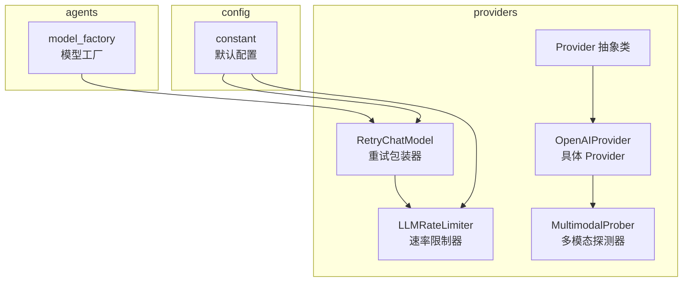
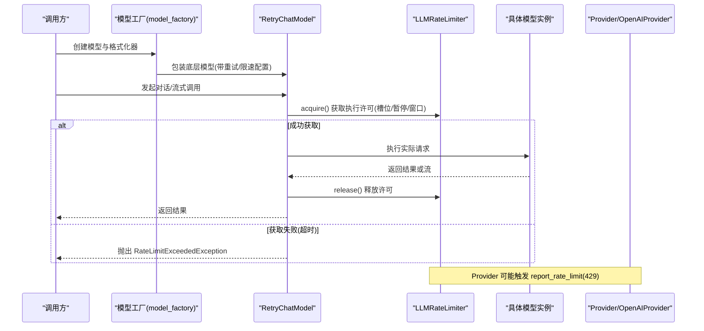
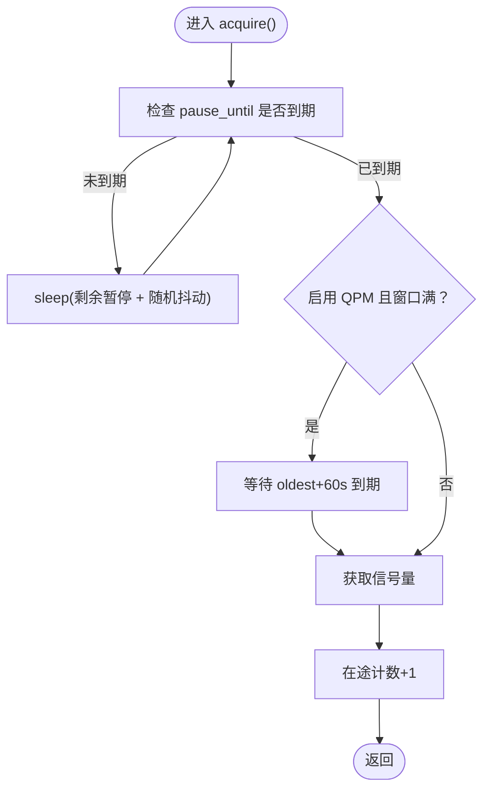
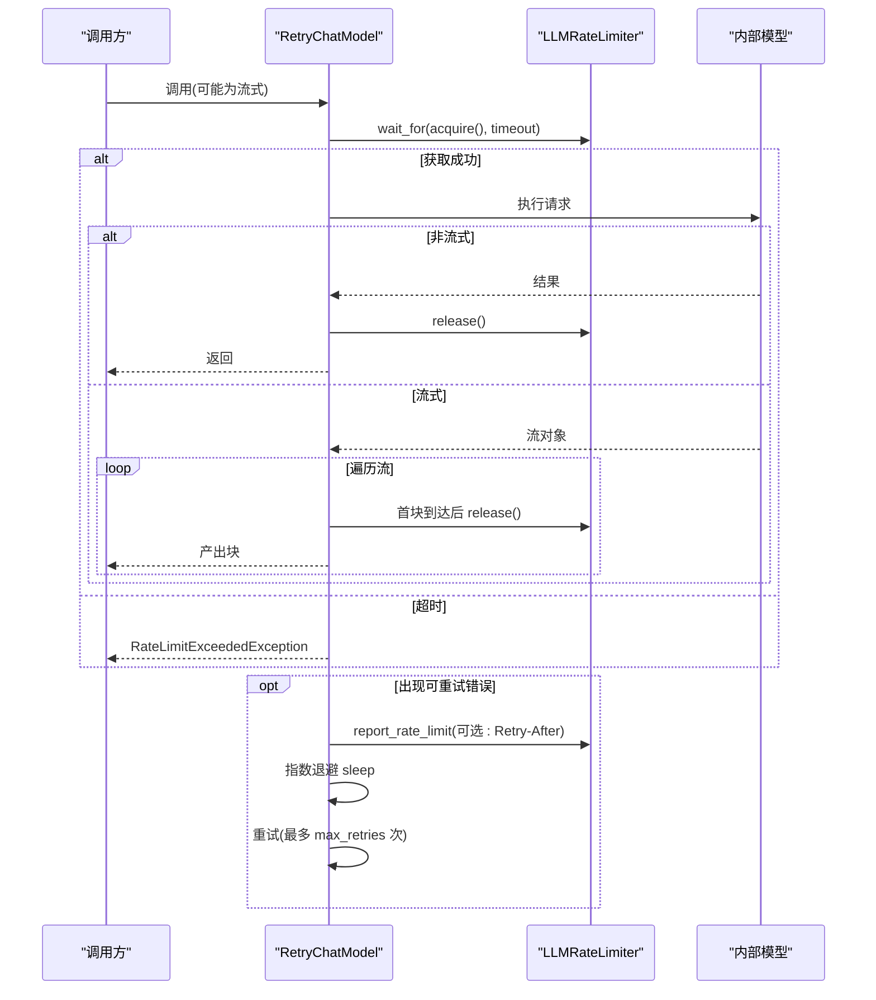
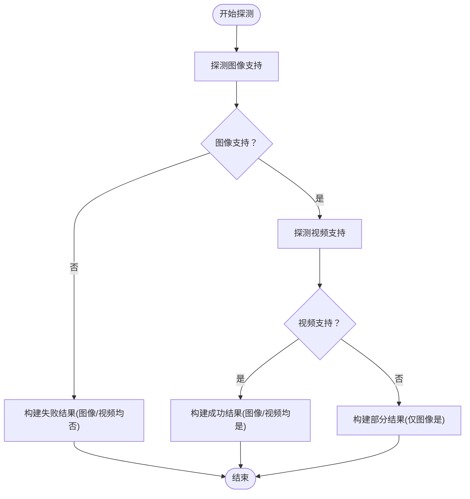
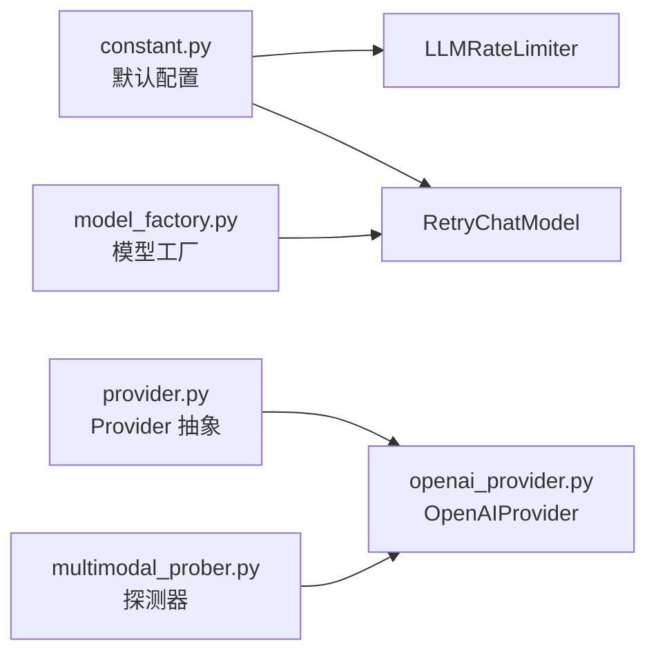

# 速率限制与重试机制

<cite>
**本文引用的文件**
- [rate_limiter.py](file://src/copaw/providers/rate_limiter.py)
- [retry_chat_model.py](file://src/copaw/providers/retry_chat_model.py)
- [multimodal_prober.py](file://src/copaw/providers/multimodal_prober.py)
- [provider.py](file://src/copaw/providers/provider.py)
- [constant.py](file://src/copaw/constant.py)
- [model_factory.py](file://src/copaw/agents/model_factory.py)
- [openai_provider.py](file://src/copaw/providers/openai_provider.py)
- [test_openai_provider.py](file://tests/unit/providers/test_openai_provider.py)
</cite>

## 目录
1. [简介](#简介)
2. [项目结构](#项目结构)
3. [核心组件](#核心组件)
4. [架构总览](#架构总览)
5. [详细组件分析](#详细组件分析)
6. [依赖关系分析](#依赖关系分析)
7. [性能考量](#性能考量)
8. [故障排除指南](#故障排除指南)
9. [结论](#结论)
10. [附录：配置示例与最佳实践](#附录配置示例与最佳实践)

## 简介
本文件系统性阐述 CoPaw 提供者侧的“速率限制与重试机制”，涵盖以下关键点：
- 速率限制器（LLMRateLimiter）：令牌桶思想的滑动窗口 QPM 控制、并发信号量、全局暂停与抖动防风暴重试。
- 重试机制（RetryChatModel）：透明重试、指数退避、错误分类（含状态码与 SDK 异常）、流式重试策略、获取槽位超时处理。
- 多模态探测器（MultimodalProber）：统一的探测数据结构、媒体关键字误判过滤、各 Provider 的具体探测实现入口。

同时给出在不同场景下的配置示例、性能优化建议与常见问题排查方法，帮助读者在生产环境中稳定、高效地使用上游 LLM API。

## 项目结构
围绕速率限制与重试机制的相关模块组织如下：
- providers 子包：速率限制、重试包装、多模态探测、Provider 抽象与具体实现
- agents 子包：模型工厂对 RetryChatModel 的装配与使用
- constant：LLM 相关默认配置项
- tests：对 Provider 行为的单元测试，间接验证重试与探测流程

图示来源
- [rate_limiter.py:30-279](file://src/copaw/providers/rate_limiter.py#L30-L279)
- [retry_chat_model.py:204-477](file://src/copaw/providers/retry_chat_model.py#L204-L477)
- [multimodal_prober.py:1-102](file://src/copaw/providers/multimodal_prober.py#L1-L102)
- [provider.py:111-314](file://src/copaw/providers/provider.py#L111-L314)
- [openai_provider.py:25-200](file://src/copaw/providers/openai_provider.py#L25-L200)
- [model_factory.py:39-785](file://src/copaw/agents/model_factory.py#L39-L785)
- [constant.py:187-249](file://src/copaw/constant.py#L187-L249)

章节来源
- [rate_limiter.py:1-279](file://src/copaw/providers/rate_limiter.py#L1-L279)
- [retry_chat_model.py:1-477](file://src/copaw/providers/retry_chat_model.py#L1-L477)
- [multimodal_prober.py:1-102](file://src/copaw/providers/multimodal_prober.py#L1-L102)
- [provider.py:1-314](file://src/copaw/providers/provider.py#L1-L314)
- [constant.py:187-249](file://src/copaw/constant.py#L187-L249)
- [model_factory.py:30-820](file://src/copaw/agents/model_factory.py#L30-L820)
- [openai_provider.py:1-550](file://src/copaw/providers/openai_provider.py#L1-L550)

## 核心组件
- 速率限制器（LLMRateLimiter）
  - 滑动窗口 QPM：60 秒内请求数不超过 max_qpm；超出则等待最早请求滑出窗口的时间
  - 并发控制：asyncio.Semaphore 限制同时在途请求数
  - 全局暂停：收到 429 后设置 pause_until，所有 acquire() 前等待；配合抖动避免“惊群”
  - 统计接口：暴露当前并发、QPM 近期请求数、暂停剩余时间等指标
- 重试包装器（RetryChatModel）
  - 对 ChatModelBase 的透明包装，自动处理瞬时错误（如 429、超时、连接异常）
  - 指数退避：backoff_base * 2^(attempt-1)，上限由 backoff_cap 控制
  - 流式重试：流中断时整流重试，确保一致性
  - 获取槽位超时：wait_for + 超时异常转换为 RateLimitExceededException
- 多模态探测器（MultimodalProber）
  - 统一的探测结果数据结构（支持图像/视频、探测来源、消息说明）
  - 媒体关键字误判过滤（如 image/video/vision/multimodal 等关键词）
  - 各 Provider 的具体探测逻辑在子类中实现（如 OpenAIProvider）

章节来源
- [rate_limiter.py:30-196](file://src/copaw/providers/rate_limiter.py#L30-L196)
- [retry_chat_model.py:59-90](file://src/copaw/providers/retry_chat_model.py#L59-L90)
- [multimodal_prober.py:75-102](file://src/copaw/providers/multimodal_prober.py#L75-L102)

## 架构总览
下图展示了从模型工厂到具体 Provider 的调用链路，以及速率限制与重试在其中的位置：

图示来源
- [model_factory.py:779-785](file://src/copaw/agents/model_factory.py#L779-L785)
- [retry_chat_model.py:269-354](file://src/copaw/providers/retry_chat_model.py#L269-L354)
- [rate_limiter.py:70-151](file://src/copaw/providers/rate_limiter.py#L70-L151)
- [openai_provider.py:165-197](file://src/copaw/providers/openai_provider.py#L165-L197)

## 详细组件分析

### 速率限制器（LLMRateLimiter）
- 设计要点
  - 滑动窗口：维护单调时间戳队列，每次新增前先清理过期项，容量不足则计算最早请求滑出时间并睡眠等待
  - 并发信号量：保护在途请求数，避免突发
  - 全局暂停：收到 429 时更新 pause_until，后续 acquire() 前等待；每等待者叠加随机抖动，避免同时唤醒
  - 统计指标：记录总获取次数、被暂停次数、因 QPM 等待次数、因 429 被限次数
- 关键路径
  - acquire()：按顺序执行“429 冷却 + QPM 窗口 + 并发信号量”三步
  - report_rate_limit()：根据 Retry-After 或默认值设置全局暂停
  - stats()：导出运行时统计，便于监控

图示来源
- [rate_limiter.py:70-151](file://src/copaw/providers/rate_limiter.py#L70-L151)

章节来源
- [rate_limiter.py:30-279](file://src/copaw/providers/rate_limiter.py#L30-L279)

### 重试机制（RetryChatModel）
- 设计要点
  - 错误分类：基于 SDK 异常类型与 HTTP 状态码集合（429、500、502、503、504、529）
  - 指数退避：以 backoff_base 为底，attempt-1 为幂，上限 backoff_cap
  - 流式重试：一旦流中断，立即整流重试；首块到达后释放信号量，避免长期占用
  - 获取槽位超时：wait_for + 超时转换为 RateLimitExceededException，携带 retry_after
- 关键路径
  - __call__()：获取槽位、执行内部模型、处理非流与流两种分支、错误分类与重试
  - _wrap_stream()：封装流消费，失败时整流重试
  - report_rate_limit()：当 429 时通知全局暂停

图示来源
- [retry_chat_model.py:269-477](file://src/copaw/providers/retry_chat_model.py#L269-L477)
- [rate_limiter.py:152-174](file://src/copaw/providers/rate_limiter.py#L152-L174)

章节来源
- [retry_chat_model.py:1-477](file://src/copaw/providers/retry_chat_model.py#L1-L477)

### 多模态探测器（MultimodalProber）
- 设计要点
  - 统一数据结构：ProbeResult 支持图像/视频支持标记、探测来源、消息说明
  - 媒体关键字误判过滤：通过错误消息关键词判断是否为媒体相关错误
  - Provider 探测入口：Provider.probe_model_multimodal() 默认返回空结果，具体实现由子类覆盖（如 OpenAIProvider）
- OpenAIProvider 的探测流程
  - 先探测图像支持，若失败则跳过视频探测；若成功再探测视频
  - 将探测结果封装为 ProbeResult 返回

图示来源
- [provider.py:274-286](file://src/copaw/providers/provider.py#L274-L286)
- [openai_provider.py:165-197](file://src/copaw/providers/openai_provider.py#L165-L197)
- [multimodal_prober.py:75-102](file://src/copaw/providers/multimodal_prober.py#L75-L102)

章节来源
- [provider.py:274-286](file://src/copaw/providers/provider.py#L274-L286)
- [openai_provider.py:165-197](file://src/copaw/providers/openai_provider.py#L165-L197)
- [multimodal_prober.py:1-102](file://src/copaw/providers/multimodal_prober.py#L1-L102)

## 依赖关系分析
- 模型工厂装配
  - 在模型工厂中，TokenRecordingModelWrapper 包装真实模型后，再由 RetryChatModel 以可配置的 RetryConfig 与 RateLimitConfig 进行二次包装
- 配置来源
  - RetryChatModel 与 LLMRateLimiter 的行为受 constant 中的环境变量影响，包括最大重试次数、退避参数、并发数、QPM、默认暂停秒数、抖动范围、获取槽位超时等
- Provider 与探测
  - Provider 抽象定义了探测接口；OpenAIProvider 等具体 Provider 实现探测细节；multimodal_prober 提供通用探测数据结构与辅助工具

图示来源
- [constant.py:187-249](file://src/copaw/constant.py#L187-L249)
- [model_factory.py:779-785](file://src/copaw/agents/model_factory.py#L779-L785)
- [provider.py:274-286](file://src/copaw/providers/provider.py#L274-L286)
- [openai_provider.py:165-197](file://src/copaw/providers/openai_provider.py#L165-L197)
- [multimodal_prober.py:75-102](file://src/copaw/providers/multimodal_prober.py#L75-L102)

章节来源
- [constant.py:187-249](file://src/copaw/constant.py#L187-L249)
- [model_factory.py:39-785](file://src/copaw/agents/model_factory.py#L39-L785)
- [provider.py:111-314](file://src/copaw/providers/provider.py#L111-L314)
- [openai_provider.py:25-200](file://src/copaw/providers/openai_provider.py#L25-L200)
- [multimodal_prober.py:1-102](file://src/copaw/providers/multimodal_prober.py#L1-L102)

## 性能考量
- 并发与 QPM 的平衡
  - max_concurrent 与 max_qpm 应结合上游配额与平均响应时间估算，保守起步，逐步调优
  - QPM 滑动窗口可提前阻塞新请求，减少 429 触发频率
- 退避与抖动
  - backoff_base 与 backoff_cap 影响重试节奏；jitter_range 降低“惊群”概率
- 流式消费
  - 首块到达即释放信号量，避免长时间占用槽位，提升吞吐
- 超时控制
  - acquire_timeout 防止无限等待；超时转为 RateLimitExceededException，便于上层感知与降级

## 故障排除指南
- 429 频繁出现
  - 检查 max_qpm 是否过低；适当提高或启用 QPM 窗口
  - 确认 report_rate_limit 是否正确接收 Retry-After；必要时增加 default_pause_seconds
- 重试无效或死循环
  - 核对 _is_retryable 与 _is_rate_limit 的判定条件
  - 检查 backoff_base/backoff_cap 设置是否过大导致退避过长
- 获取槽位超时
  - 提升 LLM_ACQUIRE_TIMEOUT；或降低 max_concurrent
  - 检查是否存在大量并发任务同时竞争
- 多模态探测误判
  - 使用 _is_media_keyword_error 过滤媒体相关错误消息
  - 对于文本模型的随机猜测，优先探测图像后再探测视频

章节来源
- [retry_chat_model.py:124-161](file://src/copaw/providers/retry_chat_model.py#L124-L161)
- [retry_chat_model.py:332-354](file://src/copaw/providers/retry_chat_model.py#L332-L354)
- [rate_limiter.py:152-174](file://src/copaw/providers/rate_limiter.py#L152-L174)
- [multimodal_prober.py:89-102](file://src/copaw/providers/multimodal_prober.py#L89-L102)

## 结论
CoPaw 的速率限制与重试机制通过“滑动窗口 QPM + 并发信号量 + 全局暂停 + 抖动”的组合，有效避免上游 429 与风暴重试；配合 RetryChatModel 的指数退避与流式重试策略，显著提升了调用稳定性与吞吐效率。多模态探测器提供了统一的数据结构与误判过滤，便于在不同 Provider 上进行一致化的探测与回退。结合合理的配置与监控，可在生产环境中获得稳健的 LLM 调用体验。

## 附录：配置示例与最佳实践
- 环境变量与默认值（来自 constant）
  - 最大重试次数：COPAW_LLM_MAX_RETRIES，默认 3
  - 基础退避秒数：COPAW_LLM_BACKOFF_BASE，默认 1.0
  - 退避上限：COPAW_LLM_BACKOFF_CAP，默认 10.0
  - 最大并发：COPAW_LLM_MAX_CONCURRENT，默认 10
  - QPM：COPAW_LLM_MAX_QPM，默认 600（0 表示禁用）
  - 默认暂停秒数：COPAW_LLM_RATE_LIMIT_PAUSE，默认 5.0
  - 抖动范围：COPAW_LLM_RATE_LIMIT_JITTER，默认 1.0
  - 获取槽位超时：COPAW_LLM_ACQUIRE_TIMEOUT，默认 300.0
- 场景化建议
  - 低并发高稳定性：max_concurrent=3~5，max_qpm=1.5×(目标 QPM)，backoff_base=1.0，backoff_cap=10.0
  - 高吞吐场景：max_concurrent=10~20，max_qpm=80%~90% 配额上限，适度 jitter_range
  - 严格 SLA：降低 acquire_timeout，配合更短 backoff_base，快速失败并降级
- 在模型工厂中的装配
  - 通过 RetryChatModel 的 retry_config 与 rate_limit_config 注入上述策略
  - 与 TokenRecordingModelWrapper 组合，既保证稳定性又保留用量统计

章节来源
- [constant.py:187-249](file://src/copaw/constant.py#L187-L249)
- [model_factory.py:779-785](file://src/copaw/agents/model_factory.py#L779-L785)
- [retry_chat_model.py:59-90](file://src/copaw/providers/retry_chat_model.py#L59-L90)
- [rate_limiter.py:43-68](file://src/copaw/providers/rate_limiter.py#L43-L68)