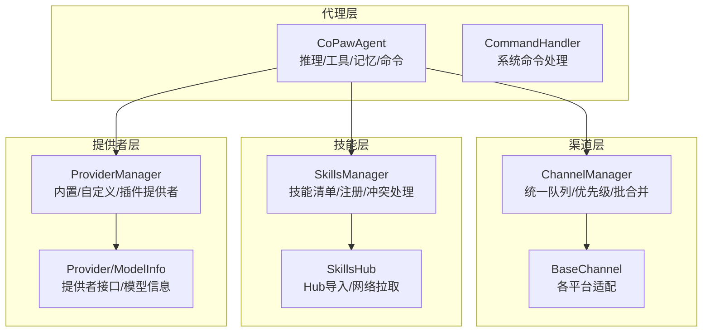
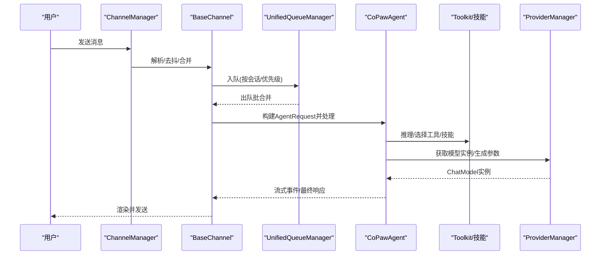
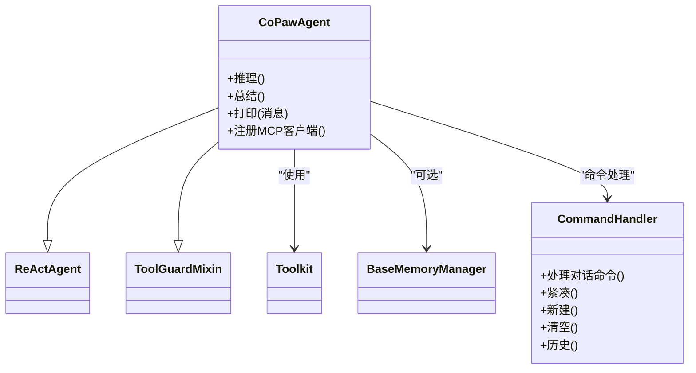
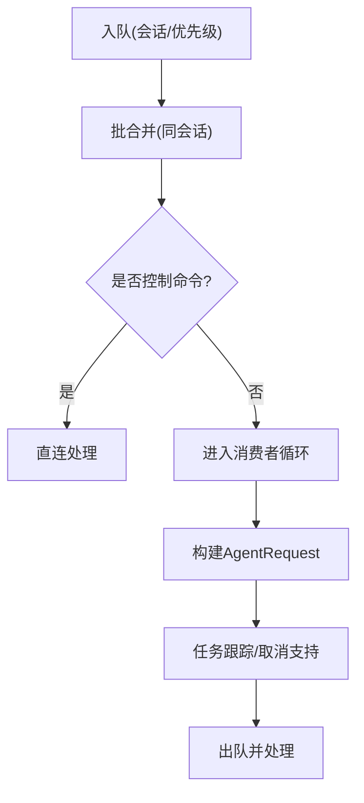
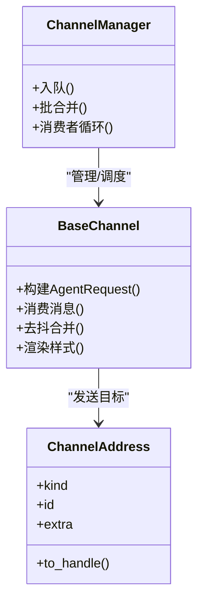
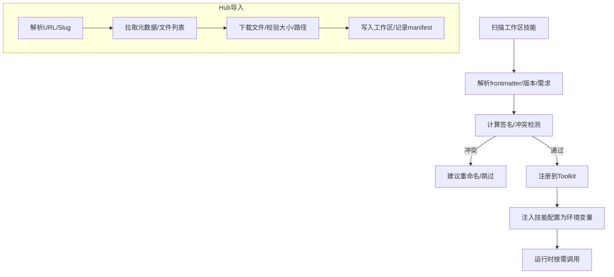
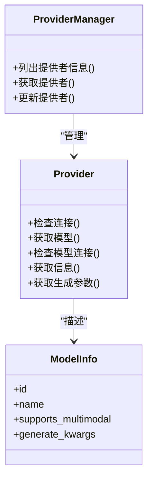
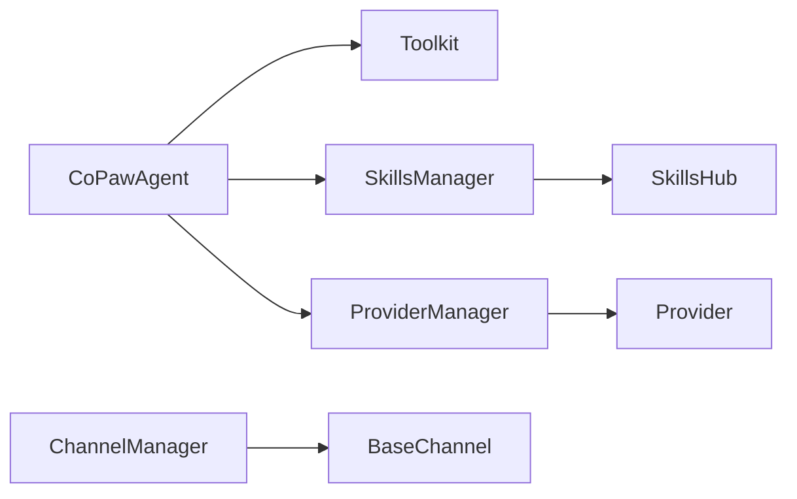

# 核心概念

<cite>
**本文引用的文件**
- [react_agent.py](file://src/copaw/agents/react_agent.py)
- [skills_manager.py](file://src/copaw/agents/skills_manager.py)
- [skills_hub.py](file://src/copaw/agents/skills_hub.py)
- [base.py](file://src/copaw/app/channels/base.py)
- [manager.py](file://src/copaw/app/channels/manager.py)
- [schema.py](file://src/copaw/app/channels/schema.py)
- [provider_manager.py](file://src/copaw/providers/provider_manager.py)
- [provider.py](file://src/copaw/providers/provider.py)
- [command_handler.py](file://src/copaw/agents/command_handler.py)
</cite>

## 目录
1. [引言](#引言)
2. [项目结构](#项目结构)
3. [核心组件](#核心组件)
4. [架构总览](#架构总览)
5. [详细组件分析](#详细组件分析)
6. [依赖分析](#依赖分析)
7. [性能考虑](#性能考虑)
8. [故障排查指南](#故障排查指南)
9. [结论](#结论)

## 引言
本文件面向初学者与高级用户，系统化阐述 CoPaw 的核心概念与实现：代理系统架构、多代理协作机制、渠道抽象设计、技能系统原理、提供者管理模式，并重点解释 ReAct 框架在代理决策中的作用、消息路由机制、技能执行流程、模型提供者适配器设计。文中通过架构图与流程图直观展示模块间关系，并以“章节来源”标注具体文件位置，便于读者快速定位实现细节。

## 项目结构
CoPaw 将“代理（Agent）”“渠道（Channel）”“技能（Skill）”“提供者（Provider）”四大能力域解耦：
- 代理层：负责推理、工具调用、记忆管理与命令处理
- 渠道层：统一接入多平台消息通道，提供队列与优先级调度
- 技能层：动态加载与注册技能，支持从本地工作区与技能池导入
- 提供者层：统一管理模型提供者与聊天模型实例

**图表来源**
- [react_agent.py](file://src/copaw/agents/react_agent.py)
- [command_handler.py](file://src/copaw/agents/command_handler.py)
- [manager.py](file://src/copaw/app/channels/manager.py)
- [base.py](file://src/copaw/app/channels/base.py)
- [skills_manager.py](file://src/copaw/agents/skills_manager.py)
- [skills_hub.py](file://src/copaw/agents/skills_hub.py)
- [provider_manager.py](file://src/copaw/providers/provider_manager.py)
- [provider.py](file://src/copaw/providers/provider.py)

**章节来源**
- [react_agent.py](file://src/copaw/agents/react_agent.py)
- [command_handler.py](file://src/copaw/agents/command_handler.py)
- [manager.py](file://src/copaw/app/channels/manager.py)
- [base.py](file://src/copaw/app/channels/base.py)
- [skills_manager.py](file://src/copaw/agents/skills_manager.py)
- [skills_hub.py](file://src/copaw/agents/skills_hub.py)
- [provider_manager.py](file://src/copaw/providers/provider_manager.py)
- [provider.py](file://src/copaw/providers/provider.py)

## 核心组件
- 代理（CoPawAgent）
  - 基于 ReAct 框架，集成工具箱、技能、记忆与命令处理
  - 支持媒体块主动过滤、被动回退与流式渲染优化
- 渠道（ChannelManager/BaseChannel）
  - 统一队列与批合并，按会话与优先级调度
  - 各平台适配（如 Discord、Telegram、钉钉等），支持去抖与控制命令分流
- 技能（SkillsManager/SkillsHub）
  - 工作区技能目录扫描、注册与冲突化解
  - 支持从 Hub 拉取、校验与落盘，保障一致性与安全
- 提供者（ProviderManager/Provider）
  - 内置/自定义/插件提供者统一管理
  - 模型发现、连接检查、生成参数合并与能力探测

**章节来源**
- [react_agent.py](file://src/copaw/agents/react_agent.py)
- [command_handler.py](file://src/copaw/agents/command_handler.py)
- [manager.py](file://src/copaw/app/channels/manager.py)
- [base.py](file://src/copaw/app/channels/base.py)
- [skills_manager.py](file://src/copaw/agents/skills_manager.py)
- [skills_hub.py](file://src/copaw/agents/skills_hub.py)
- [provider_manager.py](file://src/copaw/providers/provider_manager.py)
- [provider.py](file://src/copaw/providers/provider.py)

## 架构总览
下图展示从“用户输入”到“代理响应”的端到端路径，以及关键模块间的交互关系。

**图表来源**
- [manager.py](file://src/copaw/app/channels/manager.py)
- [base.py](file://src/copaw/app/channels/base.py)
- [react_agent.py](file://src/copaw/agents/react_agent.py)
- [provider_manager.py](file://src/copaw/providers/provider_manager.py)

## 详细组件分析

### 代理系统架构与 ReAct 决策
- 推理与行动分离
  - 代理继承 ReActAgent，具备“思考-行动-观察-再思考”的循环
  - 在推理前进行媒体块主动过滤，避免不支持多模态模型的错误
  - 若首次调用失败且命中媒体相关错误，则自动剥离媒体块并重试
- 工具与技能注册
  - 工具箱按配置启用/禁用，支持异步任务管理工具自动注入
  - 技能从工作区目录动态注册，结合渠道路由与环境变量覆盖
- 记忆与命令
  - 内存压缩与摘要后台任务；系统命令支持紧凑、新建、清空、历史查看等
- MCP 客户端恢复
  - 对状态型 MCP 客户端提供断线重连与重建策略，保证工具可用性

**图表来源**
- [react_agent.py](file://src/copaw/agents/react_agent.py)
- [command_handler.py](file://src/copaw/agents/command_handler.py)

**章节来源**
- [react_agent.py](file://src/copaw/agents/react_agent.py)
- [command_handler.py](file://src/copaw/agents/command_handler.py)

### 多代理协作机制
- 会话隔离与优先级
  - ChannelManager 使用 UnifiedQueueManager 对同一会话的消息进行批合并与优先级调度
  - 控制命令（以“/”开头）绕过队列直接处理，确保即时响应
- 任务跟踪与取消
  - 渠道消费过程通过 TaskTracker 注册任务，支持 /stop 等控制命令取消运行中任务
- 动态替换与热更新
  - 支持在运行时替换单个渠道实例，平滑完成旧实例停止与新实例启动

**图表来源**
- [manager.py](file://src/copaw/app/channels/manager.py)
- [base.py](file://src/copaw/app/channels/base.py)

**章节来源**
- [manager.py](file://src/copaw/app/channels/manager.py)
- [base.py](file://src/copaw/app/channels/base.py)

### 渠道抽象设计与消息路由
- 统一消息类型
  - 使用运行时内容类型（文本/图片/音频/视频/文件/拒绝）与消息体，避免中间封装
- 会话键与去抖
  - 通过渠道解析 session_id 并对无文本内容进行缓冲合并，提升语音/上传场景体验
- 渲染与样式
  - 支持显示/隐藏工具详情、过滤思考内容、内部工具白名单等渲染策略
- 路由协议
  - ChannelAddress 统一发送目标标识，替代分散的元数据键

**图表来源**
- [base.py](file://src/copaw/app/channels/base.py)
- [manager.py](file://src/copaw/app/channels/manager.py)
- [schema.py](file://src/copaw/app/channels/schema.py)

**章节来源**
- [base.py](file://src/copaw/app/channels/base.py)
- [manager.py](file://src/copaw/app/channels/manager.py)
- [schema.py](file://src/copaw/app/channels/schema.py)

### 技能系统原理与 Hub 集成
- 技能清单与注册
  - 从工作区 skills 目录读取技能清单，结合渠道路由决定有效技能
  - 支持内置/自定义/定制化标记，签名一致性用于池同步与冲突检测
- 环境变量注入
  - 将技能配置映射为环境变量，仅注入被当前轮次启用的技能，避免全局污染
- Hub 导入与安全
  - 支持从 Hub 拉取技能包，进行大小/路径/软链限制与缓存控制
  - 失败重试与指数退避，支持取消检查与速率限制提示

**图表来源**
- [skills_manager.py](file://src/copaw/agents/skills_manager.py)
- [skills_hub.py](file://src/copaw/agents/skills_hub.py)

**章节来源**
- [skills_manager.py](file://src/copaw/agents/skills_manager.py)
- [skills_hub.py](file://src/copaw/agents/skills_hub.py)

### 提供者管理模式与模型适配器
- 提供者统一接口
  - Provider 抽象提供连接检查、模型发现、模型连接检查、生成参数合并等能力
  - ModelInfo 描述模型多模态能力与生成参数覆盖
- 提供者管理
  - ProviderManager 管理内置/自定义/插件提供者，持久化存储于专用目录
  - 支持默认注解、迁移与权限控制，保证安全性
- 适配器设计
  - 通过 ChatModel 类型名与实例工厂，屏蔽不同提供者的差异
  - 生成参数深度合并，允许模型级覆盖

**图表来源**
- [provider.py](file://src/copaw/providers/provider.py)
- [provider_manager.py](file://src/copaw/providers/provider_manager.py)

**章节来源**
- [provider.py](file://src/copaw/providers/provider.py)
- [provider_manager.py](file://src/copaw/providers/provider_manager.py)

## 依赖分析
- 组件耦合
  - CoPawAgent 依赖 Toolkit/技能/记忆/命令处理，耦合度高但职责清晰
  - ChannelManager 与 BaseChannel 通过统一接口解耦，便于扩展新渠道
  - SkillsManager 与 SkillsHub 通过清单与签名保持一致性，降低冲突风险
  - ProviderManager 与 Provider 通过抽象接口解耦，支持多实现
- 外部依赖
  - 运行时消息类型与内容类型来自 agentscope_runtime
  - 技能导入依赖 frontmatter/yaml/zip 等标准库
  - 提供者能力依赖第三方模型 API 与探测逻辑

**图表来源**
- [react_agent.py](file://src/copaw/agents/react_agent.py)
- [manager.py](file://src/copaw/app/channels/manager.py)
- [base.py](file://src/copaw/app/channels/base.py)
- [skills_manager.py](file://src/copaw/agents/skills_manager.py)
- [skills_hub.py](file://src/copaw/agents/skills_hub.py)
- [provider_manager.py](file://src/copaw/providers/provider_manager.py)
- [provider.py](file://src/copaw/providers/provider.py)

**章节来源**
- [react_agent.py](file://src/copaw/agents/react_agent.py)
- [manager.py](file://src/copaw/app/channels/manager.py)
- [base.py](file://src/copaw/app/channels/base.py)
- [skills_manager.py](file://src/copaw/agents/skills_manager.py)
- [skills_hub.py](file://src/copaw/agents/skills_hub.py)
- [provider_manager.py](file://src/copaw/providers/provider_manager.py)
- [provider.py](file://src/copaw/providers/provider.py)

## 性能考虑
- 批量合并与去抖
  - ChannelManager 对同会话消息进行批合并，减少重复处理与网络往返
  - BaseChannel 对无文本内容进行缓冲合并，避免频繁触发
- 异步与后台任务
  - 工具箱支持异步执行与后台任务管理工具，避免阻塞主线程
  - 记忆压缩与摘要任务异步执行，不阻塞用户交互
- 缓存与限流
  - 技能 Hub 支持 GitHub 缓存与速率限制提示，合理设置环境变量可提升稳定性
- 多模态能力感知
  - 代理在推理前主动剥离媒体块，避免不必要的错误重试与资源浪费

[本节为通用指导，无需特定文件引用]

## 故障排查指南
- 渠道消息未到达
  - 检查 ChannelManager 是否初始化队列与消费者，确认入队超时日志
  - 核对 BaseChannel 的去抖与合并逻辑是否导致延迟
- 控制命令无效
  - 确认命令前缀“/”与命令名称是否正确，检查 CommandRegistry 的优先级
- 技能未生效或冲突
  - 查看技能清单与签名，确认是否被定制化覆盖或发生冲突
  - 使用建议重命名并重新导入
- 提供者连接失败
  - 使用 ProviderManager 的连接检查与模型连接检查接口
  - 检查 API Key、URL 与速率限制，必要时设置 GITHUB_TOKEN

**章节来源**
- [manager.py](file://src/copaw/app/channels/manager.py)
- [base.py](file://src/copaw/app/channels/base.py)
- [command_handler.py](file://src/copaw/agents/command_handler.py)
- [skills_manager.py](file://src/copaw/agents/skills_manager.py)
- [provider_manager.py](file://src/copaw/providers/provider_manager.py)

## 结论
CoPaw 通过“代理-渠道-技能-提供者”的分层设计，实现了跨平台、可扩展、可治理的智能体系统。ReAct 框架为代理决策提供了稳定范式，渠道层的统一队列与批合并提升了吞吐与用户体验，技能系统与 Hub 集成保障了能力的可持续演进，提供者管理则为多模型生态提供了统一适配器。对于初学者，建议从代理与渠道入手；对于高级用户，可关注技能冲突处理、提供者扩展与性能优化实践。