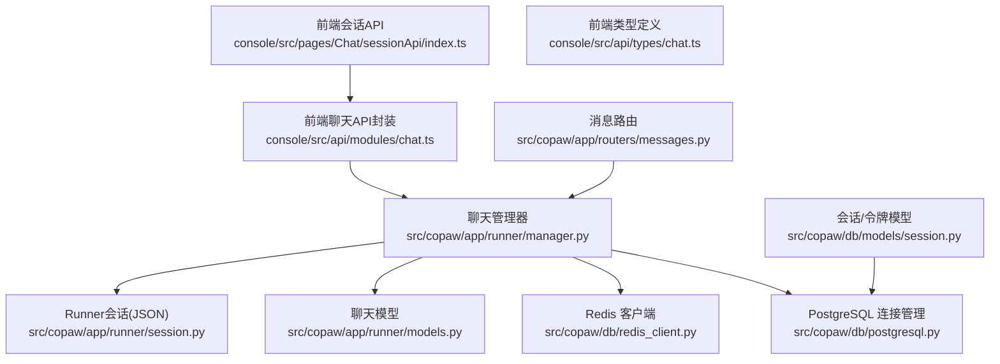
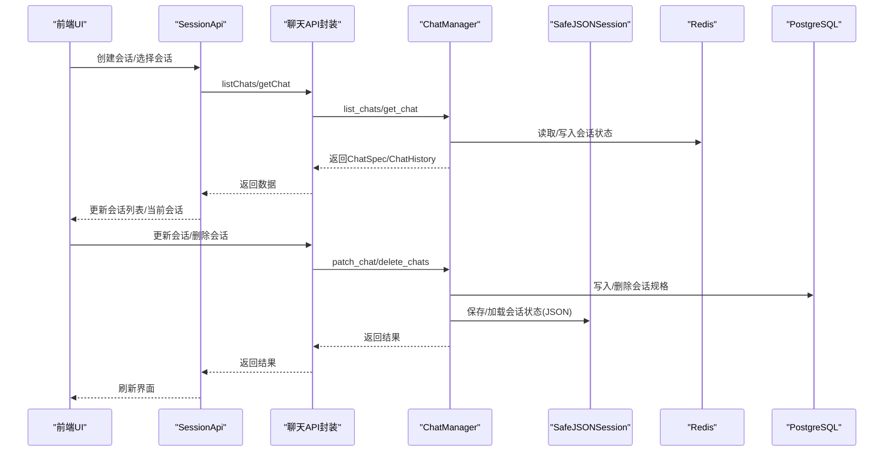
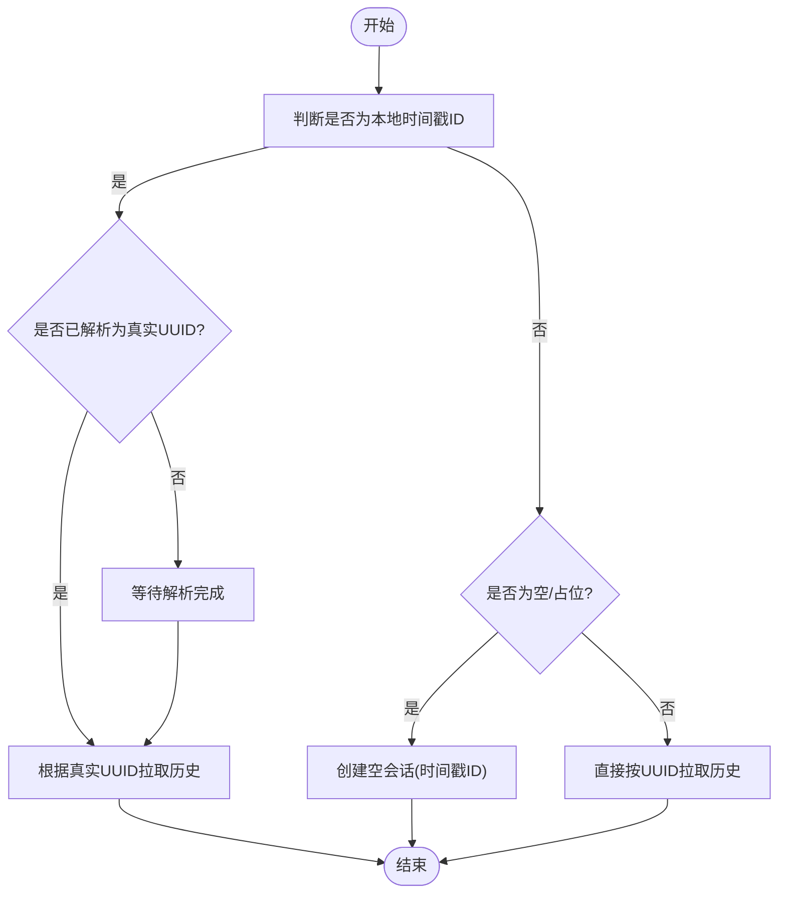
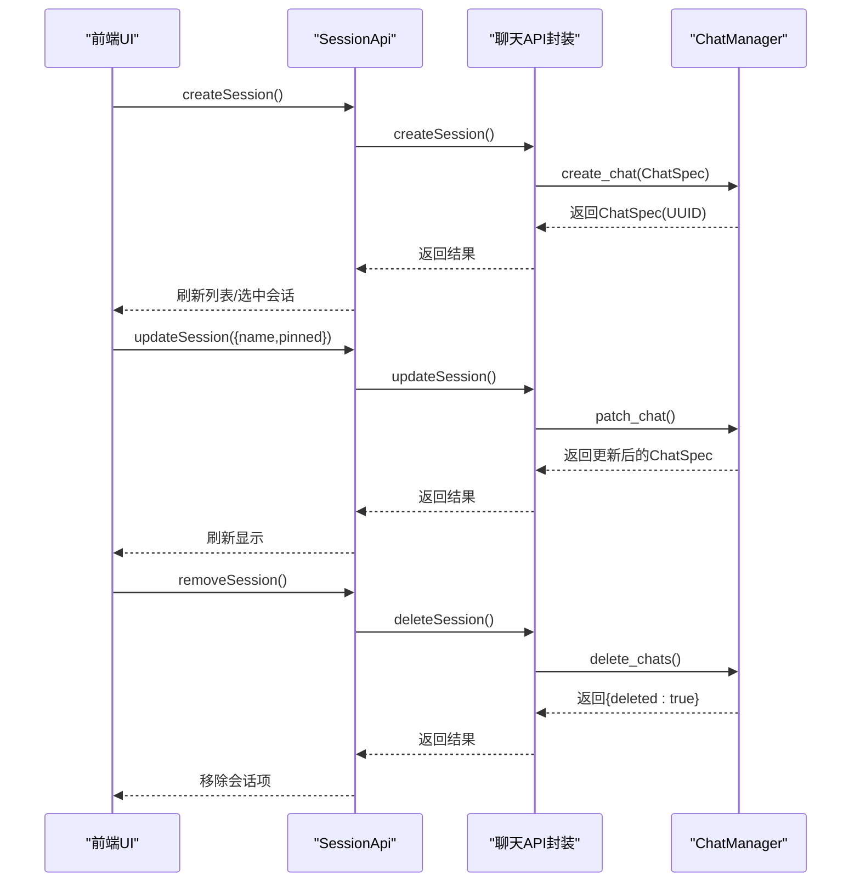
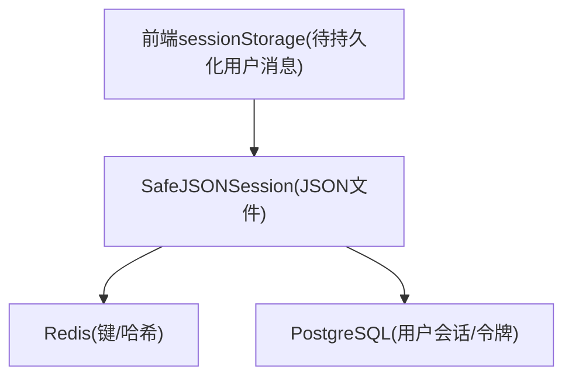
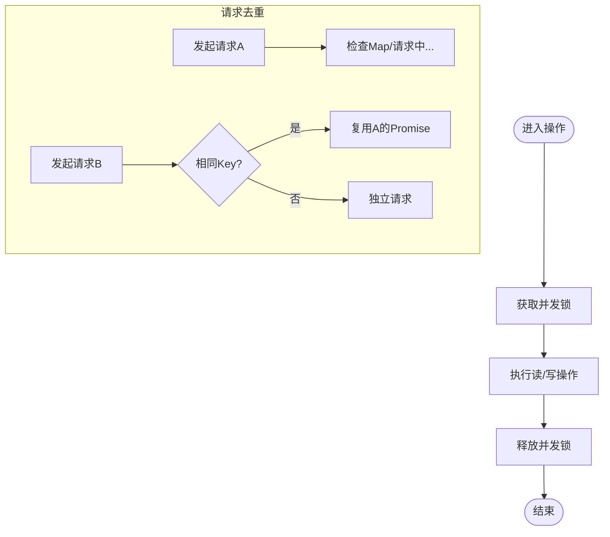
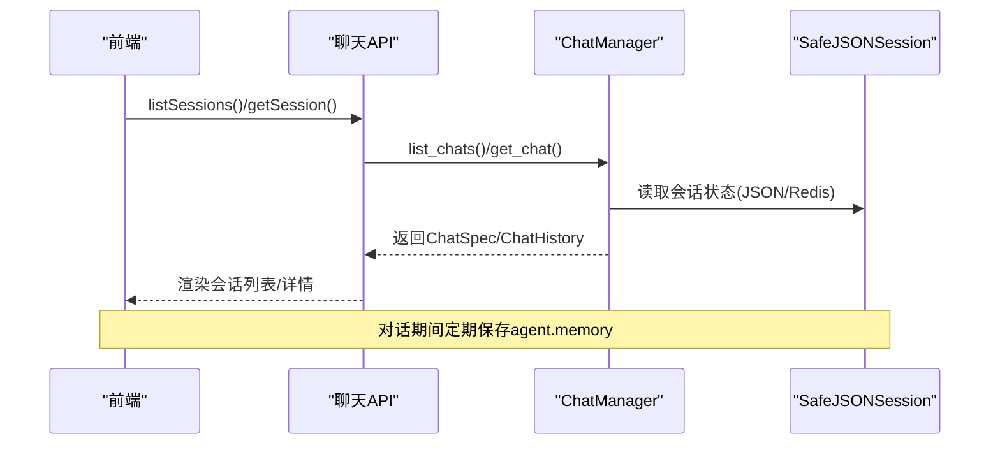
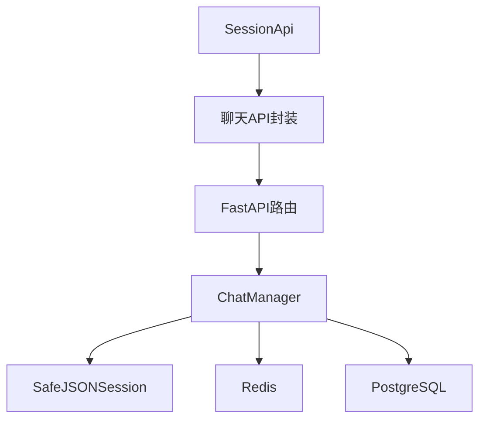

# 会话管理

<cite>
**本文引用的文件**
- [console/src/pages/Chat/sessionApi/index.ts](file://console/src/pages/Chat/sessionApi/index.ts)
- [console/src/api/modules/chat.ts](file://console/src/api/modules/chat.ts)
- [console/src/api/types/chat.ts](file://console/src/api/types/chat.ts)
- [src/copaw/app/runner/session.py](file://src/copaw/app/runner/session.py)
- [src/copaw/app/runner/models.py](file://src/copaw/app/runner/models.py)
- [src/copaw/app/runner/manager.py](file://src/copaw/app/runner/manager.py)
- [src/copaw/app/routers/messages.py](file://src/copaw/app/routers/messages.py)
- [src/copaw/db/models/session.py](file://src/copaw/db/models/session.py)
- [src/copaw/db/redis_client.py](file://src/copaw/db/redis_client.py)
- [src/copaw/db/postgresql.py](file://src/copaw/db/postgresql.py)
- [src/copaw/app/runner/command_dispatch.py](file://src/copaw/app/runner/command_dispatch.py)
</cite>

## 目录
1. [简介](#简介)
2. [项目结构](#项目结构)
3. [核心组件](#核心组件)
4. [架构总览](#架构总览)
5. [详细组件分析](#详细组件分析)
6. [依赖分析](#依赖分析)
7. [性能考量](#性能考量)
8. [故障排查指南](#故障排查指南)
9. [结论](#结论)

## 简介
本文件面向 CoPaw 的会话管理系统，系统性阐述会话标识符（session_id）的生成与解析策略、会话生命周期（创建、更新、销毁）、会话数据的持久化与内存缓存机制，并结合前端会话 API、后端 Runner 会话与聊天管理器、数据库与 Redis 缓存层，给出完整的数据流与控制流说明。同时提供并发访问控制、状态同步机制、安全与性能优化建议，帮助开发者与运维人员高效理解并维护会话子系统。

## 项目结构
围绕会话管理的关键模块分布如下：
- 前端会话 API：负责会话列表、单个会话获取、创建、删除、消息补丁与去重请求。
- 后端 Runner 会话：负责会话状态的文件级持久化（JSON），支持异步读写与键路径更新。
- 后端聊天管理器：负责 ChatSpec 的增删改查、按会话检索、并发锁保护。
- 数据模型与存储：ChatSpec 模型定义、Redis 会话状态、PostgreSQL 企业版会话与令牌表。
- 消息路由：向各渠道发送消息的统一入口，承载会话标识的传递。

图表来源
- [console/src/pages/Chat/sessionApi/index.ts:522-731](file://console/src/pages/Chat/sessionApi/index.ts#L522-L731)
- [console/src/api/modules/chat.ts:99-136](file://console/src/api/modules/chat.ts#L99-L136)
- [src/copaw/app/runner/session.py:73-248](file://src/copaw/app/runner/session.py#L73-L248)
- [src/copaw/app/runner/manager.py:44-252](file://src/copaw/app/runner/manager.py#L44-L252)
- [src/copaw/app/runner/models.py:15-89](file://src/copaw/app/runner/models.py#L15-L89)
- [src/copaw/app/routers/messages.py:78-187](file://src/copaw/app/routers/messages.py#L78-L187)
- [src/copaw/db/redis_client.py:113-149](file://src/copaw/db/redis_client.py#L113-L149)
- [src/copaw/db/postgresql.py:41-187](file://src/copaw/db/postgresql.py#L41-L187)
- [src/copaw/db/models/session.py:21-116](file://src/copaw/db/models/session.py#L21-L116)

章节来源
- [console/src/pages/Chat/sessionApi/index.ts:522-731](file://console/src/pages/Chat/sessionApi/index.ts#L522-L731)
- [src/copaw/app/runner/manager.py:44-252](file://src/copaw/app/runner/manager.py#L44-L252)
- [src/copaw/app/runner/session.py:73-248](file://src/copaw/app/runner/session.py#L73-L248)

## 核心组件
- 前端会话 API（SessionApi）
  - 负责会话列表与单个会话的获取、创建、删除；对并发请求进行去重；在会话切换时触发回调；对“本地时间戳会话”与“后端真实 UUID”进行映射与解析。
  - 支持“最后一条用户消息”的 sessionStorage 缓存，保证断线重连时可补回未持久化的消息。
- Runner 会话（SafeJSONSession）
  - 将 session_id 与 user_id 组合为安全文件名，提供异步读写与键路径更新能力，确保跨平台兼容与事件循环非阻塞。
- 聊天管理器（ChatManager）
  - 提供 ChatSpec 的增删改查、按会话检索、并发锁保护；区分“会话规格”与“会话状态”，前者持久化于 JSON/Redis，后者由 Runner 会话管理。
- 聊天模型（ChatSpec/ChatHistory）
  - 定义会话标识（session_id: channel:user_id）、用户标识、渠道、状态、元数据等字段。
- 消息路由（/messages/send）
  - 接收来自代理的消息发送请求，转发至指定渠道与会话。
- 存储与缓存
  - Redis：会话状态缓存（键值/哈希），支持 TTL、过期与增量操作。
  - PostgreSQL：企业版用户会话与刷新令牌表，用于鉴权与审计。

章节来源
- [console/src/pages/Chat/sessionApi/index.ts:339-731](file://console/src/pages/Chat/sessionApi/index.ts#L339-L731)
- [src/copaw/app/runner/session.py:39-248](file://src/copaw/app/runner/session.py#L39-L248)
- [src/copaw/app/runner/manager.py:17-252](file://src/copaw/app/runner/manager.py#L17-L252)
- [src/copaw/app/runner/models.py:15-89](file://src/copaw/app/runner/models.py#L15-L89)
- [src/copaw/app/routers/messages.py:78-187](file://src/copaw/app/routers/messages.py#L78-L187)
- [src/copaw/db/redis_client.py:113-149](file://src/copaw/db/redis_client.py#L113-L149)
- [src/copaw/db/postgresql.py:41-187](file://src/copaw/db/postgresql.py#L41-L187)
- [src/copaw/db/models/session.py:21-116](file://src/copaw/db/models/session.py#L21-L116)

## 架构总览
下图展示了从前端到后端、再到存储层的完整会话数据流与控制流：

图表来源
- [console/src/pages/Chat/sessionApi/index.ts:522-731](file://console/src/pages/Chat/sessionApi/index.ts#L522-L731)
- [console/src/api/modules/chat.ts:99-136](file://console/src/api/modules/chat.ts#L99-L136)
- [src/copaw/app/runner/manager.py:44-252](file://src/copaw/app/runner/manager.py#L44-L252)
- [src/copaw/app/runner/session.py:73-248](file://src/copaw/app/runner/session.py#L73-L248)
- [src/copaw/db/redis_client.py:113-149](file://src/copaw/db/redis_client.py#L113-L149)
- [src/copaw/db/postgresql.py:41-187](file://src/copaw/db/postgresql.py#L41-L187)

## 详细组件分析

### 会话标识符（session_id）生成与解析
- 生成策略
  - 前端创建会话时，使用本地时间戳作为临时 id，随后通过更新流程解析为后端真实 UUID，并在 UI 中保留原时间戳以便 URL 与内部状态一致。
  - 后端 ChatSpec 的 id 字段为自动生成的 UUID，作为后端真实标识。
- 解析与映射
  - 前端维护 sessionId（channel:user_id）与后端 chat_id（UUID）的映射关系；当本地会话尚未解析时，等待解析完成后再拉取历史。
  - 去重与并发：对同一 sessionId 的并发请求进行去重，避免重复网络请求与状态竞争。

图表来源
- [console/src/pages/Chat/sessionApi/index.ts:562-661](file://console/src/pages/Chat/sessionApi/index.ts#L562-L661)

章节来源
- [console/src/pages/Chat/sessionApi/index.ts:287-303](file://console/src/pages/Chat/sessionApi/index.ts#L287-L303)
- [console/src/pages/Chat/sessionApi/index.ts:562-661](file://console/src/pages/Chat/sessionApi/index.ts#L562-L661)
- [src/copaw/app/runner/models.py:26-31](file://src/copaw/app/runner/models.py#L26-L31)

### 会话生命周期（创建、更新、销毁）
- 创建
  - 前端：生成本地时间戳 ID，填充默认用户与渠道，触发创建回调。
  - 后端：首次消息到达或显式调用时，自动注册 ChatSpec（session_id + user_id + channel），返回后端 UUID。
- 更新
  - 前端：更新会话名称、置顶等元数据，触发解析与列表合并。
  - 后端：ChatManager 在并发锁保护下合并更新，刷新 updated_at。
- 销毁
  - 前端：若存在真实 UUID，则调用后端删除；移除本地会话项并触发移除回调。
  - 后端：仅删除 ChatSpec，不删除会话状态文件；Runner 会话仍保留在磁盘。

图表来源
- [console/src/pages/Chat/sessionApi/index.ts:695-731](file://console/src/pages/Chat/sessionApi/index.ts#L695-L731)
- [console/src/api/modules/chat.ts:116-126](file://console/src/api/modules/chat.ts#L116-L126)
- [src/copaw/app/runner/manager.py:137-191](file://src/copaw/app/runner/manager.py#L137-L191)

章节来源
- [console/src/pages/Chat/sessionApi/index.ts:695-731](file://console/src/pages/Chat/sessionApi/index.ts#L695-L731)
- [console/src/api/modules/chat.ts:116-126](file://console/src/api/modules/chat.ts#L116-L126)
- [src/copaw/app/runner/manager.py:137-191](file://src/copaw/app/runner/manager.py#L137-L191)

### 会话数据持久化与内存缓存
- 文件级持久化（Runner 会话）
  - 使用 JSON 文件保存会话状态，文件名为 user_id + "_" + session_id（或仅 session_id），并对非法字符进行替换以适配多平台。
  - 提供异步读写与键路径更新，支持在不阻塞事件循环的前提下更新部分状态。
- 内存缓存（Redis）
  - 会话状态以键值/哈希形式缓存，支持 TTL、过期与增量更新，提升高并发场景下的读写性能。
- 企业版数据库（PostgreSQL）
  - 用户会话与刷新令牌表用于鉴权与审计，与 Runner 会话状态互为补充。
- 前端缓存
  - 对“最后一条用户消息”进行 sessionStorage 缓存，断线重连时补回未持久化的消息，提升用户体验。

图表来源
- [src/copaw/app/runner/session.py:58-192](file://src/copaw/app/runner/session.py#L58-L192)
- [src/copaw/db/redis_client.py:113-149](file://src/copaw/db/redis_client.py#L113-L149)
- [src/copaw/db/postgresql.py:41-187](file://src/copaw/db/postgresql.py#L41-L187)
- [console/src/pages/Chat/sessionApi/index.ts:311-333](file://console/src/pages/Chat/sessionApi/index.ts#L311-L333)

章节来源
- [src/copaw/app/runner/session.py:58-192](file://src/copaw/app/runner/session.py#L58-L192)
- [src/copaw/db/redis_client.py:113-149](file://src/copaw/db/redis_client.py#L113-L149)
- [console/src/pages/Chat/sessionApi/index.ts:311-333](file://console/src/pages/Chat/sessionApi/index.ts#L311-L333)

### 并发访问控制与状态同步
- 并发锁
  - ChatManager 在所有读写操作上使用 asyncio.Lock，确保多协程并发下的数据一致性。
- 请求去重
  - 对 getSessionList 与 getSession 进行去重，避免重复网络请求与状态竞争。
- 状态同步
  - Runner 会话在对话过程中定期保存 agent.memory 等关键状态，确保异常中断后可恢复。
  - 前端在会话切换时更新 window 变量，保持全局上下文一致。

图表来源
- [src/copaw/app/runner/manager.py:37-40](file://src/copaw/app/runner/manager.py#L37-L40)
- [console/src/pages/Chat/sessionApi/index.ts:364-374](file://console/src/pages/Chat/sessionApi/index.ts#L364-L374)
- [console/src/pages/Chat/sessionApi/index.ts:540-560](file://console/src/pages/Chat/sessionApi/index.ts#L540-L560)

章节来源
- [src/copaw/app/runner/manager.py:37-40](file://src/copaw/app/runner/manager.py#L37-L40)
- [console/src/pages/Chat/sessionApi/index.ts:364-374](file://console/src/pages/Chat/sessionApi/index.ts#L364-L374)
- [console/src/pages/Chat/sessionApi/index.ts:540-560](file://console/src/pages/Chat/sessionApi/index.ts#L540-L560)

### 会话查询接口与状态同步机制
- 查询接口
  - 前端提供 listSessions、getSession、updateSession、deleteSession 等方法，封装后端 /chats/* 路由。
  - 后端提供 /messages/send，允许代理主动向用户所在渠道发送消息，携带目标会话标识。
- 状态同步
  - 前端在获取会话时，将后端 ChatSpec 与本地状态合并，保留 realId 映射与 generating 状态。
  - Runner 会话在命令分发阶段将 agent.memory 等状态写入会话存储，保障会话上下文连续性。

图表来源
- [console/src/api/modules/chat.ts:99-136](file://console/src/api/modules/chat.ts#L99-L136)
- [src/copaw/app/routers/messages.py:78-187](file://src/copaw/app/routers/messages.py#L78-L187)
- [src/copaw/app/runner/command_dispatch.py:264-276](file://src/copaw/app/runner/command_dispatch.py#L264-L276)

章节来源
- [console/src/api/modules/chat.ts:99-136](file://console/src/api/modules/chat.ts#L99-L136)
- [console/src/api/types/chat.ts:3-38](file://console/src/api/types/chat.ts#L3-L38)
- [src/copaw/app/routers/messages.py:78-187](file://src/copaw/app/routers/messages.py#L78-L187)
- [src/copaw/app/runner/command_dispatch.py:264-276](file://src/copaw/app/runner/command_dispatch.py#L264-L276)

## 依赖分析
- 组件耦合
  - 前端 SessionApi 依赖聊天 API 封装与类型定义；聊天 API 封装依赖后端路由（FastAPI）。
  - 后端 ChatManager 依赖仓库层（JSON/Redis），并向上提供统一的 ChatSpec 操作接口。
  - Runner 会话与存储层解耦，通过 SafeJSONSession 抽象文件系统与 Redis。
- 外部依赖
  - Redis：键/哈希操作、TTL 控制。
  - PostgreSQL：企业版用户会话与令牌表，用于鉴权与审计。
  - 异步 I/O：aiofiles 用于非阻塞文件读写。

图表来源
- [console/src/pages/Chat/sessionApi/index.ts:522-731](file://console/src/pages/Chat/sessionApi/index.ts#L522-L731)
- [console/src/api/modules/chat.ts:99-136](file://console/src/api/modules/chat.ts#L99-L136)
- [src/copaw/app/runner/manager.py:44-252](file://src/copaw/app/runner/manager.py#L44-L252)
- [src/copaw/db/redis_client.py:113-149](file://src/copaw/db/redis_client.py#L113-L149)
- [src/copaw/db/postgresql.py:41-187](file://src/copaw/db/postgresql.py#L41-L187)

章节来源
- [console/src/pages/Chat/sessionApi/index.ts:522-731](file://console/src/pages/Chat/sessionApi/index.ts#L522-L731)
- [src/copaw/app/runner/manager.py:44-252](file://src/copaw/app/runner/manager.py#L44-L252)

## 性能考量
- I/O 非阻塞
  - 使用 aiofiles 实现异步文件读写，避免阻塞事件循环。
- 缓存命中
  - Redis 缓存会话状态，减少对文件系统的频繁读写；合理设置 TTL，平衡一致性与性能。
- 并发控制
  - ChatManager 使用 asyncio.Lock，避免高并发下的竞态条件与脏写。
- 请求去重
  - 对会话列表与单个会话的并发请求进行去重，降低网络与存储压力。
- 前端体验
  - sessionStorage 缓存最后一条用户消息，减少后端持久化延迟带来的感知延迟。

## 故障排查指南
- 会话解析失败
  - 现象：本地时间戳会话无法解析为真实 UUID。
  - 排查：确认 updateSession 是否触发了解析流程；检查列表合并逻辑与 realId 字段。
- 删除会话无效
  - 现象：前端删除后后端仍可见。
  - 排查：确认 deleteSession 是否传入了真实 UUID；注意前端对本地时间戳会话的处理差异。
- 并发冲突导致的数据不一致
  - 现象：多个请求同时更新会话导致状态丢失。
  - 排查：确认 ChatManager 是否在所有操作上持有并发锁；检查前端去重 Map 是否正确清理。
- 会话状态未持久化
  - 现象：重启后会话上下文丢失。
  - 排查：确认 SafeJSONSession 的保存路径与权限；检查 Runner 会话保存调用时机。

章节来源
- [console/src/pages/Chat/sessionApi/index.ts:670-731](file://console/src/pages/Chat/sessionApi/index.ts#L670-L731)
- [src/copaw/app/runner/manager.py:37-40](file://src/copaw/app/runner/manager.py#L37-L40)
- [src/copaw/app/runner/session.py:73-192](file://src/copaw/app/runner/session.py#L73-L192)

## 结论
CoPaw 的会话管理通过“前端会话 API + 后端 Runner 会话 + 聊天管理器 + 存储层”的分层设计，实现了会话标识符的可靠生成与解析、生命周期的完整管理、以及状态的持久化与缓存。并发锁与请求去重机制保障了高并发场景下的稳定性，而文件与 Redis 的双层持久化策略兼顾了灵活性与性能。结合本文提供的架构图、流程图与排障建议，可帮助团队在开发与运维中高效地扩展与维护会话子系统。