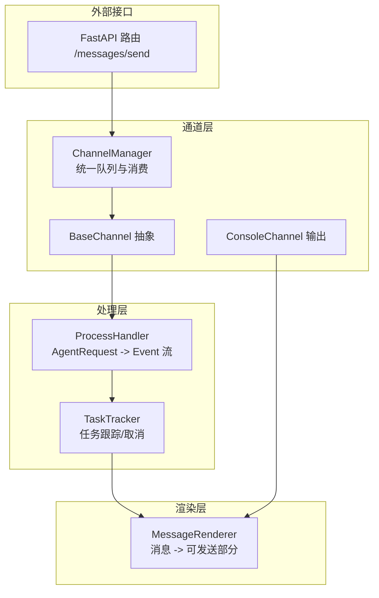
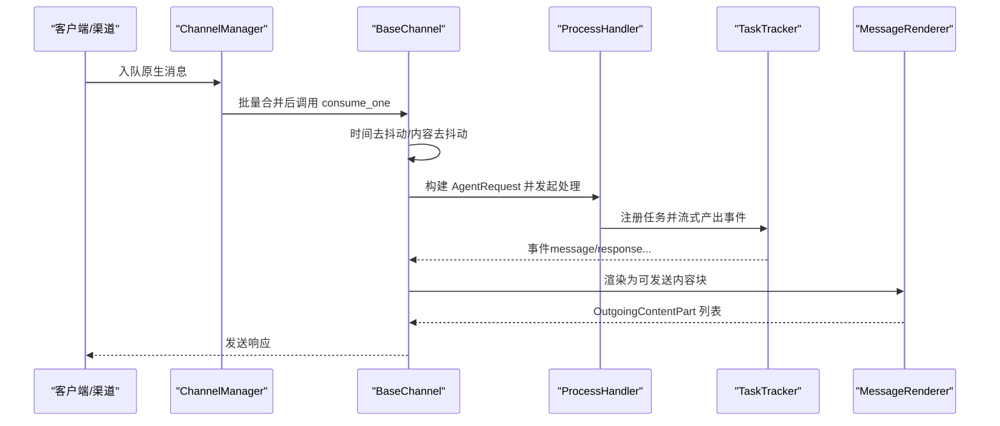
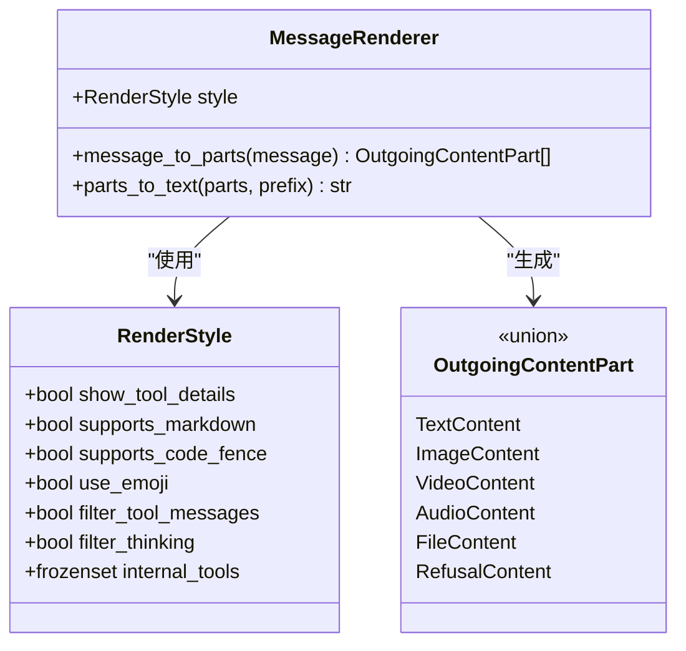
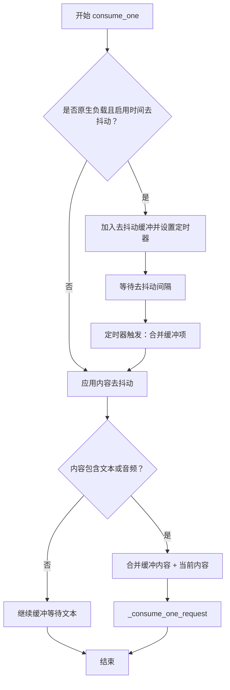
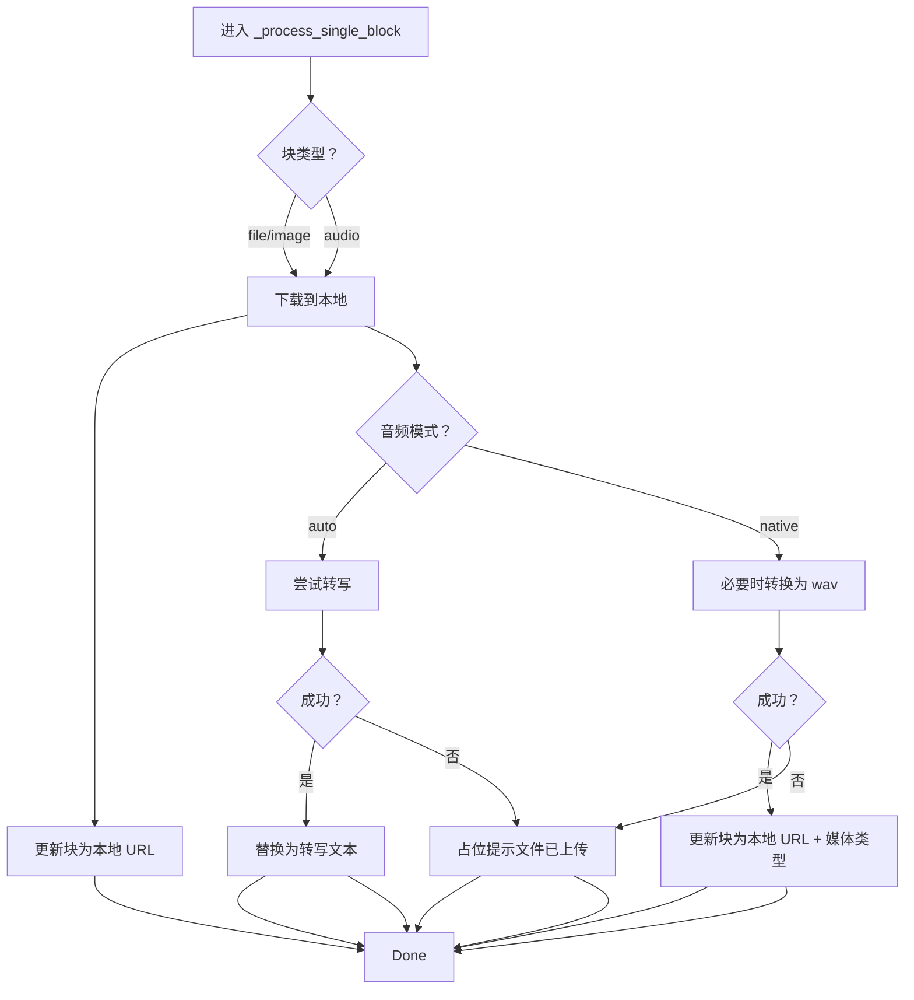
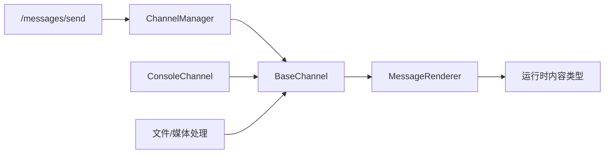

# 消息处理管道

<cite>
**本文引用的文件**
- [renderer.py](file://src/copaw/app/channels/renderer.py)
- [base.py](file://src/copaw/app/channels/base.py)
- [console/channel.py](file://src/copaw/app/channels/console/channel.py)
- [manager.py](file://src/copaw/app/channels/manager.py)
- [message_processing.py](file://src/copaw/agents/utils/message_processing.py)
- [messages.py](file://src/copaw/app/routers/messages.py)
- [exceptions.py](file://src/copaw/exceptions.py)
- [runner.py](file://src/copaw/app/runner/runner.py)
</cite>

## 目录
1. [简介](#简介)
2. [项目结构](#项目结构)
3. [核心组件](#核心组件)
4. [架构总览](#架构总览)
5. [详细组件分析](#详细组件分析)
6. [依赖分析](#依赖分析)
7. [性能考虑](#性能考虑)
8. [故障排除指南](#故障排除指南)
9. [结论](#结论)
10. [附录](#附录)

## 简介
本文件系统性阐述 CoPaw 的消息处理管道，覆盖从消息接收、解析、内容转换、渲染输出到响应发送的完整链路。重点包括：
- 消息渲染器（MessageRenderer）如何处理文本、图片、音频、视频等多模态内容
- 去抖动机制（debounce）的时间去抖动与内容去抖动实现
- 错误处理与异常转换策略
- 性能优化与调试技巧

## 项目结构
CoPaw 的消息处理以“通道（Channel）”为核心抽象，统一接入来自不同平台的消息，并通过统一的处理流程将其转化为 AgentRequest，再由统一的处理器产生事件流（Event Stream），最终经由渲染器（MessageRenderer）转换为可发送的“运行时内容块（OutgoingContentPart）”。

图表来源
- [manager.py:68-200](file://src/copaw/app/channels/manager.py#L68-L200)
- [base.py:70-127](file://src/copaw/app/channels/base.py#L70-L127)
- [renderer.py:78-384](file://src/copaw/app/channels/renderer.py#L78-L384)
- [messages.py:78-187](file://src/copaw/app/routers/messages.py#L78-L187)

章节来源
- [manager.py:39-66](file://src/copaw/app/channels/manager.py#L39-L66)
- [base.py:70-127](file://src/copaw/app/channels/base.py#L70-L127)
- [renderer.py:78-384](file://src/copaw/app/channels/renderer.py#L78-L384)
- [messages.py:78-187](file://src/copaw/app/routers/messages.py#L78-L187)

## 核心组件
- 渲染器（MessageRenderer）
  - 将消息对象转换为“可发送部分”（文本、图片、音频、视频、文件、拒绝信息）
  - 支持样式控制：是否显示工具详情、过滤思考内容、是否支持 Markdown/代码围栏/Emoji
- 基类通道（BaseChannel）
  - 统一的去抖动（时间去抖动与内容去抖动）
  - 将原生消息解析为 AgentRequest
  - 通过事件流驱动渲染与发送
- 控制台通道（ConsoleChannel）
  - 将完成的消息事件打印到终端，支持媒体目录解析与编码修复
- 队列管理（ChannelManager）
  - 统一队列、批量合并、消费者循环
- 文件与媒体处理（agents utils）
  - 下载与本地化、音频转写或格式转换、补充“已下载”提示
- 外部发送接口（FastAPI 路由）
  - 提供代理发送文本消息的能力

章节来源
- [renderer.py:78-384](file://src/copaw/app/channels/renderer.py#L78-L384)
- [base.py:70-127](file://src/copaw/app/channels/base.py#L70-L127)
- [console/channel.py:63-140](file://src/copaw/app/channels/console/channel.py#L63-L140)
- [manager.py:39-66](file://src/copaw/app/channels/manager.py#L39-L66)
- [message_processing.py:25-476](file://src/copaw/agents/utils/message_processing.py#L25-L476)
- [messages.py:78-187](file://src/copaw/app/routers/messages.py#L78-L187)

## 架构总览
消息处理链路的关键步骤如下：
1. 接收原生消息（来自各渠道或 API）
2. 解析为 AgentRequest（含会话标识、用户标识、内容块）
3. 应用去抖动（时间去抖动与内容去抖动）
4. 进入统一处理流程，生成事件流（message/response 等）
5. 渲染器将事件转换为可发送内容块
6. 发送至目标通道（如控制台）

图表来源
- [manager.py:39-66](file://src/copaw/app/channels/manager.py#L39-L66)
- [base.py:659-758](file://src/copaw/app/channels/base.py#L659-L758)
- [base.py:431-536](file://src/copaw/app/channels/base.py#L431-L536)
- [renderer.py:87-350](file://src/copaw/app/channels/renderer.py#L87-L350)

## 详细组件分析

### 消息渲染器（MessageRenderer）
MessageRenderer 的职责是将消息对象转换为“可发送部分”，支持多种内容类型与样式控制。

- 输入
  - 消息类型（如 reasoning、function_call、plugin_call、mcp_tool_call 等）
  - 内容块列表（文本、图片、音频、视频、文件、数据块、拒绝信息等）
- 样式控制
  - 是否显示工具详情、是否过滤工具消息、是否过滤思考内容、是否支持 Markdown/代码围栏/Emoji
- 输出
  - 文本内容、图片内容、视频内容、音频内容、文件内容、拒绝内容

图表来源
- [renderer.py:37-384](file://src/copaw/app/channels/renderer.py#L37-L384)

章节来源
- [renderer.py:78-384](file://src/copaw/app/channels/renderer.py#L78-L384)

### 去抖动机制（Debounce）
CoPaw 在 BaseChannel 中实现了两类去抖动，确保消息在多片段输入场景下的正确聚合与发送。

- 内容去抖动（No-text Debounce）
  - 若内容中不含文本或拒绝信息，则缓冲该会话的内容，等待后续包含文本的内容到达后再一次性处理
  - 音频-only 的语音消息可绕过此缓冲，立即处理（视为完整输入）
- 时间去抖动（Time Debounce）
  - 对原生字典负载（含 content_parts）按键（通常为 session_id）进行合并，延迟一定秒数后一次性处理
  - 合并策略：拼接 content_parts，保留 meta 关键字段（如回复句柄、回话 Webhook 等）

图表来源
- [base.py:659-758](file://src/copaw/app/channels/base.py#L659-L758)
- [base.py:249-281](file://src/copaw/app/channels/base.py#L249-L281)
- [base.py:682-694](file://src/copaw/app/channels/base.py#L682-L694)

章节来源
- [base.py:119-127](file://src/copaw/app/channels/base.py#L119-L127)
- [base.py:249-281](file://src/copaw/app/channels/base.py#L249-L281)
- [base.py:659-758](file://src/copaw/app/channels/base.py#L659-L758)

### 文件与媒体处理（下载、转写、格式转换）
当消息包含文件、图片、音频、视频等块时，系统会进行本地化与必要的格式转换，以适配下游模型或通道要求。

- 下载策略
  - 支持 base64 与 URL 两种来源；本地路径可直接使用
- 音频处理模式
  - auto：优先尝试转写；若失败则显示“已上传文件”的占位提示
  - native：尝试将音频转换为模型支持格式（如 wav），失败则显示占位提示
- 补充提示
  - 成功下载后，在消息中插入“已下载到本地路径”的文本提示

图表来源
- [message_processing.py:25-476](file://src/copaw/agents/utils/message_processing.py#L25-L476)

章节来源
- [message_processing.py:25-476](file://src/copaw/agents/utils/message_processing.py#L25-L476)

### 控制台通道（ConsoleChannel）
ConsoleChannel 作为输出通道，负责将完成的消息事件以人类可读的方式打印到终端，并支持媒体目录解析与 Windows 编码修复。

- 会话 ID 解析
  - 优先使用显式的 meta['session_id']，否则回退为 'console:<sender_id>'
- 媒体目录
  - 使用工作区 media 目录或默认媒体目录，不存在则自动创建
- 输出
  - 使用渲染器将事件转换为文本或富文本形式输出

章节来源
- [console/channel.py:63-140](file://src/copaw/app/channels/console/channel.py#L63-L140)
- [console/channel.py:192-200](file://src/copaw/app/channels/console/channel.py#L192-L200)

### 统一队列与消费（ChannelManager）
ChannelManager 负责：
- 统一队列与消费者循环
- 批量合并（同键 payload 合并 content_parts 或输入内容）
- 分发到具体通道实例进行处理

章节来源
- [manager.py:39-66](file://src/copaw/app/channels/manager.py#L39-L66)
- [manager.py:372-443](file://src/copaw/app/channels/manager.py#L372-L443)

### 外部发送接口（/messages/send）
提供代理发送文本消息的能力，允许外部系统通过 API 主动向指定通道发送消息。

- 请求参数
  - channel、target_user、target_session、text
- 返回
  - 成功/失败状态与说明
- 异常
  - 通道未初始化、找不到代理、发送失败等

章节来源
- [messages.py:78-187](file://src/copaw/app/routers/messages.py#L78-L187)

## 依赖分析
- 渲染器依赖运行时内容类型（TextContent、ImageContent、AudioContent、VideoContent、FileContent、RefusalContent）
- BaseChannel 依赖渲染器与样式配置，同时维护去抖动缓冲与定时器
- ChannelManager 依赖统一队列管理器，负责批量合并与分发
- 控制台通道继承 BaseChannel，复用去抖动与渲染能力
- 文件与媒体处理模块独立于通道层，为消息内容提供本地化与格式转换

图表来源
- [renderer.py:24-34](file://src/copaw/app/channels/renderer.py#L24-L34)
- [base.py:36-117](file://src/copaw/app/channels/base.py#L36-L117)
- [manager.py:21-81](file://src/copaw/app/channels/manager.py#L21-L81)
- [console/channel.py:32-44](file://src/copaw/app/channels/console/channel.py#L32-L44)
- [messages.py:11-16](file://src/copaw/app/routers/messages.py#L11-L16)

## 性能考虑
- 去抖动
  - 时间去抖动通过延迟合并减少重复请求与渲染次数
  - 内容去抖动避免空文本或仅音频的中间片段引发无效处理
- 批量合并
  - ChannelManager 在同一会话键下合并多个 payload，降低处理开销
- 渲染与发送
  - 渲染器按需生成内容块，避免不必要的序列化与网络传输
- I/O 优化
  - 文件/媒体下载采用本地化存储，避免重复下载
  - 音频转换使用临时文件与超时保护，防止阻塞

## 故障排除指南
- 常见异常与转换
  - 模型相关异常会被转换为统一的运行时异常，便于前端与日志识别
  - 通道通信错误封装为 ChannelError，携带通道名与原始详情
- 错误捕获与诊断
  - 处理流程中对异常进行记录与转换，并在 Runner 层生成查询错误转储文件，便于定位问题
- 调试建议
  - 开启详细日志，观察去抖动缓冲与合并行为
  - 检查渲染样式配置，确认是否过滤了工具消息或思考内容
  - 对于音频问题，检查 ffmpeg 是否可用及音频模式配置
  - 对于媒体下载失败，确认源地址与权限

章节来源
- [exceptions.py:165-254](file://src/copaw/exceptions.py#L165-L254)
- [runner.py:544-577](file://src/copaw/app/runner/runner.py#L544-L577)

## 结论
CoPaw 的消息处理管道通过“通道抽象 + 去抖动 + 统一处理 + 渲染输出”的设计，实现了跨渠道的一致性与高扩展性。渲染器与文件/媒体处理模块提供了强大的内容转换能力，结合去抖动机制与统一队列，有效提升了吞吐与用户体验。建议在生产环境中合理配置去抖动参数与渲染样式，并完善日志与错误转储以提升可观测性与可维护性。

## 附录
- 代码示例路径（不展示具体代码内容）
  - 去抖动与内容合并：[base.py:659-758](file://src/copaw/app/channels/base.py#L659-L758)
  - 渲染策略与样式控制：[renderer.py:78-384](file://src/copaw/app/channels/renderer.py#L78-L384)
  - 文件/媒体下载与音频处理：[message_processing.py:25-476](file://src/copaw/agents/utils/message_processing.py#L25-L476)
  - 控制台输出与媒体目录：[console/channel.py:63-140](file://src/copaw/app/channels/console/channel.py#L63-L140)
  - 统一队列与批量合并：[manager.py:39-66](file://src/copaw/app/channels/manager.py#L39-L66)
  - 外部发送接口：[messages.py:78-187](file://src/copaw/app/routers/messages.py#L78-L187)
  - 异常转换与错误转储：[exceptions.py:165-254](file://src/copaw/exceptions.py#L165-L254)、[runner.py:544-577](file://src/copaw/app/runner/runner.py#L544-L577)