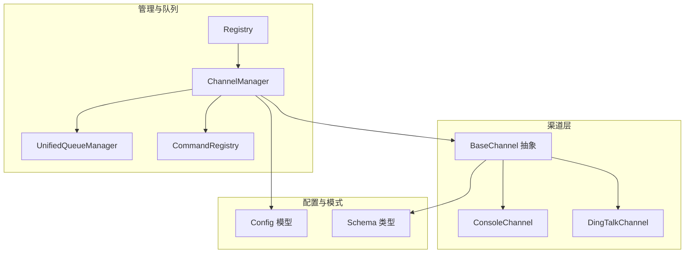
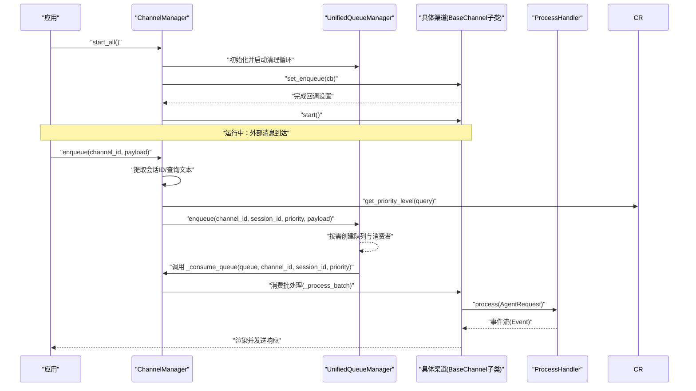
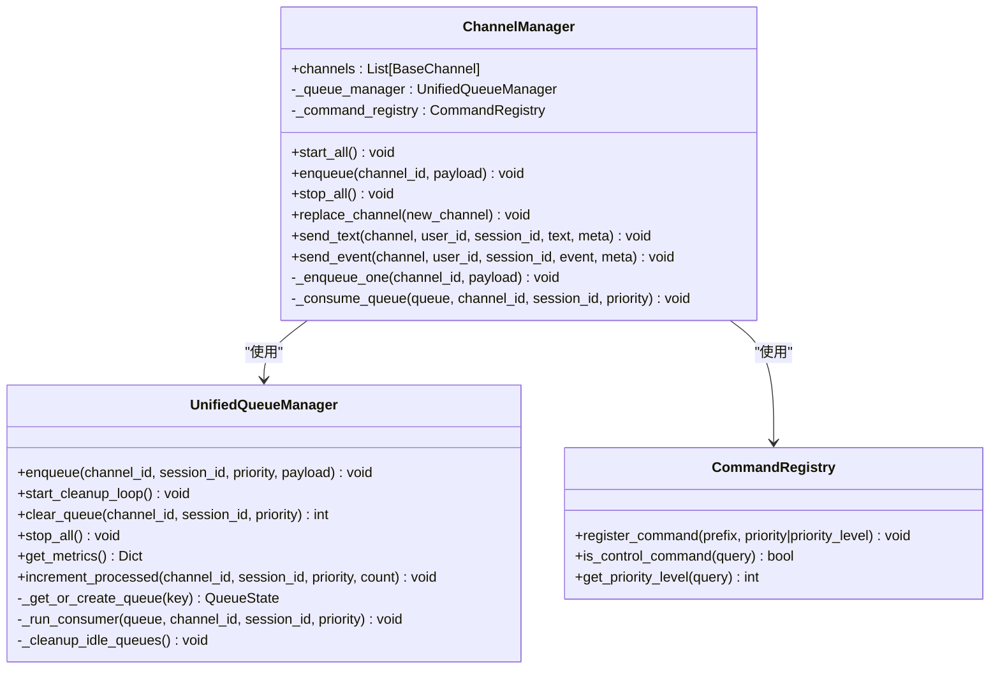
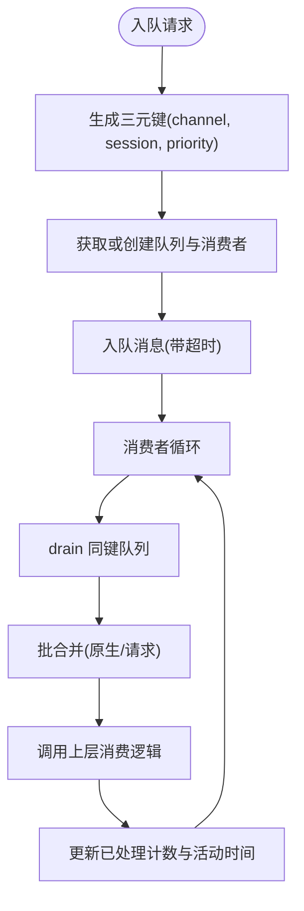
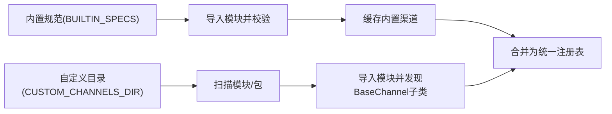
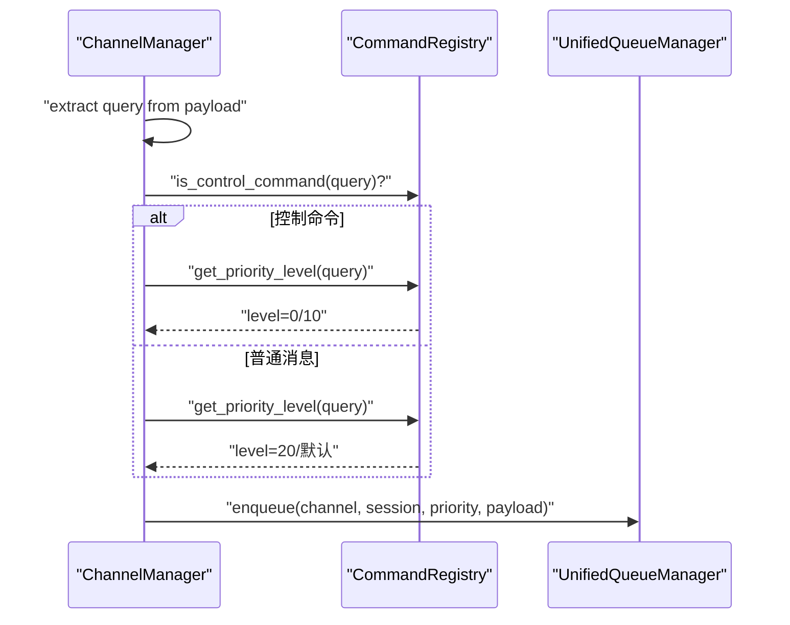
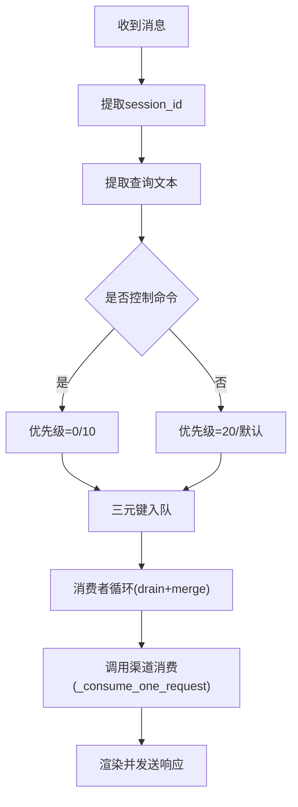
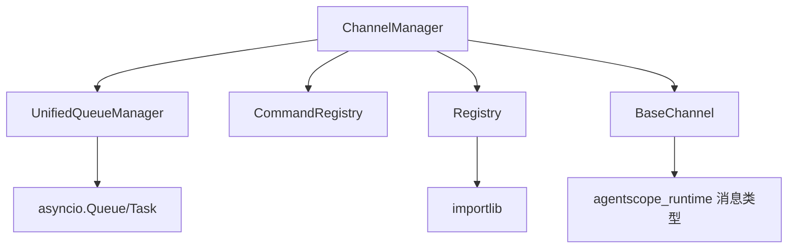

# 渠道管理器

<cite>
**本文引用的文件**
- [manager.py](file://src/copaw/app/channels/manager.py)
- [unified_queue_manager.py](file://src/copaw/app/channels/unified_queue_manager.py)
- [registry.py](file://src/copaw/app/channels/registry.py)
- [base.py](file://src/copaw/app/channels/base.py)
- [command_registry.py](file://src/copaw/app/channels/command_registry.py)
- [schema.py](file://src/copaw/app/channels/schema.py)
- [config.py](file://src/copaw/config/config.py)
- [console/channel.py](file://src/copaw/app/channels/console/channel.py)
- [dingtalk/channel.py](file://src/copaw/app/channels/dingtalk/channel.py)
</cite>

## 目录
1. [简介](#简介)
2. [项目结构](#项目结构)
3. [核心组件](#核心组件)
4. [架构总览](#架构总览)
5. [详细组件分析](#详细组件分析)
6. [依赖分析](#依赖分析)
7. [性能考量](#性能考量)
8. [故障排查指南](#故障排查指南)
9. [结论](#结论)
10. [附录](#附录)

## 简介
本文件面向 CoPaw 的渠道管理器（ChannelManager）与统一队列系统，系统性阐述其如何统一管理多即时通讯渠道（如 Console、DingTalk、Feishu、Telegram 等），包括渠道注册、队列管理、优先级调度、负载均衡与错误恢复策略。文档同时解析统一队列管理器（UnifiedQueueManager）的三元键隔离模型、按需消费者创建与空闲清理机制，并说明渠道注册表（Registry）的动态加载、配置验证与状态监控能力。最后提供最佳实践与性能优化建议。

## 项目结构
围绕渠道管理的核心模块位于 src/copaw/app/channels 下，关键文件如下：
- manager.py：ChannelManager 实现，负责渠道生命周期、统一入队与消费、替换与发送接口
- unified_queue_manager.py：统一队列管理器，基于三元键（channel_id, session_id, priority_level）的并发隔离与按需消费者
- registry.py：渠道注册表，内置与自定义渠道的动态发现与缓存
- base.py：所有渠道的基础抽象，定义统一的消费协议、去抖动、内容合并与任务跟踪
- command_registry.py：命令优先级注册表，用于根据用户查询提取优先级并路由到对应队列
- schema.py：渠道类型与地址协议定义
- config.py：渠道配置模型（如 ConsoleConfig、DingTalkConfig 等）
- 具体渠道实现示例：console/channel.py、dingtalk/channel.py

图表来源
- [manager.py:68-711](file://src/copaw/app/channels/manager.py#L68-L711)
- [unified_queue_manager.py:60-498](file://src/copaw/app/channels/unified_queue_manager.py#L60-L498)
- [registry.py:190-195](file://src/copaw/app/channels/registry.py#L190-L195)
- [base.py:70-800](file://src/copaw/app/channels/base.py#L70-L800)
- [command_registry.py:23-267](file://src/copaw/app/channels/command_registry.py#L23-L267)
- [schema.py:12-71](file://src/copaw/app/channels/schema.py#L12-L71)
- [config.py:92-200](file://src/copaw/config/config.py#L92-L200)

章节来源
- [manager.py:68-711](file://src/copaw/app/channels/manager.py#L68-L711)
- [unified_queue_manager.py:60-498](file://src/copaw/app/channels/unified_queue_manager.py#L60-L498)
- [registry.py:190-195](file://src/copaw/app/channels/registry.py#L190-L195)
- [base.py:70-800](file://src/copaw/app/channels/base.py#L70-L800)
- [command_registry.py:23-267](file://src/copaw/app/channels/command_registry.py#L23-L267)
- [schema.py:12-71](file://src/copaw/app/channels/schema.py#L12-L71)
- [config.py:92-200](file://src/copaw/config/config.py#L92-L200)

## 核心组件
- ChannelManager：统一持有各渠道实例，注入统一处理函数（ProcessHandler），在启动时初始化 UnifiedQueueManager 并为每个渠道设置入队回调；提供替换单个渠道、发送事件与文本等能力。
- UnifiedQueueManager：以三元键（channel_id, session_id, priority_level）为维度，为每个键维护独立队列与消费者任务；支持按需创建消费者、空闲清理、指标采集与批量处理。
- Registry：内置渠道映射与必需项校验，动态扫描自定义渠道目录，缓存内置渠道，提供统一注册表查询。
- BaseChannel：定义渠道通用协议，包括从原生消息到 AgentRequest 的转换、内容合并、时间去抖、任务跟踪、错误处理与发送路径。
- CommandRegistry：命令前缀到优先级的映射，支持“紧急/高/普通/低”等预设级别与扩展级别，用于消息入队时的优先级分类。
- Schema：渠道类型标识、统一路由地址协议与消息转换协议。
- Config：各类渠道的配置模型，供 ChannelManager.from_config 使用。

章节来源
- [manager.py:68-711](file://src/copaw/app/channels/manager.py#L68-L711)
- [unified_queue_manager.py:60-498](file://src/copaw/app/channels/unified_queue_manager.py#L60-L498)
- [registry.py:190-195](file://src/copaw/app/channels/registry.py#L190-L195)
- [base.py:70-800](file://src/copaw/app/channels/base.py#L70-L800)
- [command_registry.py:23-267](file://src/copaw/app/channels/command_registry.py#L23-L267)
- [schema.py:12-71](file://src/copaw/app/channels/schema.py#L12-L71)
- [config.py:92-200](file://src/copaw/config/config.py#L92-L200)

## 架构总览
下图展示了 ChannelManager 与 UnifiedQueueManager 的协作关系，以及渠道实例如何通过统一的入队回调接入队列系统。

图表来源
- [manager.py:447-526](file://src/copaw/app/channels/manager.py#L447-L526)
- [unified_queue_manager.py:119-273](file://src/copaw/app/channels/unified_queue_manager.py#L119-L273)
- [base.py:659-800](file://src/copaw/app/channels/base.py#L659-L800)
- [command_registry.py:175-218](file://src/copaw/app/channels/command_registry.py#L175-L218)

## 详细组件分析

### ChannelManager 组件分析
- 职责
  - 从环境或配置创建渠道实例，过滤可用渠道
  - 注入统一处理函数与回调（on_reply_sent）
  - 初始化 UnifiedQueueManager，设置每个渠道的入队回调
  - 提供替换单个渠道、发送事件与文本、清理指定队列等能力
- 关键流程
  - 启动：start_all() 创建 UQM、启动清理循环、为渠道设置入队回调并逐一启动
  - 入队：enqueue() 在事件循环线程安全地调用内部 _enqueue_one()，提取会话ID与优先级后委托 UQM.enqueue()
  - 消费：_consume_queue() 从队列取出一批消息，进行批合并与处理，更新已处理计数
  - 停止：stop_all() 取消待处理入队任务，停止 UQM，再逐个停止渠道
  - 替换：replace_channel() 支持热替换单个渠道，避免阻塞主循环
- 错误恢复
  - 入队超时保护与异常记录
  - 消费者取消与异常日志
  - 停止阶段等待与告警

图表来源
- [manager.py:68-711](file://src/copaw/app/channels/manager.py#L68-L711)
- [unified_queue_manager.py:60-498](file://src/copaw/app/channels/unified_queue_manager.py#L60-L498)
- [command_registry.py:23-267](file://src/copaw/app/channels/command_registry.py#L23-L267)

章节来源
- [manager.py:68-711](file://src/copaw/app/channels/manager.py#L68-L711)

### UnifiedQueueManager 组件分析
- 三元键隔离
  - QueueKey = (channel_id, session_id, priority_level)，确保同一键严格串行，不同键并发执行
- 按需消费者
  - 首次入队时创建队列与消费者任务，避免固定工作池带来的资源浪费
- 批量处理
  - 消费者循环中对同键队列进行 drain + merge，提升吞吐
- 空闲清理
  - 后台任务定期扫描空队列，超过空闲阈值则取消消费者并移除
- 指标与可观测性
  - 提供 get_metrics() 返回队列总数、每个队列的大小、处理计数、年龄与空闲时长

图表来源
- [unified_queue_manager.py:119-273](file://src/copaw/app/channels/unified_queue_manager.py#L119-L273)

章节来源
- [unified_queue_manager.py:60-498](file://src/copaw/app/channels/unified_queue_manager.py#L60-L498)

### 渠道注册表（Registry）实现机制
- 内置渠道
  - 通过 _BUILTIN_SPECS 映射内置渠道名称到模块与类名，统一导入并校验是否为 BaseChannel 子类
  - 必需渠道失败直接抛出异常，非必需渠道仅记录调试日志
  - 缓存内置渠道，进程内复用
- 自定义渠道
  - 从 CUSTOM_CHANNELS_DIR 动态扫描 Python 文件与包，导入模块并查找继承自 BaseChannel 的类，注册为自定义渠道
- 路由钩子
  - 支持自定义渠道在模块级定义 register_app_routes(app)，挂载其 HTTP 路由（必须以 /api/ 开头）

图表来源
- [registry.py:45-195](file://src/copaw/app/channels/registry.py#L45-L195)

章节来源
- [registry.py:190-195](file://src/copaw/app/channels/registry.py#L190-L195)

### 命令优先级与消息路由
- CommandRegistry
  - 预定义优先级名称与级别（critical/high/normal/low），默认未知命令为 normal
  - 支持直接指定级别或使用名称，提供 is_control_command() 与 get_priority_level() 两个核心方法
- ChannelManager 路由
  - 入队前从 payload 中提取查询文本，交由 CommandRegistry 判定控制命令与优先级
  - 将 channel_id、session_id、priority_level 一并传入 UQM.enqueue，形成唯一队列键

图表来源
- [manager.py:280-301](file://src/copaw/app/channels/manager.py#L280-L301)
- [command_registry.py:136-218](file://src/copaw/app/channels/command_registry.py#L136-L218)

章节来源
- [command_registry.py:23-267](file://src/copaw/app/channels/command_registry.py#L23-L267)
- [manager.py:280-301](file://src/copaw/app/channels/manager.py#L280-L301)

### 渠道启动流程与消息路由算法
- 启动流程
  - ChannelManager.from_env/from_config 创建渠道实例
  - start_all() 初始化 UQM、启动清理循环、为渠道设置入队回调并逐一 start()
- 消息路由算法
  - 从 payload 提取 session_id（若无则由渠道解析）
  - 从 payload 提取查询文本，计算优先级
  - 三元键入队，消费者按键串行消费，同键队列批量合并后处理
- 错误恢复策略
  - 入队/出队超时保护与异常日志
  - 消费者取消与后台清理
  - 停止阶段等待与告警

图表来源
- [manager.py:39-66](file://src/copaw/app/channels/manager.py#L39-L66)
- [base.py:659-800](file://src/copaw/app/channels/base.py#L659-L800)
- [unified_queue_manager.py:362-446](file://src/copaw/app/channels/unified_queue_manager.py#L362-L446)

章节来源
- [manager.py:39-66](file://src/copaw/app/channels/manager.py#L39-L66)
- [base.py:659-800](file://src/copaw/app/channels/base.py#L659-L800)
- [unified_queue_manager.py:362-446](file://src/copaw/app/channels/unified_queue_manager.py#L362-L446)

### 具体渠道实现要点（示例）
- ConsoleChannel
  - 输出侧：将 AgentResponse 渲染为终端可读格式，支持工具细节、思考内容过滤
  - 输入侧：通过 AgentApp 的 /agent/process 或 /console/chat 接收消息
- DingTalkChannel
  - 支持卡片与 Webhook 多种回复路径，维护 sessionWebhook 以便主动推送
  - 去抖动关闭（由 Manager 统一合并），并发处理多会话与多优先级

章节来源
- [console/channel.py:63-200](file://src/copaw/app/channels/console/channel.py#L63-L200)
- [dingtalk/channel.py:89-200](file://src/copaw/app/channels/dingtalk/channel.py#L89-L200)

## 依赖分析
- ChannelManager 依赖
  - UnifiedQueueManager：统一队列与消费者管理
  - CommandRegistry：命令优先级判定
  - 渠道注册表：from_env/from_config 时选择可用渠道
  - 渠道基类：consume_one/_consume_one_request 等协议
- UnifiedQueueManager 依赖
  - asyncio.Queue/Task：异步队列与消费者任务
  - 数据类 QueueState：保存队列、消费者、活动时间与处理计数
- Registry 依赖
  - importlib：动态导入模块
  - CUSTOM_CHANNELS_DIR：自定义渠道目录
- BaseChannel 依赖
  - agentscope_runtime 引擎消息类型：Message/Content/Event
  - 渲染器与工作区：任务跟踪、聊天管理、媒体目录

图表来源
- [manager.py:21-26](file://src/copaw/app/channels/manager.py#L21-L26)
- [unified_queue_manager.py:22-28](file://src/copaw/app/channels/unified_queue_manager.py#L22-L28)
- [registry.py:6-13](file://src/copaw/app/channels/registry.py#L6-L13)
- [base.py:24-38](file://src/copaw/app/channels/base.py#L24-L38)

章节来源
- [manager.py:21-26](file://src/copaw/app/channels/manager.py#L21-L26)
- [unified_queue_manager.py:22-28](file://src/copaw/app/channels/unified_queue_manager.py#L22-L28)
- [registry.py:6-13](file://src/copaw/app/channels/registry.py#L6-L13)
- [base.py:24-38](file://src/copaw/app/channels/base.py#L24-L38)

## 性能考量
- 队列隔离与并发
  - 三元键隔离确保高并发场景下不同会话与优先级互不阻塞，同时保证同键串行
- 按需消费者
  - 避免固定工作池造成的资源占用，仅在有消息时创建消费者
- 批量合并
  - 消费者循环中 drain 同键队列并合并，减少渠道端多次往返
- 空闲清理
  - 定期清理空队列与消费者，降低内存与 CPU 占用
- 超时与背压
  - 入队/出队超时保护，防止阻塞导致的雪崩
- 建议
  - 合理设置队列最大长度与空闲超时，结合业务峰值与延迟目标
  - 对高频渠道启用更细粒度的优先级划分，避免普通消息阻塞控制命令
  - 监控队列指标（qsize、processed_count、idle_seconds）以指导容量规划

[本节为通用性能讨论，无需特定文件分析]

## 故障排查指南
- 入队失败/超时
  - 现象：日志出现“Queue full timeout”或“Enqueue failed”
  - 排查：检查队列长度、消费者处理速度、渠道端限流与网络状况
- 消费者异常退出
  - 现象：日志出现“Consumer failed/cancelled”
  - 排查：查看渠道消费逻辑、上游 Agent 流程异常、网络波动
- 渠道未启动
  - 现象：start_all() 后仍无法接收消息
  - 排查：确认渠道 from_env/from_config 是否成功、可用渠道列表、注册表是否正确加载
- 控制命令未生效
  - 现象：/stop 等命令未被立即处理
  - 排查：确认 CommandRegistry 是否注册、查询前缀匹配、优先级是否为 0/10
- 主动发送失败
  - 现象：send_text/send_event 无响应
  - 排查：确认渠道 to_handle 解析、session_id/user_id 合法、必要元信息（如 session_webhook）存在

章节来源
- [unified_queue_manager.py:145-157](file://src/copaw/app/channels/unified_queue_manager.py#L145-L157)
- [manager.py:447-526](file://src/copaw/app/channels/manager.py#L447-L526)
- [base.py:486-535](file://src/copaw/app/channels/base.py#L486-L535)
- [command_registry.py:64-89](file://src/copaw/app/channels/command_registry.py#L64-L89)

## 结论
CoPaw 的渠道管理器通过 ChannelManager 与 UnifiedQueueManager 的协同，实现了多渠道的统一接入、按会话与优先级隔离的并发处理、按需消费者与空闲清理，从而在保证一致性的同时获得良好的吞吐与资源利用率。配合 Registry 的动态加载与 CommandRegistry 的优先级路由，系统具备良好的扩展性与可控性。建议在生产环境中结合指标监控与容量评估，持续优化队列参数与优先级策略。

[本节为总结，无需特定文件分析]

## 附录
- 最佳实践
  - 明确控制命令与普通消息的优先级划分，确保紧急指令快速响应
  - 为高并发渠道设置合理的队列上限与空闲超时，避免内存膨胀
  - 对渠道端限流与重试进行合理配置，避免上游压力过大
  - 使用 get_metrics() 定期巡检队列健康状况，提前发现异常
- 性能优化建议
  - 批量合并策略：在渠道端支持合并原生消息时，尽量减少小包数量
  - 消费者池替代方案：对于极少数需要固定工作者的场景，可在渠道侧实现轻量级池化，但应谨慎评估内存与上下文切换成本
  - 日志降噪：在高并发场景下适当降低 DEBUG 级别日志输出频率，保留关键指标与错误日志

[本节为通用建议，无需特定文件分析]