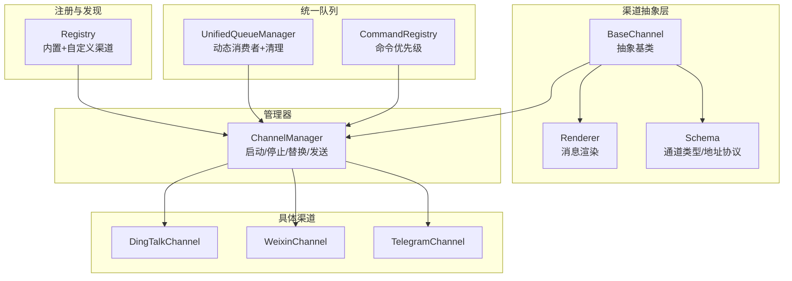
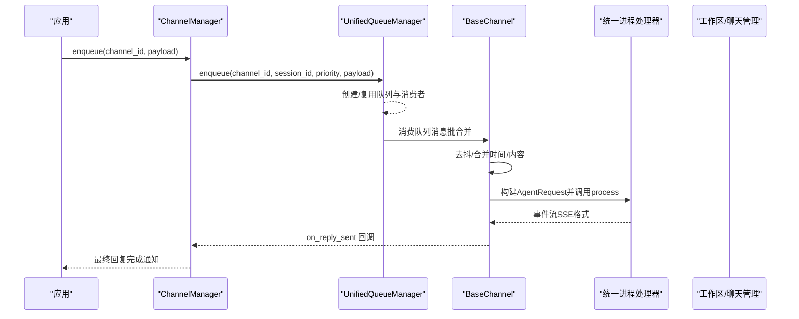
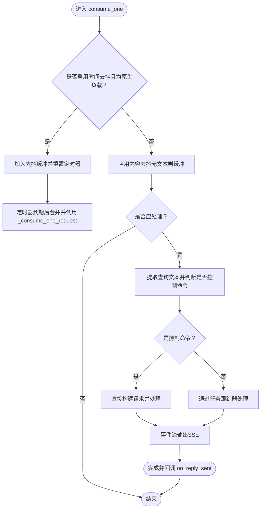
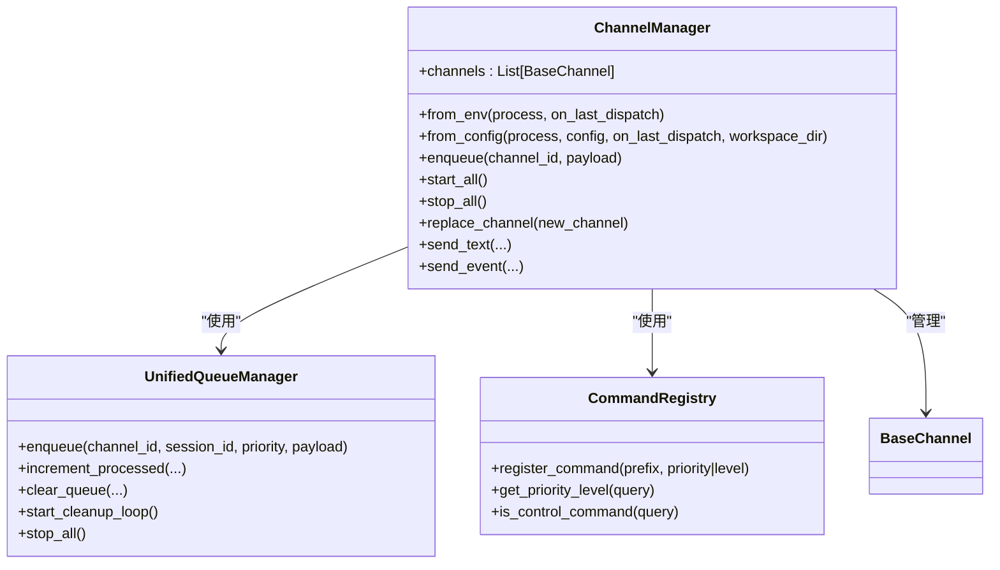
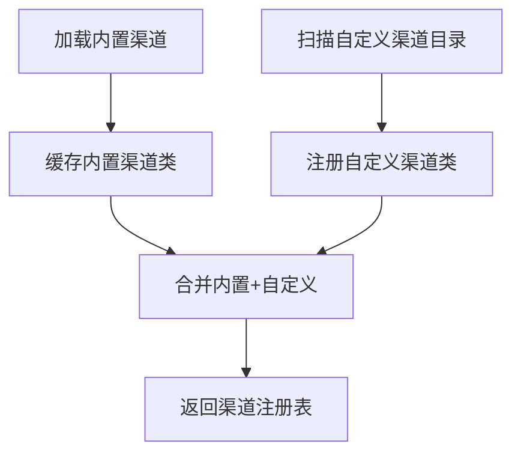
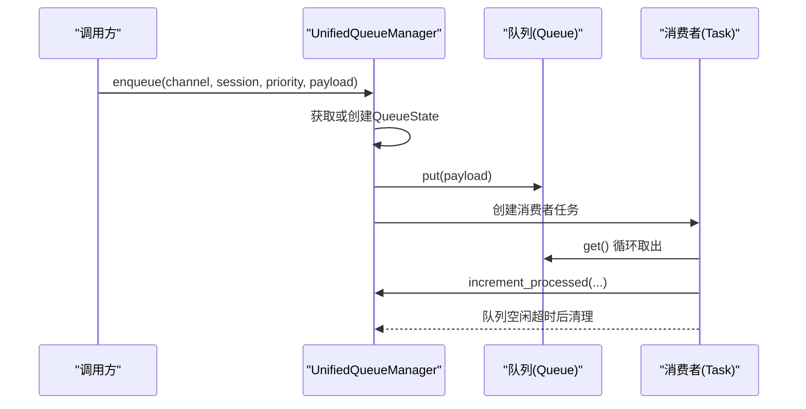
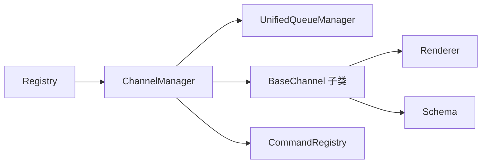

# 渠道集成原理

<cite>
**本文引用的文件**
- [src/copaw/app/channels/base.py](file://src/copaw/app/channels/base.py)
- [src/copaw/app/channels/manager.py](file://src/copaw/app/channels/manager.py)
- [src/copaw/app/channels/registry.py](file://src/copaw/app/channels/registry.py)
- [src/copaw/app/channels/unified_queue_manager.py](file://src/copaw/app/channels/unified_queue_manager.py)
- [src/copaw/app/channels/command_registry.py](file://src/copaw/app/channels/command_registry.py)
- [src/copaw/app/channels/schema.py](file://src/copaw/app/channels/schema.py)
- [src/copaw/app/channels/dingtalk/channel.py](file://src/copaw/app/channels/dingtalk/channel.py)
- [src/copaw/app/channels/weixin/channel.py](file://src/copaw/app/channels/weixin/channel.py)
- [src/copaw/app/channels/telegram/channel.py](file://src/copaw/app/channels/telegram/channel.py)
</cite>

## 目录
1. [引言](#引言)
2. [项目结构](#项目结构)
3. [核心组件](#核心组件)
4. [架构总览](#架构总览)
5. [详细组件分析](#详细组件分析)
6. [依赖分析](#依赖分析)
7. [性能考量](#性能考量)
8. [故障排查指南](#故障排查指南)
9. [结论](#结论)
10. [附录](#附录)

## 引言
本文件面向 CoPaw 的渠道集成系统，系统性阐述渠道抽象（BaseChannel）的设计理念与实现要点，包括消息路由、状态管理、连接维护等；并详解渠道管理器（ChannelManager）如何统一管理多种即时通讯渠道（如 DingTalk、WeChat、Telegram 等）。文档同时覆盖消息格式标准化、用户身份验证、会话管理等关键技术，并提供渠道注册流程、消息处理管道、错误恢复机制的具体示例路径，最后给出渠道开发者的新渠道接入最佳实践。

## 项目结构
CoPaw 的渠道子系统位于 src/copaw/app/channels 下，采用“抽象基类 + 注册表 + 统一队列管理 + 管理器”的分层设计：
- 抽象基类：定义统一的消息转换、渲染、去抖、会话解析、事件流等接口契约
- 注册表：内置与自定义渠道类的发现与加载
- 统一队列管理：基于三元键（渠道、会话、优先级）的动态消费者模型
- 管理器：负责渠道生命周期、入队、批合并、控制命令识别与路由

图表来源
- [src/copaw/app/channels/base.py:70-127](file://src/copaw/app/channels/base.py#L70-L127)
- [src/copaw/app/channels/registry.py:190-195](file://src/copaw/app/channels/registry.py#L190-L195)
- [src/copaw/app/channels/unified_queue_manager.py:60-118](file://src/copaw/app/channels/unified_queue_manager.py#L60-L118)
- [src/copaw/app/channels/command_registry.py:23-62](file://src/copaw/app/channels/command_registry.py#L23-L62)
- [src/copaw/app/channels/manager.py:68-116](file://src/copaw/app/channels/manager.py#L68-L116)

章节来源
- [src/copaw/app/channels/registry.py:20-78](file://src/copaw/app/channels/registry.py#L20-L78)
- [src/copaw/app/channels/manager.py:68-116](file://src/copaw/app/channels/manager.py#L68-L116)

## 核心组件
- BaseChannel：定义渠道通用能力，包括消息去抖、会话解析、请求构建、事件流输出、错误处理回调等。支持时间去抖（按会话键合并）、内容去抖（无文本时缓冲直至有文本或语音）、控制命令识别与直通处理。
- ChannelManager：统一持有各渠道实例，注入统一进程处理器（AgentRequest -> 事件流），通过统一队列管理器进行入队、批合并、优先级调度与消费者创建。
- Registry：内置渠道清单与自定义渠道扫描，提供渠道类注册表与路由钩子注册。
- UnifiedQueueManager：以（渠道、会话、优先级）为键的动态队列与消费者模型，支持自动清理空闲队列、统计处理计数、安全关闭。
- CommandRegistry：命令前缀到优先级的映射，支持“紧急/高/正常/低”等预置级别与灵活扩展。
- Schema：通道类型标识、统一路由地址（kind/id/extra）与消息转换协议。

章节来源
- [src/copaw/app/channels/base.py:70-127](file://src/copaw/app/channels/base.py#L70-L127)
- [src/copaw/app/channels/manager.py:68-116](file://src/copaw/app/channels/manager.py#L68-L116)
- [src/copaw/app/channels/registry.py:190-195](file://src/copaw/app/channels/registry.py#L190-L195)
- [src/copaw/app/channels/unified_queue_manager.py:60-118](file://src/copaw/app/channels/unified_queue_manager.py#L60-L118)
- [src/copaw/app/channels/command_registry.py:23-62](file://src/copaw/app/channels/command_registry.py#L23-L62)
- [src/copaw/app/channels/schema.py:12-71](file://src/copaw/app/channels/schema.py#L12-L71)

## 架构总览
下图展示了从“入队”到“渠道消费”的端到端流程，包括统一队列、批合并、去抖与事件流输出。

图表来源
- [src/copaw/app/channels/manager.py:350-361](file://src/copaw/app/channels/manager.py#L350-L361)
- [src/copaw/app/channels/unified_queue_manager.py:119-164](file://src/copaw/app/channels/unified_queue_manager.py#L119-L164)
- [src/copaw/app/channels/base.py:446-535](file://src/copaw/app/channels/base.py#L446-L535)

章节来源
- [src/copaw/app/channels/manager.py:350-446](file://src/copaw/app/channels/manager.py#L350-L446)
- [src/copaw/app/channels/unified_queue_manager.py:119-273](file://src/copaw/app/channels/unified_queue_manager.py#L119-L273)

## 详细组件分析

### BaseChannel 设计与消息处理管道
BaseChannel 是所有渠道的抽象基类，其关键职责包括：
- 会话解析与去抖：支持按会话键的时间去抖与内容去抖，避免部分输入或语音消息被阻塞
- 请求构建：将渠道原生负载转换为统一的 AgentRequest，使用运行时消息/内容类型
- 事件流输出：将 AgentResponse 转换为事件流（SSE），并在消息完成时触发回调
- 控制命令直通：当检测到控制命令时，绕过任务跟踪直接处理
- 工作区集成：与工作区的聊天管理与任务跟踪协作，确保可取消与幂等

图表来源
- [src/copaw/app/channels/base.py:659-758](file://src/copaw/app/channels/base.py#L659-L758)
- [src/copaw/app/channels/base.py:759-800](file://src/copaw/app/channels/base.py#L759-L800)

章节来源
- [src/copaw/app/channels/base.py:70-127](file://src/copaw/app/channels/base.py#L70-L127)
- [src/copaw/app/channels/base.py:537-536](file://src/copaw/app/channels/base.py#L537-L536)

### ChannelManager：统一管理与路由
ChannelManager 的职责包括：
- 从环境或配置创建渠道实例，注入统一进程处理器与回调
- 初始化统一队列管理器，设置每个渠道的入队回调
- 提供启动/停止/替换渠道的能力，支持优雅关闭
- 提供发送纯文本与事件的能力，统一会话与目标句柄

图表来源
- [src/copaw/app/channels/manager.py:68-116](file://src/copaw/app/channels/manager.py#L68-L116)
- [src/copaw/app/channels/unified_queue_manager.py:60-118](file://src/copaw/app/channels/unified_queue_manager.py#L60-L118)
- [src/copaw/app/channels/command_registry.py:23-62](file://src/copaw/app/channels/command_registry.py#L23-L62)

章节来源
- [src/copaw/app/channels/manager.py:68-116](file://src/copaw/app/channels/manager.py#L68-L116)
- [src/copaw/app/channels/manager.py:447-526](file://src/copaw/app/channels/manager.py#L447-L526)

### 注册表与渠道发现
注册表负责：
- 内置渠道清单与加载（失败不中断，必要渠道失败抛出）
- 自定义渠道扫描与注册（支持目录与模块两种形式）
- 提供渠道类注册表与自定义渠道 HTTP 路由注册钩子

图表来源
- [src/copaw/app/channels/registry.py:45-78](file://src/copaw/app/channels/registry.py#L45-L78)
- [src/copaw/app/channels/registry.py:97-129](file://src/copaw/app/channels/registry.py#L97-L129)
- [src/copaw/app/channels/registry.py:190-195](file://src/copaw/app/channels/registry.py#L190-L195)

章节来源
- [src/copaw/app/channels/registry.py:20-78](file://src/copaw/app/channels/registry.py#L20-L78)
- [src/copaw/app/channels/registry.py:97-129](file://src/copaw/app/channels/registry.py#L97-L129)
- [src/copaw/app/channels/registry.py:190-195](file://src/copaw/app/channels/registry.py#L190-L195)

### 统一队列管理：动态消费者与清理
UnifiedQueueManager 以（渠道、会话、优先级）为键，实现：
- 动态创建队列与消费者，按需启动
- 批量合并与严格序列化（同键串行）
- 自动清理空闲队列，降低资源占用
- 处理计数与监控指标导出

图表来源
- [src/copaw/app/channels/unified_queue_manager.py:119-164](file://src/copaw/app/channels/unified_queue_manager.py#L119-L164)
- [src/copaw/app/channels/unified_queue_manager.py:214-273](file://src/copaw/app/channels/unified_queue_manager.py#L214-L273)
- [src/copaw/app/channels/unified_queue_manager.py:376-428](file://src/copaw/app/channels/unified_queue_manager.py#L376-L428)

章节来源
- [src/copaw/app/channels/unified_queue_manager.py:60-118](file://src/copaw/app/channels/unified_queue_manager.py#L60-L118)
- [src/copaw/app/channels/unified_queue_manager.py:376-428](file://src/copaw/app/channels/unified_queue_manager.py#L376-L428)

### 消息格式标准化与会话管理
- 消息格式：统一使用运行时消息/内容类型（文本、图片、音频、视频、文件、拒绝），避免中间包裹
- 会话解析：默认以“渠道:发送者ID”作为会话键，渠道可覆写以适配平台差异
- 路由地址：ChannelAddress 提供统一的 kind/id/extra 路由表示，替代分散的 meta 键

章节来源
- [src/copaw/app/channels/base.py:582-602](file://src/copaw/app/channels/base.py#L582-L602)
- [src/copaw/app/channels/base.py:557-567](file://src/copaw/app/channels/base.py#L557-L567)
- [src/copaw/app/channels/schema.py:12-48](file://src/copaw/app/channels/schema.py#L12-L48)

### 用户身份验证与访问控制
- 允许列表策略：支持私聊与群聊的不同策略（开放/白名单），可配置拒绝文案
- 机器人提及策略：在群聊中要求被提及或具备命令标记才处理
- 认证回调：渠道可通过 on_reply_sent 获取“已发送回复”的回调参数（渠道、用户、会话）

章节来源
- [src/copaw/app/channels/base.py:283-305](file://src/copaw/app/channels/base.py#L283-L305)
- [src/copaw/app/channels/base.py:307-317](file://src/copaw/app/channels/base.py#L307-L317)
- [src/copaw/app/channels/base.py:319-321](file://src/copaw/app/channels/base.py#L319-L321)

### 错误恢复与健壮性
- 事件流异常：捕获内部错误并触发错误回调，同时记录异常日志
- 取消处理：支持任务取消，及时关闭迭代器并释放资源
- 入队保护：入队与清理均设置超时，避免无限阻塞
- 替换与重启：支持热替换单个渠道，保证服务连续性

章节来源
- [src/copaw/app/channels/base.py:515-535](file://src/copaw/app/channels/base.py#L515-L535)
- [src/copaw/app/channels/manager.py:302-348](file://src/copaw/app/channels/manager.py#L302-L348)
- [src/copaw/app/channels/manager.py:571-630](file://src/copaw/app/channels/manager.py#L571-L630)

## 依赖分析
- 渠道类依赖于统一的 BaseChannel 抽象，遵循相同的请求/响应与事件流规范
- ChannelManager 依赖注册表获取渠道类，依赖统一队列管理器进行入队与消费者调度
- CommandRegistry 为 ChannelManager 提供命令优先级判定，用于入队时的优先级分类
- UnifiedQueueManager 与 ChannelManager 解耦，仅通过消费者函数接口交互

图表来源
- [src/copaw/app/channels/registry.py:190-195](file://src/copaw/app/channels/registry.py#L190-L195)
- [src/copaw/app/channels/manager.py:68-116](file://src/copaw/app/channels/manager.py#L68-L116)
- [src/copaw/app/channels/unified_queue_manager.py:60-118](file://src/copaw/app/channels/unified_queue_manager.py#L60-L118)
- [src/copaw/app/channels/command_registry.py:23-62](file://src/copaw/app/channels/command_registry.py#L23-L62)

章节来源
- [src/copaw/app/channels/registry.py:190-195](file://src/copaw/app/channels/registry.py#L190-L195)
- [src/copaw/app/channels/manager.py:68-116](file://src/copaw/app/channels/manager.py#L68-L116)

## 性能考量
- 动态消费者模型：按需创建消费者，避免固定线程池带来的资源浪费
- 批合并：对同一会话与优先级的消息进行批处理，减少重复开销
- 时间去抖与内容去抖：在保证用户体验的同时降低无效处理
- 自动清理：空闲队列自动回收，防止内存泄漏与资源堆积
- 超时保护：入队与清理均设置超时，避免阻塞影响整体吞吐

## 故障排查指南
- 渠道未启动：检查 ChannelManager.start_all 是否调用，确认注册表可用渠道与配置 enabled 字段
- 消息未处理：确认 CommandRegistry 是否正确识别控制命令，或检查去抖逻辑是否导致延迟
- 队列积压：查看 UnifiedQueueManager 的监控指标，确认是否存在长时间空闲队列未清理
- 发送失败：检查 on_reply_sent 回调是否触发，以及渠道侧的错误回调日志
- 替换渠道失败：确认新渠道 start 成功后再进行替换，旧渠道 stop 是否抛出异常

章节来源
- [src/copaw/app/channels/manager.py:447-526](file://src/copaw/app/channels/manager.py#L447-L526)
- [src/copaw/app/channels/unified_queue_manager.py:430-471](file://src/copaw/app/channels/unified_queue_manager.py#L430-L471)
- [src/copaw/app/channels/base.py:515-535](file://src/copaw/app/channels/base.py#L515-L535)

## 结论
CoPaw 的渠道集成系统通过抽象基类、统一队列与管理器实现了跨渠道的一致性与可扩展性。BaseChannel 将渠道差异封装在统一的消息转换与事件流接口之下；ChannelManager 与 UnifiedQueueManager 提供了高并发、低耦合、可清理的处理框架；CommandRegistry 则为控制命令提供了优先级与快速识别能力。该体系既满足现有渠道（DingTalk、WeChat、Telegram 等）的接入需求，也为新渠道接入提供了清晰的扩展路径。

## 附录

### 渠道注册流程（示例路径）
- 从环境创建：参考 [src/copaw/app/channels/manager.py:87-106](file://src/copaw/app/channels/manager.py#L87-L106)
- 从配置创建：参考 [src/copaw/app/channels/manager.py:108-213](file://src/copaw/app/channels/manager.py#L108-L213)
- 注册表加载：参考 [src/copaw/app/channels/registry.py:45-78](file://src/copaw/app/channels/registry.py#L45-L78) 与 [src/copaw/app/channels/registry.py:97-129](file://src/copaw/app/channels/registry.py#L97-L129)

### 消息处理管道（示例路径）
- 去抖与批处理：参考 [src/copaw/app/channels/base.py:659-758](file://src/copaw/app/channels/base.py#L659-L758) 与 [src/copaw/app/channels/manager.py:39-65](file://src/copaw/app/channels/manager.py#L39-L65)
- 事件流输出：参考 [src/copaw/app/channels/base.py:446-535](file://src/copaw/app/channels/base.py#L446-L535)

### 错误恢复机制（示例路径）
- 事件流异常与取消：参考 [src/copaw/app/channels/base.py:515-535](file://src/copaw/app/channels/base.py#L515-L535)
- 入队超时保护：参考 [src/copaw/app/channels/manager.py:302-348](file://src/copaw/app/channels/manager.py#L302-L348)

### 新渠道接入最佳实践
- 继承 BaseChannel 并实现必要的抽象方法（如 from_env/from_config、build_agent_request_from_native/send_content_parts 等）
- 在渠道类中覆写 resolve_session_id/get_to_handle_from_request 等以适配平台会话与发送目标
- 如需时间去抖，设置 _debounce_seconds 并实现合并逻辑
- 在 CUSTOM_CHANNELS_DIR 下提供模块或目录形式的自定义渠道，确保类名与 channel 标识正确
- 如需 HTTP 路由，提供 register_app_routes 钩子并在 /api/ 前缀下注册

章节来源
- [src/copaw/app/channels/registry.py:97-129](file://src/copaw/app/channels/registry.py#L97-L129)
- [src/copaw/app/channels/registry.py:135-188](file://src/copaw/app/channels/registry.py#L135-L188)
- [src/copaw/app/channels/base.py:537-555](file://src/copaw/app/channels/base.py#L537-L555)
- [src/copaw/app/channels/base.py:604-618](file://src/copaw/app/channels/base.py#L604-L618)