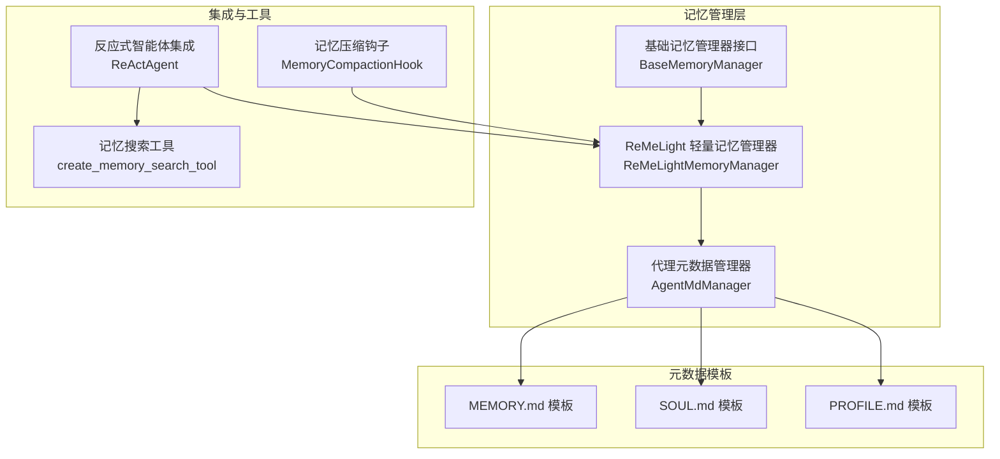
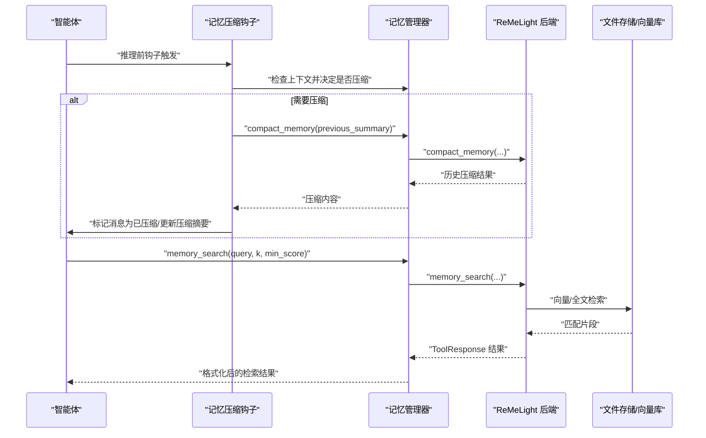
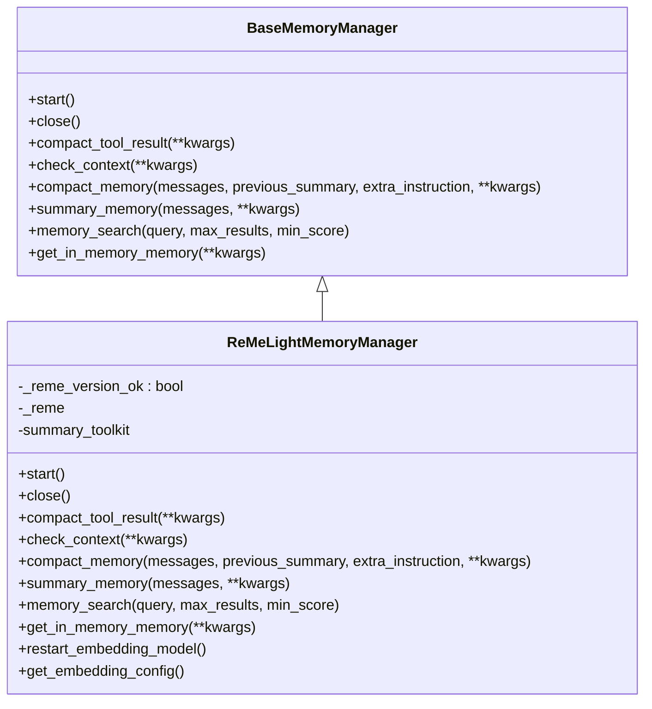
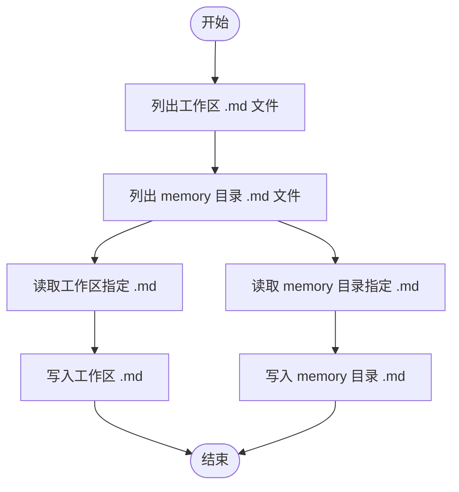
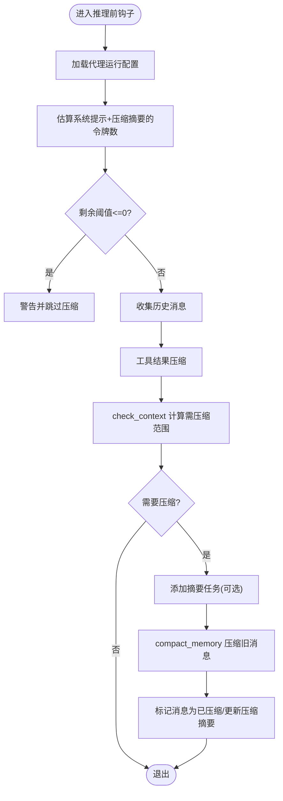
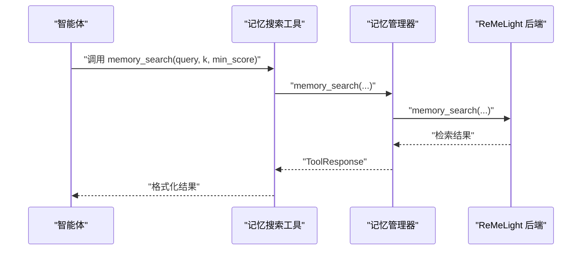
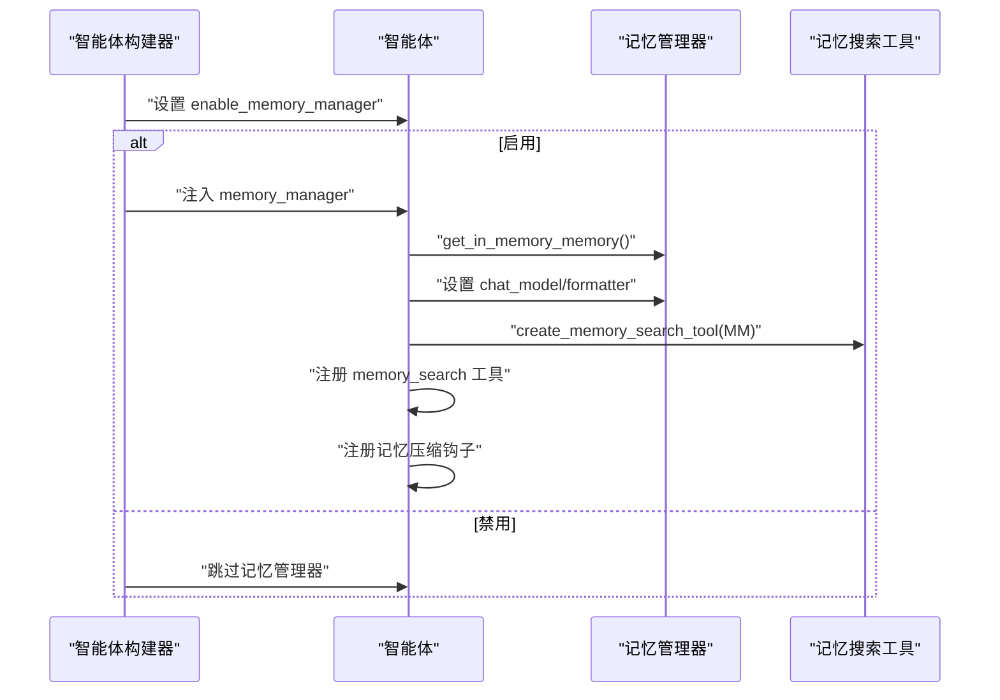
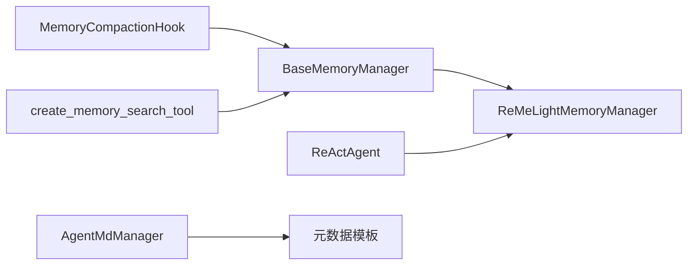

# 记忆管理系统

<cite>
**本文引用的文件**
- [基础记忆管理器接口](file://src/copaw/agents/memory/base_memory_manager.py)
- [ReMeLight 轻量记忆管理器](file://src/copaw/agents/memory/reme_light_memory_manager.py)
- [代理元数据管理器](file://src/copaw/agents/memory/agent_md_manager.py)
- [记忆压缩钩子](file://src/copaw/agents/hooks/memory_compaction.py)
- [记忆搜索工具](file://src/copaw/agents/tools/memory_search.py)
- [反应式智能体集成](file://src/copaw/agents/react_agent.py)
- [中文记忆模板](file://src/copaw/agents/md_files/zh/MEMORY.md)
- [中文灵魂模板](file://src/copaw/agents/md_files/zh/SOUL.md)
- [中文身份模板](file://src/copaw/agents/md_files/zh/PROFILE.md)
</cite>

## 目录
1. [引言](#引言)
2. [项目结构](#项目结构)
3. [核心组件](#核心组件)
4. [架构总览](#架构总览)
5. [详细组件分析](#详细组件分析)
6. [依赖关系分析](#依赖关系分析)
7. [性能考量](#性能考量)
8. [故障排查指南](#故障排查指南)
9. [结论](#结论)
10. [附录](#附录)

## 引言
本技术文档聚焦 CoPaw 的记忆管理系统，系统性阐述短期记忆、长期记忆与上下文压缩的设计理念与实现方式。重点解析 ReMeLightMemoryManager 的轻量级封装思路、记忆条目存储与检索算法、压缩与总结策略，并说明 AgentMdManager 如何管理代理的元数据文件（如 PROFILE.md、SOUL.md、MEMORY.md）。文档同时提供记忆注册流程、查询机制、过期清理等关键功能的代码路径指引，以及优化策略与性能调优建议。

## 项目结构
记忆管理相关代码主要位于 agents/memory 子模块，配合 hooks、tools、react_agent 等模块完成自动压缩、工具注册与上下文控制；元数据文件位于 agents/md_files 及工作空间目录中。

图表来源
- [基础记忆管理器接口:21-226](file://src/copaw/agents/memory/base_memory_manager.py#L21-L226)
- [ReMeLight 轻量记忆管理器:37-391](file://src/copaw/agents/memory/reme_light_memory_manager.py#L37-L391)
- [代理元数据管理器:10-126](file://src/copaw/agents/memory/agent_md_manager.py#L10-L126)
- [记忆压缩钩子:27-214](file://src/copaw/agents/hooks/memory_compaction.py#L27-L214)
- [记忆搜索工具:7-70](file://src/copaw/agents/tools/memory_search.py#L7-L70)
- [反应式智能体集成:380-443](file://src/copaw/agents/react_agent.py#L380-L443)
- [中文记忆模板:1-27](file://src/copaw/agents/md_files/zh/MEMORY.md#L1-L27)
- [中文灵魂模板:1-41](file://src/copaw/agents/md_files/zh/SOUL.md#L1-L41)
- [中文身份模板:1-31](file://src/copaw/agents/md_files/zh/PROFILE.md#L1-L31)

章节来源
- [基础记忆管理器接口:21-226](file://src/copaw/agents/memory/base_memory_manager.py#L21-L226)
- [ReMeLight 轻量记忆管理器:37-391](file://src/copaw/agents/memory/reme_light_memory_manager.py#L37-L391)
- [代理元数据管理器:10-126](file://src/copaw/agents/memory/agent_md_manager.py#L10-L126)
- [记忆压缩钩子:27-214](file://src/copaw/agents/hooks/memory_compaction.py#L27-L214)
- [记忆搜索工具:7-70](file://src/copaw/agents/tools/memory_search.py#L7-L70)
- [反应式智能体集成:380-443](file://src/copaw/agents/react_agent.py#L380-L443)
- [中文记忆模板:1-27](file://src/copaw/agents/md_files/zh/MEMORY.md#L1-L27)
- [中文灵魂模板:1-41](file://src/copaw/agents/md_files/zh/SOUL.md#L1-L41)
- [中文身份模板:1-31](file://src/copaw/agents/md_files/zh/PROFILE.md#L1-L31)

## 核心组件
- 基础记忆管理器接口：定义统一的记忆生命周期、压缩、总结、检索与内存对象获取能力，确保不同后端可替换。
- ReMeLight 轻量记忆管理器：通过组合 ReMeLight 实现向量化/全文检索、上下文压缩、摘要生成与工具结果压缩。
- 代理元数据管理器：负责工作区与 memory 目录下的 Markdown 文件读写与列表，支撑 PROFILE.md、SOUL.md、MEMORY.md 等元数据的持久化与更新。
- 记忆压缩钩子：在推理前检查上下文长度，触发压缩与摘要任务，保留系统提示与近期消息。
- 记忆搜索工具：封装 memory_search 接口，支持语义检索返回带路径与行号的结果。
- 反应式智能体集成：注册记忆搜索工具、注入记忆管理器、挂载记忆压缩钩子。

章节来源
- [基础记忆管理器接口:21-226](file://src/copaw/agents/memory/base_memory_manager.py#L21-L226)
- [ReMeLight 轻量记忆管理器:37-391](file://src/copaw/agents/memory/reme_light_memory_manager.py#L37-L391)
- [代理元数据管理器:10-126](file://src/copaw/agents/memory/agent_md_manager.py#L10-L126)
- [记忆压缩钩子:27-214](file://src/copaw/agents/hooks/memory_compaction.py#L27-L214)
- [记忆搜索工具:7-70](file://src/copaw/agents/tools/memory_search.py#L7-L70)
- [反应式智能体集成:380-443](file://src/copaw/agents/react_agent.py#L380-L443)

## 架构总览
下图展示记忆管理从智能体到工具与后端的交互路径，以及压缩钩子如何在推理前介入。

图表来源
- [记忆压缩钩子:62-214](file://src/copaw/agents/hooks/memory_compaction.py#L62-L214)
- [ReMeLight 轻量记忆管理器:254-380](file://src/copaw/agents/memory/reme_light_memory_manager.py#L254-L380)
- [记忆搜索工具:17-67](file://src/copaw/agents/tools/memory_search.py#L17-L67)

## 详细组件分析

### ReMeLightMemoryManager：轻量级封装与压缩策略
- 设计理念
  - 通过组合 ReMeLight 提供统一接口，屏蔽底层向量化/全文检索细节。
  - 支持上下文压缩与摘要生成，结合令牌计数器进行阈值控制。
  - 提供工具结果压缩、异步摘要任务队列与后台清理。
- 关键能力
  - 启动/关闭生命周期管理。
  - 上下文检查与压缩：compact_memory，保留系统提示与近期消息，对旧对话生成压缩摘要。
  - 摘要生成：summary_memory，结合工具读取/编辑文件以增强总结质量。
  - 检索：memory_search，支持向量与全文混合检索，返回带路径与行号的结果。
  - 内存对象：get_in_memory_memory，返回带令牌计数支持的内存实例。
- 压缩策略
  - 基于配置的紧凑比例与思考块开关，避免丢失关键信息。
  - 对无效压缩结果进行保护性处理（记录 JSON 并告警），防止污染后续上下文。
  - 异步摘要任务队列，避免阻塞主线程。
- 配置与环境
  - 嵌入模型优先级：代理配置 > 环境变量 > 默认。
  - 向量与全文检索开关由环境变量控制。
  - 自动选择后端（Windows 使用本地存储，Linux 尝试 chroma，失败回退本地）。

图表来源
- [基础记忆管理器接口:21-226](file://src/copaw/agents/memory/base_memory_manager.py#L21-L226)
- [ReMeLight 轻量记忆管理器:37-391](file://src/copaw/agents/memory/reme_light_memory_manager.py#L37-L391)

章节来源
- [ReMeLight 轻量记忆管理器:37-391](file://src/copaw/agents/memory/reme_light_memory_manager.py#L37-L391)
- [基础记忆管理器接口:21-226](file://src/copaw/agents/memory/base_memory_manager.py#L21-L226)

### AgentMdManager：元数据文件管理
- 职责
  - 统一管理工作区与 memory 目录下的 Markdown 文件，提供列表、读取、写入能力。
  - 用于支撑 PROFILE.md（身份与用户资料）、SOUL.md（核心准则/边界/风格）、MEMORY.md（工具设置与经验教训）等模板的读写与更新。
- 功能要点
  - 自动补全 .md 扩展名。
  - 统一编码回退读取，保证跨平台兼容。
  - 返回文件元信息（大小、创建/修改时间戳）便于前端展示与审计。

图表来源
- [代理元数据管理器:21-126](file://src/copaw/agents/memory/agent_md_manager.py#L21-L126)

章节来源
- [代理元数据管理器:10-126](file://src/copaw/agents/memory/agent_md_manager.py#L10-L126)
- [中文记忆模板:1-27](file://src/copaw/agents/md_files/zh/MEMORY.md#L1-L27)
- [中文灵魂模板:1-41](file://src/copaw/agents/md_files/zh/SOUL.md#L1-L41)
- [中文身份模板:1-31](file://src/copaw/agents/md_files/zh/PROFILE.md#L1-L31)

### 记忆压缩钩子：上下文窗口治理
- 触发时机：推理前钩子，基于系统提示与压缩摘要估算上下文占用。
- 逻辑流程
  - 计算剩余可压缩阈值，若过低则警告并跳过压缩。
  - 对工具结果进行压缩（按最近 N 条、字节上限、保留天数等策略）。
  - 检查上下文，决定需要压缩的历史消息范围。
  - 可选：添加异步摘要任务，提升吞吐。
  - 执行压缩并标记消息状态，更新压缩摘要。
- 保序策略：保留系统提示与近期消息，避免关键指令与最新上下文丢失。

图表来源
- [记忆压缩钩子:62-214](file://src/copaw/agents/hooks/memory_compaction.py#L62-L214)

章节来源
- [记忆压缩钩子:27-214](file://src/copaw/agents/hooks/memory_compaction.py#L27-L214)

### 记忆搜索工具：检索机制与返回格式
- 能力
  - 绑定记忆管理器，提供语义检索接口。
  - 支持最大结果数与最小相似度阈值。
  - 返回包含路径、行号与内容的 ToolResponse，便于智能体直接引用。
- 错误处理
  - 当未启用记忆管理器或检索异常时，返回错误文本块。

图表来源
- [记忆搜索工具:17-67](file://src/copaw/agents/tools/memory_search.py#L17-L67)
- [ReMeLight 轻量记忆管理器:358-380](file://src/copaw/agents/memory/reme_light_memory_manager.py#L358-L380)

章节来源
- [记忆搜索工具:7-70](file://src/copaw/agents/tools/memory_search.py#L7-L70)
- [ReMeLight 轻量记忆管理器:358-380](file://src/copaw/agents/memory/reme_light_memory_manager.py#L358-L380)

### 反应式智能体集成：注册与钩子挂载
- 注册流程
  - 在智能体构建阶段根据环境变量决定是否启用记忆管理器。
  - 若启用，注入记忆管理器并将其 chat_model 与 formatter 设置为智能体当前模型与格式化器。
  - 将 memory_search 工具注册到智能体工具包。
  - 注册记忆压缩钩子，实现在推理前自动压缩。
- 系统提示重建
  - 在加载会话状态后重建系统提示，确保最新元数据生效。

图表来源
- [反应式智能体集成:380-443](file://src/copaw/agents/react_agent.py#L380-L443)
- [记忆搜索工具:7-70](file://src/copaw/agents/tools/memory_search.py#L7-L70)

章节来源
- [反应式智能体集成:380-443](file://src/copaw/agents/react_agent.py#L380-L443)

## 依赖关系分析
- ReMeLightMemoryManager 继承自 BaseMemoryManager，实现统一接口。
- MemoryCompactionHook 依赖 BaseMemoryManager 的 check_context/compact_memory/compact_tool_result。
- ReActAgent 在启动时注入记忆管理器并注册工具与钩子。
- create_memory_search_tool 依赖 BaseMemoryManager 的 memory_search。
- AgentMdManager 与元数据模板文件配合，支撑智能体系统提示与记忆文件的动态更新。

图表来源
- [基础记忆管理器接口:21-226](file://src/copaw/agents/memory/base_memory_manager.py#L21-L226)
- [ReMeLight 轻量记忆管理器:37-391](file://src/copaw/agents/memory/reme_light_memory_manager.py#L37-L391)
- [记忆压缩钩子:27-214](file://src/copaw/agents/hooks/memory_compaction.py#L27-L214)
- [反应式智能体集成:380-443](file://src/copaw/agents/react_agent.py#L380-L443)
- [记忆搜索工具:7-70](file://src/copaw/agents/tools/memory_search.py#L7-L70)
- [代理元数据管理器:10-126](file://src/copaw/agents/memory/agent_md_manager.py#L10-L126)

章节来源
- [基础记忆管理器接口:21-226](file://src/copaw/agents/memory/base_memory_manager.py#L21-L226)
- [ReMeLight 轻量记忆管理器:37-391](file://src/copaw/agents/memory/reme_light_memory_manager.py#L37-L391)
- [记忆压缩钩子:27-214](file://src/copaw/agents/hooks/memory_compaction.py#L27-L214)
- [反应式智能体集成:380-443](file://src/copaw/agents/react_agent.py#L380-L443)
- [记忆搜索工具:7-70](file://src/copaw/agents/tools/memory_search.py#L7-L70)
- [代理元数据管理器:10-126](file://src/copaw/agents/memory/agent_md_manager.py#L10-L126)

## 性能考量
- 向量化与全文检索
  - 向量检索开启时优先使用嵌入模型，注意 API Key、BaseURL、模型名与维度配置。
  - 全文检索默认开启，可通过环境变量控制。
- 后端选择
  - Windows 默认本地后端，Linux 优先 chroma，失败回退本地，避免系统 SQLite 版本过低导致导入失败。
- 压缩与摘要
  - 使用异步摘要任务队列，避免阻塞推理主流程。
  - 工具结果压缩按最近 N 条、字节上限与保留天数控制，减少上下文体积。
- 令牌计数
  - 结合智能体配置的令牌计数器进行阈值计算，确保压缩触发及时且稳定。
- 缓存与批处理
  - 嵌入模型支持缓存与批处理参数配置，合理设置可降低延迟与成本。

## 故障排查指南
- 版本不匹配
  - ReMe 版本与期望版本不符时会记录警告，建议安装期望版本以避免行为差异。
- ReMe 未启动
  - memory_search 在 ReMe 未启动时返回错误提示，确认智能体已正确初始化并启动记忆管理器。
- 压缩结果无效
  - 当 compact_memory 返回非预期结构或 is_valid 为假时，会保存诊断 JSON 并记录错误，建议上报问题并附上诊断文件。
- chroma 导入失败
  - Linux 下 chroma 导入失败通常因系统 SQLite 版本过低，建议升级至 3.35 或以上。
- 工具结果过大
  - 启用工具结果压缩并调整 recent_n、old_max_bytes、recent_max_bytes 与 retention_days 参数，确保上下文在阈值内。

章节来源
- [ReMeLight 轻量记忆管理器:144-170](file://src/copaw/agents/memory/reme_light_memory_manager.py#L144-L170)
- [ReMeLight 轻量记忆管理器:366-380](file://src/copaw/agents/memory/reme_light_memory_manager.py#L366-L380)
- [ReMeLight 轻量记忆管理器:300-331](file://src/copaw/agents/memory/reme_light_memory_manager.py#L300-L331)
- [ReMeLight 轻量记忆管理器:78-91](file://src/copaw/agents/memory/reme_light_memory_manager.py#L78-L91)

## 结论
CoPaw 的记忆管理系统通过抽象接口与轻量封装，将 ReMeLight 的向量化检索、上下文压缩与摘要生成能力无缝集成到智能体工作流中。配合记忆压缩钩子与工具注册机制，系统实现了对上下文窗口的动态治理与高效检索。AgentMdManager 则保障了元数据文件的可维护性与一致性。整体设计兼顾易用性与扩展性，适合在多场景下进行定制与优化。

## 附录
- 元数据模板位置
  - MEMORY.md：工作区模板与示例，指导记录工具设置与经验教训。
  - SOUL.md：核心准则、边界与风格，塑造代理行为规范。
  - PROFILE.md：身份与用户资料，帮助代理建立角色认知。

章节来源
- [中文记忆模板:1-27](file://src/copaw/agents/md_files/zh/MEMORY.md#L1-L27)
- [中文灵魂模板:1-41](file://src/copaw/agents/md_files/zh/SOUL.md#L1-L41)
- [中文身份模板:1-31](file://src/copaw/agents/md_files/zh/PROFILE.md#L1-L31)