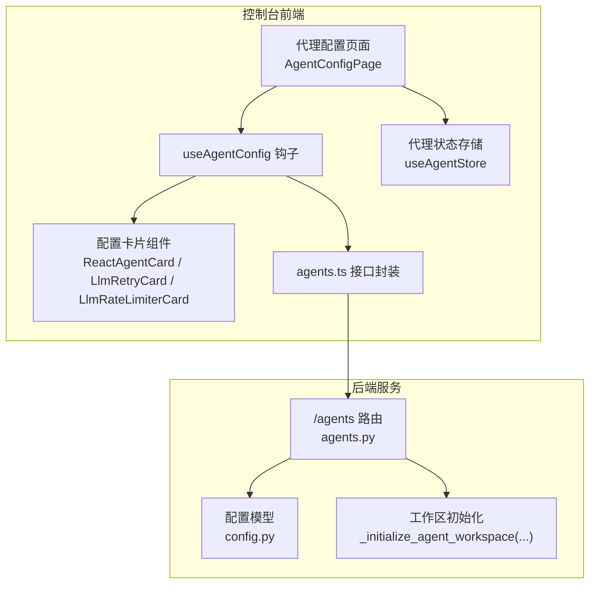
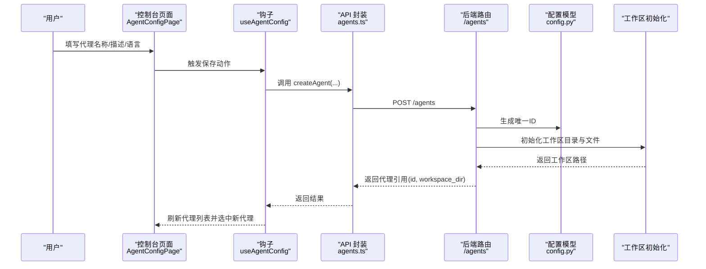
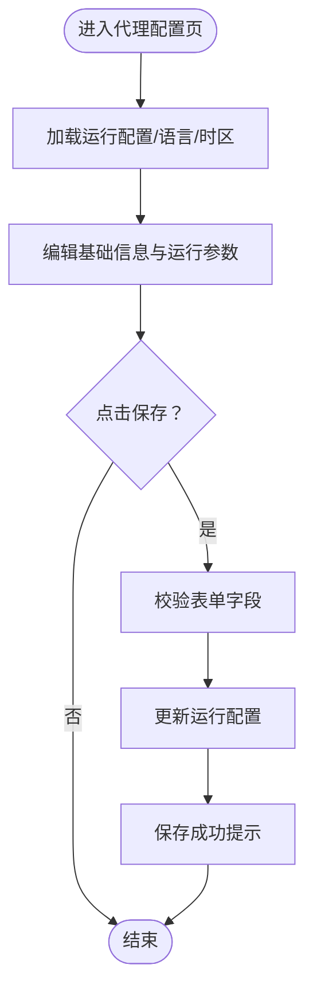
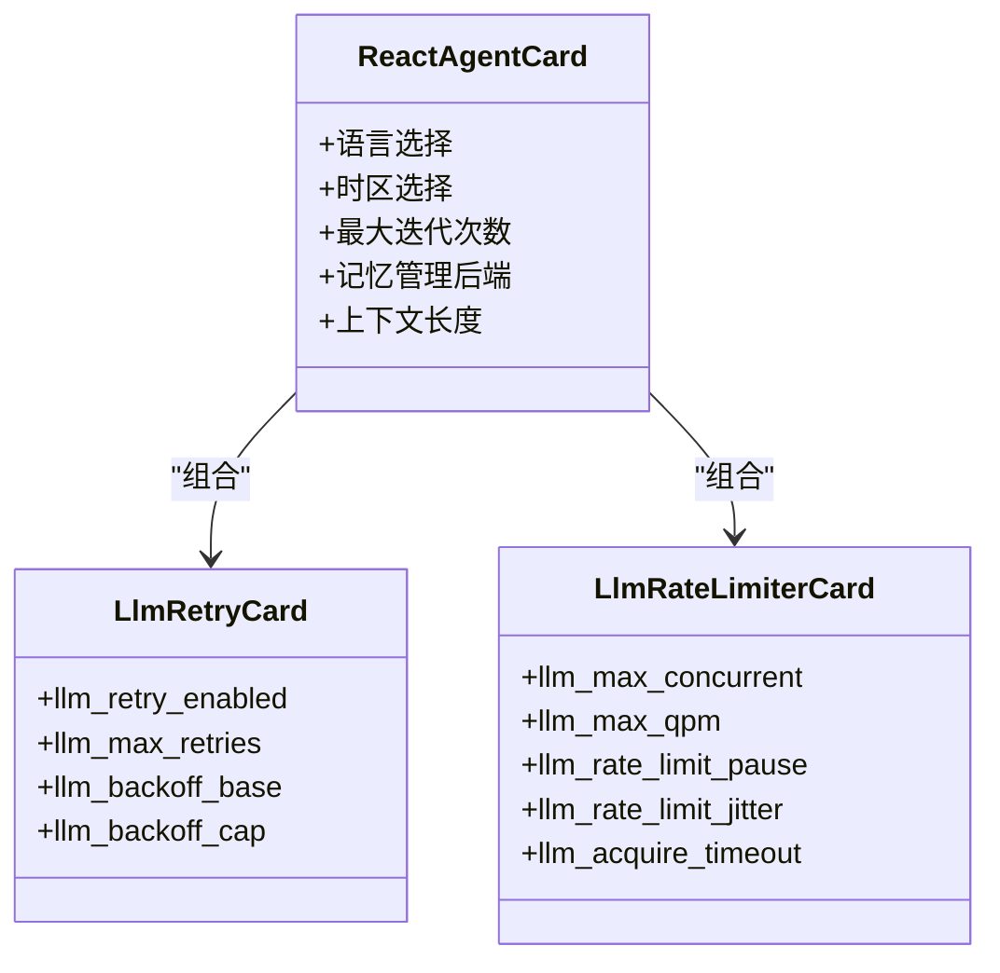
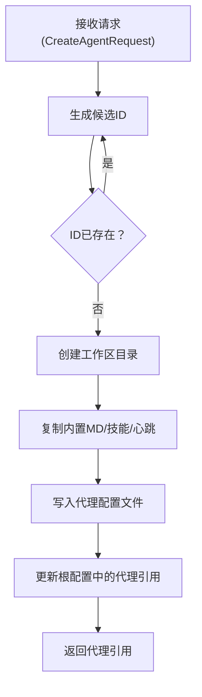
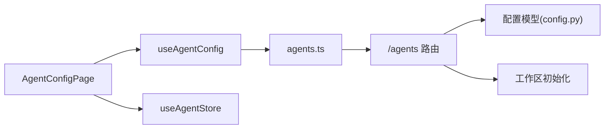

# 代理创建

<cite>
**本文引用的文件**
- [console/src/pages/Agent/Config/index.tsx](file://console/src/pages/Agent/Config/index.tsx)
- [console/src/pages/Agent/Config/useAgentConfig.tsx](file://console/src/pages/Agent/Config/useAgentConfig.tsx)
- [console/src/pages/Agent/Config/components/ReactAgentCard.tsx](file://console/src/pages/Agent/Config/components/ReactAgentCard.tsx)
- [console/src/pages/Agent/Config/components/LlmRetryCard.tsx](file://console/src/pages/Agent/Config/components/LlmRetryCard.tsx)
- [console/src/pages/Agent/Config/components/LlmRateLimiterCard.tsx](file://console/src/pages/Agent/Config/components/LlmRateLimiterCard.tsx)
- [console/src/api/modules/agents.ts](file://console/src/api/modules/agents.ts)
- [console/src/stores/agentStore.ts](file://console/src/stores/agentStore.ts)
- [src/copaw/app/routers/agents.py](file://src/copaw/app/routers/agents.py)
- [src/copaw/config/config.py](file://src/copaw/config/config.py)
- [working/workspaces/default/agent.json](file://working/workspaces/default/agent.json)
</cite>

## 目录
1. [简介](#简介)
2. [项目结构](#项目结构)
3. [核心组件](#核心组件)
4. [架构总览](#架构总览)
5. [详细组件分析](#详细组件分析)
6. [依赖分析](#依赖分析)
7. [性能考虑](#性能考虑)
8. [故障排查指南](#故障排查指南)
9. [结论](#结论)
10. [附录](#附录)

## 简介
本章节面向首次接触控制台“代理创建”功能的用户，提供从零到一的完整操作指南：如何在控制台中创建新代理、配置代理基本信息与运行参数、选择模型与工具、以及理解代理模板与预设配置的工作方式。同时，文档解释代理ID生成规则、命名规范与唯一性保障，并给出最佳实践、常见配置模式、批量创建与导入现有代理配置的进阶用法。

## 项目结构
控制台侧负责用户界面与交互，后端服务负责代理生命周期管理（创建、更新、删除、启用/禁用）与工作区初始化；全局配置与代理配置分别存储于根配置与每个代理的工作区目录中。

图表来源
- [console/src/pages/Agent/Config/index.tsx:16-103](file://console/src/pages/Agent/Config/index.tsx#L16-L103)
- [console/src/pages/Agent/Config/useAgentConfig.tsx:8-137](file://console/src/pages/Agent/Config/useAgentConfig.tsx#L8-L137)
- [console/src/api/modules/agents.ts:12-78](file://console/src/api/modules/agents.ts#L12-L78)
- [src/copaw/app/routers/agents.py:247-318](file://src/copaw/app/routers/agents.py#L247-L318)
- [src/copaw/config/config.py:83-89](file://src/copaw/config/config.py#L83-L89)

章节来源
- [console/src/pages/Agent/Config/index.tsx:16-103](file://console/src/pages/Agent/Config/index.tsx#L16-L103)
- [console/src/api/modules/agents.ts:12-78](file://console/src/api/modules/agents.ts#L12-L78)
- [src/copaw/app/routers/agents.py:247-318](file://src/copaw/app/routers/agents.py#L247-L318)
- [src/copaw/config/config.py:83-89](file://src/copaw/config/config.py#L83-L89)

## 核心组件
- 控制台页面与表单
  - 代理配置页负责渲染基础信息、语言时区、最大迭代次数、上下文长度等运行参数卡片，并提供保存与重置能力。
  - useAgentConfig 钩子负责加载当前运行配置、语言与时区，以及保存语言切换与时区变更。
- 后端路由
  - 提供创建代理接口，自动生成唯一ID，初始化工作区，写入代理配置文件，并返回代理引用。
- 配置模型
  - 定义代理配置数据结构、默认值与校验规则，包括运行参数、限流策略、嵌入与记忆配置等。
- 工作区初始化
  - 创建会话、记忆、技能目录，复制内置MD文件与心跳清单，安装初始技能包。

章节来源
- [console/src/pages/Agent/Config/index.tsx:16-103](file://console/src/pages/Agent/Config/index.tsx#L16-L103)
- [console/src/pages/Agent/Config/useAgentConfig.tsx:8-137](file://console/src/pages/Agent/Config/useAgentConfig.tsx#L8-L137)
- [src/copaw/app/routers/agents.py:247-318](file://src/copaw/app/routers/agents.py#L247-L318)
- [src/copaw/config/config.py:697-756](file://src/copaw/config/config.py#L697-L756)

## 架构总览
下图展示“创建新代理”的端到端流程：从前端表单提交到后端路由处理、工作区初始化与持久化，再到前端刷新代理列表与选中新建代理。

图表来源
- [console/src/pages/Agent/Config/index.tsx:89-100](file://console/src/pages/Agent/Config/index.tsx#L89-L100)
- [console/src/pages/Agent/Config/useAgentConfig.tsx:45-59](file://console/src/pages/Agent/Config/useAgentConfig.tsx#L45-L59)
- [console/src/api/modules/agents.ts:20-25](file://console/src/api/modules/agents.ts#L20-L25)
- [src/copaw/app/routers/agents.py:247-318](file://src/copaw/app/routers/agents.py#L247-L318)
- [src/copaw/config/config.py:83-89](file://src/copaw/config/config.py#L83-L89)

## 详细组件分析

### 控制台：代理配置页面与卡片
- 页面职责
  - 渲染多个配置卡片，统一通过表单收集用户输入；提供“重置/保存”操作。
  - 读取并显示语言与时区，支持即时切换与确认提示。
- 关键交互
  - 语言切换：弹出确认框，若复制了相关MD文件则提示数量。
  - 时区变更：直接调用接口更新用户时区。
  - 保存：校验表单后调用运行配置更新接口。

图表来源
- [console/src/pages/Agent/Config/index.tsx:64-100](file://console/src/pages/Agent/Config/index.tsx#L64-L100)
- [console/src/pages/Agent/Config/useAgentConfig.tsx:20-59](file://console/src/pages/Agent/Config/useAgentConfig.tsx#L20-L59)

章节来源
- [console/src/pages/Agent/Config/index.tsx:16-103](file://console/src/pages/Agent/Config/index.tsx#L16-L103)
- [console/src/pages/Agent/Config/useAgentConfig.tsx:8-137](file://console/src/pages/Agent/Config/useAgentConfig.tsx#L8-L137)

### 控制台：运行参数卡片
- ReactAgentCard
  - 语言选择、时区选择、最大迭代次数、记忆管理后端、上下文长度等。
- LlmRetryCard
  - LLM自动重试开关与重试次数、退避基值与上限。
- LlmRateLimiterCard
  - 并发请求数、QPM限制、限流暂停与抖动、获取令牌超时。

图表来源
- [console/src/pages/Agent/Config/components/ReactAgentCard.tsx:25-134](file://console/src/pages/Agent/Config/components/ReactAgentCard.tsx#L25-L134)
- [console/src/pages/Agent/Config/components/LlmRetryCard.tsx:9-121](file://console/src/pages/Agent/Config/components/LlmRetryCard.tsx#L9-L121)
- [console/src/pages/Agent/Config/components/LlmRateLimiterCard.tsx:9-153](file://console/src/pages/Agent/Config/components/LlmRateLimiterCard.tsx#L9-L153)

章节来源
- [console/src/pages/Agent/Config/components/ReactAgentCard.tsx:16-134](file://console/src/pages/Agent/Config/components/ReactAgentCard.tsx#L16-L134)
- [console/src/pages/Agent/Config/components/LlmRetryCard.tsx:5-121](file://console/src/pages/Agent/Config/components/LlmRetryCard.tsx#L5-L121)
- [console/src/pages/Agent/Config/components/LlmRateLimiterCard.tsx:5-153](file://console/src/pages/Agent/Config/components/LlmRateLimiterCard.tsx#L5-L153)

### 后端：创建代理流程
- 请求体字段
  - name、description、workspace_dir（可选）、language（默认"en"）、skill_names（可选）。
- ID生成与唯一性
  - 循环生成短UUID，确保不在已配置代理集合中，最多尝试10次。
- 工作区初始化
  - 创建 sessions/memory/skills 目录；按语言复制内置MD文件或QA种子；生成默认HEARTBEAT.md；复制内置技能；安装初始技能包；生成jobs.json与chats.json。
- 持久化
  - 写入代理配置文件（workspace/agent.json），更新根配置中的代理引用与顺序。

图表来源
- [src/copaw/app/routers/agents.py:254-318](file://src/copaw/app/routers/agents.py#L254-L318)
- [src/copaw/app/routers/agents.py:683-726](file://src/copaw/app/routers/agents.py#L683-L726)
- [src/copaw/config/config.py:83-89](file://src/copaw/config/config.py#L83-L89)

章节来源
- [src/copaw/app/routers/agents.py:61-80](file://src/copaw/app/routers/agents.py#L61-L80)
- [src/copaw/app/routers/agents.py:254-318](file://src/copaw/app/routers/agents.py#L254-L318)
- [src/copaw/app/routers/agents.py:683-726](file://src/copaw/app/routers/agents.py#L683-L726)
- [src/copaw/config/config.py:83-89](file://src/copaw/config/config.py#L83-L89)

### 配置模型与默认值
- 代理配置结构
  - 包含ID、名称、描述、工作区路径、通道、MCP、心跳、运行参数、LLM路由、活跃模型、语言、系统提示文件、工具、安全等字段。
- 运行参数默认值
  - 最大迭代次数、LLM重试、并发与限流、上下文长度、记忆压缩阈值与保留比例、嵌入配置等均有默认值。
- 默认工作区文件
  - AGENTS.md、SOUL.md、PROFILE.md 等系统提示文件；HEARTBEAT.md 心跳清单；内置技能目录；jobs.json、chats.json。

章节来源
- [src/copaw/config/config.py:697-756](file://src/copaw/config/config.py#L697-L756)
- [src/copaw/config/config.py:497-650](file://src/copaw/config/config.py#L497-L650)
- [working/workspaces/default/agent.json:1-456](file://working/workspaces/default/agent.json#L1-L456)

## 依赖分析
- 前端依赖
  - 页面依赖钩子与卡片组件；钩子依赖API封装；API封装依赖HTTP请求工具。
- 后端依赖
  - 路由依赖配置模型与工作区初始化函数；工作区初始化依赖技能池服务与文件系统。
- 存储与状态
  - 控制台使用Zustand进行本地代理状态管理，持久化到sessionStorage。

图表来源
- [console/src/pages/Agent/Config/index.tsx:16-103](file://console/src/pages/Agent/Config/index.tsx#L16-L103)
- [console/src/pages/Agent/Config/useAgentConfig.tsx:8-137](file://console/src/pages/Agent/Config/useAgentConfig.tsx#L8-L137)
- [console/src/api/modules/agents.ts:12-78](file://console/src/api/modules/agents.ts#L12-L78)
- [src/copaw/app/routers/agents.py:247-318](file://src/copaw/app/routers/agents.py#L247-L318)
- [src/copaw/config/config.py:697-756](file://src/copaw/config/config.py#L697-L756)
- [console/src/stores/agentStore.ts:19-88](file://console/src/stores/agentStore.ts#L19-L88)

章节来源
- [console/src/stores/agentStore.ts:1-88](file://console/src/stores/agentStore.ts#L1-L88)

## 性能考虑
- 上下文长度与压缩
  - 合理设置上下文长度与记忆压缩阈值，避免频繁压缩导致性能下降。
- LLM限流
  - 在高并发场景下，适当提高并发数与QPM上限，并设置合理的暂停与抖动，避免触发429。
- 嵌入与索引
  - 使用缓存与批处理提升嵌入效率；必要时重建内存索引以优化检索性能。

## 故障排查指南
- 创建失败：ID冲突或生成失败
  - 现象：多次尝试仍无法生成唯一ID。
  - 处理：检查代理配置中是否存在重复ID；等待短暂后重试。
- 工作区初始化失败
  - 现象：技能复制或MD文件复制失败。
  - 处理：检查工作区目录权限与磁盘空间；查看后端日志定位具体异常。
- 语言切换未生效
  - 现象：切换语言后未复制相关MD文件。
  - 处理：确认目标语言对应资源是否存在；手动复制或更换语言后重试。
- 保存运行配置报错
  - 现象：字段校验失败或网络错误。
  - 处理：根据提示修正字段范围；检查网络连通性与后端服务状态。

章节来源
- [src/copaw/app/routers/agents.py:260-272](file://src/copaw/app/routers/agents.py#L260-L272)
- [console/src/pages/Agent/Config/useAgentConfig.tsx:51-58](file://console/src/pages/Agent/Config/useAgentConfig.tsx#L51-L58)

## 结论
通过控制台的“代理配置页面”与后端的“创建代理接口”，用户可以快速完成新代理的创建与初始配置。后端采用短UUID保证ID唯一性，并通过工作区初始化模板化地填充代理所需文件与技能。建议在生产环境中结合限流、上下文压缩与缓存策略，确保代理在高负载下的稳定性与响应速度。

## 附录

### 代理ID生成规则与唯一性
- 生成算法：基于短UUID，长度为6字符。
- 唯一性保障：循环生成候选ID，检查是否存在于已配置代理集合中，最多尝试10次。
- 命名规范：ID为纯字母数字组合，便于在URL与文件系统中使用。

章节来源
- [src/copaw/config/config.py:83-89](file://src/copaw/config/config.py#L83-L89)
- [src/copaw/app/routers/agents.py:260-266](file://src/copaw/app/routers/agents.py#L260-L266)

### 代理模板系统与预设配置
- 模板来源
  - 内置MD文件：按语言复制；若不存在对应语言，则回退至英文。
  - 内置技能：复制内置技能目录到工作区。
  - 心跳清单：默认生成HEARTBEAT.md。
- 预设配置
  - 运行参数、限流策略、嵌入与记忆配置均提供合理默认值，满足大多数场景。

章节来源
- [src/copaw/app/routers/agents.py:563-726](file://src/copaw/app/routers/agents.py#L563-L726)
- [working/workspaces/default/agent.json:1-456](file://working/workspaces/default/agent.json#L1-L456)

### 代理基本信息配置清单
- 基础信息
  - 名称、描述、语言、时区。
- 运行参数
  - 最大迭代次数、上下文长度、记忆管理后端。
- LLM重试与限流
  - 开关、重试次数、退避基值/上限、并发、QPM、暂停与抖动、获取令牌超时。
- 工具与安全
  - 工具启用/禁用、安全策略（工具守卫、文件守卫、技能扫描）。

章节来源
- [console/src/pages/Agent/Config/components/ReactAgentCard.tsx:36-131](file://console/src/pages/Agent/Config/components/ReactAgentCard.tsx#L36-L131)
- [console/src/pages/Agent/Config/components/LlmRetryCard.tsx:19-118](file://console/src/pages/Agent/Config/components/LlmRetryCard.tsx#L19-L118)
- [console/src/pages/Agent/Config/components/LlmRateLimiterCard.tsx:19-150](file://console/src/pages/Agent/Config/components/LlmRateLimiterCard.tsx#L19-L150)
- [working/workspaces/default/agent.json:258-455](file://working/workspaces/default/agent.json#L258-L455)

### 批量创建与导入现有代理配置
- 批量创建
  - 通过循环调用创建接口，逐个传入不同名称与语言，即可批量生成多个代理。
- 导入现有代理配置
  - 可将已有代理的工作区agent.json内容作为模板，调整字段后通过更新接口应用到目标代理。
  - 注意：导入前需确保工作区目录结构完整，且语言与技能包版本兼容。

章节来源
- [console/src/api/modules/agents.ts:27-32](file://console/src/api/modules/agents.ts#L27-L32)
- [src/copaw/app/routers/agents.py:326-352](file://src/copaw/app/routers/agents.py#L326-L352)