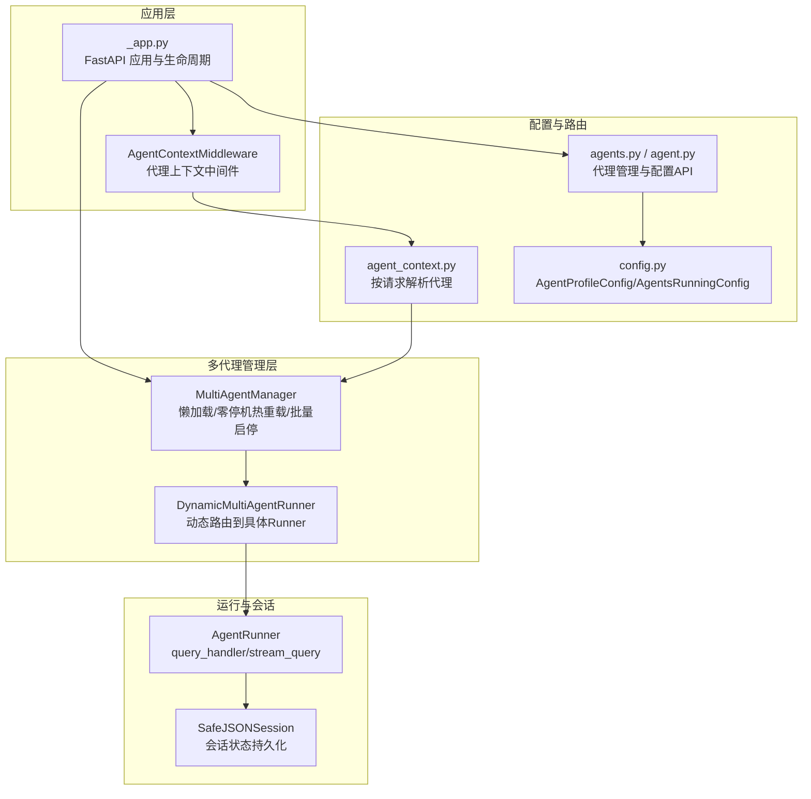
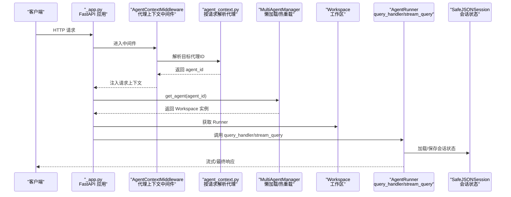
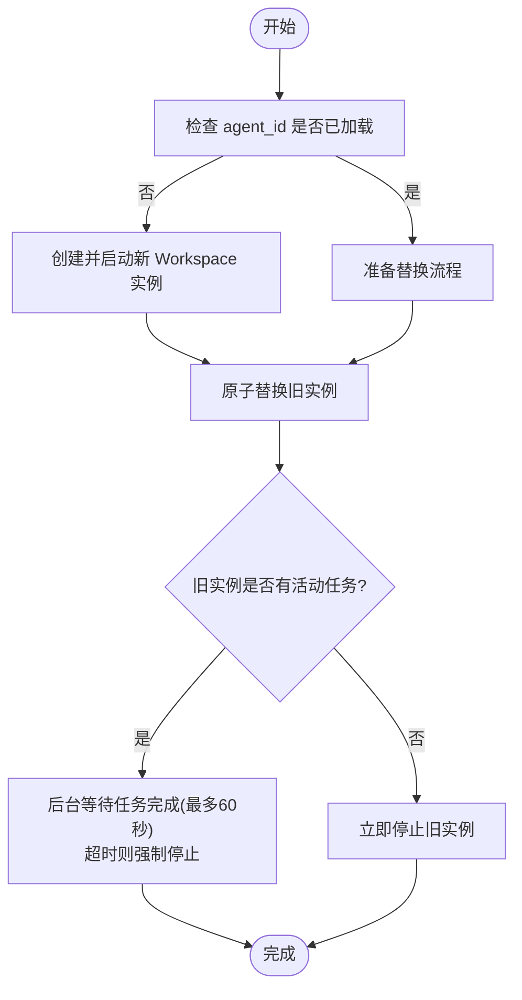
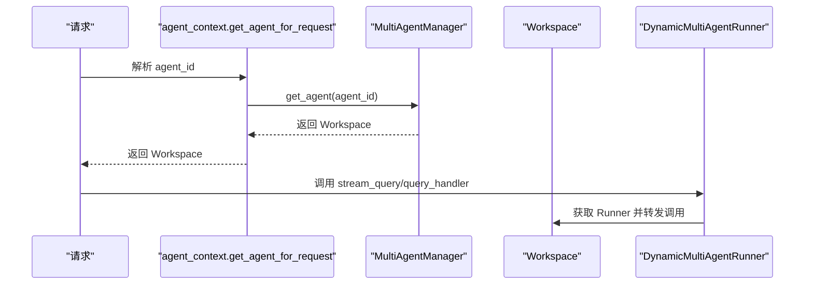
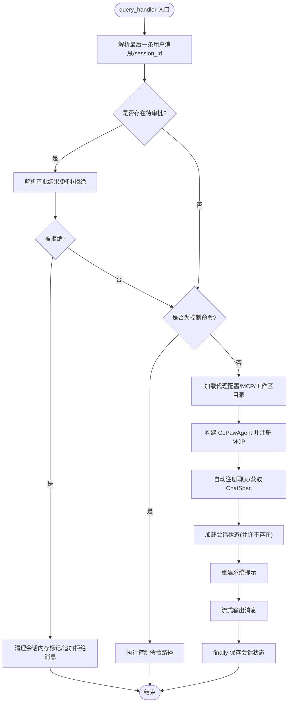
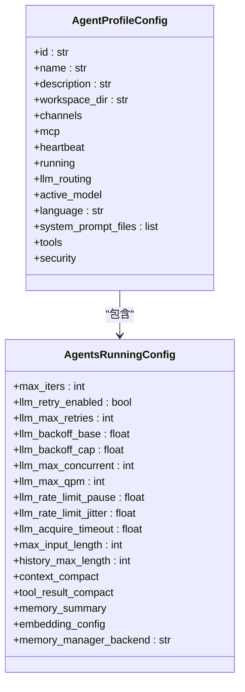
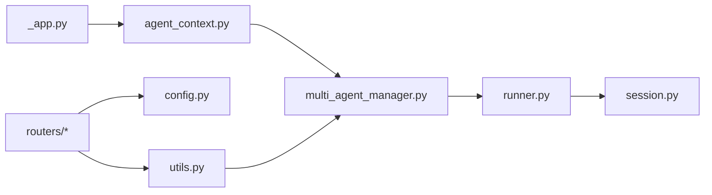

# 代理生命周期

<cite>
**本文引用的文件**
- [src\copaw\app\_app.py](file://src\copaw\app\_app.py)
- [src\copaw\app\multi_agent_manager.py](file://src\copaw\app\multi_agent_manager.py)
- [src\copaw\app\agent_context.py](file://src\copaw\app\agent_context.py)
- [src\copaw\app\utils.py](file://src\copaw\app\utils.py)
- [src\copaw\app\routers\agents.py](file://src\copaw\app\routers\agents.py)
- [src\copaw\app\routers\agent.py](file://src\copaw\app\routers\agent.py)
- [src\copaw\app\runner\runner.py](file://src\copaw\app\runner\runner.py)
- [src\copaw\app\runner\session.py](file://src\copaw\app\runner\session.py)
- [src\copaw\app\runner\models.py](file://src\copaw\app\runner\models.py)
- [src\copaw\app\runner\manager.py](file://src\copaw\app\runner\manager.py)
- [src\copaw\cli\agents_cmd.py](file://src\copaw\cli\agents_cmd.py)
- [src\copaw\config\config.py](file://src\copaw\config\config.py)
</cite>

## 目录
1. [简介](#简介)
2. [项目结构](#项目结构)
3. [核心组件](#核心组件)
4. [架构总览](#架构总览)
5. [详细组件分析](#详细组件分析)
6. [依赖分析](#依赖分析)
7. [性能考虑](#性能考虑)
8. [故障排查指南](#故障排查指南)
9. [结论](#结论)
10. [附录](#附录)

## 简介
本指南系统阐述 CoPaw 代理的生命周期管理，覆盖从创建、启动初始化、运行监控、暂停与恢复、优雅关闭，到配置热更新、批量操作、排序与迁移、备份恢复与版本升级、配置回滚等运维实践。文档以代码为依据，配合可视化图示，帮助读者在不同使用场景下制定正确的处理策略与注意事项。

## 项目结构
围绕多代理生命周期管理的核心模块包括：
- 应用生命周期与动态路由：应用启动、中间件、动态多代理路由与生命周期钩子
- 多代理管理器：懒加载、零停机热重载、批量启停、清理任务
- 请求上下文与路由：按请求选择目标代理、代理作用域路由
- 运行器与会话：查询处理、会话状态持久化、错误兜底与清理
- 配置与运行时：代理配置模型、运行时行为、热重载调度
- API 与 CLI：代理列表、创建、删除、启用/禁用、排序、文件读写、语言切换、运行时配置更新

图表来源
- [src\copaw\app\_app.py:162-473](file://src\copaw\app\_app.py#L162-L473)
- [src\copaw\app\multi_agent_manager.py:21-470](file://src\copaw\app\multi_agent_manager.py#L21-L470)
- [src\copaw\app\agent_context.py:22-141](file://src\copaw\app\agent_context.py#L22-L141)
- [src\copaw\app\routers\agents.py:36-726](file://src\copaw\app\routers\agents.py#L36-L726)
- [src\copaw\app\routers\agent.py:19-505](file://src\copaw\app\routers\agent.py#L19-L505)
- [src\copaw\app\runner\runner.py:70-729](file://src\copaw\app\runner\runner.py#L70-L729)
- [src\copaw\app\runner\session.py:39-248](file://src\copaw\app\runner\session.py#L39-L248)
- [src\copaw\config\config.py:697-800](file://src\copaw\config\config.py#L697-L800)

章节来源
- [src\copaw\app\_app.py:162-473](file://src\copaw\app\_app.py#L162-L473)
- [src\copaw\app\multi_agent_manager.py:21-470](file://src\copaw\app\multi_agent_manager.py#L21-L470)
- [src\copaw\app\agent_context.py:22-141](file://src\copaw\app\agent_context.py#L22-L141)
- [src\copaw\app\routers\agents.py:36-726](file://src\copaw\app\routers\agents.py#L36-L726)
- [src\copaw\app\routers\agent.py:19-505](file://src\copaw\app\routers\agent.py#L19-L505)
- [src\copaw\app\runner\runner.py:70-729](file://src\copaw\app\runner\runner.py#L70-L729)
- [src\copaw\app\runner\session.py:39-248](file://src\copaw\app\runner\session.py#L39-L248)
- [src\copaw\config\config.py:697-800](file://src\copaw\config\config.py#L697-L800)

## 核心组件
- 应用与生命周期
  - 动态多代理运行器：根据请求头或上下文动态选择目标代理的工作区运行器
  - 生命周期钩子：启动时迁移与初始化、插件注册与启动钩子；关闭时执行停止钩子、本地模型服务关闭、多代理管理器停止
- 多代理管理器
  - 懒加载：首次请求才创建并启动工作区实例
  - 零停机热重载：新实例先启动，原子替换旧实例，再优雅停止旧实例（后台等待任务完成或超时强制停止）
  - 批量启停：并发启动所有启用的代理，支持取消挂起清理任务
- 请求上下文与路由
  - 代理上下文：优先级解析当前请求的目标代理（参数覆盖 > 请求状态 > 请求头 > 配置默认）
  - 代理作用域路由：/api/agents/{agentId}/... 由中间件注入代理上下文
- 运行器与会话
  - 查询处理：加载环境上下文、构建代理、加载会话状态、流式输出消息、异常转换与错误转储
  - 会话状态：安全文件名、异步读写、键路径更新、不存在时可选抛错
- 配置与热重载
  - 代理配置模型：代理档案、运行时配置、通道/心跳/工具/安全等
  - 热重载调度：非阻塞后台任务触发多代理管理器重载

章节来源
- [src\copaw\app\_app.py:162-473](file://src\copaw\app\_app.py#L162-L473)
- [src\copaw\app\multi_agent_manager.py:21-470](file://src\copaw\app\multi_agent_manager.py#L21-L470)
- [src\copaw\app\agent_context.py:22-141](file://src\copaw\app\agent_context.py#L22-L141)
- [src\copaw\app\runner\runner.py:70-729](file://src\copaw\app\runner\runner.py#L70-L729)
- [src\copaw\app\runner\session.py:39-248](file://src\copaw\app\runner\session.py#L39-L248)
- [src\copaw\config\config.py:697-800](file://src\copaw\config\config.py#L697-L800)
- [src\copaw\app\utils.py:15-58](file://src\copaw\app\utils.py#L15-L58)

## 架构总览
下图展示从请求进入、动态路由、运行器处理到会话持久化的全链路：

图表来源
- [src\copaw\app\_app.py:60-136](file://src\copaw\app\_app.py#L60-L136)
- [src\copaw\app\agent_context.py:22-106](file://src\copaw\app\agent_context.py#L22-L106)
- [src\copaw\app\multi_agent_manager.py:38-90](file://src\copaw\app\multi_agent_manager.py#L38-L90)
- [src\copaw\app\runner\runner.py:349-589](file://src\copaw\app\runner\runner.py#L349-L589)
- [src\copaw\app\runner\session.py:73-138](file://src\copaw\app\runner\session.py#L73-L138)

## 详细组件分析

### 多代理管理器（生命周期与热重载）
- 懒加载：首次 get_agent 时创建并启动 Workspace，避免启动时资源浪费
- 零停机热重载：新实例 start 后原子替换旧实例，旧实例若存在活动任务则后台等待完成或超时后停止
- 批量启动：并发启动所有启用的代理，记录成功/失败映射
- 停止与清理：stop_all 取消挂起清理任务，逐个停止实例并清空缓存

图表来源
- [src\copaw\app\multi_agent_manager.py:208-318](file://src\copaw\app\multi_agent_manager.py#L208-L318)

章节来源
- [src\copaw\app\multi_agent_manager.py:21-470](file://src\copaw\app\multi_agent_manager.py#L21-L470)

### 动态多代理运行器与请求上下文
- 动态运行器：根据请求中的代理上下文选择对应 Workspace 的 Runner，统一暴露 stream_query/query_handler
- 代理上下文：优先级解析 agent_id，支持显式参数、请求状态、请求头、配置默认值
- 代理作用域路由：/api/agents/{agentId}/... 通过中间件注入上下文，使后续 API 能按目标代理读取/写入工作区

图表来源
- [src\copaw\app\agent_context.py:22-106](file://src\copaw\app\agent_context.py#L22-L106)
- [src\copaw\app\_app.py:75-136](file://src\copaw\app\_app.py#L75-L136)
- [src\copaw\app\multi_agent_manager.py:38-90](file://src\copaw\app\multi_agent_manager.py#L38-L90)

章节来源
- [src\copaw\app\agent_context.py:22-141](file://src\copaw\app\agent_context.py#L22-L141)
- [src\copaw\app\_app.py:60-136](file://src\copaw\app\_app.py#L60-L136)
- [src\copaw\app\multi_agent_manager.py:38-90](file://src\copaw\app\multi_agent_manager.py#L38-L90)

### 运行器与会话状态管理
- 查询处理：构建环境上下文、加载代理配置与 MCP 客户端、自动注册聊天、注入技能、重建系统提示、流式输出消息
- 异常处理：捕获异常并转换为统一异常类型，生成调试转储文件，附加细节路径
- 会话状态：异步读写 JSON 文件，跨平台安全文件名，支持键路径更新与不存在时可选抛错

图表来源
- [src\copaw\app\runner\runner.py:349-589](file://src\copaw\app\runner\runner.py#L349-L589)
- [src\copaw\app\runner\session.py:73-138](file://src\copaw\app\runner\session.py#L73-L138)

章节来源
- [src\copaw\app\runner\runner.py:70-729](file://src\copaw\app\runner\runner.py#L70-L729)
- [src\copaw\app\runner\session.py:39-248](file://src\copaw\app\runner\session.py#L39-L248)

### 配置模型与热重载调度
- 代理配置模型：代理档案、运行时配置、通道/心跳/工具/安全等字段定义
- 热重载调度：API 修改配置后通过非阻塞后台任务触发 MultiAgentManager.reload_agent

图表来源
- [src\copaw\config\config.py:697-800](file://src\copaw\config\config.py#L697-L800)

章节来源
- [src\copaw\config\config.py:697-800](file://src\copaw\config\config.py#L697-L800)
- [src\copaw\app\utils.py:15-58](file://src\copaw\app\utils.py#L15-L58)

### 代理排序、批量操作与管理
- 排序持久化：校验传入顺序包含全部已配置代理且不重复，保存到配置中
- 创建代理：自动生成短 ID，初始化工作区目录与内置文件，加入配置并保存
- 删除代理：禁止删除默认代理，先停止再删除并更新顺序
- 启用/禁用：禁用时停止实例；启用时尝试启动并返回状态
- 文件管理：列出/读取/写入代理工作区与记忆目录的 Markdown 文件
- 语言切换：更新代理语言并可选复制对应语言的 MD 文件

章节来源
- [src\copaw\app\routers\agents.py:200-438](file://src\copaw\app\routers\agents.py#L200-L438)
- [src\copaw\app\routers\agent.py:180-505](file://src\copaw\app\routers\agent.py#L180-L505)

### CLI 交互与后台任务
- 代理间聊天：自动为消息添加来源前缀，支持流式/最终响应、后台任务提交与轮询
- 会话复用：自动生成唯一 session_id 或复用已有会话以延续上下文
- 任务状态：提交后台任务后可轮询任务状态，支持 submitted/pending/running/finished 状态流转

章节来源
- [src\copaw\cli\agents_cmd.py:17-680](file://src\copaw\cli\agents_cmd.py#L17-L680)

## 依赖分析
- 组件耦合
  - 应用层通过中间件与上下文解析代理，再委托给多代理管理器获取工作区实例
  - 运行器依赖会话模块进行状态持久化，依赖代理配置与环境上下文
  - API 层负责配置变更与文件读写，变更后通过工具函数调度热重载
- 关键依赖链
  - _app.py → agent_context.py → multi_agent_manager.py → workspace/runner → session
  - routers → config.py（读取/写入配置）→ utils.schedule_agent_reload → multi_agent_manager.reload_agent

图表来源
- [src\copaw\app\_app.py:162-473](file://src\copaw\app\_app.py#L162-L473)
- [src\copaw\app\agent_context.py:22-141](file://src\copaw\app\agent_context.py#L22-L141)
- [src\copaw\app\multi_agent_manager.py:21-470](file://src\copaw\app\multi_agent_manager.py#L21-L470)
- [src\copaw\app\runner\runner.py:70-729](file://src\copaw\app\runner\runner.py#L70-L729)
- [src\copaw\app\runner\session.py:39-248](file://src\copaw\app\runner\session.py#L39-L248)
- [src\copaw\app\routers\agents.py:36-726](file://src\copaw\app\routers\agents.py#L36-L726)
- [src\copaw\app\routers\agent.py:19-505](file://src\copaw\app\routers\agent.py#L19-L505)
- [src\copaw\app\utils.py:15-58](file://src\copaw\app\utils.py#L15-L58)
- [src\copaw\config\config.py:697-800](file://src\copaw\config\config.py#L697-L800)

章节来源
- [src\copaw\app\_app.py:162-473](file://src\copaw\app\_app.py#L162-L473)
- [src\copaw\app\multi_agent_manager.py:21-470](file://src\copaw\app\multi_agent_manager.py#L21-L470)
- [src\copaw\app\runner\runner.py:70-729](file://src\copaw\app\runner\runner.py#L70-L729)
- [src\copaw\app\runner\session.py:39-248](file://src\copaw\app\runner\session.py#L39-L248)
- [src\copaw\app\routers\agents.py:36-726](file://src\copaw\app\routers\agents.py#L36-L726)
- [src\copaw\app\routers\agent.py:19-505](file://src\copaw\app\routers\agent.py#L19-L505)
- [src\copaw\app\utils.py:15-58](file://src\copaw\app\utils.py#L15-L58)
- [src\copaw\config\config.py:697-800](file://src\copaw\config\config.py#L697-L800)

## 性能考虑
- 懒加载与并发启动：仅在请求时创建实例，启动阶段并发处理多个代理，减少冷启动对整体可用性的影响
- 零停机热重载：最小化锁持有时间，新实例先行启动，原子替换后旧实例后台清理，保证服务连续性
- 异步 I/O：会话状态读写采用异步文件访问，避免阻塞事件循环
- 限流与退避：运行时配置提供 LLM 重试、指数退避、并发限制与速率限制，降低外部依赖抖动影响

## 故障排查指南
- 启动失败
  - 检查配置中代理是否启用、工作区目录是否存在与权限是否正确
  - 查看应用生命周期钩子日志，确认插件加载与启动钩子执行情况
- 热重载失败
  - 观察后台重载任务日志，确认新实例启动是否成功；如失败，旧实例仍保持服务
  - 检查是否存在活动任务导致延迟清理，必要时等待或强制停止
- 会话状态异常
  - 确认 session_id 与 user_id 的安全文件名规则，避免非法字符
  - 当 schema 不匹配时会跳过加载并保存新状态，检查会话文件格式
- 错误兜底与调试
  - 运行器捕获异常并转换为统一异常类型，生成调试转储文件，便于定位问题

章节来源
- [src\copaw\app\multi_agent_manager.py:91-187](file://src\copaw\app\multi_agent_manager.py#L91-L187)
- [src\copaw\app\runner\runner.py:541-581](file://src\copaw\app\runner\runner.py#L541-L581)
- [src\copaw\app\runner\session.py:104-138](file://src\copaw\app\runner\session.py#L104-L138)

## 结论
通过懒加载、零停机热重载、代理作用域路由与统一运行器抽象，CoPaw 在多代理场景下实现了高可用与可维护性。配合完善的 API 与 CLI 支持，管理员可以高效地完成代理的创建、排序、批量启停、配置热更新与文件管理。运维上建议遵循“先预热新实例、原子替换、后台清理”的原则，并利用会话状态与调试转储快速定位问题。

## 附录

### 代理生命周期关键阶段与触发条件
- 创建
  - 通过 API 创建代理，自动生成短 ID，初始化工作区目录与内置文件
  - CLI 也可用于交互式代理间通信与后台任务提交
- 启动初始化
  - 应用启动时并发启动所有启用的代理；动态运行器按请求选择代理
- 运行监控
  - 会话状态持久化、流式输出、异常转换与调试转储
- 暂停与恢复
  - 禁用代理时停止实例；启用时尝试启动并返回状态
- 优雅关闭
  - 应用关闭时执行插件停止钩子、本地模型服务关闭、多代理管理器停止所有实例并取消挂起清理任务

章节来源
- [src\copaw\app\routers\agents.py:247-438](file://src\copaw\app\routers\agents.py#L247-L438)
- [src\copaw\app\_app.py:235-473](file://src\copaw\app\_app.py#L235-L473)
- [src\copaw\app\multi_agent_manager.py:346-370](file://src\copaw\app\multi_agent_manager.py#L346-L370)
- [src\copaw\cli\agents_cmd.py:431-680](file://src\copaw\cli\agents_cmd.py#L431-L680)

### 配置迁移与回滚
- 配置迁移
  - 通过迁移脚本将个人版配置迁移到企业版数据库，支持预览模式与跳过步骤
- 配置回滚
  - 利用热重载机制在配置变更后快速回退；若新实例启动失败，旧实例继续提供服务
  - 会话状态文件可作为临时回滚点，schema 不匹配时会跳过加载并保存新状态

章节来源
- [src\copaw\app\utils.py:15-58](file://src\copaw\app\utils.py#L15-L58)
- [src\copaw\app\runner\session.py:104-138](file://src\copaw\app\runner\session.py#L104-L138)