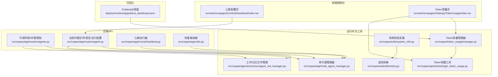
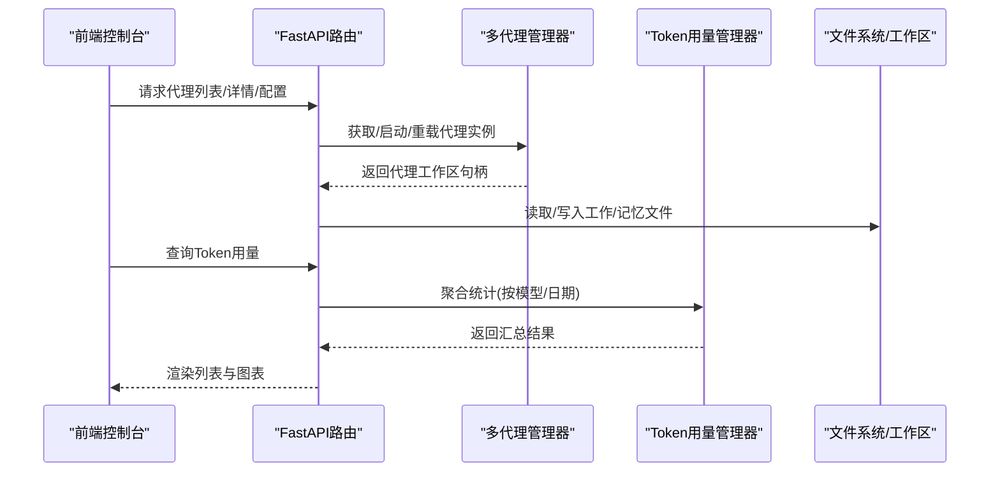
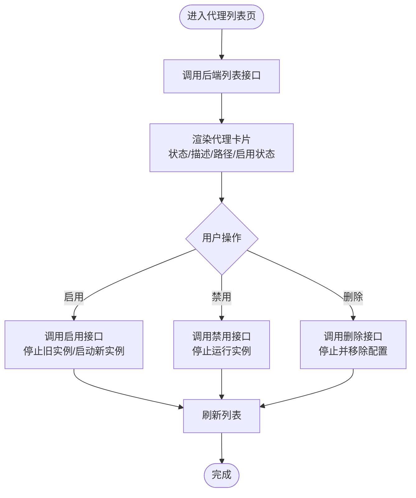
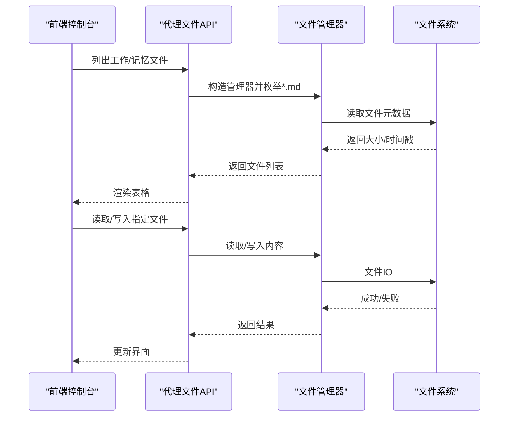
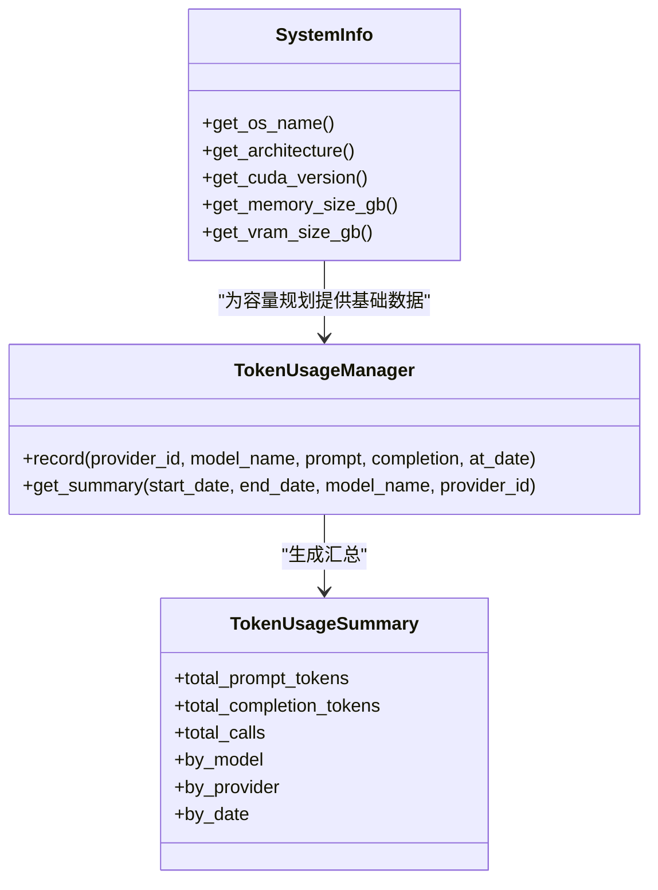
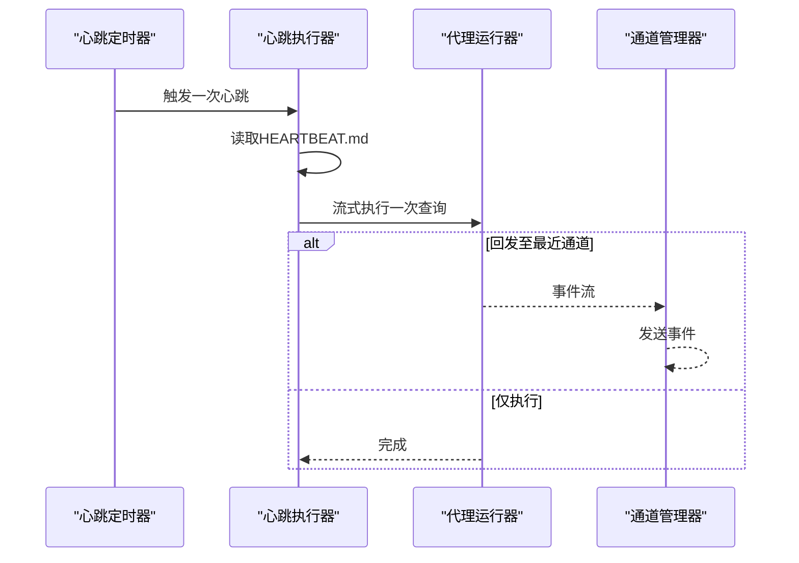
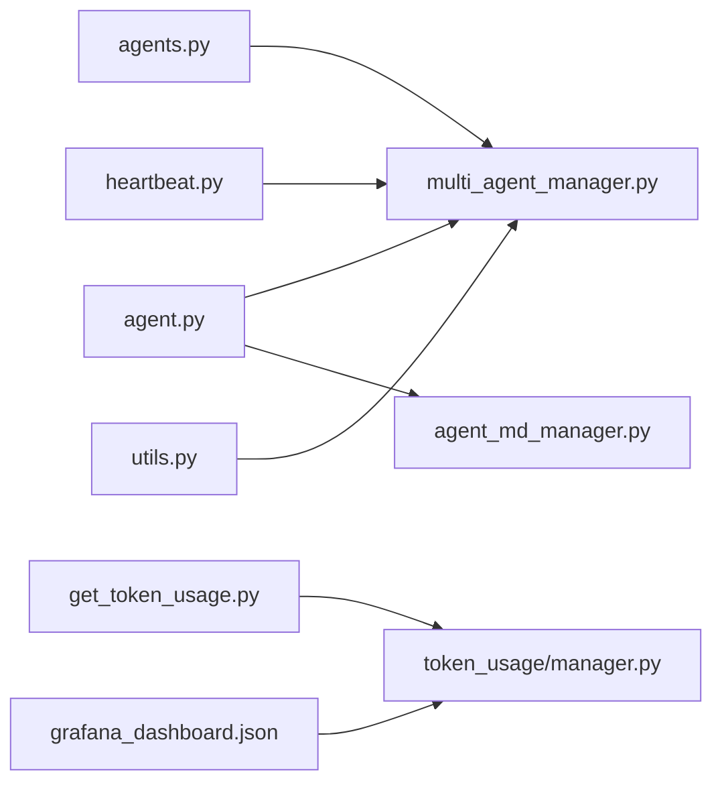

# 代理监控

<cite>
**本文引用的文件**
- [src/copaw/app/routers/agents.py](file://src/copaw/app/routers/agents.py)
- [src/copaw/app/routers/agent.py](file://src/copaw/app/routers/agent.py)
- [src/copaw/app/multi_agent_manager.py](file://src/copaw/app/multi_agent_manager.py)
- [src/copaw/app/utils.py](file://src/copaw/app/utils.py)
- [src/copaw/token_usage/manager.py](file://src/copaw/token_usage/manager.py)
- [src/copaw/agents/tools/get_token_usage.py](file://src/copaw/agents/tools/get_token_usage.py)
- [src/copaw/agents/memory/agent_md_manager.py](file://src/copaw/agents/memory/agent_md_manager.py)
- [src/copaw/app/crons/heartbeat.py](file://src/copaw/app/crons/heartbeat.py)
- [src/copaw/utils/system_info.py](file://src/copaw/utils/system_info.py)
- [src/copaw/utils/telemetry.py](file://src/copaw/utils/telemetry.py)
- [deploy/monitoring/grafana_dashboard.json](file://deploy/monitoring/grafana_dashboard.json)
- [console/src/pages/Control/Heartbeat/index.tsx](file://console/src/pages/Control/Heartbeat/index.tsx)
- [console/src/pages/Settings/TokenUsage/index.tsx](file://console/src/pages/Settings/TokenUsage/index.tsx)
</cite>

## 目录
1. [简介](#简介)
2. [项目结构](#项目结构)
3. [核心组件](#核心组件)
4. [架构总览](#架构总览)
5. [详细组件分析](#详细组件分析)
6. [依赖分析](#依赖分析)
7. [性能考虑](#性能考虑)
8. [故障排查指南](#故障排查指南)
9. [结论](#结论)
10. [附录](#附录)

## 简介
本指南围绕“代理监控”主题，系统性阐述如何在该系统中监控代理的运行状态、性能指标与资源使用情况。内容覆盖代理列表页面的信息展示（状态、内存、CPU、Token消耗等）、代理日志与错误追踪、性能分析、健康检查、异常告警与自动重启等运维能力，并提供监控数据可视化、历史趋势分析与容量规划建议。文档同时结合前端控制台页面与后端API，给出可操作的运维流程与排障方法。

## 项目结构
从监控视角，关键模块分布如下：
- 后端API层：提供代理管理、配置读写、心跳执行、Token用量查询等接口
- 运行时管理层：多代理管理器负责零停机热重载、生命周期管理
- 工具与存储：Token用量聚合、Markdown文件读写、系统信息采集
- 前端控制台：心跳配置与Token用量统计页面
- 可视化：Grafana仪表盘模板

图表来源
- [src/copaw/app/routers/agents.py:152-197](file://src/copaw/app/routers/agents.py#L152-L197)
- [src/copaw/app/routers/agent.py:38-106](file://src/copaw/app/routers/agent.py#L38-L106)
- [src/copaw/app/multi_agent_manager.py:38-90](file://src/copaw/app/multi_agent_manager.py#L38-L90)
- [src/copaw/token_usage/manager.py:198-294](file://src/copaw/token_usage/manager.py#L198-L294)
- [src/copaw/agents/tools/get_token_usage.py:12-86](file://src/copaw/agents/tools/get_token_usage.py#L12-L86)
- [src/copaw/agents/memory/agent_md_manager.py:21-126](file://src/copaw/agents/memory/agent_md_manager.py#L21-L126)
- [src/copaw/app/crons/heartbeat.py:119-213](file://src/copaw/app/crons/heartbeat.py#L119-L213)
- [src/copaw/app/utils.py:15-59](file://src/copaw/app/utils.py#L15-L59)
- [src/copaw/utils/system_info.py:111-120](file://src/copaw/utils/system_info.py#L111-L120)
- [src/copaw/utils/telemetry.py:292-311](file://src/copaw/utils/telemetry.py#L292-L311)
- [deploy/monitoring/grafana_dashboard.json:1-146](file://deploy/monitoring/grafana_dashboard.json#L1-L146)
- [console/src/pages/Control/Heartbeat/index.tsx:71-138](file://console/src/pages/Control/Heartbeat/index.tsx#L71-L138)
- [console/src/pages/Settings/TokenUsage/index.tsx:21-54](file://console/src/pages/Settings/TokenUsage/index.tsx#L21-L54)

章节来源
- [src/copaw/app/routers/agents.py:152-197](file://src/copaw/app/routers/agents.py#L152-L197)
- [src/copaw/app/routers/agent.py:38-106](file://src/copaw/app/routers/agent.py#L38-L106)
- [src/copaw/app/multi_agent_manager.py:38-90](file://src/copaw/app/multi_agent_manager.py#L38-L90)
- [src/copaw/token_usage/manager.py:198-294](file://src/copaw/token_usage/manager.py#L198-L294)
- [src/copaw/agents/tools/get_token_usage.py:12-86](file://src/copaw/agents/tools/get_token_usage.py#L12-L86)
- [src/copaw/agents/memory/agent_md_manager.py:21-126](file://src/copaw/agents/memory/agent_md_manager.py#L21-L126)
- [src/copaw/app/crons/heartbeat.py:119-213](file://src/copaw/app/crons/heartbeat.py#L119-L213)
- [src/copaw/app/utils.py:15-59](file://src/copaw/app/utils.py#L15-L59)
- [src/copaw/utils/system_info.py:111-120](file://src/copaw/utils/system_info.py#L111-L120)
- [src/copaw/utils/telemetry.py:292-311](file://src/copaw/utils/telemetry.py#L292-L311)
- [deploy/monitoring/grafana_dashboard.json:1-146](file://deploy/monitoring/grafana_dashboard.json#L1-L146)
- [console/src/pages/Control/Heartbeat/index.tsx:71-138](file://console/src/pages/Control/Heartbeat/index.tsx#L71-L138)
- [console/src/pages/Settings/TokenUsage/index.tsx:21-54](file://console/src/pages/Settings/TokenUsage/index.tsx#L21-L54)

## 核心组件
- 多代理管理器（MultiAgentManager）：负责代理实例的懒加载、生命周期管理、零停机热重载、并发启动与清理
- 代理API路由：提供代理列表、详情、创建、更新、删除、启用/禁用、文件读写等REST接口
- 当前代理API：提供当前激活代理的工作/记忆文件、语言设置、运行配置、音频模式等读写接口
- Token用量管理器：记录、聚合与查询Token使用统计，支持按模型/提供商/日期维度汇总
- 心跳执行器：周期性读取工作区HEARTBEAT.md并触发一次会话查询，支持目标通道回发
- 文件管理器：统一管理代理工作区与记忆区的Markdown文件读写
- 系统信息采集：标准化采集操作系统、架构、CUDA版本、内存与显存信息
- 遥测采集：匿名收集安装环境信息，用于产品分析
- Grafana仪表盘：提供租户请求速率、技能使用分布等可视化面板

章节来源
- [src/copaw/app/multi_agent_manager.py:21-90](file://src/copaw/app/multi_agent_manager.py#L21-L90)
- [src/copaw/app/routers/agents.py:152-197](file://src/copaw/app/routers/agents.py#L152-L197)
- [src/copaw/app/routers/agent.py:38-106](file://src/copaw/app/routers/agent.py#L38-L106)
- [src/copaw/token_usage/manager.py:62-156](file://src/copaw/token_usage/manager.py#L62-L156)
- [src/copaw/app/crons/heartbeat.py:119-213](file://src/copaw/app/crons/heartbeat.py#L119-L213)
- [src/copaw/agents/memory/agent_md_manager.py:10-126](file://src/copaw/agents/memory/agent_md_manager.py#L10-L126)
- [src/copaw/utils/system_info.py:111-120](file://src/copaw/utils/system_info.py#L111-L120)
- [src/copaw/utils/telemetry.py:292-311](file://src/copaw/utils/telemetry.py#L292-L311)
- [deploy/monitoring/grafana_dashboard.json:1-146](file://deploy/monitoring/grafana_dashboard.json#L1-L146)

## 架构总览
下图展示了代理监控相关的端到端交互：前端通过API访问后端，后端调用多代理管理器与工具模块，最终产出监控数据或执行运维动作。

图表来源
- [src/copaw/app/routers/agents.py:152-197](file://src/copaw/app/routers/agents.py#L152-L197)
- [src/copaw/app/routers/agent.py:38-106](file://src/copaw/app/routers/agent.py#L38-L106)
- [src/copaw/app/multi_agent_manager.py:38-90](file://src/copaw/app/multi_agent_manager.py#L38-L90)
- [src/copaw/token_usage/manager.py:198-294](file://src/copaw/token_usage/manager.py#L198-L294)
- [src/copaw/agents/memory/agent_md_manager.py:21-126](file://src/copaw/agents/memory/agent_md_manager.py#L21-L126)

## 详细组件分析

### 代理列表与状态监控
- 列表接口返回每个代理的标识、名称、描述、工作区路径与启用状态，便于集中展示与筛选
- 启用/禁用接口支持动态开关代理，禁用时会停止对应实例；启用时尝试拉起并校验启动结果
- 删除接口在确保非默认代理的前提下，先停止再移除配置
- 排序接口持久化代理顺序，保证展示一致性

图表来源
- [src/copaw/app/routers/agents.py:152-197](file://src/copaw/app/routers/agents.py#L152-L197)
- [src/copaw/app/routers/agents.py:389-438](file://src/copaw/app/routers/agents.py#L389-L438)
- [src/copaw/app/routers/agents.py:355-386](file://src/copaw/app/routers/agents.py#L355-L386)

章节来源
- [src/copaw/app/routers/agents.py:152-197](file://src/copaw/app/routers/agents.py#L152-L197)
- [src/copaw/app/routers/agents.py:389-438](file://src/copaw/app/routers/agents.py#L389-L438)
- [src/copaw/app/routers/agents.py:355-386](file://src/copaw/app/routers/agents.py#L355-L386)

### 代理文件与日志查看
- 工作区与记忆区的Markdown文件统一由文件管理器提供读写能力，支持列出元数据（大小、创建/修改时间）与内容读取
- 代理API提供当前激活代理的文件读写接口，便于在控制台直接编辑与查看
- 心跳查询文件（HEARTBEAT.md）可作为健康检查的触发源，执行一次查询并可选择回发至最近一次通道

图表来源
- [src/copaw/app/routers/agent.py:38-106](file://src/copaw/app/routers/agent.py#L38-L106)
- [src/copaw/agents/memory/agent_md_manager.py:21-126](file://src/copaw/agents/memory/agent_md_manager.py#L21-L126)

章节来源
- [src/copaw/app/routers/agent.py:38-106](file://src/copaw/app/routers/agent.py#L38-L106)
- [src/copaw/agents/memory/agent_md_manager.py:21-126](file://src/copaw/agents/memory/agent_md_manager.py#L21-L126)

### 性能指标与资源使用
- 系统信息采集模块提供标准化的硬件信息（操作系统、架构、CUDA版本、内存与显存），可用于容量规划与资源评估
- Token用量管理器记录每日、按模型/提供商的Token消耗与调用次数，支持范围查询与聚合统计
- 前端Token用量页支持日期范围筛选与汇总卡片展示，便于趋势分析

图表来源
- [src/copaw/utils/system_info.py:111-120](file://src/copaw/utils/system_info.py#L111-L120)
- [src/copaw/token_usage/manager.py:62-156](file://src/copaw/token_usage/manager.py#L62-L156)
- [src/copaw/token_usage/manager.py:198-294](file://src/copaw/token_usage/manager.py#L198-L294)

章节来源
- [src/copaw/utils/system_info.py:111-120](file://src/copaw/utils/system_info.py#L111-L120)
- [src/copaw/token_usage/manager.py:62-156](file://src/copaw/token_usage/manager.py#L62-L156)
- [src/copaw/token_usage/manager.py:198-294](file://src/copaw/token_usage/manager.py#L198-L294)
- [console/src/pages/Settings/TokenUsage/index.tsx:21-54](file://console/src/pages/Settings/TokenUsage/index.tsx#L21-L54)

### 健康检查与自动重启
- 心跳执行器周期性读取HEARTBEAT.md内容，构造一次用户消息并流式执行，支持在“最近一次通道”回发事件
- 多代理管理器提供零停机热重载：先创建并启动新实例，原子替换旧实例，再优雅地延迟清理旧实例，保障服务连续性
- 配置变更后通过调度器异步触发热重载，避免阻塞API响应

图表来源
- [src/copaw/app/crons/heartbeat.py:119-213](file://src/copaw/app/crons/heartbeat.py#L119-L213)

章节来源
- [src/copaw/app/crons/heartbeat.py:119-213](file://src/copaw/app/crons/heartbeat.py#L119-L213)
- [src/copaw/app/multi_agent_manager.py:208-319](file://src/copaw/app/multi_agent_manager.py#L208-L319)
- [src/copaw/app/utils.py:15-59](file://src/copaw/app/utils.py#L15-L59)

### 异常告警与运维自动化
- 前端心跳配置页允许设置启用开关、执行间隔、目标通道与活跃时段，便于在业务低峰期执行健康检查
- Grafana仪表盘提供租户级请求速率与时序曲线，以及技能使用分布饼图，支撑异常告警与容量规划
- 遥测采集模块在合规前提下收集安装环境信息，辅助产品优化与问题定位

章节来源
- [console/src/pages/Control/Heartbeat/index.tsx:71-138](file://console/src/pages/Control/Heartbeat/index.tsx#L71-L138)
- [deploy/monitoring/grafana_dashboard.json:1-146](file://deploy/monitoring/grafana_dashboard.json#L1-L146)
- [src/copaw/utils/telemetry.py:292-311](file://src/copaw/utils/telemetry.py#L292-L311)

## 依赖分析
- 组件内聚与耦合
  - 多代理管理器是代理生命周期的核心协调者，被多个API路由依赖
  - 文件管理器与Token用量管理器分别服务于工作区内容与用量统计，职责清晰
  - 心跳执行器与多代理管理器配合，形成稳定的健康检查机制
- 外部依赖
  - Prometheus/Grafana：仪表盘依赖Prometheus数据源
  - 前端Ant Design组件库：用于表单、表格与交互控件

图表来源
- [src/copaw/app/routers/agents.py:98-105](file://src/copaw/app/routers/agents.py#L98-L105)
- [src/copaw/app/routers/agent.py:14-17](file://src/copaw/app/routers/agent.py#L14-L17)
- [src/copaw/app/multi_agent_manager.py:31-36](file://src/copaw/app/multi_agent_manager.py#L31-L36)
- [src/copaw/agents/memory/agent_md_manager.py:14-19](file://src/copaw/agents/memory/agent_md_manager.py#L14-L19)
- [src/copaw/app/crons/heartbeat.py:136-141](file://src/copaw/app/crons/heartbeat.py#L136-L141)
- [src/copaw/app/utils.py:35-47](file://src/copaw/app/utils.py#L35-L47)
- [src/copaw/agents/tools/get_token_usage.py](file://src/copaw/agents/tools/get_token_usage.py#L9)
- [src/copaw/token_usage/manager.py:69-72](file://src/copaw/token_usage/manager.py#L69-L72)
- [deploy/monitoring/grafana_dashboard.json:104-127](file://deploy/monitoring/grafana_dashboard.json#L104-L127)

章节来源
- [src/copaw/app/routers/agents.py:98-105](file://src/copaw/app/routers/agents.py#L98-L105)
- [src/copaw/app/routers/agent.py:14-17](file://src/copaw/app/routers/agent.py#L14-L17)
- [src/copaw/app/multi_agent_manager.py:31-36](file://src/copaw/app/multi_agent_manager.py#L31-L36)
- [src/copaw/agents/memory/agent_md_manager.py:14-19](file://src/copaw/agents/memory/agent_md_manager.py#L14-L19)
- [src/copaw/app/crons/heartbeat.py:136-141](file://src/copaw/app/crons/heartbeat.py#L136-L141)
- [src/copaw/app/utils.py:35-47](file://src/copaw/app/utils.py#L35-L47)
- [src/copaw/agents/tools/get_token_usage.py](file://src/copaw/agents/tools/get_token_usage.py#L9)
- [src/copaw/token_usage/manager.py:69-72](file://src/copaw/token_usage/manager.py#L69-L72)
- [deploy/monitoring/grafana_dashboard.json:104-127](file://deploy/monitoring/grafana_dashboard.json#L104-L127)

## 性能考虑
- 零停机热重载：通过先启动新实例、原子替换、再延迟清理旧实例，最大化服务可用性
- 并发启动：批量启动多个代理时采用并发策略，缩短整体启动时间
- 文件IO与序列化：Token用量文件采用异步文件访问与JSON序列化，避免阻塞主线程
- 前端渲染优化：Token用量页对大字段进行紧凑格式化，减少渲染压力

章节来源
- [src/copaw/app/multi_agent_manager.py:208-319](file://src/copaw/app/multi_agent_manager.py#L208-L319)
- [src/copaw/token_usage/manager.py:73-108](file://src/copaw/token_usage/manager.py#L73-L108)
- [console/src/pages/Settings/TokenUsage/index.tsx:18-137](file://console/src/pages/Settings/TokenUsage/index.tsx#L18-L137)

## 故障排查指南
- 代理无法启动/频繁重启
  - 检查代理启用状态与配置是否正确保存
  - 观察热重载调度是否成功触发
  - 关注多代理管理器的日志，确认旧实例延迟清理是否完成
- Token用量统计为空
  - 确认Token用量记录是否已写入磁盘
  - 检查日期范围是否合理
  - 使用工具函数查询近期用量并比对
- 健康检查未生效
  - 确认HEARTBEAT.md存在且内容非空
  - 检查活跃时段设置与用户时区
  - 查看心跳执行超时日志
- 前端页面加载失败
  - 检查API连通性与鉴权
  - 查看控制台网络面板与错误提示

章节来源
- [src/copaw/app/utils.py:15-59](file://src/copaw/app/utils.py#L15-L59)
- [src/copaw/app/multi_agent_manager.py:91-187](file://src/copaw/app/multi_agent_manager.py#L91-L187)
- [src/copaw/token_usage/manager.py:73-108](file://src/copaw/token_usage/manager.py#L73-L108)
- [src/copaw/agents/tools/get_token_usage.py:12-86](file://src/copaw/agents/tools/get_token_usage.py#L12-L86)
- [src/copaw/app/crons/heartbeat.py:119-213](file://src/copaw/app/crons/heartbeat.py#L119-L213)
- [console/src/pages/Control/Heartbeat/index.tsx:71-138](file://console/src/pages/Control/Heartbeat/index.tsx#L71-L138)
- [console/src/pages/Settings/TokenUsage/index.tsx:21-54](file://console/src/pages/Settings/TokenUsage/index.tsx#L21-L54)

## 结论
本指南从后端API、运行时管理、工具与前端控制台等多个维度，构建了完整的代理监控体系。通过代理列表与状态管理、文件与日志查看、Token用量统计、健康检查与自动重启、可视化与容量规划，实现了可观测、可运维、可持续的代理运行保障。建议在生产环境中结合Grafana仪表盘与心跳配置，建立常态化的监控与告警机制，并定期复盘Token用量与系统资源，以指导容量规划与成本优化。

## 附录
- 前端页面与API映射
  - 心跳配置页：读取/更新心跳配置，触发后端心跳执行
  - Token用量页：按日期范围查询Token用量并展示汇总与明细
- 运维最佳实践
  - 将HEARTBEAT.md作为健康检查的统一入口，定期回发至关键通道
  - 对高负载场景开启并发启动与零停机热重载，降低维护窗口
  - 建立Token用量阈值告警，结合模型/提供商维度进行成本归因