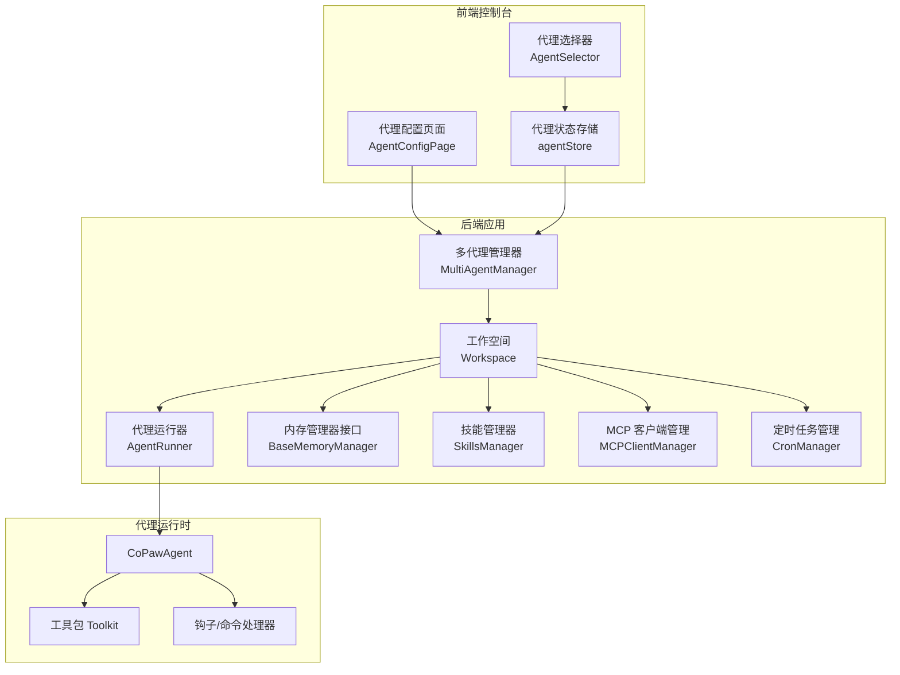
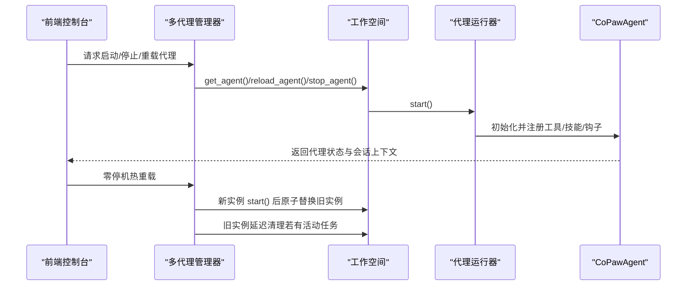
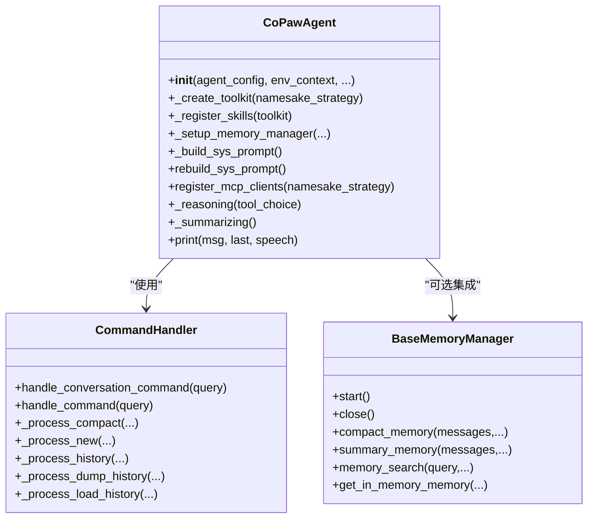
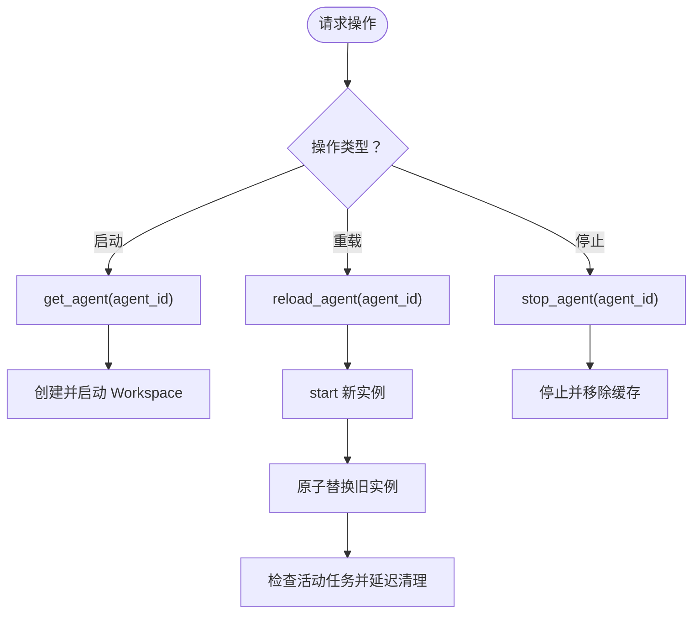
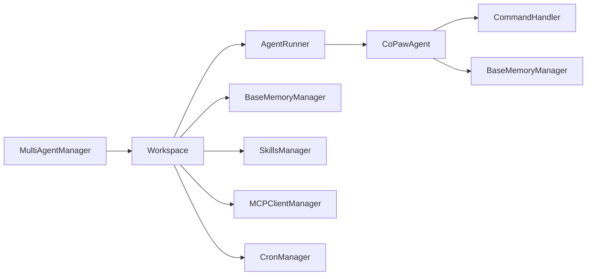

# 代理管理

<cite>
**本文引用的文件**
- [react_agent.py](file://src/copaw/agents/react_agent.py)
- [command_handler.py](file://src/copaw/agents/command_handler.py)
- [multi_agent_manager.py](file://src/copaw/app/multi_agent_manager.py)
- [workspace.py](file://src/copaw/app/workspace/workspace.py)
- [config.py](file://src/copaw/config/config.py)
- [base_memory_manager.py](file://src/copaw/agents/memory/base_memory_manager.py)
- [skills_manager.py](file://src/copaw/agents/skills_manager.py)
- [agents_cmd.py](file://src/copaw/cli/agents_cmd.py)
- [index.tsx](file://console/src/pages/Agent/Config/index.tsx)
- [agentStore.ts](file://console/src/stores/agentStore.ts)
- [QUICK-START.zh.md](file://docs/QUICK-START.zh.md)
- [walkthrough.md](file://docs/walkthrough.md)
- [agent.json](file://working/workspaces/default/agent.json)
</cite>

## 目录
1. [简介](#简介)
2. [项目结构](#项目结构)
3. [核心组件](#核心组件)
4. [架构总览](#架构总览)
5. [详细组件分析](#详细组件分析)
6. [依赖分析](#依赖分析)
7. [性能考虑](#性能考虑)
8. [故障排除指南](#故障排除指南)
9. [结论](#结论)
10. [附录](#附录)

## 简介
本指南面向需要在 CoPaw 平台上进行“代理管理”的用户与工程师，覆盖代理的创建、配置、启动、停止与删除的完整生命周期；详解代理配置界面的关键参数（模型选择、提示词、记忆、工具等）；解释多代理协作机制与最佳实践；提供性能监控、日志查看与故障排除方法；并介绍代理模板、批量配置与配置导入导出等高级能力。文中所有技术细节均基于仓库源码与配置文件，确保可追溯与可验证。

## 项目结构
CoPaw 的代理管理由“前端控制台 + 后端应用 + 代理运行时”三层构成：
- 前端控制台（console）：提供代理配置页面、代理选择与状态展示。
- 后端应用（app）：统一的服务入口，负责多代理实例的生命周期管理、通道接入、定时任务、MCP 客户端管理等。
- 代理运行时（agents）：每个代理实例封装为独立工作空间（Workspace），包含运行器、内存管理、技能与工具注册、钩子与命令处理等。

图示来源
- [workspace.py:50-120](file://src/copaw/app/workspace/workspace.py#L50-L120)
- [multi_agent_manager.py:21-90](file://src/copaw/app/multi_agent_manager.py#L21-L90)
- [react_agent.py:69-182](file://src/copaw/agents/react_agent.py#L69-L182)

章节来源
- [workspace.py:50-120](file://src/copaw/app/workspace/workspace.py#L50-L120)
- [multi_agent_manager.py:21-90](file://src/copaw/app/multi_agent_manager.py#L21-L90)
- [react_agent.py:69-182](file://src/copaw/agents/react_agent.py#L69-L182)

## 核心组件
- 多代理管理器（MultiAgentManager）：集中管理多个代理工作空间，支持懒加载、零停机热重载、并发启动与优雅停止。
- 工作空间（Workspace）：单个代理的完整运行环境，包含运行器、内存管理、通道、MCP、定时任务等服务。
- CoPawAgent：基于 ReActAgent 的智能体实现，集成工具、技能、内存与命令处理。
- 命令处理器（CommandHandler）：处理系统命令（如 /compact、/new、/history 等）。
- 内存管理器接口（BaseMemoryManager）：抽象统一的记忆管理能力，支持压缩、摘要与搜索。
- 技能管理器（SkillsManager）：同步与注册技能，支持内置与自定义技能池、冲突检测与签名校验。
- CLI 代理命令（agents_cmd）：提供跨代理通信、后台任务提交与状态查询等能力。

章节来源
- [multi_agent_manager.py:21-90](file://src/copaw/app/multi_agent_manager.py#L21-L90)
- [workspace.py:50-120](file://src/copaw/app/workspace/workspace.py#L50-L120)
- [react_agent.py:69-182](file://src/copaw/agents/react_agent.py#L69-L182)
- [command_handler.py:62-120](file://src/copaw/agents/command_handler.py#L62-L120)
- [base_memory_manager.py:21-63](file://src/copaw/agents/memory/base_memory_manager.py#L21-L63)
- [skills_manager.py:119-142](file://src/copaw/agents/skills_manager.py#L119-L142)
- [agents_cmd.py:374-430](file://src/copaw/cli/agents_cmd.py#L374-L430)

## 架构总览
下图展示了代理生命周期与关键交互路径：从前端配置到后端启动、运行、热重载与停止。

图示来源
- [multi_agent_manager.py:188-320](file://src/copaw/app/multi_agent_manager.py#L188-L320)
- [workspace.py:325-382](file://src/copaw/app/workspace/workspace.py#L325-L382)
- [react_agent.py:89-182](file://src/copaw/agents/react_agent.py#L89-L182)

## 详细组件分析

### 组件A：CoPawAgent（代理核心）
- 职责：构建系统提示、注册工具与技能、集成内存管理、挂载钩子、处理媒体块过滤与重试逻辑。
- 关键点：
  - 工具注册：根据配置启用/禁用内置工具，并支持异步工具的任务管理工具自动注入。
  - 技能注册：从工作空间目录解析有效技能并注册到工具包。
  - 内存管理：可选启用内存管理器，注册内存搜索工具并更新模型与格式化器。
  - 媒体块处理：当模型不支持多模态时，推理前/被动回退时剥离媒体块并重试。
  - 命令处理：通过命令处理器支持 /compact、/new、/history 等系统命令。

图示来源
- [react_agent.py:89-182](file://src/copaw/agents/react_agent.py#L89-L182)
- [command_handler.py:499-530](file://src/copaw/agents/command_handler.py#L499-L530)
- [base_memory_manager.py:21-63](file://src/copaw/agents/memory/base_memory_manager.py#L21-L63)

章节来源
- [react_agent.py:89-182](file://src/copaw/agents/react_agent.py#L89-L182)
- [command_handler.py:62-120](file://src/copaw/agents/command_handler.py#L62-L120)
- [base_memory_manager.py:21-63](file://src/copaw/agents/memory/base_memory_manager.py#L21-L63)

### 组件B：多代理管理器（生命周期与热重载）
- 职责：按需加载代理工作空间、零停机热重载、并发启动、优雅停止与延迟清理。
- 关键点：
  - get_agent：懒加载，不存在则创建并启动。
  - reload_agent：新实例 start 后原子替换旧实例，若旧实例有活动任务则后台延迟清理。
  - stop_agent：停止指定代理并移除缓存。
  - stop_all：关闭所有代理并取消待处理清理任务。

图示来源
- [multi_agent_manager.py:188-320](file://src/copaw/app/multi_agent_manager.py#L188-L320)

章节来源
- [multi_agent_manager.py:188-320](file://src/copaw/app/multi_agent_manager.py#L188-L320)

### 组件C：工作空间（Workspace）
- 职责：封装代理运行所需的所有服务（运行器、内存、通道、MCP、定时任务），声明式注册与启动。
- 关键点：
  - 服务描述符（ServiceDescriptor）：定义优先级、并发初始化策略与生命周期方法。
  - set_reusable_components：在热重载时复用内存与聊天管理器等组件。
  - start/stop：统一启动与清理流程，异常时回滚清理。

章节来源
- [workspace.py:145-291](file://src/copaw/app/workspace/workspace.py#L145-L291)
- [workspace.py:325-382](file://src/copaw/app/workspace/workspace.py#L325-L382)

### 组件D：代理配置与前端界面
- 前端页面（AgentConfigPage）：聚合语言与时区、大模型重试、限流、上下文压缩、工具结果压缩、记忆摘要与嵌入配置等卡片。
- 代理状态存储（agentStore）：记录当前选中的代理、代理列表与各代理上次会话 ID，便于切换恢复。

章节来源
- [index.tsx:16-105](file://console/src/pages/Agent/Config/index.tsx#L16-L105)
- [agentStore.ts:19-88](file://console/src/stores/agentStore.ts#L19-L88)

### 组件E：CLI 代理命令（跨代理通信与后台任务）
- agents list：列出已配置代理。
- agents chat：向目标代理发送消息，支持流式/最终响应、后台任务模式、任务状态轮询。
- 会话管理：自动生成唯一会话 ID，支持续聊与显式 session_id 复用。

章节来源
- [agents_cmd.py:374-430](file://src/copaw/cli/agents_cmd.py#L374-L430)
- [agents_cmd.py:511-680](file://src/copaw/cli/agents_cmd.py#L511-L680)

## 依赖分析
- 组件耦合：
  - MultiAgentManager 与 Workspace：管理与被管理关系，前者负责实例生命周期，后者承载具体服务。
  - Workspace 与各服务：通过 ServiceDescriptor 解耦初始化顺序与并发策略。
  - CoPawAgent 与 CommandHandler/BaseMemoryManager：前者依赖后者提供的运行时能力。
  - SkillsManager 与 Workspace：技能清单与注册在工作空间内完成。
- 外部依赖：
  - MCP 客户端：通过管理器统一接入与恢复。
  - 通道（Channel）：由 Workspace 的 ChannelManager 管理，支持多种即时通讯平台。
  - 定时任务（Cron）：由 CronManager 管理，持久化作业仓库。

图示来源
- [multi_agent_manager.py:21-90](file://src/copaw/app/multi_agent_manager.py#L21-L90)
- [workspace.py:145-291](file://src/copaw/app/workspace/workspace.py#L145-L291)
- [react_agent.py:69-182](file://src/copaw/agents/react_agent.py#L69-L182)

章节来源
- [multi_agent_manager.py:21-90](file://src/copaw/app/multi_agent_manager.py#L21-L90)
- [workspace.py:145-291](file://src/copaw/app/workspace/workspace.py#L145-L291)
- [react_agent.py:69-182](file://src/copaw/agents/react_agent.py#L69-L182)

## 性能考虑
- 上下文压缩与保留：通过运行配置中的上下文压缩阈值与保留比例，平衡长上下文与连续性。
- 工具结果压缩：对近期与历史工具输出设定字节阈值，减少冗余内容。
- 记忆摘要：在压缩与摘要阶段可强制检索，提升相关性但增加延迟。
- 嵌入配置：可配置嵌入后端、缓存大小与批处理大小，影响检索性能。
- LLM 限流与重试：全局 QPM 限制、并发上限与指数退避策略，避免 429 与超时。
- 多模态媒体块处理：当模型不支持多模态时，推理前剥离媒体块并重试，降低错误率。

章节来源
- [config.py:497-650](file://src/copaw/config/config.py#L497-L650)
- [config.py:652-675](file://src/copaw/config/config.py#L652-L675)
- [config.py:758-800](file://src/copaw/config/config.py#L758-L800)
- [react_agent.py:680-774](file://src/copaw/agents/react_agent.py#L680-L774)

## 故障排除指南
- 启动失败
  - 现象：启动 Workspace 时抛出异常并回滚清理。
  - 排查：查看后端日志定位具体服务初始化错误；确认工作空间目录存在且权限正确。
- 热重载失败
  - 现象：新实例启动失败，旧实例继续提供服务。
  - 排查：检查配置变更与资源占用；确认新实例 start 成功后再进行原子替换。
- 命令无效或报错
  - 现象：/compact、/new、/history 等命令返回失败或空结果。
  - 排查：确认内存管理器已启用；检查压缩阈值与保留比例是否合理；必要时先 /new 清空上下文。
- 媒体块导致推理失败
  - 现象：模型拒绝图像/视频等媒体块。
  - 排查：确认模型多模态能力标注；若不支持，系统会自动剥离媒体块并重试；也可手动调整系统提示与工具启用。
- CLI 跨代理通信
  - 现象：agents chat 返回任务 ID 或状态查询异常。
  - 排查：确认目标代理已启动；使用 --task-id 轮询状态；检查会话 ID 与超时设置。

章节来源
- [workspace.py:355-362](file://src/copaw/app/workspace/workspace.py#L355-L362)
- [multi_agent_manager.py:282-296](file://src/copaw/app/multi_agent_manager.py#L282-L296)
- [command_handler.py:116-160](file://src/copaw/agents/command_handler.py#L116-L160)
- [react_agent.py:680-774](file://src/copaw/agents/react_agent.py#L680-L774)
- [agents_cmd.py:272-371](file://src/copaw/cli/agents_cmd.py#L272-L371)

## 结论
CoPaw 提供了从前端配置到后端运行的完整代理管理闭环：通过 Workspace 封装运行时服务，MultiAgentManager 实现零停机热重载与并发管理，CoPawAgent 集成工具、技能与内存，CommandHandler 提供系统命令能力。配合 CLI 的跨代理通信与后台任务模式，用户可以高效地创建、配置、运行与维护多代理系统，并在生产环境中实现可观测与可扩展的智能体平台。

## 附录

### 代理生命周期管理（创建/启动/停止/删除）
- 创建与启动
  - 通过前端代理配置页面保存配置，后端根据 agent.json 生成或更新代理工作空间。
  - MultiAgentManager.get_agent 懒加载并启动 Workspace。
- 停止与删除
  - MultiAgentManager.stop_agent 停止指定代理并移除缓存。
  - MultiAgentManager.stop_all 关闭所有代理并清理待处理清理任务。
- 热重载
  - MultiAgentManager.reload_agent 在不中断其他代理的前提下，零停机替换实例；若旧实例有活动任务，则后台延迟清理。

章节来源
- [workspace.py:325-382](file://src/copaw/app/workspace/workspace.py#L325-L382)
- [multi_agent_manager.py:188-320](file://src/copaw/app/multi_agent_manager.py#L188-L320)

### 代理配置界面参数详解
- 语言与时区：支持动态切换并持久化。
- 大模型重试与限流：最大重试次数、退避基线与上限、并发数、QPM 限制、暂停与抖动。
- 上下文压缩：是否启用、触发比例、保留比例、是否包含思考块。
- 工具结果压缩：近期与历史字节阈值、保留天数。
- 记忆摘要：是否启用、强制检索、最大结果数与最小分数、检索超时。
- 嵌入配置：后端、API Key、基础 URL、模型名、维度、缓存开关与大小、最大输入长度与批大小。
- 语言、系统提示文件列表、工具启用与显示、安全规则与文件保护、技能扫描模式与白名单。

章节来源
- [index.tsx:16-105](file://console/src/pages/Agent/Config/index.tsx#L16-L105)
- [config.py:497-650](file://src/copaw/config/config.py#L497-L650)
- [config.py:652-675](file://src/copaw/config/config.py#L652-L675)
- [config.py:758-800](file://src/copaw/config/config.py#L758-L800)
- [agent.json:317-455](file://working/workspaces/default/agent.json#L317-L455)

### 多代理协作与最佳实践
- 使用 CLI agents chat 发起跨代理对话，自动添加身份前缀，避免混淆。
- 后台任务模式适合耗时较长的任务，支持任务状态轮询与结果提取。
- 会话 ID 管理：首次输出包含会话 ID，后续调用可复用该 ID 继续对话。
- 最佳实践：
  - 明确代理职责边界，避免重复技能与工具。
  - 合理设置上下文压缩与记忆摘要，平衡性能与上下文完整性。
  - 对高并发场景启用限流与退避，防止下游过载。
  - 使用热重载更新配置，尽量减少对在线服务的影响。

章节来源
- [agents_cmd.py:511-680](file://src/copaw/cli/agents_cmd.py#L511-L680)
- [QUICK-START.zh.md:251-278](file://docs/QUICK-START.zh.md#L251-L278)

### 性能监控与日志查看
- Prometheus 指标：访问 /metrics 查看实时指标，包括多租户使用量等。
- Grafana 仪表盘：参考部署脚本中的仪表盘定义，可视化展示请求速率与技能使用分布。
- 日志：关注 Workspace 启动/停止、命令处理与媒体块剥离等关键日志点。

章节来源
- [walkthrough.md:21-26](file://docs/walkthrough.md#L21-L26)
- [walkthrough.md:42-45](file://docs/walkthrough.md#L42-L45)

### 代理模板、批量配置与导入导出
- 代理模板：默认代理配置位于 working/workspaces/default/agent.json，可作为模板复制与修改。
- 批量配置：通过前端代理配置页面批量调整运行参数与工具启用状态。
- 导入导出：前端可导出当前配置为 JSON，便于备份与迁移；导入时注意字段兼容性与权限校验。

章节来源
- [agent.json:1-456](file://working/workspaces/default/agent.json#L1-L456)