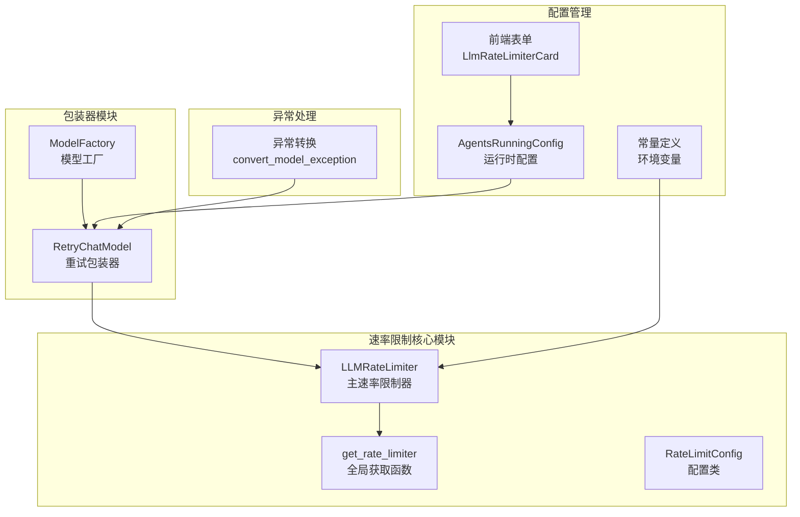
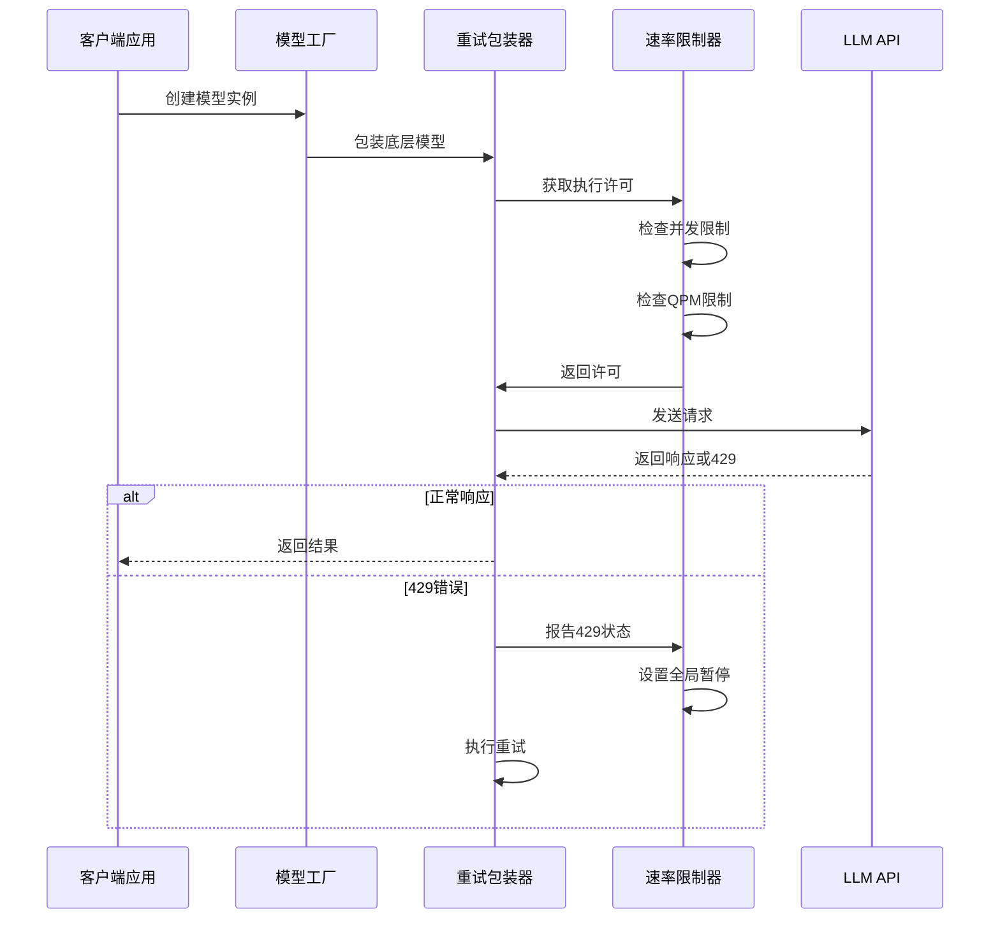
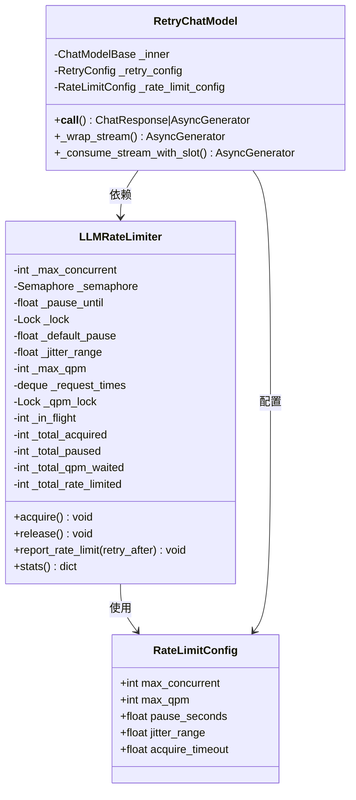
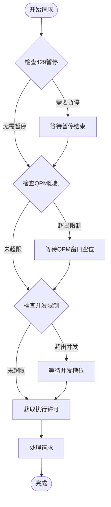
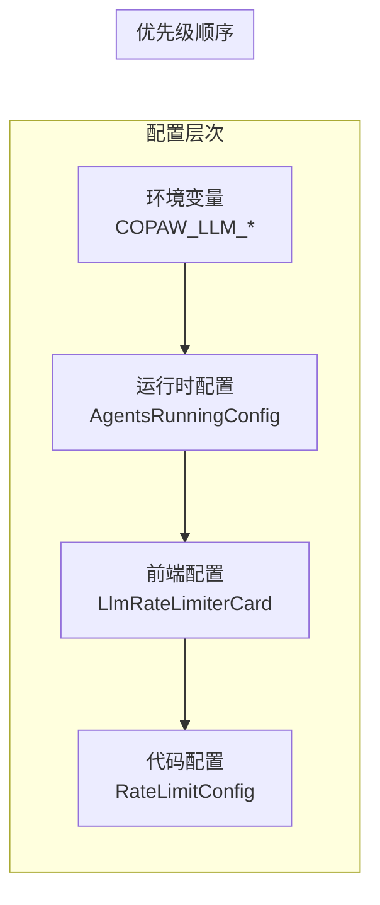
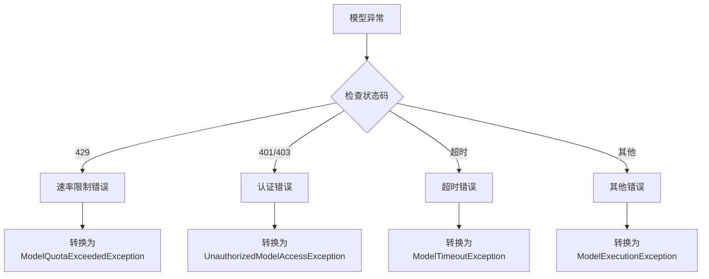
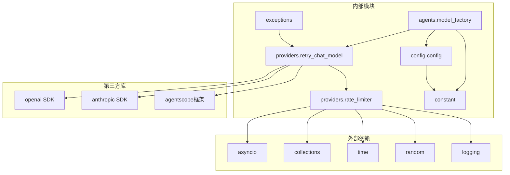

# LLM速率限制配置

<cite>
**本文档引用的文件**
- [rate_limiter.py](file://src/copaw/providers/rate_limiter.py)
- [retry_chat_model.py](file://src/copaw/providers/retry_chat_model.py)
- [constant.py](file://src/copaw/constant.py)
- [config.py](file://src/copaw/config/config.py)
- [model_factory.py](file://src/copaw/agents/model_factory.py)
- [LlmRateLimiterCard.tsx](file://console/src/pages/Agent/Config/components/LlmRateLimiterCard.tsx)
- [config.en.md](file://website/public/docs/config.en.md)
- [exceptions.py](file://src/copaw/exceptions.py)
</cite>

## 目录
1. [简介](#简介)
2. [项目结构](#项目结构)
3. [核心组件](#核心组件)
4. [架构概览](#架构概览)
5. [详细组件分析](#详细组件分析)
6. [依赖关系分析](#依赖关系分析)
7. [性能考虑](#性能考虑)
8. [故障排除指南](#故障排除指南)
9. [结论](#结论)
10. [附录](#附录)

## 简介

LLM速率限制配置是CoPaw系统中一个关键的基础设施组件，用于控制大型语言模型（LLM）API调用的频率和并发性，防止API配额超限和服务器过载。该组件实现了多层保护机制，包括请求频率控制、并发连接管理和智能重试策略。

本系统采用全局单例模式的LLM速率限制器，结合滑动窗口算法和信号量机制，为所有代理和工作流提供统一的速率限制服务。通过环境变量和运行时配置，用户可以灵活调整各种限制参数以适应不同的使用场景。

## 项目结构

LLM速率限制功能在项目中的组织结构如下：

**图表来源**
- [rate_limiter.py:30-279](file://src/copaw/providers/rate_limiter.py#L30-L279)
- [retry_chat_model.py:204-477](file://src/copaw/providers/retry_chat_model.py#L204-L477)
- [model_factory.py:720-787](file://src/copaw/agents/model_factory.py#L720-L787)

**章节来源**
- [rate_limiter.py:1-279](file://src/copaw/providers/rate_limiter.py#L1-L279)
- [retry_chat_model.py:1-477](file://src/copaw/providers/retry_chat_model.py#L1-L477)

## 核心组件

### LLMRateLimiter 主速率限制器

LLMRateLimiter是整个速率限制系统的核心，实现了以下关键功能：

- **全局单例模式**：确保整个应用只有一个速率限制实例
- **多层限制机制**：同时控制并发数和请求频率
- **智能等待策略**：基于滑动窗口算法的预等待机制
- **429状态处理**：统一处理API返回的429状态码

### RetryChatModel 重试包装器

RetryChatModel作为中间层，提供了透明的重试和速率限制功能：

- **透明包装**：对上层调用者完全透明
- **智能重试**：自动重试瞬时性错误（429、超时、连接错误）
- **指数退避**：实现指数级延迟重试策略
- **流式支持**：完整支持流式响应的重试

### 配置管理系统

系统提供了多层次的配置管理：

- **环境变量配置**：通过COPAW_LLM_*环境变量设置默认值
- **运行时配置**：支持动态修改运行时参数
- **前端可视化**：提供图形化配置界面
- **代理特定配置**：支持每个代理的独立配置

**章节来源**
- [rate_limiter.py:30-196](file://src/copaw/providers/rate_limiter.py#L30-L196)
- [retry_chat_model.py:69-90](file://src/copaw/providers/retry_chat_model.py#L69-L90)
- [constant.py:208-245](file://src/copaw/constant.py#L208-L245)

## 架构概览

LLM速率限制系统的整体架构采用分层设计，确保了高内聚低耦合：

**图表来源**
- [model_factory.py:781-785](file://src/copaw/agents/model_factory.py#L781-L785)
- [retry_chat_model.py:269-354](file://src/copaw/providers/retry_chat_model.py#L269-L354)
- [rate_limiter.py:70-174](file://src/copaw/providers/rate_limiter.py#L70-L174)

系统架构的关键特点：

1. **全局一致性**：所有代理共享同一个速率限制器实例
2. **异步安全**：使用asyncio原语确保线程安全
3. **可观察性**：提供详细的统计信息和日志记录
4. **可配置性**：支持运行时动态调整参数

## 详细组件分析

### 速率限制器实现

#### 核心数据结构

**图表来源**
- [rate_limiter.py:30-196](file://src/copaw/providers/rate_limiter.py#L30-L196)
- [retry_chat_model.py:69-90](file://src/copaw/providers/retry_chat_model.py#L69-L90)
- [retry_chat_model.py:204-234](file://src/copaw/providers/retry_chat_model.py#L204-L234)

#### QPM滑动窗口算法

速率限制器采用了高效的滑动窗口算法来实现每分钟查询限制：

**图表来源**
- [rate_limiter.py:70-144](file://src/copaw/providers/rate_limiter.py#L70-L144)

#### 并发控制机制

系统使用信号量实现并发控制，确保不会超过设定的最大并发数：

- **信号量管理**：每个并发请求占用一个信号量槽位
- **智能释放**：流式响应在开始传输后立即释放槽位
- **所有权跟踪**：精确跟踪信号量的所有权避免死锁

**章节来源**
- [rate_limiter.py:43-68](file://src/copaw/providers/rate_limiter.py#L43-L68)
- [rate_limiter.py:107-110](file://src/copaw/providers/rate_limiter.py#L107-L110)

### 配置管理

#### 环境变量配置

系统支持通过环境变量进行全局配置：

| 环境变量 | 默认值 | 最小值 | 描述 |
|---------|--------|--------|------|
| COPAW_LLM_MAX_CONCURRENT | 10 | 1 | 最大并发请求数 |
| COPAW_LLM_MAX_QPM | 600 | 0 | 每分钟最大查询数 |
| COPAW_LLM_RATE_LIMIT_PAUSE | 5.0 | 1.0 | 429后的默认暂停时间 |
| COPAW_LLM_RATE_LIMIT_JITTER | 1.0 | 0.0 | 暂停时间抖动范围 |
| COPAW_LLM_ACQUIRE_TIMEOUT | 300.0 | 10.0 | 获取执行槽位的超时时间 |

#### 运行时配置

运行时配置提供了更精细的控制选项：

**图表来源**
- [constant.py:208-245](file://src/copaw/constant.py#L208-L245)
- [config.py:564-590](file://src/copaw/config/config.py#L564-L590)

**章节来源**
- [constant.py:208-245](file://src/copaw/constant.py#L208-L245)
- [config.py:564-590](file://src/copaw/config/config.py#L564-L590)

### 异常处理和重试机制

#### 错误分类系统

系统实现了智能的错误分类和处理机制：

**图表来源**
- [exceptions.py:165-254](file://src/copaw/exceptions.py#L165-L254)

#### 重试策略

系统采用指数退避的重试策略，有效避免雪崩效应：

- **基础延迟**：由llm_backoff_base控制
- **最大延迟**：由llm_backoff_cap控制
- **重试次数**：由llm_max_retries控制
- **条件判断**：仅对瞬时性错误进行重试

**章节来源**
- [retry_chat_model.py:124-140](file://src/copaw/providers/retry_chat_model.py#L124-L140)
- [exceptions.py:165-254](file://src/copaw/exceptions.py#L165-L254)

## 依赖关系分析

### 组件间依赖

**图表来源**
- [rate_limiter.py:19-27](file://src/copaw/providers/rate_limiter.py#L19-L27)
- [retry_chat_model.py:26-51](file://src/copaw/providers/retry_chat_model.py#L26-L51)

### 关键依赖点

1. **异步原语依赖**：系统完全基于asyncio构建，确保高性能
2. **第三方SDK集成**：支持主流LLM提供商的SDK
3. **配置系统集成**：与完整的配置管理系统无缝集成
4. **异常处理系统**：与统一的异常处理框架协同工作

**章节来源**
- [rate_limiter.py:19-27](file://src/copaw/providers/rate_limiter.py#L19-L27)
- [retry_chat_model.py:26-51](file://src/copaw/providers/retry_chat_model.py#L26-L51)

## 性能考虑

### 时间复杂度分析

- **获取执行许可**：O(1)平均时间复杂度
- **QPM检查**：O(n)最坏情况，其中n为60秒内的请求数
- **滑动窗口维护**：每次操作O(1)，摊销O(1)
- **统计收集**：O(n)用于计算最近60秒的请求数

### 内存使用优化

- **滑动窗口存储**：使用deque存储单调递增的时间戳
- **最小化状态复制**：只存储必要的运行时状态
- **延迟初始化**：全局速率限制器按需初始化
- **资源清理**：正确释放异步锁和信号量

### 并发安全性

系统通过以下机制确保并发安全：

- **异步锁保护**：使用asyncio.Lock保护共享状态
- **原子操作**：在QPM检查中使用原子性的队列操作
- **不可变配置**：配置对象在初始化后保持不变
- **所有权模型**：明确的信号量所有权转移机制

## 故障排除指南

### 常见问题诊断

#### 429错误频繁出现

**可能原因**：
- QPM限制过于严格
- API提供商的实际限制较低
- 突发性流量高峰

**解决方案**：
1. 检查COPAW_LLM_MAX_QPM配置
2. 查看API提供商的实际配额限制
3. 调整llm_rate_limit_pause参数
4. 实施流量整形策略

#### 并发阻塞问题

**可能原因**：
- max_concurrent设置过低
- 流式响应处理不当
- 信号量泄漏

**解决方案**：
1. 增加llm_max_concurrent值
2. 检查流式响应的槽位释放逻辑
3. 查看统计信息确认槽位使用情况

#### 超时错误

**可能原因**：
- acquire_timeout设置过短
- 网络延迟过高
- 后端服务响应慢

**解决方案**：
1. 增加llm_acquire_timeout
2. 检查网络连接质量
3. 监控后端服务性能

### 监控和调试

#### 关键监控指标

| 指标名称 | 描述 | 典型阈值 |
|---------|------|---------|
| total_rate_limited | 429错误总数 | 越少越好 |
| total_qpm_waited | QPM等待次数 | 控制在合理范围内 |
| total_paused | 全局暂停次数 | 反映429频率 |
| current_in_flight | 当前飞行中的请求数 | 不应超过max_concurrent |
| requests_last_60s | 最近60秒请求数 | 应接近但不超过max_qpm |

#### 调试工具

1. **统计接口**：通过stats()方法获取实时统计
2. **日志分析**：查看LLM rate limiter相关的日志条目
3. **性能监控**：使用Prometheus/Grafana监控关键指标
4. **配置验证**：通过前端界面验证配置有效性

**章节来源**
- [rate_limiter.py:175-196](file://src/copaw/providers/rate_limiter.py#L175-L196)
- [retry_chat_model.py:301-310](file://src/copaw/providers/retry_chat_model.py#L301-L310)

## 结论

LLM速率限制配置组件通过精心设计的多层保护机制，为CoPaw系统提供了可靠的服务质量保障。该组件的主要优势包括：

1. **全面的保护机制**：同时控制并发数和请求频率
2. **智能的等待策略**：预等待机制有效预防429错误
3. **灵活的配置系统**：支持多层级的配置管理
4. **完善的异常处理**：智能的错误分类和重试机制
5. **优秀的性能表现**：基于异步原语的高效实现

通过合理的配置和监控，该组件能够有效平衡系统性能和服务质量，在保证API合规性的同时最大化系统吞吐量。

## 附录

### 配置最佳实践

#### 开发环境配置
- max_concurrent: 3-5
- max_qpm: 100-200
- rate_limit_pause: 2-5秒
- rate_limit_jitter: 0.5-1.0秒
- acquire_timeout: 60-120秒

#### 生产环境配置
- max_concurrent: 10-50（根据API配额调整）
- max_qpm: 500-1000（根据API配额调整）
- rate_limit_pause: 5-15秒
- rate_limit_jitter: 1.0-3.0秒
- acquire_timeout: 180-300秒

#### 突发流量处理
- 实施流量整形策略
- 增加适当的缓冲区
- 监控关键性能指标
- 准备应急降级方案

### 相关文件路径

- **核心实现**：src/copaw/providers/rate_limiter.py
- **包装器**：src/copaw/providers/retry_chat_model.py
- **配置定义**：src/copaw/config/config.py
- **常量定义**：src/copaw/constant.py
- **前端配置**：console/src/pages/Agent/Config/components/LlmRateLimiterCard.tsx
- **文档说明**：website/public/docs/config.en.md