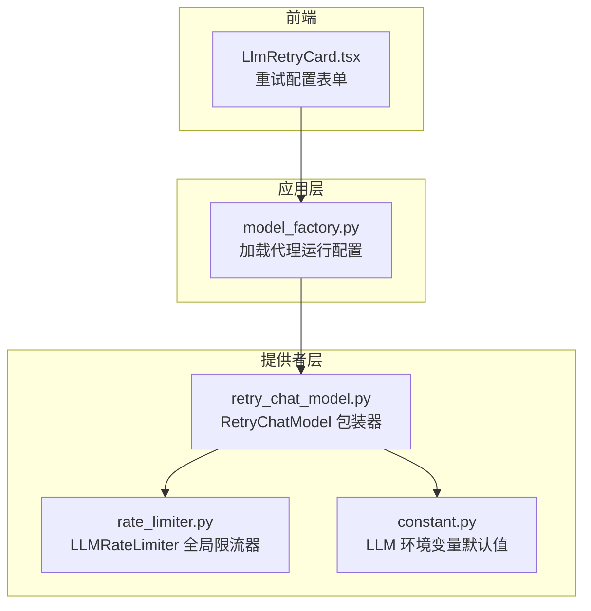
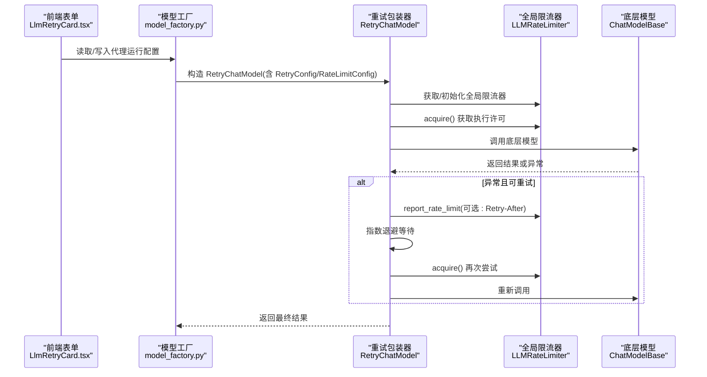
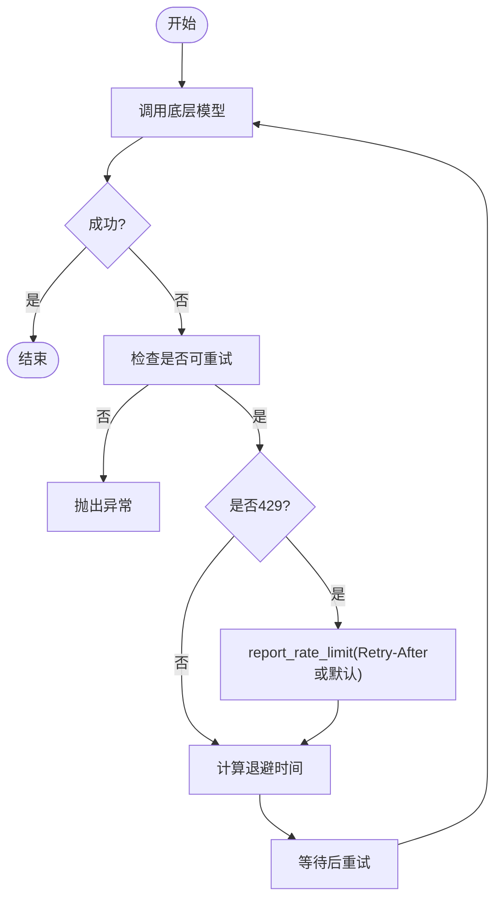
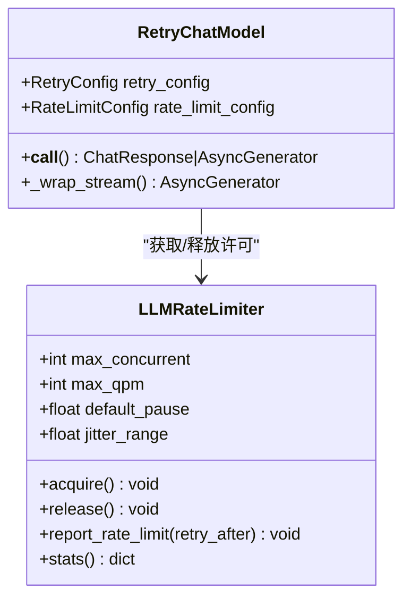
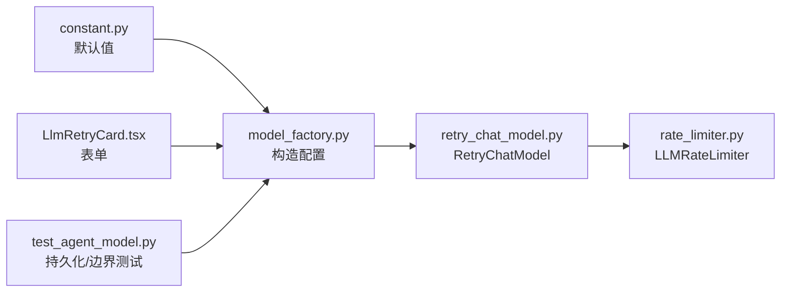

# LLM重试配置

<cite>
**本文引用的文件**
- [retry_chat_model.py](file://src/copaw/providers/retry_chat_model.py)
- [rate_limiter.py](file://src/copaw/providers/rate_limiter.py)
- [constant.py](file://src/copaw/constant.py)
- [model_factory.py](file://src/copaw/agents/model_factory.py)
- [LlmRetryCard.tsx](file://console/src/pages/Agent/Config/components/LlmRetryCard.tsx)
- [test_agent_model.py](file://tests/unit/workspace/test_agent_model.py)
- [config.en.md](file://website/public/docs/config.en.md)
</cite>

## 目录
1. [简介](#简介)
2. [项目结构](#项目结构)
3. [核心组件](#核心组件)
4. [架构总览](#架构总览)
5. [详细组件分析](#详细组件分析)
6. [依赖关系分析](#依赖关系分析)
7. [性能考量](#性能考量)
8. [故障排查指南](#故障排查指南)
9. [结论](#结论)
10. [附录](#附录)

## 简介
本文件系统性阐述 Copaw 中 LLM 重试配置与执行机制，覆盖重试策略、失败判定、指数退避、并发与速率限制协同、以及在不同网络环境下的配置建议与监控调试方法。目标是帮助开发者与运维人员在不稳定或高延迟网络环境下，通过合理的重试与限流参数，提升系统稳定性与吞吐表现。

## 项目结构
围绕 LLM 重试与速率控制的关键文件组织如下：
- providers 层：实现重试包装器与全局速率限制器
- agents 层：模型工厂负责加载代理运行期配置并注入重试/限流
- console 前端：提供重试配置表单卡片
- tests：验证配置持久化与边界约束
- website 文档：提供默认值与字段说明

图表来源
- [model_factory.py:727-785](file://src/copaw/agents/model_factory.py#L727-L785)
- [retry_chat_model.py:204-354](file://src/copaw/providers/retry_chat_model.py#L204-L354)
- [rate_limiter.py:30-174](file://src/copaw/providers/rate_limiter.py#L30-L174)
- [constant.py:187-249](file://src/copaw/constant.py#L187-L249)
- [LlmRetryCard.tsx:9-121](file://console/src/pages/Agent/Config/components/LlmRetryCard.tsx#L9-L121)

章节来源
- [model_factory.py:727-785](file://src/copaw/agents/model_factory.py#L727-L785)
- [retry_chat_model.py:204-354](file://src/copaw/providers/retry_chat_model.py#L204-L354)
- [rate_limiter.py:30-174](file://src/copaw/providers/rate_limiter.py#L30-L174)
- [constant.py:187-249](file://src/copaw/constant.py#L187-L249)
- [LlmRetryCard.tsx:9-121](file://console/src/pages/Agent/Config/components/LlmRetryCard.tsx#L9-L121)

## 核心组件
- RetryConfig：定义是否启用重试、最大重试次数、基础退避时间与退避上限
- RateLimitConfig：定义并发上限、每分钟查询上限、429全局暂停时长、暂停抖动范围、获取槽位超时
- RetryChatModel：对任意 ChatModelBase 进行透明重试包装，支持非流式与流式响应
- LLMRateLimiter：全局单例，协调并发信号量、QPM 滑动窗口、429全局暂停与抖动

章节来源
- [retry_chat_model.py:59-90](file://src/copaw/providers/retry_chat_model.py#L59-L90)
- [rate_limiter.py:30-69](file://src/copaw/providers/rate_limiter.py#L30-L69)

## 架构总览
下图展示从代理配置到模型调用、再到重试与限流的整体流程：

图表来源
- [LlmRetryCard.tsx:9-121](file://console/src/pages/Agent/Config/components/LlmRetryCard.tsx#L9-L121)
- [model_factory.py:727-785](file://src/copaw/agents/model_factory.py#L727-L785)
- [retry_chat_model.py:269-354](file://src/copaw/providers/retry_chat_model.py#L269-L354)
- [rate_limiter.py:70-111](file://src/copaw/providers/rate_limiter.py#L70-L111)

## 详细组件分析

### 重试策略与失败判定
- 可重试条件
  - SDK 特定异常：如 OpenAI/Anthropic 的限流、超时、连接错误
  - HTTP 状态码：429、500、502、503、504、529
- 429 专项处理
  - 若判定为 429，记录全局暂停时间，并在后续 acquire() 时进行统一等待
  - 支持从异常头中解析 Retry-After，否则使用默认暂停时长
- 流式与非流式差异
  - 非流式：异常直接重试整次请求
  - 流式：若中途失败，整体重试，避免半消费流的复杂恢复

图表来源
- [retry_chat_model.py:124-140](file://src/copaw/providers/retry_chat_model.py#L124-L140)
- [retry_chat_model.py:330-354](file://src/copaw/providers/retry_chat_model.py#L330-L354)
- [retry_chat_model.py:372-476](file://src/copaw/providers/retry_chat_model.py#L372-L476)

章节来源
- [retry_chat_model.py:124-140](file://src/copaw/providers/retry_chat_model.py#L124-L140)
- [retry_chat_model.py:330-354](file://src/copaw/providers/retry_chat_model.py#L330-L354)
- [retry_chat_model.py:372-476](file://src/copaw/providers/retry_chat_model.py#L372-L476)

### 指数退避与上限
- 退避公式：base × 2^(attempt-1)，并受 cap 上限约束
- 安全边界：最小基础退避、最小退避上限、最小最大重试次数
- 重试次数来源：若启用，则为 max_retries；若禁用则为 0

章节来源
- [retry_chat_model.py:163-178](file://src/copaw/providers/retry_chat_model.py#L163-L178)
- [retry_chat_model.py:196-201](file://src/copaw/providers/retry_chat_model.py#L196-L201)
- [retry_chat_model.py:281-284](file://src/copaw/providers/retry_chat_model.py#L281-L284)

### 并发与速率限制协同
- 并发控制：信号量限制同时在途请求数
- QPM 控制：60 秒滑动窗口，预阻塞防止 429
- 全局暂停：收到 429 后统一暂停，配合抖动避免“惊群”
- 获取槽位超时：超过阈值直接报错，避免无限等待

图表来源
- [rate_limiter.py:30-174](file://src/copaw/providers/rate_limiter.py#L30-L174)
- [retry_chat_model.py:204-354](file://src/copaw/providers/retry_chat_model.py#L204-L354)

章节来源
- [rate_limiter.py:30-174](file://src/copaw/providers/rate_limiter.py#L30-L174)
- [retry_chat_model.py:204-354](file://src/copaw/providers/retry_chat_model.py#L204-L354)

### 代理运行配置与前端表单
- 代理运行配置包含重试开关、最大重试次数、基础/上限退避、并发/QPM/暂停/抖动/获取超时等
- 前端表单提供校验与联动：启用状态影响字段可用性；退避上限需不小于基础值
- 配置持久化：保存于 agent.json 的 running 字段，重启后仍生效

章节来源
- [model_factory.py:734-746](file://src/copaw/agents/model_factory.py#L734-L746)
- [LlmRetryCard.tsx:9-121](file://console/src/pages/Agent/Config/components/LlmRetryCard.tsx#L9-L121)
- [test_agent_model.py:270-288](file://tests/unit/workspace/test_agent_model.py#L270-L288)

### 环境变量默认值与字段说明
- 默认重试次数、基础/上限退避、并发、QPM、暂停、抖动、获取超时等均来自环境变量加载
- 文档页提供字段清单与默认值参考

章节来源
- [constant.py:187-249](file://src/copaw/constant.py#L187-L249)
- [config.en.md:356-368](file://website/public/docs/config.en.md#L356-L368)

## 依赖关系分析
- RetryChatModel 依赖 LLMRateLimiter 获取/释放许可，并在 429 时上报暂停
- RetryChatModel 依赖 RetryConfig/RateLimitConfig 决定行为
- 模型工厂根据代理运行配置构造 RetryChatModel
- 前端表单驱动代理运行配置的读取与保存

图表来源
- [constant.py:187-249](file://src/copaw/constant.py#L187-L249)
- [model_factory.py:727-785](file://src/copaw/agents/model_factory.py#L727-L785)
- [retry_chat_model.py:204-354](file://src/copaw/providers/retry_chat_model.py#L204-L354)
- [rate_limiter.py:211-272](file://src/copaw/providers/rate_limiter.py#L211-L272)
- [LlmRetryCard.tsx:9-121](file://console/src/pages/Agent/Config/components/LlmRetryCard.tsx#L9-L121)
- [test_agent_model.py:270-297](file://tests/unit/workspace/test_agent_model.py#L270-L297)

章节来源
- [model_factory.py:727-785](file://src/copaw/agents/model_factory.py#L727-L785)
- [retry_chat_model.py:204-354](file://src/copaw/providers/retry_chat_model.py#L204-L354)
- [rate_limiter.py:211-272](file://src/copaw/providers/rate_limiter.py#L211-L272)
- [LlmRetryCard.tsx:9-121](file://console/src/pages/Agent/Config/components/LlmRetryCard.tsx#L9-L121)
- [test_agent_model.py:270-297](file://tests/unit/workspace/test_agent_model.py#L270-L297)

## 性能考量
- 退避策略
  - 基础退避过小会放大重试风暴，过大则增加端到端延迟
  - 退避上限过低可能导致频繁达到上限而无法缓解上游压力
- 并发与 QPM
  - 并发过高易触发上游限流；应结合供应商配额与平均响应时间逐步调优
  - QPM 作为预防性限流，建议开启并在高峰期动态评估
- 抖动与暂停
  - 抖动有助于分散唤醒时刻，减少再次突发
  - 全局暂停时长应与上游 Retry-After 对齐，避免盲目等待
- 获取超时
  - 过短可能误判为资源不足，过长导致堆积；应结合业务 SLA 设定

## 故障排查指南
- 常见症状与定位
  - 频繁 429：检查 QPM 是否过低、并发是否过高；确认全局暂停是否生效
  - 长时间阻塞：检查获取超时是否过短；查看限流统计中的等待次数
  - 重试无效：确认异常类型是否被判定为可重试；核对状态码集合
- 监控与日志
  - 限流器统计：并发、在途、QPM 最近 60 秒请求数、暂停剩余时间、累计等待与限流次数
  - 重试日志：每次重试的尝试次数、退避时长、异常类型
- 调试步骤
  - 临时提高基础退避与上限，观察是否缓解上游压力
  - 降低并发与 QPM，验证是否由自身流量过大引发 429
  - 开启更详细的日志级别，跟踪 acquire()/release() 与 report_rate_limit() 的交互

章节来源
- [rate_limiter.py:175-196](file://src/copaw/providers/rate_limiter.py#L175-L196)
- [retry_chat_model.py:439-471](file://src/copaw/providers/retry_chat_model.py#L439-L471)

## 结论
Copaw 的 LLM 重试与限流体系以 RetryChatModel 为核心，结合全局 LLMRateLimiter 实现并发、QPM、429 全局暂停与抖动的协同控制。通过合理配置重试次数、基础/上限退避、并发与 QPM，可在高延迟与不稳定网络环境中显著提升稳定性与吞吐表现。建议以渐进方式调整参数，并结合监控指标持续优化。

## 附录

### 关键参数与默认值参考
- 重试相关
  - llm_retry_enabled：是否启用自动重试
  - llm_max_retries：最大重试次数（≥1）
  - llm_backoff_base：基础退避（秒，≥0.1）
  - llm_backoff_cap：退避上限（秒，≥0.5 且 ≥ 基础）
- 速率与并发
  - llm_max_concurrent：最大并发（≥1）
  - llm_max_qpm：每分钟查询上限（0 表示不限制）
  - llm_rate_limit_pause：429 默认暂停（秒，≥1）
  - llm_rate_limit_jitter：暂停抖动（秒，≥0）
  - llm_acquire_timeout：获取槽位超时（秒，≥10）

章节来源
- [constant.py:187-249](file://src/copaw/constant.py#L187-L249)
- [config.en.md:356-368](file://website/public/docs/config.en.md#L356-L368)