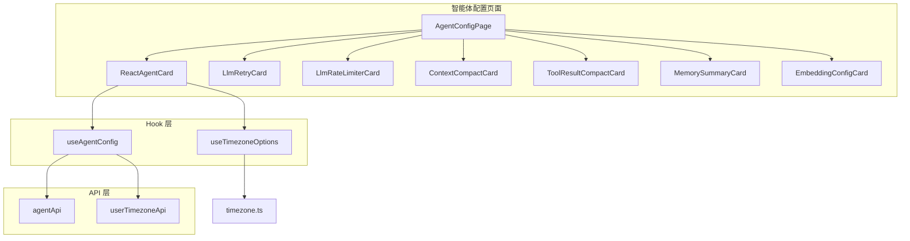
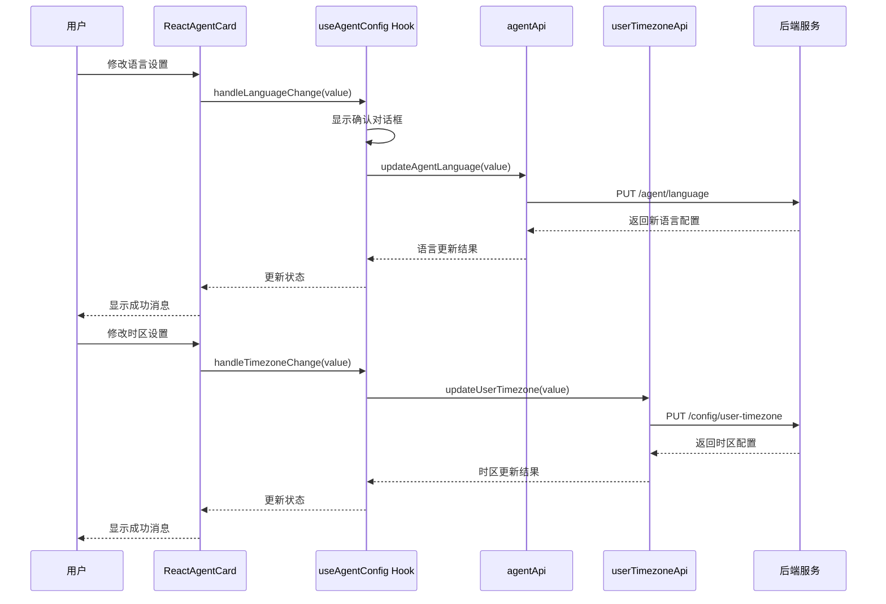
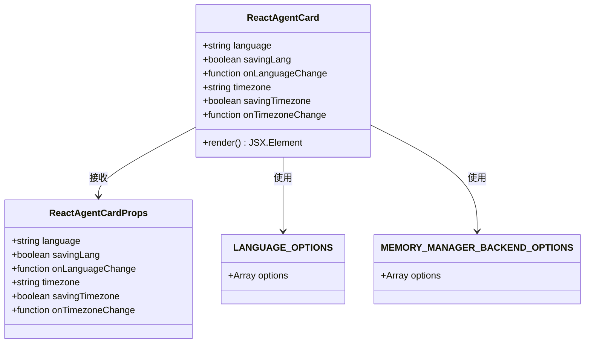
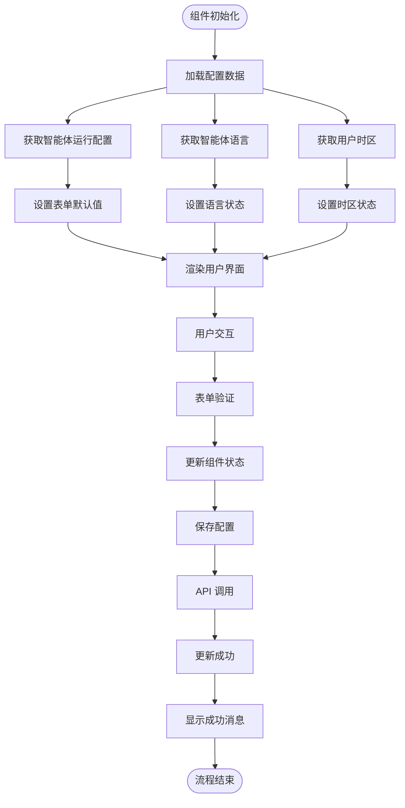
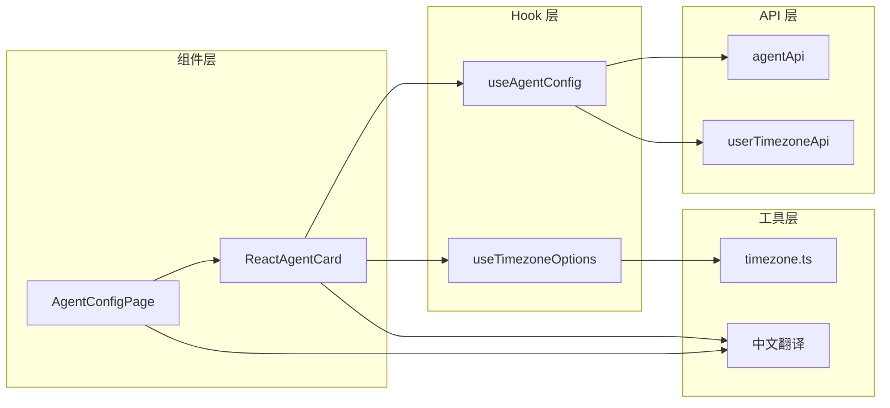

# ReactAgentCard 配置

<cite>
**本文档引用的文件**
- [ReactAgentCard.tsx](file://console/src/pages/Agent/Config/components/ReactAgentCard.tsx)
- [useAgentConfig.tsx](file://console/src/pages/Agent/Config/useAgentConfig.tsx)
- [AgentConfigPage.tsx](file://console/src/pages/Agent/Config/index.tsx)
- [agent.ts](file://console/src/api/modules/agent.ts)
- [userTimezone.ts](file://console/src/api/modules/userTimezone.ts)
- [useTimezoneOptions.ts](file://console/src/hooks/useTimezoneOptions.ts)
- [timezone.ts](file://console/src/constants/timezone.ts)
- [agent.ts 类型定义](file://console/src/api/types/agent.ts)
- [AgentConfigPage 样式](file://console/src/pages/Agent/Config/index.module.less)
- [中文翻译资源](file://console/src/locales/zh.json)
</cite>

## 目录
1. [简介](#简介)
2. [项目结构](#项目结构)
3. [核心组件](#核心组件)
4. [架构概览](#架构概览)
5. [详细组件分析](#详细组件分析)
6. [依赖关系分析](#依赖关系分析)
7. [性能考虑](#性能考虑)
8. [故障排除指南](#故障排除指南)
9. [结论](#结论)
10. [附录](#附录)

## 简介

ReactAgentCard 是 CoPaw 控制台中智能体运行配置的核心组件，专门负责 ReAct 智能体的参数配置管理。该组件提供了智能体语言设置、时区配置、最大迭代次数、记忆管理后端选择以及上下文长度限制等关键配置功能。

该组件采用现代化的 React Hooks 架构，结合 Ant Design 表单组件，实现了完整的表单验证、状态管理和用户交互逻辑。通过与后端 API 的紧密集成，确保配置变更能够实时生效并持久化存储。

## 项目结构

ReactAgentCard 组件位于智能体配置页面的组件目录中，与其它配置卡片组件共同构成完整的配置界面：

**图表来源**
- [AgentConfigPage.tsx:16-103](file://console/src/pages/Agent/Config/index.tsx#L16-L103)
- [ReactAgentCard.tsx:25-134](file://console/src/pages/Agent/Config/components/ReactAgentCard.tsx#L25-L134)

**章节来源**
- [AgentConfigPage.tsx:1-106](file://console/src/pages/Agent/Config/index.tsx#L1-L106)
- [ReactAgentCard.tsx:1-135](file://console/src/pages/Agent/Config/components/ReactAgentCard.tsx#L1-L135)

## 核心组件

ReactAgentCard 组件提供了以下核心功能模块：

### 语言配置模块
- **智能体语言选择**：支持中文、英语、俄语三种语言选项
- **动态文件复制**：切换语言时自动复制对应的 MD 文件
- **确认对话框**：防止意外的语言切换

### 时区配置模块
- **用户时区设置**：基于地理位置的时区选择
- **实时显示**：时区名称的本地化显示
- **系统集成**：与系统时区设置保持同步

### ReAct 智能体参数模块
- **最大迭代次数**：控制智能体推理-行动循环次数
- **记忆管理后端**：当前支持 ReMeLight 后端
- **上下文长度限制**：控制模型输入的最大 token 数

**章节来源**
- [ReactAgentCard.tsx:6-14](file://console/src/pages/Agent/Config/components/ReactAgentCard.tsx#L6-L14)
- [ReactAgentCard.tsx:37-131](file://console/src/pages/Agent/Config/components/ReactAgentCard.tsx#L37-L131)

## 架构概览

ReactAgentCard 采用分层架构设计，确保各层职责清晰分离：

**图表来源**
- [useAgentConfig.tsx:61-121](file://console/src/pages/Agent/Config/useAgentConfig.tsx#L61-L121)
- [agent.ts:37-43](file://console/src/api/modules/agent.ts#L37-L43)
- [userTimezone.ts:10-14](file://console/src/api/modules/userTimezone.ts#L10-L14)

## 详细组件分析

### ReactAgentCard 组件结构

**图表来源**
- [ReactAgentCard.tsx:16-23](file://console/src/pages/Agent/Config/components/ReactAgentCard.tsx#L16-L23)
- [ReactAgentCard.tsx:6-14](file://console/src/pages/Agent/Config/components/ReactAgentCard.tsx#L6-L14)

### 表单字段详细说明

#### 语言设置字段
| 字段属性 | 值 | 描述 |
|---------|-----|------|
| 字段名 | 无 | 作为表单项存在，但不直接绑定配置值 |
| 标签 | 智能体语言 | 用户界面显示的标签 |
| 输入组件 | Select 下拉选择框 | 提供语言选项选择 |
| 选项来源 | LANGUAGE_OPTIONS | 预定义的语言选项数组 |
| 默认值 | zh | 中文为默认语言 |
| 验证规则 | 无 | 支持任意语言选项切换 |
| 交互逻辑 | 异步确认 | 切换前显示确认对话框 |

#### 时区设置字段
| 字段属性 | 值 | 描述 |
|---------|-----|------|
| 字段名 | 无 | 作为表单项存在，但不直接绑定配置值 |
| 标签 | 用户时区 | 用户界面显示的标签 |
| 输入组件 | Select 下拉选择框 | 提供时区选项选择 |
| 选项来源 | useTimezoneOptions() | 动态生成的时区选项 |
| 默认值 | UTC | 世界协调时间为默认时区 |
| 验证规则 | 无 | 支持任意有效时区选择 |
| 交互逻辑 | 实时更新 | 选择后立即更新用户时区 |

#### 最大迭代次数字段
| 字段属性 | 值 | 描述 |
|---------|-----|------|
| 字段名 | max_iters | 直接绑定到 AgentsRunningConfig |
| 标签 | 最大迭代次数 | 用户界面显示的标签 |
| 输入组件 | InputNumber 数字输入框 | 限制输入为数值类型 |
| 默认值 | 无 | 需要用户手动设置 |
| 验证规则 | 必填且 ≥ 1 | 确保合理的迭代次数 |
| 交互逻辑 | 数字输入验证 | 防止输入无效数值 |

#### 记忆管理后端字段
| 字段属性 | 值 | 描述 |
|---------|-----|------|
| 字段名 | memory_manager_backend | 直接绑定到 AgentsRunningConfig |
| 标签 | 记忆管理后端 | 用户界面显示的标签 |
| 输入组件 | Select 下拉选择框 | 提供后端选项选择 |
| 选项来源 | MEMORY_MANAGER_BACKEND_OPTIONS | 预定义的后端选项 |
| 默认值 | remelight | ReMeLight 为默认后端 |
| 验证规则 | 固定选项 | 仅支持预定义的后端类型 |
| 交互逻辑 | 警告提示 | 切换后需要重启服务生效 |

#### 最大输入长度字段
| 字段属性 | 值 | 描述 |
|---------|-----|------|
| 字段名 | max_input_length | 直接绑定到 AgentsRunningConfig |
| 标签 | 最大输入长度 | 用户界面显示的标签 |
| 输入组件 | InputNumber 数字输入框 | 限制输入为数值类型 |
| 默认值 | 无 | 需要用户手动设置 |
| 验证规则 | 必填且 ≥ 1000 | 确保足够的上下文长度 |
| 步长设置 | 1024 | 按 1024 递增，符合内存对齐 |

**章节来源**
- [ReactAgentCard.tsx:37-131](file://console/src/pages/Agent/Config/components/ReactAgentCard.tsx#L37-L131)
- [agent.ts 类型定义:48-66](file://console/src/api/types/agent.ts#L48-L66)

### 数据流分析

**图表来源**
- [useAgentConfig.tsx:20-39](file://console/src/pages/Agent/Config/useAgentConfig.tsx#L20-L39)
- [AgentConfigPage.tsx:16-31](file://console/src/pages/Agent/Config/index.tsx#L16-L31)

**章节来源**
- [useAgentConfig.tsx:1-138](file://console/src/pages/Agent/Config/useAgentConfig.tsx#L1-L138)
- [AgentConfigPage.tsx:16-103](file://console/src/pages/Agent/Config/index.tsx#L16-L103)

## 依赖关系分析

### 组件间依赖关系

**图表来源**
- [ReactAgentCard.tsx:1-4](file://console/src/pages/Agent/Config/components/ReactAgentCard.tsx#L1-L4)
- [useAgentConfig.tsx:1-7](file://console/src/pages/Agent/Config/useAgentConfig.tsx#L1-L7)

### 外部依赖分析

| 依赖包 | 版本 | 用途 | 重要性 |
|--------|------|------|--------|
| @agentscope-ai/design | ^1.0.0 | UI 组件库 | 高 |
| react-i18next | ^11.0.0 | 国际化支持 | 高 |
| @vvo/tzdb | ^6.100.0 | 时区数据 | 中 |
| ant-design | ^4.0.0 | 基础 UI 组件 | 高 |

**章节来源**
- [ReactAgentCard.tsx:1-4](file://console/src/pages/Agent/Config/components/ReactAgentCard.tsx#L1-L4)
- [useTimezoneOptions.ts:1-3](file://console/src/hooks/useTimezoneOptions.ts#L1-L3)

## 性能考虑

### 渲染性能优化

1. **组件拆分**：将配置页面拆分为多个独立卡片组件，支持按需渲染
2. **状态隔离**：使用 React Hooks 将状态管理局部化，避免不必要的重渲染
3. **懒加载**：时区选项通过 useMemo 缓存，减少重复计算

### 网络请求优化

1. **并发请求**：配置加载时使用 Promise.all 并发获取多个 API 数据
2. **错误处理**：统一的错误处理机制，避免单点故障影响整个页面
3. **状态管理**：Loading 和错误状态的合理管理，提升用户体验

### 内存管理

1. **组件卸载**：及时清理事件监听器和定时器
2. **状态清理**：组件卸载时清理临时状态和缓存数据

## 故障排除指南

### 常见问题及解决方案

#### 语言切换失败
**症状**：切换语言后没有生效或出现错误提示
**原因分析**：
- API 请求失败
- 文件复制过程中出现权限问题
- 配置文件损坏

**解决方案**：
1. 检查网络连接和 API 服务状态
2. 确认用户具有文件写入权限
3. 查看后端日志获取详细错误信息

#### 时区设置不生效
**症状**：选择时区后显示仍然为 UTC
**原因分析**：
- 时区数据加载失败
- 浏览器时区检测异常
- 后端时区配置错误

**解决方案**：
1. 刷新页面重新加载时区数据
2. 检查浏览器时区设置
3. 验证后端时区配置服务

#### 表单验证错误
**症状**：保存配置时报验证错误
**原因分析**：
- 必填字段为空
- 数值超出范围
- 格式不符合要求

**解决方案**：
1. 检查每个字段的验证规则
2. 确认输入值符合业务逻辑
3. 查看具体的错误提示信息

**章节来源**
- [useAgentConfig.tsx:51-59](file://console/src/pages/Agent/Config/useAgentConfig.tsx#L51-L59)
- [ReactAgentCard.tsx:77-82](file://console/src/pages/Agent/Config/components/ReactAgentCard.tsx#L77-L82)

## 结论

ReactAgentCard 配置组件通过精心设计的架构和完善的错误处理机制，为用户提供了一个强大而易用的智能体配置界面。组件不仅实现了基本的配置功能，还提供了丰富的用户体验特性，如确认对话框、实时验证和状态反馈。

该组件的成功之处在于：
1. **模块化设计**：清晰的职责分离和组件边界
2. **用户体验**：友好的交互设计和及时的状态反馈
3. **错误处理**：全面的错误捕获和用户友好的错误提示
4. **性能优化**：合理的状态管理和渲染优化策略

通过与其他配置卡片组件的协同工作，ReactAgentCard 构成了完整的智能体配置生态系统，为用户提供了全面的智能体管理能力。

## 附录

### 配置最佳实践

#### 语言设置建议
- **多语言部署**：在国际化环境中建议使用自动检测语言功能
- **文件备份**：切换语言前建议备份自定义的 MD 文件
- **测试验证**：切换后验证智能体功能是否正常

#### 时区配置建议
- **用户偏好**：根据用户的地理位置选择合适的时区
- **夏令时处理**：考虑夏令时对定时任务的影响
- **一致性原则**：确保系统时区与用户时区保持一致

#### ReAct 参数配置建议
- **迭代次数**：根据任务复杂度调整最大迭代次数
- **上下文长度**：根据模型能力和任务需求设置合适的上下文长度
- **性能监控**：定期监控智能体的性能表现并进行调整

### 相关配置卡片关联

ReactAgentCard 与以下配置卡片存在密切关联：

1. **LlmRetryCard**：负责 LLM 自动重试配置
2. **LlmRateLimiterCard**：负责并发限流配置  
3. **ContextCompactCard**：负责上下文压缩配置
4. **ToolResultCompactCard**：负责工具结果压缩配置
5. **MemorySummaryCard**：负责长期记忆配置
6. **EmbeddingConfigCard**：负责向量模型配置

这些卡片共同构成了完整的智能体运行配置体系，用户可以根据需要进行组合配置以获得最佳的智能体性能。