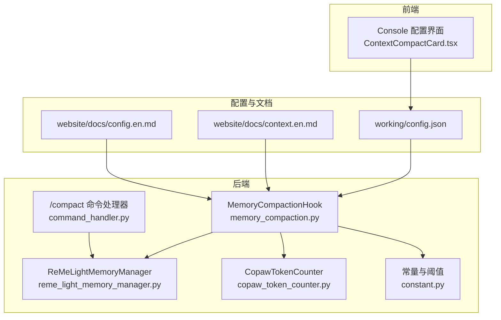
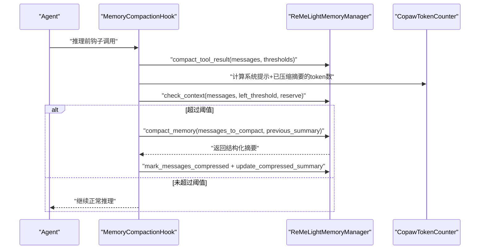
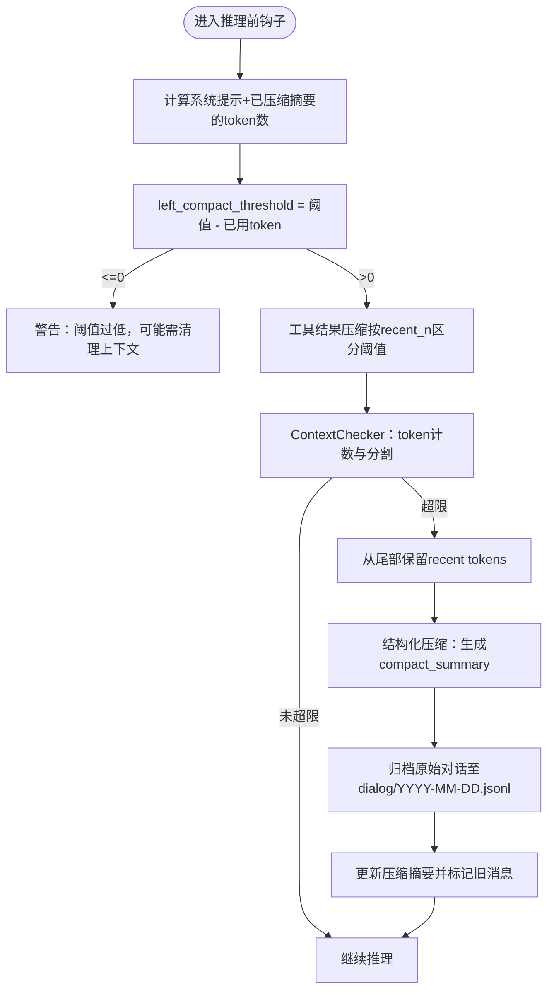
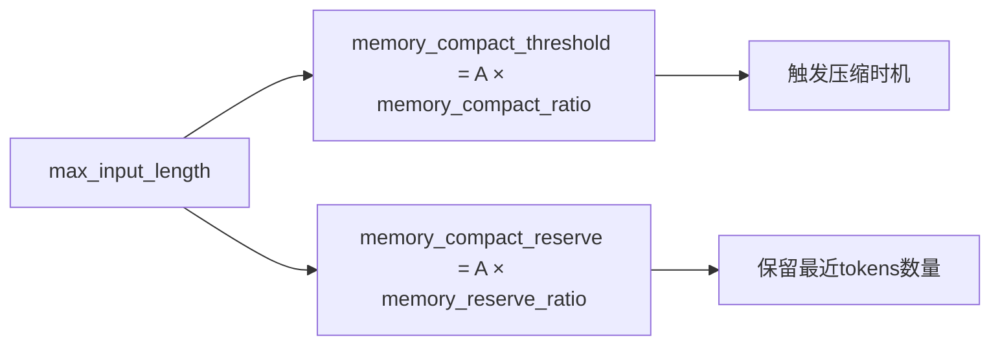
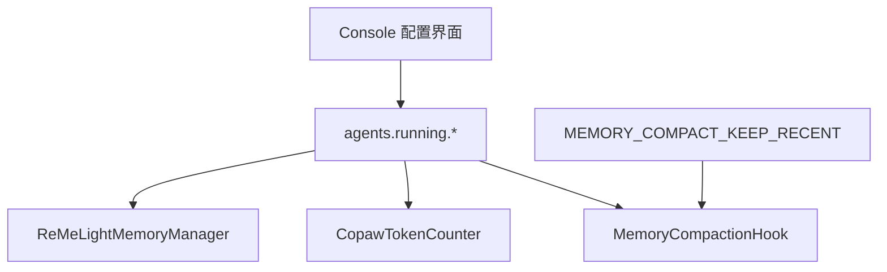

# 上下文压缩配置

<cite>
**本文引用的文件**
- [context.en.md](file://website/public/docs/context.en.md)
- [config.en.md](file://website/public/docs/config.en.md)
- [config.json](file://working/config.json)
- [memory_compaction.py](file://src/copaw/agents/hooks/memory_compaction.py)
- [reme_light_memory_manager.py](file://src/copaw/agents/memory/reme_light_memory_manager.py)
- [constant.py](file://src/copaw/constant.py)
- [copaw_token_counter.py](file://src/copaw/agents/utils/copaw_token_counter.py)
- [ContextCompactCard.tsx](file://console/src/pages/Agent/Config/components/ContextCompactCard.tsx)
- [command_handler.py](file://src/copaw/agents/command_handler.py)
</cite>

## 目录
1. [简介](#简介)
2. [项目结构](#项目结构)
3. [核心组件](#核心组件)
4. [架构总览](#架构总览)
5. [详细组件分析](#详细组件分析)
6. [依赖关系分析](#依赖关系分析)
7. [性能考量](#性能考量)
8. [故障排查指南](#故障排查指南)
9. [结论](#结论)
10. [附录](#附录)

## 简介
本文件系统化阐述 CoPaw 的“上下文压缩配置”机制，围绕以下目标展开：
- 解释上下文压缩算法的工作原理：文本截断策略、重要信息保留机制、上下文长度优化。
- 详解 max_input_length 参数的作用与配置方法，并说明不同长度设置对模型性能的影响。
- 提供不同应用场景（长对话、文档摘要、代码分析）下的上下文长度配置建议与优化策略。

## 项目结构
上下文压缩配置涉及前端配置界面、运行时配置加载、预推理钩子、内存管理器与 ReMe 组件之间的协作。核心文件分布如下：
- 文档与配置：context.en.md、config.en.md、working/config.json
- 运行时逻辑：memory_compaction.py、reme_light_memory_manager.py、copaw_token_counter.py
- 前端配置卡片：ContextCompactCard.tsx
- 常量与阈值：constant.py
- 手动压缩命令：command_handler.py

图表来源
- [memory_compaction.py:62-214](file://src/copaw/agents/hooks/memory_compaction.py#L62-L214)
- [reme_light_memory_manager.py:248-331](file://src/copaw/agents/memory/reme_light_memory_manager.py#L248-L331)
- [copaw_token_counter.py:252-285](file://src/copaw/agents/utils/copaw_token_counter.py#L252-L285)
- [constant.py:163-175](file://src/copaw/constant.py#L163-L175)
- [ContextCompactCard.tsx:1-90](file://console/src/pages/Agent/Config/components/ContextCompactCard.tsx#L1-L90)
- [config.json:407-457](file://working/config.json#L407-L457)

章节来源
- [context.en.md:1-319](file://website/public/docs/context.en.md#L1-L319)
- [config.en.md:370-388](file://website/public/docs/config.en.md#L370-L388)
- [config.json:407-457](file://working/config.json#L407-L457)

## 核心组件
- 上下文压缩配置对象（agents.running.context_compact）
  - 字段：context_compact_enabled、memory_compact_ratio、memory_reserve_ratio、compact_with_thinking_block、token_count_model、token_count_use_mirror、token_count_estimate_divisor
  - 关系式：memory_compact_threshold = max_input_length × memory_compact_ratio；memory_compact_reserve = max_input_length × memory_reserve_ratio
- 工具结果压缩配置（agents.running.tool_result_compact）
  - 字段：enabled、recent_n、old_max_bytes、recent_max_bytes、retention_days
- 运行时参数
  - max_input_length：模型上下文窗口大小（tokens），默认 131072（128K）
  - history_max_length：/history 命令输出最大字符数，默认 10000

章节来源
- [context.en.md:264-319](file://website/public/docs/context.en.md#L264-L319)
- [config.en.md:370-388](file://website/public/docs/config.en.md#L370-L388)
- [config.json:407-457](file://working/config.json#L407-L457)

## 架构总览
上下文压缩在每次推理前由 MemoryCompactionHook 触发，流程分为三步：
1) 工具结果压缩（按 recent_n 划分阈值，避免过长工具输出占用上下文）
2) 上下文检查（基于 token 计数判断是否超过阈值）
3) 对旧消息进行结构化压缩（生成 compact_summary 并归档原始对话）

图表来源
- [memory_compaction.py:62-214](file://src/copaw/agents/hooks/memory_compaction.py#L62-L214)
- [reme_light_memory_manager.py:248-331](file://src/copaw/agents/memory/reme_light_memory_manager.py#L248-L331)
- [copaw_token_counter.py:252-285](file://src/copaw/agents/utils/copaw_token_counter.py#L252-L285)

## 详细组件分析

### 1) 上下文压缩算法与策略
- 文本截断策略
  - 工具结果压缩：根据消息是否属于最近 recent_n 条，采用不同的字节阈值（old_max_bytes vs recent_max_bytes），超出部分写入 tool_result/{uuid}.txt 并在消息中保留片段与文件路径引用。
  - 对话压缩：当 token 数超过阈值时，从尾部向前保留 recent 消息（由 memory_reserve_ratio 决定），其余早期消息被压缩为结构化摘要。
- 重要信息保留机制
  - 系统提示与已生成的 compact_summary 始终保留，不参与压缩。
  - 保留区（Reserved Zone）确保最新 N 条消息完整，维持上下文连续性。
  - 压缩过程中保证不拆分 user-assistant 对话或 tool_use/tool_result 成对消息，保持语义完整性。
- 上下文长度优化
  - memory_compact_threshold = max_input_length × memory_compact_ratio
  - memory_compact_reserve = max_input_length × memory_reserve_ratio
  - token_count_estimate_divisor 用于基于字节估算 token 数，加速预估阶段。

图表来源
- [memory_compaction.py:84-141](file://src/copaw/agents/hooks/memory_compaction.py#L84-L141)
- [context.en.md:173-201](file://website/public/docs/context.en.md#L173-L201)

章节来源
- [context.en.md:145-201](file://website/public/docs/context.en.md#L145-L201)
- [memory_compaction.py:84-141](file://src/copaw/agents/hooks/memory_compaction.py#L84-L141)

### 2) max_input_length 参数详解与配置
- 作用
  - 定义模型上下文窗口大小（以 token 为单位），是计算阈值与保留区的基础。
  - 影响 memory_compact_threshold 与 memory_compact_reserve 的绝对值。
- 默认值与范围
  - 默认 131072（128K），最小建议 ≥ 1000。
- 配置位置与方式
  - 全局配置：agents.running.max_input_length
  - 可通过前端配置卡片实时查看与计算派生阈值（基于当前 max_input_length 与 ratio）
- 不同长度设置对性能的影响
  - 更大 max_input_length：可容纳更多历史，减少压缩频率，但对显存/内存要求更高；适合长对话与复杂任务。
  - 更小 max_input_length：更频繁触发压缩，降低资源占用，但可能导致频繁丢失上下文细节，影响连贯性。

图表来源
- [context.en.md:293-296](file://website/public/docs/context.en.md#L293-L296)
- [config.en.md:370-376](file://website/public/docs/config.en.md#L370-L376)
- [ContextCompactCard.tsx:24-29](file://console/src/pages/Agent/Config/components/ContextCompactCard.tsx#L24-L29)

章节来源
- [context.en.md:264-319](file://website/public/docs/context.en.md#L264-L319)
- [config.en.md:370-376](file://website/public/docs/config.en.md#L370-L376)
- [config.json:418-427](file://working/config.json#L418-L427)
- [ContextCompactCard.tsx:1-90](file://console/src/pages/Agent/Config/components/ContextCompactCard.tsx#L1-L90)

### 3) 前端配置界面与阈值计算
- 前端卡片会读取当前 max_input_length，并结合 memory_compact_ratio 与 memory_reserve_ratio 实时计算派生阈值，便于用户直观理解配置效果。
- 用户可通过滑块调整 memory_compact_ratio 与 memory_reserve_ratio，前端即时展示对应阈值变化。

章节来源
- [ContextCompactCard.tsx:1-90](file://console/src/pages/Agent/Config/components/ContextCompactCard.tsx#L1-L90)

### 4) ReMeLightMemoryManager 的压缩实现
- compact_memory：委托 ReMe compactor 将旧消息压缩为结构化摘要，支持增量更新 previous_summary，并可选择是否包含思考块。
- check_context：基于 token 计数与保留策略，返回需要压缩的消息集合与有效性校验结果。
- compact_tool_result：按 recent_n 与阈值策略对工具输出进行截断与落盘。

章节来源
- [reme_light_memory_manager.py:248-331](file://src/copaw/agents/memory/reme_light_memory_manager.py#L248-L331)

### 5) 手动压缩与异常处理
- /compact 命令：可手动触发压缩，支持附加指令以控制压缩重点（如仅保留需求与决策）。
- 异常处理：当压缩失败或结果无效时，记录日志并提示用户清理上下文或检查配置。

章节来源
- [command_handler.py:125-157](file://src/copaw/agents/command_handler.py#L125-L157)
- [reme_light_memory_manager.py:308-331](file://src/copaw/agents/memory/reme_light_memory_manager.py#L308-L331)

## 依赖关系分析
- 配置依赖
  - agents.running.context_compact 与 agents.running.tool_result_compact 决定压缩行为与阈值。
  - agents.running.max_input_length 是所有阈值计算的根。
- 运行时依赖
  - MemoryCompactionHook 依赖 TokenCounter 进行 token 预估，依赖 ReMeLightMemoryManager 执行压缩与归档。
  - constant.py 中的 MEMORY_COMPACT_KEEP_RECENT 作为兜底保留条目数，保障压缩后的上下文完整性。
- 前后端协同
  - 前端配置卡片与后端配置文件联动，确保用户输入与实际生效配置一致。

图表来源
- [memory_compaction.py:84-141](file://src/copaw/agents/hooks/memory_compaction.py#L84-L141)
- [reme_light_memory_manager.py:268-298](file://src/copaw/agents/memory/reme_light_memory_manager.py#L268-L298)
- [constant.py:163-167](file://src/copaw/constant.py#L163-L167)
- [ContextCompactCard.tsx:1-90](file://console/src/pages/Agent/Config/components/ContextCompactCard.tsx#L1-L90)

章节来源
- [constant.py:163-175](file://src/copaw/constant.py#L163-L175)

## 性能考量
- Token 估算成本
  - 使用 token_count_estimate_divisor 进行字节到 token 的快速估算，可在预检查阶段显著降低开销。
  - 若对准确性要求较高，可切换到基于 HuggingFace 分词器的精确计数（见 token_count_model 与 token_count_use_mirror）。
- 压缩频率与资源占用
  - memory_compact_ratio 越小，越早触发压缩，降低上下文峰值，但增加压缩次数与 CPU 开销。
  - memory_reserve_ratio 越大，保留更多近期内容，提升连续性，但占用更多 token 额度。
- 工具输出截断
  - 合理设置 recent_n、old_max_bytes 与 recent_max_bytes，可平衡上下文与存储空间使用。

章节来源
- [config.en.md:378-388](file://website/public/docs/config.en.md#L378-L388)
- [context.en.md:149-171](file://website/public/docs/context.en.md#L149-L171)

## 故障排查指南
- 症状：压缩阈值过低导致无法继续推理
  - 现象：日志警告 combined token length of system_prompt and compressed_summary exceeds threshold
  - 处理：使用 /clear 清理上下文与压缩摘要，或提高 max_input_length
- 症状：压缩失败或结果无效
  - 现象：返回空摘要或保存无效结果文件
  - 处理：检查模型可用性、分词器版本与日志，必要时升级 reme-ai 至期望版本
- 症状：上下文频繁被截断影响连贯性
  - 现象：对话频繁被压缩，近期信息丢失
  - 处理：增大 max_input_length 或降低 memory_compact_ratio；适当提高 memory_reserve_ratio

章节来源
- [memory_compaction.py:104-113](file://src/copaw/agents/hooks/memory_compaction.py#L104-L113)
- [reme_light_memory_manager.py:308-331](file://src/copaw/agents/memory/reme_light_memory_manager.py#L308-L331)

## 结论
上下文压缩配置通过“工具结果压缩 + 对话结构化压缩”的双通道机制，在有限的上下文窗口内最大化保留关键信息与上下文连续性。合理设置 max_input_length 与压缩比率，可在资源占用与任务表现之间取得平衡。针对不同场景，应依据任务复杂度与对话长度动态调整配置，以获得最佳体验。

## 附录

### A. 场景化配置建议
- 长对话（多轮问答、持续协作）
  - 建议：增大 max_input_length（如 262144），降低 memory_compact_ratio（如 0.7），提高 memory_reserve_ratio（如 0.1–0.15）
  - 目标：延长连续对话跨度，减少压缩频率
- 文档摘要（长文档阅读与总结）
  - 建议：中等 max_input_length（如 131072），适中 memory_compact_ratio（如 0.7–0.8），较小 memory_reserve_ratio（如 0.05–0.1）
  - 目标：优先保留近期要点，避免过早压缩关键结论
- 代码分析（多轮调试、逐步推进）
  - 建议：较大 max_input_length（如 262144），较低 memory_compact_ratio（如 0.6–0.7），中等 memory_reserve_ratio（如 0.1）
  - 目标：保留调试过程中的关键上下文，兼顾压缩效率

章节来源
- [config.json:418-427](file://working/config.json#L418-L427)

### B. 关键参数速查表
- max_input_length：上下文窗口大小（tokens）
- memory_compact_ratio：触发压缩的相对阈值
- memory_reserve_ratio：保留最近 tokens 的相对比例
- token_count_estimate_divisor：字节到 token 的估算除数
- tool_result_compact.recent_n / old_max_bytes / recent_max_bytes：工具输出截断策略
- compact_with_thinking_block：压缩时是否包含思考块

章节来源
- [context.en.md:264-319](file://website/public/docs/context.en.md#L264-L319)
- [config.en.md:378-388](file://website/public/docs/config.en.md#L378-L388)