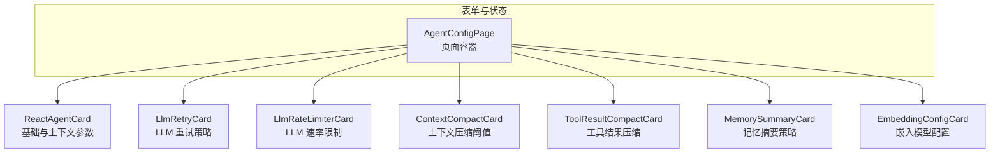
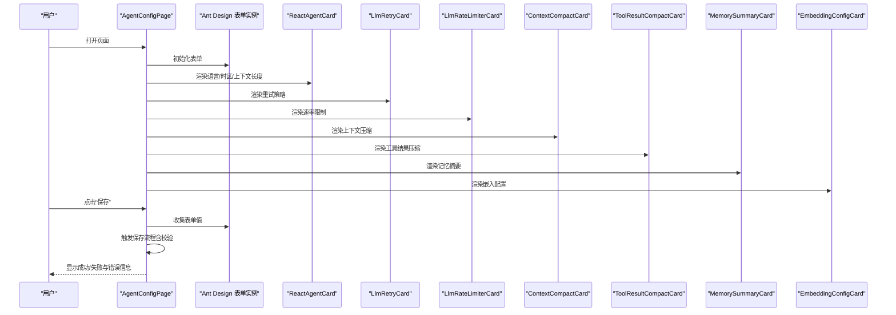
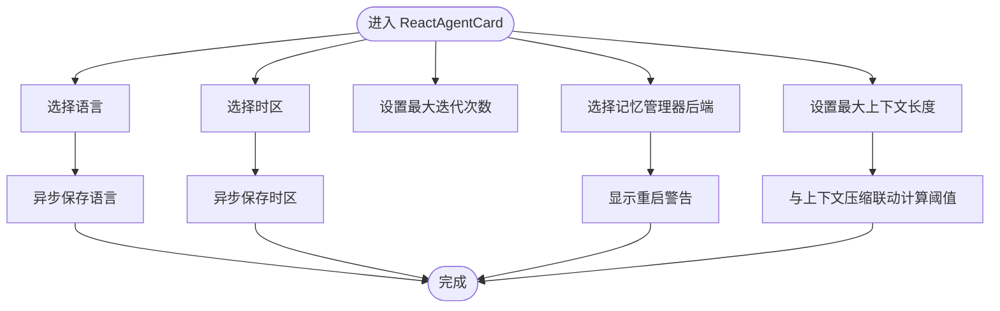
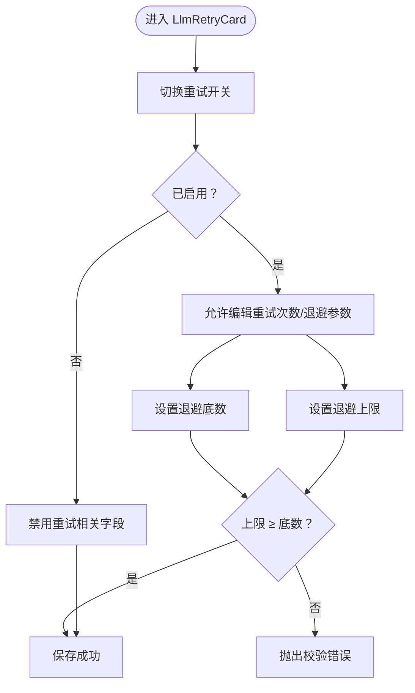
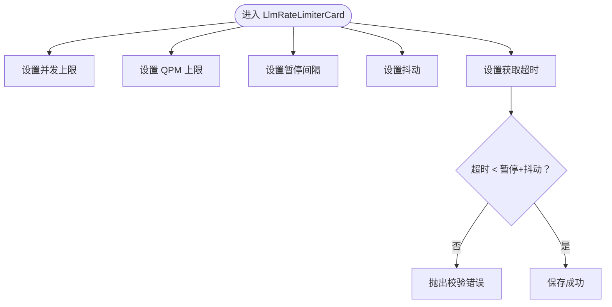
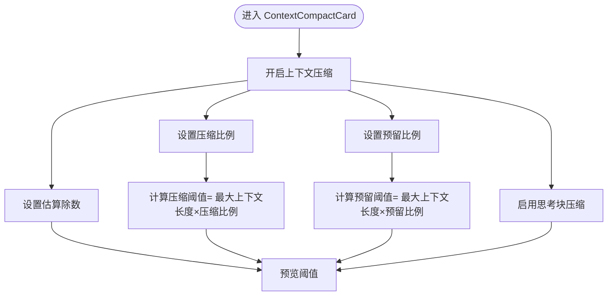
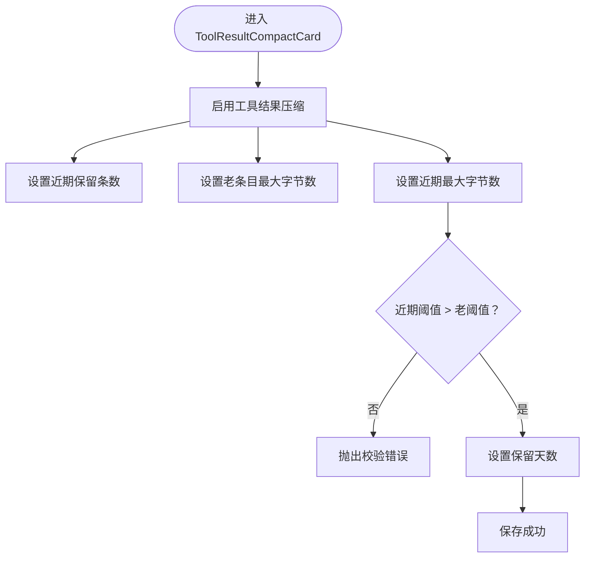
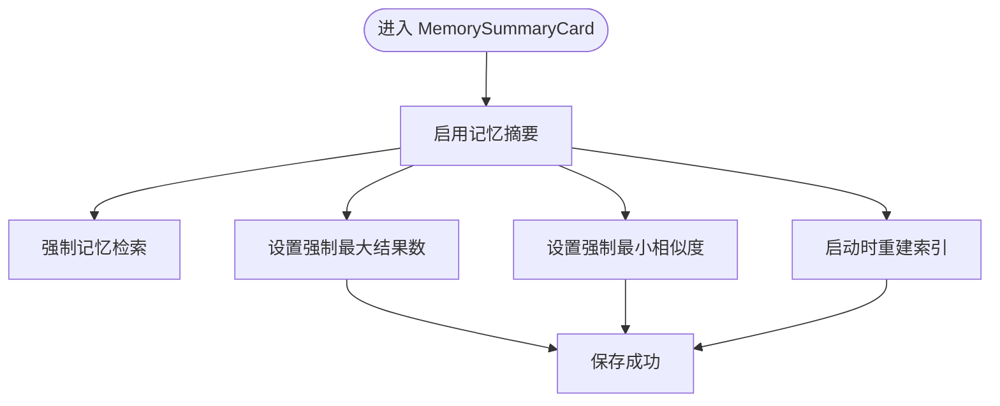
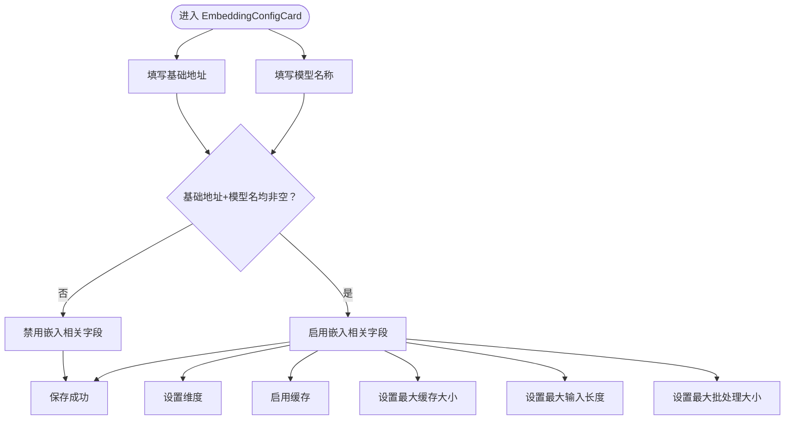
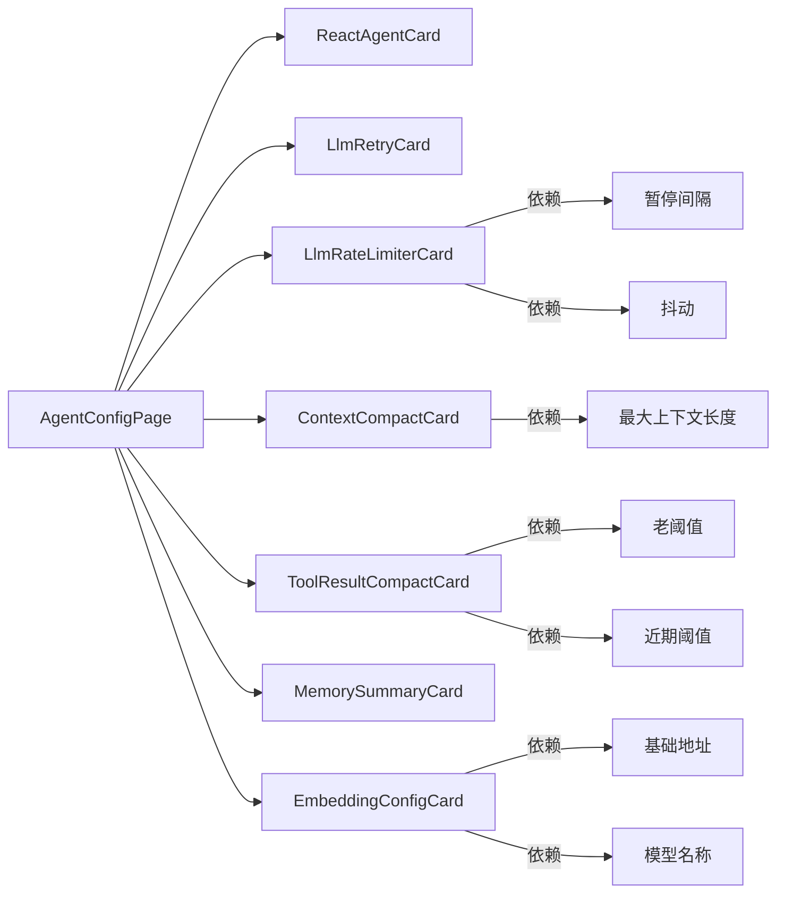

# 代理配置

<cite>
**本文引用的文件**
- [index.tsx](file://console/src/pages/Agent/Config/index.tsx)
- [ReactAgentCard.tsx](file://console/src/pages/Agent/Config/components/ReactAgentCard.tsx)
- [LlmRetryCard.tsx](file://console/src/pages/Agent/Config/components/LlmRetryCard.tsx)
- [LlmRateLimiterCard.tsx](file://console/src/pages/Agent/Config/components/LlmRateLimiterCard.tsx)
- [ContextCompactCard.tsx](file://console/src/pages/Agent/Config/components/ContextCompactCard.tsx)
- [ToolResultCompactCard.tsx](file://console/src/pages/Agent/Config/components/ToolResultCompactCard.tsx)
- [MemorySummaryCard.tsx](file://console/src/pages/Agent/Config/components/MemorySummaryCard.tsx)
- [EmbeddingConfigCard.tsx](file://console/src/pages/Agent/Config/components/EmbeddingConfigCard.tsx)
</cite>

## 目录
1. [简介](#简介)
2. [项目结构](#项目结构)
3. [核心组件](#核心组件)
4. [架构总览](#架构总览)
5. [详细组件分析](#详细组件分析)
6. [依赖关系分析](#依赖关系分析)
7. [性能考虑](#性能考虑)
8. [故障排查指南](#故障排查指南)
9. [结论](#结论)
10. [附录](#附录)

## 简介
本文件面向代理配置系统的前端页面与配置卡片，系统性梳理“代理配置”页面中各配置卡片的功能、参数、约束与影响，并给出验证规则、错误处理与保存机制的技术要点，以及针对不同业务场景的配置组合建议与性能调优思路。目标读者既包括一线工程师，也包括需要理解配置含义与影响的非技术用户。

## 项目结构
代理配置页面位于控制台前端，采用分页 + 卡片化布局，通过统一的表单实例管理所有配置项。页面由一个顶层容器负责加载状态、错误提示、语言与时区变更回调，以及保存与重置操作；各配置卡片以独立组件形式渲染，彼此通过表单字段名进行数据绑定。

图表来源
- [index.tsx:16-103](file://console/src/pages/Agent/Config/index.tsx#L16-L103)

章节来源
- [index.tsx:1-106](file://console/src/pages/Agent/Config/index.tsx#L1-L106)

## 核心组件
本节对各配置卡片进行逐项说明，覆盖作用、参数、默认值（如存在）、可选范围、校验规则与影响效果。

- 基础与上下文参数（ReactAgentCard）
  - 语言选择：支持多语言切换，变更后异步保存。
  - 时区选择：支持搜索，变更后异步保存。
  - 最大迭代次数：必填，数值型，最小为 1。
  - 记忆管理器后端：当前仅支持 ReMeLight，变更会触发重启提示。
  - 最大上下文长度：必填，数值型，最小为 1000，步进 1024。

- LLM 重试策略（LlmRetryCard）
  - 开关：启用/禁用 LLM 重试。
  - 最大重试次数：必填，数值型，最小为 1。
  - 指数退避底数：必填，数值型，最小为 0.1。
  - 退避上限：必填，数值型，最小为 0.5，且必须不小于“退避底数”。

- LLM 速率限制（LlmRateLimiterCard）
  - 并发上限：必填，数值型，最小为 1。
  - QPM 上限：必填，数值型，最小为 0。
  - 令牌获取暂停间隔：必填，数值型，最小为 1.0。
  - 抖动：必填，数值型，最小为 0.0。
  - 获取超时：必填，数值型，最小为 10.0，且必须小于“暂停间隔+抖动”。

- 上下文压缩（ContextCompactCard）
  - 开关：启用/禁用上下文压缩。
  - 估算除数：滑条，范围 2~5，步进 0.25。
  - 压缩比例：滑条，范围 0.3~0.9，步进 0.01。
  - 压缩阈值：根据“最大上下文长度 × 压缩比例”计算得出，只读显示。
  - 预留比例：滑条，范围 0.05~0.3，步进 0.01。
  - 预留阈值：根据“最大上下文长度 × 预留比例”计算得出，只读显示。
  - 启用思考块压缩：开关。

- 工具结果压缩（ToolResultCompactCard）
  - 开关：启用/禁用工具结果压缩。
  - 近期保留条数：滑条，范围 1~10。
  - 老条目最大字节数：必填，数值型，最小为 100，步进 100。
  - 近期条目最大字节数：必填，数值型，最小为 1000，步进 1000，且必须大于“老条目阈值”。
  - 保留天数：滑条，范围 1~10。

- 记忆摘要（MemorySummaryCard）
  - 开关：启用/禁用记忆摘要。
  - 强制记忆检索：开关。
  - 强制最大结果数：必填，数值型，最小为 1。
  - 强制最小相似度：滑条，范围 0~1，步进 0.05。
  - 启动时重建索引：开关。

- 嵌入配置（EmbeddingConfigCard）
  - 基础地址：输入框。
  - 模型名称：输入框。
  - API 密钥：密码输入框。
  - 维度：必填，数值型，最小为 1，步进 256，仅在“基础地址+模型名称”均非空时可用。
  - 启用缓存：开关，仅在“基础地址+模型名称”均非空时可用。
  - 最大缓存大小：必填，数值型，最小为 1，步进 100，仅在“基础地址+模型名称”均非空时可用。
  - 最大输入长度：必填，数值型，最小为 1，步进 1024，仅在“基础地址+模型名称”均非空时可用。
  - 最大批处理大小：必填，数值型，最小为 1，步进 1，仅在“基础地址+模型名称”均非空时可用。

章节来源
- [ReactAgentCard.tsx:16-135](file://console/src/pages/Agent/Config/components/ReactAgentCard.tsx#L16-L135)
- [LlmRetryCard.tsx:5-122](file://console/src/pages/Agent/Config/components/LlmRetryCard.tsx#L5-L122)
- [LlmRateLimiterCard.tsx:5-154](file://console/src/pages/Agent/Config/components/LlmRateLimiterCard.tsx#L5-L154)
- [ContextCompactCard.tsx:6-146](file://console/src/pages/Agent/Config/components/ContextCompactCard.tsx#L6-L146)
- [ToolResultCompactCard.tsx:6-124](file://console/src/pages/Agent/Config/components/ToolResultCompactCard.tsx#L6-L124)
- [MemorySummaryCard.tsx:6-76](file://console/src/pages/Agent/Config/components/MemorySummaryCard.tsx#L6-L76)
- [EmbeddingConfigCard.tsx:12-152](file://console/src/pages/Agent/Config/components/EmbeddingConfigCard.tsx#L12-L152)

## 架构总览
代理配置页面采用“页面容器 + 多个配置卡片”的组合模式，页面容器负责：
- 表单实例与状态管理（加载、保存、错误）。
- 语言与时区的异步变更与保存。
- 顶部标题与底部操作按钮（重置/保存）。

各卡片通过统一的表单实例进行字段读写，部分卡片内部还使用表单依赖校验（如 LLM 速率限制中的“获取超时”对“暂停间隔+抖动”的约束）。

图表来源
- [index.tsx:16-103](file://console/src/pages/Agent/Config/index.tsx#L16-L103)
- [ReactAgentCard.tsx:25-135](file://console/src/pages/Agent/Config/components/ReactAgentCard.tsx#L25-L135)
- [LlmRetryCard.tsx:9-122](file://console/src/pages/Agent/Config/components/LlmRetryCard.tsx#L9-L122)
- [LlmRateLimiterCard.tsx:9-154](file://console/src/pages/Agent/Config/components/LlmRateLimiterCard.tsx#L9-L154)
- [ContextCompactCard.tsx:10-146](file://console/src/pages/Agent/Config/components/ContextCompactCard.tsx#L10-L146)
- [ToolResultCompactCard.tsx:6-124](file://console/src/pages/Agent/Config/components/ToolResultCompactCard.tsx#L6-L124)
- [MemorySummaryCard.tsx:6-76](file://console/src/pages/Agent/Config/components/MemorySummaryCard.tsx#L6-L76)
- [EmbeddingConfigCard.tsx:12-152](file://console/src/pages/Agent/Config/components/EmbeddingConfigCard.tsx#L12-L152)

## 详细组件分析

### ReactAgentCard（基础与上下文参数）
- 作用：设置代理的语言与时区、最大迭代次数、记忆管理器后端、最大上下文长度。
- 关键点：
  - 语言与时区变更通过回调异步保存，保存期间控件禁用/加载态。
  - 记忆管理器后端变更会弹出重启警告，提示需重启生效。
  - 最大上下文长度与上下文压缩阈值联动计算，用于控制上下文截断策略。

图表来源
- [ReactAgentCard.tsx:25-135](file://console/src/pages/Agent/Config/components/ReactAgentCard.tsx#L25-L135)

章节来源
- [ReactAgentCard.tsx:16-135](file://console/src/pages/Agent/Config/components/ReactAgentCard.tsx#L16-L135)

### LlmRetryCard（LLM 重试策略）
- 作用：控制 LLM 请求失败时的重试行为与退避策略。
- 关键点：
  - 重试开关控制其他相关字段是否可用。
  - 退避底数与上限之间存在大小约束，上限必须不小于底数。
  - 参数变化会影响请求稳定性与延迟分布。

图表来源
- [LlmRetryCard.tsx:9-122](file://console/src/pages/Agent/Config/components/LlmRetryCard.tsx#L9-L122)

章节来源
- [LlmRetryCard.tsx:5-122](file://console/src/pages/Agent/Config/components/LlmRetryCard.tsx#L5-L122)

### LlmRateLimiterCard（LLM 速率限制）
- 作用：限制并发请求数、每分钟查询数（QPM），以及令牌获取的暂停间隔与抖动，保障服务稳定与公平。
- 关键点：
  - 获取超时必须小于“暂停间隔+抖动”，防止死锁或无限等待。
  - 并发与 QPM 的设置直接影响吞吐与资源占用。

图表来源
- [LlmRateLimiterCard.tsx:9-154](file://console/src/pages/Agent/Config/components/LlmRateLimiterCard.tsx#L9-L154)

章节来源
- [LlmRateLimiterCard.tsx:5-154](file://console/src/pages/Agent/Config/components/LlmRateLimiterCard.tsx#L5-L154)

### ContextCompactCard（上下文压缩）
- 作用：在上下文接近阈值时进行压缩，避免超出模型上下文窗口。
- 关键点：
  - 估算除数决定 token 估算精度与成本。
  - 压缩/预留比例共同决定何时压缩与保留多少历史。
  - 阈值由“最大上下文长度 × 比例”计算，只读展示，便于预判。

图表来源
- [ContextCompactCard.tsx:10-146](file://console/src/pages/Agent/Config/components/ContextCompactCard.tsx#L10-L146)

章节来源
- [ContextCompactCard.tsx:6-146](file://console/src/pages/Agent/Config/components/ContextCompactCard.tsx#L6-L146)

### ToolResultCompactCard（工具结果压缩）
- 作用：对工具执行结果进行压缩与清理，控制内存占用与传输体积。
- 关键点：
  - 近期/老条目的阈值存在大小关系，近期阈值必须大于老阈值。
  - 保留天数与近期条数共同影响存储生命周期与容量。

图表来源
- [ToolResultCompactCard.tsx:6-124](file://console/src/pages/Agent/Config/components/ToolResultCompactCard.tsx#L6-L124)

章节来源
- [ToolResultCompactCard.tsx:6-124](file://console/src/pages/Agent/Config/components/ToolResultCompactCard.tsx#L6-L124)

### MemorySummaryCard（记忆摘要）
- 作用：在检索前生成记忆摘要，提升检索效率与准确性。
- 关键点：
  - 强制最大结果数与最小相似度用于平衡召回与质量。
  - 启动时重建索引可确保初始检索质量，但会增加启动时间。

图表来源
- [MemorySummaryCard.tsx:6-76](file://console/src/pages/Agent/Config/components/MemorySummaryCard.tsx#L6-L76)

章节来源
- [MemorySummaryCard.tsx:6-76](file://console/src/pages/Agent/Config/components/MemorySummaryCard.tsx#L6-L76)

### EmbeddingConfigCard（嵌入配置）
- 作用：配置嵌入模型的访问参数（基础地址、模型名、密钥）与运行参数（维度、缓存、批大小、输入长度）。
- 关键点：
  - 基础地址与模型名为空时，大部分嵌入相关字段被禁用，避免误配置。
  - 维度、缓存大小、输入长度、批大小均为必填项，且有最小值与步进约束。

图表来源
- [EmbeddingConfigCard.tsx:12-152](file://console/src/pages/Agent/Config/components/EmbeddingConfigCard.tsx#L12-L152)

章节来源
- [EmbeddingConfigCard.tsx:12-152](file://console/src/pages/Agent/Config/components/EmbeddingConfigCard.tsx#L12-L152)

## 依赖关系分析
- 页面到卡片：页面容器通过统一表单实例向各卡片传递字段名与校验规则，卡片内部再进行局部依赖校验（如 LLM 速率限制的“获取超时”与“暂停间隔+抖动”的关系）。
- 字段间耦合：
  - 上下文压缩阈值由“最大上下文长度 × 比例”计算，形成页面级联动。
  - 工具结果压缩的近期阈值与老阈值存在大小约束。
  - 嵌入配置的可用性依赖“基础地址+模型名”是否填写完整。
- 控制流：页面容器负责加载、错误展示、保存与重置，卡片仅负责渲染与局部校验。

图表来源
- [index.tsx:16-103](file://console/src/pages/Agent/Config/index.tsx#L16-L103)
- [LlmRateLimiterCard.tsx:128-141](file://console/src/pages/Agent/Config/components/LlmRateLimiterCard.tsx#L128-L141)
- [ToolResultCompactCard.tsx:75-90](file://console/src/pages/Agent/Config/components/ToolResultCompactCard.tsx#L75-L90)
- [ContextCompactCard.tsx:24-29](file://console/src/pages/Agent/Config/components/ContextCompactCard.tsx#L24-L29)
- [EmbeddingConfigCard.tsx:15-17](file://console/src/pages/Agent/Config/components/EmbeddingConfigCard.tsx#L15-L17)

章节来源
- [index.tsx:1-106](file://console/src/pages/Agent/Config/index.tsx#L1-L106)
- [LlmRateLimiterCard.tsx:5-154](file://console/src/pages/Agent/Config/components/LlmRateLimiterCard.tsx#L5-L154)
- [ToolResultCompactCard.tsx:6-124](file://console/src/pages/Agent/Config/components/ToolResultCompactCard.tsx#L6-L124)
- [ContextCompactCard.tsx:6-146](file://console/src/pages/Agent/Config/components/ContextCompactCard.tsx#L6-L146)
- [EmbeddingConfigCard.tsx:12-152](file://console/src/pages/Agent/Config/components/EmbeddingConfigCard.tsx#L12-L152)

## 性能考虑
- 上下文压缩
  - 提高估算除数会降低 token 估算成本，但可能降低阈值预测精度；建议在长对话场景适度提高。
  - 压缩比例与预留比例应结合业务对话长度与模型上下文窗口进行权衡。
- 工具结果压缩
  - 合理设置近期/老阈值，避免频繁压缩导致重复检索；近期阈值建议高于老阈值至少 10 倍以上以减少冲突。
  - 保留天数与近期条数共同控制内存峰值，建议在高并发场景下调小近期条数。
- 记忆摘要
  - 强制最大结果数与最小相似度可显著影响检索性能；在低延迟要求场景可适当降低结果数并提高相似度门槛。
- 嵌入配置
  - 维度、批大小与输入长度直接影响吞吐与延迟；建议在 GPU/CPU 资源充足时适当提高批大小与维度。
  - 启用缓存可显著降低重复文本的嵌入开销，但需评估缓存命中率与内存占用。
- LLM 速率限制
  - 并发与 QPM 设置应与上游服务能力匹配；过高的并发可能导致服务端限流或抖动。
  - 获取超时应留有余量，避免因网络波动导致任务阻塞。

## 故障排查指南
- 加载失败
  - 页面会在加载阶段显示加载状态；若出现错误，提供“重试”按钮重新拉取配置。
- 保存失败
  - 若任一字段校验未通过，将显示对应错误消息；请根据提示调整参数范围或依赖关系。
- 语言与时区保存异常
  - 变更语言/时区后，控件进入禁用/加载态；若长时间无响应，请检查网络与后端接口。
- 嵌入配置不可用
  - 当“基础地址”或“模型名称”为空时，嵌入相关字段会被禁用；请先补全基础信息。
- LLM 速率限制校验失败
  - “获取超时”必须小于“暂停间隔+抖动”；请同时调整三项参数以满足约束。
- 工具结果压缩阈值冲突
  - “近期阈值”必须大于“老阈值”；请提高近期阈值或降低老阈值。

章节来源
- [index.tsx:36-57](file://console/src/pages/Agent/Config/index.tsx#L36-L57)
- [LlmRateLimiterCard.tsx:128-141](file://console/src/pages/Agent/Config/components/LlmRateLimiterCard.tsx#L128-L141)
- [ToolResultCompactCard.tsx:75-90](file://console/src/pages/Agent/Config/components/ToolResultCompactCard.tsx#L75-L90)
- [EmbeddingConfigCard.tsx:15-17](file://console/src/pages/Agent/Config/components/EmbeddingConfigCard.tsx#L15-L17)

## 结论
代理配置页面通过卡片化设计实现了对 LLM 重试、速率限制、上下文压缩、工具结果压缩、记忆摘要与嵌入配置的精细化控制。合理设置各项参数可显著提升系统稳定性、检索效率与资源利用率。建议在生产环境中结合业务场景与资源能力进行分阶段调优，并持续监控关键指标以维持最优配置。

## 附录
- 场景示例与配置组合建议
  - 高并发问答系统
    - LLM 速率限制：并发适中、QPM 较高；暂停间隔与抖动留足余量。
    - 上下文压缩：估算除数略降、压缩比例适中、预留比例略增。
    - 工具结果压缩：近期阈值显著高于老阈值，保留天数适中。
    - 记忆摘要：强制最大结果数较低、最小相似度较高。
    - 嵌入配置：启用缓存、批大小偏大、维度适中。
  - 长对话与知识检索
    - LLM 速率限制：并发较低、QPM 适中，避免过度抢占。
    - 上下文压缩：估算除数提高、压缩比例略降、预留比例提高。
    - 工具结果压缩：近期阈值与老阈值差距较小，保留天数较长。
    - 记忆摘要：强制最大结果数较高、最小相似度适中。
    - 嵌入配置：启用缓存、批大小适中、维度较高。
  - 低资源环境
    - LLM 速率限制：并发与 QPM 均下调，暂停间隔与抖动保守设置。
    - 上下文压缩：估算除数提高、压缩比例提高、预留比例降低。
    - 工具结果压缩：近期阈值与老阈值差距较大，保留天数较短。
    - 记忆摘要：强制最大结果数较低、最小相似度较低。
    - 嵌入配置：关闭缓存、批大小与维度下调。