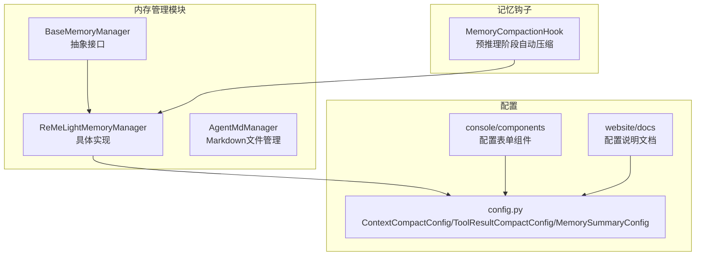
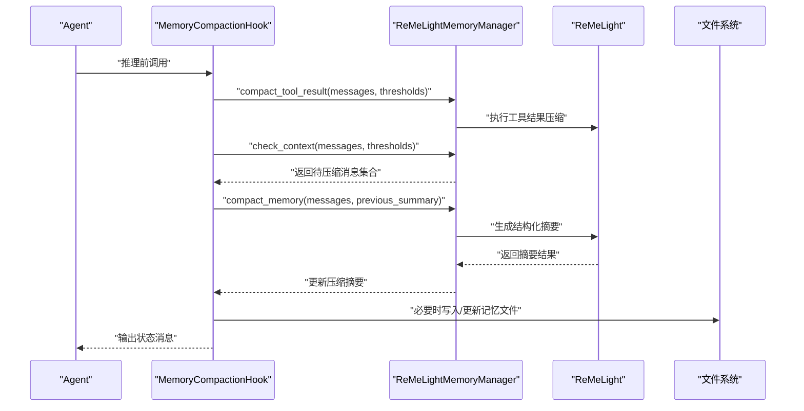
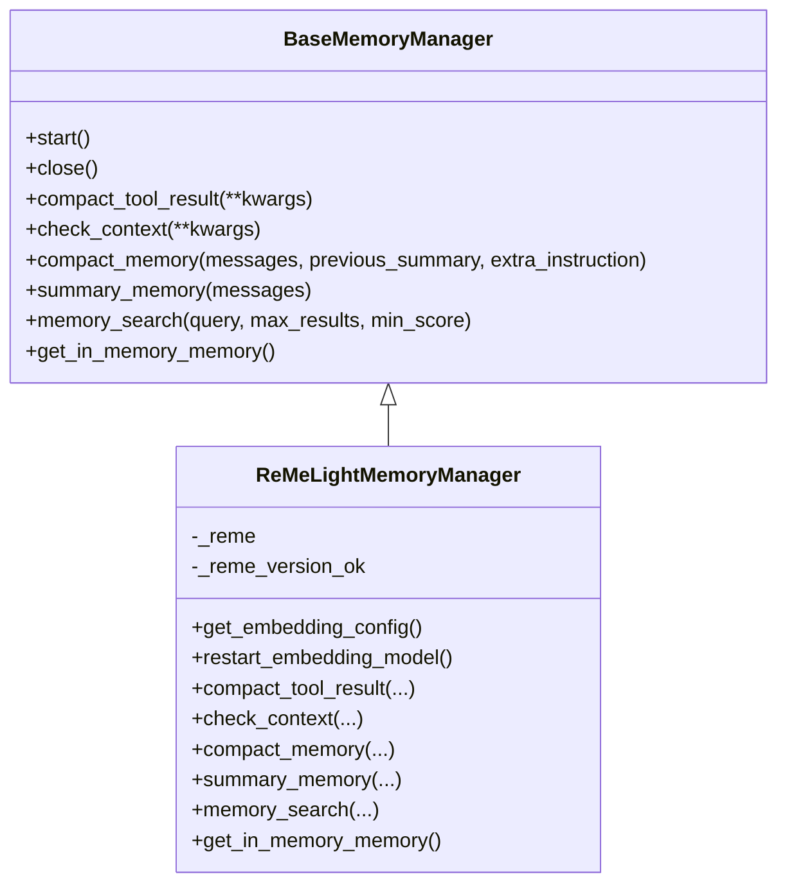
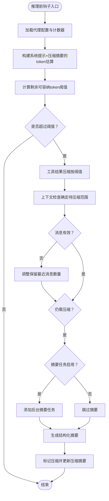
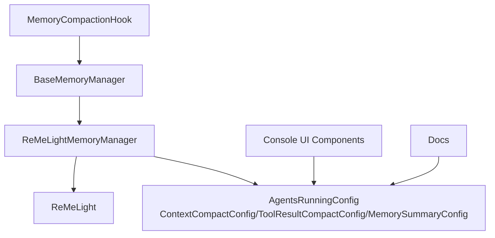

# 内存摘要配置

<cite>
**本文档引用的文件**
- [reme_light_memory_manager.py](file://src/copaw/agents/memory/reme_light_memory_manager.py)
- [base_memory_manager.py](file://src/copaw/agents/memory/base_memory_manager.py)
- [memory_compaction.py](file://src/copaw/agents/hooks/memory_compaction.py)
- [config.py](file://src/copaw/config/config.py)
- [context.en.md](file://website/public/docs/context.en.md)
- [memory.en.md](file://website/public/docs/memory.en.md)
- [config.en.md](file://website/public/docs/config.en.md)
- [ContextCompactCard.tsx](file://console/src/pages/Agent/Config/components/ContextCompactCard.tsx)
- [ToolResultCompactCard.tsx](file://console/src/pages/Agent/Config/components/ToolResultCompactCard.tsx)
- [MemorySummaryCard.tsx](file://console/src/pages/Agent/Config/components/MemorySummaryCard.tsx)
</cite>

## 目录
1. [简介](#简介)
2. [项目结构](#项目结构)
3. [核心组件](#核心组件)
4. [架构总览](#架构总览)
5. [详细组件分析](#详细组件分析)
6. [依赖关系分析](#依赖关系分析)
7. [性能考量](#性能考量)
8. [故障排查指南](#故障排查指南)
9. [结论](#结论)
10. [附录](#附录)

## 简介
本文件聚焦于 CoPaw 内存摘要配置组件，系统性阐述记忆内容提取、关键信息归纳与摘要生成算法的工作原理，并详细说明配置选项（如摘要长度、提取策略、更新频率等）。同时提供针对短期记忆、长期记忆、工作记忆等不同记忆类型的配置方案与优化建议，帮助读者在实际应用中高效、稳定地使用内存摘要功能。

## 项目结构
围绕内存摘要配置的核心代码位于 agents/memory 与 agents/hooks 子模块，配置定义集中在 config.py，前端配置界面位于 console 页面组件中，文档参考位于 website/public/docs。

**图表来源**
- [base_memory_manager.py:21-226](file://src/copaw/agents/memory/base_memory_manager.py#L21-L226)
- [reme_light_memory_manager.py:37-391](file://src/copaw/agents/memory/reme_light_memory_manager.py#L37-L391)
- [memory_compaction.py:27-214](file://src/copaw/agents/hooks/memory_compaction.py#L27-L214)
- [config.py:358-549](file://src/copaw/config/config.py#L358-L549)
- [context.en.md:105-143](file://website/public/docs/context.en.md#L105-L143)

**章节来源**
- [base_memory_manager.py:21-226](file://src/copaw/agents/memory/base_memory_manager.py#L21-L226)
- [reme_light_memory_manager.py:37-391](file://src/copaw/agents/memory/reme_light_memory_manager.py#L37-L391)
- [memory_compaction.py:27-214](file://src/copaw/agents/hooks/memory_compaction.py#L27-L214)
- [config.py:358-549](file://src/copaw/config/config.py#L358-L549)
- [context.en.md:105-143](file://website/public/docs/context.en.md#L105-L143)

## 核心组件
- 基类接口 BaseMemoryManager：定义统一的记忆管理接口，包括启动/关闭、工具结果压缩、上下文检查、消息压缩、综合摘要、搜索与内存对象获取等方法。
- ReMeLightMemoryManager：基于 ReMeLight 的具体实现，负责与 ReMe 组件交互，执行压缩与摘要生成，并提供嵌入模型重启、搜索、内存对象访问等功能。
- MemoryCompactionHook：在推理前自动检查上下文长度，必要时触发压缩流程，保留近期消息与系统提示，对历史消息进行结构化摘要。
- 配置模型：ContextCompactConfig、ToolResultCompactConfig、MemorySummaryConfig 提供上下文压缩阈值、工具结果压缩阈值、摘要开关与搜索策略等配置。

**章节来源**
- [base_memory_manager.py:21-226](file://src/copaw/agents/memory/base_memory_manager.py#L21-L226)
- [reme_light_memory_manager.py:37-391](file://src/copaw/agents/memory/reme_light_memory_manager.py#L37-L391)
- [memory_compaction.py:27-214](file://src/copaw/agents/hooks/memory_compaction.py#L27-L214)
- [config.py:358-549](file://src/copaw/config/config.py#L358-L549)

## 架构总览
内存摘要配置贯穿“上下文检查—工具结果压缩—消息压缩—综合摘要—搜索”的完整链路，前端通过表单组件实时计算阈值，后端根据配置动态调整压缩策略。

**图表来源**
- [memory_compaction.py:62-214](file://src/copaw/agents/hooks/memory_compaction.py#L62-L214)
- [reme_light_memory_manager.py:241-331](file://src/copaw/agents/memory/reme_light_memory_manager.py#L241-L331)
- [context.en.md:124-143](file://website/public/docs/context.en.md#L124-L143)

## 详细组件分析

### ReMeLightMemoryManager 组件
- 角色与职责
  - 封装 ReMeLight 生命周期与能力，提供压缩、摘要、搜索与内存对象访问。
  - 依据配置与环境变量选择存储后端（auto/local/chroma/sqlite），并支持向量与全文检索。
- 关键方法
  - compact_tool_result：按阈值压缩工具输出，降低上下文体积。
  - check_context：基于 token 计数判断是否需要压缩及保留比例。
  - compact_memory：调用 ReMe 的压缩器生成结构化摘要，支持思考块注入与额外指令。
  - summary_memory：在后台生成综合摘要，结合文件工具写入长期记忆。
  - memory_search：提供向量+BM25混合检索。
  - get_in_memory_memory：返回带 token 计数支持的内存对象。
- 配置注入
  - 通过 get_embedding_config 合并配置文件、环境变量与默认值，支持缓存、批大小、最大输入长度等参数。
  - restart_embedding_model：在嵌入配置变化时重启模型。

**图表来源**
- [base_memory_manager.py:21-226](file://src/copaw/agents/memory/base_memory_manager.py#L21-L226)
- [reme_light_memory_manager.py:37-391](file://src/copaw/agents/memory/reme_light_memory_manager.py#L37-L391)

**章节来源**
- [reme_light_memory_manager.py:37-391](file://src/copaw/agents/memory/reme_light_memory_manager.py#L37-L391)

### MemoryCompactionHook 组件
- 触发条件
  - 在每次推理前，结合系统提示与压缩摘要计算剩余可容纳 token 数，若超过阈值则触发压缩。
- 执行步骤
  - 工具结果压缩：按 recent_n、old_max_bytes、recent_max_bytes、retention_days 等阈值处理。
  - 上下文检查：确定需要压缩的消息范围与保留比例。
  - 条件压缩：根据配置决定是否生成结构化摘要。
  - 标记与更新：标记已压缩消息并更新压缩摘要。
- 状态反馈
  - 通过消息输出当前压缩状态，便于用户感知。

**图表来源**
- [memory_compaction.py:62-214](file://src/copaw/agents/hooks/memory_compaction.py#L62-L214)

**章节来源**
- [memory_compaction.py:27-214](file://src/copaw/agents/hooks/memory_compaction.py#L27-L214)

### 配置模型与参数详解
- 上下文压缩配置（ContextCompactConfig）
  - 字段：context_compact_enabled、memory_compact_ratio、memory_reserve_ratio、compact_with_thinking_block、token_count_model、token_count_use_mirror、token_count_estimate_divisor。
  - 关系式：memory_compact_threshold = max_input_length × memory_compact_ratio；memory_compact_reserve = max_input_length × memory_reserve_ratio。
- 工具结果压缩配置（ToolResultCompactConfig）
  - 字段：enabled、recent_n、old_max_bytes、recent_max_bytes、retention_days。
  - 约束：recent_max_bytes > old_max_bytes，recent_n ∈ [1,10]，retention_days ∈ [1,10]。
- 内存摘要配置（MemorySummaryConfig）
  - 字段：memory_summary_enabled、force_memory_search、force_max_results、force_min_score、force_memory_search_timeout、rebuild_memory_index_on_start。
- 嵌入配置（EmbeddingConfig）
  - 字段：backend、api_key、base_url、model_name、dimensions、enable_cache、use_dimensions、max_cache_size、max_input_length、max_batch_size。
- 存储后端与全文检索
  - MEMORY_STORE_BACKEND：auto/local/chroma/sqlite，默认 auto。
  - FTS_ENABLED：是否启用 BM25 全文检索，默认 true。

**章节来源**
- [config.py:358-549](file://src/copaw/config/config.py#L358-L549)
- [config.en.md:378-436](file://website/public/docs/config.en.md#L378-L436)
- [memory.en.md:139-158](file://website/public/docs/memory.en.md#L139-L158)

### 前端配置界面与阈值计算
- 上下文压缩卡片（ContextCompactCard）
  - 动态计算：context_compact_threshold = max_input_length × memory_compact_ratio；context_compactReserveThreshold = max_input_length × memory_reserve_ratio。
- 工具结果压缩卡片（ToolResultCompactCard）
  - 表单校验：recent_max_bytes 必须大于 old_max_bytes，且在合理范围内。
- 内存摘要卡片（MemorySummaryCard）
  - 控制强制搜索与重建索引等高级选项。

**章节来源**
- [ContextCompactCard.tsx:1-47](file://console/src/pages/Agent/Config/components/ContextCompactCard.tsx#L1-L47)
- [ToolResultCompactCard.tsx:41-123](file://console/src/pages/Agent/Config/components/ToolResultCompactCard.tsx#L41-L123)
- [MemorySummaryCard.tsx:39-75](file://console/src/pages/Agent/Config/components/MemorySummaryCard.tsx#L39-L75)

## 依赖关系分析
- ReMeLightMemoryManager 依赖 ReMeLight 组件完成压缩与摘要生成，同时依赖配置系统与 token 计数器。
- MemoryCompactionHook 依赖 BaseMemoryManager 接口，确保不同后端实现的一致行为。
- 配置模型在 config.py 中集中定义，前端组件通过表单绑定到对应字段，文档提供参数说明与示例。

**图表来源**
- [base_memory_manager.py:21-226](file://src/copaw/agents/memory/base_memory_manager.py#L21-L226)
- [reme_light_memory_manager.py:37-391](file://src/copaw/agents/memory/reme_light_memory_manager.py#L37-L391)
- [memory_compaction.py:27-214](file://src/copaw/agents/hooks/memory_compaction.py#L27-L214)
- [config.py:507-549](file://src/copaw/config/config.py#L507-L549)

**章节来源**
- [base_memory_manager.py:21-226](file://src/copaw/agents/memory/base_memory_manager.py#L21-L226)
- [reme_light_memory_manager.py:37-391](file://src/copaw/agents/memory/reme_light_memory_manager.py#L37-L391)
- [memory_compaction.py:27-214](file://src/copaw/agents/hooks/memory_compaction.py#L27-L214)
- [config.py:507-549](file://src/copaw/config/config.py#L507-L549)

## 性能考量
- token 计数策略
  - 支持精确模型与字节估算两种模式，可通过 token_count_model、token_count_use_mirror、token_count_estimate_divisor 调整。
  - 建议在高并发或长上下文场景下启用精确计数，避免误判导致频繁压缩。
- 压缩阈值与保留比例
  - memory_compact_ratio 过低会频繁触发压缩，过高可能导致溢出；memory_reserve_ratio 过低会丢失上下文连续性。
  - 建议结合模型上下文窗口与任务复杂度调整，典型范围：ratio ∈ [0.3, 0.9]，reserve ∈ [0.05, 0.3]。
- 工具结果压缩
  - recent_n 控制最近消息的严格阈值；recent_max_bytes 与 old_max_bytes 的差值越大，压缩效果越明显但可能丢失细节。
  - retention_days 影响磁盘占用与清理开销，建议根据数据生命周期设定。
- 搜索与索引
  - 向量与 BM25 混合检索提升召回质量，但会增加索引维护成本；在资源受限环境下可考虑仅启用 BM25 或降低候选倍数。
  - MEMORY_STORE_BACKEND 在 Windows 推荐 local，其他平台优先 chroma；sqlite 在部分系统上存在兼容性问题。

[本节为通用指导，无需特定文件引用]

## 故障排查指南
- 版本不匹配
  - 当 reme-ai 版本与期望版本不一致时，组件会发出警告；请安装指定版本以确保 compact_memory 返回正确格式。
- 压缩失败
  - 若 compact_memory 返回空字符串或非字典格式，系统会记录错误并保存无效结果到工作区；请检查日志并上报问题。
- 上下文溢出
  - 若系统提示阈值过低，请增大 max_input_length 或降低系统提示与压缩摘要长度，或使用 /clear 清理上下文。
- 存储后端异常
  - chroma 导入失败或 SQLite 版本过低时，系统回退至 local 后端；请升级系统依赖或手动设置 MEMORY_STORE_BACKEND。

**章节来源**
- [reme_light_memory_manager.py:144-170](file://src/copaw/agents/memory/reme_light_memory_manager.py#L144-L170)
- [reme_light_memory_manager.py:300-331](file://src/copaw/agents/memory/reme_light_memory_manager.py#L300-L331)
- [memory_compaction.py:104-113](file://src/copaw/agents/hooks/memory_compaction.py#L104-L113)

## 结论
内存摘要配置通过“上下文检查—工具结果压缩—消息压缩—综合摘要—搜索”闭环，实现了在有限上下文窗口内维持长期记忆与近期交互的平衡。合理的配置参数（如压缩阈值、保留比例、工具结果阈值、摘要开关与搜索策略）能够显著提升稳定性与性能。针对不同记忆类型（短期、长期、工作记忆），应分别优化阈值与保留策略，确保关键信息不被过度压缩，同时避免上下文溢出。

[本节为总结性内容，无需特定文件引用]

## 附录

### 不同记忆类型的摘要配置方案与优化建议
- 短期记忆（工作记忆）
  - 目标：保留近期交互与临时上下文，快速迭代。
  - 建议：提高 memory_compact_ratio（如 0.7–0.8），降低 memory_reserve_ratio（如 0.05–0.1），减少压缩频率；开启 compact_with_thinking_block 提升结构化程度。
- 长期记忆（持久知识）
  - 目标：稳定存储决策、偏好与事实，支持跨对话检索。
  - 建议：降低压缩强度（提高 reserve），启用 memory_summary_enabled 并定期 rebuild_memory_index_on_start；开启 FTS_ENABLED 提升关键词检索效率。
- 工作记忆（任务驱动）
  - 目标：在复杂任务中平衡上下文与摘要，避免重复信息。
  - 建议：适度提高 recent_max_bytes 与 old_max_bytes 差值，延长 retention_days；结合 force_memory_search 注入检索结果，增强上下文相关性。

**章节来源**
- [config.py:358-549](file://src/copaw/config/config.py#L358-L549)
- [memory.en.md:125-158](file://website/public/docs/memory.en.md#L125-L158)
- [context.en.md:264-319](file://website/public/docs/context.en.md#L264-L319)