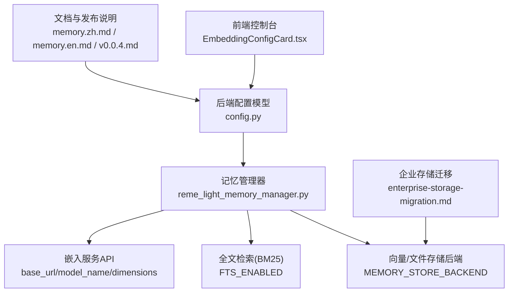
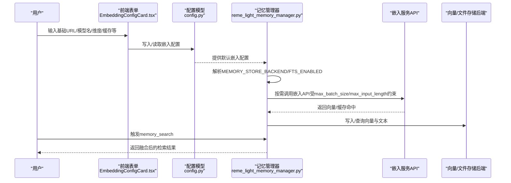
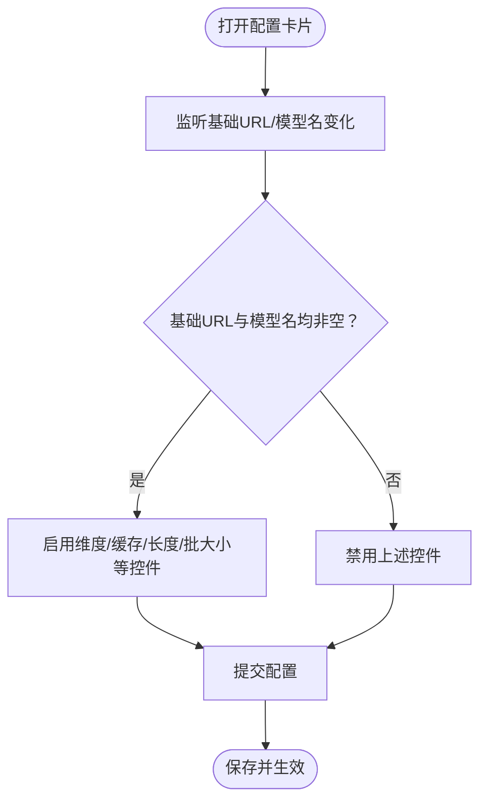
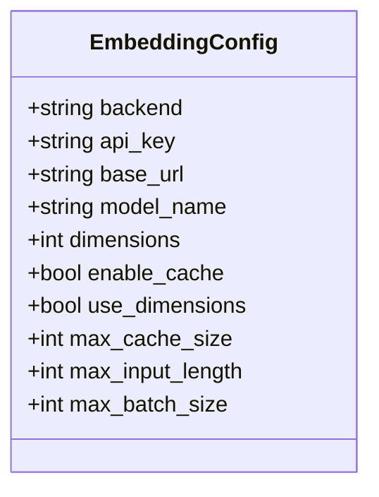
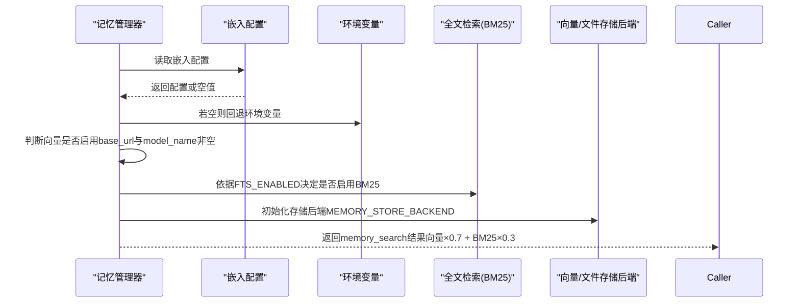
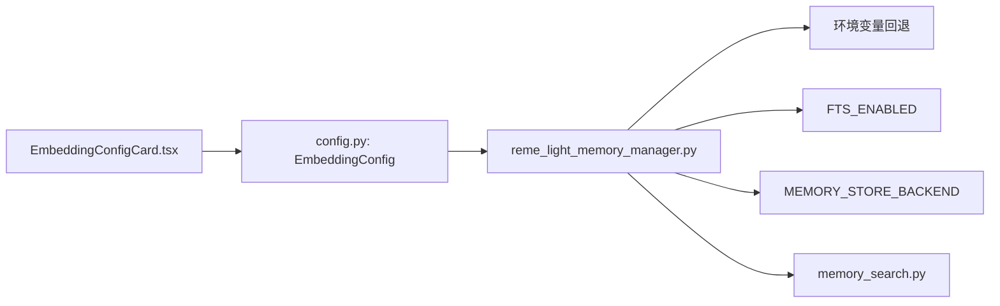

# 嵌入向量配置

<cite>
**本文引用的文件**
- [EmbeddingConfigCard.tsx](file://console/src/pages/Agent/Config/components/EmbeddingConfigCard.tsx)
- [config.py](file://src/copaw/config/config.py)
- [reme_light_memory_manager.py](file://src/copaw/agents/memory/reme_light_memory_manager.py)
- [memory_search.py](file://src/copaw/agents/tools/memory_search.py)
- [memory.zh.md](file://website/public/docs/memory.zh.md)
- [memory.en.md](file://website/public/docs/memory.en.md)
- [v0.0.4.md](file://website/public/release-notes/v0.0.4.md)
- [enterprise-storage-migration.md](file://docs/enterprise-storage-migration.md)
- [en.json](file://console/src/locales/en.json)
</cite>

## 目录
1. [简介](#简介)
2. [项目结构](#项目结构)
3. [核心组件](#核心组件)
4. [架构总览](#架构总览)
5. [详细组件分析](#详细组件分析)
6. [依赖关系分析](#依赖关系分析)
7. [性能考量](#性能考量)
8. [故障排查指南](#故障排查指南)
9. [结论](#结论)
10. [附录](#附录)

## 简介
本文件聚焦于代理系统的嵌入向量配置，系统通过“向量语义搜索 + BM25 全文检索”的混合检索机制，实现对历史记忆的高效召回。嵌入向量配置决定了向量模型的来源、维度、缓存策略、批处理规模以及输入长度限制，直接影响检索质量、延迟与资源占用。本文将从配置项、前后端实现、运行时行为、性能与存储优化等方面进行全面说明。

## 项目结构
围绕嵌入向量配置的关键位置如下：
- 前端控制台表单：提供嵌入模型基础地址、模型名、API 密钥、维度、缓存开关、最大缓存条目、最大输入长度、最大批大小等配置入口
- 后端配置模型：定义嵌入配置的数据结构与默认值
- 记忆管理器：加载配置、启动向量后端、执行混合检索
- 文档与发布说明：提供配置优先级、默认值、混合检索原理与权重说明
- 存储迁移文档：展示向量嵌入在企业版存储中的落地与优化

图表来源
- [EmbeddingConfigCard.tsx:12-151](file://console/src/pages/Agent/Config/components/EmbeddingConfigCard.tsx#L12-L151)
- [config.py:323-355](file://src/copaw/config/config.py#L323-L355)
- [reme_light_memory_manager.py:95-127](file://src/copaw/agents/memory/reme_light_memory_manager.py#L95-L127)
- [memory.zh.md:75-135](file://website/public/docs/memory.zh.md#L75-L135)
- [memory.en.md:84-123](file://website/public/docs/memory.en.md#L84-L123)
- [enterprise-storage-migration.md:1880-2014](file://docs/enterprise-storage-migration.md#L1880-L2014)

章节来源
- [EmbeddingConfigCard.tsx:12-151](file://console/src/pages/Agent/Config/components/EmbeddingConfigCard.tsx#L12-L151)
- [config.py:323-355](file://src/copaw/config/config.py#L323-L355)
- [reme_light_memory_manager.py:95-127](file://src/copaw/agents/memory/reme_light_memory_manager.py#L95-L127)
- [memory.zh.md:75-135](file://website/public/docs/memory.zh.md#L75-L135)
- [memory.en.md:84-123](file://website/public/docs/memory.en.md#L84-L123)
- [enterprise-storage-migration.md:1880-2014](file://docs/enterprise-storage-migration.md#L1880-L2014)

## 核心组件
- 嵌入配置模型（后端）：定义嵌入后端类型、API 密钥、基础 URL、模型名、维度、缓存开关、是否使用自定义维度、最大缓存条目、最大输入长度、最大批大小等字段及默认值
- 前端嵌入配置卡片：提供表单控件与校验规则，动态禁用/启用与“向量已启用”联动
- 记忆管理器：加载配置、选择存储后端、决定是否启用向量检索、调用混合检索工具
- 混合检索工具：封装 memory_search 调用，统一返回工具响应

章节来源
- [config.py:323-355](file://src/copaw/config/config.py#L323-L355)
- [EmbeddingConfigCard.tsx:12-151](file://console/src/pages/Agent/Config/components/EmbeddingConfigCard.tsx#L12-L151)
- [reme_light_memory_manager.py:95-127](file://src/copaw/agents/memory/reme_light_memory_manager.py#L95-L127)
- [memory_search.py:37-69](file://src/copaw/agents/tools/memory_search.py#L37-L69)

## 架构总览
嵌入向量配置在系统中的交互链路如下：

图表来源
- [EmbeddingConfigCard.tsx:12-151](file://console/src/pages/Agent/Config/components/EmbeddingConfigCard.tsx#L12-L151)
- [config.py:323-355](file://src/copaw/config/config.py#L323-L355)
- [reme_light_memory_manager.py:95-127](file://src/copaw/agents/memory/reme_light_memory_manager.py#L95-L127)
- [memory_search.py:37-69](file://src/copaw/agents/tools/memory_search.py#L37-L69)

## 详细组件分析

### 前端嵌入配置卡片（表单）
- 关键字段与行为
  - 基础URL、模型名：二者均非空时，向量检索视为“已启用”
  - 维度、最大缓存条目、最大输入长度、最大批大小：具备必填与数值范围校验
  - 缓存开关：影响嵌入结果缓存策略
  - API 密钥：密码输入框，不参与“向量已启用”判断
- 动态禁用逻辑：当基础URL或模型名为空时，其余嵌入相关控件禁用
- 国际化文案：字段提示、占位符、错误信息来自本地化资源

图表来源
- [EmbeddingConfigCard.tsx:15-17](file://console/src/pages/Agent/Config/components/EmbeddingConfigCard.tsx#L15-L17)
- [EmbeddingConfigCard.tsx:76-82](file://console/src/pages/Agent/Config/components/EmbeddingConfigCard.tsx#L76-L82)
- [EmbeddingConfigCard.tsx:104-110](file://console/src/pages/Agent/Config/components/EmbeddingConfigCard.tsx#L104-L110)
- [EmbeddingConfigCard.tsx:123-129](file://console/src/pages/Agent/Config/components/EmbeddingConfigCard.tsx#L123-L129)
- [EmbeddingConfigCard.tsx:142-148](file://console/src/pages/Agent/Config/components/EmbeddingConfigCard.tsx#L142-L148)
- [en.json:1048-1065](file://console/src/locales/en.json#L1048-L1065)

章节来源
- [EmbeddingConfigCard.tsx:12-151](file://console/src/pages/Agent/Config/components/EmbeddingConfigCard.tsx#L12-L151)
- [en.json:1048-1065](file://console/src/locales/en.json#L1048-L1065)

### 后端嵌入配置模型（Pydantic）
- 字段说明与默认值
  - backend：嵌入后端类型，默认 openai
  - api_key/base_url/model_name：服务密钥、基础URL、模型名
  - dimensions：向量维度，默认 1024
  - enable_cache/use_dimensions：是否启用缓存、是否在请求中传递维度参数
  - max_cache_size/max_input_length/max_batch_size：缓存上限、单次输入最大长度、批大小上限
- 优先级与回退
  - 记忆管理器从 agent 配置读取嵌入配置，若为空则回退到环境变量（EMBEDDING_*）

图表来源
- [config.py:323-355](file://src/copaw/config/config.py#L323-L355)

章节来源
- [config.py:323-355](file://src/copaw/config/config.py#L323-L355)

### 记忆管理器与混合检索
- 配置加载与优先级
  - 从 agent 配置读取嵌入配置，若为空则回退环境变量
  - 判断向量是否启用：基础URL与模型名均非空
- 存储后端选择
  - MEMORY_STORE_BACKEND 支持 auto/local/chroma/sqlite
  - auto 模式在 Windows 使用 local，在其他系统尝试 chroma
- 混合检索
  - 默认向量权重 0.7，BM25 权重 0.3
  - 候选池扩大倍数、去重与加权融合、排序截断
- 工具调用
  - memory_search 工具封装记忆管理器的检索调用，统一返回工具响应

图表来源
- [reme_light_memory_manager.py:95-127](file://src/copaw/agents/memory/reme_light_memory_manager.py#L95-L127)
- [memory_search.py:37-69](file://src/copaw/agents/tools/memory_search.py#L37-L69)
- [memory.zh.md:168-236](file://website/public/docs/memory.zh.md#L168-L236)
- [memory.en.md:175-234](file://website/public/docs/memory.en.md#L175-L234)

章节来源
- [reme_light_memory_manager.py:95-127](file://src/copaw/agents/memory/reme_light_memory_manager.py#L95-L127)
- [memory_search.py:37-69](file://src/copaw/agents/tools/memory_search.py#L37-L69)
- [memory.zh.md:168-236](file://website/public/docs/memory.zh.md#L168-L236)
- [memory.en.md:175-234](file://website/public/docs/memory.en.md#L175-L234)

### 文档与发布说明要点
- 配置优先级：配置文件 > 环境变量 > 默认值
- 环境变量回退：EMBEDDING_API_KEY、EMBEDDING_BASE_URL、EMBEDDING_MODEL_NAME
- 向量启用条件：基础URL与模型名均非空
- 混合检索权重：向量 0.7，BM25 0.3
- 发布说明新增：max_cache_size、max_input_length、max_batch_size 参数

章节来源
- [memory.zh.md:75-135](file://website/public/docs/memory.zh.md#L75-L135)
- [memory.en.md:84-123](file://website/public/docs/memory.en.md#L84-L123)
- [v0.0.4.md:12-17](file://website/public/release-notes/v0.0.4.md#L12-L17)

### 企业存储与向量迁移
- 向量存储后端：PostgreSQL + pgvector，提供与 ReMe 接口兼容的向量搜索能力
- 迁移流程：SQLite(.reme/) → PostgreSQL（向量反序列化、维度检测、索引构建、增量同步）
- 存储安全：向量嵌入不加密，通过访问控制保护

章节来源
- [enterprise-storage-migration.md:1880-2014](file://docs/enterprise-storage-migration.md#L1880-L2014)
- [enterprise-storage-migration.md:2044-2124](file://docs/enterprise-storage-migration.md#L2044-L2124)

## 依赖关系分析
- 前端表单依赖后端配置模型的字段定义与默认值
- 记忆管理器依赖嵌入配置与环境变量回退策略
- 混合检索依赖存储后端（MEMORY_STORE_BACKEND）与全文检索开关（FTS_ENABLED）
- 工具层统一封装检索调用，屏蔽底层差异

图表来源
- [EmbeddingConfigCard.tsx:12-151](file://console/src/pages/Agent/Config/components/EmbeddingConfigCard.tsx#L12-L151)
- [config.py:323-355](file://src/copaw/config/config.py#L323-L355)
- [reme_light_memory_manager.py:95-127](file://src/copaw/agents/memory/reme_light_memory_manager.py#L95-L127)
- [memory_search.py:37-69](file://src/copaw/agents/tools/memory_search.py#L37-L69)

章节来源
- [EmbeddingConfigCard.tsx:12-151](file://console/src/pages/Agent/Config/components/EmbeddingConfigCard.tsx#L12-L151)
- [config.py:323-355](file://src/copaw/config/config.py#L323-L355)
- [reme_light_memory_manager.py:95-127](file://src/copaw/agents/memory/reme_light_memory_manager.py#L95-L127)
- [memory_search.py:37-69](file://src/copaw/agents/tools/memory_search.py#L37-L69)

## 性能考量
- 向量维度（dimensions）
  - 影响向量空间表达能力与存储/计算成本；默认 1024，可根据模型与硬件调整
- 批处理大小（max_batch_size）
  - 增大批大小可提升吞吐，但需考虑服务端并发限制与内存占用
- 输入长度（max_input_length）
  - 控制单次嵌入请求的输入长度，避免超长文本导致的失败或延迟
- 缓存策略（enable_cache、max_cache_size）
  - 开启缓存可显著降低重复计算；合理设置缓存上限避免内存压力
- 存储后端选择
  - auto 模式在不同平台有稳定性差异；生产环境建议明确指定后端并进行基准测试
- 混合检索权重
  - 默认向量权重 0.7，BM25 权重 0.3；可根据业务场景微调

章节来源
- [config.py:338-355](file://src/copaw/config/config.py#L338-L355)
- [memory_search.py:37-69](file://src/copaw/agents/tools/memory_search.py#L37-L69)
- [memory.zh.md:168-236](file://website/public/docs/memory.zh.md#L168-L236)
- [memory.en.md:175-234](file://website/public/docs/memory.en.md#L175-L234)

## 故障排查指南
- 向量未启用
  - 现象：混合检索未使用向量
  - 排查：确认基础URL与模型名均已填写；查看日志中“向量已启用”状态
- 混合检索结果偏向 BM25
  - 现象：精确关键词命中较多，语义召回较少
  - 排查：适当降低 BM25 权重或提高向量权重；检查 query 与文本是否具备语义一致性
- 检索超时
  - 现象：远程嵌入 API 延迟高导致超时
  - 排查：增大 force_memory_search_timeout；优化批大小与输入长度
- 存储后端异常
  - 现象：chroma 或 sqlite 报错
  - 排查：切换 MEMORY_STORE_BACKEND 至 auto 或 local；升级系统依赖（如 SQLite 版本）
- 缓存命中率低
  - 现象：重复查询仍触发嵌入请求
  - 排查：检查 enable_cache 与 max_cache_size 设置；确认输入分词与预处理一致

章节来源
- [reme_light_memory_manager.py:95-127](file://src/copaw/agents/memory/reme_light_memory_manager.py#L95-L127)
- [config.py:488-495](file://src/copaw/config/config.py#L488-L495)
- [memory_search.py:37-69](file://src/copaw/agents/tools/memory_search.py#L37-L69)
- [memory.zh.md:168-236](file://website/public/docs/memory.zh.md#L168-L236)

## 结论
嵌入向量配置是代理系统实现语义检索与上下文增强的关键。通过合理的维度、批大小、输入长度与缓存策略，结合稳定的存储后端与混合检索权重，可在准确性与性能之间取得平衡。建议在生产环境中明确指定存储后端、进行基准测试，并根据业务反馈持续优化阈值与权重。

## 附录
- 配置项速查
  - backend、api_key、base_url、model_name、dimensions、enable_cache、use_dimensions、max_cache_size、max_input_length、max_batch_size
- 环境变量回退
  - EMBEDDING_API_KEY、EMBEDDING_BASE_URL、EMBEDDING_MODEL_NAME、FTS_ENABLED、MEMORY_STORE_BACKEND
- 混合检索权重
  - 向量 0.7，BM25 0.3；默认候选池扩大倍数与去重策略见文档

章节来源
- [config.py:323-355](file://src/copaw/config/config.py#L323-L355)
- [memory.zh.md:75-135](file://website/public/docs/memory.zh.md#L75-L135)
- [memory.en.md:84-123](file://website/public/docs/memory.en.md#L84-L123)