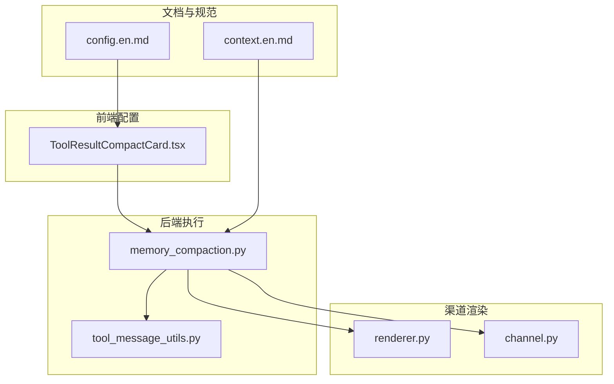
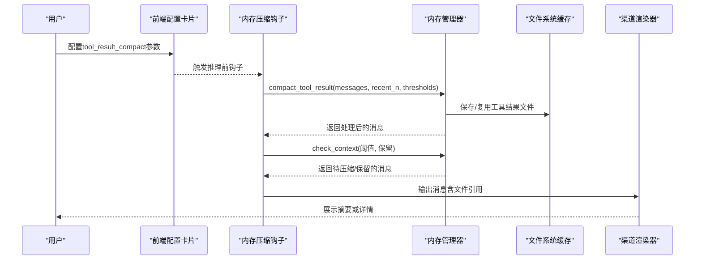
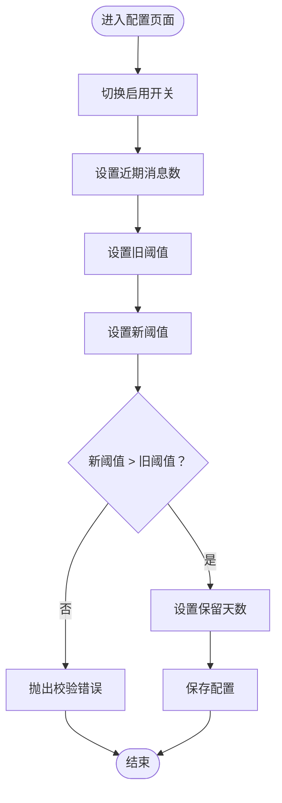
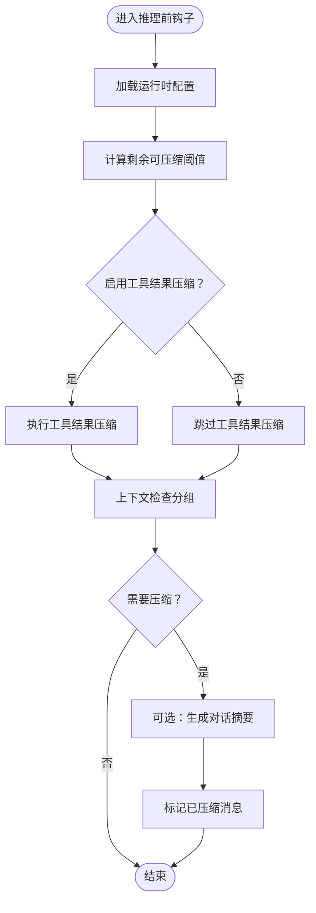
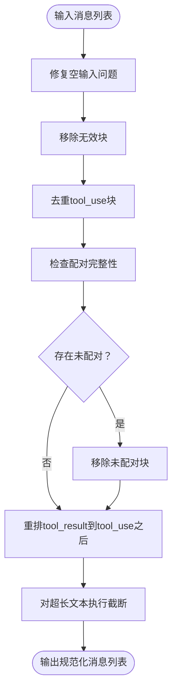
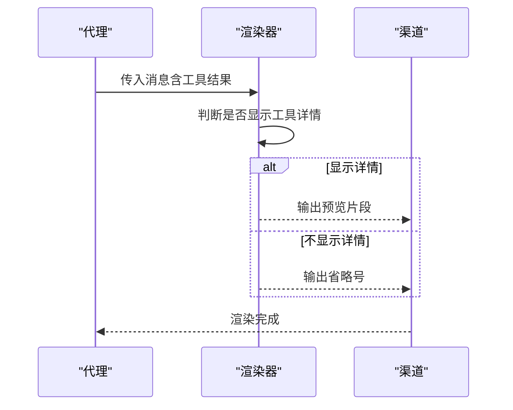
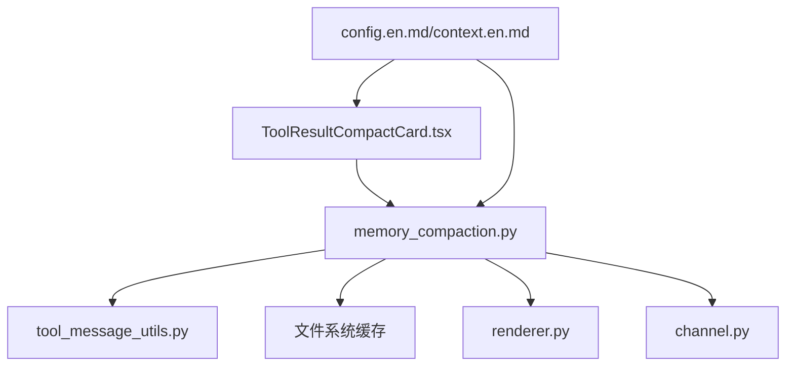

# 工具结果压缩配置

<cite>
**本文档引用的文件**
- [ToolResultCompactCard.tsx](file://console/src/pages/Agent/Config/components/ToolResultCompactCard.tsx)
- [memory_compaction.py](file://src/copaw/agents/hooks/memory_compaction.py)
- [tool_message_utils.py](file://src/copaw/agents/utils/tool_message_utils.py)
- [context.en.md](file://website/public/docs/context.en.md)
- [config.en.md](file://website/public/docs/config.en.md)
- [renderer.py](file://src/copaw/app/channels/renderer.py)
- [channel.py](file://src/copaw/app/channels/xiaoyi/channel.py)
</cite>

## 目录
1. [简介](#简介)
2. [项目结构](#项目结构)
3. [核心组件](#核心组件)
4. [架构概览](#架构概览)
5. [详细组件分析](#详细组件分析)
6. [依赖关系分析](#依赖关系分析)
7. [性能考量](#性能考量)
8. [故障排除指南](#故障排除指南)
9. [结论](#结论)
10. [附录](#附录)

## 简介
本文件系统性阐述工具结果压缩配置组件的设计与实现，涵盖以下关键方面：
- 设计目的：在代理长期运行中控制上下文窗口大小，避免超出模型最大输入长度，同时尽量保留关键信息以维持推理准确性。
- 实现方式：通过“近期阈值”和“历史阈值”的双阈值策略，结合文件系统缓存与消息片段化，实现对长工具输出的智能截断与归档。
- 功能特性：结果过滤（移除无效/重复工具块）、格式优化（保持工具调用与结果配对）、冗余信息去除（仅保留最近N条消息的高保真内容）。
- 影响评估：压缩策略直接影响代理的上下文占用与响应延迟；合理配置可显著提升稳定性，但过度压缩可能降低准确性。

## 项目结构
工具结果压缩配置涉及前端表单、后端钩子、工具消息处理与文档说明等多个层面，形成完整的配置-执行-反馈闭环。

**图表来源**
- [ToolResultCompactCard.tsx:1-124](file://console/src/pages/Agent/Config/components/ToolResultCompactCard.tsx#L1-L124)
- [memory_compaction.py:117-126](file://src/copaw/agents/hooks/memory_compaction.py#L117-L126)
- [tool_message_utils.py:322-356](file://src/copaw/agents/utils/tool_message_utils.py#L322-L356)
- [context.en.md:149-171](file://website/public/docs/context.en.md#L149-L171)
- [config.en.md:390-398](file://website/public/docs/config.en.md#L390-L398)
- [renderer.py:206-239](file://src/copaw/app/channels/renderer.py#L206-L239)
- [channel.py:1096-1161](file://src/copaw/app/channels/xiaoyi/channel.py#L1096-L1161)

**章节来源**
- [ToolResultCompactCard.tsx:1-124](file://console/src/pages/Agent/Config/components/ToolResultCompactCard.tsx#L1-L124)
- [memory_compaction.py:117-126](file://src/copaw/agents/hooks/memory_compaction.py#L117-L126)
- [context.en.md:149-171](file://website/public/docs/context.en.md#L149-L171)

## 核心组件
- 前端配置卡片：提供工具结果压缩的开关、近期消息数量、旧阈值、新阈值与保留天数等参数的可视化配置入口，并包含参数间约束校验。
- 内存压缩钩子：在推理前检查上下文，按配置触发工具结果压缩与对话压缩，确保系统提示与最近消息不被压缩。
- 工具消息工具集：负责工具调用与结果的消息配对、去重、修复与截断，保证消息序列的完整性与一致性。
- 渲染器与渠道：根据配置决定是否展示工具详情或摘要，避免在UI层放大上下文压力。

**章节来源**
- [ToolResultCompactCard.tsx:16-120](file://console/src/pages/Agent/Config/components/ToolResultCompactCard.tsx#L16-L120)
- [memory_compaction.py:117-126](file://src/copaw/agents/hooks/memory_compaction.py#L117-L126)
- [tool_message_utils.py:322-356](file://src/copaw/agents/utils/tool_message_utils.py#L322-L356)
- [renderer.py:206-239](file://src/copaw/app/channels/renderer.py#L206-L239)
- [channel.py:1096-1161](file://src/copaw/app/channels/xiaoyi/channel.py#L1096-L1161)

## 架构概览
工具结果压缩贯穿“配置—执行—存储—渲染”的完整链路，确保在不牺牲关键信息的前提下控制上下文规模。

**图表来源**
- [memory_compaction.py:117-126](file://src/copaw/agents/hooks/memory_compaction.py#L117-L126)
- [context.en.md:149-171](file://website/public/docs/context.en.md#L149-L171)
- [renderer.py:206-239](file://src/copaw/app/channels/renderer.py#L206-L239)

## 详细组件分析

### 组件A：前端配置卡片（ToolResultCompactCard）
- 功能要点
  - 开关：控制是否启用工具结果压缩。
  - 近期消息数：定义“最近N条消息”使用更高阈值。
  - 旧阈值与新阈值：分别对应“较新”和“较旧”消息的字节上限，新阈值必须大于旧阈值。
  - 保留天数：工具结果文件的自动清理周期。
- 参数校验
  - 新阈值与旧阈值的大小关系校验，防止配置错误导致异常。
  - 必填字段校验与范围限制（如最小步进、最小值）。
- 用户体验
  - 滑动数值输入与占位提示，提升易用性。
  - Tooltip提供简要说明，帮助用户理解各参数含义。

**图表来源**
- [ToolResultCompactCard.tsx:44-101](file://console/src/pages/Agent/Config/components/ToolResultCompactCard.tsx#L44-L101)

**章节来源**
- [ToolResultCompactCard.tsx:16-120](file://console/src/pages/Agent/Config/components/ToolResultCompactCard.tsx#L16-L120)

### 组件B：内存压缩钩子（MemoryCompactionHook）
- 执行时机：推理前钩子，每次推理开始时检查上下文。
- 关键流程
  - 计算剩余可压缩阈值（总阈值减去系统提示与压缩摘要的token数）。
  - 若启用工具结果压缩，则按配置对工具结果进行截断与文件归档。
  - 调用上下文检查，分离“待压缩”和“保留”的消息组。
  - 可选地生成对话结构化摘要，并标记已压缩消息。
- 容错与提示
  - 当阈值设置过低或消息对齐无效时，记录警告并调整保留范围。
  - 在UI中打印状态消息，反馈压缩进度与结果。

**图表来源**
- [memory_compaction.py:84-213](file://src/copaw/agents/hooks/memory_compaction.py#L84-L213)

**章节来源**
- [memory_compaction.py:117-126](file://src/copaw/agents/hooks/memory_compaction.py#L117-L126)
- [memory_compaction.py:177-197](file://src/copaw/agents/hooks/memory_compaction.py#L177-L197)

### 组件C：工具消息处理（tool_message_utils）
- 功能职责
  - 工具调用与结果配对：确保每个tool_use都有对应的tool_result，否则移除未配对的消息块。
  - 去重与修复：移除重复的tool_use块，修复空输入但存在原始输入的情况。
  - 截断策略：对超长文本采用“头尾截断+中间省略”的方式，保留两端关键信息。
- 处理顺序
  - 先修复再移除无效块，最后去重与重排，确保消息序列有效且有序。
- 性能与准确性权衡
  - 截断减少token占用，但需保留足够上下文以支撑后续推理。
  - 对于工具调用与结果的严格配对，避免因消息错位导致推理失败。

**图表来源**
- [tool_message_utils.py:322-356](file://src/copaw/agents/utils/tool_message_utils.py#L322-L356)
- [tool_message_utils.py:359-389](file://src/copaw/agents/utils/tool_message_utils.py#L359-L389)

**章节来源**
- [tool_message_utils.py:322-356](file://src/copaw/agents/utils/tool_message_utils.py#L322-L356)
- [tool_message_utils.py:359-389](file://src/copaw/agents/utils/tool_message_utils.py#L359-L389)

### 组件D：渠道渲染与展示（renderer/channel）
- 渲染策略
  - 当开启工具详情显示时，对工具输出进行预览（如前500字符），否则仅显示省略号。
  - 对工具调用与结果进行独立格式化，便于阅读。
- 与压缩的关系
  - 压缩后的消息通常包含文件引用与片段，渠道渲染器据此决定展示细节级别，避免在UI层放大上下文。

**图表来源**
- [renderer.py:206-239](file://src/copaw/app/channels/renderer.py#L206-L239)
- [channel.py:1096-1161](file://src/copaw/app/channels/xiaoyi/channel.py#L1096-L1161)

**章节来源**
- [renderer.py:206-239](file://src/copaw/app/channels/renderer.py#L206-L239)
- [channel.py:1096-1161](file://src/copaw/app/channels/xiaoyi/channel.py#L1096-L1161)

## 依赖关系分析
- 前端配置依赖后端运行时配置结构，参数名称与默认值由文档统一规范。
- 内存压缩钩子依赖工具消息处理模块，确保消息序列在压缩前已规范化。
- 文件系统缓存作为工具结果压缩的落盘介质，受保留天数参数控制生命周期。
- 渠道渲染器依赖压缩后的消息结构，决定UI层的展示策略。

**图表来源**
- [ToolResultCompactCard.tsx:1-124](file://console/src/pages/Agent/Config/components/ToolResultCompactCard.tsx#L1-L124)
- [memory_compaction.py:117-126](file://src/copaw/agents/hooks/memory_compaction.py#L117-L126)
- [tool_message_utils.py:322-356](file://src/copaw/agents/utils/tool_message_utils.py#L322-L356)
- [context.en.md:149-171](file://website/public/docs/context.en.md#L149-L171)
- [config.en.md:390-398](file://website/public/docs/config.en.md#L390-L398)

**章节来源**
- [config.en.md:390-398](file://website/public/docs/config.en.md#L390-L398)
- [context.en.md:149-171](file://website/public/docs/context.en.md#L149-L171)

## 性能考量
- 上下文窗口控制
  - 工具结果压缩通过双阈值策略，使“最近消息”获得更高保真度，其余消息被截断或归档，从而稳定控制上下文大小。
- 存储与I/O
  - 将长文本写入文件系统缓存，减少内存占用；保留天数参数用于定期清理，避免磁盘膨胀。
- 推理效率
  - 合理设置recent_n可减少频繁截断带来的重复处理；新阈值应高于旧阈值以避免UI层放大上下文。
- 准确性保障
  - 工具消息的配对与去重确保推理输入的完整性；截断策略保留两端关键信息，兼顾压缩比与可读性。

[本节为通用指导，无需特定文件来源]

## 故障排除指南
- 常见问题
  - 新阈值小于等于旧阈值：前端会触发校验错误，需调整参数顺序。
  - 阈值设置过低导致系统提示与压缩摘要之和超过阈值：钩子会记录警告并建议使用清理命令重置上下文。
  - 工具消息未正确配对：工具消息处理模块会自动移除未配对块并重排，若仍异常，建议检查工具调用与结果的命名与ID一致性。
- 排查步骤
  - 检查前端配置参数范围与依赖关系。
  - 查看钩子日志中的状态消息与警告信息。
  - 使用手动压缩命令验证压缩流程是否正常。
  - 确认文件系统缓存目录是否存在过期文件并按保留天数清理。

**章节来源**
- [ToolResultCompactCard.tsx:74-89](file://console/src/pages/Agent/Config/components/ToolResultCompactCard.tsx#L74-L89)
- [memory_compaction.py:104-113](file://src/copaw/agents/hooks/memory_compaction.py#L104-L113)
- [tool_message_utils.py:322-356](file://src/copaw/agents/utils/tool_message_utils.py#L322-L356)

## 结论
工具结果压缩配置通过“双阈值+文件归档+消息截断”的组合策略，在保证代理长期运行稳定性的同时，尽可能保留关键信息。合理的参数配置与严格的工具消息处理流程，是实现高性能与高准确性的关键。建议在不同场景下基于本文提供的最佳实践进行调优，并持续监控上下文占用与推理质量。

[本节为总结性内容，无需特定文件来源]

## 附录

### 不同类型工具结果的压缩配置建议
- 文件处理类工具（如读取/写入文件）
  - 近期阈值：较高，确保最新操作结果完整保留。
  - 历史阈值：适中，避免频繁截断影响后续分析。
  - 保留天数：根据文件大小与访问频率设置（如3–7天）。
- 数据查询类工具（如数据库查询、API返回）
  - 近期阈值：较高，保留最新查询结果以便继续推理。
  - 历史阈值：较低，快速截断历史查询结果，减少上下文膨胀。
  - 保留天数：较短（如2–5天），避免缓存过多历史数据。
- 浏览器/媒体类工具（如截图、快照）
  - 近期阈值：最高，首次调用保存完整内容，后续仅保留片段与文件引用。
  - 历史阈值：极低，配合文件引用实现极致压缩。
  - 保留天数：视资源占用与回放需求设定（如1–3天）。

**章节来源**
- [context.en.md:167-171](file://website/public/docs/context.en.md#L167-L171)