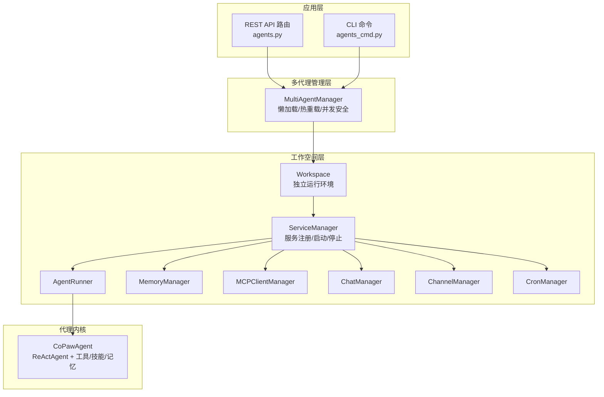
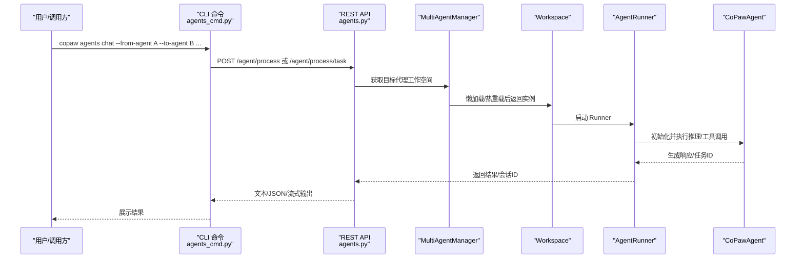
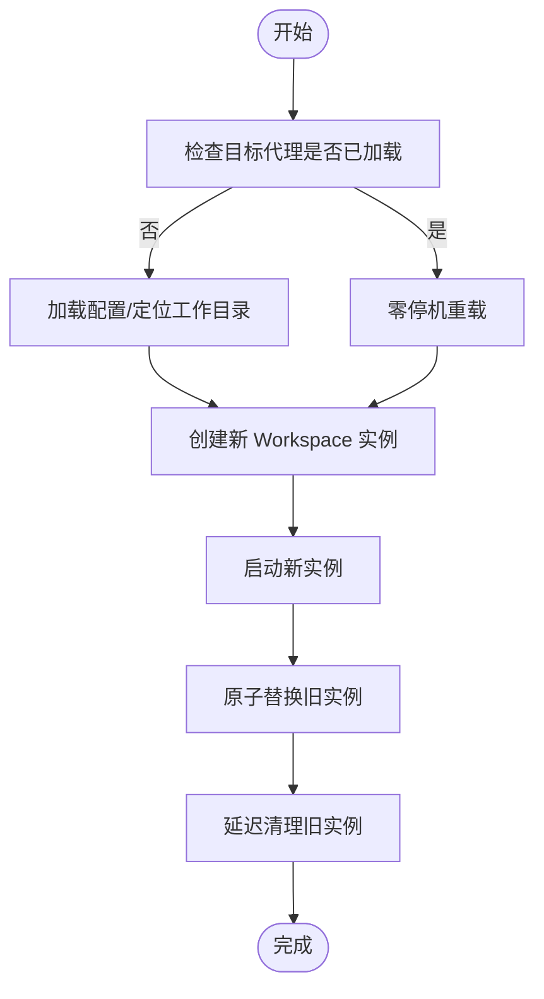
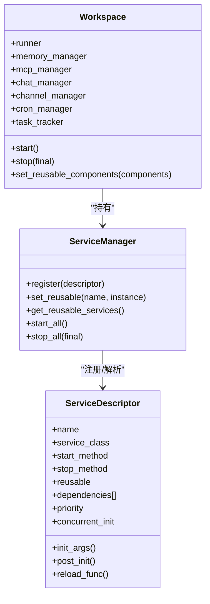
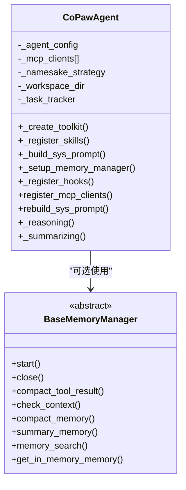
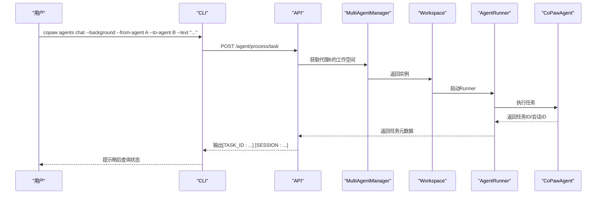
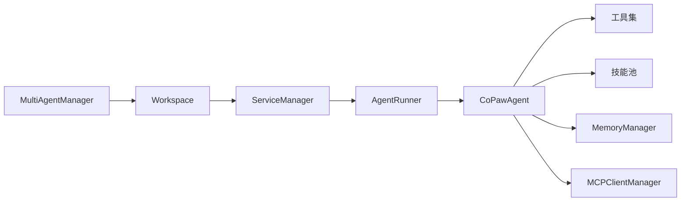

# 多代理协作

<cite>
**本文引用的文件**
- [src/copaw/app/multi_agent_manager.py](file://src/copaw/app/multi_agent_manager.py)
- [src/copaw/app/workspace/workspace.py](file://src/copaw/app/workspace/workspace.py)
- [src/copaw/app/workspace/service_manager.py](file://src/copaw/app/workspace/service_manager.py)
- [src/copaw/agents/react_agent.py](file://src/copaw/agents/react_agent.py)
- [src/copaw/app/routers/agents.py](file://src/copaw/app/routers/agents.py)
- [src/copaw/cli/agents_cmd.py](file://src/copaw/cli/agents_cmd.py)
- [src/copaw/agents/memory/base_memory_manager.py](file://src/copaw/agents/memory/base_memory_manager.py)
- [src/copaw/agents/tools/__init__.py](file://src/copaw/agents/tools/__init__.py)
- [working/skill_pool/multi_agent_collaboration/SKILL.md](file://working/skill_pool/multi_agent_collaboration/SKILL.md)
- [website/public/docs/multi-agent.en.md](file://website/public/docs/multi-agent.en.md)
- [src/copaw/config/config.py](file://src/copaw/config/config.py)
</cite>

## 目录
1. [引言](#引言)
2. [项目结构](#项目结构)
3. [核心组件](#核心组件)
4. [架构总览](#架构总览)
5. [详细组件分析](#详细组件分析)
6. [依赖分析](#依赖分析)
7. [性能考虑](#性能考虑)
8. [故障排查指南](#故障排查指南)
9. [结论](#结论)
10. [附录](#附录)

## 引言
本文件面向希望构建“多代理协作系统”的读者，系统性阐述 CoPaw 的多代理架构设计与工作机制，涵盖代理间通信、任务分配与后台任务、资源共享与状态隔离、零停机热重载、以及可扩展的应用场景与最佳实践。文档既提供代码级的结构化解读，也给出可视化图示与实操指引，帮助不同技术背景的读者快速上手并深度掌握。

## 项目结构
CoPaw 将“单代理”能力以“工作空间（Workspace）”为单位进行封装，多代理通过“多工作空间管理器（MultiAgentManager）”统一调度。每个 Workspace 独立承载运行器、通道管理、内存管理、MCP 客户端、计划任务等组件，并通过统一的服务管理器（ServiceManager）进行生命周期编排。

图表来源
- [src/copaw/app/multi_agent_manager.py:21-470](file://src/copaw/app/multi_agent_manager.py#L21-L470)
- [src/copaw/app/workspace/workspace.py:50-392](file://src/copaw/app/workspace/workspace.py#L50-L392)
- [src/copaw/app/workspace/service_manager.py:74-421](file://src/copaw/app/workspace/service_manager.py#L74-L421)
- [src/copaw/agents/react_agent.py:69-800](file://src/copaw/agents/react_agent.py#L69-L800)
- [src/copaw/app/routers/agents.py:1-726](file://src/copaw/app/routers/agents.py#L1-L726)
- [src/copaw/cli/agents_cmd.py:374-680](file://src/copaw/cli/agents_cmd.py#L374-L680)

章节来源
- [src/copaw/app/multi_agent_manager.py:21-470](file://src/copaw/app/multi_agent_manager.py#L21-L470)
- [src/copaw/app/workspace/workspace.py:50-392](file://src/copaw/app/workspace/workspace.py#L50-L392)
- [src/copaw/app/workspace/service_manager.py:74-421](file://src/copaw/app/workspace/service_manager.py#L74-L421)

## 核心组件
- 多代理管理器（MultiAgentManager）
  - 懒加载：首次访问才创建并启动工作空间
  - 生命周期：启动、停止、零停机热重载
  - 并发安全：异步锁保护共享状态
  - 可靠清理：后台延迟清理旧实例，保障任务不中断
- 工作空间（Workspace）
  - 独立运行环境，封装 Runner、ChannelManager、MemoryManager、MCPClientManager、CronManager
  - 通过 ServiceDescriptor 声明式注册服务，按优先级并发/串行启动
- 服务管理器（ServiceManager）
  - 统一注册、启动、停止、依赖解析与可复用组件传递
- 主代理类（CoPawAgent）
  - 基于 ReActAgent，集成工具、技能、记忆管理、MCP 客户端注册、媒体块过滤与重试
- API/CLI 交互
  - REST API 提供代理列表、创建、更新、删除、切换启用、文件读写、内存文件列表等
  - CLI 提供跨代理聊天、后台任务提交与状态查询、会话复用、流式输出等

章节来源
- [src/copaw/app/multi_agent_manager.py:21-470](file://src/copaw/app/multi_agent_manager.py#L21-L470)
- [src/copaw/app/workspace/workspace.py:50-392](file://src/copaw/app/workspace/workspace.py#L50-L392)
- [src/copaw/app/workspace/service_manager.py:74-421](file://src/copaw/app/workspace/service_manager.py#L74-L421)
- [src/copaw/agents/react_agent.py:69-800](file://src/copaw/agents/react_agent.py#L69-L800)
- [src/copaw/app/routers/agents.py:1-726](file://src/copaw/app/routers/agents.py#L1-L726)
- [src/copaw/cli/agents_cmd.py:374-680](file://src/copaw/cli/agents_cmd.py#L374-L680)

## 架构总览
多代理协作的关键在于“工作空间隔离 + 统一管理 + 可插拔服务”。每个 Workspace 是一个独立的运行单元，内部组件通过 ServiceManager 统一编排；多 Workspace 由 MultiAgentManager 按需加载与热重载。代理间通信通过 CLI 或 API 的“跨代理聊天”能力实现，支持实时模式与后台任务模式，配合会话 ID 实现上下文延续。

图表来源
- [src/copaw/cli/agents_cmd.py:511-680](file://src/copaw/cli/agents_cmd.py#L511-L680)
- [src/copaw/app/routers/agents.py:1-726](file://src/copaw/app/routers/agents.py#L1-L726)
- [src/copaw/app/multi_agent_manager.py:38-90](file://src/copaw/app/multi_agent_manager.py#L38-L90)
- [src/copaw/app/workspace/workspace.py:325-392](file://src/copaw/app/workspace/workspace.py#L325-L392)
- [src/copaw/agents/react_agent.py:69-800](file://src/copaw/agents/react_agent.py#L69-L800)

## 详细组件分析

### 多代理管理器（MultiAgentManager）
- 懒加载与并发安全
  - 通过异步锁保护 agents 字典与实例创建过程，避免竞态
  - 未加载时按需创建 Workspace 并启动
- 零停机热重载
  - 创建新实例（不持锁）→ 原子替换（持锁）→ 延迟清理旧实例（不持锁）
  - 旧实例若存在活动任务，后台等待任务完成或超时后停止
- 批量启动
  - 并发启动所有启用的代理，跳过禁用代理
- 资源回收
  - 停止所有代理并取消待处理清理任务

图表来源
- [src/copaw/app/multi_agent_manager.py:208-320](file://src/copaw/app/multi_agent_manager.py#L208-L320)

章节来源
- [src/copaw/app/multi_agent_manager.py:21-470](file://src/copaw/app/multi_agent_manager.py#L21-L470)

### 工作空间（Workspace）与服务管理（ServiceManager）
- 声明式服务注册
  - 通过 ServiceDescriptor 描述服务名称、类/工厂、初始化参数、后置钩子、启动/停止方法、优先级、并发策略、可复用性等
- 启动顺序与并发
  - 按优先级分组，同优先级内可并发启动；高优先级先启动，低优先级后停止
- 可复用组件
  - 支持在热重载时将可复用组件（如 MemoryManager、ChatManager）从旧实例传递给新实例，减少重建成本
- 生命周期控制
  - start_all()/stop_all() 统一编排，支持 final 标记决定是否停止可复用组件

图表来源
- [src/copaw/app/workspace/service_manager.py:30-421](file://src/copaw/app/workspace/service_manager.py#L30-L421)
- [src/copaw/app/workspace/workspace.py:145-392](file://src/copaw/app/workspace/workspace.py#L145-L392)

章节来源
- [src/copaw/app/workspace/workspace.py:50-392](file://src/copaw/app/workspace/workspace.py#L50-L392)
- [src/copaw/app/workspace/service_manager.py:74-421](file://src/copaw/app/workspace/service_manager.py#L74-L421)

### 主代理类（CoPawAgent）
- 工具与技能
  - 动态注册内置工具（文件、Shell、浏览器、截图、多媒体查看、时间/用量等）
  - 按通道解析有效技能并注册到工具包
- 记忆管理
  - 可选启用 MemoryManager，注册 memory_search 工具
  - 支持记忆压缩与摘要任务异步化
- MCP 客户端
  - 支持 HTTP/STDIO 状态客户端注册与自动恢复
- 媒体块过滤与重试
  - 主动/被动过滤模型不支持的媒体块，提升鲁棒性
- Hook 与引导
  - 注册引导 Hook 与记忆压缩 Hook

图表来源
- [src/copaw/agents/react_agent.py:69-800](file://src/copaw/agents/react_agent.py#L69-L800)
- [src/copaw/agents/memory/base_memory_manager.py:21-226](file://src/copaw/agents/memory/base_memory_manager.py#L21-L226)

章节来源
- [src/copaw/agents/react_agent.py:69-800](file://src/copaw/agents/react_agent.py#L69-L800)
- [src/copaw/agents/memory/base_memory_manager.py:21-226](file://src/copaw/agents/memory/base_memory_manager.py#L21-L226)

### 代理间通信与任务路由（CLI/API）
- 代理发现与聊天
  - CLI 提供 copaw agents list 与 copaw agents chat
  - API 提供 /agents 与 /agent/process
- 会话与上下文
  - 自动生成唯一 session_id，支持 --session-id 复用上下文
  - 自动添加身份前缀，避免混淆
- 后台任务
  - --background 提交任务，返回 TASK_ID 与 SESSION
  - 支持查询任务状态（submitted/pending/running/finished），区分外层与内层状态
- 流式输出与 JSON 输出
  - --mode stream 输出增量事件
  - --json-output 输出完整 JSON

图表来源
- [src/copaw/cli/agents_cmd.py:511-680](file://src/copaw/cli/agents_cmd.py#L511-L680)
- [src/copaw/app/routers/agents.py:1-726](file://src/copaw/app/routers/agents.py#L1-L726)

章节来源
- [src/copaw/cli/agents_cmd.py:374-680](file://src/copaw/cli/agents_cmd.py#L374-L680)
- [src/copaw/app/routers/agents.py:1-726](file://src/copaw/app/routers/agents.py#L1-L726)

### 工具与技能生态
- 工具清单
  - Shell、文件读写/编辑、搜索、浏览器、桌面截图、多媒体查看、发送文件、时间/时区、用量统计等
- 技能池
  - 通过工作空间技能目录动态加载，按通道解析有效技能
- 记忆检索工具
  - 可选注册 memory_search 工具，结合 MemoryManager 提供语义检索

章节来源
- [src/copaw/agents/tools/__init__.py:1-48](file://src/copaw/agents/tools/__init__.py#L1-L48)
- [src/copaw/agents/react_agent.py:306-341](file://src/copaw/agents/react_agent.py#L306-L341)

### 多代理协作场景与最佳实践
- 场景模板
  - 跨域协作：代码分析 + 文档撰写
  - 专家评审：初审 + 高级助理复核
  - 数据共享：按需请求报表/数据
- 关键要点
  - 清晰描述每个代理的职责与能力
  - 使用会话 ID 复用上下文，避免重复输入
  - 复杂任务使用后台模式，合理安排查询间隔
  - 严格遵守“不要回调来源代理”的规则，避免循环

章节来源
- [working/skill_pool/multi_agent_collaboration/SKILL.md:1-477](file://working/skill_pool/multi_agent_collaboration/SKILL.md#L1-L477)
- [website/public/docs/multi-agent.en.md:312-417](file://website/public/docs/multi-agent.en.md#L312-L417)

## 依赖分析
- 组件耦合
  - MultiAgentManager 与 Workspace 之间为“管理-被管理”关系，通过 agent_id 解耦
  - Workspace 与 ServiceManager 为“容器-编排”关系，ServiceDescriptor 描述服务契约
  - AgentRunner 与 CoPawAgent 为“执行-内核”关系，Runner 负责请求处理与生命周期
- 外部依赖
  - MCP 客户端（HTTP/STDIO）通过注册注入工具包
  - 记忆管理器抽象接口，便于替换实现
- 循环依赖
  - 通过延迟导入与运行时注入避免循环

图表来源
- [src/copaw/app/multi_agent_manager.py:21-470](file://src/copaw/app/multi_agent_manager.py#L21-L470)
- [src/copaw/app/workspace/workspace.py:50-392](file://src/copaw/app/workspace/workspace.py#L50-L392)
- [src/copaw/agents/react_agent.py:69-800](file://src/copaw/agents/react_agent.py#L69-L800)

章节来源
- [src/copaw/app/multi_agent_manager.py:21-470](file://src/copaw/app/multi_agent_manager.py#L21-L470)
- [src/copaw/app/workspace/workspace.py:50-392](file://src/copaw/app/workspace/workspace.py#L50-L392)
- [src/copaw/agents/react_agent.py:69-800](file://src/copaw/agents/react_agent.py#L69-L800)

## 性能考虑
- 启动与热重载
  - 通过并发启动与可复用组件降低冷启动与重载时延
  - 零停机重载确保请求不中断
- 记忆与检索
  - 异步摘要任务与后台清理，避免阻塞主线程
  - 记忆压缩阈值与阈值策略影响上下文长度与推理成本
- I/O 与工具
  - 文件/Shell/浏览器等工具调用建议限制并发，避免资源争用
- 网络与流式
  - 流式输出适合长任务，减少前端等待时间
- 配置与资源
  - 通过配置文件与环境变量控制数据库/缓存连接池、速率限制等

[本节为通用指导，无需特定文件引用]

## 故障排查指南
- 代理未找到或无法启动
  - 检查配置文件中的 agent_profiles 与 enabled 标记
  - 查看 MultiAgentManager 的异常信息与日志
- 热重载失败
  - 新实例启动失败时会回滚，确认日志中的异常并修复
  - 若旧实例仍有活动任务，延迟清理任务会在后台完成或取消
- 会话冲突
  - 同一会话并发访问可能导致冲突，使用唯一 session_id 或 --new-session
- 后台任务状态异常
  - 使用 --background --task-id 查询状态，关注 submitted/pending/running/finished 的流转
- 媒体块错误
  - 当模型不支持多媒体时，系统会主动/被动剥离媒体块；若仍报错，检查模型能力标注

章节来源
- [src/copaw/app/multi_agent_manager.py:91-187](file://src/copaw/app/multi_agent_manager.py#L91-L187)
- [src/copaw/cli/agents_cmd.py:272-372](file://src/copaw/cli/agents_cmd.py#L272-L372)
- [src/copaw/agents/react_agent.py:665-775](file://src/copaw/agents/react_agent.py#L665-L775)

## 结论
CoPaw 的多代理协作体系以“工作空间隔离 + 统一管理 + 可插拔服务”为核心，实现了高可用、可扩展、可观测的多代理运行时。通过懒加载、零停机热重载、后台任务与会话复用等机制，系统在复杂业务场景下具备良好的稳定性与吞吐能力。配合清晰的代理描述与协作规范，可支撑客服机器人集群、智能助手团队、专业顾问网络等多种应用形态。

[本节为总结性内容，无需特定文件引用]

## 附录

### 配置与管理要点
- 代理配置
  - 通过配置文件定义 agent_profiles、agent_order、语言、工具开关、心跳等
- 工作空间初始化
  - 自动创建 sessions/memory/skills 目录，复制内置技能与 Markdown 文件
- 企业特性
  - 企业版可启用审计、任务管理、工作流引擎等能力

章节来源
- [src/copaw/config/config.py:1-200](file://src/copaw/config/config.py#L1-L200)
- [src/copaw/app/routers/agents.py:683-726](file://src/copaw/app/routers/agents.py#L683-L726)