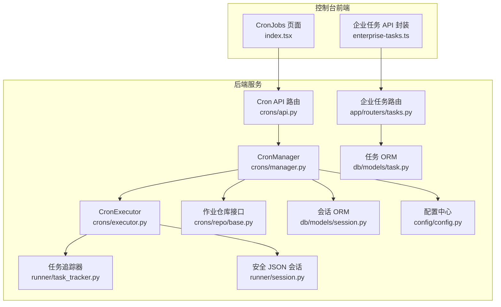
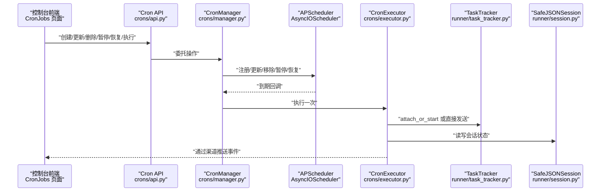
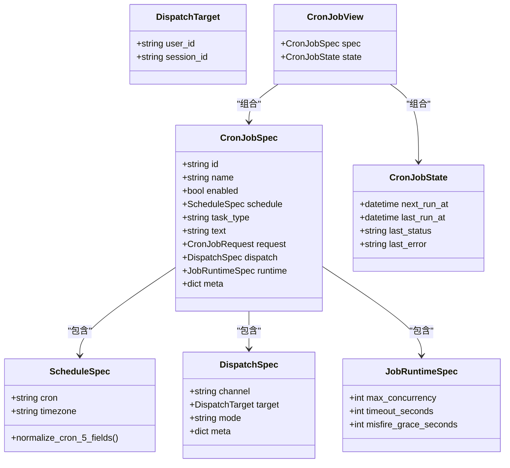
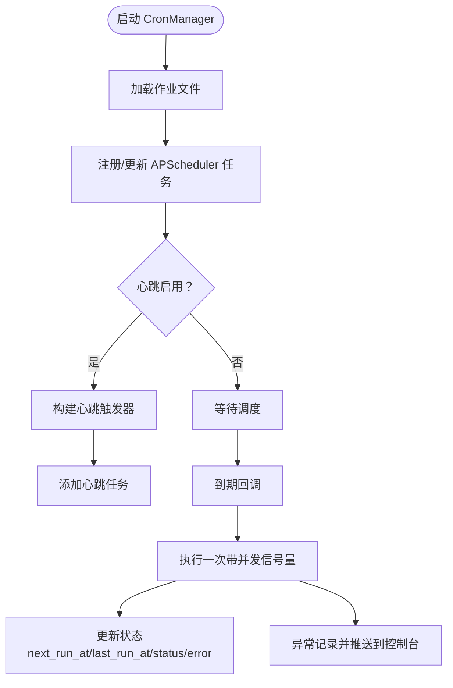
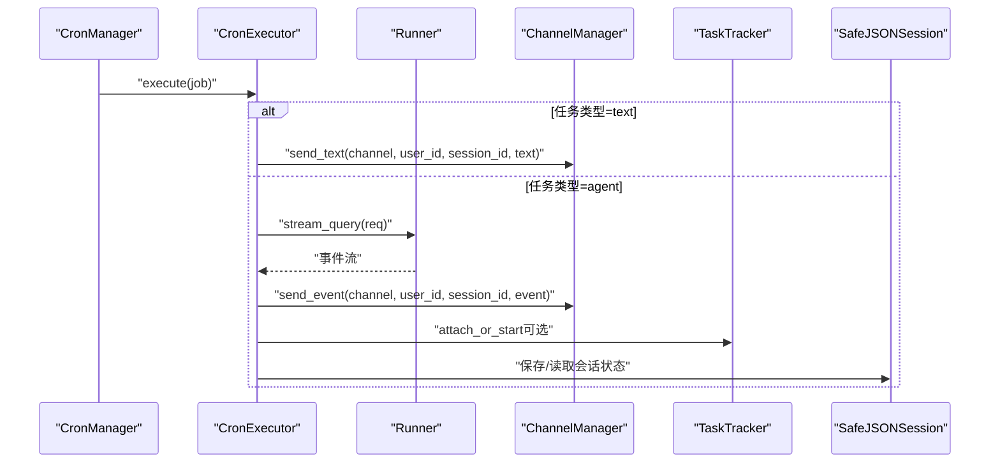
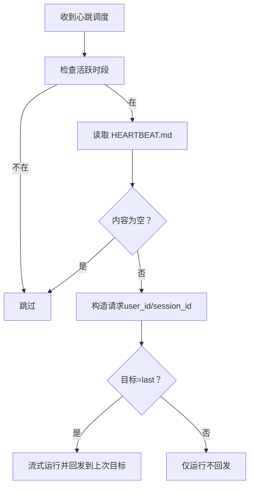
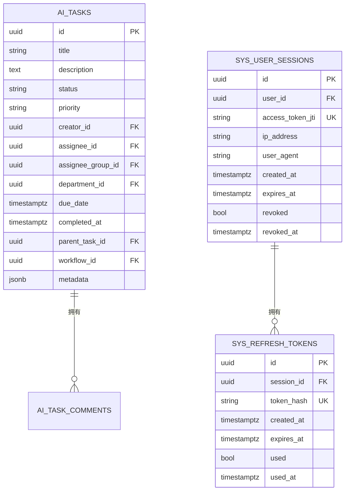
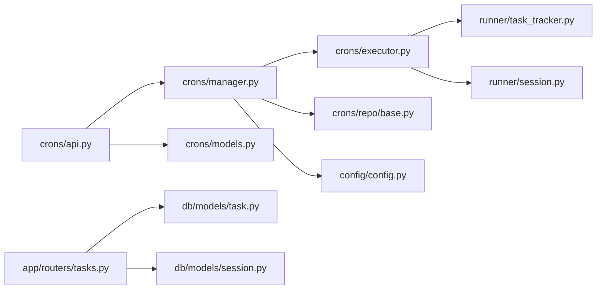

# 任务管理

<cite>
**本文引用的文件**
- [src\copaw\app\crons\models.py](file://src\copaw\app\crons\models.py)
- [src\copaw\app\crons\manager.py](file://src\copaw\app\crons\manager.py)
- [src\copaw\app\crons\executor.py](file://src\copaw\app\crons\executor.py)
- [src\copaw\app\crons\api.py](file://src\copaw\app\crons\api.py)
- [src\copaw\app\crons\heartbeat.py](file://src\copaw\app\crons\heartbeat.py)
- [src\copaw\app\crons\repo\base.py](file://src\copaw\app\crons\repo\base.py)
- [src\copaw\app\runner\task_tracker.py](file://src\copaw\app\runner\task_tracker.py)
- [src\copaw\app\runner\session.py](file://src\copaw\app\runner\session.py)
- [src\copaw\db\models\task.py](file://src\copaw\db\models\task.py)
- [src\copaw\db\models\session.py](file://src\copaw\db\models\session.py)
- [src\copaw\app\routers\tasks.py](file://src\copaw\app\routers\tasks.py)
- [src\copaw\config\config.py](file://src\copaw\config\config.py)
- [console\src\pages\Control\CronJobs\index.tsx](file://console\src\pages\Control\CronJobs\index.tsx)
- [console\src\api\modules\enterprise-tasks.ts](file://console\src\api\modules\enterprise-tasks.ts)
</cite>

## 目录
1. [简介](#简介)
2. [项目结构](#项目结构)
3. [核心组件](#核心组件)
4. [架构总览](#架构总览)
5. [详细组件分析](#详细组件分析)
6. [依赖分析](#依赖分析)
7. [性能考虑](#性能考虑)
8. [故障排查指南](#故障排查指南)
9. [结论](#结论)
10. [附录：配置与最佳实践](#附录配置与最佳实践)

## 简介
本指南面向企业与个人用户，系统讲解任务管理中的“定时任务”能力，包括创建、配置、执行与监控；Cron 表达式编写与常用模式；调度器工作原理、执行队列与并发控制；日志与历史、失败重试与会话状态追踪；以及权限、资源限制与性能优化等高级配置。同时提供常见场景的配置模板与最佳实践，帮助您在控制台与后端之间高效地完成任务全生命周期管理。

## 项目结构
围绕“定时任务”的关键模块分布如下：
- 后端核心
  - 定时任务模型与调度：crons/models.py、crons/manager.py、crons/executor.py、crons/api.py、crons/heartbeat.py、crons/repo/base.py
  - 任务运行与会话：runner/task_tracker.py、runner/session.py
  - 企业任务与会话持久化：db/models/task.py、db/models/session.py
  - 企业任务 API：app/routers/tasks.py
  - 配置中心：config/config.py
- 控制台前端
  - 定时任务页面：console/src/pages/Control/CronJobs/index.tsx
  - 企业任务 API 封装：console/src/api/modules/enterprise-tasks.ts

图表来源
- [src\copaw\app\crons\api.py:1-117](file://src\copaw\app\crons\api.py#L1-L117)
- [src\copaw\app\crons\manager.py:1-388](file://src\copaw\app\crons\manager.py#L1-L388)
- [src\copaw\app\crons\executor.py:1-90](file://src\copaw\app\crons\executor.py#L1-L90)
- [src\copaw\app\runner\task_tracker.py:1-231](file://src\copaw\app\runner\task_tracker.py#L1-L231)
- [src\copaw\app\runner\session.py:1-248](file://src\copaw\app\runner\session.py#L1-L248)
- [src\copaw\db\models\task.py:1-151](file://src\copaw\db\models\task.py#L1-L151)
- [src\copaw\db\models\session.py:1-116](file://src\copaw\db\models\session.py#L1-L116)
- [src\copaw\app\routers\tasks.py:1-252](file://src\copaw\app\routers\tasks.py#L1-L252)
- [src\copaw\config\config.py:1-800](file://src\copaw\config\config.py#L1-L800)

章节来源
- [src\copaw\app\crons\api.py:1-117](file://src\copaw\app\crons\api.py#L1-L117)
- [src\copaw\app\crons\manager.py:1-388](file://src\copaw\app\crons\manager.py#L1-L388)
- [src\copaw\app\crons\executor.py:1-90](file://src\copaw\app\crons\executor.py#L1-L90)
- [src\copaw\app\runner\task_tracker.py:1-231](file://src\copaw\app\runner\task_tracker.py#L1-L231)
- [src\copaw\app\runner\session.py:1-248](file://src\copaw\app\runner\session.py#L1-L248)
- [src\copaw\db\models\task.py:1-151](file://src\copaw\db\models\task.py#L1-L151)
- [src\copaw\db\models\session.py:1-116](file://src\copaw\db\models\session.py#L1-L116)
- [src\copaw\app\routers\tasks.py:1-252](file://src\copaw\app\routers\tasks.py#L1-L252)
- [src\copaw\config\config.py:1-800](file://src\copaw\config\config.py#L1-L800)

## 核心组件
- CronJob 规格与状态
  - CronJobSpec：定义任务标识、名称、启用状态、调度、任务类型（文本/代理）、请求体、分发目标与运行参数（并发、超时、错失宽限）。
  - CronJobState：记录下次/上次运行时间、最近状态（成功/错误/运行中/跳过/取消）与错误信息。
  - CronJobView：组合规格与状态，供前端展示。
- CronManager：调度器核心
  - 负责加载作业、注册 APScheduler 任务、暂停/恢复/删除、手动触发、心跳任务调度、并发信号量与状态维护。
- CronExecutor：执行器
  - 文本任务直接通过渠道发送；代理任务通过 runner 流式查询，并将事件逐条发送至指定渠道。
- 仓库接口 BaseJobRepository：抽象作业持久化，支持列表、查询、增改、删除。
- 任务追踪器 TaskTracker：为后台流式任务提供多订阅、缓冲与断线重连能力。
- 安全 JSON 会话 SafeJSONSession：跨平台文件名安全的异步会话存取。
- 企业任务与会话 ORM：任务表与用户会话表，支撑任务管理与会话审计。
- 企业任务 API：提供任务的增删改查、状态变更与评论管理。
- 配置中心：心跳间隔、目标、活跃时段等配置项。

章节来源
- [src\copaw\app\crons\models.py:1-180](file://src\copaw\app\crons\models.py#L1-L180)
- [src\copaw\app\crons\manager.py:1-388](file://src\copaw\app\crons\manager.py#L1-L388)
- [src\copaw\app\crons\executor.py:1-90](file://src\copaw\app\crons\executor.py#L1-L90)
- [src\copaw\app\crons\repo\base.py:1-54](file://src\copaw\app\crons\repo\base.py#L1-L54)
- [src\copaw\app\runner\task_tracker.py:1-231](file://src\copaw\app\runner\task_tracker.py#L1-L231)
- [src\copaw\app\runner\session.py:1-248](file://src\copaw\app\runner\session.py#L1-L248)
- [src\copaw\db\models\task.py:1-151](file://src\copaw\db\models\task.py#L1-L151)
- [src\copaw\db\models\session.py:1-116](file://src\copaw\db\models\session.py#L1-L116)
- [src\copaw\app\routers\tasks.py:1-252](file://src\copaw\app\routers\tasks.py#L1-L252)
- [src\copaw\config\config.py:295-307](file://src\copaw\config\config.py#L295-L307)

## 架构总览
下图展示了从控制台到后端的完整链路：前端通过 API 创建/修改/执行定时任务；后端 CronManager 注册 APScheduler 任务；到期或手动触发时，CronExecutor 执行任务并通过渠道分发；心跳任务按配置周期运行；任务运行状态与会话状态通过追踪器与会话模块保障。

图表来源
- [src\copaw\app\crons\api.py:1-117](file://src\copaw\app\crons\api.py#L1-L117)
- [src\copaw\app\crons\manager.py:1-388](file://src\copaw\app\crons\manager.py#L1-L388)
- [src\copaw\app\crons\executor.py:1-90](file://src\copaw\app\crons\executor.py#L1-L90)
- [src\copaw\app\runner\task_tracker.py:1-231](file://src\copaw\app\runner\task_tracker.py#L1-L231)
- [src\copaw\app\runner\session.py:1-248](file://src\copaw\app\runner\session.py#L1-L248)

## 详细组件分析

### 组件一：CronJob 规格与状态
- 关键字段
  - schedule.cron：Cron 表达式（5 字段），支持标准化 day-of-week 数字到缩写转换。
  - task_type：text 或 agent；text 直接发送固定文本；agent 通过 runner 流式查询并分发。
  - dispatch：目标用户与会话、渠道、分发模式（流式/最终）与元数据。
  - runtime：max_concurrency、timeout_seconds、misfire_grace_seconds。
  - meta：自定义扩展字段。
- 状态机
  - next_run_at/last_run_at/last_status/last_error：用于前端展示与运维观测。

图表来源
- [src\copaw\app\crons\models.py:59-180](file://src\copaw\app\crons\models.py#L59-L180)

章节来源
- [src\copaw\app\crons\models.py:1-180](file://src\copaw\app\crons\models.py#L1-L180)

### 组件二：调度器 CronManager
- 初始化与启动
  - 加载作业文件，注册 APScheduler 任务；无效作业自动禁用并落库。
  - 可选心跳任务：根据配置构建 CronTrigger 或 IntervalTrigger。
- 并发与状态
  - 每个作业独立 asyncio.Semaphore 控制并发；状态字典记录 next_run_at 等。
- 生命周期
  - 支持创建/替换、删除、暂停/恢复、手动触发 run_job；内部回调负责状态刷新与异常抑制。

图表来源
- [src\copaw\app\crons\manager.py:63-118](file://src\copaw\app\crons\manager.py#L63-L118)
- [src\copaw\app\crons\manager.py:242-273](file://src\copaw\app\crons\manager.py#L242-L273)
- [src\copaw\app\crons\manager.py:316-328](file://src\copaw\app\crons\manager.py#L316-L328)
- [src\copaw\app\crons\manager.py:349-387](file://src\copaw\app\crons\manager.py#L349-L387)

章节来源
- [src\copaw\app\crons\manager.py:1-388](file://src\copaw\app\crons\manager.py#L1-L388)

### 组件三：执行器 CronExecutor
- 文本任务：直接调用渠道管理器发送文本消息。
- 代理任务：以目标用户/会话身份发起 runner.stream_query，逐事件发送至渠道；支持超时控制与取消处理。

图表来源
- [src\copaw\app\crons\executor.py:18-90](file://src\copaw\app\crons\executor.py#L18-L90)
- [src\copaw\app\runner\task_tracker.py:142-208](file://src\copaw\app\runner\task_tracker.py#L142-L208)
- [src\copaw\app\runner\session.py:73-193](file://src\copaw\app\runner\session.py#L73-L193)

章节来源
- [src\copaw\app\crons\executor.py:1-90](file://src\copaw\app\crons\executor.py#L1-L90)
- [src\copaw\app\runner\task_tracker.py:1-231](file://src\copaw\app\runner\task_tracker.py#L1-L231)
- [src\copaw\app\runner\session.py:1-248](file://src\copaw\app\runner\session.py#L1-L248)

### 组件四：心跳与配置
- 心跳表达式识别与解析：支持 5 场 cron 或间隔字符串（如 30m、1h）。
- 活跃时段校验：基于用户时区判断是否在允许时间段内。
- 运行一次：读取 HEARTBEAT.md 作为查询文本，可选择回发至上次分发目标或仅运行。

图表来源
- [src\copaw\app\crons\heartbeat.py:119-213](file://src\copaw\app\crons\heartbeat.py#L119-L213)
- [src\copaw\config\config.py:295-307](file://src\copaw\config\config.py#L295-L307)

章节来源
- [src\copaw\app\crons\heartbeat.py:1-213](file://src\copaw\app\crons\heartbeat.py#L1-L213)
- [src\copaw\config\config.py:295-307](file://src\copaw\config\config.py#L295-L307)

### 组件五：企业任务与会话
- 企业任务 ORM：支持标题、描述、状态、优先级、指派、截止时间、父任务、工作流、元数据等。
- 会话 ORM：用户会话与刷新令牌，支撑会话审计与撤销。
- 企业任务 API：提供列表、创建、查询、更新、状态变更、删除、评论列表与新增。

图表来源
- [src\copaw\db\models\task.py:23-151](file://src\copaw\db\models\task.py#L23-L151)
- [src\copaw\db\models\session.py:21-116](file://src\copaw\db\models\session.py#L21-L116)
- [src\copaw\app\routers\tasks.py:27-252](file://src\copaw\app\routers\tasks.py#L27-L252)

章节来源
- [src\copaw\db\models\task.py:1-151](file://src\copaw\db\models\task.py#L1-L151)
- [src\copaw\db\models\session.py:1-116](file://src\copaw\db\models\session.py#L1-L116)
- [src\copaw\app\routers\tasks.py:1-252](file://src\copaw\app\routers\tasks.py#L1-L252)

### 组件六：控制台与 API
- 控制台页面：提供创建、编辑、启用/禁用、立即执行、删除等操作；支持将复杂 Cron 表达式序列化/反序列化为表单字段。
- Cron API：提供作业列表、详情、创建、替换、删除、暂停/恢复、手动执行、状态查询。
- 企业任务 API：提供任务 CRUD、状态变更、评论管理。

章节来源
- [console\src\pages\Control\CronJobs\index.tsx:1-238](file://console\src\pages\Control\CronJobs\index.tsx#L1-L238)
- [src\copaw\app\crons\api.py:1-117](file://src\copaw\app\crons\api.py#L1-L117)
- [console\src\api\modules\enterprise-tasks.ts:1-86](file://console\src\api\modules\enterprise-tasks.ts#L1-L86)
- [src\copaw\app\routers\tasks.py:1-252](file://src\copaw\app\routers\tasks.py#L1-L252)

## 依赖分析
- 组件耦合
  - CronManager 依赖 CronExecutor、仓库接口、心跳工具与配置中心；通过 asyncio.Lock 保证并发安全。
  - CronExecutor 依赖 Runner 与 ChannelManager；与 TaskTracker、SafeJSONSession 协同保障流式与会话。
  - 企业任务 API 依赖数据库会话与服务层，配合审计服务记录操作。
- 外部依赖
  - APScheduler（AsyncIOScheduler）用于调度；Pydantic 用于模型校验；FastAPI 提供 API 路由。
- 循环依赖
  - 未发现循环导入；模块职责清晰，接口抽象良好。

图表来源
- [src\copaw\app\crons\api.py:1-117](file://src\copaw\app\crons\api.py#L1-L117)
- [src\copaw\app\crons\manager.py:1-388](file://src\copaw\app\crons\manager.py#L1-L388)
- [src\copaw\app\crons\executor.py:1-90](file://src\copaw\app\crons\executor.py#L1-L90)
- [src\copaw\app\runner\task_tracker.py:1-231](file://src\copaw\app\runner\task_tracker.py#L1-L231)
- [src\copaw\app\runner\session.py:1-248](file://src\copaw\app\runner\session.py#L1-L248)
- [src\copaw\app\routers\tasks.py:1-252](file://src\copaw\app\routers\tasks.py#L1-L252)
- [src\copaw\db\models\task.py:1-151](file://src\copaw\db\models\task.py#L1-L151)
- [src\copaw\db\models\session.py:1-116](file://src\copaw\db\models\session.py#L1-L116)
- [src\copaw\config\config.py:1-800](file://src\copaw\config\config.py#L1-L800)

章节来源
- [src\copaw\app\crons\api.py:1-117](file://src\copaw\app\crons\api.py#L1-L117)
- [src\copaw\app\crons\manager.py:1-388](file://src\copaw\app\crons\manager.py#L1-L388)
- [src\copaw\app\crons\executor.py:1-90](file://src\copaw\app\crons\executor.py#L1-L90)
- [src\copaw\app\runner\task_tracker.py:1-231](file://src\copaw\app\runner\task_tracker.py#L1-L231)
- [src\copaw\app\runner\session.py:1-248](file://src\copaw\app\runner\session.py#L1-L248)
- [src\copaw\app\routers\tasks.py:1-252](file://src\copaw\app\routers\tasks.py#L1-L252)
- [src\copaw\db\models\task.py:1-151](file://src\copaw\db\models\task.py#L1-L151)
- [src\copaw\db\models\session.py:1-116](file://src\copaw\db\models\session.py#L1-L116)
- [src\copaw\config\config.py:1-800](file://src\copaw\config\config.py#L1-L800)

## 性能考虑
- 并发控制
  - 使用 asyncio.Semaphore 对每个作业的并发度进行限制，避免资源争用与过载。
- 超时与错失宽限
  - 通过 runtime.timeout_seconds 限制单次执行时长；misfire_grace_seconds 降低错过触发的风险。
- 流式传输与缓冲
  - TaskTracker 的事件缓冲与多订阅队列，减少断线重连成本，提升用户体验。
- I/O 非阻塞
  - SafeJSONSession 使用异步文件 I/O，避免阻塞事件循环。
- LLM 速率与并发
  - 配置中心提供全局并发、QPM、退避策略等，建议结合业务负载合理设置。

章节来源
- [src\copaw\app\crons\models.py:104-108](file://src\copaw\app\crons\models.py#L104-L108)
- [src\copaw\app\crons\manager.py:247-250](file://src\copaw\app\crons\manager.py#L247-L250)
- [src\copaw\app\runner\task_tracker.py:1-231](file://src\copaw\app\runner\task_tracker.py#L1-L231)
- [src\copaw\app\runner\session.py:1-248](file://src\copaw\app\runner\session.py#L1-L248)
- [src\copaw\config\config.py:497-651](file://src\copaw\config\config.py#L497-L651)

## 故障排查指南
- 作业无法启动/执行
  - 检查 CronManager 是否已启动；确认作业 enabled 状态；查看日志中“Auto-disabled invalid cron job”提示并修正表达式。
- 手动执行报错
  - run_job 返回 KeyError 表示作业不存在；其他异常会被记录并推送到控制台前端。
- 心跳未运行
  - 确认配置中 heartbeat.enabled、active_hours 与 every 设置；检查文件 HEARTBEAT.md 是否存在且非空。
- 会话状态异常
  - 检查 SafeJSONSession 文件路径与权限；确认非法字符已被替换；必要时清理旧文件。
- 企业任务状态变更失败
  - 确认状态枚举合法；检查审计日志与权限。

章节来源
- [src\copaw\app\crons\manager.py:63-118](file://src\copaw\app\crons\manager.py#L63-L118)
- [src\copaw\app\crons\manager.py:190-214](file://src\copaw\app\crons\manager.py#L190-L214)
- [src\copaw\app\crons\heartbeat.py:119-213](file://src\copaw\app\crons\heartbeat.py#L119-L213)
- [src\copaw\app\runner\session.py:28-36](file://src\copaw\app\runner\session.py#L28-L36)
- [src\copaw\app\routers\tasks.py:167-190](file://src\copaw\app\routers\tasks.py#L167-L190)

## 结论
本指南从模型、调度、执行、监控到会话与企业任务，全面覆盖了定时任务的使用与运维要点。通过合理的 Cron 表达式、并发与超时配置、流式传输与会话持久化，以及企业级任务与会话审计，可在生产环境中稳定、可观测地运行各类自动化任务。

## 附录：配置与最佳实践

### Cron 表达式编写与常用模式
- 字段说明（5 字段）：分钟、小时、日、月、星期（数字 0/7 表示周日，缩写 mon-sun 更直观）。
- 常用模式
  - 每天固定时间：0 9 * * *
  - 工作日：0 9 * * 1-5
  - 每周一上午 9:30：30 9 * * 1
  - 每月 1 日凌晨 2 点：0 2 1 * *
  - 每 15 分钟：*/15 * * * *
- 编写建议
  - 明确时区（schedule.timezone）；避免与 misfire_grace_seconds 冲突；尽量避开业务高峰期。

章节来源
- [src\copaw\app\crons\models.py:19-88](file://src\copaw\app\crons\models.py#L19-L88)

### 任务调度器工作机制与执行队列
- 调度器
  - AsyncIOScheduler + CronTrigger；支持错失宽限与暂停/恢复。
- 执行队列
  - 每作业独立信号量；执行前标记“运行中”，完成后更新状态与时间戳。
- 并发控制
  - max_concurrency 限制同一作业并发；timeout_seconds 防止长时间占用。

章节来源
- [src\copaw\app\crons\manager.py:242-273](file://src\copaw\app\crons\manager.py#L242-L273)
- [src\copaw\app\crons\models.py:104-108](file://src\copaw\app\crons\models.py#L104-L108)

### 日志查看、执行历史与失败重试
- 日志
  - 后端异常会记录并推送到控制台；可通过 run_job 的回调将错误消息写入控制台推送存储。
- 历史
  - CronJobState 记录最近状态与错误；TaskTracker 提供运行状态查询与活动任务列表。
- 重试
  - 当前实现未内置自动重试；建议在上游增加幂等设计与外部监控告警。

章节来源
- [src\copaw\app\crons\manager.py:217-239](file://src\copaw\app\crons\manager.py#L217-L239)
- [src\copaw\app\runner\task_tracker.py:46-78](file://src\copaw\app\runner\task_tracker.py#L46-L78)

### 会话管理、状态跟踪与结果获取
- 会话
  - SafeJSONSession 提供跨平台安全的 JSON 会话读写；支持异步文件 I/O。
- 状态跟踪
  - TaskTracker 维护事件缓冲与订阅队列；支持 attach/attach_or_start/stream_from_queue。
- 结果获取
  - 控制台页面支持立即执行与状态查询；API 提供状态接口。

章节来源
- [src\copaw\app\runner\session.py:1-248](file://src\copaw\app\runner\session.py#L1-L248)
- [src\copaw\app\runner\task_tracker.py:1-231](file://src\copaw\app\runner\task_tracker.py#L1-L231)
- [console\src\pages\Control\CronJobs\index.tsx:1-238](file://console\src\pages\Control\CronJobs\index.tsx#L1-L238)
- [src\copaw\app\crons\api.py:108-117](file://src\copaw\app\crons\api.py#L108-L117)

### 权限控制、资源限制与性能优化
- 权限
  - 企业任务 API 使用当前用户上下文；建议结合 RBAC 与审计日志。
- 资源限制
  - 通过 runtime.max_concurrency、timeout_seconds、LLM 全局并发与 QPM 限制资源消耗。
- 性能优化
  - 合理设置 misfire_grace_seconds；利用 TaskTracker 的缓冲减少重复计算；异步 I/O 与流式传输降低延迟。

章节来源
- [src\copaw\app\routers\tasks.py:1-252](file://src\copaw\app\routers\tasks.py#L1-L252)
- [src\copaw\config\config.py:497-651](file://src\copaw\config\config.py#L497-L651)

### 常见任务场景模板与最佳实践
- 场景模板
  - 数据备份：每日凌晨 2 点，向指定渠道发送备份结果。
  - 周报提醒：每周一下午 15:00，向团队频道发送模板化周报。
  - 清理任务：每晚 1:00，清理临时文件并记录清理报告。
- 最佳实践
  - 为每个作业设置明确的 enabled 状态与 meta 标签，便于审计与排障。
  - 使用流式分发（mode=stream）以获得实时反馈；对长耗时任务设置合理 timeout_seconds。
  - 在业务低峰期执行批量任务，避免与高峰流量冲突。

章节来源
- [src\copaw\app\crons\models.py:91-102](file://src\copaw\app\crons\models.py#L91-L102)
- [src\copaw\app\crons\models.py:104-108](file://src\copaw\app\crons\models.py#L104-L108)
- [src\copaw\app\crons\executor.py:65-74](file://src\copaw\app\crons\executor.py#L65-L74)