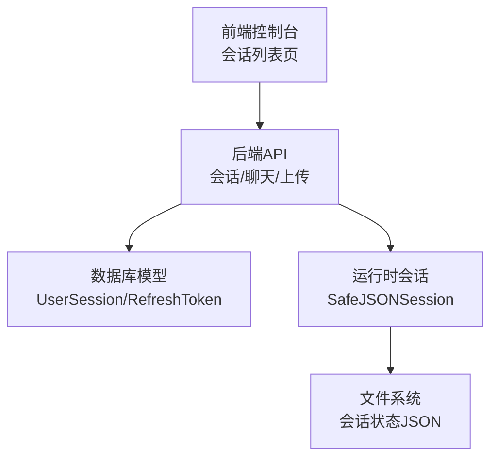
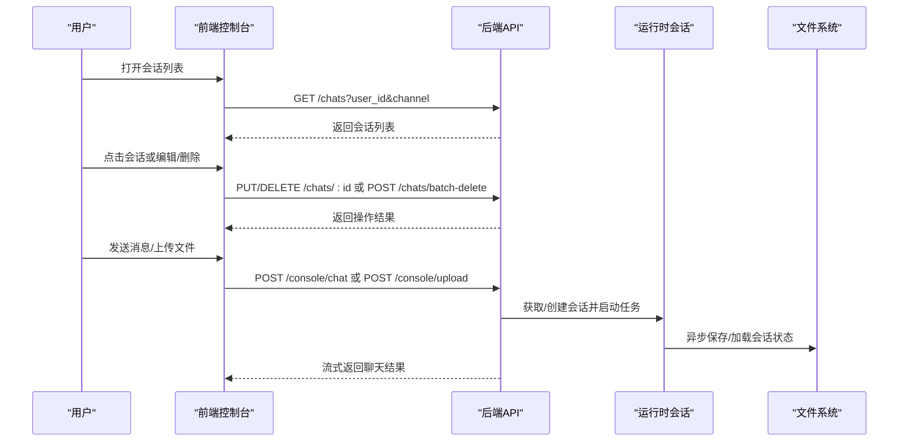
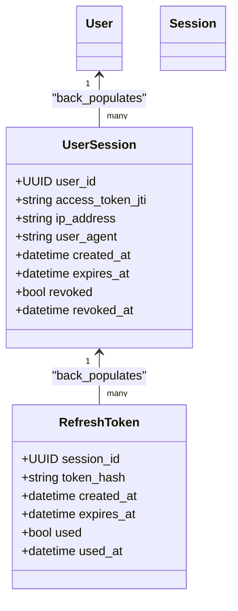
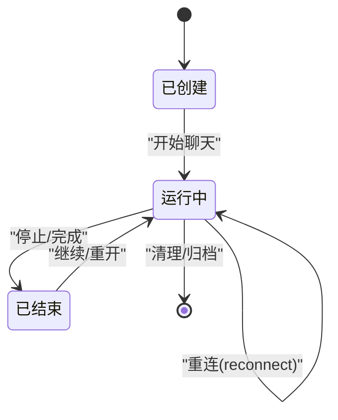
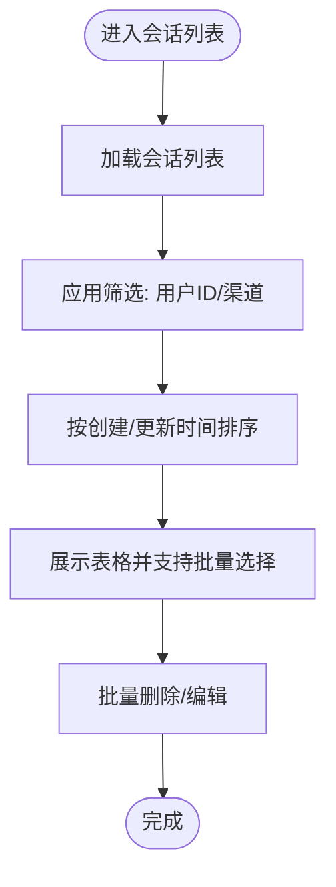
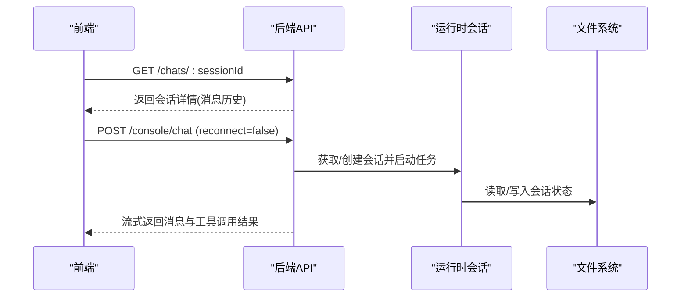
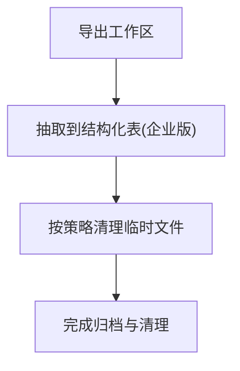
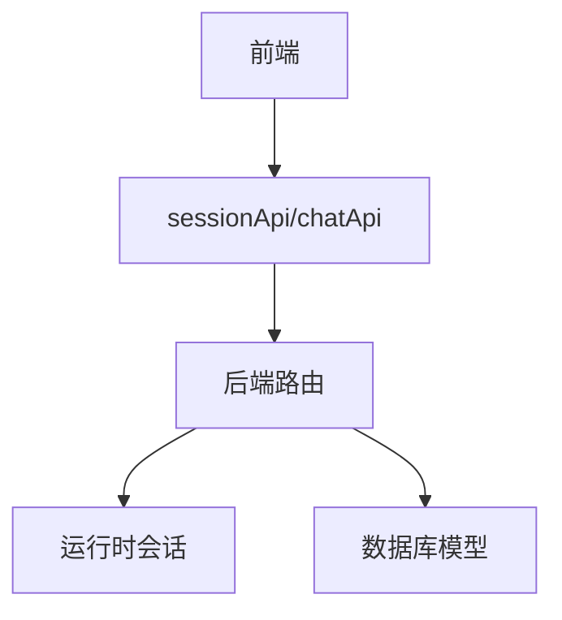

# 会话管理

<cite>
**本文引用的文件**
- [会话模型定义](file://src/copaw/db/models/session.py)
- [会话路由与聊天接口](file://src/copaw/app/routers/console.py)
- [消息发送接口](file://src/copaw/app/routers/messages.py)
- [前端会话列表页](file://console/src/pages/Control/Sessions/index.tsx)
- [前端会话列表列定义](file://console/src/pages/Control/Sessions/components/columns.tsx)
- [前端会话过滤栏](file://console/src/pages/Control/Sessions/components/FilterBar.tsx)
- [前端会话数据钩子](file://console/src/pages/Control/Sessions/useSessions.ts)
- [前端会话时间格式化常量](file://console/src/pages/Control/Sessions/components/constants.ts)
- [前端会话API封装](file://console/src/api/modules/chat.ts)
- [安全与会话管理文档](file://SECURITY.md)
- [工作区与会话持久化](file://src/copaw/app/runner/session.py)
- [企业版存储迁移与会话数据抽取](file://docs/enterprise-storage-migration.md)
- [上下文与会话缓存说明](file://website/public/docs/context.en.md)
- [会话与任务、技能、渠道关联](file://src/copaw/app/routers/console.py)
</cite>

## 目录
1. [简介](#简介)
2. [项目结构](#项目结构)
3. [核心组件](#核心组件)
4. [架构总览](#架构总览)
5. [详细组件分析](#详细组件分析)
6. [依赖分析](#依赖分析)
7. [性能考虑](#性能考虑)
8. [故障排查指南](#故障排查指南)
9. [结论](#结论)
10. [附录](#附录)

## 简介
本指南围绕会话管理系统进行全面讲解，涵盖会话概念、生命周期与状态转换、列表查看与筛选排序、详情查看（消息历史、代理交互记录、工具调用结果）、搜索与过滤、数据管理（导出、归档、清理）、安全配置（权限控制、访问限制、隐私保护）、高级功能（分析统计、性能监控、异常诊断）以及会话与任务、技能、渠道的关联关系。读者可据此高效使用与运维会话管理能力。

## 项目结构
会话管理由后端路由与数据库模型、前端列表与过滤、以及运行时会话持久化三部分组成：
- 后端：提供会话列表、详情、增删改、停止聊天、上传附件等接口；会话与消息通过统一的聊天路由接入。
- 数据层：会话模型与刷新令牌模型支撑会话鉴权与审计。
- 前端：会话列表页提供筛选、排序、批量删除、编辑等操作；通过API封装与后端交互。
- 运行时：会话状态以JSON文件形式安全落盘，跨平台兼容并异步I/O。

**图表来源**
- [会话模型定义:21-116](file://src/copaw/db/models/session.py#L21-L116)
- [会话路由与聊天接口:68-216](file://src/copaw/app/routers/console.py#L68-L216)
- [工作区与会话持久化:39-248](file://src/copaw/app/runner/session.py#L39-L248)
- [前端会话列表页:16-203](file://console/src/pages/Control/Sessions/index.tsx#L16-L203)

**章节来源**
- [会话模型定义:21-116](file://src/copaw/db/models/session.py#L21-L116)
- [会话路由与聊天接口:68-216](file://src/copaw/app/routers/console.py#L68-L216)
- [工作区与会话持久化:39-248](file://src/copaw/app/runner/session.py#L39-L248)
- [前端会话列表页:16-203](file://console/src/pages/Control/Sessions/index.tsx#L16-L203)

## 核心组件
- 会话模型（UserSession/RefreshToken）
  - 记录用户会话、访问令牌JTI、客户端信息、创建/过期/撤销时间等，支持与用户及刷新令牌关联。
- 会话路由（/console/chat、/console/chat/stop、/console/upload、/console/push-messages）
  - 统一聊天入口，支持流式响应、重连、停止、文件上传、推送消息拉取。
- 消息发送接口（/messages/send）
  - 支持代理主动向指定渠道/用户/会话发送消息。
- 前端会话列表（表格、过滤、排序、批量删除、编辑）
  - 提供按用户ID、渠道筛选，按创建/更新时间排序，支持抽屉式编辑与批量删除。
- 运行时会话（SafeJSONSession）
  - 将会话状态安全落盘，跨平台文件名清洗，异步读写，避免阻塞事件循环。

**章节来源**
- [会话模型定义:21-116](file://src/copaw/db/models/session.py#L21-L116)
- [会话路由与聊天接口:68-216](file://src/copaw/app/routers/console.py#L68-L216)
- [消息发送接口:78-187](file://src/copaw/app/routers/messages.py#L78-L187)
- [前端会话列表页:16-203](file://console/src/pages/Control/Sessions/index.tsx#L16-L203)
- [前端会话列表列定义:23-107](file://console/src/pages/Control/Sessions/components/columns.tsx#L23-L107)
- [前端会话过滤栏:13-48](file://console/src/pages/Control/Sessions/components/FilterBar.tsx#L13-L48)
- [前端会话数据钩子:9-98](file://console/src/pages/Control/Sessions/useSessions.ts#L9-L98)
- [前端会话时间格式化常量:13-32](file://console/src/pages/Control/Sessions/components/constants.ts#L13-L32)
- [前端会话API封装:99-136](file://console/src/api/modules/chat.ts#L99-L136)
- [工作区与会话持久化:39-248](file://src/copaw/app/runner/session.py#L39-L248)

## 架构总览
下图展示从前端到后端、再到运行时与文件系统的会话处理链路。

**图表来源**
- [前端会话列表页:16-203](file://console/src/pages/Control/Sessions/index.tsx#L16-L203)
- [前端会话API封装:99-136](file://console/src/api/modules/chat.ts#L99-L136)
- [会话路由与聊天接口:68-216](file://src/copaw/app/routers/console.py#L68-L216)
- [工作区与会话持久化:73-193](file://src/copaw/app/runner/session.py#L73-L193)

## 详细组件分析

### 会话模型与鉴权
- UserSession
  - 关键字段：user_id、access_token_jti、ip_address、user_agent、created_at、expires_at、revoked、revoked_at。
  - 关系：与User、RefreshToken双向关联，支持会话审计与撤销。
- RefreshToken
  - 关键字段：session_id、token_hash、created_at、expires_at、used、used_at。
  - 关系：与UserSession一对一，支持一次性使用与哈希存储。

**图表来源**
- [会话模型定义:21-116](file://src/copaw/db/models/session.py#L21-L116)

**章节来源**
- [会话模型定义:21-116](file://src/copaw/db/models/session.py#L21-L116)

### 会话生命周期与状态转换
- 生命周期阶段
  - 创建：首次发起聊天或通过API创建会话。
  - 进行中：有消息交互，状态随任务跟踪器更新。
  - 结束：停止聊天或会话超时。
  - 归档/清理：通过管理界面或后台任务进行归档与清理。
- 状态转换
  - 新建 → 运行中 → 已结束（可重连/恢复）。
  - 运行中 → 停止 → 可重新开始。
- 重连机制
  - 通过请求参数 reconnect=true 附加到现有流，保持会话连续性。

**图表来源**
- [会话路由与聊天接口:112-148](file://src/copaw/app/routers/console.py#L112-L148)

**章节来源**
- [会话路由与聊天接口:68-148](file://src/copaw/app/routers/console.py#L68-L148)

### 会话列表查看、筛选与排序
- 列表查看
  - 前端通过 sessionApi.listSessions 查询会话列表，支持 user_id、channel 参数过滤。
- 筛选
  - 支持按用户ID（模糊匹配）与渠道（下拉选择）筛选。
- 排序
  - 按创建时间与更新时间升/降序排序，时间解析统一为UTC比较。
- 批量操作
  - 多选行后支持批量删除，删除成功后刷新列表。

**图表来源**
- [前端会话列表页:40-70](file://console/src/pages/Control/Sessions/index.tsx#L40-L70)
- [前端会话列表列定义:68-79](file://console/src/pages/Control/Sessions/components/columns.tsx#L68-L79)
- [前端会话过滤栏:13-48](file://console/src/pages/Control/Sessions/components/FilterBar.tsx#L13-L48)
- [前端会话API封装:100-105](file://console/src/api/modules/chat.ts#L100-L105)

**章节来源**
- [前端会话列表页:40-70](file://console/src/pages/Control/Sessions/index.tsx#L40-L70)
- [前端会话列表列定义:23-107](file://console/src/pages/Control/Sessions/components/columns.tsx#L23-L107)
- [前端会话过滤栏:13-48](file://console/src/pages/Control/Sessions/components/FilterBar.tsx#L13-L48)
- [前端会话API封装:99-136](file://console/src/api/modules/chat.ts#L99-L136)

### 会话详情查看（消息历史、代理交互、工具调用）
- 消息历史
  - 通过 sessionApi.getSession 获取会话详情（含完整消息历史），前端在聊天页面中渲染。
- 代理交互记录
  - 聊天接口统一走 /console/chat，后端根据会话ID解析并复用会话，支持流式输出与重连。
- 工具调用结果
  - 工具调用结果可能落盘为文件（如 tool_result），并通过文件预览URL访问。

**图表来源**
- [前端会话API封装:108-114](file://console/src/api/modules/chat.ts#L108-L114)
- [会话路由与聊天接口:75-148](file://src/copaw/app/routers/console.py#L75-L148)
- [工作区与会话持久化:97-193](file://src/copaw/app/runner/session.py#L97-L193)

**章节来源**
- [前端会话API封装:99-136](file://console/src/api/modules/chat.ts#L99-L136)
- [会话路由与聊天接口:68-148](file://src/copaw/app/routers/console.py#L68-L148)
- [工作区与会话持久化:73-193](file://src/copaw/app/runner/session.py#L73-L193)

### 会话搜索与过滤（按时间、代理、状态等）
- 时间过滤
  - 列表页按创建/更新时间排序，前端统一将时间规范化为UTC比较。
- 用户与渠道过滤
  - 通过用户ID（模糊）与渠道（下拉）过滤，渠道类型来自后端动态加载。
- 代理与状态
  - 当前列表页未直接暴露“代理/状态”列，但可通过消息历史与任务追踪器了解代理与状态变化。

**章节来源**
- [前端会话列表列定义:68-79](file://console/src/pages/Control/Sessions/components/columns.tsx#L68-L79)
- [前端会话过滤栏:13-48](file://console/src/pages/Control/Sessions/components/FilterBar.tsx#L13-L48)
- [前端会话时间格式化常量:13-32](file://console/src/pages/Control/Sessions/components/constants.ts#L13-L32)

### 会话导出、归档、清理
- 导出
  - 可通过工作区API将整个工作目录打包下载，便于整体备份与迁移。
- 归档
  - 企业版支持将对象存储中的文件（如 chats.json、agent.json 等）抽取到结构化表，便于长期归档与检索。
- 清理
  - 工具调用结果等大体量中间产物可按策略清理；运行时会话状态文件按需加载/保存。

**图表来源**
- [会话路由与聊天接口:68-148](file://src/copaw/app/routers/console.py#L68-L148)
- [企业版存储迁移与会话数据抽取:1232-1322](file://docs/enterprise-storage-migration.md#L1232-L1322)

**章节来源**
- [会话路由与聊天接口:68-148](file://src/copaw/app/routers/console.py#L68-L148)
- [企业版存储迁移与会话数据抽取:1232-1322](file://docs/enterprise-storage-migration.md#L1232-L1322)

### 会话权限控制、访问限制、隐私保护
- 会话与用户绑定
  - UserSession 明确绑定 user_id，确保会话范围可控。
- 会话撤销与过期
  - 支持撤销标志与过期时间，结合刷新令牌哈希与一次性使用特性提升安全性。
- 安全建议
  - 单实例多用户共享不推荐；建议按信任边界隔离（OS用户/主机/容器）。
  - 密码重置或签名密钥轮换会失效所有会话，需重新登录。

**章节来源**
- [会话模型定义:21-116](file://src/copaw/db/models/session.py#L21-L116)
- [安全与会话管理文档:99-118](file://SECURITY.md#L99-L118)

### 高级功能：分析统计、性能监控、异常诊断
- 分析统计
  - 企业版可将会话与消息抽取到结构化表，支持按日期/模型维度统计。
- 性能监控
  - 控制台提供推送消息接口，可用于实时告警与状态提示。
- 异常诊断
  - 聊天接口支持流式错误回传；停止接口用于中断长时间运行的任务。

**章节来源**
- [会话路由与聊天接口:150-216](file://src/copaw/app/routers/console.py#L150-L216)
- [企业版存储迁移与会话数据抽取:1232-1322](file://docs/enterprise-storage-migration.md#L1232-L1322)

### 会话与任务、技能、渠道的关联
- 会话与渠道
  - 会话详情包含 channel 字段，不同渠道（console、dingtalk、feishu 等）对应不同消息通道。
- 会话与任务
  - 会话通过任务追踪器管理生命周期，支持停止与重连。
- 会话与技能
  - 技能池与会话交互通过代理与工具调用实现，消息历史体现技能调用痕迹。

**章节来源**
- [会话路由与聊天接口:68-148](file://src/copaw/app/routers/console.py#L68-L148)
- [消息发送接口:78-187](file://src/copaw/app/routers/messages.py#L78-L187)

## 依赖分析
- 前端到后端
  - 会话列表与详情依赖 sessionApi；聊天与上传依赖 chatApi；消息发送依赖 messages 路由。
- 后端到运行时
  - 聊天接口通过工作区获取通道与聊天管理器，运行时会话负责状态持久化。
- 数据层
  - UserSession/RefreshToken 提供会话与鉴权基础。

**图表来源**
- [前端会话API封装:99-136](file://console/src/api/modules/chat.ts#L99-L136)
- [会话路由与聊天接口:68-216](file://src/copaw/app/routers/console.py#L68-L216)
- [工作区与会话持久化:39-248](file://src/copaw/app/runner/session.py#L39-L248)
- [会话模型定义:21-116](file://src/copaw/db/models/session.py#L21-L116)

**章节来源**
- [前端会话API封装:99-136](file://console/src/api/modules/chat.ts#L99-L136)
- [会话路由与聊天接口:68-216](file://src/copaw/app/routers/console.py#L68-L216)
- [工作区与会话持久化:39-248](file://src/copaw/app/runner/session.py#L39-L248)
- [会话模型定义:21-116](file://src/copaw/db/models/session.py#L21-L116)

## 性能考虑
- 异步I/O
  - 运行时会话采用异步文件读写，避免阻塞事件循环。
- 文件名安全
  - 跨平台文件名清洗，避免非法字符导致的I/O失败。
- 流式响应
  - 聊天接口采用SSE流式输出，降低延迟并支持断线重连。
- 缓存与索引
  - 企业版抽取到结构化表，便于快速检索与统计。

**章节来源**
- [工作区与会话持久化:73-193](file://src/copaw/app/runner/session.py#L73-L193)
- [会话路由与聊天接口:127-148](file://src/copaw/app/routers/console.py#L127-L148)
- [企业版存储迁移与会话数据抽取:1232-1322](file://docs/enterprise-storage-migration.md#L1232-L1322)

## 故障排查指南
- 无法加载会话列表
  - 检查 sessionApi.listSessions 的网络请求与鉴权头；确认后端路由可用。
- 聊天无响应或中断
  - 使用停止接口中断任务；检查流式响应是否被提前关闭；尝试重连。
- 文件上传失败
  - 确认文件大小不超过限制；检查媒体目录权限与磁盘空间。
- 会话状态异常
  - 检查运行时会话文件是否存在与可读；必要时清理后重试。
- 安全问题
  - 密码重置或签名密钥轮换会导致会话失效，需重新登录。

**章节来源**
- [前端会话API封装:99-136](file://console/src/api/modules/chat.ts#L99-L136)
- [会话路由与聊天接口:150-216](file://src/copaw/app/routers/console.py#L150-L216)
- [工作区与会话持久化:97-193](file://src/copaw/app/runner/session.py#L97-L193)
- [安全与会话管理文档:99-118](file://SECURITY.md#L99-L118)

## 结论
本指南从概念、架构、组件到高级功能全面阐述了会话管理系统的使用方法与运维要点。通过前后端协同、运行时持久化与企业版抽取能力，系统实现了会话的全生命周期管理与安全可控。建议在多用户共享场景中遵循安全建议，合理划分信任边界，并利用企业版能力进行归档与统计分析。

## 附录
- 上下文与会话缓存
  - 历史消息与工具结果可落盘为文件，便于离线检索与清理。
- 会话与渠道
  - 不同渠道的消息与会话ID相互独立，需按渠道维度进行管理与检索。

**章节来源**
- [上下文与会话缓存说明:57-78](file://website/public/docs/context.en.md#L57-L78)
- [会话路由与聊天接口:68-148](file://src/copaw/app/routers/console.py#L68-L148)