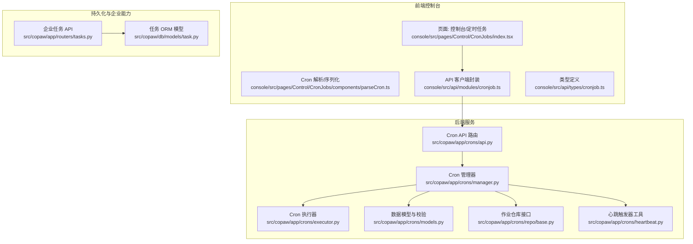
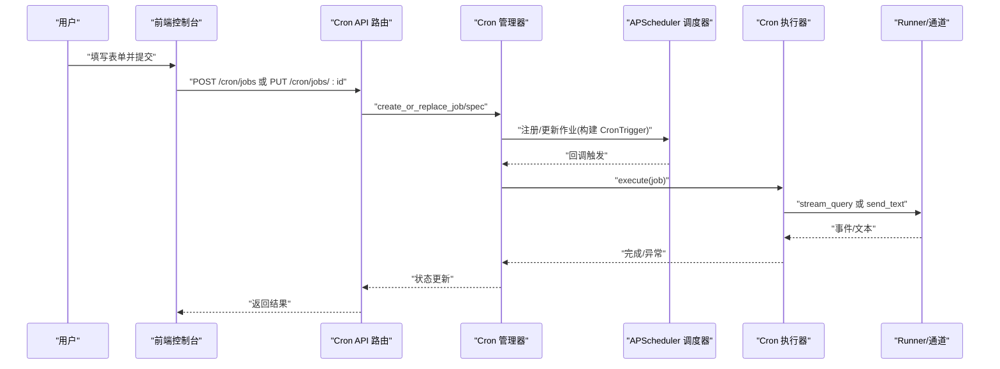
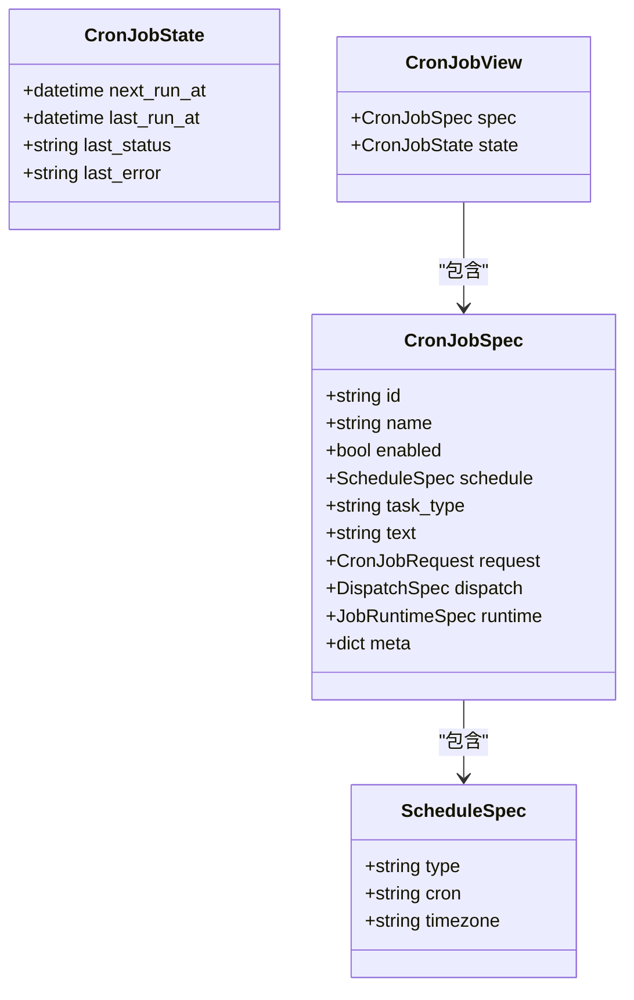
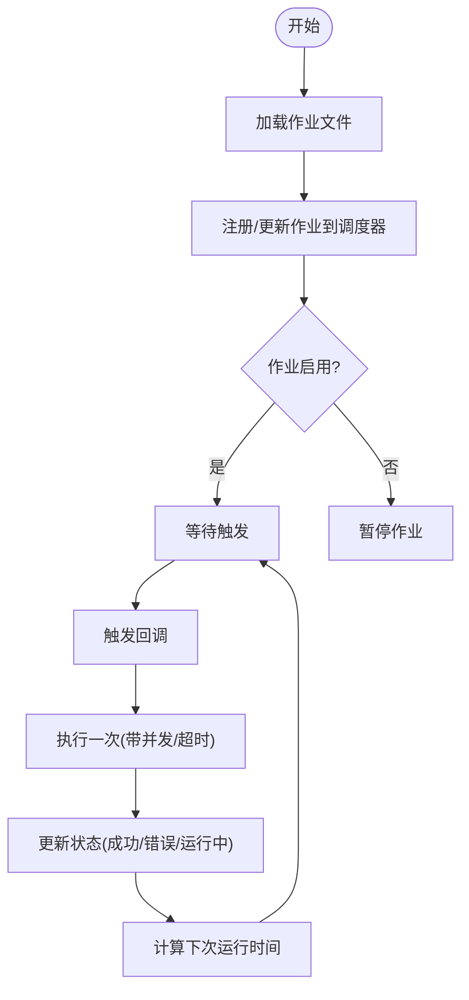
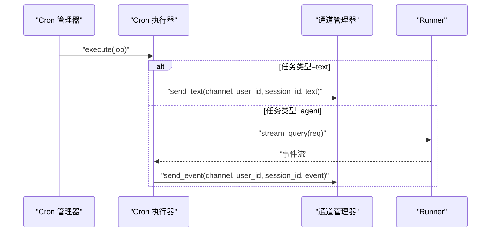
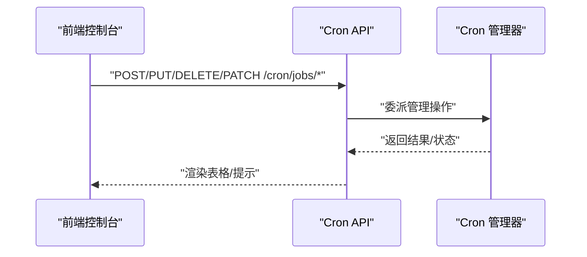
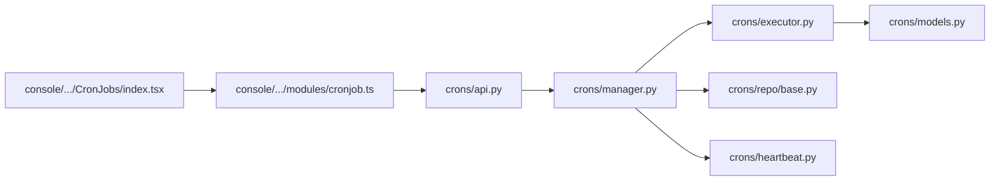

# 定时任务

<cite>
**本文引用的文件**
- [src\copaw\app\crons\models.py](file://src\copaw\app\crons\models.py)
- [src\copaw\app\crons\manager.py](file://src\copaw\app\crons\manager.py)
- [src\copaw\app\crons\executor.py](file://src\copaw\app\crons\executor.py)
- [src\copaw\app\crons\api.py](file://src\copaw\app\crons\api.py)
- [src\copaw\app\crons\repo\base.py](file://src\copaw\app\crons\repo\base.py)
- [src\copaw\app\crons\heartbeat.py](file://src\copaw\app\crons\heartbeat.py)
- [src\copaw\app\routers\tasks.py](file://src\copaw\app\routers\tasks.py)
- [src\copaw\db\models\task.py](file://src\copaw\db\models\task.py)
- [console\src\pages\Control\CronJobs\index.tsx](file://console\src\pages\Control\CronJobs\index.tsx)
- [console\src\pages\Control\CronJobs\components\parseCron.ts](file://console\src\pages\Control\CronJobs\components\parseCron.ts)
- [console\src\api\modules\cronjob.ts](file://console\src\api\modules\cronjob.ts)
- [console\src\api\types\cronjob.ts](file://console\src\api\types\cronjob.ts)
- [deploy\monitoring\grafana_dashboard.json](file://deploy\monitoring\grafana_dashboard.json)
</cite>

## 目录
1. [简介](#简介)
2. [项目结构](#项目结构)
3. [核心组件](#核心组件)
4. [架构总览](#架构总览)
5. [详细组件分析](#详细组件分析)
6. [依赖关系分析](#依赖关系分析)
7. [性能与并发特性](#性能与并发特性)
8. [运维与监控](#运维与监控)
9. [故障排查指南](#故障排查指南)
10. [结论](#结论)
11. [附录：Cron 语法与模板](#附录cron-语法与模板)

## 简介
本指南面向使用者与运维人员，系统讲解定时任务系统的配置、运行与维护方法。内容涵盖：
- Cron 表达式语法与常用调度模式（分钟、小时、日、月、周）
- 任务创建流程（表单字段、时间选择器、输入参数）
- 任务生命周期（启用/禁用、立即执行、删除）
- 高级操作（编辑、复制、导出）
- 任务监控与历史记录、错误日志
- 权限控制、并发执行限制、资源消耗监控
- 企业级特性与最佳实践

## 项目结构
定时任务系统由后端服务、前端控制台与持久化层组成，前后端通过 REST API 交互。

图表来源
- [src\copaw\app\crons\api.py:1-117](file://src\copaw\app\crons\api.py#L1-L117)
- [src\copaw\app\crons\manager.py:1-388](file://src\copaw\app\crons\manager.py#L1-L388)
- [src\copaw\app\crons\executor.py:1-90](file://src\copaw\app\crons\executor.py#L1-L90)
- [src\copaw\app\crons\models.py:1-180](file://src\copaw\app\crons\models.py#L1-L180)
- [src\copaw\app\crons\repo\base.py:1-54](file://src\copaw\app\crons\repo\base.py#L1-L54)
- [src\copaw\app\crons\heartbeat.py](file://src\copaw\app\crons\heartbeat.py)
- [src\copaw\app\routers\tasks.py:1-252](file://src\copaw\app\routers\tasks.py#L1-L252)
- [src\copaw\db\models\task.py:1-151](file://src\copaw\db\models\task.py#L1-L151)
- [console\src\pages\Control\CronJobs\index.tsx:1-238](file://console\src\pages\Control\CronJobs\index.tsx#L1-L238)
- [console\src\pages\Control\CronJobs\components\parseCron.ts:1-259](file://console\src\pages\Control\CronJobs\components\parseCron.ts#L1-L259)
- [console\src\api\modules\cronjob.ts:1-54](file://console\src\api\modules\cronjob.ts#L1-L54)
- [console\src\api\types\cronjob.ts:1-58](file://console\src\api\types\cronjob.ts#L1-L58)

章节来源
- [src\copaw\app\crons\api.py:1-117](file://src\copaw\app\crons\api.py#L1-L117)
- [src\copaw\app\crons\manager.py:1-388](file://src\copaw\app\crons\manager.py#L1-L388)
- [console\src\pages\Control\CronJobs\index.tsx:1-238](file://console\src\pages\Control\CronJobs\index.tsx#L1-L238)

## 核心组件
- 数据模型与校验
  - 任务规范、调度规范、分发规范、运行时配置、视图状态等模型定义与字段约束。
  - 支持 5 字段 Cron（不含秒），并兼容 4/3 字段简写自动归一化。
- Cron 管理器
  - 调度器启动/停止、作业注册/更新、暂停/恢复、立即执行、状态跟踪。
  - 并发信号量、超时与错失触发宽限配置。
- Cron 执行器
  - 文本任务直接发送；智能体任务通过 Runner 流式查询并按通道回传。
- API 路由
  - 提供作业列表、创建、替换、删除、暂停/恢复、立即执行、状态查询等接口。
- 前端控制台
  - 可视化 Cron 表达式解析/序列化、表单字段、时间选择器、立即执行确认、删除确认。
- 企业任务能力
  - 与企业任务系统解耦，支持在任务流中复用或联动。

章节来源
- [src\copaw\app\crons\models.py:59-180](file://src\copaw\app\crons\models.py#L59-L180)
- [src\copaw\app\crons\manager.py:38-388](file://src\copaw\app\crons\manager.py#L38-L388)
- [src\copaw\app\crons\executor.py:13-90](file://src\copaw\app\crons\executor.py#L13-L90)
- [src\copaw\app\crons\api.py:28-117](file://src\copaw\app\crons\api.py#L28-L117)
- [console\src\pages\Control\CronJobs\index.tsx:19-238](file://console\src\pages\Control\CronJobs\index.tsx#L19-L238)
- [src\copaw\app\routers\tasks.py:72-252](file://src\copaw\app\routers\tasks.py#L72-L252)

## 架构总览
定时任务从“前端表单”到“后端调度器”的完整链路如下：

图表来源
- [src\copaw\app\crons\api.py:28-117](file://src\copaw\app\crons\api.py#L28-L117)
- [src\copaw\app\crons\manager.py:242-388](file://src\copaw\app\crons\manager.py#L242-L388)
- [src\copaw\app\crons\executor.py:18-90](file://src\copaw\app\crons\executor.py#L18-L90)

## 详细组件分析

### 数据模型与 Cron 规范
- Cron 规范
  - 仅支持 5 字段表达式（分钟、小时、日、月、周），不支持秒字段。
  - 自动将 crontab 数字形式的周几转换为英文缩写，保证与 APScheduler v3 的 ISO 周序一致。
- 任务类型
  - 文本任务：直接向指定通道发送固定文本。
  - 智能体任务：以请求上下文在目标会话中发起流式查询，并将事件逐条回传至通道。
- 运行时配置
  - 最大并发、超时秒数、错失触发宽限（秒）。
- 分发与目标
  - 指定通道、目标用户与会话，支持流式/最终模式。

图表来源
- [src\copaw\app\crons\models.py:59-180](file://src\copaw\app\crons\models.py#L59-L180)

章节来源
- [src\copaw\app\crons\models.py:59-180](file://src\copaw\app\crons\models.py#L59-L180)

### Cron 管理器与调度
- 启动/停止
  - 加载作业文件并注册到调度器；启动心跳作业（若配置启用）。
- 注册/更新
  - 构建 CronTrigger，设置错失触发宽限；根据 enabled 状态决定是否暂停。
- 立即执行
  - 创建后台任务异步执行，异常通过控制台推送展示。
- 并发与超时
  - 每作业独立信号量控制并发；执行器内设置超时；异常捕获并记录状态。

图表来源
- [src\copaw\app\crons\manager.py:63-118](file://src\copaw\app\crons\manager.py#L63-L118)
- [src\copaw\app\crons\manager.py:242-388](file://src\copaw\app\crons\manager.py#L242-L388)

章节来源
- [src\copaw\app\crons\manager.py:38-388](file://src\copaw\app\crons\manager.py#L38-L388)

### Cron 执行器
- 文本任务：直接通过通道管理器发送文本消息。
- 智能体任务：将请求转为 Runner 的流式查询，逐事件发送至通道；支持超时控制与取消。

图表来源
- [src\copaw\app\crons\executor.py:18-90](file://src\copaw\app\crons\executor.py#L18-L90)

章节来源
- [src\copaw\app\crons\executor.py:13-90](file://src\copaw\app\crons\executor.py#L13-L90)

### API 路由与前端交互
- 后端 API
  - 列表、创建、替换、删除、暂停/恢复、立即执行、状态查询。
- 前端控制台
  - 表单字段映射、Cron 表达式解析/序列化、立即执行与删除确认、时区默认值读取。

图表来源
- [src\copaw\app\crons\api.py:28-117](file://src\copaw\app\crons\api.py#L28-L117)
- [console\src\api\modules\cronjob.ts:8-54](file://console\src\api\modules\cronjob.ts#L8-L54)
- [console\src\pages\Control\CronJobs\index.tsx:19-238](file://console\src\pages\Control\CronJobs\index.tsx#L19-L238)

章节来源
- [src\copaw\app\crons\api.py:28-117](file://src\copaw\app\crons\api.py#L28-L117)
- [console\src\api\modules\cronjob.ts:1-54](file://console\src\api\modules\cronjob.ts#L1-L54)
- [console\src\pages\Control\CronJobs\index.tsx:19-238](file://console\src\pages\Control\CronJobs\index.tsx#L19-L238)

## 依赖关系分析
- 组件耦合
  - Cron 管理器依赖调度器、执行器、仓库接口与心跳工具；执行器依赖 Runner 与通道管理器。
- 外部依赖
  - APScheduler v3 CronTrigger；FastAPI 路由；前端基于 Ant Design 与自定义解析器。
- 可能的循环依赖
  - 当前模块间为单向依赖，未见循环。

图表来源
- [src\copaw\app\crons\api.py:1-117](file://src\copaw\app\crons\api.py#L1-L117)
- [src\copaw\app\crons\manager.py:1-388](file://src\copaw\app\crons\manager.py#L1-L388)
- [src\copaw\app\crons\executor.py:1-90](file://src\copaw\app\crons\executor.py#L1-L90)
- [src\copaw\app\crons\repo\base.py:1-54](file://src\copaw\app\crons\repo\base.py#L1-L54)
- [src\copaw\app\crons\models.py:1-180](file://src\copaw\app\crons\models.py#L1-L180)
- [console\src\pages\Control\CronJobs\index.tsx:1-238](file://console\src\pages\Control\CronJobs\index.tsx#L1-L238)
- [console\src\api\modules\cronjob.ts:1-54](file://console\src\api\modules\cronjob.ts#L1-L54)

章节来源
- [src\copaw\app\crons\manager.py:1-388](file://src\copaw\app\crons\manager.py#L1-L388)
- [src\copaw\app\crons\executor.py:1-90](file://src\copaw\app\crons\executor.py#L1-L90)
- [src\copaw\app\crons\api.py:1-117](file://src\copaw\app\crons\api.py#L1-L117)

## 性能与并发特性
- 并发控制
  - 每个作业拥有独立的并发信号量，避免过度占用资源。
- 超时与错失触发
  - 执行器内设置超时；调度器支持错失触发宽限，防止任务在延迟期间被重复触发。
- 心跳与可观测性
  - 可选的心跳作业用于上报运行状态；前端可查看状态与下次运行时间。

章节来源
- [src\copaw\app\crons\models.py:104-108](file://src\copaw\app\crons\models.py#L104-L108)
- [src\copaw\app\crons\manager.py:242-388](file://src\copaw\app\crons\manager.py#L242-L388)
- [src\copaw\app\crons\heartbeat.py](file://src\copaw\app\crons\heartbeat.py)

## 运维与监控
- 任务监控面板
  - 前端表格展示任务名称、启用状态、下次/上次运行时间、最近状态与错误。
- 执行历史与错误日志
  - 管理器记录最近状态与错误；执行器异常通过控制台推送展示。
- 企业级特性
  - 企业任务 API 与 ORM 模型可用于任务编排与审计，便于与定时任务联动。
- 监控仪表盘
  - 提供 Grafana 仪表盘模板，建议结合应用指标进行可视化。

章节来源
- [console\src\pages\Control\CronJobs\index.tsx:19-238](file://console\src\pages\Control\CronJobs\index.tsx#L19-L238)
- [src\copaw\app\crons\manager.py:217-239](file://src\copaw\app\crons\manager.py#L217-L239)
- [src\copaw\app\routers\tasks.py:72-252](file://src\copaw\app\routers\tasks.py#L72-L252)
- [src\copaw\db\models\task.py:23-151](file://src\copaw\db\models\task.py#L23-L151)
- [deploy\monitoring\grafana_dashboard.json](file://deploy\monitoring\grafana_dashboard.json)

## 故障排查指南
- 常见问题
  - Cron 表达式无效：检查是否为 5 字段且符合规范；必要时使用前端解析器辅助生成。
  - 任务未运行：确认作业已启用；检查调度器是否启动；查看状态与下次运行时间。
  - 立即执行失败：查看控制台推送的错误信息；检查 Runner/通道可用性。
  - 并发过高：调整作业的并发上限与超时配置。
- 排查步骤
  - 在前端控制台查看任务状态与错误。
  - 通过 API 获取任务状态详情。
  - 检查后端日志中的警告与异常堆栈。

章节来源
- [src\copaw\app\crons\api.py:108-117](file://src\copaw\app\crons\api.py#L108-L117)
- [src\copaw\app\crons\manager.py:217-239](file://src\copaw\app\crons\manager.py#L217-L239)

## 结论
定时任务系统以清晰的数据模型、稳定的调度器与可扩展的执行器为核心，配合前端可视化表单与状态面板，实现了从配置到执行、从监控到排障的全链路闭环。通过合理的并发与超时配置，以及企业级任务与审计能力的结合，可满足生产环境的可靠性与合规性要求。

## 附录：Cron 语法与模板

### Cron 语法要点
- 字段顺序：分钟 小时 日 月 周（共 5 字段，不支持秒）
- 周几别名：使用英文缩写（如 mon、tue 等），系统会自动规范化
- 支持的表达式示例（概念性说明）
  - 每小时：0 * * * *
  - 每日固定时间：0 9 * * *（例如每天 09:00）
  - 每周一/三/五：0 9 * * 1,3,5 或 0 9 * * mon,wed,fri
  - 每月固定日：0 0 1 * *（每月 1 日 00:00）

章节来源
- [src\copaw\app\crons\models.py:64-88](file://src\copaw\app\crons\models.py#L64-L88)
- [console\src\pages\Control\CronJobs\components\parseCron.ts:55-102](file://console\src\pages\Control\CronJobs\components\parseCron.ts#L55-L102)

### 常见业务场景模板
- 每日运营报告
  - 时间：每日 09:00
  - 类型：文本/智能体（按需）
  - 通道：指定渠道
- 每周一早会提醒
  - 时间：每周一 09:00
  - 类型：文本
  - 通道：群组频道
- 每月账单汇总
  - 时间：每月 1 日 00:00
  - 类型：智能体（流式查询并汇总）
  - 通道：负责人会话

章节来源
- [console\src\pages\Control\CronJobs\components\parseCron.ts:124-148](file://console\src\pages\Control\CronJobs\components\parseCron.ts#L124-L148)