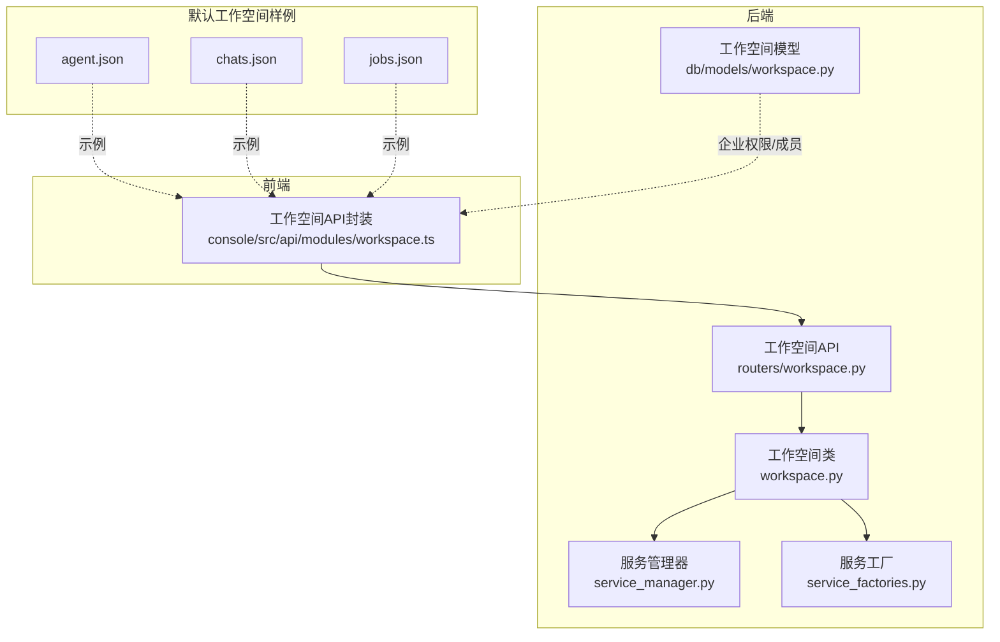
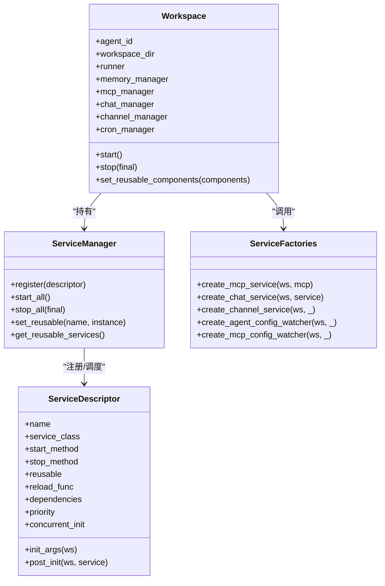
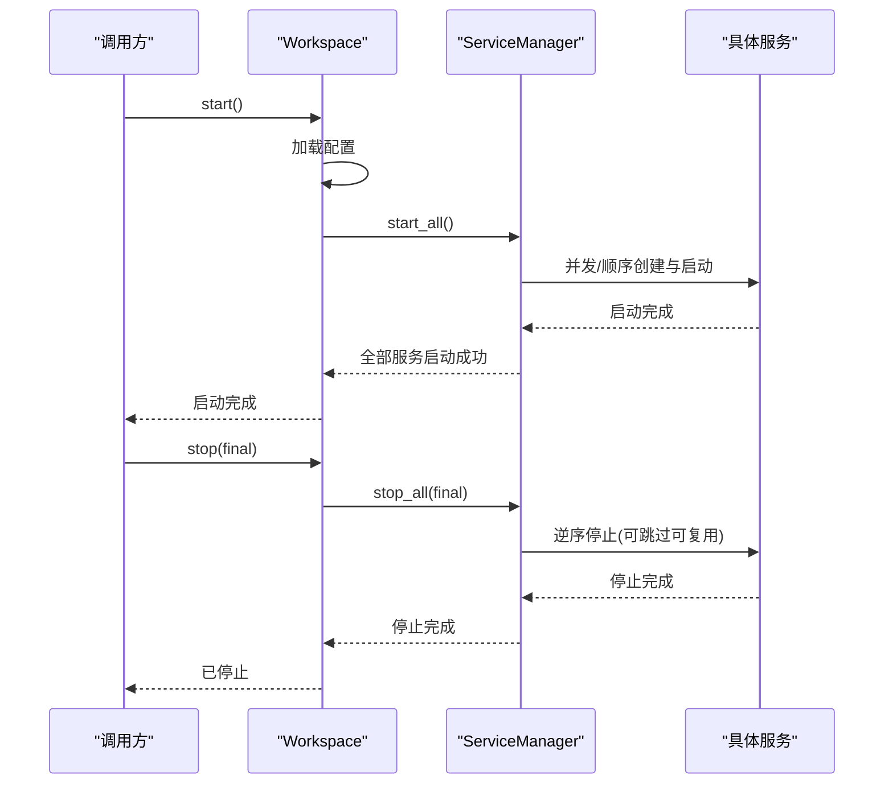
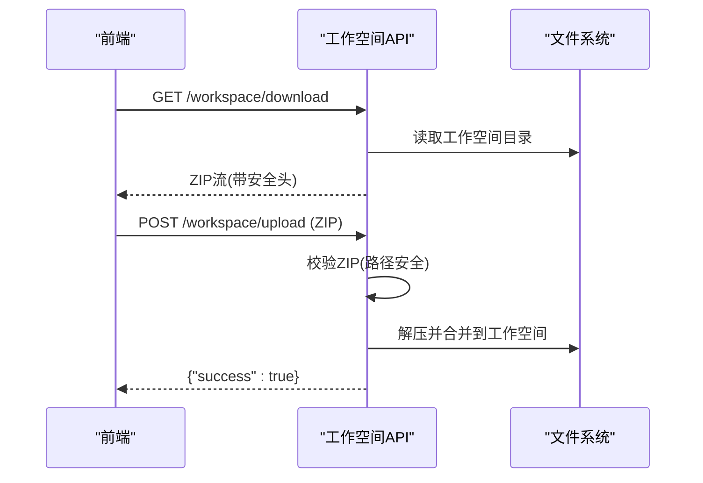
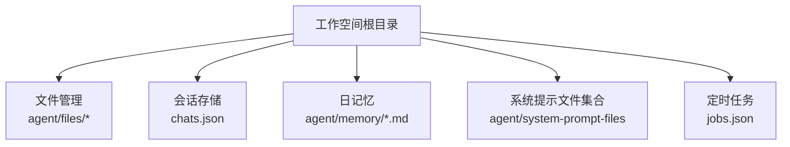
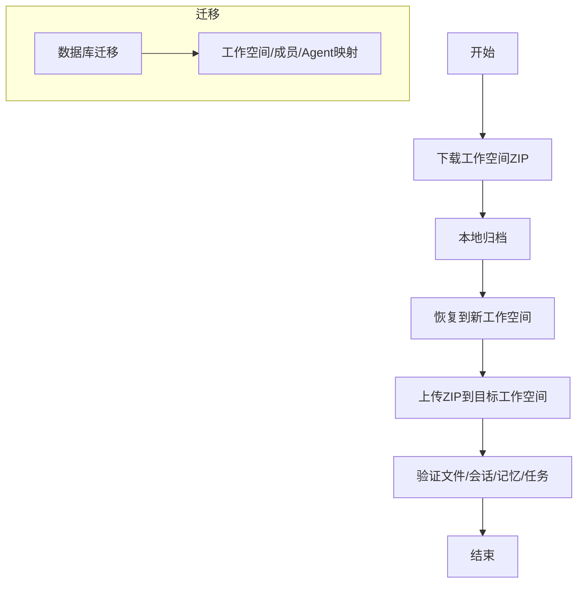
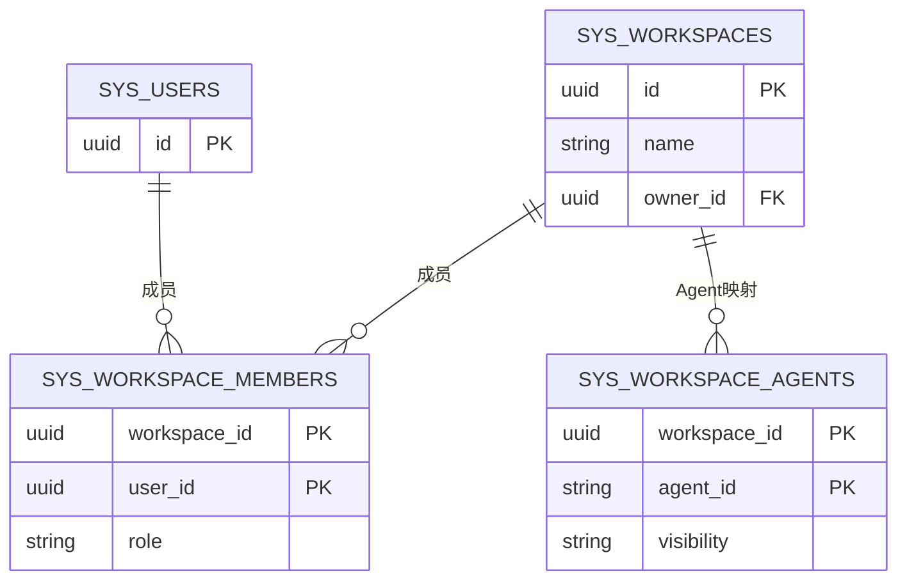
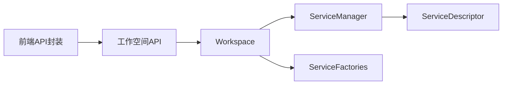

# 工作空间管理

<cite>
**本文引用的文件**
- [工作空间类定义](file://src/copaw/app/workspace/workspace.py)
- [服务管理器](file://src/copaw/app/workspace/service_manager.py)
- [服务工厂函数](file://src/copaw/app/workspace/service_factories.py)
- [工作空间数据库模型](file://src/copaw/db/models/workspace.py)
- [工作空间下载上传API](file://src/copaw/app/routers/workspace.py)
- [前端工作空间API封装](file://console/src/api/modules/workspace.ts)
- [默认工作空间配置示例](file://working/workspaces/default/agent.json)
- [默认工作空间会话示例](file://working/workspaces/default/chats.json)
- [默认工作空间定时任务示例](file://working/workspaces/default/jobs.json)
- [RBAC服务（企业权限）](file://src/copaw/enterprise/rbac_service.py)
- [企业存储访问控制](file://docs/enterprise-storage-migration.md)
- [数据库初始模式（工作空间表）](file://alembic/versions/001_initial_schema.py)
</cite>

## 目录
1. [简介](#简介)
2. [项目结构](#项目结构)
3. [核心组件](#核心组件)
4. [架构总览](#架构总览)
5. [详细组件分析](#详细组件分析)
6. [依赖关系分析](#依赖关系分析)
7. [性能与存储优化](#性能与存储优化)
8. [故障排查指南](#故障排查指南)
9. [结论](#结论)
10. [附录](#附录)

## 简介
本指南面向使用者与运维人员，系统讲解 Copaw 的“工作空间”概念、组成与管理方法。工作空间是独立的智能体运行环境，包含运行器、通道管理、记忆体、MCP 客户端、定时任务等完整子系统。文档覆盖以下主题：
- 工作空间的概念与作用
- 创建、复制、删除、切换工作空间
- 文件管理、会话存储、内存数据、技能配置
- 备份、恢复、迁移的数据保护
- 多工作空间并行使用与最佳实践
- 权限控制、共享设置、访问限制
- 性能优化与存储管理

## 项目结构
围绕工作空间的关键代码与数据位置如下：
- 后端核心：工作空间类、服务管理器、服务工厂、工作空间API
- 数据库模型：工作空间、成员、Agent 映射
- 前端：工作空间文件与日记忆管理接口
- 默认工作空间样例：agent.json、chats.json、jobs.json
- 企业权限与存储访问控制

**图表来源**
- [工作空间类定义:50-392](file://src/copaw/app/workspace/workspace.py#L50-L392)
- [服务管理器:74-421](file://src/copaw/app/workspace/service_manager.py#L74-L421)
- [服务工厂函数:18-171](file://src/copaw/app/workspace/service_factories.py#L18-L171)
- [工作空间下载上传API:18-203](file://src/copaw/app/routers/workspace.py#L18-L203)
- [工作空间数据库模型:20-112](file://src/copaw/db/models/workspace.py#L20-L112)
- [前端工作空间API封装:39-149](file://console/src/api/modules/workspace.ts#L39-L149)
- [默认工作空间配置示例:1-456](file://working/workspaces/default/agent.json#L1-L456)
- [默认工作空间会话示例:1-4](file://working/workspaces/default/chats.json#L1-L4)
- [默认工作空间定时任务示例:1-4](file://working/workspaces/default/jobs.json#L1-L4)

**章节来源**
- [工作空间类定义:1-392](file://src/copaw/app/workspace/workspace.py#L1-L392)
- [服务管理器:1-421](file://src/copaw/app/workspace/service_manager.py#L1-L421)
- [服务工厂函数:1-171](file://src/copaw/app/workspace/service_factories.py#L1-L171)
- [工作空间下载上传API:1-203](file://src/copaw/app/routers/workspace.py#L1-L203)
- [工作空间数据库模型:1-112](file://src/copaw/db/models/workspace.py#L1-L112)
- [前端工作空间API封装:1-149](file://console/src/api/modules/workspace.ts#L1-L149)
- [默认工作空间配置示例:1-456](file://working/workspaces/default/agent.json#L1-L456)
- [默认工作空间会话示例:1-4](file://working/workspaces/default/chats.json#L1-L4)
- [默认工作空间定时任务示例:1-4](file://working/workspaces/default/jobs.json#L1-L4)

## 核心组件
- 工作空间类：封装独立运行时，统一管理 Runner、ChannelManager、MemoryManager、MCPClientManager、CronManager 等组件。
- 服务管理器：声明式注册、生命周期编排、并发启动/停止、可复用组件重载。
- 服务工厂：按配置创建并注入 ChatManager、ChannelManager、MCP 等服务。
- 工作空间API：提供打包下载与解包合并的下载/上传能力，保障路径安全。
- 数据库模型：工作空间、成员、Agent 映射，支撑企业级权限与归属。
- 前端API封装：文件列表/读写、日记忆读写、系统提示文件集合管理。

**章节来源**
- [工作空间类定义:50-392](file://src/copaw/app/workspace/workspace.py#L50-L392)
- [服务管理器:74-421](file://src/copaw/app/workspace/service_manager.py#L74-L421)
- [服务工厂函数:18-171](file://src/copaw/app/workspace/service_factories.py#L18-L171)
- [工作空间下载上传API:112-203](file://src/copaw/app/routers/workspace.py#L112-L203)
- [工作空间数据库模型:20-112](file://src/copaw/db/models/workspace.py#L20-L112)
- [前端工作空间API封装:39-149](file://console/src/api/modules/workspace.ts#L39-L149)

## 架构总览
工作空间以“服务化”为核心，通过 ServiceDescriptor 描述组件的初始化参数、后置钩子、启动/停止方法、优先级与并发策略，由 ServiceManager 统一调度。Workspace 负责装配这些服务，并在启动/停止时进行一致性处理。

**图表来源**
- [工作空间类定义:50-392](file://src/copaw/app/workspace/workspace.py#L50-L392)
- [服务管理器:74-421](file://src/copaw/app/workspace/service_manager.py#L74-L421)
- [服务工厂函数:18-171](file://src/copaw/app/workspace/service_factories.py#L18-L171)

**章节来源**
- [工作空间类定义:134-392](file://src/copaw/app/workspace/workspace.py#L134-L392)
- [服务管理器:171-421](file://src/copaw/app/workspace/service_manager.py#L171-L421)
- [服务工厂函数:18-171](file://src/copaw/app/workspace/service_factories.py#L18-L171)

## 详细组件分析

### 工作空间生命周期与服务编排
- 初始化：创建工作目录、注册服务描述符、建立服务映射。
- 启动：加载配置、按优先级并发/顺序启动服务；支持可复用组件重用。
- 停止：按逆优先级停止，可选择是否停止可复用组件。
- 可复用组件：在热重载场景中保留内存/聊天等组件实例，避免重建。

**图表来源**
- [工作空间类定义:325-383](file://src/copaw/app/workspace/workspace.py#L325-L383)
- [服务管理器:171-421](file://src/copaw/app/workspace/service_manager.py#L171-L421)

**章节来源**
- [工作空间类定义:325-383](file://src/copaw/app/workspace/workspace.py#L325-L383)
- [服务管理器:171-421](file://src/copaw/app/workspace/service_manager.py#L171-L421)

### 工作空间API：下载与上传
- 下载：将整个工作空间目录打包为 ZIP 流式返回，文件名包含 agent_id 与时间戳。
- 上传：校验 ZIP 安全性（防路径穿越），解压并合并到工作空间目录，不清理非压缩内容。
- 前端封装：提供文件列表、读写、日记忆读写、系统提示文件集合管理等接口。

**图表来源**
- [工作空间下载上传API:112-203](file://src/copaw/app/routers/workspace.py#L112-L203)
- [前端工作空间API封装:61-149](file://console/src/api/modules/workspace.ts#L61-L149)

**章节来源**
- [工作空间下载上传API:112-203](file://src/copaw/app/routers/workspace.py#L112-L203)
- [前端工作空间API封装:39-149](file://console/src/api/modules/workspace.ts#L39-L149)

### 工作空间中的数据组成
- 文件管理：通过前端 API 对 agent 目录下的任意 Markdown/文本文件进行列出、读取、保存。
- 会话存储：chats.json 记录会话历史，支持读取与更新。
- 日记忆：每日记忆文件（如 20241201.md）按日期管理，支持读取与保存。
- 技能配置：系统提示文件集合（system_prompt_files）可查询与更新。
- 定时任务：jobs.json 存储计划任务，随工作空间启动加载。

**图表来源**
- [前端工作空间API封装:40-148](file://console/src/api/modules/workspace.ts#L40-L148)
- [默认工作空间会话示例:1-4](file://working/workspaces/default/chats.json#L1-L4)
- [默认工作空间定时任务示例:1-4](file://working/workspaces/default/jobs.json#L1-L4)

**章节来源**
- [前端工作空间API封装:39-149](file://console/src/api/modules/workspace.ts#L39-L149)
- [默认工作空间会话示例:1-4](file://working/workspaces/default/chats.json#L1-L4)
- [默认工作空间定时任务示例:1-4](file://working/workspaces/default/jobs.json#L1-L4)

### 备份、恢复与迁移
- 备份：使用下载接口导出当前工作空间 ZIP，便于离线归档。
- 恢复：使用上传接口将 ZIP 合并到目标工作空间，保留原有非压缩内容。
- 迁移：结合数据库模型与迁移脚本，将工作空间、成员、Agent 映射从个人版迁移到企业版。

**图表来源**
- [工作空间下载上传API:112-203](file://src/copaw/app/routers/workspace.py#L112-L203)
- [工作空间数据库模型:20-112](file://src/copaw/db/models/workspace.py#L20-L112)

**章节来源**
- [工作空间下载上传API:112-203](file://src/copaw/app/routers/workspace.py#L112-L203)
- [工作空间数据库模型:20-112](file://src/copaw/db/models/workspace.py#L20-L112)

### 多工作空间并行使用与最佳实践
- 并行运行：每个工作空间拥有独立的 Runner、MemoryManager、ChannelManager、CronManager，互不影响。
- 切换策略：通过前端选择当前选中的 agent_id，API 以该 agent_id 获取对应工作空间。
- 最佳实践：
  - 使用独立工作空间隔离不同业务域或租户。
  - 对高频访问的组件（如 MemoryManager）启用可复用，减少重启成本。
  - 定期备份重要工作空间，确保可快速恢复。

**章节来源**
- [工作空间类定义:50-120](file://src/copaw/app/workspace/workspace.py#L50-L120)
- [前端工作空间API封装:6-20](file://console/src/api/modules/workspace.ts#L6-L20)

### 权限控制、共享设置与访问限制
- 企业权限（RBAC）：基于角色与权限的细粒度控制，支持层级角色扩展与缓存。
- 工作空间归属：通过 sys_workspaces、sys_workspace_members、sys_workspace_agents 表实现工作空间、成员与 Agent 的映射。
- 存储访问控制：按租户/部门/用户维度构建键前缀，限制对系统资源的访问。
- API 层面：下载/上传等敏感操作应配合鉴权中间件与权限检查。

**图表来源**
- [工作空间数据库模型:20-112](file://src/copaw/db/models/workspace.py#L20-L112)
- [数据库初始模式（工作空间表）:257-267](file://alembic/versions/001_initial_schema.py#L257-L267)

**章节来源**
- [RBAC服务（企业权限）:30-262](file://src/copaw/enterprise/rbac_service.py#L30-L262)
- [工作空间数据库模型:20-112](file://src/copaw/db/models/workspace.py#L20-L112)
- [企业存储访问控制:762-826](file://docs/enterprise-storage-migration.md#L762-L826)

## 依赖关系分析
- Workspace 依赖 ServiceManager 管理服务生命周期。
- ServiceManager 通过 ServiceDescriptor 描述服务的初始化、后置钩子与启动/停止方法。
- 服务工厂负责根据配置创建并注入 ChatManager、ChannelManager、MCP 等。
- 工作空间API依赖 agent 上下文解析当前工作空间目录。
- 前端 API 封装调用后端工作空间接口，提供文件与日记忆管理。

**图表来源**
- [工作空间类定义:145-292](file://src/copaw/app/workspace/workspace.py#L145-L292)
- [服务管理器:92-157](file://src/copaw/app/workspace/service_manager.py#L92-L157)
- [服务工厂函数:18-171](file://src/copaw/app/workspace/service_factories.py#L18-L171)
- [工作空间下载上传API:126-203](file://src/copaw/app/routers/workspace.py#L126-L203)
- [前端工作空间API封装:39-149](file://console/src/api/modules/workspace.ts#L39-L149)

**章节来源**
- [工作空间类定义:145-292](file://src/copaw/app/workspace/workspace.py#L145-L292)
- [服务管理器:92-157](file://src/copaw/app/workspace/service_manager.py#L92-L157)
- [服务工厂函数:18-171](file://src/copaw/app/workspace/service_factories.py#L18-L171)
- [工作空间下载上传API:126-203](file://src/copaw/app/routers/workspace.py#L126-L203)
- [前端工作空间API封装:39-149](file://console/src/api/modules/workspace.ts#L39-L149)

## 性能与存储优化
- 启动优化：利用 ServiceManager 的并发初始化与优先级分组，缩短启动时间。
- 组件复用：在热重载场景中复用 MemoryManager、ChatManager 等，降低重启成本。
- 存储策略：定期清理工具结果、日记忆与嵌入缓存；合理设置历史长度与上下文压缩阈值。
- 安全与合规：上传前严格校验 ZIP 路径安全性；对系统资源访问进行分级控制。

[本节为通用建议，无需特定文件引用]

## 故障排查指南
- 启动失败：检查配置加载与服务启动日志，确认异常后自动回滚并清理部分启动组件。
- 上传失败：确认文件类型为 ZIP，且未包含路径穿越项；查看后端异常堆栈。
- 权限不足：核对用户角色与工作空间成员关系，确认 RBAC 缓存是否需要刷新。
- 数据不一致：检查 chats.json、jobs.json 是否存在版本差异；必要时执行备份恢复流程。

**章节来源**
- [工作空间类定义:355-362](file://src/copaw/app/workspace/workspace.py#L355-L362)
- [工作空间下载上传API:194-203](file://src/copaw/app/routers/workspace.py#L194-L203)
- [RBAC服务（企业权限）:36-64](file://src/copaw/enterprise/rbac_service.py#L36-L64)

## 结论
Copaw 的工作空间以“服务化”和“声明式编排”为核心，提供了高内聚、低耦合的运行时环境。通过统一的生命周期管理、安全的备份/恢复/迁移机制以及企业级权限与存储访问控制，既能满足单人场景的灵活使用，也能支撑多工作空间并行与企业级协作。建议在生产环境中结合组件复用、定期备份与权限审计，持续优化性能与安全性。

[本节为总结性内容，无需特定文件引用]

## 附录

### 快速操作清单
- 创建工作空间：新建 agent.json 并放置于工作空间目录，启动 Workspace 即可。
- 复制工作空间：先下载 ZIP，再在目标位置上传 ZIP 合并。
- 删除工作空间：停止 Workspace 后删除其目录（注意备份）。
- 切换工作空间：前端选择新的 agent_id，后端据此定位工作空间目录。

**章节来源**
- [默认工作空间配置示例:1-456](file://working/workspaces/default/agent.json#L1-L456)
- [工作空间下载上传API:112-203](file://src/copaw/app/routers/workspace.py#L112-L203)