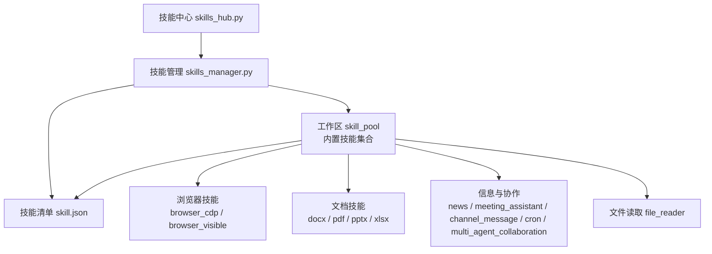
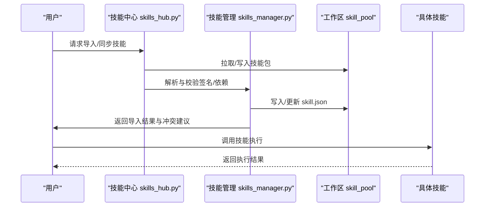
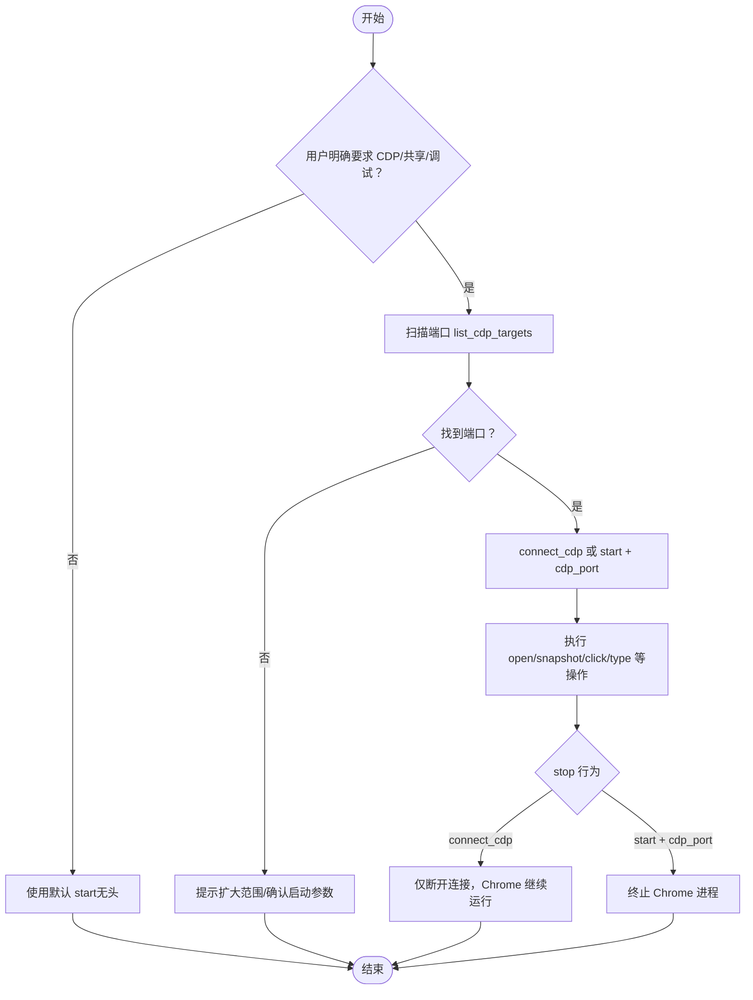

# 内置技能详解

<cite>
**本文档引用的文件**
- [skill.json](file://working/skill_pool/skill.json)
- [browser_cdp/SKILL.md](file://working/skill_pool/browser_cdp/SKILL.md)
- [browser_visible/SKILL.md](file://working/skill_pool/browser_visible/SKILL.md)
- [docx/SKILL.md](file://working/skill_pool/docx/SKILL.md)
- [pdf/SKILL.md](file://working/skill_pool/pdf/SKILL.md)
- [pptx/SKILL.md](file://working/skill_pool/pptx/SKILL.md)
- [xlsx/SKILL.md](file://working/skill_pool/xlsx/SKILL.md)
- [file_reader/SKILL.md](file://working/skill_pool/file_reader/SKILL.md)
- [news/SKILL.md](file://working/skill_pool/news/SKILL.md)
- [meeting_assistant/SKILL.md](file://working/skill_pool/meeting_assistant/SKILL.md)
- [channel_message/SKILL.md](file://working/skill_pool/channel_message/SKILL.md)
- [cron/SKILL.md](file://working/skill_pool/cron/SKILL.md)
- [multi_agent_collaboration/SKILL.md](file://working/skill_pool/multi_agent_collaboration/SKILL.md)
- [skills_hub.py](file://src/copaw/agents/skills_hub.py)
- [skills_manager.py](file://src/copaw/agents/skills_manager.py)
</cite>

## 目录
1. [简介](#简介)
2. [项目结构](#项目结构)
3. [核心组件](#核心组件)
4. [架构总览](#架构总览)
5. [详细组件分析](#详细组件分析)
6. [依赖关系分析](#依赖关系分析)
7. [性能考虑](#性能考虑)
8. [故障排除指南](#故障排除指南)
9. [结论](#结论)
10. [附录](#附录)

## 简介
本文件系统性梳理 CoPaw 内置技能体系，覆盖浏览器操作（CDP、可见浏览器）、文档处理（DOCX、PDF、PPTX、XLSX）、文件读取、新闻获取、会议助手以及消息推送与定时任务等技能。针对每个技能，提供功能特性、适用场景、配置参数、使用方法、执行预期与最佳实践，并给出技能组合使用的案例与技巧，帮助用户高效利用内置技能提升生产力。

## 项目结构
CoPaw 的内置技能以“技能包”形式组织，位于工作区 skill_pool 目录中，每个技能包含 SKILL.md 文档与必要的脚本资源。技能清单由 skill.json 统一管理，skills_hub.py 与 skills_manager.py 负责技能的发现、导入、校验与注册。

图表来源
- [skill.json:1-370](file://working/skill_pool/skill.json#L1-L370)
- [skills_hub.py:1-800](file://src/copaw/agents/skills_hub.py#L1-L800)
- [skills_manager.py:1-800](file://src/copaw/agents/skills_manager.py#L1-L800)

章节来源
- [skill.json:1-370](file://working/skill_pool/skill.json#L1-L370)
- [skills_hub.py:1-800](file://src/copaw/agents/skills_hub.py#L1-L800)
- [skills_manager.py:1-800](file://src/copaw/agents/skills_manager.py#L1-L800)

## 核心组件
- 技能清单与元数据：skill.json 提供技能名称、描述、版本、签名、来源与依赖等信息，确保技能池一致性与可追溯性。
- 技能中心与导入：skills_hub.py 提供从 Hub 源拉取、解析、校验与注入技能的能力，支持重试、超时与取消机制。
- 技能管理与注册：skills_manager.py 负责技能目录扫描、签名计算、冲突检测、环境变量注入与工作区同步。

章节来源
- [skill.json:1-370](file://working/skill_pool/skill.json#L1-L370)
- [skills_hub.py:1-800](file://src/copaw/agents/skills_hub.py#L1-L800)
- [skills_manager.py:1-800](file://src/copaw/agents/skills_manager.py#L1-L800)

## 架构总览
内置技能的生命周期包括：技能发现（内置/外部）、导入与校验（签名、依赖、权限）、注册与激活（工作区 manifest）、运行时注入（环境变量、配置覆盖）。

图表来源
- [skills_hub.py:1-800](file://src/copaw/agents/skills_hub.py#L1-L800)
- [skills_manager.py:1-800](file://src/copaw/agents/skills_manager.py#L1-L800)
- [skill.json:1-370](file://working/skill_pool/skill.json#L1-L370)

## 详细组件分析

### 浏览器操作技能

#### 浏览器 CDP（browser_cdp）
- 功能特性
  - 支持扫描本地 CDP 端口、连接已有 Chrome、启动暴露 CDP 端口的浏览器。
  - 默认无头模式不暴露敏感信息；CDP 模式会暴露历史、Cookies 等，需用户知情同意。
  - 同一 workspace 同时仅允许一个浏览器实例。
- 适用场景
  - 多智能体/外部工具共享浏览器实例、远程调试、演示与可视化调试。
- 配置与参数
  - 动作：list_cdp_targets/connect_cdp/start（携带 cdp_port）。
  - 端口范围与单端口指定；CDP URL 用于连接。
- 使用方法
  - 扫描端口：{"action": "list_cdp_targets", "port_min"/"port_max"/"port": ...}
  - 连接已有 Chrome：{"action": "connect_cdp", "cdp_url": "..."}
  - 启动暴露端口的浏览器：{"action": "start", "cdp_port": 9222}
- 执行预期
  - 成功返回包含 ok 与消息；未找到端口时提示扩大范围或确认 Chrome 启动参数。
- 最佳实践
  - CDP 模式前务必告知隐私风险；切换实例前先 stop；清理缓存时区分运行中与已停止两种路径。
- 常见问题
  - Chrome 未暴露端口：需以 --remote-debugging-port 启动并指定 user-data-dir。
  - 连接中断：按提示重新 connect_cdp。

图表来源
- [browser_cdp/SKILL.md:1-182](file://working/skill_pool/browser_cdp/SKILL.md#L1-L182)

章节来源
- [browser_cdp/SKILL.md:1-182](file://working/skill_pool/browser_cdp/SKILL.md#L1-L182)

#### 可见浏览器（browser_visible）
- 功能特性
  - 以 headed 模式启动真实浏览器窗口，便于演示、调试与人工交互。
- 适用场景
  - 用户要求看到页面加载、点击、填表等过程；登录/验证码等需人工参与。
- 配置与参数
  - 动作：start（headed=true）。
- 使用方法
  - {"action": "start", "headed": true} 启动真实窗口。
  - 与无头模式相同的操作接口：open/snapshot/click/type。
- 执行预期
  - 出现真实 Chromium 窗口；结束后 {"action": "stop"} 关闭。
- 最佳实践
  - 若已有浏览器运行，需先 stop 再以 headed:true 重新 start；服务器需具备图形环境。

章节来源
- [browser_visible/SKILL.md:1-49](file://working/skill_pool/browser_visible/SKILL.md#L1-L49)

### 文档处理技能

#### DOCX（docx）
- 功能特性
  - 创建、读取、编辑、提取内容、插入图片、查找替换、跟踪修订与注释、转图像等。
  - 依赖：docx（npm）、LibreOffice、pandoc、pdftoppm 等。
- 适用场景
  - 生成 Word 报告、Memo、信函、模板；从 .doc 转换为 .docx；接受修订与导出 PDF。
- 配置与参数
  - 通过 scripts/ 脚本执行：soffice.py、unpack.py、accept_changes.py、validate.py 等。
- 使用方法
  - 转换 .doc：python scripts/office/soffice.py --headless --convert-to docx document.doc
  - 读取内容：pandoc 或 unpack 后查看 XML
  - 接受修订：python scripts/accept_changes.py input.docx output.docx
- 执行预期
  - 生成合规的 .docx 文件；验证失败时需 unpack、修复 XML、repack。
- 最佳实践
  - 明确设置页面尺寸（US Letter 12240x15840 DXA）；表格需同时设置 table width 与 cell width；使用 ShadingType.CLEAR；标题使用 HeadingLevel 并设置 outlineLevel。

章节来源
- [docx/SKILL.md:1-488](file://working/skill_pool/docx/SKILL.md#L1-L488)

#### PDF（pdf）
- 功能特性
  - 合并/拆分、旋转、加水印、创建、填写表单、加密/解密、提取文本/表格、OCR。
  - 依赖：pypdf、pdfplumber、reportlab、pdftotext、pdftoppm、qpdf。
- 适用场景
  - 生成报告 PDF、批量处理扫描件、提取结构化数据。
- 配置与参数
  - 使用 pypdf、pdfplumber、reportlab 等库；必要时配合 qpdf、pdftk。
- 使用方法
  - 合并：遍历多个 PDF，writer.add_page(page) 后写入。
  - 提取文本/表格：pdfplumber.open(...).pages[i].extract_text()/extract_tables()
  - 创建 PDF：reportlab Canvas/Platypus。
- 执行预期
  - 输出符合格式规范的 PDF；OCR 扫描件需先转换为图像再识别。
- 最佳实践
  - 避免使用 Unicode 下标/上标字符；使用 XML 标签或手动调整位置；注意字体缺失导致的黑块问题。

章节来源
- [pdf/SKILL.md:1-330](file://working/skill_pool/pdf/SKILL.md#L1-L330)

#### PPTX（pptx）
- 功能特性
  - 读取/解析/提取文本、编辑/修改/更新现有演示、合并/拆分、模板/布局/备注/批注。
  - 依赖：markitdown[pptx]、Pillow、pptxgenjs、LibreOffice、pdftoppm。
- 适用场景
  - 生成/编辑演示文稿、提取内容、生成缩略图、设计美化。
- 配置与参数
  - 使用 scripts/thumbnail.py 生成缩略图；scripts/office/unpack.py 查看原始 XML。
- 使用方法
  - 文本提取：python -m markitdown presentation.pptx
  - 编辑：unpack → 修改 → clean → pack
  - 从零创建：参考 pptxgenjs.md
- 执行预期
  - 输出高质量演示文稿；缩略图用于视觉校验。
- 最佳实践
  - 设计要点：色彩搭配、版式变化、排版对比度、避免纯文字幻灯片；QA 采用子代理视觉检查。

章节来源
- [pptx/SKILL.md:1-240](file://working/skill_pool/pptx/SKILL.md#L1-L240)

#### XLSX（xlsx）
- 功能特性
  - 读取/编辑/修复现有 .xlsx/.xlsm/.csv/.tsv；从其他数据源创建新表；格式化/公式/图表/清洗。
  - 依赖：openpyxl、pandas、LibreOffice（scripts/recalc.py）。
- 适用场景
  - 财务建模、数据清洗、动态报表、跨表链接与公式校验。
- 配置与参数
  - 严禁硬编码计算值，必须使用 Excel 公式；使用 scripts/recalc.py 进行公式重算。
- 使用方法
  - pandas 读取/分析；openpyxl 添加/修改数据与格式；scripts/recalc.py 校验公式错误。
- 执行预期
  - 输出无公式错误的 Excel 文件；颜色编码与数字格式遵循行业标准。
- 最佳实践
  - 颜色编码：蓝色输入、黑色公式、绿色同表链接、红色外部链接、黄色高亮假设；货币单位与百分比格式统一；负数使用括号；零值显示为“-”。

章节来源
- [xlsx/SKILL.md:1-306](file://working/skill_pool/xlsx/SKILL.md#L1-L306)

### 文件读取技能（file_reader）
- 功能特性
  - 仅处理文本型文件：.txt、.md、.json、.yaml/.yml、.csv/.tsv、.log、.sql、.ini、.toml、源代码等。
- 适用场景
  - 读取配置、日志、源码、结构化数据摘要。
- 使用方法
  - 类型探测：file -b --mime-type；大文件使用 tail 截取尾部片段；JSON/YAML 展示顶层键与关键字段；CSV/TSV 展示头部与前几行。
- 执行预期
  - 返回最小必要内容；避免执行不可信文件。
- 最佳实践
  - 优先 read_file；缺失工具时解释限制并建议替代格式。

章节来源
- [file_reader/SKILL.md:1-59](file://working/skill_pool/file_reader/SKILL.md#L1-L59)

### 新闻获取技能（news）
- 功能特性
  - 从权威新闻站点抓取最新消息（政治、金融、社会、世界、科技、体育、娱乐）。
- 适用场景
  - 用户需要“今日新闻”或特定分类资讯。
- 使用方法
  - 确定类别 → 选择对应 URL → browser_use open → snapshot → 提取标题/日期/摘要 → 组织简要列表。
- 执行预期
  - 返回按时间或重要性排序的摘要；站点结构变更时提示用户直接打开链接。
- 最佳实践
  - 多类别时逐个 open/snapshot，避免混杂内容；可包含原始链接以便用户进一步阅读。

章节来源
- [news/SKILL.md:1-48](file://working/skill_pool/news/SKILL.md#L1-L48)

### 会议助手技能（meeting_assistant）
- 功能特性
  - 会议纪要总结、行动项追踪、草拟会议纪要、跟进邮件。
- 适用场景
  - 会议后整理要点、分配任务、生成正式纪要。
- 使用方法
  - 提供会议转录 → 要求总结/行动项/草拟纪要 → 输出结构化结果。
- 执行预期
  - 精炼关键讨论点；明确负责人与截止日期；格式化为专业“会议纪要”。

章节来源
- [meeting_assistant/SKILL.md:1-29](file://working/skill_pool/meeting_assistant/SKILL.md#L1-L29)

### 消息推送技能（channel_message）
- 功能特性
  - 主动向用户/会话/频道单向推送消息，不期望回复。
- 适用场景
  - 任务完成通知、定时提醒、告警、异步结果回推。
- 使用方法
  - copaw chats list 查询会话 → 从结果获取 user_id 与 session_id → copaw channels send 发送。
- 执行预期
  - 无回复；单向推送；多会话时优先最近活跃会话。
- 最佳实践
  - 必须先查会话；必填参数齐全；不要与当前会话的正常回复混淆。

章节来源
- [channel_message/SKILL.md:1-251](file://working/skill_pool/channel_message/SKILL.md#L1-L251)

### 定时任务技能（cron）
- 功能特性
  - 管理未来定时或周期执行的任务，支持 text/agent 两类任务类型。
- 适用场景
  - 每日/每周/每小时提醒；特定时间自动执行；周期性检查/汇报。
- 使用方法
  - copaw cron list/get/state/create/pause/resume/delete/run；创建时必须显式传 --agent-id。
- 执行预期
  - 严格按 cron 表达式调度；任务失败时提供状态与错误信息。
- 最佳实践
  - 缺少参数先确认；修改/暂停/删除前先列出；后台模式适合复杂任务。

章节来源
- [cron/SKILL.md:1-205](file://working/skill_pool/cron/SKILL.md#L1-L205)

### 多智能体协作技能（multi_agent_collaboration）
- 功能特性
  - 当需要其他 agent 的专长/上下文或用户明确要求调用其他 agent 时使用；支持实时与后台模式。
- 适用场景
  - 复杂数据分析、报告生成、批量处理、外部 API 调用等。
- 使用方法
  - copaw agents list → copaw agents chat（实时/后台）→ 续聊时传 session-id。
- 执行预期
  - 实时模式即时返回；后台模式提交后记录 task_id，稍后查询状态与结果。
- 最佳实践
  - 不要回调消息来源 agent；不要频繁查询；复杂任务优先后台模式。

章节来源
- [multi_agent_collaboration/SKILL.md:1-477](file://working/skill_pool/multi_agent_collaboration/SKILL.md#L1-L477)

## 依赖关系分析
内置技能依赖外部工具与系统环境，需在 PATH 中可用。技能管理器负责解析 frontmatter 中的 metadata.requires（bins/env），并注入环境变量以满足运行时需求。

图表来源
- [skills_manager.py:542-711](file://src/copaw/agents/skills_manager.py#L542-L711)

章节来源
- [skills_manager.py:542-711](file://src/copaw/agents/skills_manager.py#L542-L711)

## 性能考虑
- 浏览器操作
  - CDP 模式会暴露敏感信息且占用资源，仅在必要时启用；同一 workspace 仅允许一个浏览器实例。
  - 可见浏览器需要图形环境，服务器场景需谨慎使用。
- 文档处理
  - 大型 PDF/演示/电子表格建议分页/分表处理，避免一次性加载造成内存压力。
  - 公式重算与 OCR 为 CPU 密集型，建议后台模式并合理安排查询间隔。
- 文件读取
  - 大日志文件使用 tail 截取尾部片段；结构化数据优先 pandas 读取并按需列选择。

## 故障排除指南
- CDP 连接丢失
  - 现象：{"ok": false, "error": "CDP connection lost..."}
  - 处理：按提示重新 connect_cdp；确认端口暴露与 Chrome 启动参数。
- Chrome 未暴露端口
  - 现象：无法扫描到 CDP 端口
  - 处理：以 --remote-debugging-port 与 --user-data-dir 启动独立进程。
- 浏览器实例冲突
  - 现象：同一 workspace 同时运行多个浏览器
  - 处理：先 stop 当前实例，再启动或连接新的浏览器。
- Excel 公式错误
  - 现象：#REF!/#DIV/0!/#VALUE!/#N/A/#NAME?
  - 处理：使用 scripts/recalc.py 检测并修复；检查单元格引用与边界条件。
- PDF OCR 失败
  - 现象：扫描件不可搜索
  - 处理：先转换为图像，再进行 OCR；确保工具链可用。

章节来源
- [browser_cdp/SKILL.md:161-182](file://working/skill_pool/browser_cdp/SKILL.md#L161-L182)
- [xlsx/SKILL.md:221-277](file://working/skill_pool/xlsx/SKILL.md#L221-L277)
- [pdf/SKILL.md:248-265](file://working/skill_pool/pdf/SKILL.md#L248-L265)

## 结论
CoPaw 内置技能覆盖从浏览器操作到文档处理、信息获取与协作调度的完整工作流。通过清晰的触发条件、严格的依赖管理与环境注入、以及完善的错误处理与最佳实践，用户可以安全、高效地组合使用多种技能，实现自动化办公与知识处理的规模化落地。

## 附录

### 技能清单概览（节选）
- 浏览器：browser_cdp、browser_visible
- 文档：docx、pdf、pptx、xlsx
- 信息：news、meeting_assistant
- 协作：channel_message、cron、multi_agent_collaboration
- 其他：file_reader

章节来源
- [skill.json:4-343](file://working/skill_pool/skill.json#L4-L343)