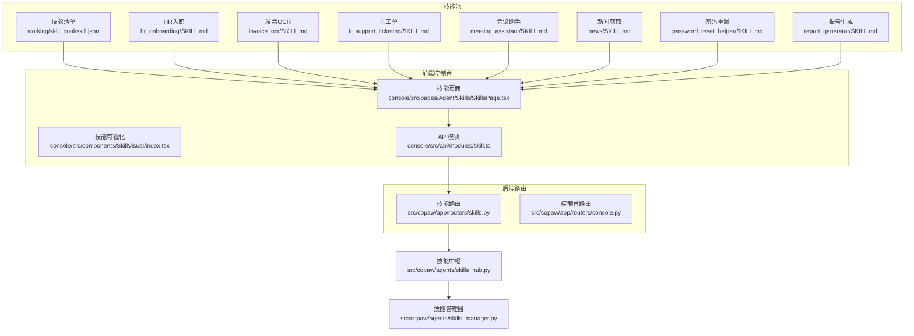
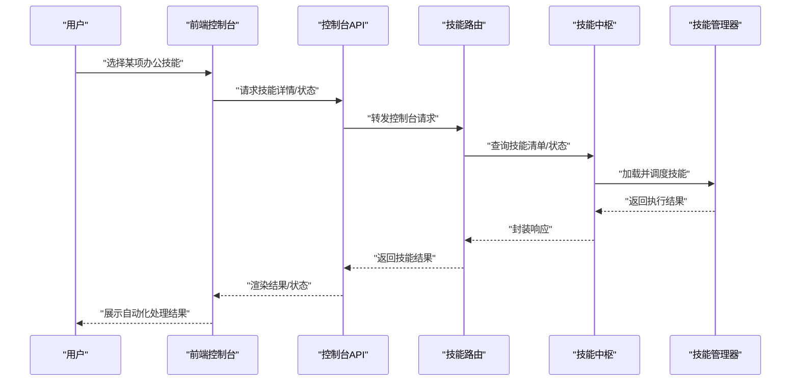

# 办公效率技能

<cite>
**本文引用的文件**
- [skill.json](file://working/skill_pool/skill.json)
- [hr_onboarding SKILL.md](file://working/skill_pool/hr_onboarding/SKILL.md)
- [invoice_ocr SKILL.md](file://working/skill_pool/invoice_ocr/SKILL.md)
- [it_support_ticketing SKILL.md](file://working/skill_pool/it_support_ticketing/SKILL.md)
- [meeting_assistant SKILL.md](file://working/skill_pool/meeting_assistant/SKILL.md)
- [news SKILL.md](file://working/skill_pool/news/SKILL.md)
- [password_reset_helper SKILL.md](file://working/skill_pool/password_reset_helper/SKILL.md)
- [report_generator SKILL.md](file://working/skill_pool/report_generator/SKILL.md)
- [browser_cdp SKILL.md](file://working/skill_pool/browser_cdp/SKILL.md)
- [browser_visible SKILL.md](file://working/skill_pool/browser_visible/SKILL.md)
- [channel_message SKILL.md](file://working/skill_pool/channel_message/SKILL.md)
- [docx SKILL.md](file://working/skill_pool/docx/SKILL.md)
- [pdf SKILL.md](file://working/skill_pool/pdf/SKILL.md)
- [pptx SKILL.md](file://working/skill_pool/pptx/SKILL.md)
- [xlsx SKILL.md](file://working/skill_pool/xlsx/SKILL.md)
- [cron SKILL.md](file://working/skill_pool/cron/SKILL.md)
- [dify_workflow SKILL.md](file://working/skill_pool/dify_workflow/SKILL.md)
- [dingtalk_channel SKILL.md](file://working/skill_pool/dingtalk_channel/SKILL.md)
- [file_reader SKILL.md](file://working/skill_pool/file_reader/SKILL.md)
- [guidance SKILL.md](file://working/skill_pool/guidance/SKILL.md)
- [himalaya SKILL.md](file://working/skill_pool/himalaya/SKILL.md)
- [multi_agent_collaboration SKILL.md](file://working/skill_pool/multi_agent_collaboration/SKILL.md)
- [copaw_source_index SKILL.md](file://working/skill_pool/copaw_source_index/SKILL.md)
- [expense_approval SKILL.md](file://working/skill_pool/expense_approval/SKILL.md)
- [skills_hub.py](file://src/copaw/agents/skills_hub.py)
- [skills_manager.py](file://src/copaw/agents/skills_manager.py)
- [__init__.py](file://src/copaw/agents/skills/__init__.py)
- [agent.py](file://src/copaw/agents/react_agent.py)
- [router_skills.py](file://src/copaw/app/routers/skills.py)
- [router_console.py](file://src/copaw/app/routers/console.py)
- [router_console_api.py](file://src/copaw/app/routers/console/api.py)
- [console.ts](file://console/src/api/modules/console.ts)
- [skill.ts](file://console/src/api/modules/skill.ts)
- [SkillsPage.tsx](file://console/src/pages/Agent/Skills/SkillsPage.tsx)
- [SkillVisual.tsx](file://console/src/components/SkillVisual/index.tsx)
- [constants.ts](file://console/src/constants/skill.ts)
- [utils.ts](file://console/src/utils/skill.ts)
- [README.md](file://README.md)
- [QUICK-START.md](file://docs/QUICK-START.md)
</cite>

## 目录
1. [简介](#简介)
2. [项目结构](#项目结构)
3. [核心组件](#核心组件)
4. [架构总览](#架构总览)
5. [详细组件分析](#详细组件分析)
6. [依赖分析](#依赖分析)
7. [性能考虑](#性能考虑)
8. [故障排除指南](#故障排除指南)
9. [结论](#结论)
10. [附录](#附录)

## 简介
本文件面向企业与团队，系统化梳理 CoPaw 提供的办公效率技能，覆盖费用审批、HR 入职、发票 OCR、IT 支持工单、会议助手、新闻获取、密码重置、报告生成等核心能力。文档从“能力特性—适用场景—配置要求—使用方法—集成方式—最佳实践”六个维度展开，帮助读者快速理解并落地应用这些技能，显著提升日常办公自动化水平。

## 项目结构
CoPaw 将“技能”抽象为可发现、可管理、可编排的能力单元，技能清单由技能池统一维护，前端控制台提供可视化管理界面，后端路由负责技能注册与调用。

图示来源
- [skill.json:1-370](file://working/skill_pool/skill.json#L1-L370)
- [SkillsPage.tsx](file://console/src/pages/Agent/Skills/SkillsPage.tsx)
- [SkillVisual.tsx](file://console/src/components/SkillVisual/index.tsx)
- [skill.ts](file://console/src/api/modules/skill.ts)
- [router_skills.py](file://src/copaw/app/routers/skills.py)
- [router_console.py](file://src/copaw/app/routers/console.py)
- [skills_hub.py](file://src/copaw/agents/skills_hub.py)
- [skills_manager.py](file://src/copaw/agents/skills_manager.py)

章节来源
- [skill.json:1-370](file://working/skill_pool/skill.json#L1-L370)
- [SkillsPage.tsx](file://console/src/pages/Agent/Skills/SkillsPage.tsx)
- [SkillVisual.tsx](file://console/src/components/SkillVisual/index.tsx)
- [skill.ts](file://console/src/api/modules/skill.ts)
- [router_skills.py](file://src/copaw/app/routers/skills.py)
- [router_console.py](file://src/copaw/app/routers/console.py)
- [skills_hub.py](file://src/copaw/agents/skills_hub.py)
- [skills_manager.py](file://src/copaw/agents/skills_manager.py)

## 核心组件
- 技能中枢与管理器：负责技能注册、加载、调度与生命周期管理，确保技能在运行期可用且可追踪。
- 技能池清单：集中描述所有内置技能的元数据（名称、版本、描述、依赖、更新时间），便于前端展示与后端校验。
- 前端控制台：提供技能列表、可视化卡片、操作按钮与状态反馈，支持技能启用/禁用、刷新、排序等。
- 后端路由：承接控制台请求，提供技能查询、更新、编排等接口，保障与技能中枢的交互一致性。

章节来源
- [skills_hub.py](file://src/copaw/agents/skills_hub.py)
- [skills_manager.py](file://src/copaw/agents/skills_manager.py)
- [skill.json:1-370](file://working/skill_pool/skill.json#L1-L370)
- [SkillsPage.tsx](file://console/src/pages/Agent/Skills/SkillsPage.tsx)
- [router_skills.py](file://src/copaw/app/routers/skills.py)

## 架构总览
下图展示了从“用户意图—技能选择—技能执行—结果输出”的完整链路，以及技能与控制台、路由、中枢之间的交互关系。

图示来源
- [router_console.py](file://src/copaw/app/routers/console.py)
- [router_skills.py](file://src/copaw/app/routers/skills.py)
- [skills_hub.py](file://src/copaw/agents/skills_hub.py)
- [skills_manager.py](file://src/copaw/agents/skills_manager.py)
- [console.ts](file://console/src/api/modules/console.ts)
- [skill.ts](file://console/src/api/modules/skill.ts)

## 详细组件分析

### 费用审批（expense_approval）
- 能力特性
  - 提交与审批流程的自动化通道，降低手工录入与流转成本。
  - 结合组织规则与预算控制，实现初审、复审、归档的标准化路径。
- 适用场景
  - 日常差旅、业务招待、设备采购等费用报销。
  - 需要跨部门审批与财务对账的场景。
- 配置要求
  - 集成财务系统或电子表单平台，定义审批节点与权限矩阵。
  - 明确附件上传规范（发票、合同、行程单等）。
- 使用方法
  - 用户发起“提交费用申请”，系统引导填写必填字段并上传附件。
  - 系统按规则路由至相应审批人，支持催办与状态查询。
- 集成方式
  - 通过统一工作流引擎或第三方审批平台对接。
  - 与会计软件进行数据同步，实现自动入账与报表生成。
- 效率提升最佳实践
  - 预设常用费用类型与限额，减少重复配置。
  - 开启移动端审批与语音提醒，缩短审批周期。
  - 对高频异常项设置规则拦截，降低人工复核量。

章节来源
- [expense_approval SKILL.md:1-18](file://working/skill_pool/expense_approval/SKILL.md#L1-L18)
- [skill.json:131-144](file://working/skill_pool/skill.json#L131-L144)

### HR入职（hr_onboarding）
- 能力特性
  - 新员工自助导航：清单管理、政策问答、联系人查找、欢迎材料草拟。
  - 减少HR重复性工作，提升新员工体验与到岗效率。
- 适用场景
  - 新人报到首周的任务跟踪与知识传递。
  - 多部门协同（IT、前台、财务）的入职准备。
- 配置要求
  - 维护公司手册、政策FAQ与联系人清单。
  - 设定个性化欢迎模板与首周日程建议。
- 使用方法
  - 新员工发起“入职准备”，系统提供任务清单与进度条。
  - HR可查看待办与完成情况，及时跟进。
- 集成方式
  - 与HR系统、邮箱系统、门禁系统联动，自动触发相关动作。
- 效率提升最佳实践
  - 将常见问题预索引到FAQ，减少问答成本。
  - 为不同岗位定制差异化清单，提高适配度。

章节来源
- [hr_onboarding SKILL.md:1-18](file://working/skill_pool/hr_onboarding/SKILL.md#L1-L18)
- [skill.json:189-202](file://working/skill_pool/skill.json#L189-L202)

### 发票OCR识别（invoice_ocr）
- 能力特性
  - 从图片/PDF中提取供应商、发票号、日期、税额、总计等结构化字段。
  - 支持二次校验与导出为JSON/CSV，便于导入财务系统。
- 适用场景
  - 扫描版发票、PDF发票的数字化处理。
  - 财务归档与对账前的数据清洗。
- 配置要求
  - 优化图像质量与裁剪策略，提升识别准确率。
  - 建立字段映射规则与异常处理机制。
- 使用方法
  - 上传发票图片或PDF，系统返回结构化数据与原始文本比对。
  - 导出数据到Excel或财务软件接口。
- 集成方式
  - 与ERP/财务软件进行字段映射与批量导入。
- 效率提升最佳实践
  - 对高相似度发票建立模板缓存，加速后续识别。
  - 异常发票自动标记并转人工复核。

章节来源
- [invoice_ocr SKILL.md:1-18](file://working/skill_pool/invoice_ocr/SKILL.md#L1-L18)
- [skill.json:203-216](file://working/skill_pool/skill.json#L203-L216)

### IT支持工单（it_support_ticketing）
- 能力特性
  - 创建与跟踪IT工单，支持状态查询、升级指引与知识检索。
  - 降低一线支持压力，提升问题解决效率。
- 适用场景
  - 网络、终端、账号、系统权限等技术支持请求。
- 配置要求
  - 与现有工单系统（如Jira、ServiceNow）打通。
  - 定义问题分类、优先级与SLA。
- 使用方法
  - 用户描述问题并选择类别/优先级，系统生成工单并推送给合适的支持人员。
  - 支持人员可在系统内更新状态、添加备注与关闭工单。
- 集成方式
  - 通过API或Webhook对接工单系统，实现双向同步。
- 效率提升最佳实践
  - 建立常见问题知识库，自动匹配解决方案。
  - 对紧急问题开启自动升级与短信/邮件提醒。

章节来源
- [it_support_ticketing SKILL.md:1-18](file://working/skill_pool/it_support_ticketing/SKILL.md#L1-L18)
- [skill.json:217-230](file://working/skill_pool/skill.json#L217-L230)

### 会议助手（meeting_assistant）
- 能力特性
  - 会议纪要摘要、行动项追踪、分钟稿撰写与后续邮件草拟。
  - 降低会后整理成本，提升决策闭环效率。
- 适用场景
  - 内部评审、跨部门协作、项目启动会等。
- 配置要求
  - 与日历系统对接，自动建议会议时间槽。
  - 建立标准会议模板与摘要格式。
- 使用方法
  - 提供会议录音/文字记录，系统自动生成摘要与行动项。
  - 支持导出为正式“会议纪要”文档。
- 集成方式
  - 与Teams/Calendar/文档平台联动，自动归档与分发。
- 效率提升最佳实践
  - 会前设定议程模板，会后自动发送“待办清单”。
  - 对高频议题建立“会议知识库”，沉淀经验。

章节来源
- [meeting_assistant SKILL.md:1-29](file://working/skill_pool/meeting_assistant/SKILL.md#L1-L29)
- [skill.json:231-244](file://working/skill_pool/skill.json#L231-L244)

### 新闻获取（news）
- 能力特性
  - 从权威站点抓取政治、财经、社会、世界、科技、体育、娱乐等分类新闻。
  - 通过浏览器工具打开页面并截图，抽取要点后总结呈现。
- 适用场景
  - 决策层每日晨会信息汇总、市场观察、竞品动态跟踪。
- 配置要求
  - 维护站点URL与分类映射，关注站点结构变化。
  - 设置超时与失败重试策略，避免单点故障影响。
- 使用方法
  - 指定分类或多个分类，系统依次打开页面、截图、抽取并总结。
- 集成方式
  - 与企业知识库或订阅服务对接，定期推送摘要。
- 效率提升最佳实践
  - 对热点事件建立关键词预警，自动聚合相关内容。
  - 限制并发访问频率，避免被目标站点限流。

章节来源
- [news SKILL.md:1-48](file://working/skill_pool/news/SKILL.md#L1-L48)
- [skill.json:259-272](file://working/skill_pool/skill.json#L259-L272)

### 密码重置（password_reset_helper）
- 能力特性
  - 引导员工安全完成企业账户密码重置，解释策略与MFA流程。
  - 减少IT支持压力，提升自助服务能力。
- 适用场景
  - 员工忘记密码、首次登录失败、更换设备后无法登录。
- 配置要求
  - 与身份认证系统（AD/LDAP/SSO）对接，确保链接有效。
  - 明确密码策略与合规要求。
- 使用方法
  - 员工发起“重置密码”，系统提供步骤指引与直达链接。
- 集成方式
  - 通过SAML/OAuth回调或内部门户跳转完成重置。
- 效率提升最佳实践
  - 对高风险场景开启二次验证与审计日志。
  - 提供常见错误排查清单，减少求助次数。

章节来源
- [password_reset_helper SKILL.md:1-18](file://working/skill_pool/password_reset_helper/SKILL.md#L1-L18)
- [skill.json:273-286](file://working/skill_pool/skill.json#L273-L286)

### 报告生成（report_generator）
- 能力特性
  - 基于企业数据生成周报/月报，整合定量指标与定性说明。
  - 输出Markdown/结构化文本，便于内部分发与归档。
- 适用场景
  - 业务汇报、运营分析、KPI追踪、专项总结。
- 配置要求
  - 明确数据来源、字段映射与计算逻辑。
  - 设定报告模板与分发范围。
- 使用方法
  - 指定周期与维度，系统自动汇总并生成报告初稿。
- 集成方式
  - 与BI/数据库/云存储对接，实现自动化产出与分发。
- 效率提升最佳实践
  - 对关键指标设置阈值与趋势标注，突出重点。
  - 支持一键导出为多种格式，满足不同渠道需求。

章节来源
- [report_generator SKILL.md:1-18](file://working/skill_pool/report_generator/SKILL.md#L1-L18)
- [skill.json:315-328](file://working/skill_pool/skill.json#L315-L328)

### 文档类技能（docx/pdf/pptx/xlsx）
- 能力特性
  - Word/Excel/PowerPoint/PDF的全栈处理能力，覆盖创建、编辑、转换、合并、拆分、表格提取、表单填写、加密等。
- 适用场景
  - 合同起草与修订、财务报表生成、演示文稿制作、档案数字化。
- 配置要求
  - 明确文件模板与字段映射，确保格式一致性。
  - 对大文件处理设置超时与内存上限。
- 使用方法
  - 指定操作类型与参数，系统返回处理后的文件或摘要。
- 集成方式
  - 与企业网盘、文档中心、邮件系统联动。
- 效率提升最佳实践
  - 建立模板库与字段字典，减少重复配置。
  - 对批量任务开启队列与进度反馈。

章节来源
- [docx SKILL.md:1-130](file://working/skill_pool/docx/SKILL.md#L1-L130)
- [pdf SKILL.md:1-300](file://working/skill_pool/pdf/SKILL.md#L1-L300)
- [pptx SKILL.md:1-314](file://working/skill_pool/pptx/SKILL.md#L1-L314)
- [xlsx SKILL.md:1-342](file://working/skill_pool/xlsx/SKILL.md#L1-L342)
- [skill.json:117-130](file://working/skill_pool/skill.json#L117-L130)
- [skill.json:287-300](file://working/skill_pool/skill.json#L287-L300)
- [skill.json:301-314](file://working/skill_pool/skill.json#L301-L314)
- [skill.json:329-342](file://working/skill_pool/skill.json#L329-L342)

### 浏览器与消息类技能（browser_cdp/browser_visible/channel_message）
- 能力特性
  - 面向网页自动化：无头/有头浏览、CDP连接、截图快照、消息推送。
- 适用场景
  - 数据采集、表单填写、状态轮询、主动通知。
- 配置要求
  - 明确浏览器模式与安全策略，避免敏感信息泄露。
  - 对CDP模式进行严格授权与审计。
- 使用方法
  - 选择浏览器模式，执行打开/快照/点击等操作，必要时主动推送消息。
- 集成方式
  - 与聊天渠道（飞书/钉钉/企业微信）对接，实现消息上行下发。
- 效率提升最佳实践
  - 对重复任务开启缓存与增量更新。
  - 对异常页面自动重试与降级处理。

章节来源
- [browser_cdp SKILL.md:1-18](file://working/skill_pool/browser_cdp/SKILL.md#L1-L18)
- [browser_visible SKILL.md:1-32](file://working/skill_pool/browser_visible/SKILL.md#L1-L32)
- [channel_message SKILL.md:1-46](file://working/skill_pool/channel_message/SKILL.md#L1-L46)
- [skill.json:5-18](file://working/skill_pool/skill.json#L5-L18)
- [skill.json:19-32](file://working/skill_pool/skill.json#L19-L32)
- [skill.json:33-46](file://working/skill_pool/skill.json#L33-L46)

### 其他实用技能
- 文件读取（file_reader）：仅处理纯文本文件，适合快速摘要与内容提取。
- 多智能体协作（multi_agent_collaboration）：在需要其他智能体专长或上下文时进行跨Agent沟通。
- 指南与索引（guidance/copaw_source_index）：提供安装、配置、技能、MCP、多智能体、记忆、CLI等常见问题的快速定位与解答。
- 钉钉通道（dingtalk_channel）：可视化接入钉钉频道，支持登录暂停与继续。
- 定时任务（cron）：用于计划或周期性任务，需显式传入Agent ID。
- Dify工作流（dify_workflow）：执行复杂企业工作流（数据分析、报告生成、多步审批）。
- 邮件CLI（himalaya）：通过IMAP/SMTP在终端管理邮件，支持多账户与MML。
- 其他：CRM同步、多Agent协作、源码索引、新闻、密码重置、报告生成、文档/表格/PDF处理等。

章节来源
- [file_reader SKILL.md:1-158](file://working/skill_pool/file_reader/SKILL.md#L1-L158)
- [multi_agent_collaboration SKILL.md:1-258](file://working/skill_pool/multi_agent_collaboration/SKILL.md#L1-L258)
- [guidance SKILL.md:1-172](file://working/skill_pool/guidance/SKILL.md#L1-L172)
- [copaw_source_index SKILL.md:1-60](file://working/skill_pool/copaw_source_index/SKILL.md#L1-L60)
- [dingtalk_channel SKILL.md:1-116](file://working/skill_pool/dingtalk_channel/SKILL.md#L1-L116)
- [cron SKILL.md:1-88](file://working/skill_pool/cron/SKILL.md#L1-L88)
- [dify_workflow SKILL.md:1-102](file://working/skill_pool/dify_workflow/SKILL.md#L1-L102)
- [himalaya SKILL.md:1-188](file://working/skill_pool/himalaya/SKILL.md#L1-L188)
- [skill.json:145-158](file://working/skill_pool/skill.json#L145-L158)
- [skill.json:245-258](file://working/skill_pool/skill.json#L245-L258)
- [skill.json:159-172](file://working/skill_pool/skill.json#L159-L172)
- [skill.json:47-60](file://working/skill_pool/skill.json#L47-L60)
- [skill.json:103-116](file://working/skill_pool/skill.json#L103-L116)
- [skill.json:75-88](file://working/skill_pool/skill.json#L75-L88)
- [skill.json:89-102](file://working/skill_pool/skill.json#L89-L102)
- [skill.json:173-188](file://working/skill_pool/skill.json#L173-L188)

## 依赖分析
- 技能与前端控制台的耦合：通过API模块与路由层解耦，前端仅感知技能元数据与状态。
- 技能与中枢/管理器的耦合：中枢负责注册与调度，管理器负责生命周期与资源分配。
- 外部系统依赖：工单系统、财务系统、身份认证、文档中心、邮件系统、渠道平台等。

图示来源
- [console.ts](file://console/src/api/modules/console.ts)
- [skill.ts](file://console/src/api/modules/skill.ts)
- [router_console.py](file://src/copaw/app/routers/console.py)
- [router_skills.py](file://src/copaw/app/routers/skills.py)
- [skills_hub.py](file://src/copaw/agents/skills_hub.py)
- [skills_manager.py](file://src/copaw/agents/skills_manager.py)

章节来源
- [console.ts](file://console/src/api/modules/console.ts)
- [skill.ts](file://console/src/api/modules/skill.ts)
- [router_console.py](file://src/copaw/app/routers/console.py)
- [router_skills.py](file://src/copaw/app/routers/skills.py)
- [skills_hub.py](file://src/copaw/agents/skills_hub.py)
- [skills_manager.py](file://src/copaw/agents/skills_manager.py)

## 性能考虑
- 并发与限流：对浏览器自动化与外部系统调用设置并发上限与超时重试，避免雪崩。
- 缓存策略：对重复任务与静态资源启用缓存，减少重复计算与网络开销。
- 资源隔离：为不同技能分配独立线程/容器，防止相互干扰。
- 日志与监控：记录关键指标（成功率、耗时、错误码），便于定位瓶颈。
- 大文件处理：对PDF/表格/文档操作设置分块与进度反馈，避免长时间阻塞。

## 故障排除指南
- 技能不可用
  - 检查技能是否在技能池清单中，确认版本与签名一致。
  - 核对技能依赖（二进制/环境变量）是否满足。
- 浏览器相关问题
  - 无头/有头模式切换，确认CDP模式的安全策略与授权。
  - 页面结构变更导致抽取失败，检查快照与解析逻辑。
- 工单/财务系统对接
  - 核对API凭据与权限，检查回调地址与字段映射。
  - 对异常状态码与超时进行重试与降级处理。
- 前端显示异常
  - 刷新技能缓存，确认路由与API模块版本一致。
  - 检查控制台与后端的时区与语言配置。

章节来源
- [skill.json:1-370](file://working/skill_pool/skill.json#L1-L370)
- [browser_cdp SKILL.md:1-18](file://working/skill_pool/browser_cdp/SKILL.md#L1-L18)
- [browser_visible SKILL.md:1-32](file://working/skill_pool/browser_visible/SKILL.md#L1-L32)
- [router_console.py](file://src/copaw/app/routers/console.py)
- [router_skills.py](file://src/copaw/app/routers/skills.py)

## 结论
CoPaw 的办公效率技能体系以“可发现、可编排、可扩展”为核心设计原则，覆盖从数据采集、结构化处理到自动化执行与结果分发的全链路。通过标准化的技能接口与强大的前端控制台，企业可以快速落地各类办公自动化场景，持续释放生产力。建议结合自身业务现状，优先实施高频、低复杂度的技能，逐步扩展到跨系统编排与智能决策。

## 附录
- 快速开始与安装参考：[README.md](file://README.md)、[QUICK-START.md](file://docs/QUICK-START.md)
- 技能可视化与管理入口：前端“技能”页面与“技能可视化”组件
- 技能清单与版本：技能池清单文件