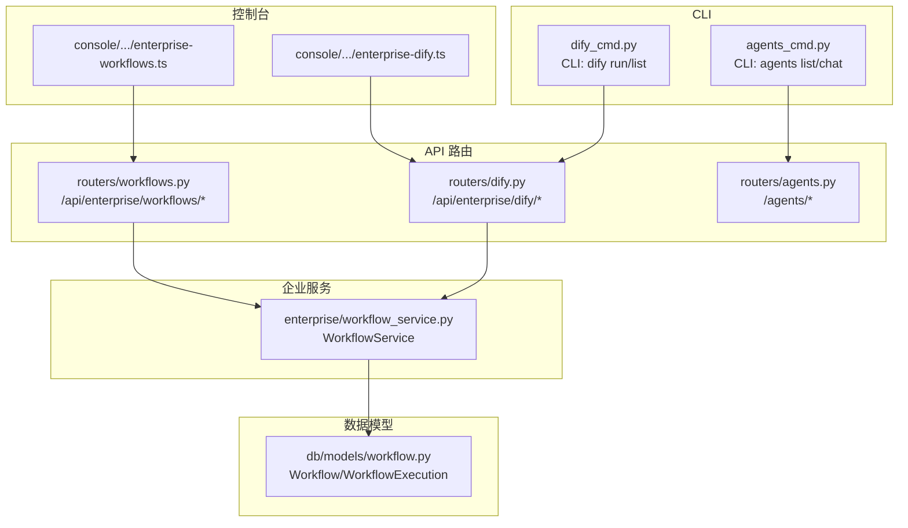
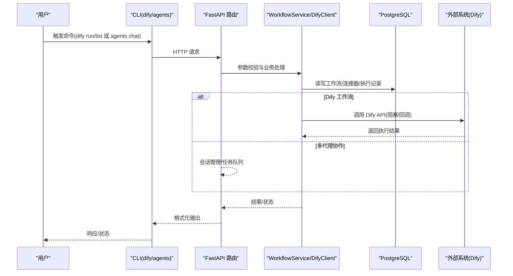
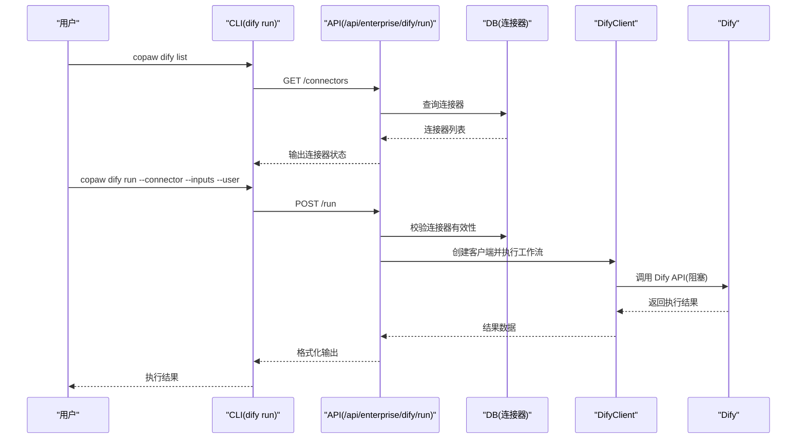
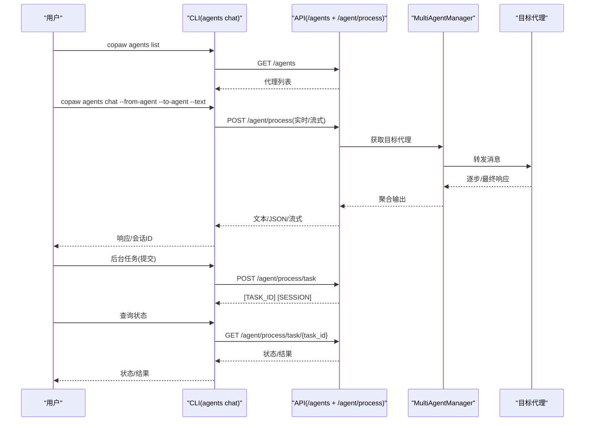
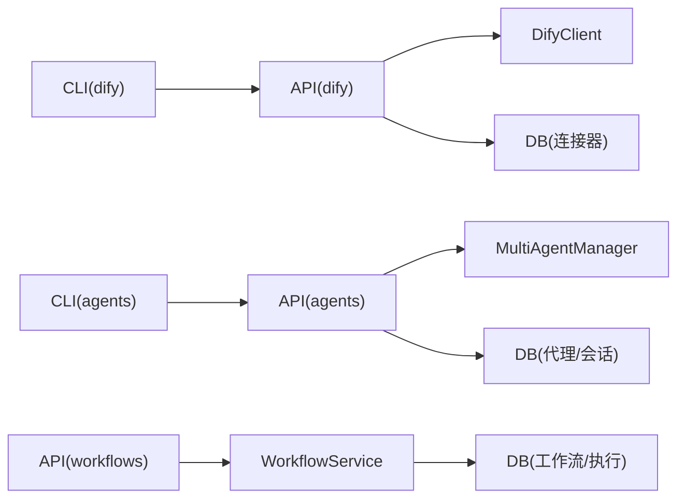

# 工作流技能

<cite>
**本文引用的文件**
- [working\skill_pool\crm_sync\SKILL.md](file://working/skill_pool/crm_sync/SKILL.md)
- [working\skill_pool\dify_workflow\SKILL.md](file://working/skill_pool/dify_workflow/SKILL.md)
- [working\skill_pool\multi_agent_collaboration\SKILL.md](file://working/skill_pool/multi_agent_collaboration/SKILL.md)
- [src\copaw\cli\dify_cmd.py](file://src/copaw/cli/dify_cmd.py)
- [src\copaw\cli\agents_cmd.py](file://src/copaw/cli/agents_cmd.py)
- [src\copaw\app\routers\dify.py](file://src/copaw/app/routers/dify.py)
- [src\copaw\app\routers\agents.py](file://src/copaw/app/routers/agents.py)
- [src\copaw\app\routers\workflows.py](file://src/copaw/app/routers/workflows.py)
- [src\copaw\enterprise\workflow_service.py](file://src/copaw/enterprise/workflow_service.py)
- [src\copaw\db\models\workflow.py](file://src/copaw/db/models/workflow.py)
- [console\src\api\modules\enterprise-workflows.ts](file://console/src/api/modules/enterprise-workflows.ts)
- [console\src\api\modules\enterprise-dify.ts](file://console/src/api/modules/enterprise-dify.ts)
</cite>

## 目录
1. [简介](#简介)
2. [项目结构](#项目结构)
3. [核心组件](#核心组件)
4. [架构总览](#架构总览)
5. [详细组件分析](#详细组件分析)
6. [依赖关系分析](#依赖关系分析)
7. [性能考量](#性能考量)
8. [故障排查指南](#故障排查指南)
9. [结论](#结论)
10. [附录](#附录)

## 简介
本文件面向企业级用户与平台管理员，系统化说明 CoPaw 提供的三大高级工作流技能：CRM 同步技能、Dify 工作流技能与多代理协作技能。内容涵盖技能定位、能力边界、配置与集成方式、典型使用场景、性能与可靠性考量，以及复杂业务流程的实现范式与最佳实践。

## 项目结构
围绕工作流技能，相关代码分布在 CLI、后端 API、数据库模型与前端控制台模块中：
- CLI 层：提供命令行工具，用于触发 Dify 工作流与多代理协作
- API 层：提供企业级工作流与 Dify 连接器管理接口
- 数据层：持久化工作流定义与执行记录
- 控制台：提供前端 API 类型定义与调用入口

图表来源
- [src\copaw\cli\dify_cmd.py:15-79](file://src/copaw/cli/dify_cmd.py#L15-L79)
- [src\copaw\cli\agents_cmd.py:374-679](file://src/copaw/cli/agents_cmd.py#L374-L679)
- [src\copaw\app\routers\dify.py:127-146](file://src/copaw/app/routers/dify.py#L127-L146)
- [src\copaw\app\routers\agents.py:152-197](file://src/copaw/app/routers/agents.py#L152-L197)
- [src\copaw\app\routers\workflows.py:75-209](file://src/copaw/app/routers/workflows.py#L75-L209)
- [src\copaw\enterprise\workflow_service.py:20-145](file://src/copaw/enterprise/workflow_service.py#L20-L145)
- [src\copaw\db\models\workflow.py:19-148](file://src/copaw/db/models/workflow.py#L19-L148)
- [console\src\api\modules\enterprise-workflows.ts:1-47](file://console/src/api/modules/enterprise-workflows.ts#L1-L47)
- [console\src\api\modules\enterprise-dify.ts:1-39](file://console/src/api/modules/enterprise-dify.ts#L1-L39)

章节来源
- [src\copaw\cli\dify_cmd.py:1-80](file://src/copaw/cli/dify_cmd.py#L1-L80)
- [src\copaw\cli\agents_cmd.py:1-680](file://src/copaw/cli/agents_cmd.py#L1-L680)
- [src\copaw\app\routers\dify.py:1-147](file://src/copaw/app/routers/dify.py#L1-L147)
- [src\copaw\app\routers\agents.py:1-726](file://src/copaw/app/routers/agents.py#L1-L726)
- [src\copaw\app\routers\workflows.py:1-210](file://src/copaw/app/routers/workflows.py#L1-L210)
- [src\copaw\enterprise\workflow_service.py:1-146](file://src/copaw/enterprise/workflow_service.py#L1-L146)
- [src\copaw\db\models\workflow.py:1-149](file://src/copaw/db/models/workflow.py#L1-L149)
- [console\src\api\modules\enterprise-workflows.ts:1-47](file://console/src/api/modules/enterprise-workflows.ts#L1-L47)
- [console\src\api\modules\enterprise-dify.ts:1-39](file://console/src/api/modules/enterprise-dify.ts#L1-L39)

## 核心组件
- CRM 同步技能：面向销售线索采集与 CRM 自动化，具备线索解析、机会更新建议、导入条目准备与账户交互历史摘要等能力。
- Dify 工作流技能：通过 CLI 触发企业级复杂工作流（如数据分析、报告生成、多步审批），需先查询可用连接器，再以 connector ID 与输入参数执行。
- 多代理协作技能：在代理间建立双向沟通通道，支持实时对话与后台任务模式，具备会话复用、任务状态查询与并发安全机制。

章节来源
- [working\skill_pool\crm_sync\SKILL.md:1-18](file://working/skill_pool/crm_sync/SKILL.md#L1-L18)
- [working\skill_pool\dify_workflow\SKILL.md:1-66](file://working/skill_pool/dify_workflow/SKILL.md#L1-L66)
- [working\skill_pool\multi_agent_collaboration\SKILL.md:1-477](file://working/skill_pool/multi_agent_collaboration/SKILL.md#L1-L477)

## 架构总览
下图展示三大技能的端到端调用链路与关键交互点：

图表来源
- [src\copaw\cli\dify_cmd.py:15-79](file://src/copaw/cli/dify_cmd.py#L15-L79)
- [src\copaw\cli\agents_cmd.py:511-679](file://src/copaw/cli/agents_cmd.py#L511-L679)
- [src\copaw\app\routers\dify.py:127-146](file://src/copaw/app/routers/dify.py#L127-L146)
- [src\copaw\app\routers\workflows.py:160-185](file://src/copaw/app/routers/workflows.py#L160-L185)
- [src\copaw\enterprise\workflow_service.py:107-145](file://src/copaw/enterprise/workflow_service.py#L107-L145)

## 详细组件分析

### CRM 同步技能
- 能力概述
  - 线索解析：从邮件或会议纪要提取联系人姓名、公司、邮箱、电话等字段
  - 机会更新：对销售通话进行摘要并建议 CRM 的“下一步”字段更新
  - 导入条目：生成可直接导入 CRM 的条目格式
  - CRM 查询：在已集成情况下，汇总特定账户的历史交互摘要
- 使用场景
  - 销售团队自动化录入与跟进
  - 会议纪要转 CRM 条目
  - 跨系统数据一致性维护
- 配置与集成
  - 作为内置技能存在，无需额外安装
  - 与 CRM 系统的对接需在平台侧完成（本技能提供能力说明）
- 性能与可靠性
  - 文本解析类任务通常为 CPU 密集型，建议在后台模式或批处理场景中使用
  - 对外部系统依赖较弱，稳定性主要取决于上游数据质量

章节来源
- [working\skill_pool\crm_sync\SKILL.md:8-18](file://working/skill_pool/crm_sync/SKILL.md#L8-L18)

### Dify 工作流技能
- 能力概述
  - 触发企业级复杂工作流（数据分析、报告生成、多步审批等）
  - 通过 CLI 命令执行，需先查询可用连接器，再以 connector ID 与 JSON 输入参数执行
- 使用流程
  - 列举连接器：查看当前可用的 Dify Connector 及状态
  - 执行工作流：提供 connector ID 与 inputs（必须为合法 JSON 字符串）
  - 用户标识：可选指定用户标识，默认值为 copaw-cli-user
- 错误与注意事项
  - inputs 必须为合法 JSON，注意 shell 转义
  - connector 必须处于 Active 状态，否则执行失败
- 与平台的集成
  - 后端路由提供连接器列表、创建、更新、删除与工作流执行接口
  - 支持 webhook 回调（占位逻辑），可用于异步状态通知

图表来源
- [src\copaw\cli\dify_cmd.py:15-79](file://src/copaw/cli/dify_cmd.py#L15-L79)
- [src\copaw\app\routers\dify.py:37-95](file://src/copaw/app/routers/dify.py#L37-L95)
- [src\copaw\app\routers\dify.py:127-146](file://src/copaw/app/routers/dify.py#L127-L146)

章节来源
- [working\skill_pool\dify_workflow\SKILL.md:10-66](file://working/skill_pool/dify_workflow/SKILL.md#L10-L66)
- [src\copaw\cli\dify_cmd.py:15-79](file://src/copaw/cli/dify_cmd.py#L15-L79)
- [src\copaw\app\routers\dify.py:1-147](file://src/copaw/app/routers/dify.py#L1-L147)
- [console\src\api\modules\enterprise-dify.ts:1-39](file://console/src/api/modules/enterprise-dify.ts#L1-L39)

### 多代理协作技能
- 能力概述
  - 在代理间建立双向通信通道，支持实时对话与后台任务模式
  - 提供会话复用、任务状态查询、并发安全与身份前缀规范
- 使用流程
  - 列举代理：发现可用代理与其工作空间
  - 实时对话：发起即时聊天，系统自动添加身份前缀
  - 后台任务：提交复杂任务，获得任务 ID 与会话 ID，稍后查询状态
  - 续聊：复用会话 ID 保持上下文连续性
- 关键规则
  - 必填参数：from-agent、to-agent、text
  - 身份前缀：消息建议以 [Agent ... requesting] 开头
  - 会话复用：首次调用返回 SESSION，续聊必须复制 session-id
  - 不回调来源代理：避免循环调用
- 任务模式
  - 实时模式：适合快速查询
  - 后台模式：适合数据分析、报告生成、批量处理、外部 API 调用等复杂任务

图表来源
- [src\copaw\cli\agents_cmd.py:390-679](file://src/copaw/cli/agents_cmd.py#L390-L679)
- [src\copaw\app\routers\agents.py:152-197](file://src/copaw/app/routers/agents.py#L152-L197)

章节来源
- [working\skill_pool\multi_agent_collaboration\SKILL.md:10-477](file://working/skill_pool/multi_agent_collaboration/SKILL.md#L10-L477)
- [src\copaw\cli\agents_cmd.py:1-680](file://src/copaw/cli/agents_cmd.py#L1-L680)
- [src\copaw\app\routers\agents.py:1-726](file://src/copaw/app/routers/agents.py#L1-L726)

## 依赖关系分析
- Dify 工作流技能
  - CLI 依赖后端路由 /api/enterprise/dify/run
  - 后端路由依赖连接器模型与 DifyClient
  - 运行时通过阻塞模式调用外部 Dify API，支持 webhook 回调扩展
- 多代理协作技能
  - CLI 依赖 /agents 与 /agent/process 接口
  - 会话管理与任务队列由后端统一处理，确保并发安全
- 企业工作流
  - 后端提供工作流 CRUD 与执行接口，支持审计日志
  - 数据模型支持 Dify 三类工作流分类与内部 DAG 工作流

图表来源
- [src\copaw\cli\dify_cmd.py:15-79](file://src/copaw/cli/dify_cmd.py#L15-L79)
- [src\copaw\app\routers\dify.py:127-146](file://src/copaw/app/routers/dify.py#L127-L146)
- [src\copaw\cli\agents_cmd.py:511-679](file://src/copaw/cli/agents_cmd.py#L511-L679)
- [src\copaw\app\routers\agents.py:152-197](file://src/copaw/app/routers/agents.py#L152-L197)
- [src\copaw\app\routers\workflows.py:75-209](file://src/copaw/app/routers/workflows.py#L75-L209)
- [src\copaw\enterprise\workflow_service.py:20-145](file://src/copaw/enterprise/workflow_service.py#L20-L145)

章节来源
- [src\copaw\app\routers\workflows.py:1-210](file://src/copaw/app/routers/workflows.py#L1-L210)
- [src\copaw\db\models\workflow.py:1-149](file://src/copaw/db/models/workflow.py#L1-L149)
- [console\src\api\modules\enterprise-workflows.ts:1-47](file://console/src/api/modules/enterprise-workflows.ts#L1-L47)

## 性能考量
- Dify 工作流
  - 阻塞执行：CLI 默认采用阻塞模式，适合中小规模任务；大规模任务建议结合 webhook 异步回调
  - 输入参数：JSON 校验失败会导致立即报错，建议在调用前本地校验
- 多代理协作
  - 实时模式：适合快速问答，注意避免频繁查询
  - 后台模式：复杂任务建议使用，遵循查询间隔策略，避免阻塞主流程
  - 并发安全：会话 ID 自动生成，避免并发访问同一会话导致冲突
- 企业工作流
  - 执行状态：支持 submitted → pending → running → finished 的状态流转，便于监控与重试
  - 审计日志：每次运行均记录审计事件，便于追踪与合规

[本节为通用指导，不直接分析具体文件]

## 故障排查指南
- Dify 工作流
  - 参数格式错误：检查 inputs 是否为合法 JSON，注意 shell 转义
  - Connector 不存在或未激活：先执行 list 确认状态
- 多代理协作
  - 未先查 agent：先执行 agents list 获取可用代理
  - 续聊未传 session-id：将首次输出的 SESSION 复制到下次调用
  - 回调来源代理：刚收到某代理消息后，避免再次调用该代理
- 企业工作流
  - 工作流未激活：确保状态为 active
  - 执行异常：检查执行记录的 error_message 字段

章节来源
- [working\skill_pool\dify_workflow\SKILL.md:59-66](file://working/skill_pool/dify_workflow/SKILL.md#L59-L66)
- [working\skill_pool\multi_agent_collaboration\SKILL.md:213-231](file://working/skill_pool/multi_agent_collaboration/SKILL.md#L213-L231)
- [src\copaw\app\routers\workflows.py:160-185](file://src/copaw/app/routers/workflows.py#L160-L185)

## 结论
CoPaw 的三大工作流技能分别覆盖“销售线索自动化”“企业级复杂工作流编排”和“多代理协同”，形成从数据采集、跨系统编排到智能体协作的完整闭环。通过 CLI 与 API 的清晰分层、严格的参数校验与并发安全设计，平台能够在保证易用性的同时满足企业级可靠性与可观测性需求。

[本节为总结性内容，不直接分析具体文件]

## 附录

### 使用场景与最佳实践
- CRM 同步技能
  - 场景：销售线索批量导入、会议纪要转 CRM 条目、跨系统数据一致性维护
  - 建议：在后台模式下批量处理，避免阻塞前台交互
- Dify 工作流技能
  - 场景：跨系统审批、数据分析与报告生成、知识库问答检索
  - 建议：先 list 后 run，inputs 使用单行 JSON 并注意转义；复杂任务使用 webhook 回调
- 多代理协作技能
  - 场景：跨领域专家咨询、跨工作空间内容复用、复杂任务分派
  - 建议：实时模式用于快速问答，后台模式用于复杂任务；严格遵守会话复用与不回调规则

[本节为通用指导，不直接分析具体文件]