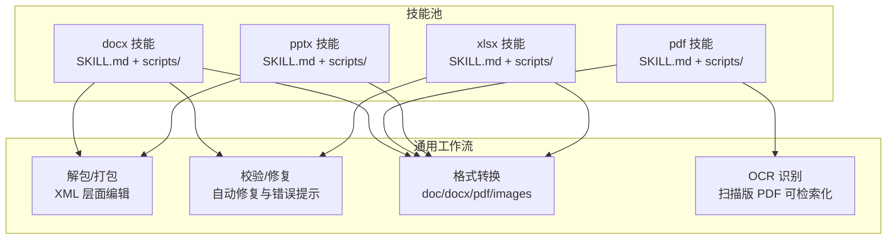
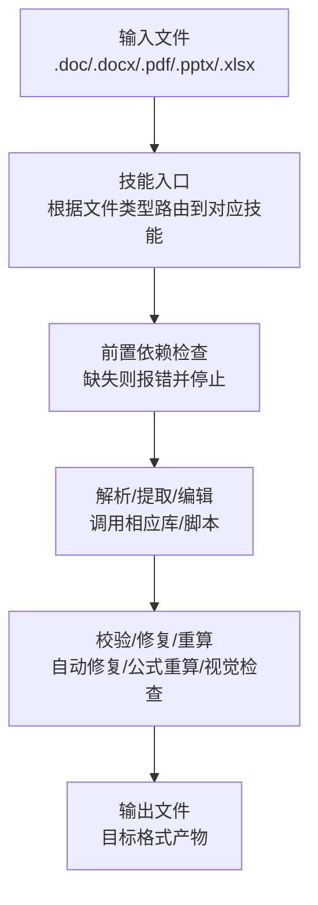
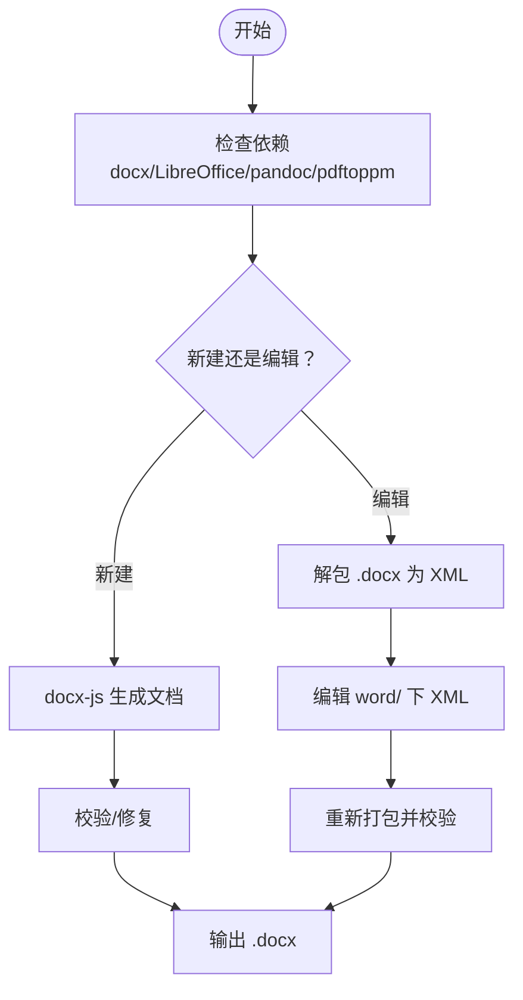
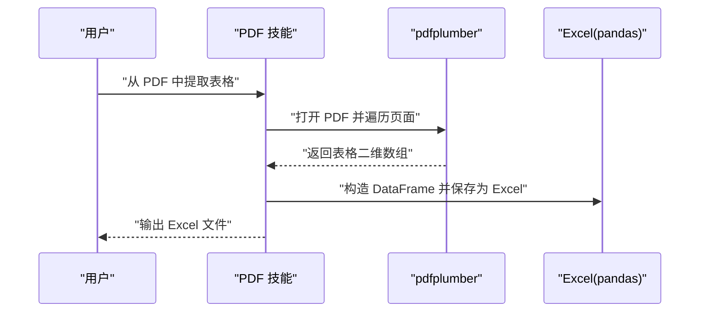
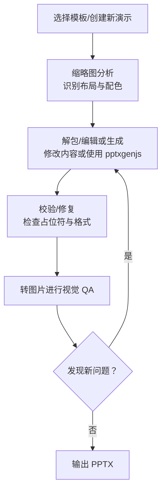
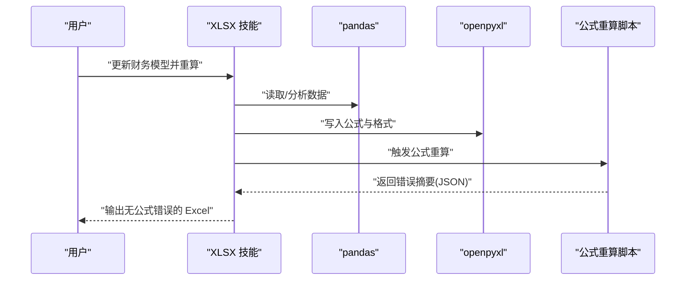
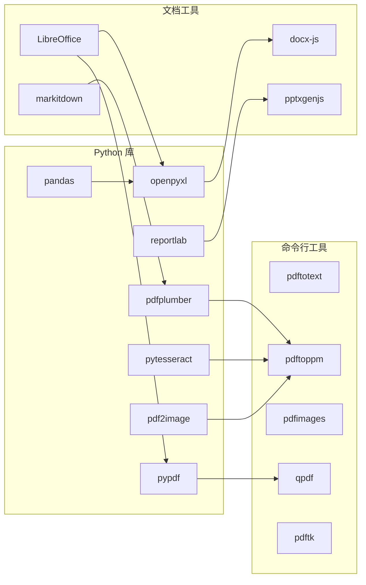

# 文档处理技能

<cite>
**本文引用的文件**
- [docx 技能说明](file://working/skill_pool/docx/SKILL.md)
- [pdf 技能说明](file://working/skill_pool/pdf/SKILL.md)
- [pptx 技能说明](file://working/skill_pool/pptx/SKILL.md)
- [xlsx 技能说明](file://working/skill_pool/xlsx/SKILL.md)
</cite>

## 目录
1. [简介](#简介)
2. [项目结构](#项目结构)
3. [核心组件](#核心组件)
4. [架构总览](#架构总览)
5. [详细组件分析](#详细组件分析)
6. [依赖关系分析](#依赖关系分析)
7. [性能考量](#性能考量)
8. [故障排查指南](#故障排查指南)
9. [结论](#结论)
10. [附录](#附录)

## 简介
本文件系统性梳理 CoPaw 提供的四大文档处理技能：DOCX 文档技能、PDF 文档技能、PPTX 演示文稿技能与 XLSX 电子表格技能。围绕“文档解析、内容提取、格式转换、编辑操作”等核心能力，结合各技能的技术实现原理、支持的文档格式版本、性能特点与使用限制，给出可操作的应用场景与技能组合最佳实践，帮助用户在合同审查、报告生成、数据分析等任务中高效落地。

## 项目结构
四大技能均以“技能目录 + 技能说明 + 脚本工具”的方式组织，技能说明文件（SKILL.md）提供任务清单、前置依赖、快速参考与常见流程；脚本工具位于各自 skill 目录下的 scripts 子目录，用于执行底层命令或 Python 脚本，完成打包/解包、验证、转换、批注、公式重算等关键步骤。

图示来源
- [docx 技能说明](file://working/skill_pool/docx/SKILL.md)
- [pdf 技能说明](file://working/skill_pool/pdf/SKILL.md)
- [pptx 技能说明](file://working/skill_pool/pptx/SKILL.md)
- [xlsx 技能说明](file://working/skill_pool/xlsx/SKILL.md)

章节来源
- [docx 技能说明](file://working/skill_pool/docx/SKILL.md)
- [pdf 技能说明](file://working/skill_pool/pdf/SKILL.md)
- [pptx 技能说明](file://working/skill_pool/pptx/SKILL.md)
- [xlsx 技能说明](file://working/skill_pool/xlsx/SKILL.md)

## 核心组件
- DOCX 技能：面向 .doc/.docx 的创建、读取、编辑与转换，强调 docx-js 的结构化生成、XML 解包/打包、跟踪修订与评论、图像嵌入、目录与页眉页脚等。
- PDF 技能：覆盖文本/表格提取、合并拆分、旋转、水印、表单填写、加密/解密、图片抽取与 OCR，兼顾 Python 库与命令行工具。
- PPTX 技能：聚焦 .pptx 的读取、模板分析、幻灯片编辑、从零创建、设计规范与视觉质量保障（QA），并提供转图片的可视化检查流程。
- XLSX 技能：专注 .xlsx/.xlsm/.csv/.tsv 的读写、数据清洗、公式建模、格式规范与公式重算，确保模型动态更新与无公式错误交付。

章节来源
- [docx 技能说明](file://working/skill_pool/docx/SKILL.md)
- [pdf 技能说明](file://working/skill_pool/pdf/SKILL.md)
- [pptx 技能说明](file://working/skill_pool/pptx/SKILL.md)
- [xlsx 技能说明](file://working/skill_pool/xlsx/SKILL.md)

## 架构总览
四大技能共享统一的“工具链 + 工作流”范式：
- 前置依赖：各技能声明所需外部工具（如 pandoc、LibreOffice、pypdf、pdfplumber、reportlab、pdftotext、pdftoppm、qpdf、markitdown、pptxgenjs、openpyxl、pandas 等）。
- 工作流：读取/解析 → 内容提取/编辑 → 校验/修复 → 输出（doc/docx/pdf/pptx/xlsx 等）。
- 质量保障：docx 的 XML 自动修复、PPTX 的视觉 QA 流程、XLSX 的公式重算与错误扫描。

图示来源
- [docx 技能说明](file://working/skill_pool/docx/SKILL.md)
- [pdf 技能说明](file://working/skill_pool/pdf/SKILL.md)
- [pptx 技能说明](file://working/skill_pool/pptx/SKILL.md)
- [xlsx 技能说明](file://working/skill_pool/xlsx/SKILL.md)

## 详细组件分析

### DOCX 技能
- 核心能力
  - 创建新文档：基于 docx-js 生成结构化 .docx，随后进行校验与修复。
  - 编辑现有文档：解包为 XML → 手工编辑 → 重新打包 → 校验修复。
  - 内容提取：pandoc 或直接读取原始 XML。
  - 图像插入：要求指定类型参数，设置尺寸与可选 alt 文本。
  - 表格与列表：强调 DXA 宽度一致性、单元格内边距、清除背景阴影、编号配置。
  - 目录、页眉页脚、分页符：遵循 HeadingLevel 与页面属性设置。
  - 跟踪修订与评论：使用标准作者名、正确标记删除/插入与评论范围。
- 技术要点
  - 页面尺寸与方向：docx-js 默认 A4，需显式设置 US Letter；横向时传入短边宽与长边高并设置方向。
  - 字体与样式：默认使用 Arial，标题保持黑色；覆盖内置样式需使用精确 ID 并设置层级。
  - 列表与编号：禁止使用 Unicode 符号，必须通过编号配置与 LevelFormat.BULLET 实现。
  - 表格宽度：同时设置表格整体宽度与列宽，且列宽之和等于表格宽度；使用 Clear 阴影避免黑底。
  - 图像：必须指定类型；建议使用 alt 文本提升可访问性。
  - TOC：仅使用 HeadingLevel，且必须包含 outlineLevel。
- 性能与限制
  - 大型文档解包/打包耗时较长，建议批量处理与增量修改。
  - XML 编辑风险较高，需严格遵循元素顺序与命名空间。
- 使用场景
  - 合同审阅：提取修订与评论，生成干净版本；批量生成模板化报告。
  - 报告生成：目录、页眉页脚、表格与图表排版，统一字体与字号。
- 最佳实践
  - 先创建草稿再解包编辑，保留原文件副本。
  - 使用自动修复与校验脚本，减少手工修复成本。
  - 统一页面尺寸与样式，避免跨平台渲染差异。

图示来源
- [docx 技能说明](file://working/skill_pool/docx/SKILL.md)

章节来源
- [docx 技能说明](file://working/skill_pool/docx/SKILL.md)

### PDF 技能
- 核心能力
  - 文本/表格提取：pypdf 逐页读取，pdfplumber 提取布局文本与表格，支持导出为 Excel。
  - 合并与拆分：pypdf 追加页，qpdf 支持按页范围拆分与合并。
  - 旋转与水印：对单页或全部页面旋转；叠加水印页。
  - 表单填写：见 FORMS.md（技能说明中指引）。
  - 加密/解密：设置用户口令与所有者口令。
  - 图片抽取：pdfimages 导出嵌入图片。
  - OCR：扫描版 PDF 转图像后进行文字识别，生成可检索 PDF。
- 技术要点
  - pypdf：适合基础读写与元数据提取；合并/拆分/旋转/解密由 qpdf 更便捷。
  - pdfplumber：适合表格结构化提取，配合 pandas 导出为 Excel。
  - reportlab：适合从零创建 PDF，注意不要使用 Unicode 上下标字符，改用 XML 标签。
  - 命令行工具：pdftotext、pdftoppm、pdfimages、qpdf、pdftk（可用时）。
- 性能与限制
  - 大文件合并/拆分/旋转建议使用 qpdf，速度与稳定性更优。
  - OCR 依赖 Tesseract 与 pdf2image，资源消耗较大，建议分页处理。
- 使用场景
  - 合同审查：提取关键条款与附件清单，合并多份扫描件。
  - 报告生成：从 PDF 中抽取表格并转存为 Excel，再进行二次加工。
  - 数据分析：批量抽取表格，统一清洗后入库。
- 最佳实践
  - 先用 pdfplumber 抽取表格，再决定是否需要 OCR。
  - 合并前先按页码排序，避免顺序混乱。
  - 水印叠加建议先生成水印页，再统一合并。

图示来源
- [pdf 技能说明](file://working/skill_pool/pdf/SKILL.md)

章节来源
- [pdf 技能说明](file://working/skill_pool/pdf/SKILL.md)

### PPTX 技能
- 核心能力
  - 内容读取：使用 markitdown 提取纯文本概要，配合缩略图生成器获得视觉概览。
  - 模板分析：通过缩略图识别布局与配色，指导后续编辑。
  - 编辑与创建：解包 XML 修改内容，或从零使用 pptxgenjs 生成演示文稿。
  - 视觉质量保障：将 PPTX 转 PDF 再转 JPEG，人工/子代理检查重叠、溢出、对比度、间距等问题。
- 技术要点
  - 设计规范：强调主题色彩搭配、主次色比例、明暗对比、视觉动机与字体字号体系。
  - 避免常见错误：不重复相同布局、不居中正文、不使用低对比度、不使用标题下装饰线等。
  - QA 循环：生成 → 转图片 → 检查 → 修复 → 再验证，直至无新增问题。
- 性能与限制
  - 大体量演示文稿转图片耗时较长，建议分页渲染与增量检查。
  - 模板复杂度高时，XML 编辑风险大，优先使用模板替换策略。
- 使用场景
  - 商业提案：从模板出发快速生成多页演示，统一风格与配色。
  - 汇报展示：将讲稿转为结构化幻灯片，添加图表与图标。
- 最佳实践
  - 先做模板分析与配色规划，再开始内容填充。
  - 使用 QA 循环，至少完成一轮修复后再宣告成功。

图示来源
- [pptx 技能说明](file://working/skill_pool/pptx/SKILL.md)

章节来源
- [pptx 技能说明](file://working/skill_pool/pptx/SKILL.md)

### XLSX 技能
- 核心能力
  - 数据读取与分析：pandas 读取 Excel/CSV/TSV，支持多工作表与统计描述。
  - 编辑与创建：openpyxl 添加/修改数据、公式与格式；支持插入/删除行列与新增工作表。
  - 公式建模：强调使用 Excel 公式而非硬编码数值，确保动态更新。
  - 公式重算：通过脚本调用 LibreOffice 计算所有工作表的公式值，扫描并报告错误。
  - 规范与颜色编码：财务模型的颜色约定与数字格式规则。
- 技术要点
  - 公式优先：所有计算以公式形式保留，便于随源数据变化而更新。
  - 错误扫描：使用脚本输出 JSON，定位 #REF!、#DIV/0!、#VALUE!、#NAME? 等错误。
  - 读写注意：data_only=True 会丢失公式，谨慎使用；大文件建议只读/只写模式。
- 性能与限制
  - 公式重算时间取决于工作表数量与公式复杂度，建议分阶段重算与验证。
  - 大数据集建议先用 pandas 处理，再回写 openpyxl 以保留公式。
- 使用场景
  - 财务建模：假设区、计算区、链接区清晰分离，颜色编码辅助审阅。
  - 数据清洗：修复错位头、异常行、空列，统一为标准表格。
- 最佳实践
  - 先用 pandas 快速验证逻辑，再用 openpyxl 保留公式与格式。
  - 每次修改后执行公式重算与错误扫描，确保交付零错误。

图示来源
- [xlsx 技能说明](file://working/skill_pool/xlsx/SKILL.md)

章节来源
- [xlsx 技能说明](file://working/skill_pool/xlsx/SKILL.md)

## 依赖关系分析
四大技能均依赖一组通用外部工具与语言生态：
- Python 生态：pypdf、pdfplumber、reportlab、pandas、openpyxl、pytesseract、pdf2image 等。
- 命令行工具：pdftotext、pdftoppm、pdfimages、qpdf、pdftk（可用时）。
- 文档处理工具：LibreOffice（soffice）、docx-js、pptxgenjs、markitdown 等。

图示来源
- [docx 技能说明](file://working/skill_pool/docx/SKILL.md)
- [pdf 技能说明](file://working/skill_pool/pdf/SKILL.md)
- [pptx 技能说明](file://working/skill_pool/pptx/SKILL.md)
- [xlsx 技能说明](file://working/skill_pool/xlsx/SKILL.md)

章节来源
- [docx 技能说明](file://working/skill_pool/docx/SKILL.md)
- [pdf 技能说明](file://working/skill_pool/pdf/SKILL.md)
- [pptx 技能说明](file://working/skill_pool/pptx/SKILL.md)
- [xlsx 技能说明](file://working/skill_pool/xlsx/SKILL.md)

## 性能考量
- 大文件处理
  - DOCX/PPTX：解包/打包与转图片流程耗时较长，建议分步执行与缓存中间结果。
  - PDF：qpdf 在合并/拆分/旋转方面优于 pypdf，OCR 会显著增加 CPU/内存占用。
  - XLSX：公式重算与错误扫描可能耗时，建议分工作表重算与分段验证。
- 跨平台兼容
  - LibreOffice 在 Windows 上需 PATH 正确配置；缺失时报错并停止，避免反复重试。
  - docx-js 默认 A4，务必显式设置 US Letter 尺寸以保证跨平台一致。
- I/O 与并发
  - 批量任务建议串行化以降低资源竞争；必要时使用独立临时目录隔离中间文件。

## 故障排查指南
- DOCX
  - 症状：生成后无法打开或渲染异常
  - 排查：使用校验脚本自动修复；检查页面尺寸、表格宽度与阴影类型、列表编号配置、图像类型参数。
  - 关键点：DXA 宽度必须匹配；Clear 阴影；HeadingLevel 与 outlineLevel。
- PDF
  - 症状：表格抽取错位、OCR 结果乱码
  - 排查：确认 pdfplumber 版本与页面布局；OCR 前先降噪与二值化；检查分辨率与语言包。
  - 关键点：使用 pdftoppm 指定 DPI；确保 Tesseract 语言数据完整。
- PPTX
  - 症状：元素重叠、文字溢出、对比度不足
  - 排查：转图片后人工/子代理检查；核对占位符是否清理；检查间距与留白。
  - 关键点：QA 循环至少一轮修复；避免装饰线与低对比度。
- XLSX
  - 症状：公式错误（#REF!/#DIV/0!/#VALUE!/#NAME?）
  - 排查：使用公式重算脚本输出 JSON，定位具体位置；修正引用、除零与数据类型。
  - 关键点：严禁硬编码数值；确保跨表引用格式正确；测试边界值。

章节来源
- [docx 技能说明](file://working/skill_pool/docx/SKILL.md)
- [pdf 技能说明](file://working/skill_pool/pdf/SKILL.md)
- [pptx 技能说明](file://working/skill_pool/pptx/SKILL.md)
- [xlsx 技能说明](file://working/skill_pool/xlsx/SKILL.md)

## 结论
四大文档处理技能围绕“解析—提取—转换—编辑—校验—输出”的闭环工作流构建，既满足日常办公自动化需求，又能在专业场景（合同审阅、报告生成、财务建模）中提供高质量交付。通过统一的工具链与严格的规范（样式、表格、公式、颜色编码），用户可在不同格式间高效流转信息，同时降低跨平台与格式兼容带来的风险。

## 附录
- 技能组合最佳实践
  - 合同审查：PDF 扫描件 → OCR → 合并 → 提取关键条款 → DOCX 模板化 → 修订与评论 → 清洁版 DOCX。
  - 报告生成：PDF 表格 → 抽取 → Excel 清洗 → 图表与汇总 → XLSX 动态模型 → PPTX 演示文稿 → 视觉 QA → 输出。
  - 数据分析：多源 CSV/XLSX → pandas 统一清洗 → Excel 保存 → 公式重算与错误扫描 → 交付无错误模型。
- 常用快捷路径
  - DOCX：解包/编辑 → 校验 → 打包；必要时 LibreOffice 接受修订。
  - PDF：pypdf 合并/拆分/旋转；pdfplumber 抽取；qpdf 辅助；OCR 识别。
  - PPTX：模板分析 → 缩略图 → 编辑/生成 → 转图片 → QA → 输出。
  - XLSX：pandas 分析 → openpyxl 写入公式 → LibreOffice 重算 → 错误扫描 → 输出。