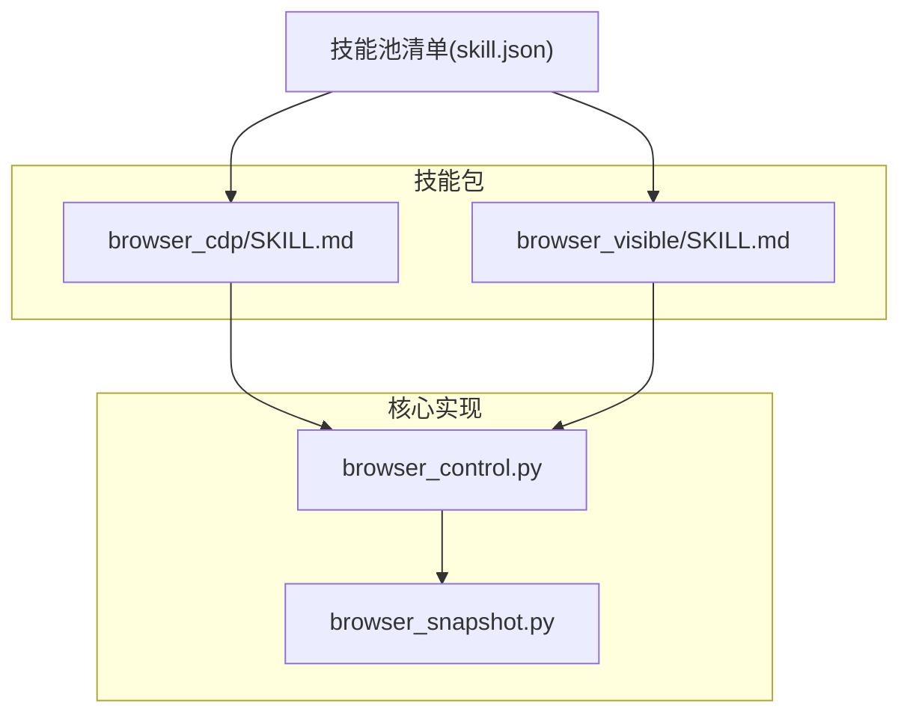
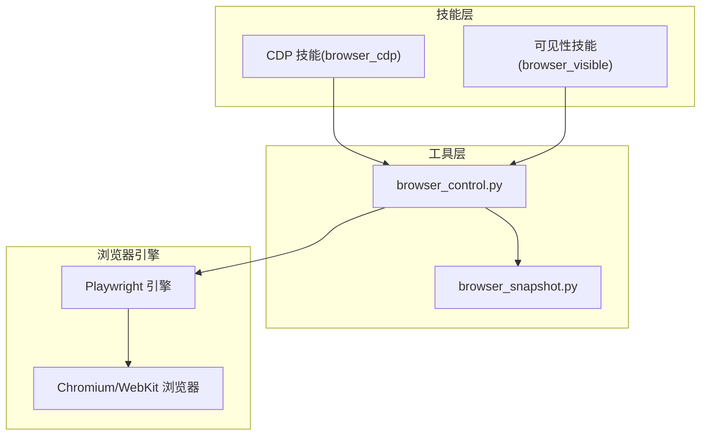
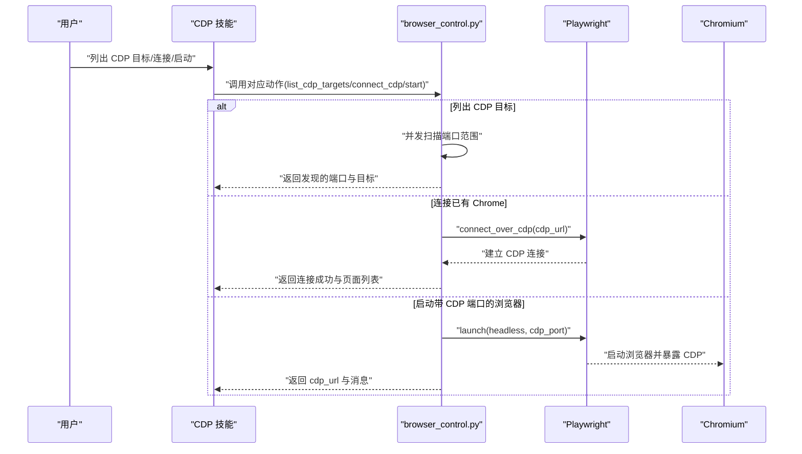
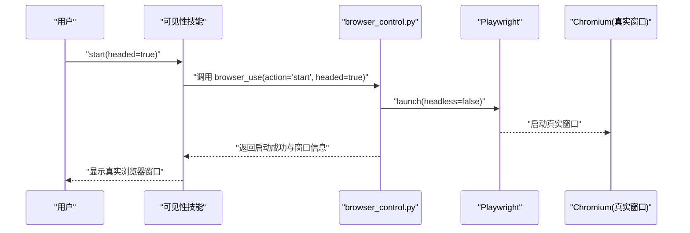
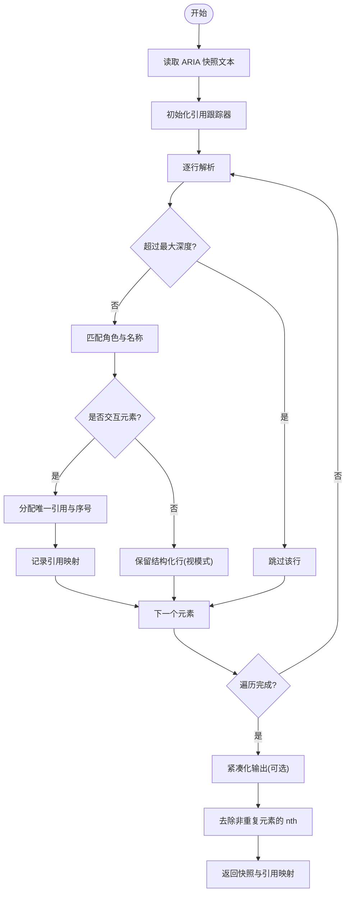
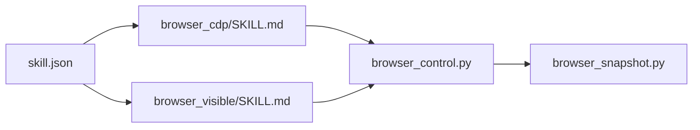

# 浏览器操作技能

<cite>
**本文档引用的文件**
- [browser_cdp/SKILL.md](file://working/skill_pool/browser_cdp/SKILL.md)
- [browser_visible/SKILL.md](file://working/skill_pool/browser_visible/SKILL.md)
- [browser_control.py](file://src/copaw/agents/tools/browser_control.py)
- [browser_snapshot.py](file://src/copaw/agents/tools/browser_snapshot.py)
- [技能池清单](file://working/skill_pool/skill.json)
</cite>

## 目录
1. [简介](#简介)
2. [项目结构](#项目结构)
3. [核心组件](#核心组件)
4. [架构总览](#架构总览)
5. [详细组件分析](#详细组件分析)
6. [依赖关系分析](#依赖关系分析)
7. [性能考量](#性能考量)
8. [故障排查指南](#故障排查指南)
9. [结论](#结论)
10. [附录](#附录)

## 简介
本指南系统阐述 CoPaw 提供的两类浏览器操作技能：CDP（Chrome DevTools Protocol）技能与可见性浏览器技能。前者面向需要与现有浏览器实例共享或进行远程调试的场景，具备高精度页面交互能力；后者面向需要真实窗口可视化的演示、调试与人工协作场景。文档将从架构、数据流、处理逻辑、集成点、错误处理与性能特性等方面进行深入解析，并给出适用场景对比、配置参数说明、使用方法与最佳实践，辅以流程图与时序图帮助理解。

## 项目结构
两类技能均以“技能包”形式提供，位于工作区 skill_pool 中，技能描述采用 Markdown 格式，核心实现位于 agents/tools 下的浏览器工具模块中。技能池清单文件记录内置技能元数据，便于统一管理与版本追踪。

图表来源
- [browser_cdp/SKILL.md:1-182](file://working/skill_pool/browser_cdp/SKILL.md#L1-L182)
- [browser_visible/SKILL.md:1-49](file://working/skill_pool/browser_visible/SKILL.md#L1-L49)
- [browser_control.py:1-200](file://src/copaw/agents/tools/browser_control.py#L1-L200)
- [browser_snapshot.py:1-200](file://src/copaw/agents/tools/browser_snapshot.py#L1-L200)
- [技能池清单:1-23](file://working/skill_pool/skill.json#L1-L23)

章节来源
- [browser_cdp/SKILL.md:1-182](file://working/skill_pool/browser_cdp/SKILL.md#L1-L182)
- [browser_visible/SKILL.md:1-49](file://working/skill_pool/browser_visible/SKILL.md#L1-L49)
- [browser_control.py:1-200](file://src/copaw/agents/tools/browser_control.py#L1-L200)
- [browser_snapshot.py:1-200](file://src/copaw/agents/tools/browser_snapshot.py#L1-L200)
- [技能池清单:1-23](file://working/skill_pool/skill.json#L1-L23)

## 核心组件
- 浏览器控制工具（browser_control.py）
  - 提供统一的浏览器生命周期管理（启动、停止、切换模式）、页面操作（打开、导航、等待、截图）、交互操作（点击、输入、拖拽、悬停、选择选项）、快照生成与引用管理、网络与控制台日志收集、对话框与文件选择器处理等。
  - 支持同步/异步双模式，Windows/Uvicorn 热重载环境下自动切换至同步模式以规避兼容性问题。
  - 维护每个工作区的浏览器状态字典，包括 Playwright 实例、浏览器实例、上下文、页面集合、引用映射、活动时间戳、空闲看门狗任务等。
- 浏览器快照工具（browser_snapshot.py）
  - 基于 Playwright ARIA 快照构建可交互角色树快照，提取交互元素并分配唯一引用标识，支持紧凑输出与深度裁剪，便于后续基于引用的精确交互。

章节来源
- [browser_control.py:1-200](file://src/copaw/agents/tools/browser_control.py#L1-L200)
- [browser_control.py:800-1000](file://src/copaw/agents/tools/browser_control.py#L800-L1000)
- [browser_snapshot.py:1-200](file://src/copaw/agents/tools/browser_snapshot.py#L1-L200)
- [browser_snapshot.py:185-249](file://src/copaw/agents/tools/browser_snapshot.py#L185-L249)

## 架构总览
两类技能共享同一套浏览器控制与快照基础设施，差异在于启动模式与连接方式：
- CDP 技能：通过 Playwright 连接现有 Chrome（connect_cdp）或启动暴露 CDP 端口的浏览器（start + cdp_port），允许多工具共享同一浏览器上下文。
- 可见性技能：以 headed 模式启动真实窗口，适合演示、调试与人工协作。

图表来源
- [browser_cdp/SKILL.md:1-182](file://working/skill_pool/browser_cdp/SKILL.md#L1-L182)
- [browser_visible/SKILL.md:1-49](file://working/skill_pool/browser_visible/SKILL.md#L1-L49)
- [browser_control.py:1-200](file://src/copaw/agents/tools/browser_control.py#L1-L200)
- [browser_snapshot.py:1-200](file://src/copaw/agents/tools/browser_snapshot.py#L1-L200)

## 详细组件分析

### CDP 技能（Chrome DevTools Protocol）
- 适用场景
  - 用户明确要求连接到已运行的 Chrome、扫描本地 CDP 端口、或以暴露 CDP 端口的方式启动浏览器。
  - 需要与其他 agent 或外部工具共享同一浏览器实例。
  - 需要对外可见/可调试的浏览器。
- 核心能力
  - 扫描本地 CDP 端口（默认 9000–10000，支持单端口与范围扫描，异步并发探测）。
  - 连接已有 Chrome（connect_cdp），不干扰原进程，断开时仅断连 Playwright。
  - 启动带 CDP 端口的浏览器（start + cdp_port），暴露端口供其他工具连接。
  - 统一的浏览器生命周期管理与页面操作接口，支持快照、点击、输入、截图等。
- 隐私与安全
  - 默认模式（start 不带 cdp_port）：浏览器完全由 Playwright 私有管理，历史记录、Cookies、登录态不会暴露。
  - CDP 模式（start + cdp_port 或 connect_cdp）：任何能访问该端口的程序均可读取完整历史记录、Cookies、当前页面内容、已保存密码等敏感信息，仅在受信本地环境使用。
- 单实例限制
  - 同一 workspace 同时只能运行或连接一个浏览器；切换时需先执行 stop。
- 数据持久化
  - 三种启动方式复用同一工作区 user_data_dir，Cookies 复用；CDP 模式下对外可访问。

图表来源
- [browser_cdp/SKILL.md:49-134](file://working/skill_pool/browser_cdp/SKILL.md#L49-L134)
- [browser_control.py:2823-2880](file://src/copaw/agents/tools/browser_control.py#L2823-L2880)
- [browser_control.py:2882-2971](file://src/copaw/agents/tools/browser_control.py#L2882-L2971)

章节来源
- [browser_cdp/SKILL.md:1-182](file://working/skill_pool/browser_cdp/SKILL.md#L1-L182)
- [browser_control.py:2810-2880](file://src/copaw/agents/tools/browser_control.py#L2810-L2880)
- [browser_control.py:2882-2971](file://src/copaw/agents/tools/browser_control.py#L2882-L2971)

### 可见性浏览器技能
- 适用场景
  - 用户明确希望打开真实可见的浏览器窗口（非后台无头模式）。
  - 需要亲眼看到页面加载、点击、填表等过程（演示、调试、教学）。
  - 需要与可见页面交互（如登录、验证码等需人工参与的场景）。
- 使用方式
  - 先以 headed=true 启动浏览器，出现真实窗口。
  - 再按需打开页面并进行操作（open/snapshot/click/type 等）。
  - 使用完毕后调用 stop 关闭浏览器。
- 与默认（无头）模式的区别
  - 默认：{"action": "start"} 无头模式，不弹出窗口。
  - 可见：{"action": "start", "headed": true} 有界面窗口。
- 注意事项
  - 若当前已有浏览器在运行，需要先 stop 再以 headed:true 重新 start，才能切换到可见窗口。
  - 可见模式会占用桌面并需要图形环境，服务器或无图形环境可能无法使用。

图表来源
- [browser_visible/SKILL.md:13-49](file://working/skill_pool/browser_visible/SKILL.md#L13-L49)
- [browser_control.py:660-697](file://src/copaw/agents/tools/browser_control.py#L660-L697)
- [browser_control.py:800-817](file://src/copaw/agents/tools/browser_control.py#L800-L817)

章节来源
- [browser_visible/SKILL.md:1-49](file://working/skill_pool/browser_visible/SKILL.md#L1-L49)
- [browser_control.py:660-697](file://src/copaw/agents/tools/browser_control.py#L660-L697)
- [browser_control.py:800-817](file://src/copaw/agents/tools/browser_control.py#L800-L817)

### 页面快照与引用机制
- 快照构建
  - 基于 Playwright 的 aria_snapshot 输出，提取交互元素（按钮、链接、文本框、复选框、单选框、组合框、列表框、菜单项、选项、搜索框、滑块、数值微调框、开关、标签页、树形项等）并分配唯一引用标识。
  - 支持交互模式（仅交互元素）、紧凑输出（去除无名称结构化节点）、最大深度限制等选项。
- 引用去重与优化
  - 对同角色/名称的重复元素自动添加 nth 序号，避免歧义。
  - 对非重复元素自动去除不必要的 nth 标记，保持快照简洁。
- 输出格式
  - 返回增强后的树形快照与引用映射，便于后续 click、type、hover、drag 等基于引用的操作。

图表来源
- [browser_snapshot.py:185-249](file://src/copaw/agents/tools/browser_snapshot.py#L185-L249)

章节来源
- [browser_snapshot.py:1-200](file://src/copaw/agents/tools/browser_snapshot.py#L1-L200)
- [browser_snapshot.py:185-249](file://src/copaw/agents/tools/browser_snapshot.py#L185-L249)

## 依赖关系分析
- 技能到实现的依赖
  - CDP 技能与可见性技能均依赖 browser_control.py 提供的统一浏览器控制能力。
  - browser_control.py 依赖 browser_snapshot.py 进行页面快照与引用管理。
- 技能池管理
  - 技能池清单记录内置技能的版本、签名、更新时间等元数据，便于统一导入与更新。

图表来源
- [browser_cdp/SKILL.md:1-182](file://working/skill_pool/browser_cdp/SKILL.md#L1-L182)
- [browser_visible/SKILL.md:1-49](file://working/skill_pool/browser_visible/SKILL.md#L1-L49)
- [browser_control.py:1-200](file://src/copaw/agents/tools/browser_control.py#L1-L200)
- [browser_snapshot.py:1-200](file://src/copaw/agents/tools/browser_snapshot.py#L1-L200)
- [技能池清单:1-23](file://working/skill_pool/skill.json#L1-L23)

章节来源
- [技能池清单:1-23](file://working/skill_pool/skill.json#L1-L23)

## 性能考量
- 并发扫描 CDP 端口：使用异步 gather 并发探测端口范围（默认 9000–10000），提升发现效率。
- 空闲回收：浏览器在长时间无活动后自动停止，释放渲染进程资源，避免内存泄漏与资源累积。
- 模式选择：CDP 模式具备更高的页面交互精度与可观测性，但需承担隐私与安全风险；可见性模式适合演示与人工协作，但会占用桌面与图形资源。
- 平台差异：Windows/Uvicorn 热重载环境自动启用同步 Playwright，避免异步子进程兼容性问题。

## 故障排查指南
- CDP 连接中断
  - 现象：操作返回“CDP 连接丢失”，提示重新 connect_cdp。
  - 处理：根据提示重新执行 connect_cdp，确保端口未被占用且 Chrome 仍以 --remote-debugging-port 启动。
- 端口扫描无结果
  - 现象：list_cdp_targets 返回未找到。
  - 处理：扩大扫描范围（port_min/port_max），或确认 Chrome 是否以 --remote-debugging-port=N 启动。
- 启动失败
  - 现象：start 返回失败信息。
  - 处理：检查浏览器可执行路径、权限、端口占用、容器环境限制等。
- 单实例冲突
  - 现象：提示已有浏览器运行或已通过 CDP 连接。
  - 处理：先执行 stop，再进行相应启动或连接操作。

章节来源
- [browser_cdp/SKILL.md:161-182](file://working/skill_pool/browser_cdp/SKILL.md#L161-L182)
- [browser_control.py:2823-2880](file://src/copaw/agents/tools/browser_control.py#L2823-L2880)
- [browser_control.py:819-922](file://src/copaw/agents/tools/browser_control.py#L819-L922)

## 结论
- CDP 技能适合需要高精度页面交互、多工具共享浏览器上下文与远程调试的场景，但需严格评估隐私与安全风险。
- 可见性技能适合演示、调试与人工协作场景，提供真实窗口体验，但需满足图形环境要求。
- 两类技能共享统一的浏览器控制与快照基础设施，具备一致的生命周期管理与操作接口，便于在不同场景间灵活切换。

## 附录

### 适用场景对比与最佳实践
- CDP 技能
  - 适用：自动化测试、CI/CD、多 agent 协作、远程调试。
  - 最佳实践：仅在受信本地环境启用 CDP；合理设置端口范围；及时 stop 释放资源；注意单实例限制。
- 可见性技能
  - 适用：演示、教学、人工验证、验证码处理。
  - 最佳实践：确保图形环境可用；必要时先 stop 再以 headed:true 重新启动；使用完毕及时关闭。

### 配置参数说明（关键参数）
- CDP 技能
  - list_cdp_targets：port、port_min、port_max
  - connect_cdp：cdp_url
  - start：cdp_port（可选）
- 可见性技能
  - browser_use：action=start，headed=true
- 通用参数（部分）
  - open：url、page_id
  - snapshot：full_page、include_static、snapshot_filename
  - click/type/drag/hover/select_option：ref 或 selector
  - screenshot：filename、full_page、screenshot_type

章节来源
- [browser_cdp/SKILL.md:49-134](file://working/skill_pool/browser_cdp/SKILL.md#L49-L134)
- [browser_visible/SKILL.md:13-49](file://working/skill_pool/browser_visible/SKILL.md#L13-L49)
- [browser_control.py:2973-3008](file://src/copaw/agents/tools/browser_control.py#L2973-L3008)