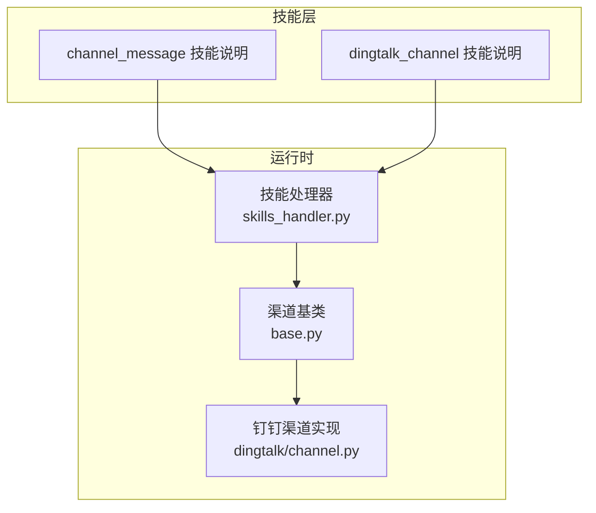
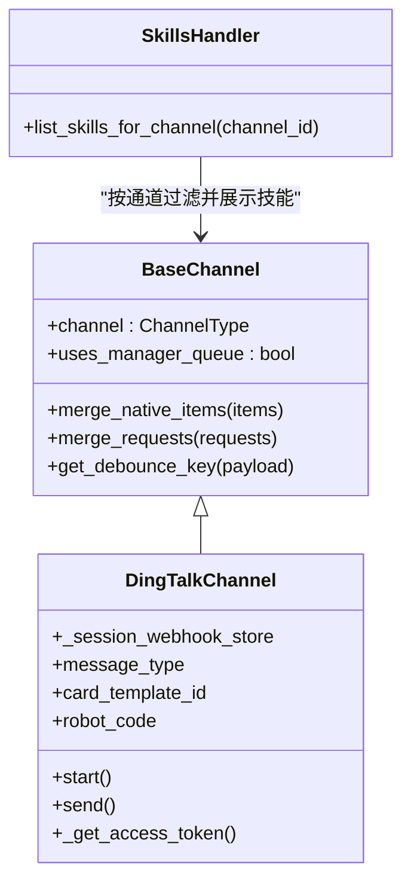
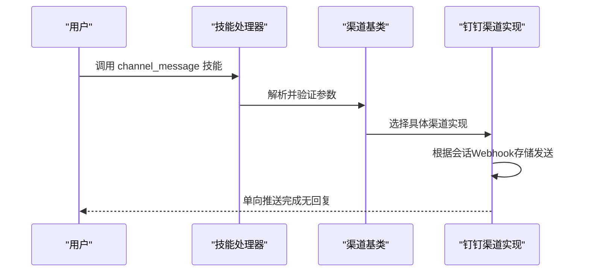
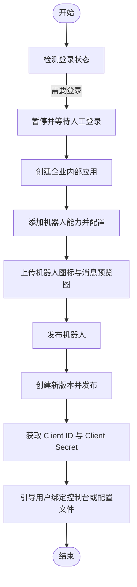
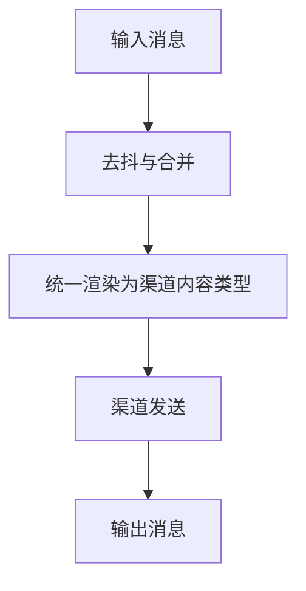
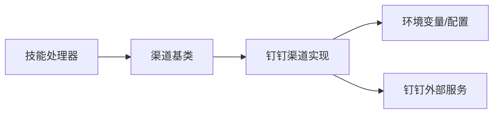

# 通信渠道技能

<cite>
**本文引用的文件**
- [channel_message 技能说明](file://src/copaw/agents/skills/channel_message/SCILL.md)
- [dingtalk_channel 技能说明](file://src/copaw/agents/skills/dingtalk_channel/SCILL.md)
- [钉钉渠道实现](file://src/copaw/app/channels/dingtalk/channel.py)
- [渠道基类](file://src/copaw/app/channels/base.py)
- [技能处理器](file://src/copaw/app/runner/control_commands/skills_handler.py)
</cite>

## 目录
1. [引言](#引言)
2. [项目结构](#项目结构)
3. [核心组件](#核心组件)
4. [架构总览](#架构总览)
5. [详细组件分析](#详细组件分析)
6. [依赖关系分析](#依赖关系分析)
7. [性能考量](#性能考量)
8. [故障排查指南](#故障排查指南)
9. [结论](#结论)
10. [附录](#附录)

## 引言
本文件系统性梳理 CoPaw 提供的通信渠道技能，重点覆盖两类能力：
- 通用渠道消息技能：面向所有已接入渠道的一致性消息发送能力，强调“单向推送、无需回复”的特性与正确使用场景。
- 钉钉渠道专用技能：通过可视化浏览器自动化完成钉钉应用创建、机器人配置、凭证获取与绑定，确保渠道接入的可重复与可审计。

文档将解释消息在系统内的流转路径、渠道适配与消息格式转换、错误处理策略，并给出典型使用场景与多渠道协同的最佳实践。

## 项目结构
围绕通信渠道技能与实现的相关目录与文件：
- 技能说明文档：位于 agents/skills 下的 channel_message 与 dingtalk_channel 目录，提供使用指南、参数说明与常见问题。
- 渠道实现：位于 app/channels 下，其中 dingtalk 子模块实现钉钉渠道的接收、处理与发送逻辑。
- 渠道基类：位于 app/channels/base.py，统一了消息类型、渲染器、去抖与合并策略等通用能力。
- 技能调度：位于 app/runner/control_commands/skills_handler.py，负责加载技能清单并在通道中启用相应技能。

**图表来源**
- [技能处理器:47-90](file://src/copaw/app/runner/control_commands/skills_handler.py#L47-L90)
- [渠道基类:70-200](file://src/copaw/app/channels/base.py#L70-L200)
- [钉钉渠道实现:89-200](file://src/copaw/app/channels/dingtalk/channel.py#L89-L200)

**章节来源**
- [技能处理器:47-90](file://src/copaw/app/runner/control_commands/skills_handler.py#L47-L90)
- [渠道基类:70-200](file://src/copaw/app/channels/base.py#L70-L200)
- [钉钉渠道实现:89-200](file://src/copaw/app/channels/dingtalk/channel.py#L89-L200)

## 核心组件
- 通用渠道消息技能
  - 功能定位：在用户明确要求或需要主动通知时，向指定用户/会话/频道单向推送消息。
  - 使用前提：必须先通过会话查询接口获取目标 user_id 与 session_id，再进行发送。
  - 关键参数：发送方 agent-id、目标渠道、目标用户、目标会话、消息正文。
  - 行为特征：单向推送、无回复、需遵循“先查会话、再发送”的流程。
- 钉钉渠道专用技能
  - 功能定位：通过可视化浏览器自动化完成钉钉应用创建、机器人能力配置、凭证获取与绑定。
  - 自动化约束：必须以可视浏览器模式启动、遇到登录页需暂停等待人工确认、配置变更后必须“创建新版本并发布”。
  - 图片上传策略：支持本地路径与网络链接，严格校验尺寸、比例与格式；失败时暂停并要求人工上传。
  - 绑定方式：控制台前端配置或配置文件方式，凭证由用户手动填写。

**章节来源**
- [channel_message 技能说明:10-108](file://src/copaw/agents/skills/channel_message/SCILL.md#L10-L108)
- [dingtalk_channel 技能说明:11-193](file://src/copaw/agents/skills/dingtalk_channel/SCILL.md#L11-L193)

## 架构总览
CoPaw 的消息通道体系以“渠道基类 + 具体渠道实现 + 技能调度”为核心：
- 渠道基类统一抽象消息类型、渲染样式、去抖与合并策略，并提供通用的发送/接收框架。
- 各渠道（如钉钉）在基类之上扩展接收回调、令牌缓存、会话 Webhook 存储等能力。
- 技能处理器负责加载技能清单，按通道维度过滤并展示可用技能，供用户调用。

**图表来源**
- [渠道基类:70-200](file://src/copaw/app/channels/base.py#L70-L200)
- [钉钉渠道实现:89-200](file://src/copaw/app/channels/dingtalk/channel.py#L89-L200)
- [技能处理器:47-90](file://src/copaw/app/runner/control_commands/skills_handler.py#L47-L90)

## 详细组件分析

### 通用渠道消息技能（channel_message）
- 使用场景
  - 用户明确要求向某渠道/会话发送消息
  - 主动通知（任务完成、提醒、告警、状态更新）
  - 将异步结果回推至已有会话
- 流程与规则
  - 必须先查询会话：copaw chats list
  - 从结果中提取 user_id 与 session_id，优先选择最近活跃的会话
  - 使用 copaw channels send 发送消息，单向推送、无回复
- 参数与命令
  - copaw chats list：按渠道或用户筛选
  - copaw channels send：必填 agent-id、channel、target-user、target-session、text
- 常见错误
  - 将正常回复误用为 channel send
  - 未查询会话直接发送
  - 缺少必填参数
  - 期望发送后获得回复
  - 多个会话时随意选择

**图表来源**
- [渠道基类:70-200](file://src/copaw/app/channels/base.py#L70-L200)
- [钉钉渠道实现:89-200](file://src/copaw/app/channels/dingtalk/channel.py#L89-L200)
- [技能处理器:47-90](file://src/copaw/app/runner/control_commands/skills_handler.py#L47-L90)

**章节来源**
- [channel_message 技能说明:40-108](file://src/copaw/agents/skills/channel_message/SCILL.md#L40-L108)
- [渠道基类:70-200](file://src/copaw/app/channels/base.py#L70-L200)
- [钉钉渠道实现:89-200](file://src/copaw/app/channels/dingtalk/channel.py#L89-L200)

### 钉钉渠道专用技能（dingtalk_channel_connect）
- 自动化流程
  - 打开钉钉开发者后台，检测登录状态并暂停等待人工登录
  - 创建企业内部应用，填写应用信息（名称、描述）
  - 添加机器人能力，开启机器人配置，上传图标与消息预览图
  - 设置消息接收模式为 Stream 模式，发布机器人
  - 创建新版本并发布，确保配置生效
  - 获取 Client ID 与 Client Secret，引导用户绑定
- 图片上传策略
  - 支持本地路径与网络链接，先下载再上传
  - 严格校验尺寸、比例与格式；失败时暂停并要求人工上传
  - 优先点击 avatar 触发上传，再执行 file_upload
- 绑定方式
  - 控制台前端：在“控制 -> 频道 -> DingTalk”中填写 Client ID 与 Client Secret
  - 配置文件：编辑 ~/.copaw/config.json 的 channels.dingtalk 字段

**图表来源**
- [dingtalk_channel 技能说明:92-193](file://src/copaw/agents/skills/dingtalk_channel/SCILL.md#L92-L193)

**章节来源**
- [dingtalk_channel 技能说明:11-193](file://src/copaw/agents/skills/dingtalk_channel/SCILL.md#L11-L193)

### 渠道适配与消息格式转换
- 消息类型统一
  - 渠道基类定义了统一的内容类型（文本、图片、视频、音频、文件、拒绝等），便于跨渠道渲染与发送。
- 去抖与合并
  - 对同一会话的连续消息进行时间去抖与内容合并，减少冗余与提升体验。
- 钉钉特有机制
  - 会话 Webhook 存储用于主动推送；AI 卡模板与卡片自动布局支持富交互消息。
  - 令牌缓存与并发安全保证 API 请求稳定性。

**图表来源**
- [渠道基类:128-176](file://src/copaw/app/channels/base.py#L128-L176)
- [钉钉渠道实现:89-200](file://src/copaw/app/channels/dingtalk/channel.py#L89-L200)

**章节来源**
- [渠道基类:128-176](file://src/copaw/app/channels/base.py#L128-L176)
- [钉钉渠道实现:89-200](file://src/copaw/app/channels/dingtalk/channel.py#L89-L200)

## 依赖关系分析
- 技能到渠道的依赖
  - 技能处理器根据通道 ID 过滤启用的技能，确保只展示当前通道可用的能力。
  - 渠道基类为所有具体渠道提供统一接口与通用能力。
- 渠道到外部服务的依赖
  - 钉钉渠道依赖 dingtalk_stream SDK、钉钉 OAuth 令牌、会话 Webhook 等外部资源。
- 配置与环境变量
  - 渠道启用与凭证通过环境变量或配置文件注入，确保最小权限与可审计。

**图表来源**
- [技能处理器:47-90](file://src/copaw/app/runner/control_commands/skills_handler.py#L47-L90)
- [渠道基类:70-200](file://src/copaw/app/channels/base.py#L70-L200)
- [钉钉渠道实现:89-200](file://src/copaw/app/channels/dingtalk/channel.py#L89-L200)

**章节来源**
- [技能处理器:47-90](file://src/copaw/app/runner/control_commands/skills_handler.py#L47-L90)
- [渠道基类:70-200](file://src/copaw/app/channels/base.py#L70-L200)
- [钉钉渠道实现:89-200](file://src/copaw/app/channels/dingtalk/channel.py#L89-L200)

## 性能考量
- 去抖与合并
  - 对同一会话的消息进行时间去抖与内容合并，降低重复渲染与发送次数。
- 令牌缓存
  - 钉钉访问令牌实例级缓存，避免频繁请求导致的延迟与限流风险。
- 并发与线程模型
  - 渠道实现采用事件循环与线程分离，保证高并发下的稳定性与响应性。

## 故障排查指南
- 常见问题与处理
  - 未查询会话直接发送：先执行会话查询，获取 user_id 与 session_id。
  - 缺少必填参数：确保 agent-id、channel、target-user、target-session、text 均已提供。
  - 期望获得回复：channel send 为单向推送，不会返回用户回复。
  - 多个会话时随意选择：优先选择最近活跃的会话。
  - 钉钉登录中断：遇到登录页时暂停，等待人工登录后再继续。
  - 图片不合规：暂停并要求人工上传符合规范的图片。
  - 未发布配置：配置变更后必须“创建新版本并发布”。
- 错误定位建议
  - 检查环境变量与配置文件中的渠道凭证是否正确。
  - 查看渠道日志与令牌获取状态，确认外部服务可用性。
  - 在钉钉侧核对应用与机器人的发布状态与权限范围。

**章节来源**
- [channel_message 技能说明:154-179](file://src/copaw/agents/skills/channel_message/SCILL.md#L154-L179)
- [dingtalk_channel 技能说明:169-193](file://src/copaw/agents/skills/dingtalk_channel/SCILL.md#L169-L193)

## 结论
CoPaw 的通信渠道技能通过“通用消息推送 + 钉钉自动化接入”的组合，实现了跨平台消息发送、接收与处理的统一框架。通用技能强调“先查会话、再发送”的安全流程与单向推送特性；钉钉技能则通过可视化自动化确保接入过程的可重复与可审计。结合去抖、合并与令牌缓存等优化策略，系统在多渠道协同场景下具备良好的稳定性与可维护性。

## 附录
- 实际使用场景示例
  - 工作通知：任务完成后主动推送结果摘要。
  - 进度汇报：将异步分析结果回推至指定会话。
  - 团队协作：在钉钉中创建应用与机器人，配置凭证并绑定，实现跨会话的持续通知。
- 多渠道协同最佳实践
  - 明确区分“双向对话”与“单向推送”，避免滥用 channel send。
  - 在不同渠道间保持一致的消息格式与渲染风格，提升用户体验。
  - 对关键配置（如钉钉凭证）采用最小权限与可审计的绑定方式。